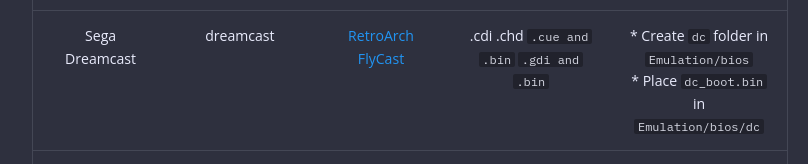
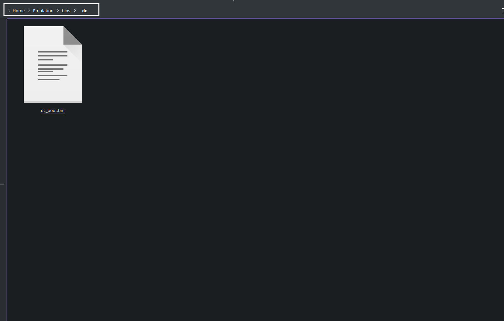

---
search:
    boost: 400 
---

<!--If you would like to edit this page, the tables are located in the docs/tables folder -->
<!--You may open the CSV files in any spreadsheet editor such as Excel, Google Spreadsheets, or LibreOffice-->

# The Cheat Sheet is Your Tool to Success.

***

## What this page covers

* Emulator or RetroArch core names
* Expected ROM folder locations
* Expected ROM file types
* Expected BIOS (if required)
* Expected BIOS location
    * Typically, BIOS files are placed directly into the `Emulation/bios` folder. **Do not** make or use any additional folders unless otherwise specified on the charts below

***

## Cheat Sheet Table of Contents

[TOC]

***

## How to Use the Cheat Sheets
[Back to the Top](#cheat-sheet-table-of-contents)

### How to Use the Cheat Sheets Table of Contents

- [How to Use the Tables](#how-to-use-the-tables)
- [Where do I place the BIOS files?](#where-do-i-place-the-bios-files)
- [For systems with multiple emulators, how do I select which emulator to use?](#for-systems-with-multiple-emulators-how-do-i-select-which-emulator-to-use)
- [A Breakdown of Libretro Wiki Pages](#a-breakdown-of-libretro-wiki-pages)
- [What is the difference between a RetroArch core and a standalone emulator?](#what-is-the-difference-between-a-retroarch-core-and-a-standalone-emulator)

***

### How to Use The Tables
[Back to the Top](#how-to-use-the-cheat-sheets-table-of-contents)

* BIOS files are placed directly into the `Emulation/bios` folder. **Do not** make or use any additional folders unless otherwise specified on the charts below
* If the BIOS column contains: `Not Required`, BIOS files are not required to play the respective system
* If the BIOS column contains: `Optional`, BIOS files may add console intros or menu functionality, but you will be able to play games without them
* The chart can be scrolled horizontally
* In many cases, BIOS names are case sensitive. Match the casing to the `BIOS` column in the chart
* In some cases, BIOS must be named a specific way. Match the file name to the `BIOS` column in the chart
* To distinguish from RetroArch cores, standalone emulators are indicated in bold and are written with: `(Standalone)`
* If you are on a computer, press `CTRL` + `F` or `CMD` + `F` together to search the chart
    * 

***

### Where do I get the BIOS files?

Legally, BIOS must be obtained from your console. Various emulator websites have guides on how to dump BIOS. Other methods are **piracy** and **cannot be discussed** here or on the EmuDeck Discord. 

Here are a list of resources for the various consoles:

* Microsoft Xbox (OG)
    * [http://wiki.redump.org/index.php?title=Microsoft_Xbox_and_Xbox_360_Dumping_Guide](http://wiki.redump.org/index.php?title=Microsoft_Xbox_and_Xbox_360_Dumping_Guide)
* Nintendo DS
    * [https://dumping.guide/carts/nintendo/ds](https://dumping.guide/carts/nintendo/ds)
* Nintendo Switch
    * [https://yuzu-emu.org/help/quickstart/](https://yuzu-emu.org/help/quickstart/)
* Nintendo Wii U
    * [https://cemu.cfw.guide/using-dumpling.html](https://cemu.cfw.guide/using-dumpling.html) 
* PlayStation 1
    * [https://www.ngemu.com/threads/psx-bios-dumping-guide.93161/](https://www.ngemu.com/threads/psx-bios-dumping-guide.93161/) 
* PlayStation 2
    * [https://pcsx2.net/docs/setup/gather#how-to-dump-your-ps2-bios](https://pcsx2.net/docs/setup/gather#how-to-dump-your-ps2-bios)

***

### Where do I place the BIOS files?

BIOS files are placed directly into the `Emulation/bios` folder. **Do not** make or use any additional folders unless otherwise specified on the charts below.

[Skip to the Charts](#cheat-sheets)

Read through the following sections for a quick run-down of when to and when not to place BIOS directly into `Emulation/bios`.

- [Where do I find the Emulation/bios folder?](#where-do-i-find-the-emulationbios-folder)
- [When to place BIOS Files directly into Emulation/bios](#when-to-place-bios-files-directly-into-emulationbios)
- [When to create a subfolder](#when-to-create-a-subfolder)
- [What do "Not Required" and "Optional" mean?](#what-do-not-required-and-optional-mean)

#### Where do I find the Emulation/bios folder?

**On a Steam Deck**

To navigate to the SD Card or a removable storage device, you can click `rootfs` on the left side in Dolphin (file explorer) and follow one of the below paths.

* Internal SSD
    * `/home/deck/Emulation/bios`
* SD Card
    * `/run/media/SDCARDNAME/Emulation/bios`
        * Your `SDCARDNAME` may be `mmcblk0p1`
* Removable Storage Device
    * `/run/media/deck/DEVICENAME/Emulation/bios`

**On Linux**

* Internal SSD
    * `$HOME/Emulation/bios`
* SD Card
    * `/run/media/$USERNAME/SDCARDNAME/Emulation/bios`
* Removable Storage Device
    * `/run/media/$USERNAME/DEVICENAME/Emulation/bios`

**On Windows**

* Internal SSD
    * `%USERPROFILE%\Emulation\bios`
* Removable Storage Device or SD Card
    * `DRIVELETTER:\Emulation\bios`

#### When to place BIOS Files directly into Emulation/bios

For some BIOS, you will need to place the BIOS files **directly** into the BIOS folder. **Do not** use a subfolder. A subfolder is a folder either pre-created in `Emulation/bios` or a folder you will need to create according to the tables below. Creating or using a subfolder is rare. 

For BIOS that need to be placed **directly** into `Emulation/bios`, **do not** create or use a subfolder. Place your BIOS files **directly** in the `Emulation/bios` folder. If a table on this page **does not** explicitly say to use a subfolder, place your BIOS files **directly** into the BIOS folder. 

For example, the photo below instructs you to **place** `sega_101.bin` (if you are playing JP games) or `mpr-17933.bin` (if you are playing US/EU games) **directly** into the `Emulation/bios` folder. **Do not** make a subfolder.

In `Emulation/bios`:

#### When to create a subfolder

For some BIOS, you will need to use a subfolder. A subfolder is a folder either pre-created in `Emulation/bios` or a folder you will need to create according to the tables below. Creating or using a subfolder is rare. 

For the most part, you will simply need to place the BIOS files **directly** into `Emulation/bios`. If a table on this page **explicitly** says to create or use a subfolder, place your BIOS files into the subfolder within `Emulation/bios`. 

For example, the photo below instructs you to **create** a `dc` folder in `Emulation/bios` and to place `dc_boot.bin` directly into `Emulation/bios/dc`. 

In `Emulation/bios/dc`:

***

#### What do "Not Required" and "Optional" mean?

When "Not Required" is written in the BIOS column, it means the emulator will run games without the BIOS.

When "Optional" is written in the BIOS column, it means the emulator might have some extra functionality or will play the console's splash screen when you launch a game, but will run games without the BIOS.

In the table below, you can see that the Dolphin emulator does not require BIOS to play Wii games, but the Gamecube BIOS are optional.

***

### For systems with multiple emulators, how do I select which emulator to use?
[Back to the Top](#how-to-use-the-cheat-sheets-table-of-contents)

For systems with both standalone and RetroArch core options, or multiple standalone options:

#### Steam ROM Manager

These systems will have multiple parsers, each corresponding to a different emulator or RetroArch core.

For example: PSX can be played through DuckStation (Standalone), SwanStation, or Beetle PSX. If you prefer to use DuckStation (Standalone) for PSX, enable the `Sony PlayStation - DuckStation` parser and make sure the `SwanStation` and `Beetle PSX` parsers are disabled.

#### ES-DE

These systems will have a set default.

 However, you can change which emulator or RetroArch core is used:

1. In `ES-DE`, press the `Start` button
2. Scroll down and select `Other Settings`
3. Select `Alternative Emulators`
4. Scroll down to the system you would like to configure, press `B`, and select your preferred emulator

***

### A Breakdown of Libretro Wiki Pages
[Back to the Top](#how-to-use-the-cheat-sheets-table-of-contents)

When reading a Libretro wiki article, the `System` directory refers to `Emulation/bios`. Treat the `Emulation/bios` folder as the `System` directory and either place your files directly in `Emulation/bios` or create a folder according to the instructions on the various Libretro wiki pages.

***

### What is the difference between a RetroArch core and a standalone emulator?
[Back to the Top](#how-to-use-the-cheat-sheets-table-of-contents)

It mostly comes down to preference.

**RetroArch:** RetroArch comes with a suite of shaders, bezels, cohesive hotkeys across the cores. A lot of small general emulator enhancements with an emphasis on a cohesive experience (for better or for worse).

**Standalone emulators:** Standalone emulators tend to be more up to date, more bleeding edge with the latest improvements to whatever that emulator emulates. Standalone emulators tend to come with a lot of additional features for the specific console it emulates. For example, melonDS features native microphone support. In the case of systems with both RetroArch cores and standalone emulators available, the standalone emulator usually also provides better overall performance than the RetroArch core.

***

### List of RetroArch Cores Used by EmuDeck
[Back to the Top](#cheat-sheet-table-of-contents)

{{ read_csv('list-of-retroarch-cores.csv') }}

***

## Cheat Sheets
[Back to the Top](#cheat-sheet-table-of-contents)

***

### Arcade and MAME Related Emulation Cheat Sheet
[Back to the Top](#cheat-sheet-table-of-contents)

***

{{ read_csv('arcade-and-mame-related-emulation-cheat-sheet.csv') }}

* #### Final Burn Neo
* #### MAME 2003
* #### MAME 2010
* #### MAME Current
* #### MAME (Standalone)
* #### Philips CD-i
* #### Tiger Electronics Game.com
* #### VTech V.Smile

***

### Atari Cheat Sheet
[Back to the Top](#cheat-sheet-table-of-contents)

{{ read_csv('atari-cheat-sheet.csv') }}

***

### Bandai Cheat Sheet

{{ read_csv('bandai-cheat-sheet.csv') }}

***

### Game Engine Recreations Cheat Sheet
[Back to the Top](#cheat-sheet-table-of-contents)

{{ read_csv('game-engine-recreations-cheat-sheet.csv') }}

* #### DooM
* #### EasyRPG
* #### Pico-8
* #### ScummVM

***

### Mattel Cheat Sheet
[Back to the Top](#cheat-sheet-table-of-contents)

{{ read_csv('mattel-cheat-sheet.csv') }}

* #### Mattel Electronics Intellivison

***

### Microsoft Cheat Sheet
[Back to the Top](#cheat-sheet-table-of-contents)

{{ read_csv('microsoft-cheat-sheet.csv') }}

* #### Microsoft Xbox
* #### Microsoft Xbox 360
* #### Microsoft MSX 1
* #### Microsoft MSX 2

***

### NEC Cheat Sheet
[Back to the Top](#cheat-sheet-table-of-contents)

{{ read_csv('nec-cheat-sheet.csv') }}

* #### NEC TurboGrafx-16 / PC Engine 
* #### TurboGrafx-16 / PC Engine CD
* #### NEC SuperGrafx

***

### Nintendo Cheat Sheet
[Back to the Top](#cheat-sheet-table-of-contents)

{{ read_csv('nintendo-cheat-sheet.csv') }}

***

### Panasonic Cheat Sheet
[Back to the Top](#cheat-sheet-table-of-contents)

{{ read_csv('panasonic-cheat-sheet.csv') }}

* #### Panasonic 3DO

***

### Personal Computers Cheat Sheet
[Back to the Top](#cheat-sheet-table-of-contents)

{{ read_csv('personal-computers-cheat-sheet.csv') }}

***

### Sega Cheat Sheet
[Back to the Top](#cheat-sheet-table-of-contents)

{{ read_csv('sega-cheat-sheet.csv') }}

***

### SNK Cheat Sheet
[Back to the Top](#cheat-sheet-table-of-contents)

{{ read_csv('snk-cheat-sheet.csv') }}

* #### SNK Neo Geo CD
* #### SNK Neo Geo Pocket
* #### SNK Neo Geo Pocket Color

***

### Sony Cheat Sheet
[Back to the Top](#cheat-sheet-table-of-contents)

{{ read_csv('sony-cheat-sheet.csv') }}

*** 
