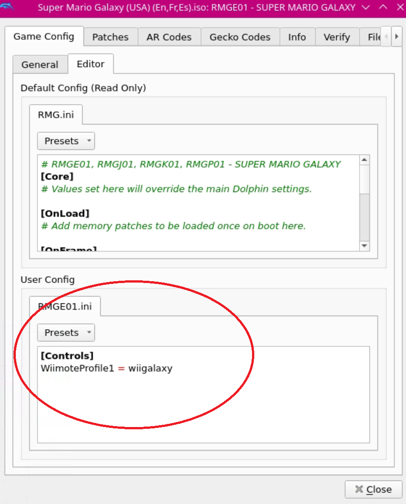
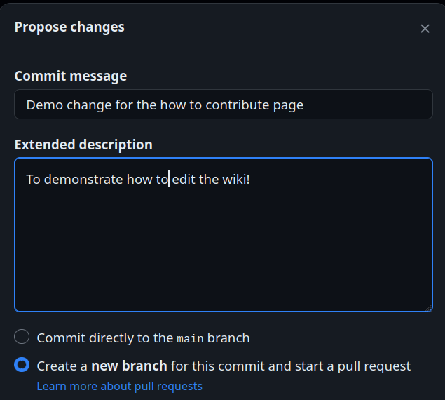

# Community Creations, cool things made by you! 

***

## Community Creations Table of Contents

[TOC]


***

## Steam Input Profiles
[Back to the Top](#community-creations-table-of-contents)

***

### How to Share and Download Steam Input Profiles
[Back to the Top](#community-creations-table-of-contents)

This section will go over how to share and post your Steam Input profiles on this page. 

**Tutorial**

#### How to Locate Steam Input Profiles
[Back to the Top](#how-to-share-and-download-steam-input-profiles)

1. Create a new Steam Input Layout in Game Mode
2. After you are finished, press the Gear icon on the controller layout screen, click `Export Layout`, change `Export Type` to `New Personal Save`
	* 
	* 
    * 
3. Switch to Desktop Mode
4. Open the `/home/deck/.local/share/Steam/steamapps/common/Steam Controller Configs/STEAMUSERID/config/` folder
	* `STEAMUSERID` is a random string of numbers associated with your Steam account. It is unique to your profile
    * `~/.local` is an invisible folder by default. In Dolphin (file manager), click the hamburger menu in the top right, click `Show Hidden Files` to see these folders 
5. Locate the folder associated with your game
	* If you do not see it, it may be one of the folders with a random string of numbers
6. Copy the template in the folder to another folder of your choice
    * Rename the copied file to something descriptive, like the profile name created in Step 1
7. Right click, click click `Open with Kate` or a text editor of your choice
8. Edit the top part of the file using the following template: 
	* The `FILENAME.VDF` should match the actual name of the file

**Template:**

```json
"controller_mappings"
{
	"version"		leave this alone
	"revision"		leave this alone
	"title"		        leave this alone
	"description"		leave this alone
	"creator"		leave this alone
	"progenitor"		leave this alone
	"url"		       "template://FILENAME.vdf"
	"export_type"		"template"
	"controller_type"		"controller_neptune"
	"major_revision"	leave this alone
	"minor_revision"	leave this alone
	"Timestamp"		leave this alone
	"localization"
```

**Sample:**

```json
"controller_mappings"
{
	"version"		"3"
	"revision"		"21"
	"title"		"EmuDeck - PPSSPP Standalone"
	"description"		"Left Touchpad quick actions. Long press to perform an action"
	"creator"		"76561198025051816"
	"progenitor"		""
	"url"		        "template://ppsspp_controller_config.vdf"
	"export_type"		"template"
	"controller_type"		"controller_neptune"
	"major_revision"		"0"
	"minor_revision"		"0"
	"Timestamp"		"4"
	"localization"
```

#### How to Share Steam Input Profiles
[Back to the Top](#how-to-share-and-download-steam-input-profiles)

You will need to **create** a GitHub account first.

1. Open [https://github.com/EmuDeck/emudeck.github.io/blob/main/docs/community-creations/steamos/community-creations.md](https://github.com/EmuDeck/emudeck.github.io/blob/main/docs/community-creations/steamos/community-creations.md)
2. Click the `Pencil` icon in the top right
3. Create a new section below the most recently added profile section using 5 `#####` hashes for your section with a descriptive and simple title
	* For example: `#### Nintendo 64 Controller`
	* Your section will be added to the [Table of Contents](#community-creations-table-of-contents) automatically
4. Open your Steam Input profile in `Kate` or a text editor of your choice
5. Paste the contents of the file into your newly created section, include a brief description and any prerequisites 
6. Place three \` at the top and the bottom of the pasted profile, refer to [Nintendo 64 Controller](#nintendo-64-controller) as an example
7. Once you are finished making your changes, click the `Commit changes...` button in the top right
8. You will be prompted to create a `Pull Request`. Add a little bit of detail about what you added and why
9. Submit your `Pull Request` when you are ready. When it is reviewed, it will be merged and your changes will automatically be deployed to the website

***

#### How to Download Steam Input Profiles
[Back to the Top](#how-to-share-and-download-steam-input-profiles)

1. Open the Steam input folder, `/home/deck/.local/share/Steam/controller_base/templates` folder
	* `~/.local` is a hidden folder by default, click the hamburger menu in the top right, click `Show Hidden Files` to un-hide it
2. If a download button exists for the profile you would like to use, simply click the download button and place it in the folder in Step 1. You may skip Steps 3-6
3. Copy the contents of a profile you would like to use by clicking the copy icon in the top right
4. In this folder: `/home/deck/.steam/steam/controller_base/templates`, right click, `Create New`, `Text File`
5. Paste the contents of a profile you would like to use
6. Save the profile, matching the profile name in the section exactly, with a `.vdf` file extension
	* Without the `.vdf` file extension, the profile will not work
7. You now have successfully downloaded a profile and the profile will automatically display in your list of Steam Input profiles in Game Mode 

***

### Community Steam Input Profiles 
[Back to the Top](#community-creations-table-of-contents)

***

#### Nintendo 64 Controller
[Back to the Top](#community-creations-table-of-contents)

Credit: `Piximator` 

This Steam input profile is for the NSO Nintendo 64 Controller, [https://www.nintendo.com/store/products/nintendo-64-controller/](https://www.nintendo.com/store/products/nintendo-64-controller/). 

**Download:** [nintendo switch online n64 controller.vdf](../../community-creations-files/mysmg.vdf){:download="nintendo-switch-online-n64-controller.vdf"}

**Profile Name:** `nintendo-switch-online-n64-controller.vdf`

```json
"controller_mappings"
{
    "version"       "3"
    "revision"      "20"
    "title"     "Nintendo Switch Online N64 Controller"
    "description"       "For use with the official NSO N64 controller in RetroArch. Uses default EmuDeck bindings."
    "creator"       "76561199036238022"
    "progenitor"        ""
    "url"       "template://nintendo switch online n64 controller.vdf"
    "export_type"       "template"
	"controller_type"		"controller_generic"
	"controller_caps"		"546833399"
	"major_revision"		"0"
	"minor_revision"		"0"
	"Timestamp"		"1502372160"
	"localization"
	{
		"english"
		{
			"title"		"Gamepad"
			"description"		"This template is for games that already have built-in gamepad support.  Intended for dual stick games such as twin-stick shooters, side-scrollers, etc."
		}
		"czech"
		{
			"title"		"Gamepad"
			"description"		"Tato šablona je pro většinu her podporujících gamepad a byla navržena pro použití ve hrách využívajících dvě páčky, jakými jsou například plošinovky nebo automatové hry."
		}
		"danish"
		{
			"title"		"Gamepad"
			"description"		"Denne skabelon er til spil, der allerede har indbygget gamepad-understøttelse. Beregnet til spil med dobbelte styrepinde såsom twin-stick shooters, side-scrollers osv."
		}
		"dutch"
		{
			"title"		"Gamepad"
			"description"		"Deze template is voor spellen die al ingebouwde gamepadondersteuning hebben. Bedoeld voor dual-stick spellen zoals twin-stick-shooters, side-scrollers, etc."
		}
		"finnish"
		{
			"title"		"Ohjain"
			"description"		"Tämä malli on muita ohjaimia valmiiksi tukeville peleille. Se on tarkoitettu kahta sauvaa käyttäville peleille, kuten twin-stick shooterit, side-scrollerit, jne."
		}
		"french"
		{
			"title"		"Manette"
			"description"		"Ce modèle fonctionne pour les jeux conçus pour manettes à deux sticks tels que les jeux de type twin-stick shooter, à défilement horizontal (side-scrollers), etc."
		}
		"german"
		{
			"title"		"Gamepad"
			"description"		"Diese Vorlage ist für Spiele konzipiert, die bereits volle Unterstützung für Gamepads mit sich bringen. Gedacht für Zwei-Analogstick-Spiele wie Twin-Stick-Shooter, Side-Scrollers usw."
		}
		"hungarian"
		{
			"title"		"Gamepad"
			"description"		"Ez a sablon olyan játékokhoz való, melyek már rendelkeznek beépített gamepad-támogatással. Olyan két karos játékokhoz szánva, mint a kétkaros vagy oldalnézetes lövöldözős játékok stb."
		}
		"italian"
		{
			"title"		"Controller"
			"description"		"Questo modello funziona per la maggior parte dei giochi che supportano i controller in modalità nativa."
		}
		"japanese"
		{
			"title"		"ゲームパッド"
			"description"		"このテンプレートは、標準でゲームパッドをサポートしているツインスティックシューターや横スクロール等といったデュアルスティックゲームを対象としたゲーム向けです。"
		}
		"koreana"
		{
			"title"		"게임패드"
			"description"		"게임 패드를 지원하도록 설계된 게임들을 위한 설정입니다. 이중 스틱 슈팅 게임, 사이드 스크롤 게임 등 스틱을 두 개 쓰는 게임을 염두에 두고 만들어졌습니다."
		}
		"polish"
		{
			"title"		"Kontroler"
			"description"		"Ten szablon jest odpowiedni dla gier, które już mają wbudowane wsparcie dla kontrolerów. Przeznaczony dla gier obsługujących dwie gałki, m.in. twin-stick shootery, side-scrollery itp."
		}
		"portuguese"
		{
			"title"		"Comando"
			"description"		"Este modelo é indicado para jogos que já têm compatibilidade nativa com comando. Foi concebido para jogos de tiros que usam dois sticks, jogos de plataformas, de naves, etc."
		}
		"romanian"
		{
			"title"		"Gamepad"
			"description"		"Șablonul acesta este pentru jocurile care au deja suport pentru gamepad implementat. Destinat pentru jocuri dual stick, precum shooter-e twin-stick, side-scroller, etc."
		}
		"russian"
		{
			"title"		"Геймпад"
			"description"		"Этот шаблон подходит для большинства игр с поддержкой геймпада — например, для шутеров с видом сверху или сбоку."
		}
		"spanish"
		{
			"title"		"Mando"
			"description"		"Esta plantilla es para juegos que ya incluyen de serie compatibilidad con mando. Está destinada a juegos de doble stick como twin-stick shooters, side-scrollers, etc."
		}
		"swedish"
		{
			"title"		"Gamepad"
			"description"		"Denna mall är för spel som redan har inbyggt stöd för spelkontroller. Avsett för spel som använder två styrspakar, som twin-stick shooters och side-scrollers, etc."
		}
		"schinese"
		{
			"title"		"手柄"
			"description"		"该模板适用于已内置手柄支持的游戏。针对双摇杆游戏，如双摇杆射击游戏、横版过关游戏等设计。"
		}
		"thai"
		{
			"title"		"เกมแพด"
		}
		"brazilian"
		{
			"title"		"Controle padrão"
			"description"		"Este modelo é para jogos já compatíveis com controle que usam ambas as alavancas, como jogos de nave, etc."
		}
		"bulgarian"
		{
			"title"		"Геймпад"
			"description"		"Този шаблон е за игри, които вече имат вградена поддръжка на геймпад. Предназначен e за игри ползващи двата стика. Като например, екшъни за два аналогови стика, странични скролери и т.н."
		}
		"greek"
		{
			"title"		"Χειριστήριο"
			"description"		"Αυτό το πρότυπο ορίζεται για παιχνίδια τα οποία έχουν ήδη υποστήριξη χειριστηρίου. Προορίζεται για παιχνίδια dual-stick όπως twin-stick shooters, side-scrollers, κλπ."
		}
		"turkish"
		{
			"title"		"Oyun Kumandası"
			"description"		"Bu şablon hali hazırda oyun içi oyun kumandası desteği ve birincil veya üçüncü kişi kontrollü kameraya sahip oyunlar içindir. Çift çubuk kullanılan oyunlar olan ikiz çubuk nişancılık, side-scroller oyunlar vb. içindir."
		}
		"ukrainian"
		{
			"title"		"Ґеймпад"
			"description"		"Цей шаблон для більшості ігор, в яких вже вбудовано підтримку ґеймпада. Призначено для ігор з керуванням двома стіками."
		}
	}
	"group"
	{
		"id"		"0"
		"mode"		"four_buttons"
		"name"		""
		"description"		""
		"inputs"
		{
			"button_a"
			{
				"activators"
				{
					"Full_Press"
					{
						"bindings"
						{
							"binding"		"xinput_button A, , "
						}
					}
				}
				"disabled_activators"
				{
				}
			}
			"button_b"
			{
				"activators"
				{
					"Full_Press"
					{
						"bindings"
						{
							"binding"		"xinput_button X, , "
						}
					}
				}
				"disabled_activators"
				{
				}
			}
			"button_x"
			{
				"activators"
				{
					"Full_Press"
					{
						"bindings"
						{
							"binding"		"xinput_button RSTICK_LEFT, , "
						}
					}
				}
				"disabled_activators"
				{
				}
			}
			"button_y"
			{
				"activators"
				{
					"Full_Press"
					{
						"bindings"
						{
							"binding"		"xinput_button RSTICK_UP, , "
						}
					}
				}
				"disabled_activators"
				{
				}
			}
		}
	}
	"group"
	{
		"id"		"1"
		"mode"		"dpad"
		"name"		""
		"description"		""
		"inputs"
		{
			"dpad_north"
			{
				"activators"
				{
					"Full_Press"
					{
						"bindings"
						{
							"binding"		"xinput_button dpad_up, , "
						}
						"settings"
						{
							"haptic_intensity"		"1"
						}
					}
				}
				"disabled_activators"
				{
				}
			}
			"dpad_south"
			{
				"activators"
				{
					"Full_Press"
					{
						"bindings"
						{
							"binding"		"xinput_button dpad_down, , "
						}
						"settings"
						{
							"haptic_intensity"		"1"
						}
					}
				}
				"disabled_activators"
				{
				}
			}
			"dpad_east"
			{
				"activators"
				{
					"Full_Press"
					{
						"bindings"
						{
							"binding"		"xinput_button dpad_right, , "
						}
						"settings"
						{
							"haptic_intensity"		"1"
						}
					}
				}
				"disabled_activators"
				{
				}
			}
			"dpad_west"
			{
				"activators"
				{
					"Full_Press"
					{
						"bindings"
						{
							"binding"		"xinput_button dpad_left, , "
						}
						"settings"
						{
							"haptic_intensity"		"1"
						}
					}
				}
				"disabled_activators"
				{
				}
			}
		}
	}
	"group"
	{
		"id"		"2"
		"mode"		"joystick_move"
		"name"		""
		"description"		""
		"inputs"
		{
			"click"
			{
				"activators"
				{
					"Full_Press"
					{
						"bindings"
						{
							"binding"		"xinput_button JOYSTICK_RIGHT, , "
						}
						"settings"
						{
							"haptic_intensity"		"2"
						}
					}
				}
				"disabled_activators"
				{
				}
			}
		}
	}
	"group"
	{
		"id"		"3"
		"mode"		"joystick_move"
		"name"		""
		"description"		""
		"inputs"
		{
			"click"
			{
				"activators"
				{
					"Full_Press"
					{
						"bindings"
						{
							"binding"		"xinput_button JOYSTICK_LEFT, , "
						}
						"settings"
						{
							"haptic_intensity"		"2"
						}
					}
					"Full_Press"
					{
						"bindings"
						{
							"binding"		"xinput_button JOYSTICK_RIGHT, , "
						}
					}
				}
				"disabled_activators"
				{
				}
			}
		}
	}
	"group"
	{
		"id"		"4"
		"mode"		"trigger"
		"name"		""
		"description"		""
		"inputs"
		{
			"click"
			{
				"activators"
				{
					"Full_Press"
					{
						"bindings"
						{
							"binding"		"xinput_button TRIGGER_LEFT, , "
						}
						"settings"
						{
							"haptic_intensity"		"2"
						}
					}
				}
				"disabled_activators"
				{
				}
			}
		}
		"settings"
		{
			"output_trigger"		"1"
		}
	}
	"group"
	{
		"id"		"5"
		"mode"		"trigger"
		"name"		""
		"description"		""
		"inputs"
		{
			"click"
			{
				"activators"
				{
					"Full_Press"
					{
						"bindings"
						{
							"binding"		"xinput_button RSTICK_DOWN, , "
						}
						"settings"
						{
							"haptic_intensity"		"2"
						}
					}
				}
				"disabled_activators"
				{
				}
			}
		}
		"settings"
		{
			"output_trigger"		"2"
		}
	}
	"group"
	{
		"id"		"6"
		"mode"		"joystick_move"
		"name"		""
		"description"		""
		"inputs"
		{
			"click"
			{
				"activators"
				{
					"Full_Press"
					{
						"bindings"
						{
							"binding"		"xinput_button JOYSTICK_RIGHT, , "
						}
						"settings"
						{
							"haptic_intensity"		"2"
						}
					}
				}
				"disabled_activators"
				{
				}
			}
		}
	}
	"group"
	{
		"id"		"8"
		"mode"		"joystick_move"
		"name"		""
		"description"		""
		"inputs"
		{
			"click"
			{
				"activators"
				{
					"Full_Press"
					{
						"bindings"
						{
							"binding"		"xinput_button JOYSTICK_RIGHT, , "
						}
					}
				}
				"disabled_activators"
				{
				}
			}
		}
	}
	"group"
	{
		"id"		"9"
		"mode"		"dpad"
		"name"		""
		"description"		""
		"inputs"
		{
			"dpad_north"
			{
				"activators"
				{
					"Full_Press"
					{
						"bindings"
						{
							"binding"		"xinput_button DPAD_UP, , "
						}
						"settings"
						{
							"haptic_intensity"		"1"
						}
					}
				}
				"disabled_activators"
				{
				}
			}
			"dpad_south"
			{
				"activators"
				{
					"Full_Press"
					{
						"bindings"
						{
							"binding"		"xinput_button DPAD_DOWN, , "
						}
						"settings"
						{
							"haptic_intensity"		"1"
						}
					}
				}
				"disabled_activators"
				{
				}
			}
			"dpad_east"
			{
				"activators"
				{
					"Full_Press"
					{
						"bindings"
						{
							"binding"		"xinput_button DPAD_RIGHT, , "
						}
						"settings"
						{
							"haptic_intensity"		"1"
						}
					}
				}
				"disabled_activators"
				{
				}
			}
			"dpad_west"
			{
				"activators"
				{
					"Full_Press"
					{
						"bindings"
						{
							"binding"		"xinput_button DPAD_LEFT, , "
						}
						"settings"
						{
							"haptic_intensity"		"1"
						}
					}
				}
				"disabled_activators"
				{
				}
			}
		}
		"settings"
		{
			"requires_click"		"0"
			"haptic_intensity_override"		"0"
		}
	}
	"group"
	{
		"id"		"10"
		"mode"		"radial_menu"
		"name"		"N64"
		"description"		""
		"inputs"
		{
		}
	}
	"group"
	{
		"id"		"7"
		"mode"		"switches"
		"name"		""
		"description"		""
		"inputs"
		{
			"button_escape"
			{
				"activators"
				{
					"Full_Press"
					{
						"bindings"
						{
							"binding"		"xinput_button start, , "
						}
					}
				}
				"disabled_activators"
				{
				}
			}
			"button_menu"
			{
				"activators"
				{
					"Full_Press"
					{
						"bindings"
						{
							"binding"		"xinput_button RSTICK_RIGHT, , "
						}
					}
				}
				"disabled_activators"
				{
				}
			}
			"left_bumper"
			{
				"activators"
				{
					"Full_Press"
					{
						"bindings"
						{
							"binding"		"xinput_button shoulder_left, , "
						}
					}
				}
				"disabled_activators"
				{
				}
			}
			"right_bumper"
			{
				"activators"
				{
					"Full_Press"
					{
						"bindings"
						{
							"binding"		"xinput_button shoulder_right, , "
						}
					}
				}
				"disabled_activators"
				{
				}
			}
			"button_back_left"
			{
				"activators"
				{
					"Full_Press"
					{
						"bindings"
						{
							"binding"		"xinput_button a, , "
						}
					}
				}
				"disabled_activators"
				{
				}
			}
			"button_back_right"
			{
				"activators"
				{
					"Full_Press"
					{
						"bindings"
						{
							"binding"		"xinput_button x, , "
						}
					}
				}
				"disabled_activators"
				{
				}
			}
		}
	}
	"preset"
	{
		"id"		"0"
		"name"		"Default"
		"group_source_bindings"
		{
			"7"		"switch active"
			"0"		"button_diamond active"
			"3"		"joystick active"
			"10"		"joystick inactive"
			"4"		"left_trigger active"
			"5"		"right_trigger active"
			"8"		"right_joystick active"
			"9"		"dpad active"
		}
	}
	"settings"
	{
		"left_trackpad_mode"		"0"
		"right_trackpad_mode"		"0"
	}
}
```

***

#### My SMG
[Back to the Top](#community-creations-table-of-contents)

Credit: `drone1313`

Used in tandem with the Super Mario Galaxy profile, [Super Mario Galaxy 1 and 2](#super-mario-galaxy-1-and-2), for the Dolphin emulator. If you download the profile, it will show up for any shortcut (EmulationStation-DE included) added to Steam. 

Alternatively, if you have added Super Mario Galaxy or Super Mario Galaxy 2 to Steam through Steam ROM Manager, you may also select the below profile in the `Community Layouts` tab. If you select this method, you do not need to download the below profile. 

**Download:** [mysmg.vdf](../../community-creations-files/mysmg.vdf){:download="mysmg.vdf"}

Profile Name: `mysmg.vdf`

```json
"controller_mappings"
{
	"version"		"3"
	"revision"		"48"
	"title"		"My SMG"
	"description"		"LB crouch/pound, RB spin, LT shoot, RT hold to enable gyro tilt on LS, RS controls cursor as does gyro"
	"creator"		"76561199036238022"
	"progenitor"		""
	"url"		"template://mysmg.vdf"
	"export_type"		"template"
	"controller_type"		"controller_neptune"
	"controller_caps"		"23117823"
	"major_revision"		"0"
	"minor_revision"		"0"
	"Timestamp"		"-822800272"
	"localization"
	{
		"english"
		{
			"title"		"Gamepad with Mouse Trackpad"
			"description"		"The template works best for games that are designed with a gamepad in mind. The right trackpad will be bound to mouse emulation which may not work in all games."
		}
		"czech"
		{
			"title"		"Gamepad s přesným ovládáním zaměřováním/kamery"
			"description"		"Tato šablona je pro hry vytvořené pro ovládání gamepadem, ale podporující také myš pro ovládání kamery nebo míření. V této šabloně je využito pravého trackpadu ovladače pro přesné ovládání zmíněné kamery nebo míření."
		}
		"danish"
		{
			"title"		"Gamepad med højpræcisionskamera/-sigte"
			"description"		"Denne skabelon virker bedst med spil, der er designet med en gamepad i tankerne, som også understøtter en mus til kamerastyring eller sigte. Denne skabelon gør bedst brug af fladen på højre side af din controller til præcis sigte og kamerastyring."
		}
		"dutch"
		{
			"title"		"Gamepad met zeer precieze camera/vizier"
			"description"		"Het sjabloon werkt het beste met spellen die zijn ontworpen met ondersteuning voor een gamepad, maar die ook een desktopmuis ondersteunen voor camerabesturing of om te richten. Hiermee profiteer je het meeste van de rechterpad van je controller voor nauwkeurig richten en camerabesturing."
		}
		"finnish"
		{
			"title"		"Ohjain korkeatarkkuuksisella kameralla/tähtäimellä"
			"description"		"Tämä malli sopii parhaiten peleille, jotka on suunniteltu ohjaimille, mutta jotka hyötyvät hiiren tarkkuudesta. Tämä malli ottaa suurimman hyödyn irti ohjainlevyistä."
		}
		"french"
		{
			"title"		"Manette avec une caméra/visée de haute précision"
			"description"		"Ce modèle fonctionne particulièrement bien pour les jeux conçus pour un certain type de manette mais qui sont également compatibles avec une souris pour le contrôle de la caméra et la visée. Grâce au modèle, vous pourrez profiter du côté droit du pad de votre contrôleur pour une visée précise et le contrôle de la caméra."
		}
		"german"
		{
			"title"		"Gamepad mit hochpräziser Kamera/Zielgenauigkeit"
			"description"		"Diese Vorlage funktioniert am besten mit Spielen, die für die Steuerung mit einem Gamepad ausgelegt sind, jedoch ebenfalls Unterstützung für eine Maus zur Kamerabewegung oder zum Zielen besitzen. Somit können Sie das rechte Pad Ihres Controllers zum genauen Zielen und Steuern der Kamera nutzen."
		}
		"hungarian"
		{
			"title"		"Gamepad nagy pontosságú kamerával/célzással"
			"description"		"Ez a sablon gamepadhez tervezett játékokkal működik a legjobban, de támogat egeret is a kamerairányításhoz vagy célzáshoz. Ez használja ki a legjobban játékvezérlőd jobb oldali felületét pontos célzáshoz és kamerairányításhoz."
		}
		"italian"
		{
			"title"		"Controller con telecamera/mirino ad alta precisione"
			"description"		"Il template si applica idealmente ai giochi progettati per l'utilizzo del controller, ma supporta anche un mouse da desktop per le funzioni di mirino e controllo della telecamera. Grazie a questo template potrete sfruttare il lato destro del trackpad per prendere la mira con precisione e controllare la telecamera."
		}
		"japanese"
		{
			"title"		"高精度のカメラ/エイム機能を持つゲームパッド"
			"description"		"ゲームパッドでの操作を中心にデザインされていて、カメラ操作もしくはエイムをデスクトップマウスでも行えるゲームに最適なテンプレートです。正確なエイミングとカメラ操作をコントローラの右側のパッドを使用して行えます。"
		}
		"koreana"
		{
			"title"		"정밀 카메라/조준 기능이 있는 게임 패드"
			"description"		"이 설정은 게임 패드의 사용을 염두에 두고 만들어진 게임을 플레이할 때 가장 적합하지만 카메라 조정이나 조준을 돕기 위해 마우스도 지원합니다. 컨트롤러의 우측 패드로 정밀 조준과 카메라 조정을 할 때 이 설정을 쓰는 것이 좋습니다."
		}
		"polish"
		{
			"title"		"Kontroler, wysoka precyzja poruszania kamerą / celowania"
			"description"		"Ten szablon będzie działać najlepiej dla gier, które zostały zaprojektowane z myślą o kontrolerze, ale wspierają także myszkę do poruszania kamerą lub celowania. Wykorzysta to w najlepszy sposób prawy panel dotykowy twojego kontrolera do precyzyjnego celowania i sterowania kamerą."
		}
		"portuguese"
		{
			"title"		"Comando com câmara/mira precisa"
			"description"		"Este modelo é indicado para jogos concebidos com o uso do comando em mente, mas que também permitem o uso de um rato para apontar ou controlar a câmara. Logo, este modelo tirará um melhor proveito do pad direito do teu comando para controlos de câmara e mira precisos."
		}
		"romanian"
		{
			"title"		"Gamepad cu cameră/țintă de precizie înaltă"
			"description"		"Șablonul funcționează cel mai bine pentru jocuri care sunt proiectate pentru gamepad, dar care suportă și mouse pentru desktop, cu scopul de a controla camera sau a fixa ținta. Acesta va face cea mai bună treabă, profitând anume de partea dreaptă a pad-ului pentru a ținti cu precizie și a controla camera."
		}
		"russian"
		{
			"title"		"Геймпад с высокоточными осями"
			"description"		"Этот шаблон подходит для игр, разработанных под контроллер и поддерживающих управление камерой и прицеливание с помощью компьютерной мыши. Для достижения максимальной точности будет использоваться правый трекпад."
		}
		"spanish"
		{
			"title"		"Mando con cámara/apuntado de alta precisión"
			"description"		"La plantilla funciona mejor con juegos que han sido diseñados con un mando en mente, pero también es compatible con un ratón de escritorio para controlar la cámara y apuntar. En concreto, sacará el mejor partido aprovechando el pad derecho del mando para apuntar con precisión y controlar la cámara."
		}
		"swedish"
		{
			"title"		"Gamepad med högprecisionskamera/sikte"
			"description"		"Mallen fungerar bäst för spel som designats med en gamepad i åtanke, men även stödjer mus för kamerakontroll eller sikte. Denna är bäst på att dra fördel av den högra plattan på din handkontroll för noggrant siktande och kamerakontroll."
		}
		"schinese"
		{
			"title"		"高精度视角/瞄准手柄"
			"description"		"此模板在那些为手柄设计，但也支持鼠标控制视角和瞄准的游戏上最为合适。此模板将最大化限度利用您控制器上的右侧十字键，将其用于精确瞄准以及视角控制。"
		}
		"thai"
		{
			"title"		"เกมแพดพร้อมมุมกล้องหรือการเล็งแบบความแม่นยำสูง"
			"description"		"แม่แบบนี้ทำงานได้ดีที่สุดสำหรับเกมที่ออกแบบมาสำหรับเกมแพดเป็นหลัก แต่ยังคงรองรับเมาส์ของเดสก์ทอปสำหรับการควมคุมกล้องหรือการเล็งยิงด้วย นี่จะทำงานได้ดีที่สุดจากการใช้ประโยชน์จากแพดขวาบนคอนโทรลเลอร์ของคุณโดยเฉพาะ สำหรับการเล็งยิงและการควบคุมกล้องอย่างแม่นยำ"
		}
		"brazilian"
		{
			"title"		"Controle com câmera/mira precisa"
			"description"		"Este modelo funciona melhor em jogos projetados para controles, mas que permitem o uso de um mouse para controlar a câmera ou a mira, tirando assim proveito do trackpad direito do seu controle para mira e controle de câmera precisos."
		}
		"bulgarian"
		{
			"title"		"Геймпад с висока точност за камера/прицелване"
			"description"		"Този шаблон върши най-добра работа при игри, които са проектирани, вземайки предвид геймпада, но също така поддържат мишка за управление на камерата или прицелване. Това ще е най-удачно при специфичното възползване от десния пад на контролера Ви за точно прицелване и управление на камерата."
		}
		"greek"
		{
			"title"		"Χειριστήριο με υψηλής ακρίβειας κάμερα/στόχο"
			"description"		"Το πρότυπο αυτό λειτουργεί καλά για παιχνίδια σχεδιασμένα για την χρήση χειριστηρίου αλλά επίσης υποστηρίζει ποντίκι για τον έλεγχο κάμερας ή την στόχευση. Αυτό θα δουλέψει καλύτερα χρησιμοποιώντας το pad στην δεξιά πλευρά του χειριστηρίου για ακρίβεια στόχευσης και έλεγχο κάμερας."
		}
		"turkish"
		{
			"title"		"Yüksek Hassasiyetli Kamera/Nişanlı Oyun Kumandası"
			"description"		"Şablon kontrolcü desteği ile tasarlanmış ama aynı zamanda da hedef alma ve kamera kontrolü için masaüstü faresini destekleyen oyunlar için çok iyidir. Bu şablon, özellikle pad'inizin sağ tarafını hassas nişan alma ve kamera kontrolü için en iyi şekilde kullanır."
		}
		"ukrainian"
		{
			"title"		"Ґеймпад з високоточною камерою"
			"description"		"Шаблон працює найкраше з іграми, що були розроблені з урахуванням підтримки ґеймпадів, але також підтримують комп'ютерну мишу для керування камерою та прицілюванням. Особливо, відмінних результатів можна досягти при використанні правої сенсорної панелі вашого ґеймпада для точного прицілювання та керування камерою."
		}
	}
	"group"
	{
		"id"		"0"
		"mode"		"four_buttons"
		"name"		""
		"description"		""
		"inputs"
		{
			"button_a"
			{
				"activators"
				{
					"Full_Press"
					{
						"bindings"
						{
							"binding"		"xinput_button A, , "
						}
					}
				}
				"disabled_activators"
				{
				}
			}
			"button_b"
			{
				"activators"
				{
					"Full_Press"
					{
						"bindings"
						{
							"binding"		"xinput_button B, , "
						}
					}
				}
				"disabled_activators"
				{
				}
			}
			"button_x"
			{
				"activators"
				{
					"Full_Press"
					{
						"bindings"
						{
							"binding"		"xinput_button X, , "
						}
					}
				}
				"disabled_activators"
				{
				}
			}
			"button_y"
			{
				"activators"
				{
					"Full_Press"
					{
						"bindings"
						{
							"binding"		"xinput_button Y, , "
						}
					}
				}
				"disabled_activators"
				{
				}
			}
		}
	}
	"group"
	{
		"id"		"1"
		"mode"		"dpad"
		"name"		""
		"description"		""
		"inputs"
		{
			"dpad_north"
			{
				"activators"
				{
					"Full_Press"
					{
						"bindings"
						{
							"binding"		"xinput_button dpad_up, , "
						}
						"settings"
						{
							"haptic_intensity"		"1"
						}
					}
				}
				"disabled_activators"
				{
				}
			}
			"dpad_south"
			{
				"activators"
				{
					"Full_Press"
					{
						"bindings"
						{
							"binding"		"xinput_button dpad_down, , "
						}
						"settings"
						{
							"haptic_intensity"		"1"
						}
					}
				}
				"disabled_activators"
				{
				}
			}
			"dpad_east"
			{
				"activators"
				{
					"Full_Press"
					{
						"bindings"
						{
							"binding"		"xinput_button dpad_right, , "
						}
						"settings"
						{
							"haptic_intensity"		"1"
						}
					}
				}
				"disabled_activators"
				{
				}
			}
			"dpad_west"
			{
				"activators"
				{
					"Full_Press"
					{
						"bindings"
						{
							"binding"		"xinput_button dpad_left, , "
						}
						"settings"
						{
							"haptic_intensity"		"1"
						}
					}
				}
				"disabled_activators"
				{
				}
			}
		}
	}
	"group"
	{
		"id"		"2"
		"mode"		"joystick_move"
		"name"		""
		"description"		""
		"inputs"
		{
			"click"
			{
				"activators"
				{
					"Soft_Press"
					{
						"bindings"
						{
							"binding"		"xinput_button JOYSTICK_RIGHT, , "
						}
					}
				}
				"disabled_activators"
				{
				}
			}
		}
	}
	"group"
	{
		"id"		"3"
		"mode"		"joystick_move"
		"name"		""
		"description"		""
		"inputs"
		{
			"click"
			{
				"activators"
				{
					"Full_Press"
					{
						"bindings"
						{
							"binding"		"xinput_button JOYSTICK_LEFT, , "
						}
						"settings"
						{
							"haptic_intensity"		"2"
						}
					}
				}
				"disabled_activators"
				{
				}
			}
		}
		"settings"
		{
			"deadzone_inner_radius"		"7199"
		}
	}
	"group"
	{
		"id"		"4"
		"mode"		"trigger"
		"name"		""
		"description"		""
		"inputs"
		{
		}
		"settings"
		{
			"output_trigger"		"2"
		}
	}
	"group"
	{
		"id"		"5"
		"mode"		"trigger"
		"name"		""
		"description"		""
		"inputs"
		{
		}
		"settings"
		{
			"output_trigger"		"1"
		}
	}
	"group"
	{
		"id"		"6"
		"mode"		"joystick_move"
		"name"		""
		"description"		""
		"inputs"
		{
			"click"
			{
				"activators"
				{
					"Soft_Press"
					{
						"bindings"
						{
							"binding"		"xinput_button JOYSTICK_RIGHT, , "
						}
					}
				}
				"disabled_activators"
				{
				}
			}
		}
	}
	"group"
	{
		"id"		"8"
		"mode"		"joystick_move"
		"name"		""
		"description"		""
		"inputs"
		{
			"click"
			{
				"activators"
				{
					"Full_Press"
					{
						"bindings"
						{
							"binding"		"xinput_button JOYSTICK_RIGHT, , "
						}
					}
				}
				"disabled_activators"
				{
				}
			}
		}
	}
	"group"
	{
		"id"		"9"
		"mode"		"dpad"
		"name"		""
		"description"		""
		"inputs"
		{
			"dpad_north"
			{
				"activators"
				{
					"Full_Press"
					{
						"bindings"
						{
							"binding"		"xinput_button DPAD_UP, , "
						}
						"settings"
						{
							"haptic_intensity"		"1"
						}
					}
				}
				"disabled_activators"
				{
				}
			}
			"dpad_south"
			{
				"activators"
				{
					"Full_Press"
					{
						"bindings"
						{
							"binding"		"xinput_button DPAD_DOWN, , "
						}
						"settings"
						{
							"haptic_intensity"		"1"
						}
					}
				}
				"disabled_activators"
				{
				}
			}
			"dpad_east"
			{
				"activators"
				{
					"Full_Press"
					{
						"bindings"
						{
							"binding"		"xinput_button DPAD_RIGHT, , "
						}
						"settings"
						{
							"haptic_intensity"		"1"
						}
					}
				}
				"disabled_activators"
				{
				}
			}
			"dpad_west"
			{
				"activators"
				{
					"Full_Press"
					{
						"bindings"
						{
							"binding"		"xinput_button DPAD_LEFT, , "
						}
						"settings"
						{
							"haptic_intensity"		"1"
						}
					}
				}
				"disabled_activators"
				{
				}
			}
		}
		"settings"
		{
			"requires_click"		"0"
			"haptic_intensity_override"		"0"
		}
	}
	"group"
	{
		"id"		"10"
		"mode"		"single_button"
		"name"		""
		"description"		""
		"inputs"
		{
			"click"
			{
				"activators"
				{
					"Soft_Press"
					{
						"bindings"
						{
							"binding"		"xinput_button START, , "
						}
					}
				}
				"disabled_activators"
				{
				}
			}
		}
	}
	"group"
	{
		"id"		"11"
		"mode"		"single_button"
		"name"		""
		"description"		""
		"inputs"
		{
			"click"
			{
				"activators"
				{
					"Soft_Press"
					{
						"bindings"
						{
							"binding"		"xinput_button SELECT, , "
						}
					}
				}
				"disabled_activators"
				{
				}
			}
		}
	}
	"group"
	{
		"id"		"12"
		"mode"		"absolute_mouse"
		"name"		""
		"description"		""
		"inputs"
		{
			"click"
			{
				"activators"
				{
					"Soft_Press"
					{
						"bindings"
						{
							"binding"		"mouse_button LEFT, , "
						}
					}
				}
				"disabled_activators"
				{
				}
			}
		}
		"settings"
		{
			"invert_x"		"1"
		}
	}
	"group"
	{
		"id"		"13"
		"mode"		"joystick_camera"
		"name"		""
		"description"		""
		"inputs"
		{
		}
	}
	"group"
	{
		"id"		"15"
		"mode"		"absolute_mouse"
		"name"		""
		"description"		""
		"inputs"
		{
		}
		"settings"
		{
			"gyro_natural_sensitivity"		"89"
			"invert_x"		"1"
			"acceleration"		"1"
			"mouse_smoothing"		"0"
			"gyro_button"		"0"
		}
	}
	"group"
	{
		"id"		"16"
		"mode"		"mouse_joystick"
		"name"		""
		"description"		""
		"inputs"
		{
		}
	}
	"group"
	{
		"id"		"17"
		"mode"		"joystick_mouse"
		"name"		""
		"description"		""
		"inputs"
		{
			"click"
			{
				"activators"
				{
					"Full_Press"
					{
						"bindings"
						{
							"binding"		"xinput_button JOYSTICK_RIGHT, , "
						}
					}
				}
				"disabled_activators"
				{
				}
			}
		}
		"settings"
		{
			"output_joystick"		"2"
			"sensitivity"		"135"
			"sensitivity_horiz_scale"		"52"
			"sensitivity_vert_scale"		"52"
		}
	}
	"group"
	{
		"id"		"7"
		"mode"		"switches"
		"name"		""
		"description"		""
		"inputs"
		{
			"button_escape"
			{
				"activators"
				{
					"Full_Press"
					{
						"bindings"
						{
							"binding"		"xinput_button start, , "
						}
					}
				}
				"disabled_activators"
				{
				}
			}
			"button_menu"
			{
				"activators"
				{
					"Full_Press"
					{
						"bindings"
						{
							"binding"		"xinput_button select, , "
						}
					}
				}
				"disabled_activators"
				{
				}
			}
			"left_bumper"
			{
				"activators"
				{
					"Full_Press"
					{
						"bindings"
						{
							"binding"		"xinput_button SHOULDER_RIGHT, , "
						}
					}
				}
				"disabled_activators"
				{
				}
			}
			"right_bumper"
			{
				"activators"
				{
					"Full_Press"
					{
						"bindings"
						{
							"binding"		"xinput_button SHOULDER_LEFT, , "
						}
					}
				}
				"disabled_activators"
				{
				}
			}
			"button_back_left"
			{
				"activators"
				{
					"Full_Press"
					{
						"bindings"
						{
							"binding"		"xinput_button DPAD_LEFT, , "
						}
					}
				}
				"disabled_activators"
				{
				}
			}
			"button_back_right"
			{
				"activators"
				{
					"Full_Press"
					{
						"bindings"
						{
							"binding"		"xinput_button DPAD_RIGHT, , "
						}
					}
				}
				"disabled_activators"
				{
				}
			}
			"button_back_left_upper"
			{
				"activators"
				{
					"Full_Press"
					{
						"bindings"
						{
							"binding"		"xinput_button SHOULDER_RIGHT, , "
						}
					}
				}
				"disabled_activators"
				{
				}
			}
			"button_back_right_upper"
			{
				"activators"
				{
					"Full_Press"
					{
						"bindings"
						{
							"binding"		"xinput_button A, , "
						}
					}
				}
				"disabled_activators"
				{
				}
			}
			"button_capture"
			{
				"activators"
				{
					"release"
					{
						"bindings"
						{
							"binding"		"controller_action system_key_1, , "
						}
					}
				}
				"disabled_activators"
				{
				}
			}
		}
	}
	"preset"
	{
		"id"		"0"
		"name"		"Default"
		"group_source_bindings"
		{
			"7"		"switch active"
			"0"		"button_diamond active"
			"1"		"left_trackpad active"
			"11"		"left_trackpad inactive"
			"2"		"right_trackpad inactive"
			"6"		"right_trackpad inactive"
			"10"		"right_trackpad inactive"
			"12"		"right_trackpad active"
			"13"		"right_trackpad inactive"
			"16"		"right_trackpad inactive"
			"3"		"joystick active"
			"4"		"left_trigger active"
			"5"		"right_trigger active"
			"8"		"right_joystick inactive"
			"17"		"right_joystick active"
			"9"		"dpad active"
			"15"		"gyro active"
		}
	}
	"settings"
	{
		"left_trackpad_mode"		"0"
		"right_trackpad_mode"		"0"
	}
}
```

***

#### Nintendo 64 Controller - Dolphin Virtual Console
[Back to the Top](#community-creations-table-of-contents)

Credit: `PUGS` 

This Steam input profile is for the NSO Nintendo 64 Controller, [https://www.nintendo.com/store/products/nintendo-64-controller/](https://www.nintendo.com/store/products/nintendo-64-controller/)

This profile is specifically configured for the Nintendo 64 games in the Virtual Console played through the Dolphin emulator. 

The profile is a modified version of [Nintendo 64 Controller](#nintendo-64-controller), the modifications are listed below:

* Switched Right Bumper to Right Trigger
* Switched Left Bumper to Select 
* Adjusted Right Trigger and Left Trigger Settings and turned the Analog Output Trigger to Analog Off 

**Download:** [nintendo-switch-online-n64-controller-dolphin-virtual-console.vdf](../../community-creations-files/nintendo-switch-online-n64-controller-dolphin-virtual-console.vdf){:download="nintendo-switch-online-n64-controller-dolphin-virtual-console.vdf"}

```
"controller_mappings"
{
	"version"		"3"
	"revision"		"29"
	"title"		"Nintendo Switch Online N64 Controller (Dolphin Virtual Console)"
	"description"		"Configured for the Dolphin emulator."
	"creator"		"76561197991007998"
	"progenitor"		""
	"url"		"template://nintendo-switch-online-n64-controller-dolphin-virtual-console.vdf"
	"export_type"		"template"
	"controller_type"		"controller_generic"
	"controller_caps"		"9962487"
	"major_revision"		"0"
	"minor_revision"		"0"
	"Timestamp"		"-843030560"
	"localization"
	{
		"english"
		{
			"title"		"Gamepad"
			"description"		"This template is for games that already have built-in gamepad support.  Intended for dual stick games such as twin-stick shooters, side-scrollers, etc."
		}
		"czech"
		{
			"title"		"Gamepad"
			"description"		"Tato šablona je pro většinu her podporujících gamepad a byla navržena pro použití ve hrách využívajících dvě páčky, jakými jsou například plošinovky nebo automatové hry."
		}
		"danish"
		{
			"title"		"Gamepad"
			"description"		"Denne skabelon er til spil, der allerede har indbygget gamepad-understøttelse. Beregnet til spil med dobbelte styrepinde såsom twin-stick shooters, side-scrollers osv."
		}
		"dutch"
		{
			"title"		"Gamepad"
			"description"		"Deze template is voor spellen die al ingebouwde gamepadondersteuning hebben. Bedoeld voor dual-stick spellen zoals twin-stick-shooters, side-scrollers, etc."
		}
		"finnish"
		{
			"title"		"Ohjain"
			"description"		"Tämä malli on muita ohjaimia valmiiksi tukeville peleille. Se on tarkoitettu kahta sauvaa käyttäville peleille, kuten twin-stick shooterit, side-scrollerit, jne."
		}
		"french"
		{
			"title"		"Manette"
			"description"		"Ce modèle fonctionne pour les jeux conçus pour manettes à deux sticks tels que les jeux de type twin-stick shooter, à défilement horizontal (side-scrollers), etc."
		}
		"german"
		{
			"title"		"Gamepad"
			"description"		"Diese Vorlage ist für Spiele konzipiert, die bereits volle Unterstützung für Gamepads mit sich bringen. Gedacht für Zwei-Analogstick-Spiele wie Twin-Stick-Shooter, Side-Scrollers usw."
		}
		"hungarian"
		{
			"title"		"Gamepad"
			"description"		"Ez a sablon olyan játékokhoz való, melyek már rendelkeznek beépített gamepad-támogatással. Olyan két karos játékokhoz szánva, mint a kétkaros vagy oldalnézetes lövöldözős játékok stb."
		}
		"italian"
		{
			"title"		"Controller"
			"description"		"Questo modello funziona per la maggior parte dei giochi che supportano i controller in modalità nativa."
		}
		"japanese"
		{
			"title"		"ゲームパッド"
			"description"		"このテンプレートは、標準でゲームパッドをサポートしているツインスティックシューターや横スクロール等といったデュアルスティックゲームを対象としたゲーム向けです。"
		}
		"koreana"
		{
			"title"		"게임패드"
			"description"		"게임 패드를 지원하도록 설계된 게임들을 위한 설정입니다. 이중 스틱 슈팅 게임, 사이드 스크롤 게임 등 스틱을 두 개 쓰는 게임을 염두에 두고 만들어졌습니다."
		}
		"polish"
		{
			"title"		"Kontroler"
			"description"		"Ten szablon jest odpowiedni dla gier, które już mają wbudowane wsparcie dla kontrolerów. Przeznaczony dla gier obsługujących dwie gałki, m.in. twin-stick shootery, side-scrollery itp."
		}
		"portuguese"
		{
			"title"		"Comando"
			"description"		"Este modelo é indicado para jogos que já têm compatibilidade nativa com comando. Foi concebido para jogos de tiros que usam dois sticks, jogos de plataformas, de naves, etc."
		}
		"romanian"
		{
			"title"		"Gamepad"
			"description"		"Șablonul acesta este pentru jocurile care au deja suport pentru gamepad implementat. Destinat pentru jocuri dual stick, precum shooter-e twin-stick, side-scroller, etc."
		}
		"russian"
		{
			"title"		"Геймпад"
			"description"		"Этот шаблон подходит для большинства игр с поддержкой геймпада — например, для шутеров с видом сверху или сбоку."
		}
		"spanish"
		{
			"title"		"Mando"
			"description"		"Esta plantilla es para juegos que ya incluyen de serie compatibilidad con mando. Está destinada a juegos de doble stick como twin-stick shooters, side-scrollers, etc."
		}
		"swedish"
		{
			"title"		"Gamepad"
			"description"		"Denna mall är för spel som redan har inbyggt stöd för spelkontroller. Avsett för spel som använder två styrspakar, som twin-stick shooters och side-scrollers, etc."
		}
		"schinese"
		{
			"title"		"手柄"
			"description"		"该模板适用于已内置手柄支持的游戏。针对双摇杆游戏，如双摇杆射击游戏、横版过关游戏等设计。"
		}
		"thai"
		{
			"title"		"เกมแพด"
		}
		"brazilian"
		{
			"title"		"Controle padrão"
			"description"		"Este modelo é para jogos já compatíveis com controle que usam ambas as alavancas, como jogos de nave, etc."
		}
		"bulgarian"
		{
			"title"		"Геймпад"
			"description"		"Този шаблон е за игри, които вече имат вградена поддръжка на геймпад. Предназначен e за игри ползващи двата стика. Като например, екшъни за два аналогови стика, странични скролери и т.н."
		}
		"greek"
		{
			"title"		"Χειριστήριο"
			"description"		"Αυτό το πρότυπο ορίζεται για παιχνίδια τα οποία έχουν ήδη υποστήριξη χειριστηρίου. Προορίζεται για παιχνίδια dual-stick όπως twin-stick shooters, side-scrollers, κλπ."
		}
		"turkish"
		{
			"title"		"Oyun Kumandası"
			"description"		"Bu şablon hali hazırda oyun içi oyun kumandası desteği ve birincil veya üçüncü kişi kontrollü kameraya sahip oyunlar içindir. Çift çubuk kullanılan oyunlar olan ikiz çubuk nişancılık, side-scroller oyunlar vb. içindir."
		}
		"ukrainian"
		{
			"title"		"Ґеймпад"
			"description"		"Цей шаблон для більшості ігор, в яких вже вбудовано підтримку ґеймпада. Призначено для ігор з керуванням двома стіками."
		}
	}
	"group"
	{
		"id"		"0"
		"mode"		"four_buttons"
		"name"		""
		"description"		""
		"inputs"
		{
			"button_a"
			{
				"activators"
				{
					"Full_Press"
					{
						"bindings"
						{
							"binding"		"xinput_button A, , "
						}
					}
				}
				"disabled_activators"
				{
				}
			}
			"button_b"
			{
				"activators"
				{
					"Full_Press"
					{
						"bindings"
						{
							"binding"		"xinput_button X, , "
						}
					}
				}
				"disabled_activators"
				{
				}
			}
			"button_x"
			{
				"activators"
				{
					"Full_Press"
					{
						"bindings"
						{
							"binding"		"xinput_button RSTICK_LEFT, , "
						}
					}
				}
				"disabled_activators"
				{
				}
			}
			"button_y"
			{
				"activators"
				{
					"Full_Press"
					{
						"bindings"
						{
							"binding"		"xinput_button RSTICK_UP, , "
						}
					}
				}
				"disabled_activators"
				{
				}
			}
		}
	}
	"group"
	{
		"id"		"1"
		"mode"		"dpad"
		"name"		""
		"description"		""
		"inputs"
		{
			"dpad_north"
			{
				"activators"
				{
					"Full_Press"
					{
						"bindings"
						{
							"binding"		"xinput_button dpad_up, , "
						}
						"settings"
						{
							"haptic_intensity"		"1"
						}
					}
				}
				"disabled_activators"
				{
				}
			}
			"dpad_south"
			{
				"activators"
				{
					"Full_Press"
					{
						"bindings"
						{
							"binding"		"xinput_button dpad_down, , "
						}
						"settings"
						{
							"haptic_intensity"		"1"
						}
					}
				}
				"disabled_activators"
				{
				}
			}
			"dpad_east"
			{
				"activators"
				{
					"Full_Press"
					{
						"bindings"
						{
							"binding"		"xinput_button dpad_right, , "
						}
						"settings"
						{
							"haptic_intensity"		"1"
						}
					}
				}
				"disabled_activators"
				{
				}
			}
			"dpad_west"
			{
				"activators"
				{
					"Full_Press"
					{
						"bindings"
						{
							"binding"		"xinput_button dpad_left, , "
						}
						"settings"
						{
							"haptic_intensity"		"1"
						}
					}
				}
				"disabled_activators"
				{
				}
			}
		}
	}
	"group"
	{
		"id"		"2"
		"mode"		"joystick_move"
		"name"		""
		"description"		""
		"inputs"
		{
			"click"
			{
				"activators"
				{
					"Full_Press"
					{
						"bindings"
						{
							"binding"		"xinput_button JOYSTICK_RIGHT, , "
						}
						"settings"
						{
							"haptic_intensity"		"2"
						}
					}
				}
				"disabled_activators"
				{
				}
			}
		}
	}
	"group"
	{
		"id"		"3"
		"mode"		"joystick_move"
		"name"		""
		"description"		""
		"inputs"
		{
			"click"
			{
				"activators"
				{
					"Full_Press"
					{
						"bindings"
						{
							"binding"		"xinput_button JOYSTICK_LEFT, , "
						}
						"settings"
						{
							"haptic_intensity"		"2"
						}
					}
					"Full_Press"
					{
						"bindings"
						{
							"binding"		"xinput_button JOYSTICK_RIGHT, , "
						}
					}
				}
				"disabled_activators"
				{
				}
			}
		}
	}
	"group"
	{
		"id"		"4"
		"mode"		"trigger"
		"name"		""
		"description"		""
		"inputs"
		{
			"click"
			{
				"activators"
				{
					"Full_Press"
					{
						"bindings"
						{
							"binding"		"xinput_button TRIGGER_LEFT, , "
						}
						"settings"
						{
							"haptic_intensity"		"2"
						}
					}
				}
				"disabled_activators"
				{
				}
			}
		}
	}
	"group"
	{
		"id"		"5"
		"mode"		"trigger"
		"name"		""
		"description"		""
		"inputs"
		{
			"click"
			{
				"activators"
				{
					"Full_Press"
					{
						"bindings"
						{
							"binding"		"xinput_button RSTICK_DOWN, , "
						}
						"settings"
						{
							"haptic_intensity"		"2"
						}
					}
				}
				"disabled_activators"
				{
				}
			}
		}
	}
	"group"
	{
		"id"		"6"
		"mode"		"joystick_move"
		"name"		""
		"description"		""
		"inputs"
		{
			"click"
			{
				"activators"
				{
					"Full_Press"
					{
						"bindings"
						{
							"binding"		"xinput_button JOYSTICK_RIGHT, , "
						}
						"settings"
						{
							"haptic_intensity"		"2"
						}
					}
				}
				"disabled_activators"
				{
				}
			}
		}
	}
	"group"
	{
		"id"		"8"
		"mode"		"joystick_move"
		"name"		""
		"description"		""
		"inputs"
		{
			"click"
			{
				"activators"
				{
					"Full_Press"
					{
						"bindings"
						{
							"binding"		"xinput_button JOYSTICK_RIGHT, , "
						}
					}
				}
				"disabled_activators"
				{
				}
			}
		}
	}
	"group"
	{
		"id"		"9"
		"mode"		"dpad"
		"name"		""
		"description"		""
		"inputs"
		{
			"dpad_north"
			{
				"activators"
				{
					"Full_Press"
					{
						"bindings"
						{
							"binding"		"xinput_button DPAD_UP, , "
						}
						"settings"
						{
							"haptic_intensity"		"1"
						}
					}
				}
				"disabled_activators"
				{
				}
			}
			"dpad_south"
			{
				"activators"
				{
					"Full_Press"
					{
						"bindings"
						{
							"binding"		"xinput_button DPAD_DOWN, , "
						}
						"settings"
						{
							"haptic_intensity"		"1"
						}
					}
				}
				"disabled_activators"
				{
				}
			}
			"dpad_east"
			{
				"activators"
				{
					"Full_Press"
					{
						"bindings"
						{
							"binding"		"xinput_button DPAD_RIGHT, , "
						}
						"settings"
						{
							"haptic_intensity"		"1"
						}
					}
				}
				"disabled_activators"
				{
				}
			}
			"dpad_west"
			{
				"activators"
				{
					"Full_Press"
					{
						"bindings"
						{
							"binding"		"xinput_button DPAD_LEFT, , "
						}
						"settings"
						{
							"haptic_intensity"		"1"
						}
					}
				}
				"disabled_activators"
				{
				}
			}
		}
		"settings"
		{
			"requires_click"		"0"
			"haptic_intensity_override"		"0"
		}
	}
	"group"
	{
		"id"		"10"
		"mode"		"radial_menu"
		"name"		"N64"
		"description"		""
		"inputs"
		{
		}
	}
	"group"
	{
		"id"		"7"
		"mode"		"switches"
		"name"		""
		"description"		""
		"inputs"
		{
			"button_escape"
			{
				"activators"
				{
					"Full_Press"
					{
						"bindings"
						{
							"binding"		"xinput_button start, , "
						}
					}
				}
				"disabled_activators"
				{
				}
			}
			"button_menu"
			{
				"activators"
				{
					"Full_Press"
					{
						"bindings"
						{
							"binding"		"xinput_button RSTICK_RIGHT, , "
						}
					}
				}
				"disabled_activators"
				{
				}
			}
			"left_bumper"
			{
				"activators"
				{
					"Full_Press"
					{
						"bindings"
						{
							"binding"		"xinput_button SELECT, , "
						}
					}
				}
				"disabled_activators"
				{
				}
			}
			"right_bumper"
			{
				"activators"
				{
					"Full_Press"
					{
						"bindings"
						{
							"binding"		"xinput_button TRIGGER_RIGHT, , "
						}
					}
				}
				"disabled_activators"
				{
				}
			}
			"button_back_left"
			{
				"activators"
				{
					"Full_Press"
					{
						"bindings"
						{
							"binding"		"xinput_button a, , "
						}
					}
				}
				"disabled_activators"
				{
				}
			}
			"button_back_right"
			{
				"activators"
				{
					"Full_Press"
					{
						"bindings"
						{
							"binding"		"xinput_button x, , "
						}
					}
				}
				"disabled_activators"
				{
				}
			}
		}
	}
	"preset"
	{
		"id"		"0"
		"name"		"Default"
		"group_source_bindings"
		{
			"7"		"switch active"
			"0"		"button_diamond active"
			"3"		"joystick active"
			"10"		"joystick inactive"
			"4"		"left_trigger active"
			"5"		"right_trigger active"
			"8"		"right_joystick active"
			"9"		"dpad active"
		}
	}
	"settings"
	{
		"left_trackpad_mode"		"0"
		"right_trackpad_mode"		"0"
	}
}
```


***

#### Steam Input Profile
[Back to the Top](#community-creations-table-of-contents)

Replace with your Steam Input profile and a brief description. 

***

#### Steam Input Profile
[Back to the Top](#community-creations-table-of-contents)

Replace with your Steam Input profile and a brief description. 

***

## Dolphin Controller Profiles
[Back to the Top](#community-creations-table-of-contents)

***

### How to Share and Download Dolphin Controller Profiles
[Back to the Top](#community-creations-table-of-contents)

If you are new to creating Dolphin controller profiles, be sure to visit the [How to Create Dolphin Controller Profiles](../../emulators/steamos/dolphin.md#how-to-create-dolphin-controller-profiles) section on the Dolphin page to learn how to create one!

This section will go over how to share and post your Dolphin controller profiles on this page. 

***

#### How to Locate Dolphin Controller Profiles
[Back to the Top](#how-to-share-and-download-dolphin-profiles)

To begin, locate your profile layout:

Your Gamecube controller profiles are located here: `/home/deck/.var/app/org.DolphinEmu.dolphin-emu/config/dolphin-emu/Profiles/GCPad`

Your Wii controller profiles are located here: `/home/deck/.var/app/org.DolphinEmu.dolphin-emu/config/dolphin-emu/Profiles/Wiimote`

!!! note

	`~/.var` is a hidden folder by default. In Dolphin (file manager), click the `☰` (hamburger menu) in the top right, click view hidden files to see these folders.

***

#### How to Share Dolphin Controller Profiles
[Back to the Top](#how-to-share-and-download-dolphin-profiles)

You will need to **create** a GitHub account first.

1. Open [https://github.com/EmuDeck/emudeck.github.io/blob/main/docs/community-creations/steamos/community-creations.md](https://github.com/EmuDeck/emudeck.github.io/blob/main/docs/community-creations/steamos/community-creations.md)
2. Click the `Pencil` icon in the top right
3. Create a new section below the most recently added profile section using 5 `#####` hashes for your section with a descriptive and simple title
	* For example: `#### Wiimote Motion Controls With Nunchuck`
	* Your section will be added to the [Table of Contents](#community-creations-table-of-contents) automatically
4. Open your Dolphin controller profile in `Kate` or a text editor of your choice
5. Paste the contents of your Dolphin controller profile into your newly created section, include a brief description and any prerequisites
6. Place three \``` at the top and the bottom of the pasted profile, refer to [Wiimote Motion Controls With Nunchuck](#wiimote-motion-controls-with-nunchuck) as an example
7. Once you are finished making your changes, click the `Commit changes...` button in the top right
8. You will be prompted to create a `Pull Request`. Add a little bit of detail about what you added and why
9. Submit your `Pull Request` when you are ready. When it is reviewed, it will be merged and your changes will automatically be deployed to the website

***

#### How to Download Dolphin Controller Profiles
[Back to the Top](#how-to-share-and-download-dolphin-profiles)

You may select a profile to download by choosing one from the Table of Contents: [Community Creations Table of Contents](#community-creations-table-of-contents).

After you have selected a profile, you may use the below tutorial to learn how to download it and use it in Dolphin. 

1. Open either the GameCube or the Wii profile folder:
	* Gamecube Profile Folder: `/home/deck/.var/app/org.DolphinEmu.dolphin-emu/config/dolphin-emu/Profiles/GCPad`
	* Wii Profile Folder: `/home/deck/.var/app/org.DolphinEmu.dolphin-emu/config/dolphin-emu/Profiles/Wiimote`
		* `~/.var` is a hidden folder by default. In Dolphin (file manager), click the hamburger menu in the top right, click `Show Hidden Files` to see these folders
2. If a download button exists for the profile you would like to use, simply click the download button and place it in the respective folder in Step 1. You may skip Steps 3-6	
3. Copy the contents of a profile you would like to use by clicking the copy icon in the top right
4. In either the `Gamecube` or the `Wii` profile folders, right click, `Create New`, `Text File`
5. Paste the contents of a profile you would like to use
6. Save the profile, either matching the profile name or something descriptive with an `.ini` file extension
    * Without the `.ini` file extension, the profile will not work
7. You now have successfully downloaded a profile 

!!! note

	For instructions on how to set a Dolphin controller profile for a specific game, see [How to Set Dolphin Controller Profiles On a Per-Game Basis](../../emulators/steamos/dolphin.md#how-to-set-dolphin-controller-profiles-on-a-per-game-basis)

***

### Community Dolphin Controller Profiles
[Back to the Top](#community-creations-table-of-contents)

***

#### Wiimote Motion Controls With Nunchuck
[Back to the Top](#community-creations-table-of-contents)

Credit: `TrickTrigger`

**REQUIRES STEAMDECKGYRODSU TO BE INSTALLED**

[How to Install SteamDeckGyroDSU](../../emudeck-application/steamos/emudeck-application-101.md#steamdeckgyrodsu)

This config is basically the Nunchuck config, with modifications to enable proper, true motion controls. This can be easily converted into a standalone Wii Remote config with motion by simply removing the Nunchuck in the Dolphin menu, but keep in mind that I swapped some buttons around, so you might want to tweak it if you do that.

_You are advised to examine the motion inputs so you can learn how to get SDGyroDSU to work properly with Dolphin. It's kind of a pain, since Dolphin registers it as a separate controller from the buttons. This config features workarounds so the issue is resolved._

**Download:** [Wii_base_nunchuck_with_true_motion.ini](../../community-creations-files/Wii_base_nunchuck_with_true_motion.ini){:download="Wii_base_nunchuck_with_true_motion.ini"}

**Relevant Links**

* [How to Download Dolphin Controller Profiles](#how-to-download-dolphin-controller-profiles)
* [How to Set Dolphin Controller Profiles On a Per-Game Basis](../../emulators/steamos/dolphin.md#how-to-set-dolphin-controller-profiles-on-a-per-game-basis)
* [How to Select Wii Profiles On The Fly](../../emulators/steamos/dolphin.md#how-to-select-wii-profiles-on-the-fly)
[How to Install SteamDeckGyroDSU](../../emudeck-application/steamos/emudeck-application-101.md#steamdeckgyrodsu)

Profile Name: `Wii_base_nunchuck_with_true_motion.ini`

```conf
[Profile]
Device = evdev/0/Microsoft X-Box 360 pad 0
Buttons/A = SOUTH
Buttons/B = `Full Axis 5+`
Buttons/1 = EAST
Buttons/2 = WEST
Buttons/- = SELECT
Buttons/+ = START
Buttons/Home = Return
IR/Vertical Offset = 12.0
IR/Total Yaw = 19.0
IR/Total Pitch = 22.0
IR/Calibration = 100.00 101.96 108.24 112.67 116.44 114.62 108.11 101.96 100.00 101.96 108.11 113.10 115.81 113.90 108.24 101.96 100.00 101.96 108.24 114.93 115.13 115.19 108.24 101.96 100.00 101.96 108.13 112.88 112.20 110.97 108.24 101.96
Tilt/Modifier/Range = 50.0
Shake/X = NORTH
Shake/Y = NORTH
Shake/Z = NORTH
IMUAccelerometer/Up = `DSUClient/0/steamdeckgyro:Accel Up`
IMUAccelerometer/Down = `DSUClient/0/steamdeckgyro:Accel Down`
IMUAccelerometer/Left = `DSUClient/0/steamdeckgyro:Accel Left`
IMUAccelerometer/Right = `DSUClient/0/steamdeckgyro:Accel Right`
IMUAccelerometer/Forward = `DSUClient/0/steamdeckgyro:Accel Forward`
IMUAccelerometer/Backward = `DSUClient/0/steamdeckgyro:Accel Backward`
IMUGyroscope/Pitch Up = `DSUClient/0/steamdeckgyro:Gyro Pitch Up`
IMUGyroscope/Pitch Down = `DSUClient/0/steamdeckgyro:Gyro Pitch Down`
IMUGyroscope/Roll Left = `DSUClient/0/steamdeckgyro:Gyro Roll Left`
IMUGyroscope/Roll Right = `DSUClient/0/steamdeckgyro:Gyro Roll Right`
IMUGyroscope/Yaw Left = `DSUClient/0/steamdeckgyro:Gyro Yaw Left`
IMUGyroscope/Yaw Right = `DSUClient/0/steamdeckgyro:Gyro Yaw Right`
IMUIR/Recenter = THUMBR
Extension = Nunchuk
Nunchuk/Buttons/C = TLhttps://www.tiktok.com/@loganwithaf/video/7353373457633004842
Nunchuk/Stick/Modifier/Range = 50.0
Nunchuk/Stick/Calibration = 100.00 101.96 107.70 111.02 112.30 107.98 106.91 101.96 100.00 101.96 108.24 113.14 114.55 111.79 108.24 101.96 100.00 101.96 108.24 113.60 114.92 113.33 108.24 101.96 100.00 101.96 108.24 110.60 109.10 108.88 108.24 101.96
Nunchuk/Tilt/Modifier/Range = 50.0
Nunchuk/Shake/X = TR
Nunchuk/Shake/Y = TR
Nunchuk/Shake/Z = TR
Classic/Buttons/A = EAST
Classic/Buttons/B = SOUTH
Classic/Buttons/X = WEST
Classic/Buttons/Y = NORTH
Classic/Buttons/ZL = TL
Classic/Buttons/ZR = TR
Classic/Buttons/- = SELECT
Classic/Buttons/+ = START
Classic/Left Stick/Up = `Axis 1-`
Classic/Left Stick/Down = `Axis 1+`
Classic/Left Stick/Left = `Axis 0-`
Classic/Left Stick/Right = `Axis 0+`
Classic/Left Stick/Modifier/Range = 50.0
Classic/Left Stick/Calibration = 100.00 101.96 107.63 112.05 110.67 111.78 105.49 101.89 100.00 101.96 108.24 112.08 112.34 109.50 107.04 101.96 100.00 101.96 106.95 114.00 115.73 117.91 108.24 101.96 100.00 101.96 108.24 106.97 109.81 109.07 108.24 101.96
Classic/Right Stick/Up = `Axis 4-`
Classic/Right Stick/Down = `Axis 4+`
Classic/Right Stick/Left = `Axis 3-`
Classic/Right Stick/Right = `Axis 3+`
Classic/Right Stick/Modifier/Range = 50.0
Classic/Right Stick/Calibration = 100.00 101.96 107.60 112.29 113.04 111.78 108.24 101.96 100.00 101.96 108.24 109.67 111.62 109.71 104.61 101.96 100.00 101.96 108.12 116.15 116.97 117.85 107.67 101.96 100.00 101.96 108.24 107.11 107.45 110.21 108.24 101.96
Classic/Triggers/L = `Full Axis 2+`
Classic/Triggers/R = `Full Axis 5+`
Classic/Triggers/L-Analog = `Full Axis 2+`
Classic/Triggers/R-Analog = `Full Axis 5+`
Guitar/Stick/Modifier/Range = 50.0
Drums/Stick/Modifier/Range = 50.0
Turntable/Stick/Modifier/Range = 50.0
uDraw/Stylus/Modifier/Range = 50.0
Drawsome/Stylus/Modifier/Range = 50.0
Rumble/Motor = Strong
D-Pad/Up = `Axis 7-`
D-Pad/Down = `Axis 7+`
D-Pad/Left = `Axis 6-`
D-Pad/Right = `Axis 6+`
Hotkeys/Upright Toggle = SELECT&THUMBR
```


***

#### Wiimote Motion Controls With No Attachment
[Back to the Top](#community-creations-table-of-contents)

Credit: `Trick Trigger`

**REQUIRES STEAMDECKGYRODSU TO BE INSTALLED**

[How to Install SteamDeckGyroDSU](../../emudeck-application/steamos/emudeck-application-101.md#steamdeckgyrodsu)


This config is the Nunchuck config with no attachment, and modifications to enable proper, true motion controls. Keep in mind that I swapped some buttons around, so you might want to tweak it if you do that.

_You are advised to examine the motion inputs so you can learn how to get SDGyroDSU to work properly with Dolphin. It's kind of a pain, since Dolphin registers it as a separate controller from the buttons. This config features workarounds so the issue is resolved._

**Download:** [Wii_no_attachment_with_true_motion.ini](../../community-creations-files/Wii_no_attachment_with_true_motion.ini){:download="Wii_no_attachment_with_true_motion.ini"}


Profile Name: `Wii_no_attachment_with_true_motion.ini`

**Relevant Links**

* [How to Download Dolphin Controller Profiles](#how-to-download-dolphin-controller-profiles)
* [How to Set Dolphin Controller Profiles On a Per-Game Basis](../../emulators/steamos/dolphin.md#how-to-set-dolphin-controller-profiles-on-a-per-game-basis)
* [How to Select Wii Profiles On The Fly](../../emulators/steamos/dolphin.md#how-to-select-wii-profiles-on-the-fly)
[How to Install SteamDeckGyroDSU](../../emudeck-application/steamos/emudeck-application-101.md#steamdeckgyrodsu)

```conf
[Profile]
Device = evdev/0/Microsoft X-Box 360 pad 0
Buttons/A = SOUTH
Buttons/B = `Full Axis 5+`
Buttons/1 = EAST
Buttons/2 = NORTH
Buttons/- = SELECT
Buttons/+ = START
Buttons/Home = Return
IR/Vertical Offset = 12.0
IR/Total Yaw = 19.0
IR/Total Pitch = 22.0
IR/Auto-Hide = True
IR/Up = `Axis 4-`
IR/Down = `Axis 4+`
IR/Left = `Axis 3-`
IR/Right = `Axis 3+`
IR/Hide = THUMBR
IR/Calibration = 100.00 101.96 108.24 112.67 116.44 114.62 108.11 101.96 100.00 101.96 108.11 113.10 115.81 113.90 108.24 101.96 100.00 101.96 108.24 114.93 115.13 115.19 108.24 101.96 100.00 101.96 108.13 112.88 112.20 110.97 108.24 101.96
Tilt/Modifier/Range = 50.0
Shake/X = EAST
Shake/Y = EAST
Shake/Z = EAST
IMUAccelerometer/Up = `DSUClient/0/steamdeckgyro:Accel Up`
IMUAccelerometer/Down = `DSUClient/0/steamdeckgyro:Accel Down`
IMUAccelerometer/Left = `DSUClient/0/steamdeckgyro:Accel Left`
IMUAccelerometer/Right = `DSUClient/0/steamdeckgyro:Accel Right`
IMUAccelerometer/Forward = `DSUClient/0/steamdeckgyro:Accel Forward`
IMUAccelerometer/Backward = `DSUClient/0/steamdeckgyro:Accel Backward`
IMUGyroscope/Pitch Up = `DSUClient/0/steamdeckgyro:Gyro Pitch Up`
IMUGyroscope/Pitch Down = `DSUClient/0/steamdeckgyro:Gyro Pitch Down`
IMUGyroscope/Roll Left = `DSUClient/0/steamdeckgyro:Gyro Roll Left`
IMUGyroscope/Roll Right = `DSUClient/0/steamdeckgyro:Gyro Roll Right`
IMUGyroscope/Yaw Left = `DSUClient/0/steamdeckgyro:Gyro Yaw Left`
IMUGyroscope/Yaw Right = `DSUClient/0/steamdeckgyro:Gyro Yaw Right`
IMUIR/Recenter = TR
Nunchuk/Buttons/C = TL
Nunchuk/Buttons/Z = `Full Axis 2+`
Nunchuk/Stick/Up = `Axis 1-`
Nunchuk/Stick/Down = `Axis 1+`
Nunchuk/Stick/Left = `Axis 0-`
Nunchuk/Stick/Right = `Axis 0+`
Nunchuk/Stick/Modifier/Range = 50.0
Nunchuk/Stick/Calibration = 100.00 101.96 107.70 111.02 112.30 107.98 106.91 101.96 100.00 101.96 108.24 113.14 114.55 111.79 108.24 101.96 100.00 101.96 108.24 113.60 114.92 113.33 108.24 101.96 100.00 101.96 108.24 110.60 109.10 108.88 108.24 101.96
Nunchuk/Tilt/Modifier/Range = 50.0
Nunchuk/Shake/X = NORTH
Nunchuk/Shake/Y = NORTH
Nunchuk/Shake/Z = NORTH
Classic/Buttons/A = EAST
Classic/Buttons/B = SOUTH
Classic/Buttons/X = WEST
Classic/Buttons/Y = NORTH
Classic/Buttons/ZL = TL
Classic/Buttons/ZR = TR
Classic/Buttons/- = SELECT
Classic/Buttons/+ = START
Classic/Left Stick/Up = `Axis 1-`
Classic/Left Stick/Down = `Axis 1+`
Classic/Left Stick/Left = `Axis 0-`
Classic/Left Stick/Right = `Axis 0+`
Classic/Left Stick/Modifier/Range = 50.0
Classic/Left Stick/Calibration = 100.00 101.96 107.63 112.05 110.67 111.78 105.49 101.89 100.00 101.96 108.24 112.08 112.34 109.50 107.04 101.96 100.00 101.96 106.95 114.00 115.73 117.91 108.24 101.96 100.00 101.96 108.24 106.97 109.81 109.07 108.24 101.96
Classic/Right Stick/Up = `Axis 4-`
Classic/Right Stick/Down = `Axis 4+`
Classic/Right Stick/Left = `Axis 3-`
Classic/Right Stick/Right = `Axis 3+`
Classic/Right Stick/Modifier/Range = 50.0
Classic/Right Stick/Calibration = 100.00 101.96 107.60 112.29 113.04 111.78 108.24 101.96 100.00 101.96 108.24 109.67 111.62 109.71 104.61 101.96 100.00 101.96 108.12 116.15 116.97 117.85 107.67 101.96 100.00 101.96 108.24 107.11 107.45 110.21 108.24 101.96
Classic/Triggers/L = `Full Axis 2+`
Classic/Triggers/R = `Full Axis 5+`
Classic/Triggers/L-Analog = `Full Axis 2+`
Classic/Triggers/R-Analog = `Full Axis 5+`
Guitar/Stick/Modifier/Range = 50.0
Drums/Stick/Modifier/Range = 50.0
Turntable/Stick/Modifier/Range = 50.0
uDraw/Stylus/Modifier/Range = 50.0
Drawsome/Stylus/Modifier/Range = 50.0
Rumble/Motor = Strong
D-Pad/Up = `Axis 7-`
D-Pad/Down = `Axis 7+`
D-Pad/Left = `Axis 6-`
D-Pad/Right = `Axis 6+`
Hotkeys/Sideways Toggle = SELECT&THUMBR
```


***

#### Super Mario Galaxy 1 and 2
[Back to the Top](#community-creations-table-of-contents)

Credit: `Jigs`

***

**Download:** [wiigalaxy.ini](../../community-creations-files/wiigalaxy.ini){:download="wiigalaxy.ini"}

**Relevant Links**

* [How to Download Dolphin Controller Profiles](#how-to-download-dolphin-controller-profiles)
* [How to Set Dolphin Controller Profiles On a Per-Game Basis](../../emulators/steamos/dolphin.md#how-to-set-dolphin-controller-profiles-on-a-per-game-basis)
* [How to Select Wii Profiles On The Fly](../../emulators/steamos/dolphin.md#how-to-select-wii-profiles-on-the-fly)
[How to Install SteamDeckGyroDSU](../../emudeck-application/steamos/emudeck-application-101.md#steamdeckgyrodsu)

**Tweaked Settings**

* Right bumper is duck
* Right trigger acts as secondary 'B' button, and does things like shooting star bits
* Clicking the right analog stick centers the camera
* Holding the left trigger activates "holding the wiimote up right", and turns the left analog stick into tilt controls.
* The right trackpad acts as a mouse for the wii pointer (you have to change this in Steam Input as well, by turning the trackpad into a mouse)
* The right trackpad click acts as secondary 'A' button

***

**Optional**

###### Dolphin Game Profile

Attach profile to Super Mario Galaxy 1 and 2 specifically to automatically apply the profile when you open either game.

{: style="height:300px;width:300px"} 

###### Steam Input Profile

Select the `My SMG` profile in the `Community Layouts` tab, designed to be used in tandem with this profile. This profile will only show up if you have added Super Mario Galaxy or Super Mario Galaxy 2 to Steam through Steam ROM Manager. Alternatively, you may download the profile in the [My SMG](#my-smg) section and it will show up for any shortcut (EmulationStation-DE included) added to Steam.

***


***

#### Gyro Steam Deck on Dolphin
[Back to the Top](#community-creations-table-of-contents)

Credit: [_punto16_](https://github.com/punto16)

I used the text of Trick Trigger from the profile he shared as a template so here his credits:

[Wiimote Motion Controls With Nunchuck](#wiimote-motion-controls-with-nunchuck)

[Wiimote Motion Controls With No Attachment](#wiimote-motion-controls-with-no-attachment)


**REQUIRES STEAMDECKGYRODSU TO BE INSTALLED**

[How to Install SteamDeckGyroDSU](../../emudeck-application/steamos/emudeck-application-101.md#steamdeckgyrodsu)

This config is basically the one default on dolphin when you install it with EmuDeck, but it detects as default Xbox 360 gamepad (in game it's in reality steam deck's controlls). So, this config just adds to Xbox 360 controller detected the gyro inputs of the steam deck with help of steam deck gyrodsu.

_You are advised to examine the motion inputs so you can learn how to get SDGyroDSU to work properly with Dolphin. It's kind of a pain, since Dolphin registers it as a separate controller from the buttons. This config features workarounds so the issue is resolved._

**Download:** [Gyro_SteamDeck_on_Dolphin.ini](../../community-creations-files/Gyro_SteamDeck_on_Dolphin.ini){:download="Gyro_SteamDeck_on_Dolphin.ini"}


Profile Name: `Gyro_SteamDeck_on_Dolphin.ini`

**Relevant Links**

* [How to Download Dolphin Controller Profiles](#how-to-download-dolphin-controller-profiles)
* [How to Set Dolphin Controller Profiles On a Per-Game Basis](../../emulators/steamos/dolphin.md#how-to-set-dolphin-controller-profiles-on-a-per-game-basis)
* [How to Select Wii Profiles On The Fly](../../emulators/steamos/dolphin.md#how-to-select-wii-profiles-on-the-fly)
[How to Install SteamDeckGyroDSU](../../emudeck-application/steamos/emudeck-application-101.md#steamdeckgyrodsu)


```conf
[Profile]
Device = evdev/0/Microsoft X-Box 360 pad 0
Buttons/A = SOUTH
Buttons/B = EAST
Buttons/1 = NORTH
Buttons/2 = WEST
Buttons/- = SELECT
Buttons/+ = START
Buttons/Home = Return
D-Pad/Up = `Axis 7-`
D-Pad/Down = `Axis 7+`
D-Pad/Left = `Axis 6-`
D-Pad/Right = `Axis 6+`
IR/Vertical Offset = 12.0
IR/Total Yaw = 19.0
IR/Total Pitch = 22.0
IR/Auto-Hide = True
IR/Up = `XInput2/0/Virtual core pointer:Cursor Y-`|`Axis 4-`
IR/Down = `XInput2/0/Virtual core pointer:Cursor Y+`|`Axis 4+`
IR/Left = `XInput2/0/Virtual core pointer:Cursor X-`|`Axis 3-`
IR/Right = `XInput2/0/Virtual core pointer:Cursor X+`|`Axis 3+`
IR/Hide = THUMBR
IR/Calibration = 100.00 101.96 108.24 112.67 116.44 114.62 108.11 101.96 100.00 101.96 108.11 113.10 115.81 113.90 108.24 101.96 100.00 101.96 108.24 114.93 115.13 115.19 108.24 101.96 100.00 101.96 108.13 112.88 112.20 110.97 108.24 101.96
Shake/X = TL
Shake/Y = TL
Shake/Z = TL
Tilt/Forward = `Full Axis 2+`&`Full Axis 1-`
Tilt/Backward = `Full Axis 2+`&`Full Axis 1+`
Tilt/Left = `Full Axis 2+`&`Full Axis 0-`
Tilt/Right = `Full Axis 2+`&`Full Axis 0+`
Tilt/Modifier/Range = 50.0
IMUIR/Enabled = False
IMUAccelerometer/Up = `DSUClient/0/steamdeckgyro:Accel Up`
IMUAccelerometer/Down = `DSUClient/0/steamdeckgyro:Accel Down`
IMUAccelerometer/Left = `DSUClient/0/steamdeckgyro:Accel Left`
IMUAccelerometer/Right = `DSUClient/0/steamdeckgyro:Accel Right`
IMUAccelerometer/Forward = `DSUClient/0/steamdeckgyro:Accel Forward`
IMUAccelerometer/Backward = `DSUClient/0/steamdeckgyro:Accel Backward`
IMUGyroscope/Pitch Up = `DSUClient/0/steamdeckgyro:Gyro Pitch Up`
IMUGyroscope/Pitch Down = `DSUClient/0/steamdeckgyro:Gyro Pitch Down`
IMUGyroscope/Roll Left = `DSUClient/0/steamdeckgyro:Gyro Roll Left`
IMUGyroscope/Roll Right = `DSUClient/0/steamdeckgyro:Gyro Roll Right`
IMUGyroscope/Yaw Left = `DSUClient/0/steamdeckgyro:Gyro Yaw Left`
IMUGyroscope/Yaw Right = `DSUClient/0/steamdeckgyro:Gyro Yaw Right`
Hotkeys/Sideways Toggle = SELECT&THUMBR
Extension = Nunchuk
Nunchuk/Buttons/C = TR
Nunchuk/Buttons/Z = `Full Axis 5+`
Nunchuk/Stick/Up = `Axis 1-`
Nunchuk/Stick/Down = `Axis 1+`
Nunchuk/Stick/Left = `Axis 0-`
Nunchuk/Stick/Right = `Axis 0+`
Nunchuk/Stick/Modifier/Range = 50.0
Nunchuk/Stick/Calibration = 100.00 101.96 107.70 111.02 112.30 107.98 106.91 101.96 100.00 101.96 108.24 113.14 114.55 111.79 108.24 101.96 100.00 101.96 108.24 113.60 114.92 113.33 108.24 101.96 100.00 101.96 108.24 110.60 109.10 108.88 108.24 101.96
Nunchuk/Shake/X = `Full Axis 2+`
Nunchuk/Shake/Y = `Full Axis 2+`
Nunchuk/Shake/Z = `Full Axis 2+`
Nunchuk/Tilt/Modifier/Range = 50.0
Classic/Buttons/A = EAST
Classic/Buttons/B = SOUTH
Classic/Buttons/X = WEST
Classic/Buttons/Y = NORTH
Classic/Buttons/ZL = TL
Classic/Buttons/ZR = TR
Classic/Buttons/- = SELECT
Classic/Buttons/+ = START
Classic/Left Stick/Up = `Axis 1-`
Classic/Left Stick/Down = `Axis 1+`
Classic/Left Stick/Left = `Axis 0-`
Classic/Left Stick/Right = `Axis 0+`
Classic/Left Stick/Modifier/Range = 50.0
Classic/Left Stick/Calibration = 100.00 101.96 107.63 112.05 110.67 111.78 105.49 101.89 100.00 101.96 108.24 112.08 112.34 109.50 107.04 101.96 100.00 101.96 106.95 114.00 115.73 117.91 108.24 101.96 100.00 101.96 108.24 106.97 109.81 109.07 108.24 101.96
Classic/Right Stick/Up = `Axis 4-`
Classic/Right Stick/Down = `Axis 4+`
Classic/Right Stick/Left = `Axis 3-`
Classic/Right Stick/Right = `Axis 3+`
Classic/Right Stick/Modifier/Range = 50.0
Classic/Right Stick/Calibration = 100.00 101.96 107.60 112.29 113.04 111.78 108.24 101.96 100.00 101.96 108.24 109.67 111.62 109.71 104.61 101.96 100.00 101.96 108.12 116.15 116.97 117.85 107.67 101.96 100.00 101.96 108.24 107.11 107.45 110.21 108.24 101.96
Classic/Triggers/L = `Full Axis 2+`
Classic/Triggers/R = `Full Axis 5+`
Classic/Triggers/L-Analog = `Full Axis 2+`
Classic/Triggers/R-Analog = `Full Axis 5+`
Guitar/Stick/Modifier/Range = 50.0
Drums/Stick/Modifier/Range = 50.0
Turntable/Stick/Modifier/Range = 50.0
uDraw/Stylus/Modifier/Range = 50.0
Drawsome/Stylus/Modifier/Range = 50.0
Rumble/Motor = Strong
Options/Upright Wiimote = `Full Axis 2+`
``` 


***

#### New Super Mario Bros Wii / Wario Land: Shake It! / Wario Land: The Shake Dimension
[Back to the Top](#community-creations-table-of-contents)

Credit: `drone1313`

**REQUIRES STEAMDECKGYRODSU TO BE INSTALLED**

Comfortable button mapping for NSMB Wii and Wario Land Wii. 
For Mario, run/hold is set to X, jump to A, and spin/pickup to the right trigger. In-game gyro platforms can be tilted by tilting the Deck.
For Wario, holding to throw is set to X, jump to A, and shaking to the right trigger. Angled throws, cannon trajectories and other tilt controls can be performed by tilting the Deck.

**Download:** [nsmbwii.ini](../../community-creations-files/nsmbwii.ini){:download="nsmbwii.ini"}

**Relevant Links**

* [How to Download Dolphin Controller Profiles](#how-to-download-dolphin-controller-profiles)
* [How to Set Dolphin Controller Profiles On a Per-Game Basis](../../emulators/steamos/dolphin.md#how-to-set-dolphin-controller-profiles-on-a-per-game-basis)
* [How to Select Wii Profiles On The Fly](../../emulators/steamos/dolphin.md#how-to-select-wii-profiles-on-the-fly)
[How to Install SteamDeckGyroDSU](../../emudeck-application/steamos/emudeck-application-101.md#steamdeckgyrodsu)

**Supported Games**

* New Super Mario Bros Wii
* Wario Land: Shake It!
* Wario Land: The Shake Dimension

Profile Name: `nsmbwii.ini`

```conf
[Profile]
Device = evdev/0/Microsoft X-Box 360 pad 0
Buttons/A = WEST
Buttons/B = EAST
Buttons/1 = NORTH
Buttons/2 = SOUTH
Buttons/- = SELECT
Buttons/+ = START
Buttons/Home = Return
D-Pad/Up = `Axis 7-`
D-Pad/Down = `Axis 7+`
D-Pad/Left = `Axis 6-`
D-Pad/Right = `Axis 6+`
IR/Vertical Offset = 12.0
IR/Total Yaw = 19.0
IR/Total Pitch = 22.0
IR/Auto-Hide = True
IR/Up = `Axis 4-`
IR/Down = `Axis 4+`
IR/Left = `Axis 3-`
IR/Right = `Axis 3+`
IR/Hide = THUMBR
IR/Calibration = 100.00 101.96 108.24 112.67 116.44 114.62 108.11 101.96 100.00 101.96 108.11 113.10 115.81 113.90 108.24 101.96 100.00 101.96 108.24 114.93 115.13 115.19 108.24 101.96 100.00 101.96 108.13 112.88 112.20 110.97 108.24 101.96
Shake/X = `Axis 5+`
Shake/Y = `Axis 5+`
Shake/Z = `Axis 5+`
Tilt/Velocity = 2.0
Tilt/Forward = `Full Axis 2+`&`Full Axis 1-`
Tilt/Backward = `Full Axis 2+`&`Full Axis 1+`
Tilt/Left = `Full Axis 2+`&`Full Axis 0-`|`DSUClient/0/steamdeckgyro:Accel Right`
Tilt/Left/Range = 5.0
Tilt/Right = `Full Axis 2+`&`Full Axis 0+`|`DSUClient/0/steamdeckgyro:Accel Left`
Tilt/Right/Range = 5.0
Tilt/Modifier/Range = 50.0
Tilt/Calibration = 0.00 0.00 0.00 0.00 0.00 0.00 0.00 0.00 0.00 0.00 0.00 0.00 0.00 0.00 0.00 0.00 0.00 0.00 0.00 0.00 0.00 0.00 0.00 0.00 0.00 0.00 0.00 0.00 0.00 0.00 0.00 0.00
IMUIR/Enabled = False
IMUAccelerometer/Up = `Accel Up`
IMUAccelerometer/Down = `Accel Down`
IMUAccelerometer/Left = `Accel Left`
IMUAccelerometer/Right = `Accel Right`
IMUAccelerometer/Forward = `Accel Forward`
IMUAccelerometer/Backward = `Accel Backward`
IMUGyroscope/Pitch Up = `Gyro Pitch Up`
IMUGyroscope/Pitch Down = `Gyro Pitch Down`
IMUGyroscope/Roll Left = `Gyro Roll Left`
IMUGyroscope/Roll Right = `Gyro Roll Right`
IMUGyroscope/Yaw Left = `Gyro Yaw Left`
IMUGyroscope/Yaw Right = `Gyro Yaw Right`
Hotkeys/Sideways Toggle = SELECT&THUMBR
Extension = Nunchuk
Nunchuk/Buttons/C = THUMBR
Nunchuk/Buttons/Z = TR
Nunchuk/Stick/Up = `Axis 1-`
Nunchuk/Stick/Down = `Axis 1+`
Nunchuk/Stick/Left = `Axis 0-`
Nunchuk/Stick/Right = `Axis 0+`
Nunchuk/Stick/Modifier/Range = 50.0
Nunchuk/Stick/Calibration = 100.00 101.96 107.70 111.02 112.30 107.98 106.91 101.96 100.00 101.96 108.24 113.14 114.55 111.79 108.24 101.96 100.00 101.96 108.24 113.60 114.92 113.33 108.24 101.96 100.00 101.96 108.24 110.60 109.10 108.88 108.24 101.96
Nunchuk/Shake/X = `Click 2`
Nunchuk/Shake/Y = `Click 2`
Nunchuk/Tilt/Modifier/Range = 50.0
Classic/Buttons/A = EAST
Classic/Buttons/B = SOUTH
Classic/Buttons/X = WEST
Classic/Buttons/Y = NORTH
Classic/Buttons/ZL = TL
Classic/Buttons/ZR = TR
Classic/Buttons/- = SELECT
Classic/Buttons/+ = START
Classic/Left Stick/Up = `Axis 1-`
Classic/Left Stick/Down = `Axis 1+`
Classic/Left Stick/Left = `Axis 0-`
Classic/Left Stick/Right = `Axis 0+`
Classic/Left Stick/Modifier/Range = 50.0
Classic/Left Stick/Calibration = 100.00 101.96 107.63 112.05 110.67 111.78 105.49 101.89 100.00 101.96 108.24 112.08 112.34 109.50 107.04 101.96 100.00 101.96 106.95 114.00 115.73 117.91 108.24 101.96 100.00 101.96 108.24 106.97 109.81 109.07 108.24 101.96
Classic/Right Stick/Up = `Axis 4-`
Classic/Right Stick/Down = `Axis 4+`
Classic/Right Stick/Left = `Axis 3-`
Classic/Right Stick/Right = `Axis 3+`
Classic/Right Stick/Modifier/Range = 50.0
Classic/Right Stick/Calibration = 100.00 101.96 107.60 112.29 113.04 111.78 108.24 101.96 100.00 101.96 108.24 109.67 111.62 109.71 104.61 101.96 100.00 101.96 108.12 116.15 116.97 117.85 107.67 101.96 100.00 101.96 108.24 107.11 107.45 110.21 108.24 101.96
Classic/Triggers/L = `Full Axis 2+`
Classic/Triggers/R = `Full Axis 5+`
Classic/Triggers/L-Analog = `Full Axis 2+`
Classic/Triggers/R-Analog = `Full Axis 5+`
Guitar/Stick/Modifier/Range = 50.0
Drums/Stick/Modifier/Range = 50.0
Turntable/Stick/Modifier/Range = 50.0
uDraw/Stylus/Modifier/Range = 50.0
Drawsome/Stylus/Modifier/Range = 50.0
Rumble/Motor = Strong
Options/Upright Wiimote = `Full Axis 2+`
Options/Sideways Wiimote = True
```


***

#### Sideways Wiimote With No Attachment
[Back to the Top](#community-creations-table-of-contents)

Credit: `Ghost of Christmas Yet to Come`

**Download:** [Sideways Wiimote With No Attachment](../../community-creations-files/sideways_wiimote_with_no_attachment.ini){:download="sideways_wiimote_with_no_attachment.ini"}

**Relevant Links**

* [How to Download Dolphin Controller Profiles](#how-to-download-dolphin-controller-profiles)
* [How to Set Dolphin Controller Profiles On a Per-Game Basis](../../emulators/steamos/dolphin.md#how-to-set-dolphin-controller-profiles-on-a-per-game-basis)
* [How to Select Wii Profiles On The Fly](../../emulators/steamos/dolphin.md#how-to-select-wii-profiles-on-the-fly)
[How to Install SteamDeckGyroDSU](../../emudeck-application/steamos/emudeck-application-101.md#steamdeckgyrodsu)

**Game Examples**

* Kirby's Epic Yarn
* Kirby's Return to Dream Land
* Super Paper Mario

Profile Name: `sideways_wiimote_with_no_attachment.ini`

??? info

	If you would like to use the right trackpad as the Wii pointer, set your Steam input profile to "Gamepad with Mouse Trackpad" in Game Mode.

```conf
[Profile]
Device = SDL/0/Steam Virtual Gamepad
Buttons/A = `Button S`|`Thumb R`
Buttons/B = `Button E`|`Thumb R`
Buttons/1 = `Button N`
Buttons/2 = `Button W`
Buttons/- = Back
Buttons/+ = Start
Buttons/Home = Return
D-Pad/Up = `Pad N`|`Axis 1-`
D-Pad/Down = `Pad S`|`Axis 1+`
D-Pad/Left = `Pad W`|`Axis 0-`
D-Pad/Right = `Pad E`|`Axis 0+`
IR/Vertical Offset = 12.
IR/Total Yaw = 19.
IR/Total Pitch = 22.
IR/Auto-Hide = False
IR/Up = `XInput2/0/Virtual core pointer:Cursor Y-`
IR/Down = `XInput2/0/Virtual core pointer:Cursor Y+`
IR/Left = `XInput2/0/Virtual core pointer:Cursor X-`
IR/Right = `XInput2/0/Virtual core pointer:Cursor X+`
IR/Hide = `Thumb L`
IR/Calibration = 100.00 101.96 108.24 112.67 116.44 114.62 108.11 101.96 100.00 101.96 108.11 113.10 115.81 113.90 108.24 101.96 100.00 101.96 108.24 114.93 115.13 115.19 108.24 101.96 100.00 101.96 108.13 112.88 112.20 110.97 108.24 101.96
Shake/X = `Shoulder L`
Shake/Y = `Shoulder L`
Shake/Z = `Shoulder L`
Tilt/Forward = `Trigger L`&`Left Y+`
Tilt/Backward = `Trigger L`&`Left Y-`
Tilt/Left = `Trigger L`&`Left X-`
Tilt/Right = `Trigger L`&`Left X+`
Tilt/Modifier/Range = 50.
IMUIR/Enabled = False
IMUAccelerometer/Up = `Accel Up`
IMUAccelerometer/Down = `Accel Down`
IMUAccelerometer/Left = `Accel Left`
IMUAccelerometer/Right = `Accel Right`
IMUAccelerometer/Forward = `Accel Forward`
IMUAccelerometer/Backward = `Accel Backward`
IMUGyroscope/Pitch Up = `Gyro Pitch Up`
IMUGyroscope/Pitch Down = `Gyro Pitch Down`
IMUGyroscope/Roll Left = `Gyro Roll Left`
IMUGyroscope/Roll Right = `Gyro Roll Right`
IMUGyroscope/Yaw Left = `Gyro Yaw Left`
IMUGyroscope/Yaw Right = `Gyro Yaw Right`
Hotkeys/Sideways Toggle = Back&`Thumb R`
Extension/Attach MotionPlus = False
Nunchuk/Buttons/C = THUMBR
Nunchuk/Buttons/Z = TR
Nunchuk/Stick/Up = `Axis 1-`
Nunchuk/Stick/Down = `Axis 1+`
Nunchuk/Stick/Left = `Axis 0-`
Nunchuk/Stick/Right = `Axis 0+`
Nunchuk/Stick/Modifier/Range = 50.
Nunchuk/Stick/Calibration = 100.00 101.96 107.70 111.02 112.30 107.98 106.91 101.96 100.00 101.96 108.24 113.14 114.55 111.79 108.24 101.96 100.00 101.96 108.24 113.60 114.92 113.33 108.24 101.96 100.00 101.96 108.24 110.60 109.10 108.88 108.24 101.96
Nunchuk/Shake/X = `Click 2`
Nunchuk/Shake/Y = `Click 2`
Nunchuk/Tilt/Modifier/Range = 50.
Classic/Buttons/A = `Button E`
Classic/Buttons/B = `Button S`
Classic/Buttons/X = `Button W`
Classic/Buttons/Y = `Button N`
Classic/Buttons/ZL = `Shoulder L`
Classic/Buttons/ZR = `Shoulder R`
Classic/Buttons/- = Back
Classic/Buttons/+ = Start
Classic/Left Stick/Up = `Axis 1-`
Classic/Left Stick/Down = `Axis 1+`
Classic/Left Stick/Left = `Axis 0-`
Classic/Left Stick/Right = `Axis 0+`
Classic/Left Stick/Modifier/Range = 50.
Classic/Left Stick/Calibration = 100.00 101.96 107.63 112.05 110.67 111.78 105.49 101.89 100.00 101.96 108.24 112.08 112.34 109.50 107.04 101.96 100.00 101.96 106.95 114.00 115.73 117.91 108.24 101.96 100.00 101.96 108.24 106.97 109.81 109.07 108.24 101.96
Classic/Right Stick/Up = `Axis 4-`
Classic/Right Stick/Down = `Axis 4+`
Classic/Right Stick/Left = `Axis 3-`
Classic/Right Stick/Right = `Axis 3+`
Classic/Right Stick/Modifier/Range = 50.
Classic/Right Stick/Calibration = 100.00 101.96 108.24 114.54 113.64 112.59 108.24 101.96 100.00 101.96 107.25 110.90 112.07 111.83 108.24 101.96 100.00 101.96 108.24 116.67 117.82 117.03 108.24 101.96 100.00 101.96 108.24 110.72 111.66 112.20 108.24 101.96
Classic/Triggers/L = `Trigger L`
Classic/Triggers/R = `Trigger R`
Classic/Triggers/L-Analog = `Trigger L`
Classic/Triggers/R-Analog = `Trigger R`
Classic/D-Pad/Up = `Pad N`
Classic/D-Pad/Down = `Pad S`
Classic/D-Pad/Left = `Pad W`
Classic/D-Pad/Right = `Pad E`
Guitar/Stick/Modifier/Range = 50.
Drums/Stick/Modifier/Range = 50.
Turntable/Stick/Modifier/Range = 50.
uDraw/Stylus/Modifier/Range = 50.
Drawsome/Stylus/Modifier/Range = 50.
Rumble/Motor = Strong
Options/Upright Wiimote = `Trigger L`
Options/Sideways Wiimote = True
```

***

#### Dolphin Controller Profile

Replace with your Dolphin controller profile and a brief description. 

***

#### Dolphin Controller Profile

Replace with your Dolphin controller profile and a brief description. 

***

#### Dolphin Controller Profile

Replace with your Dolphin controller profile and a brief description. 

***

#### Dolphin Controller Profile

Replace with your Dolphin controller profile and a brief description. 

***

#### Dolphin  Controller Profile

Replace with your Dolphin controller profile and a brief description. 

***

#### Dolphin Controller Profile

Replace with your Dolphin controller profile and a brief description. 

***

## MAME Controller Profiles
[Back to the Top](#community-creations-table-of-contents)

***

### How to Share and Download MAME Controller Profiles
[Back to the Top](#community-creations-table-of-contents)

If you are new to creating MAME controller profiles, be sure to visit the [How to Create MAME Controller Profiles](../../emulators/steamos/mame.md#how-to-configure-controls-on-a-per-game-basis) section on the MAME page to learn how to create one!

This section will go over how to share and post your MAME controller profiles on this page. 

***

#### How to Locate MAME Controller Profiles 
[Back to the Top](#how-to-share-and-download-mame-input-profiles)

To begin, locate your profile layout:

`/home/deck/.mame/cfg/GAMESHORTNAME.cfg`

!!! note

	 `~/.mame` is a hidden folder by default. In Dolphin (file manager), click the `☰` (hamburger menu) in the top right, click view hidden files to see these folders.

***

#### How to Download MAME Controller Profiles
[Back to the Top](#how-to-share-and-download-mame-input-profiles)

You may select a profile to download by choosing one from the Table of Contents: [Community Creations Table of Contents](#community-creations-table-of-contents).

After you have selected a profile, you may use the below tutorial to learn how to download it and use it in MAME.

1. Open the MAME controller folder, `/home/deck/.mame/cfg`
	* `~/.mame` is a hidden folder by default. In Dolphin (file manager), click the `☰` (hamburger menu) in the top right, click view hidden files to see these folders 
2. If a download button exists for the profile you would like to use, simply click the download button and place it in the folder in Step 1. You may skip Steps 3-6
3. Right click anywhere in the folder, `Create New`, `Text File`
4. Copy the contents of a profile you would like to use by clicking the copy icon in the top right
5. Paste the contents of a profile you would like to use
6. Save the profile, either matching the profile name or something descriptive with an `.cfg` file extension
    * Without the `.cfg` file extension, the profile will not work
7. You now have successfully downloaded a profile 

***

### Community MAME Controller Profiles
[Back to the Top](#community-creations-table-of-contents)

***

#### MAME Controller Profile

Replace with your MAME controller profile and a brief description. 

#### MAME Controller Profile

Replace with your MAME controller profile and a brief description. 

#### MAME Controller Profile

Replace with your MAME controller profile and a brief description. 

#### MAME Controller Profile

Replace with your MAME controller profile and a brief description. 

#### MAME Controller Profile

Replace with your MAME controller profile and a brief description. 

#### MAME Controller Profile

Replace with your MAME controller profile and a brief description. 

***

## How to Contribute to This Page
[Back to the Top](#community-creations-table-of-contents)

You will need to **create** a GitHub account first. To sign up for GitHub, see [https://github.com/signup](https://github.com/signup).

1. Open [https://github.com/EmuDeck/emudeck.github.io/blob/main/docs/community-creations/steamos/community-creations.md](https://github.com/EmuDeck/emudeck.github.io/blob/main/docs/community-creations/steamos/community-creations.md)
2. Click the `Pencil` icon in the top right
3. Create a new section header below the most recently added section under the respective category using three `###` and the name of the section after the three `###`
	* For example, `### My Amazing Community Creation!`
    * Your section will automatically be added to the Table of Contents
4. Write your section under your newly created header
5. Once you are finished making your changes, click the `Commit changes...` button in the top right
    * 
6. You will be prompted to create a Pull Request. Add a little bit of detail about what you added and why
    * 
    * You will not see the option to `Commit directly to the main branch` so do not worry about inadvertently making any changes
7. Submit your Pull Request
8. Once your Pull Request is reviewed, it will be merged and any of your changes will automatically be deployed to this page


***
