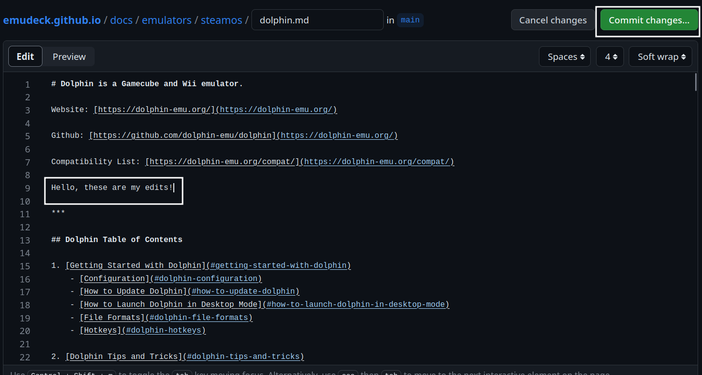
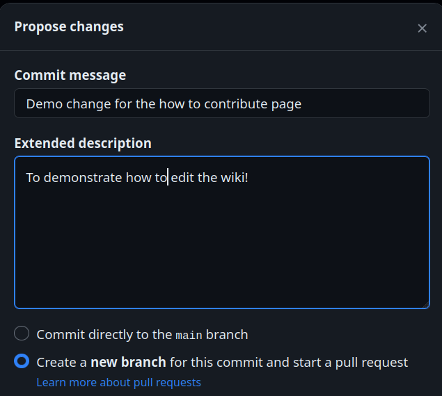

# Curated ROM Hacks and Texture Packs, spice up those retro games!

A curated list of ROM Hacks and Texture Packs by EmuDeck users. 

***

## Curated ROM Hacks and Texture Packs: Table of Contents

[TOC]

***

## ROM Hack Resources
[Back to the Top](#curated-rom-hacks-and-texture-packs-table-of-contents)

* [https://www.romhacking.net/](https://www.romhacking.net/)

***

## Texture Pack Resources
[Back to the Top](#curated-rom-hacks-and-texture-packs-table-of-contents)

* Nintendo 64 Texture Packs
    * [https://evilgames.eu/texture-packs.htm](https://evilgames.eu/texture-packs.htm)
    * [https://www.n64textures.com/downloads/?lang=en](https://www.n64textures.com/downloads/?lang=en)
    * [https://emulationking.com/category/n64-texturepacks/](https://emulationking.com/category/n64-texturepacks/)

***

### Game Boy, Game Boy Color, and Game Boy Advance
[Back to the Top](#curated-rom-hacks-and-texture-packs-table-of-contents)

#### Patches

##### Pokémon Pinball Generations
[Back to the Top](#curated-rom-hacks-and-texture-packs-table-of-contents)

!!! info

    Pokémon Pinball Generations

    This is an expansion upon the original Pokémon Pinball, which adds a Johto experience. It is featured on the popular Twitch Plays Pokémon stream.

Source: [https://www.pokecommunity.com/threads/pok%C3%A9mon-pinball-generations.417346/](https://www.pokecommunity.com/threads/pok%C3%A9mon-pinball-generations.417346/)

See [https://emudeck.github.io/community-creations/steamos/tools-and-guides/#how-to-use-rom-hacks](https://emudeck.github.io/community-creations/steamos/tools-and-guides/#how-to-use-rom-hacks) for instructions on how to apply the ROM hack. 

***

### Dolphin (Gamecube and Wii)
[Back to the Top](#curated-rom-hacks-and-texture-packs-table-of-contents)

#### Riivolution Mods
[Back to the Top](#curated-rom-hacks-and-texture-packs-table-of-contents)

#### Texture Packs
[Back to the Top](#curated-rom-hacks-and-texture-packs-table-of-contents)

#### Patches
[Back to the Top](#curated-rom-hacks-and-texture-packs-table-of-contents)

##### Paper Mario The Thousand Year Door Widescreen Hack
[Back to the Top](#curated-rom-hacks-and-texture-packs-table-of-contents)

!!! info

    The widescreen hack built into Dolphin can cause graphical issues. Instead, use this widescreen hack to play Paper Mario The Thousand Year Door in seamless widescreen. 

Download link can be found in the description: 
* [https://www.youtube.com/watch?v=eKs43f5XKnc](https://www.youtube.com/watch?v=eKs43f5XKnc)

For patching, use [https://kotcrab.github.io/xdelta-wasm/](https://kotcrab.github.io/xdelta-wasm/)

***

### Nintendo DS (melonDS)
[Back to the Top](#curated-rom-hacks-and-texture-packs-table-of-contents)

#### Patches
[Back to the Top](#curated-rom-hacks-and-texture-packs-table-of-contents)

***

### PCSX2 (PlayStation 2)
[Back to the Top](#curated-rom-hacks-and-texture-packs-table-of-contents)

#### Mods
[Back to the Top](#curated-rom-hacks-and-texture-packs-table-of-contents)

#### Texture Packs
[Back to the Top](#curated-rom-hacks-and-texture-packs-table-of-contents)

***

### Ryujinx (Nintendo Switch)
[Back to the Top](#curated-rom-hacks-and-texture-packs-table-of-contents)

#### Mods
[Back to the Top](#curated-rom-hacks-and-texture-packs-table-of-contents)

##### Open Course World
[Back to the Top](#curated-rom-hacks-and-texture-packs-table-of-contents)

Source: https://opencourse.world/

!!! info 

    Open Course world is a Course World server that is compatible with Super Mario Maker 2. To play levels, you can connect through the Ryujinx emulator or a Switch modded with Atmosphère. Alternatively, you can use the website to set up a maker account, browse makers and courses, or import and manage your own courses with our import tool. 

Installation instructions can be found on the website. 

***

## How to Contribute to This Page
[Back to the Top](#curated-rom-hacks-and-texture-packs-table-of-contents)

You will need to **create** a GitHub account first. To sign up for GitHub, see [https://github.com/signup](https://github.com/signup).

1. Open [https://github.com/EmuDeck/emudeck.github.io/blob/main/docs/community-creations/steamos/curated-rom-hacks-and-texture-packs.md](https://github.com/EmuDeck/emudeck.github.io/blob/main/docs/community-creations/steamos/curated-rom-hacks-and-texture-packs.md)
2. Click the `Pencil` icon in the top right
3. Create a new section header below the most recently added section under the respective category
	* For example, `##### My favorite ROM Hack!`
    * Your section will automatically be added to the Table of Contents
4. Write your section under your newly created header
5. Once you are finished making your changes, click the `Commit changes...` button in the top right
    * 
6. You will be prompted to create a Pull Request. Add a little bit of detail about what you added and why
    * 
    * You will not see the option to `Commit directly to the main branch` so do not worry about inadvertently making any changes
7. Submit your Pull Request
8. Once your Pull Request is reviewed, it will be merged and any of your changes will automatically be deployed to this page

***