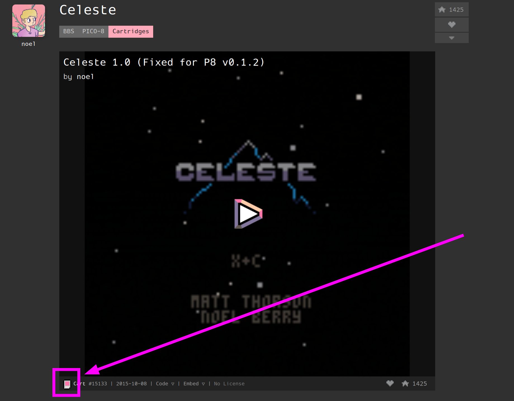

# Pico-8

!!! info "What is Pico-8?"

    PICO-8 is a virtual machine and game engine created by Lexaloffle Games. It is a fantasy video game console that mimics the limited graphical and sound capabilities of 8-bit systems of the 1980s to encourage creativity and ingenuity in producing games without being overwhelmed with the many possibilities of modern tools and machines. Such limitations also give PICO-8 games a particular look and feel.

Source: [https://en.wikipedia.org/wiki/PICO-8](https://en.wikipedia.org/wiki/PICO-8)

***

## Table of Contents

[TOC]

***

## How to Set up Pico-8

### How to Download Pico-8

In order to use Pico-8, you will need to first purchase it from the website, [https://www.lexaloffle.com/pico-8.php](https://www.lexaloffle.com/pico-8.php). Pico-8 is not free, it costs $15 USD. However, if you purchased the "Bundle for Racial Justice and Equality" through [https://itch.io](https://itch.io), Pico-8 was part of this bundle. 

After you have purchased Pico-8, download the `Linux: 64-bit` version. 

1. In the `/home/deck/Applications` folder, create a `pico-8` folder
    * This folder name is case sensitive, do not name it `PICO-8` or `Pico-8`
2. Move the newly downloaded `pico-8_*.*.**_amd64.zip` file to `/home/deck/Applications/pico-8`
    * The `*` refer to the version numbers which may differ depending on when you download Pico-8
3. Right click `pico-8_*.*.**_amd64.zip`, click `Extract > Extract archive here`
4. If the extraction creates a subfolder, move the contents of the subfolder directly into `/home/deck/Applications/pico-8`
5. Pico-8 is now installed

***

### How to Download Pico-8 Games

If you are using the [https://www.lexaloffle.com](https://www.lexaloffle.com) website:

1. Open a game page
2. On the game page, click the "Cart" icon in the bottom left corner
    * 
3. On the newly opened page, right click the image, click `Save Image As`, give it a descriptive name (typically match the game name)
4. Save it to `Emulation/roms/pico8` 

If you are using [https://itch.io/games/tag-pico-8](https://itch.io/games/tag-pico-8):

1. Open a game page
2. Download the game
3. If the game is zipped, extract it first
4. Move the `.png` file to `Emulation/roms/pico8`

***

### How to Configure ES-DE to Work With Pico-8

1. Open ES-DE
2. Scroll down and select `Other Settings`
3. Select `Alternative Emulators`
4. Scroll down to `PICO-8`, and select `Pico-8 (Standalone)`

***

### How to Configure Steam ROM Manager to Work With Pico-8

1. Place your Pico-8 games in `Emulation/roms/pico-8`
2. In `/home/deck/.config/steam-rom-manager/userData/`, open `userConfigurations.json` in a text editor of your choice
    * `~/.config` is a hidden folder by default. In Dolphin (file manager), click the hamburger menu in the top right, click `Show Hidden Files` to see these folders
3. Scroll to the very bottom of the text file, you will see a `}` and a `]`, add a comma to `}`
    * 
4. Paste the below block of text between the `},` and the `]`
    
            {
                "parserType": "Glob",
                "configTitle": "Pico-8 (Standalone)",
                "steamCategory": "${Pico-8 (Standalone)}",
                "steamDirectory": "${steamdirglobal}",
                "romDirectory": "${romsdirglobal}/pico8",
                "executableArgs": "-run \"'${filePath}'\"",
                "executableModifier": "\"${exePath}\"",
                "startInDirectory": "",
                "titleModifier": "${fuzzyTitle}",
                "imageProviders": [
                    "SteamGridDB"
                ],
                "onlineImageQueries": "${${fuzzyTitle}}",
                "imagePool": "${fuzzyTitle}",
                "disabled": false,
                "userAccounts": {
                    "specifiedAccounts": ""
                },
                "executable": {
                    "path": "/home/deck/Applications/pico-8/pico8",
                    "shortcutPassthrough": false,
                    "appendArgsToExecutable": false
                },
                "parserInputs": {
                    "glob": "**/${title}@(.png|.PNG)"
                },
                "titleFromVariable": {
                    "limitToGroups": "",
                    "caseInsensitiveVariables": false,
                    "skipFileIfVariableWasNotFound": false,
                    "tryToMatchTitle": false
                },
                "fuzzyMatch": {
                    "replaceDiacritics": true,
                    "removeCharacters": true,
                    "removeBrackets": true
                },
                "imageProviderAPIs": {
                    "SteamGridDB": {
                        "nsfw": false,
                        "humor": false,
                        "styles": [],
                        "stylesHero": [],
                        "stylesLogo": [],
                        "stylesIcon": [],
                        "imageMotionTypes": [
                            "static"
                        ]
                    }
                },
                "parserId": "164785207772922786",
                "version": 17,
                "controllers": {
                    "ps4": null,
                    "ps5": null,
                    "xbox360": null,
                    "xboxone": null,
                    "switch_joycon_left": null,
                    "switch_joycon_right": null,
                    "switch_pro": null,
                    "neptune": null
                },
                "defaultImage": {
                    "long": "",
                    "tall": "",
                    "hero": "",
                    "logo": "",
                    "icon": "/home/deck/.config/EmuDeck/backend/configs/steam-rom-manager/userData/img/default/icon.png"
                },
                "localImages": {
                    "long": "",
                    "tall": "",
                    "hero": "",
                    "logo": "",
                    "icon": ""
                },
                "steamInputEnabled": "1",
                "drmProtect": false
            }
    
5. Open Steam ROM Manager, toggle the `Pico-8 (Standalone)` parser and generate an app list to add your games to Steam

***

## Pico-8 Tips and Tricks

***

### How to Set Up Splore

1. Open the `Emulation/roms/pico8` folder
2. Right click anywhere, click `Create New > Text File`
3. Name it `splore.png`
4. To launch Splore, use the newly created `splore.png` file through Pico-8
    * You may launch Splore through ES-DE, [How to Configure ES-DE to Work With Pico-8](#how-to-configure-es-de-to-work-with-pico-8) or a Steam shortcut created by Steam ROM Manager, [How to Configure Steam ROM Manager to Work With Pico-8](#how-to-configure-steam-rom-manager-to-work-with-pico-8)

***

## Game Resources

* [https://itch.io/games/tag-pico-8](https://itch.io/games/tag-pico-8)
* [https://www.lexaloffle.com/bbs/?cat=7&carts_tab=1#mode=carts&sub=2](https://www.lexaloffle.com/bbs/?cat=7&carts_tab=1#mode=carts&sub=2)
* [https://nerdyteachers.com/PICO-8/Games/Top200/](https://nerdyteachers.com/PICO-8/Games/Top200/)

***