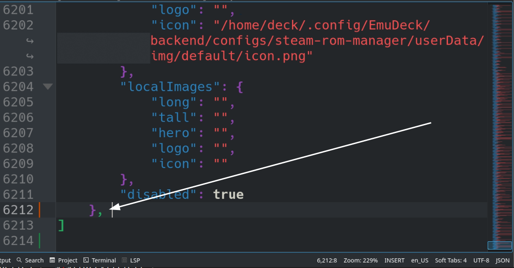

# Third Party Emulation: Non-EmuDeck Tools and Resources

Learn how to install various tools and resources related to emulation on your Steam Deck outside of what EmuDeck installs. These tools and resources are either difficult to implement into EmuDeck's installation script directly, require elaborate setup, or may be added to EmuDeck in the future pending time and resources. 

The guides on this page are not officially supported by EmuDeck. Many require some level of comfort in the terminal to successfully install. Regardless of your comfort with the terminal, the guides will cover as much detail as possible to address a wide variety of expertise levels. If you get stuck on a certain part, it is encouraged you Google and troubleshoot. The EmuDeck Discord will not be able to promise support for the guides available on this page.

## Third Party Emulation Table of Contents

1. [Decompilations and Reverse Engineered PC Ports](#decompilations-and-reverse-engineered-pc-ports)
    - [Getting Started with Decompilations and Reverse Engineered PC Ports](#getting-started-with-decompilations-and-reverse-engineered-pc-ports)
        - [How to Set up Distrobox](#how-to-set-up-distrobox)
        - [Terminal Tips and Tricks](#terminal-tips-and-tricks)
    - [Games](#games)
        - [2Ship2Harkinian: Majora's Mask](#2ship2harkinian-majoras-mask)
        - [Cannonball: OutRun Engine](#cannonball-outrun-engine)
        - [OpenGOAL: Jak and Dexter: The Precursor Legacy](#opengoal-jak-and-dexter-the-precursor-legacy)
        - [OpenGOAL: Jak II](#opengoal-jak-ii)
        - [Perfect Dark](#perfect-dark)
        - [Render96ex](#render96ex)
        - [Ship of Harkinian: Ocarina of Time](#ship-of-harkinian-ocarina-of-time)
        - [sm64ex](#sm64ex)
        - [sm64ex-coop](#sm64ex-coop)
        - [Sonic 1 and 2](#sonic-1-and-2)
        - [Sonic CD](#sonic-cd)
        - [Super Mario 64 Plus](#super-mario-64-plus)
        - [Super Mario Bros](#super-mario-bros)
        - [Super Mario Bros: The Lost Levels](#super-mario-bros-the-lost-levels)
        - [Super Mario World](#super-mario-world)
        - [Super Metroid](#super-metroid)
        - [Super Metroid Redux](#super-metroid-redux)
        - [zelda3: A Link to the Past](#zelda3-a-link-to-the-past)
        - [Zelda64: Majora's Mask](#zelda64-majoras-mask)
    - [General Maintenance](#general-maintenance)
        - [How to Add Decompilations and Reverse Engineered PC Ports to Steam](#how-to-add-decompilations-and-reverse-engineered-pc-ports-to-steam)
            - [How to Create Script Files](#how-to-create-script-files)
            - [How to Utilize Script Files with ES-DE and Pegasus](#how-to-utilize-script-files-with-es-de-and-pegasus)
            - [How to Utilize Script Files with Steam ROM Manager](#how-to-utilize-script-files-with-steam-rom-manager)
        - [How to Update Decompilations and Reverse Engineered PC Ports](#how-to-update-decompilations-and-reverse-engineered-pc-ports)

2. [Emulators](#emulators)
    - [BlueMaxima's Flashpoint](#bluemaximas-flashpoint)
    - [Hypseus Singe](#hypseus-singe)

3. [Emulation Related Games](#emulation-related-games)
    - [AM2R](#am2r) 
    - [Link's Awakening DX HD](#links-awakening-dx-hd)
    - [PokeMMO](#pokemmo)
    - [Sonic 3 A.I.R.](#sonic-3-air)

4. [Emulation Related Tools](#emulation-related-tools)
    - [Skyscraper](#skyscraper)

5. [How to Contribute to This Page](#how-to-contribute-to-this-page)

***

## Decompilations and Reverse Engineered PC Ports
[Back to the Top](#third-party-emulation-table-of-contents)

***

## Getting Started with Decompilations and Reverse Engineered PC Ports
[Back to the Top](#third-party-emulation-table-of-contents)

***

### How to Set up Distrobox
[Back to the Top](#third-party-emulation-table-of-contents)

Many of the decompilations and reverse engineered PC ports must be compiled. Compiling on the Steam Deck can be a bit tricky. Distrobox is one solution to make compiling these easy to do and any changes made within a Distrobox are retained on SteamOS updates.

This section will go over setting up a Distrobox, which you will utilize throughout this page.

#### Prerequisites: Sudo Password

**Note:** Skip this section if you have already set a sudo password

1. In Desktop Mode, open `Konsole`, type in `passwd`, and press enter
2. You'll be prompted to create a password. Your text will not be visible. After you press enter, you will need to type your password again to confirm
3. Exit out of Konsole


#### How to Install Distrobox

**Note:** This section will require using sudo. 

 1. In Desktop Mode, open Konsole and enter the following lines, one at a time
```sh
curl -s https://raw.githubusercontent.com/89luca89/distrobox/main/install | sh -s -- --prefix ~/.local
```
```sh
sudo touch /etc/subuid /etc/subgid
```
```sh
sudo usermod --add-subuid 100000-165535 --add-subgid 100000-165535 $USER
```
2. Download a supported container manager. For most people, [lilipod](https://github.com/89luca89/lilipod) is more than enough and can be obtained by downloading `lilipod-linux-amd64` from [https://github.com/89luca89/lilipod/releases/latest](https://github.com/89luca89/lilipod/releases/latest)
    * Alternatively, you can use [podman](https://github.com/89luca89/podman-launcher/releases) if you need more than what lilipod offers
3. Rename `lilipod-linux-amd64` to `lilipod`. If using podman, rename `podman-launcher-amd64` to `podman`
    * Casing and spelling are important
4. Right click `lilipod` or `podman`, click `Properties`, click `Permissions`, and ensure `Is executable` is checked
5. Move the `lilipod` or `podman` file to `/home/deck/.local/bin/`
    * `~/.local` is a hidden folder by default. In Dolphin (file manager), click the hamburger menu in the top right, click "view hidden files" to see these folders

#### How to Configure bashrc

!!! info "Note"
    
    These instructions are for the default shell
    If you are using another shell, replace `.bashrc` with the rc of your appropriate shell

1. In Desktop Mode, open the `/home/deck` folder
     * You may not see the word `deck` in the file path at the top, this is the `home` folder for the `deck` user
2. Click the hamburger menu in the top right, `☰`, click `Show Hidden Files`
3. Right click `.bashrc`, click `Open with Kate` or a file editor of your choice
4. Add these lines to the bottom of the `.bashrc` file

```sh
# Uncomment the xhost line below if you know that you are using xhost
#xhost +si:localuser:$USER
export PATH=$HOME/.local/bin:$PATH
```

5. Save the `.bashrc` file and exit
6. If you had a terminal open previously (Konsole), close out of it and re-open before proceeding to the next section

#### How to Set Up Distrobox

The various sections on this page will assume you are using the Ubuntu distrobox created in the section below. However, if you prefer, you may also create a Debian distrobox (the commands will mostly be identical) or use a distro of your choice (you will need to figure out how to install the various dependencies).

1. Open Konsole
2. Create a Distrobox of a distro of your choice. In this example, we will use Ubuntu: 
    * `distrobox create --name ubuntu -i ubuntu:23.04`
        * `--name ubuntu` assigns a name to the distrobox, replace `ubuntu` with your preferred name
        * `-i ubuntu:23:04` selects a distro, replace `ubuntu:23:04` with your preferred distro
        * If you get multiple options after inputting this command, select the `docker.io/library/ubuntu:##.##` image by pressing enter on the respective line
3. To enter the Distrobox, open Konsole and enter: 
    * `distrobox enter ubuntu`
        * This command enters the distrobox (assigned by name in Step 2), replace `ubuntu` with the name you typed in Step 2 
        * You will need to enter the Distrobox when compiling the various games on this page. You can identify when you are in a Distrobox by looking at the lefthand side of Konsole. Using the Distrobox created by this guide, it will say `deck@ubuntu`

!!! info "Other Distros"

    You can see a list of all available distros compatible with Distrobox [here](https://github.com/89luca89/distrobox/blob/main/docs/compatibility.md#containers-distros)

***

### Terminal Tips and Tricks

* `cd`
    * Change directories
    * For example, if you are working in a folder in terminal and need to change to a subfolder, enter `cd subfoldername`
        * You can press tab to auto-complete the sub-folder name as well
* `cd ..` or `cd -`
    * Change into the previous directory
* `Tab` button
    * Auto complete file and path names
* `ls` or `ll` 
    * List all of the folders and files in the current directory
* `~` can be used in place of `home`
    * For example, if you have a folder in your `Applications` that you would like to navigate to, you can use `cd ~/Applications` instead of typing `cd /home/deck/Applications`
* `mkdir`
    * Create folders
    * For example: `mkdir foldername`   
* `Ctrl` + `C`
    * Terminate a running process
* `Up` arrow key button
    * Repeat last used command
* `Ctrl` + `L`
    * Clear the screen 
* `Ctrl` + `U`
    * Clear current input
* `Ctrl` + `A`
    * Jump to beginning of the line

***

## Games
[Back to the Top](#third-party-emulation-table-of-contents)

***

### 2Ship2Harkinian: Majora's Mask
[Back to the Top](#third-party-emulation-table-of-contents)

#### What is 2Ship2Harkinian?

`An unofficial PC port of The Legend of Zelda Majora's Mask.`

Source: [https://github.com/HarbourMasters/2ship2harkinian](https://github.com/HarbourMasters/2ship2harkinian)

#### Supported Legend of Zelda: Majora's Mask ROMs

To check the hash of your ROM, right click the ROM, click `Properties`, click `Checksums`, click `Calculate` to the right of `SHA1` and validate it matches one of the below hashes.  

* `7f5630dbc4d5d61d6276213210c4d5cdd83a47d6`
* `d6133ace5afaa0882cf214cf88daba39e266c078`
* `9743aa026e9269b339eb0e3044cd5830a440c1fd`

#### Setting up 2Ship2Harkinian

**Note:** The following folder locations are recommendations. You can choose a different folder location.

1. In `/home/deck/Applications`, create a `2Ship2Harkinian` folder
2. Download the latest `Linux` version of `2Ship2Harkinian`: [https://github.com/HarbourMasters/2ship2harkinian/releases](https://github.com/HarbourMasters/2ship2harkinian/releases) to the folder you created in Step 1
    * Download the `2Ship-VERSION-NAME-Linux.zip` file
3. Right click `2Ship-VERSION-NAME-Linux.zip` and click `Extract > Extract archive here`
    * If it creates a subfolder, move the contents directly to `/home/deck/Applications/2Ship2Harkinian`
4. Right click `2ship.appimage`, click `Properties`, click `Permissions`, check `Is Executable`

#### Installing 2Ship2Harkinian

1. Place your `The Legend of Zelda: Majora's Mask` ROM in `/home/deck/Applications/2Ship2Harkinian`
2. Open `2ship.AppImage`, wait for it to finish generating the OTR
3. To play 2Ship2Harkinian, open `2ship.AppImage`

#### How to Install Custom Textures and Mods

**Texture Pack and Mod Sources**

__This list is not exhaustive__

* [https://gamebanana.com](https://gamebanana.com)
* [https://evilgames.eu/texture-packs/oot-reloaded.htm](https://evilgames.eu/texture-packs/oot-reloaded.htm)

**How to Install Custom Textures and Mods**

1. In `/home/deck/Applications/2Ship2Harkinian`, create a `mods` folder if one does not exist already
    * **Casing matters**
2. Place your mods or textures directly into this folder. Mods or textures typically have a `.otr` file extension
    * If you have a `.rar` or `.zip` file, you will need to extract it first 
3. Depending on the mod or texture pack, you may need to enable it in game as well. Refer to the mod or texture pack for any additional instructions

#### 2Ship2Harkinian Save Location

Saves for 2Ship2Harkinian are in the same folder as the `2ship.AppImage`. If you followed this section, your saves will be in `/home/deck/Applications/2Ship2Harkinian`.

#### How to Transfer Zelda64: Majora's Mask Saves to 2Ship2Harkinian

If you have a save you would like to transfer from Zelda64: Majora's Mask, open 2Ship2Harkinian in Desktop Mode. Drag the save from Zelda64 to the open 2Ship2Harkinian window. 

For the save locations, see [Zelda64: Save Location](#zelda64-save-location)

***

### Cannonball: OutRun Engine
[Back to the Top](#third-party-emulation-table-of-contents)
   
#### How to Build Cannonball on the Steam Deck

#### What is this?

`CannonBall is a souped-up game engine for the OutRun arcade game.`

Source: [https://github.com/djyt/cannonball](https://github.com/djyt/cannonball)

#### Installing Prerequisites

1. To do the steps in this section, you will need to have created an Ubuntu Distrobox. If you have not created one already, see [How to Set up Distrobox](#how-to-set-up-distrobox) for instructions
2. Enter the Distrobox by opening Konsole and entering: 
    * `distrobox enter ubuntu`
3. Enter the following: 
    * `sudo apt install -y sdl2-dev libboost-dev cmake make`

#### Setting Up Cannonball

**Note:** The following folder locations are recommendations. You may choose a different folder location. 

1. In `/home/deck/Applications`, create a `Distrobox` folder
2. In the `Distrobox` folder, right click anywhere in the folder, click `Open Terminal Here`, enter:
    * `git clone --recursive https://github.com/djyt/cannonball.git`
4. A `cannonball` folder will be created, `
5. You  will add your ROM files will be added after the build is finished

#### Building Cannonball

1. In `/home/deck/Applications/Distrobox/cannonball`, right click anywhere in the folder, click `Open Terminal Here`, enter:
    * `distrobox enter ubuntu`
2. Enter: 
    * `mkdir build`
    * `mkdir roms`
    * `cd build`
    * `cmake --fresh -DTARGET=linux.cmake -DOpenGL_GL_PREFERENCE=GLVND -DCMAKE_BUILD_TYPE="Release" -S ../cmake/`
    * `make -j4 VERBOSE=1`
3. Wait for it to finish building

#### Providing ROM Files for Super Cannonball

You must provide particular versions of the OutRun ROM files to run Cannonball. OutRun Revision B Roms need to unpacked into the cannonball/build/roms folder. The [cannonball/roms/roms.txt](https://raw.githubusercontent.com/djyt/cannonball/master/roms/roms.txt) file lists the expected file names to help you check that you have unpacked the correct files. 

The location of suitable files cannot be linked here because they are copyright. When you have a suitable archive unpack it so that the files are directly in cannonball/build/roms and not in any subdirectory.

#### How to Configure Cannonball

See the Cannonball manual: 
`https://github.com/djyt/cannonball/wiki/Cannonball-Manual`

No particular reconfiguration is needed for the Steam Deck. The game will default to 16:9 widescreen, and has no 16:10 mode, so there will be small black bars at the top and bottom of the SteamDeck screen. Options can be changed inside the Cannonball UI.

#### How to Run Cannonball

   * `cd ~/Applications/distrobox/cannonball/build`
   * `./cannonball`

***

### OpenGOAL: Jak and Dexter: The Precursor Legacy
[Back to the Top](#third-party-emulation-table-of-contents)

#### What is OpenGOAL: Jak and Dexter: The Precursor Legacy?

`OpenGOAL is an unofficial port of Jak and Daxter: The Precursor Legacy for Windows and Linux.`

Source: [https://opengoal.dev/](https://opengoal.dev/)

#### Setting up OpenGOAL

**Note:** The following folder locations are recommendations. You may choose a different folder location. 

1. In `/home/deck/Applications`, create an `OpenGOAL` folder
2. Place your `Jak and Dexter: The Precursor Legacy` ISO directly in the newly created `OpenGOAL` folder
3. Download the latest `amd64.AppImage` from here: [https://github.com/open-goal/launcher/releases/latest](https://github.com/open-goal/launcher/releases/latest) and place it in the folder you created in Step 1
    * Example: Download `open-goal-launcher_#.#.#_amd64.AppImage` 
        * The version number may be different depending on when you are reading this
4. Right click `open-goal-launcher_#.#.#_amd64.AppImage`, click `Properties`, click `Permissions`, check `Is Executable`

#### Installing OpenGOAL

1. In `/home/deck/Applications/OpenGOAL`, double click `open-goal-launcher_#.#.#_amd64.AppImage` to open it
2. Click `Set Version`, click the `Download` icon on the row with the latest version at the top
3. Click the circle icon on the left to select the version and click `Save` in the top right
4. On the left side, select `Jak and Dexter`
5. On the bottom right, click `Install via ISO` and select your `Jak and Dexter: The Precursor Legacy` ISO
6. The application will begin to decompile your game, this may take a few moments 
7. Once it is finished decompiling, press `Continue`
8. To play your game, open this launcher, select `Jak and Dexter` on the left, and click `Play` in the bottom right
    * The launcher does not work in Game Mode. See [How to Add OpenGOAL: Jak and Dexter: The Precursor Legacy to Steam](#how-to-add-opengoal-jak-and-dexter-the-precursor-legacy-to-steam) to learn how to play the game directly in Steam

#### How to Install Custom Textures

**Note:** Texture packs need to be zipped in order to be installed from the launcher. This section will use `texture_replacements.zip` from [https://www.youtube.com/watch?v=lX1gBO1INZ4](https://www.youtube.com/watch?v=lX1gBO1INZ4) as an example.

1. Download the custom textures from the pinned comment on this Youtube Video: [https://www.youtube.com/watch?v=lX1gBO1INZ4](https://www.youtube.com/watch?v=lX1gBO1INZ4) to `/home/deck/Applications/OpenGOAL`
2. Double click `open-goal-launcher_#.#.#_amd64.AppImage` to open it
3. On the left side, select `Jak and Dexter`
4. On the bottom right, select `Features`, `Texture Packs`
5. Click `Add New Pack` 
6. Select `texture_replacements.zip` and wait a few moments
7. Your texture pack will appear below in its own box. Click the red `Disabled` button to enable your texture pack
8. Click `Apply Texture Changes` in the top right and wait a few moments
9. Your custom textures will now be installed

#### How to Add OpenGOAL: Jak and Dexter: The Precursor Legacy to Steam

1. In `/home/deck/Applications/OpenGOAL`, right click anywhere in the blank space, click `Create New` > `Text File`
2. Name it `Jak and Dexter: The Precursor Legacy.sh` 
3. At the top of the text file, write `#!/bin/bash`
4. In `/home/deck/Applications/OpenGOAL`, double click `open-goal-launcher_#.#.#_amd64.AppImage` to open it
5. On the left side, select `Jak and Dexter`
6. On the bottom right, click the `Gear` icon, and click `Copy Game Executable Command`
7. In the text file you created in Step 1, right click anywhere below `#!/bin/bash` and click `Paste`
8. Save the text file and exit out
9. Right click your newly created text file, click `Properties`, click `Permissions`, check `Is Executable`
10. Right click the text file, click `Add to Steam`
    * If you are using EmulationStation-DE or Steam ROM Manager, place in `Emulation/roms/desktop` instead
        * See [How to Add Decompilations and Reverse Engineered PC Ports to Steam](#how-to-add-decompilations-and-reverse-engineered-pc-ports-to-steam) for further detail

Your text file should look similar to the text below:

Text file name: 

`Jak and Dexter: The Precursor Legacy.sh`

Text file contents:

```sh
#!/bin/bash

/home/deck/Applications/OpenGOAL/versions/official/v0.2.0/gk -v --proj-path /home/deck/Applications/OpenGOAL/active/jak1/data --game jak1 -- -boot -fakeiso
```

**Note:** You will need to update this shortcut whenever you update OpenGOAL. 


***

### OpenGOAL: Jak II

#### Preface

The folders in this section will be repeated from [OpenGOAL: Jak and Dexter: The Precursor Legacy](#opengoal-jak-and-dexter-the-precursor-legacy). If you have already installed Jak and Dexter: The Precursor Legacy, you may use the same folders and launcher to install Jak II. 

#### What is OpenGOAL: Jak II?

`OpenGOAL is an unofficial port of Jak II for Windows and Linux.`

Source: [https://opengoal.dev/](https://opengoal.dev/)

#### Setting up OpenGOAL

**Note:** The following folder locations are recommendations. You may choose a different folder location. 

1. In `/home/deck/Applications`, create an `OpenGOAL` folder
2. Place your `Jak II` ISO directly in the newly created `OpenGOAL` folder
3. Download the latest `amd64.AppImage` from here: [https://github.com/open-goal/launcher/releases/latest](https://github.com/open-goal/launcher/releases/latest) and place it in the folder you created in Step 1
    * Example: Download `open-goal-launcher_#.#.#_amd64.AppImage` 
        * The version number may be different depending on when you are reading this
4. Right click `open-goal-launcher_#.#.#_amd64.AppImage`, click `Properties`, click `Permissions`, check `Is Executable`

#### Installing OpenGOAL

If you already installed OpenGOAL: Jak and Dexter: The Precursor Legacy, you do not need to do Steps 2 and 3 again. 

1. In `/home/deck/Applications/OpenGOAL`, double click `open-goal-launcher_#.#.#_amd64.AppImage` to open it
2. Click `Set Version`, click the `Download` icon on the row with the latest version at the top
3. Click the circle icon on the left to select the version and click `Save` in the top right
4. On the left side, select `Jak II`
5. On the bottom right, click `Install via ISO` and select your `Jak II` ISO
6. The application will begin to decompile your game, this may take a few moments 
7. Once it is finished decompiling, press `Continue`
8. To play your game, open this launcher, select `Jak II` on the left, and click `Play` in the bottom right
    * The launcher does not work in Game Mode. See [How to Add OpenGOAL: Jak II to Steam](#how-to-add-opengoal-jak-ii-to-steam) to learn how to play the game directly in Steam

#### How to Install Custom Textures

**Note:** Texture packs need to be zipped in order to be installed from the launcher.

1. Download a texture pack of your choice
2. Double click `open-goal-launcher_#.#.#_amd64.AppImage` to open it
3. On the left side, select `Jak II`
4. On the bottom right, select `Features`, `Texture Packs`
5. Click `Add New Pack` 
6. Select your zipped texture pack and wait a few moments
7. Your texture pack will appear below in its own box. Click the red `Disabled` button to enable your texture pack
8. Click `Apply Texture Changes` in the top right and wait a few moments
9. Your custom textures will now be installed

#### How to Add OpenGOAL: Jak II to Steam

1. In `/home/deck/Applications/OpenGOAL`, right click anywhere in the blank space, click `Create New` > `Text File`
2. Name it `Jak II.sh` 
3. At the top of the text file, write `#!/bin/bash`
4. In `/home/deck/Applications/OpenGOAL`, double click `open-goal-launcher_#.#.#_amd64.AppImage` to open it
5. On the left side, select `Jak II`
6. On the bottom right, click the `Gear` icon, and click `Copy Game Executable Command`
7. In the text file you created in Step 1, right click anywhere below `#!/bin/bash` and click `Paste`
8. Save the text file and exit out
9. Right click your newly created text file, click `Properties`, click `Permissions`, check `Is Executable`
10. Right click the text file, click `Add to Steam`
    * If you are using EmulationStation-DE or Steam ROM Manager, place in `Emulation/roms/desktop` instead
        * See [How to Add Decompilations and Reverse Engineered PC Ports to Steam](#how-to-add-decompilations-and-reverse-engineered-pc-ports-to-steam) for further detail

Your text file should look similar to the text below:

Text file name: 

`Jak II.sh`

Text file contents:

```sh
#!/bin/bash

/home/deck/Applications/OpenGOAL/versions/official/v0.2.0/gk -v --proj-path /home/deck/Applications/OpenGOAL/active/jak2/data --game jak2 -- -boot -fakeiso
```

**Note:** You will need to update this shortcut whenever you update OpenGOAL. 

### Perfect Dark
[Back to the Top](#third-party-emulation-table-of-contents)

#### What is This Decompilation?

`A work-in-progress port of the Perfect Dark decompilation to modern platforms.`

Source: [https://github.com/fgsfdsfgs/perfect_dark](https://github.com/fgsfdsfgs/perfect_dark)

#### Installing Prerequisites

1. To do the steps in this section, you will need to have created an Ubuntu Distrobox. If you have not created one already, see [How to Set up Distrobox](#how-to-set-up-distrobox) for instructions
2. Enter the Distrobox by opening Konsole and entering: 
    * `distrobox enter ubuntu`
3. Enter the following, one line at a time:
    * `sudo dpkg --add-architecture i386`
    * `sudo apt-get update`
4. Enter the following command: 
    * `sudo apt-get install git gcc g++ gcc-multilib g++-multilib make libsdl2-dev zlib1g-dev libsdl2-dev:i386 zlib1g-dev:i386`

#### Setting Up Perfect Dark

**Note:** The following folder locations are recommendations. You may choose a different folder location. 

1. Download the `i686-linux` version from [https://github.com/fgsfdsfgs/perfect_dark#download](https://github.com/fgsfdsfgs/perfect_dark#download) to your `Downloads` folder
2. Right click `pd-i686-linux.zip`, click `Extract archive here, autodetect subfolder`
3. Move the newly extracted `pd-i686-linux` folder to `/home/deck/Applications`
4. Right click `pd`
5. Click `Properties`
6. Click `Permissions`
7. Check `Is Executable`
8. Place your `Perfect Dark` ROM in `/home/deck/Applications/pd-i686-linux/data`
    * MD5 Hash: `e03b088b6ac9e0080440efed07c1e40f`
    * To locate your MD5 Hash, right click your ROM, click `Properties`, click `Checksums`, click `Calculate` to the left of `MD5` and compare it to the above hash. If it is a match, you have a valid ROM 5
9. In order to properly launch Perfect Dark, proceed to the next section

#### How to Launch Perfect Dark

1. Download attached `.sh` file
    * [PerfectDark.sh](../../configuration-files/PerfectDark.sh)
    * **Note:** If you are using different folder locations, make sure to edit the above file and edit the paths
2. Place in `/home/deck/Applications`
    * If you are using EmulationStation-DE or Steam ROM Manager, place in `Emulation/roms/desktop` instead
        * See [How to Add Decompilations and Reverse Engineered PC Ports to Steam](#how-to-add-decompilations-and-reverse-engineered-pc-ports-to-steam) for instructions
3. Right click `PerfectDark.sh`
4. Click `Properties`
5. Click `Permissions`
6. Check `Is Executable`
7. Use `PerfectDark.sh` to open Perfect Dark

#### How to Configure Perfect Dark

1. Open `PerfectDark.sh` at least once so it can generate the `pd.ini` file 
2. Open the `/home/deck/.local/share/perfectdark/` folder
    * `~/.local` is a hidden folder by default. In Dolphin (file manager), click the hamburger menu in the top right, click `Show Hidden Files` to see these folders
3. Right click `pd.ini`, click `Open with Kate` or a text editor of your choice
4. Customize settings

**Recommended Settings**

* Set `DefaultWidth` to `800`
* Set `DefaultHeight` to `1200`
* Set `DefaultFullscreen` to `1`

#### Controls

[https://github.com/fgsfdsfgs/perfect_dark#controls](https://github.com/fgsfdsfgs/perfect_dark#controls)

***

### Render96ex
[Back to the Top](#third-party-emulation-table-of-contents)

#### How to Compile Render96ex on the Steam Deck

#### What is Render96ex?

`An "HD" version of Super Mario 64 based on the rendered advertisements and art published in Nintendo Power.`

Source: [https://github.com/Render96/Render96ex/wiki](https://github.com/Render96/Render96ex/wiki)

When you include the HD textures as part of this guide the whole Render96ex install will need 1.1GB of storage. This compares to less than 0.1 GB for the SM64Plus version of the game.

#### Installing Prerequisites

1. To do the steps in this section, you will need to have created an Ubuntu Distrobox. If you have not created one already, see [How to Set up Distrobox](#how-to-set-up-distrobox) for instructions
2. Enter the Distrobox by opening Konsole and entering: 
    * `distrobox enter ubuntu`
3. Enter the following: 
    * `sudo apt install -y git build-essential pkg-config libusb-1.0-0-dev libsdl2-dev bsdmainutils libglew-dev`

#### Setting Up Render96ex

**Note:** The following folder locations are recommendations. You may choose a different folder location. 

1. In `/home/deck/Applications`, create a `Distrobox` folder
2. In the `Distrobox` folder, right click anywhere in the folder, click `Open Terminal Here`, enter:
    * `git clone --single-branch --branch alpha https://github.com/Render96/Render96ex.git`
3. A `Render96ex` folder will be created, place your Super Mario 64 ROM in this folder
4. Rename the Super Mario 64 ROM to `baserom.us.z64`

#### Building Render96ex

1. In `/home/deck/Applications/Distrobox/Render96ex/`, right click anywhere in the folder, click `Open Terminal Here`, enter:
    * `distrobox enter ubuntu`
2. Enter: 
    * `make -j4 TEXTURE_FIX=1`
3. Wait for it to finish building
4. To play Render96ex, open `sm64.us.f3dex2e` in `/home/deck/Applications/Distrobox/Render96ex/build/us_pc`

#### How to Install Custom Models

1. Download the latest model pack: [https://github.com/Render96/ModelPack/releases](https://github.com/Render96/ModelPack/releases) to `/home/deck/Downloads`
2. Right click `Render96_DynOs_v3.2.7z` and click `Extract archive here, autodetect subfolder`
3. Move the newly extracted `Render96_DynOs...` folder to `/home/deck/Applications/Distrobox/Render96ex/build/us_pc/dynos/packs`
4. To enable custom models, in game, press `Start`, press `L2`, select `Model Packs` and enable `Render96DynOs...`

#### How to Install Custom Textures

1. In `/home/deck/Applications/Distrobox/Render96ex/build/us_pc/res`, right click anywhere in the folder, click `Open Terminal Here`, enter:
    * `git clone https://github.com/pokeheadroom/RENDER96-HD-TEXTURE-PACK.git -b master`
2. The `RENDER96-HD-TEXTURE-PACK` is now installed

#### How to Configure Render96ex

##### GUI

1. While in game, press `Start`, press `R1`
2. Configure settings

##### Config File

1. Open `sm64.us.f3dex2e` in `/home/deck/Applications/Distrobox/Render96ex/build/us_pc` at least once so it can generate the `sm64config.txt` file 
2. Open the `/home/deck/.local/share/sm64ex/` folder
    * `~/.local` is a hidden folder by default. In Dolphin (file manager), click the hamburger menu in the top right, click `Show Hidden Files` to see these folders
3. Right click `sm64config.txt`, click `Open with Kate` or a text editor of your choice
4. Customize settings


***

### Ship of Harkinian: Ocarina of Time 
[Back to the Top](#third-party-emulation-table-of-contents)

#### What is Ship of Harkinian?

`An unofficial PC port of The Legend of Zelda Ocarina of Time.`

Source: [https://www.shipofharkinian.com/](https://www.shipofharkinian.com/)

#### Supported Legend of Zelda: Ocarina of Time ROMs

For a full list of supported ROMs and a ROM validation tool, see [https://ship.equipment/](https://ship.equipment/).

To confirm that you have a valid ROM, drag and drop your ROM to the website above. 

#### Setting up Ship of Harkinian

**Note:** The following folder locations are recommendations. You can choose a different folder location.

1. In `/home/deck/Applications`, create a `ShipofHarkinian` folder
2. Download the latest `Linux-Performance` version of `Ship of Harkinian`: [https://github.com/HarbourMasters/Shipwright/releases](https://github.com/HarbourMasters/Shipwright/releases) to the folder you created in Step 1
    * Download the `SoH-VERSION-NAME-Linux-Performance.zip` file
3. Right click the downloaded zip file and click `Extract archive here, detect subfolder`
4. Move the `soh.AppImage` to `/home/deck/Applications/ShipofHarkinian`
5. Right click `soh.AppImage`, click `Properties`, click `Permissions`, check `Is Executable`

#### Installing Ship of Harkinian

1. Place your `The Legend of Zelda: Ocarina of Time` ROM in `/home/deck/Applications/ShipofHarkinian`
2. Open `soh.AppImage`, wait for it to finish generating the OTR
3. To play Ship of Harkinian, open `soh.AppImage`

#### How to Install Custom Textures and Mods

**Texture Pack and Mod Sources**

__This list is not exhaustive__

* [https://gamebanana.com/games/16121](https://gamebanana.com/games/16121)
* [https://evilgames.eu/texture-packs/oot-reloaded.htm](https://evilgames.eu/texture-packs/oot-reloaded.htm)

**How to Install Custom Textures and Mods**

1. In your Ship of Harkinian folder, create a `mods` folder, all lowercase
    * `/home/deck/Applications/ShipofHarkinian` if you used the folders in the above guide
    * **Casing matters**
2. Place your mods or textures directly into this folder. Mods or textures typically have a `.otr` file extension
    * If you have a `.rar` or `.zip` file, you will need to extract it first 
3. Depending on the mod or texture pack, you may need to enable it in game as well. Refer to the mod or texture pack for any additional instructions

#### Ship of Harkinian Save Location

Saves for Ship of Harkinian are in the same folder as the `soh.AppImage`. If you followed this section, your saves will be in `/home/deck/Applications/ShipofHarkinian`.

***

### sm64ex
[Back to the Top](#third-party-emulation-table-of-contents)

#### What is This Decompilation?

`A fork of sm64-port/sm64-port with additional features.`

Source: [https://github.com/sm64pc/sm64ex](https://github.com/sm64pc/sm64ex)

#### Installing Prerequisites

1. To do the steps in this section, you will need to have created an Ubuntu Distrobox. If you have not created one already, see [How to Set up Distrobox](#how-to-set-up-distrobox) for instructions
2. Enter the Distrobox by opening Konsole and entering: 
    * `distrobox enter ubuntu`
3. Enter the following: 
    * `sudo apt install build-essential git python3 libglew-dev libsdl2-dev bsdmainutils patch`

#### Setting Up sm64ex

1. In `/home/deck/Applications`, create a `Distrobox` folder
2. In the `Distrobox` folder, right click anywhere in the folder, click `Open Terminal Here`, enter:
    * `git clone https://github.com/sm64pc/sm64ex`
3. A `sm64ex` folder will be created, place your Super Mario 64 ROM in this folder
4. Rename the Super Mario 64 ROM to `baserom.us.z64`

#### Building sm64ex

1. In the `sm64ex` folder, right click anywhere in the folder, click `Open Terminal Here`, enter:
    * `distrobox enter ubuntu`
2. Enter: 
    * `make`
3. Wait for it to finish building
4. To play `sm64ex`, open `sm64.us.f3dex2e` in `/home/deck/Applications/Distrobox/sm64ex/build/us_pc`

#### How to Configure sm64ex

1. Open `sm64.us.f3dex2e` in `/home/deck/Applications/Distrobox/sm64ex/build/us_pc` at least once so it can generate the `sm64config.txt` file 
2. Open the `/home/deck/.local/share/sm64ex/` folder
    * `~/.local` is a hidden folder by default. In Dolphin (file manager), click the hamburger menu in the top right, click `Show Hidden Files` to see these folders
3. Right click `sm64config.txt`, click `Open with Kate` or a text editor of your choice
4. Customize settings

#### How to Apply Patches

A 60 FPS patch is included with the GitHub repo for sm64ex. However, you can take what's written here and apply additional patches to sm64ex.

1. In the `/home/deck/Applications/Distrobox/sm64ex/enhancements` folder, right click anywhere in the folder, click `Open Terminal Here`
2. Enter:
    * ` git apply 60fps_ex.patch --ignore-whitespace --reject`
        * `60fps_ex.patch` is the name of the included file. If the file name is different, replace the file name in the above command
3. You will need to re-build sm64ex for the patches to apply. To do so, enter the Ubuntu Distrobox and run `make clean` in the ``/home/deck/Applications/Distrobox/sm64ex` folder

***

### sm64ex-coop
[Back to the Top](#third-party-emulation-table-of-contents)

#### What is This Decompilation?

`Online multiplayer mod for SM64 that synchronizes all entities and every level for multiple players. Fork of sm64pc/sm64ex.`

Source: [https://github.com/djoslin0/sm64ex-coop](https://github.com/djoslin0/sm64ex-coop)

#### Installing Prerequisites

1. To do the steps in this section, you will need to have created an Ubuntu Distrobox. If you have not created one already, see [How to Set up Distrobox](#how-to-set-up-distrobox) for instructions
2. Enter the Distrobox by opening Konsole and entering: 
    * `distrobox enter ubuntu`
3. Enter the following: 
    * `sudo apt install build-essential git python3 libglew-dev libsdl2-dev libz-dev bsdmainutils`

#### Setting Up sm64ex-coop

1. In `/home/deck/Applications`, create a `Distrobox` folder
2. In the `Distrobox` folder, right click anywhere in the folder, click `Open Terminal Here`, enter:
    * `git clone https://github.com/djoslin0/sm64ex-coop.git`
3. A `sm64ex-coop` folder will be created, place your Super Mario 64 ROM in this folder
4. Rename the Super Mario 64 ROM to `baserom.us.z64`

#### Building sm64ex-coop

1. In the `sm64ex-coop` folder, right click anywhere in the folder, click `Open Terminal Here`, enter:
    * `distrobox enter ubuntu`
2. Enter: 
    * `make -j4`
3. Wait for it to finish building
4. To play `sm64ex-coop`, open `sm64.us.f3dex2e` in `/home/deck/Applications/Distrobox/sm64ex-coop/build/us_pc`

#### How to Configure sm64ex-coop

1. Open `sm64.us.f3dex2e` in `/home/deck/Applications/Distrobox/sm64ex-coop/build/us_pc`
2. On the main menu, click `Options`

#### How to Play Multiplayer

See [https://github.com/djoslin0/sm64ex-coop/wiki/Hosting-and-Joining](https://github.com/djoslin0/sm64ex-coop/wiki/Hosting-and-Joining).

***

### Sonic 1 and 2
[Back to the Top](#third-party-emulation-table-of-contents)

#### Preface

To compile Sonic 1 and 2, you will need a legally obtained copy of a `Data.rsdk` file, obtained either from the Sonic 1 and 2 versions on the Android or iOS versions. For instructions, see [Android](https://gamebanana.com/tuts/14492) and [iOS](https://gamebanana.com/tuts/14491).

#### What is This Decompilation?

`A complete decompilation of Retro Engine v4 and the menus from Sonic 1 and 2 (2013).`

Source: [https://github.com/Rubberduckycooly/Sonic-1-2-2013-Decompilation](https://github.com/Rubberduckycooly/Sonic-1-2-2013-Decompilation)

#### Installing Prerequisites

1. To do the steps in this section, you will need to have created an Ubuntu Distrobox. If you have not created one already, see [How to Set up Distrobox](#how-to-set-up-distrobox) for instructions
2. Enter the Distrobox by opening Konsole and entering: 
    * `distrobox enter ubuntu`
3. Enter the following: 
    * `sudo apt install build-essential git libsdl2-dev libvorbis-dev libogg-dev libglew-dev libdecor-0-dev`

#### Setting Up Sonic 1 and 2

1. In `/home/deck/Applications`, create a `Distrobox` folder
2. In the `Distrobox` folder, right click anywhere in the folder, click `Open Terminal Here`, enter:
    * `git clone --recursive https://github.com/Rubberduckycooly/Sonic-1-2-2013-Decompilation.git`
3. A `Sonic-1-2-2013-Decompilation` folder will be created

#### Building Sonic 1 and 2

1. In the `Sonic-1-2-2013-Decompilation` folder, right click anywhere in the folder, click `Open Terminal Here`, enter:
    * `distrobox enter ubuntu`
2. Enter: 
    * `make -j5`
3. In the `Sonic-1-2-2013-Decompilation`, a `bin` folder will be created
4. If you would like to play both Sonic 1 and 2, make a copy of the `bin` folder directly in the `Sonic-1-2-2013-Decompilation` folder
5. Rename the original `bin` and the copied folder to Sonic 1 and Sonic 2 respectively
    * This step is for easier folder management, it is a recommendation and not a requirement
6. Place the matching `Data.rsdk` in each folder
7. To play Sonic 1 and 2, open `RSDKv4`

#### How to Configure Sonic 1 and 2

1. In the respective Sonic 1 and 2 folder, after launching `RSDKv4` for the first time, a `settings.ini` will be created
2. Right click `settings.ini`, click `Open with Kate` or a text editor of your choice
3. Customize settings

#### How to Mod Sonic 1 and 2

**Mod Resources**

_This list is not comprehensive_

* [Sonic 1: GameBanana](https://gamebanana.com/mods/465176)
* [Sonic 2: GameBanana](https://gamebanana.com/mods/459508)

1. In the respective `Sonic 1` or `Sonic 2` folders, create a `mod` folder
2. Download and extract mod(s) to the `mod` folder
    * A mod folder should typically have a `Data` folder and a `mod.ini` file
3. Right click `settings.ini`, click `Open with Kate` or a text editor of your choice
4. Change `DevMenu=false` to `DevMenu=true` and save and close out of the file
5. While in game, press `Start` and you should see a list of your mod(s)
6. To activate/toggle a mod, press `A` on the respective mod
 
***

### Sonic CD
[Back to the Top](#third-party-emulation-table-of-contents)

#### Preface

To compile Sonic CD, you will need a legally obtained copy of a `Data.rsdk` file, obtained either from the Sonic CD versions on the Android or iOS versions. For instructions, see [Android](https://gamebanana.com/tuts/14942) and [iOS](https://gamebanana.com/tuts/14491).

#### What is This Decompilation?

`A complete decompilation of Retro Engine v3/Sonic CD.`

Source: [https://github.com/Rubberduckycooly/Sonic-CD-11-Decompilation](https://github.com/Rubberduckycooly/Sonic-CD-11-Decompilation)

#### Installing Prerequisites

1. To do the steps in this section, you will need to have created an Ubuntu Distrobox. If you have not created one already, see [How to Set up Distrobox](#how-to-set-up-distrobox) for instructions
2. Enter the Distrobox by opening Konsole and entering:
    * `distrobox enter ubuntu`
3. Enter the following command: 
    * `sudo apt install build-essential git libsdl2-dev libvorbis-dev libogg-dev libtheora-dev libglew-dev`

#### Setting Up Sonic CD

1. In `/home/deck/Applications`, create a `Distrobox` folder
2. In the `Distrobox` folder, right click anywhere in the folder, click `Open Terminal Here`, enter:
    * `git clone --recursive https://github.com/Rubberduckycooly/Sonic-CD-11-Decompilation.git`
3. A `Sonic-CD-11-Decompilation` folder will be created

#### Building Sonic CD

1. In the `Sonic-CD-11-Decompilation` folder, right click anywhere in the folder, click `Open Terminal Here`, enter:
    * `distrobox enter ubuntu`
2. Enter: 
    * `make CXXFLAGS=-O2 -j5`
3. In the `Sonic-CD-11-Decompilation`, a `bin` folder will be created
4. Place the `Data.rsdk` you retrieved from [How to Compile Sonic CD on the Steam Deck](#how-to-compile-sonic-cd-on-the-steam-deck) directly into the `bin` folder
7. To play Sonic CD, open `RSDKv4`

#### How to Configure Sonic CD
1. In the `bin`, after launching `RSDKv4` for the first time, a `settings.ini` will be created
2. Right click `settings.ini`, click `Open with Kate` or a text editor of your choice
3. Customize settings

#### How to Mod Sonic CD

**Mod Resources**

_This list is not comprehensive_

* [https://gamebanana.com/mods/games/6108](https://gamebanana.com/mods/games/6108)

1. In the `bin` folders, create a `mod` folder
2. Download and extract mod(s) to the `mod` folder
    * A mod folder should typically have a `Data` folder and a `mod.ini` file
3. Right click `settings.ini`, click `Open with Kate` or a text editor of your choice
4. Change `DevMenu=false` to `DevMenu=true` and save and close out of the file
5. While in game, press `Start` and you should see a list of your mod(s)
6. To activate/toggle a mod, press `A` on the respective mod

***
    
### Super Mario 64 Plus 
[Back to the Top](#third-party-emulation-table-of-contents)

#### How to Compile Super Mario 64 Plus on the Steam Deck

#### What is Super Mario 64 Plus?

`SM64Plus is a fork of sm64-port that focuses on customizability and aims to add features that not only fix some of the issues found in the base game but also enhance the gameplay overall with extra options.`

Source: [https://github.com/MorsGames/sm64plus](https://github.com/MorsGames/sm64plus)

#### Installing Prerequisites

1. To do the steps in this section, you will need to have created an Ubuntu Distrobox. If you have not created one already, see [How to Set up Distrobox](#how-to-set-up-distrobox) for instructions
2. Enter the Distrobox by opening Konsole and entering: 
    * `distrobox enter ubuntu`
3. Enter the following command: 
    * `sudo apt install -y git build-essential pkg-config libusb-1.0-0-dev libsdl2-dev bsdmainutils`

#### Setting Up Super Mario 64 Plus

**Note:** The following folder locations are recommendations. You may choose a different folder location. 

1. In `/home/deck/Applications`, create a `Distrobox` folder
2. In the `Distrobox` folder, right click anywhere in the folder, click `Open Terminal Here`, enter:
    * `git clone https://github.com/MorsGames/sm64plus`
3. A `sm64plus` folder will be created, place your Super Mario 64 ROM in this folder
4. Rename the Super Mario 64 ROM to `baserom.us.z64`

#### Building Super Mario 64 Plus

1. In `/home/deck/Applications/Distrobox/sm64plus/`, right click anywhere in the folder, click `Open Terminal Here`, enter:
    * `distrobox enter ubuntu`
2. Enter: 
    * `make -j4`
3. Wait for it to finish building
4. To play Super Mario 64 Plus, open `sm64.us` in `/home/deck/Applications/Distrobox/sm64plus/build/us_pc`
    * The game may have missing HUD UI textures, to fix these, read the next section
   
#### How to Fix the Missing HUD UI textures

1. Download attached `.sh` file
    * [SuperMario64Plus.sh](../../configuration-files/SuperMario64Plus.sh)
    * **Note:** If you are using different folder locations, make sure to edit the above file and edit the paths
2. Place in `/home/deck/Applications`
    * If you are using EmulationStation-DE or Steam ROM Manager, place in `Emulation/roms/desktop` instead
        * See [How to Add Decompilations and Reverse Engineered PC Ports to Steam](#how-to-add-decompilations-and-reverse-engineered-pc-ports-to-steam) for instructions
3. Right click `SuperMario64Plus.sh`
4. Click `Properties`
5. Click `Permissions`
6. Check `Is Executable`
7. Use `SuperMario64Plus.sh` to open SM64Plus

#### How to Configure Super Mario 64 Plus

1. Open `sm64.us` in `/home/deck/Applications/Distrobox/sm64plus/build/us_pc` at least once so it can generate the `settings.ini` file 
2. Open the `/home/deck/Applications/Distrobox/sm64plus/build/us_pc` folder
3. Right click `settings.ini`, click `Open with Kate` or a text editor of your choice
4. Customize settings

**Recommended Settings**

* Set `window_height` to `800`

#### How to Add Super Mario 64 Plus to Steam

1. In `/home/deck/Applications`, right click `SuperMario64Plus.sh`, click `Add to Steam`
2. After adding it to Steam, you may rename the shortcut in Steam directly


***

### Super Mario Bros
[Back to the Top](#third-party-emulation-table-of-contents)

#### How to Compile Super Mario Bros on the Steam Deck

**Note:** This section requires a legal copy of `Super Mario World` and `Super Mario All-Stars` ROMs for the SNES. 

#### What is this?

`A reverse engineered clone of Super Mario Bros.`

Source: [https://github.com/snesrev/smw](https://github.com/snesrev/smw)

#### Installing Prerequisites

1. To do the steps in this section, you will need to have created an Ubuntu Distrobox. If you have not created one already, see [How to Set up Distrobox](#how-to-set-up-distrobox) for instructions
2. Enter the Distrobox by opening Konsole and entering: 
    * `distrobox enter ubuntu`
3. Enter the following command: 
    * `sudo apt install libsdl2-dev python3-pip make python3-zstandard`

#### How to Set Up Super Mario Bros

**Note:** The following folder locations are recommendations. You may choose a different folder location. 

1. In `/home/deck/Applications`, create a `Distrobox` folder
2. In the `Distrobox` folder, right click anywhere in the folder, click `Open Terminal Here`, enter:
    * `git clone https://github.com/snesrev/smw smb1`
3. A `smb1` folder will be created, place your `Super Mario All-Stars` ROM in `/home/deck/Applications/smb1/other`
    * SHA256 Hash: `c05817c5b7df2fbfe631563e0b37237156a8f6b6`
    * To locate your SHA256 Hash, right click your ROM, click `Properties`, click `Checksums`, click `Calculate` to the left of `SHA1` and compare it to the above hash. If it is a match, you have a valid ROM
4. Rename the Super Mario World ROM to `smas.sfc`
5. Place your `Super Mario World` ROM in `/home/deck/Distrobox/Applications/smbll`
    * SHA256 Hash: `6b47bb75d16514b6a476aa0c73a683a2a4c18765`
    * To locate your SHA256 Hash, right click your ROM, click `Properties`, click `Checksums`, click `Calculate` to the left of `SHA1` and compare it to the above hash. If it is a match, you have a valid ROM
6. Rename the `Super Mario World` ROM to `smw.sfc`

#### How to Build Super Mario Bros

1. In `/home/deck/Applications/Distrobox/smb1/other`, right click anywhere in the folder, click `Open Terminal Here`, enter:
    * `distrobox enter ubuntu`
2. Enter: 
    * `python3 extract.py`
3. Change directories to `/home/deck/Applications/Distrobox/smb1` by entering the following:
    * `cd ..`  
    * If you are not comfortable with the terminal, you may also open a terminal in `/home/deck/Applications/Distrobox/smb1`, enter the Distrobox again by entering: `distrobox enter ubuntu`
4. Enter:
    * `make` 
5. Wait for it to finish building

#### How to Play Super Mario Bros

1. Download attached `.sh` file
    * [smb1.sh](../../configuration-files/smb1.sh)
    * **Note:** If you are using different folder locations, make sure to edit the above file and edit the paths
2. Place in `/home/deck/Applications`
3. Right click `smb1.sh`
4. Click `Properties`
5. Click `Permissions`
6. Check `Is Executable`
7. Use `smb1.sh` to open Super Mario Bros

#### How to Configure Super Mario Bros

1. In `/home/deck/Applications/Distrobox/smb1/`, right click `smw.ini`, click `Open with Kate` or a text editor of your choice
2. Customize settings

**Recommended** 

* Set `Fullscreen` to `1`


***

### Super Mario Bros: The Lost Levels
[Back to the Top](#third-party-emulation-table-of-contents)

#### How to Compile Super Mario Bros: The Lost Levels on the Steam Deck

**Note:** This section requires a legal copy of `Super Mario World` and `Super Mario All-Stars` ROMs for the SNES. 

#### What is this?

`A reverse engineered clone of Super Mario Bros: The Lost Levels.`

Source: [https://github.com/snesrev/smw](https://github.com/snesrev/smw)

#### Installing Prerequisites

1. To do the steps in this section, you will need to have created an Ubuntu Distrobox. If you have not created one already, see [How to Set up Distrobox](#how-to-set-up-distrobox) for instructions
2. Enter the Distrobox by opening Konsole and entering: 
    * `distrobox enter ubuntu`
3. Enter the following command: 
    * `sudo apt install libsdl2-dev python3-pip make git python3-zstandard`

#### How to Set Up Super Mario Bros: The Lost Levels

**Note:** The following folder locations are recommendations. You may choose a different folder location. 

1. In `/home/deck/Applications`, create a `Distrobox` folder
2. In the `Distrobox` folder, right click anywhere in the folder, click `Open Terminal Here`, enter:
    * `git clone https://github.com/snesrev/smw smbll`
3. A `smbll` folder will be created, place your `Super Mario All-Stars` ROM in `/home/deck/Distrobox/Applications/smbll/other`
    * SHA256 Hash: `c05817c5b7df2fbfe631563e0b37237156a8f6b6`
    * To locate your SHA256 Hash, right click your ROM, click `Properties`, click `Checksums`, click `Calculate` to the left of `SHA1` and compare it to the above hash. If it is a match, you have a valid ROM
4. Rename the `Super Mario All-Stars` ROM to `smas.sfc`
5. Place your `Super Mario World` ROM in `/home/deck/Distrobox/Applications/smbll`
    * SHA256 Hash: `6b47bb75d16514b6a476aa0c73a683a2a4c18765`
    * To locate your SHA256 Hash, right click your ROM, click `Properties`, click `Checksums`, click `Calculate` to the left of `SHA1` and compare it to the above hash. If it is a match, you have a valid ROM
6. Rename the `Super Mario World` ROM to `smw.sfc`

#### How to Build Super Mario Bros: The Lost Levels

1. In `/home/deck/Applications/Distrobox/smbll/other`, right click anywhere in the folder, click `Open Terminal Here`, enter:
    * `distrobox enter ubuntu`
2. Enter: 
    * `python3 extract.py`
3. Change directories to `/home/deck/Applications/Distrobox/smbll` by entering the following:
    * `cd ..`  
    * If you are not comfortable with the terminal, you may also open a terminal in `/home/deck/Applications/Distrobox/smbll`, enter the Distrobox again by entering: `distrobox enter ubuntu`
4. Enter:
    * `make` 
5. Wait for it to finish building

#### How to Play Super Mario Bros: The Lost Levels

1. Download attached `.sh` file
    * [smbll.sh](../../configuration-files/smbll.sh)
    * **Note:** If you are using different folder locations, make sure to edit the above file and edit the paths
2. Place in `/home/deck/Applications`
3. Right click `smbll.sh`
4. Click `Properties`
5. Click `Permissions`
6. Check `Is Executable`
7. Use `smbll.sh` to open Super Mario Bros: The Lost Levels

#### How to Configure Super Mario Bros: The Lost Levels

1. In `/home/deck/Applications/Distrobox/smbll/`, right click `smw.ini`, click `Open with Kate` or a text editor of your choice
2. Customize settings

**Recommended** 

* Set `Fullscreen` to `1`

***

### Super Mario World 
[Back to the Top](#third-party-emulation-table-of-contents)

#### How to Compile Super Mario World on the Steam Deck

#### What is this?

`A reverse engineered clone of Super Mario World.`

Source: [https://github.com/snesrev/smw](https://github.com/snesrev/smw)

#### Installing Prerequisites

1. To do the steps in this section, you will need to have created an Ubuntu Distrobox. If you have not created one already, see [How to Set up Distrobox](#how-to-set-up-distrobox) for instructions
2. Enter the Distrobox by opening Konsole and entering: 
    * `distrobox enter ubuntu`
3. Enter the following command: 
    * `sudo apt install libsdl2-dev python3-pip make git python3-zstandard`

#### How to Set Up Super Mario World

**Note:** The following folder locations are recommendations. You may choose a different folder location. 

1. In `/home/deck/Applications`, create a `Distrobox` folder
2. In the `Distrobox` folder, right click anywhere in the folder, click `Open Terminal Here`, enter:
    * `git clone https://github.com/snesrev/smw`
4. A `smw` folder will be created, place your Super Mario World ROM in `/home/deck/Applications/smw`
    * SHA256 Hash: `6b47bb75d16514b6a476aa0c73a683a2a4c18765`
    * To locate your SHA256 Hash, right click your ROM, click `Properties`, click `Checksums`, click `Calculate` to the left of `SHA1` and compare it to the above hash. If it is a match, you have a valid ROM
5. Rename the Super Mario World ROM to `smw.sfc`

#### How to Build Super Mario World

1. In `/home/deck/Applications/Distrobox/smw/`, right click anywhere in the folder, click `Open Terminal Here`, enter:
    * `distrobox enter ubuntu`
2. Enter: 
    * `make`
3. Wait for it to finish building
4. To play Super Mario World, open `smw` in `/home/deck/Applications/Distrobox/smw/`

#### How to Configure Super Mario World

1. In `/home/deck/Applications/Distrobox/smw/`, right click `smw.ini`, click `Open with Kate` or a text editor of your choice
2. Customize settings

**Recommended** 

* Set `Fullscreen` to `1`

#### How to Mod Super Mario World

1. In `/home/deck/Applications/Distrobox/smw/`, right click anywhere in the folder, click `Open Terminal Here`, enter:
    * `distrobox enter ubuntu`
2. Enter:
    * `git clone https://github.com/snesrev/smw_hacks.git`
3. Enter:
    * `pip install --break-system-packages --user bsdiff4`
4. Select a mod:
    * You do not need to download any additional content from the links below. They are strictly for additional context on what the mod entails
    * You can only have one mod active at a time. These mods will override the base Super Mario World game
    * [Return to Dinosaur Land](https://www.smwcentral.net/?a=details&id=4990&p=section)
        * Enter:
            * `python3 assets/restool.py --hack=return_dino_land`  
    * [SMW with Levels from NSMB](https://www.smwcentral.net/?p=section&a=details&id=32487)
        * Enter:
            * `python3 assets/restool.py --hack=nsmb`
    * [Super Mario World Enhanced](https://www.smwcentral.net/?a=details&id=5922&p=section)
        * Enter:
            * `python3 assets/restool.py --hack=enhanced`
    * [Super Mario World Redrawn](https://www.romhacking.net/hacks/6771/)
        * Enter:
            * `python3 assets/restool.py --hack=redrawn`
    * To remove a mod and play vanilla Super Mario World
        * Enter:
            * `python3 assets/restool.py`
5. To play the mod you selected, open `smw` in `/home/deck/Applications/Distrobox/smw/` 

***

### Super Metroid
[Back to the Top](#third-party-emulation-table-of-contents)
   
#### How to Build Super Metroid on the Steam Deck

#### What is this?

`A reverse engineered clone of Super Metroid.`

Source: [https://github.com/snesrev/sm](https://github.com/snesrev/sm)

#### Installing Prerequisites

1. To do the steps in this section, you will need to have created an Ubuntu Distrobox. If you have not created one already, see [How to Set up Distrobox](#how-to-set-up-distrobox) for instructions
2. Enter the Distrobox by opening Konsole and entering: 
    * `distrobox enter ubuntu`
3. Enter the following: 
    * `sudo apt install libsdl2-dev python3-pip make git`

#### Setting Up Super Metroid

**Note:** The following folder locations are recommendations. You may choose a different folder location. 

1. In `/home/deck/Applications`, create a `Distrobox` folder
2. In the `Distrobox` folder, right click anywhere in the folder, click `Open Terminal Here`, enter:
    * `git clone --recursive https://github.com/snesrev/sm`
4. A `sm` folder will be created, place your US Super Metroid ROM in `/home/deck/Applications/sm`
5. Rename the Super Metroid ROM to `sm.smc`

#### Building Super Metroid

1. In `/home/deck/Applications/Distrobox/sm`, right click anywhere in the folder, click `Open Terminal Here`, enter:
    * `distrobox enter ubuntu`
2. Enter: 
    * `make`
3. Wait for it to finish building
4. To play Super Metroid, open `sm` in `/home/deck/Applications/Distrobox/sm/`

#### How to Configure Super Metroid

1. In `/home/deck/Applications/Distrobox/sm/`, right click `sm.ini`, click `Open with Kate` or a text editor of your choice
2. Customize settings

***

### Super Metroid Redux
[Back to the Top](#third-party-emulation-table-of-contents)
   
#### How to Build Super Metroid Redux on the Steam Deck

#### What is this?

A port of `Super Metroid Redux`: [https://www.romhacking.net/hacks/4963/](https://www.romhacking.net/hacks/4963/), using `a reverse engineered clone of Super Metroid.`

Source: [https://github.com/testyourmine/sm-redux](https://github.com/testyourmine/sm-redux)

Source: [https://github.com/snesrev/sm](https://github.com/snesrev/sm)

#### Installing Prerequisites

1. To do the steps in this section, you will need to have created an Ubuntu Distrobox. If you have not created one already, see [How to Set up Distrobox](#how-to-set-up-distrobox) for instructions
2. Enter the Distrobox by opening Konsole and entering: 
    * `distrobox enter ubuntu`
3. Enter the following: 
    * `sudo apt install libsdl2-dev python3-pip make git`
 
#### Patching Super Metroid Redux

1. Download the patch here: [https://www.romhacking.net/hacks/4963/](https://www.romhacking.net/hacks/4963/)
2. Use the romhacking website here to patch your ROM: [https://www.romhacking.net/patch/](https://www.romhacking.net/patch/)

#### Setting Up Super Metroid Redux

**Note:** The following folder locations are recommendations. You may choose a different folder location. 

1. In `/home/deck/Applications`, create a `Distrobox` folder
2. In the `Distrobox` folder, right click anywhere in the folder, click `Open Terminal Here`, enter:
    * `git clone --recursive https://github.com/testyourmine/sm-redux`
4. A `sm-redux` folder will be created, place your patched US Super Metroid ROM in `/home/deck/Applications/sm-redux`
5. Rename the patched Super Metroid ROM to `sm.smc`

#### Building Super Metroid Redux

1. In `/home/deck/Applications/Distrobox/sm-redux`, right click anywhere in the folder, click `Open Terminal Here`, enter:
    * `distrobox enter ubuntu`
2. Enter: 
    * `make`
3. Wait for it to finish building
4. To play Super Metroid Redux, open `sm` in `/home/deck/Applications/Distrobox/sm-redux/`

#### How to Configure Super Metroid Redux

1. In `/home/deck/Applications/Distrobox/sm-redux/`, right click `sm.ini`, click `Open with Kate` or a text editor of your choice
2. Customize settings

*** 

### zelda3: A Link to the Past 
[Back to the Top](#third-party-emulation-table-of-contents)

#### How to Compile zelda3 on the Steam Deck

#### What is zelda3?

`A reverse engineered clone of Zelda 3 - A Link to the Past.`

Source: [https://github.com/snesrev/zelda3](https://github.com/snesrev/zelda3)

#### Installing Prerequisites

Note: In lieu of the following, you can simply download the zelda3 flatpak from the Discover store in Desktop Mode.

1. To do the steps in this section, you will need to have created an Ubuntu Distrobox. If you have not created one already, see [How to Set up Distrobox](#how-to-set-up-distrobox) for instructions
2. Enter the Distrobox by opening Konsole and entering: 
    * `distrobox enter ubuntu`
3. Enter the following commands one line at a time: 
    * `sudo apt install libsdl2-dev python3-pip make git python3-zstandard python3-yaml python3-pillow`

#### How to Set Up zelda3

**Note:** The following folder locations are recommendations. You may choose a different folder location. 

1. In `/home/deck/Applications`, create a `Distrobox` folder
2. In the `Distrobox` folder, right click anywhere in the folder, click `Open Terminal Here`, enter:
    * `git clone https://github.com/snesrev/zelda3`
4. A `zelda3` folder will be created, place your US Link to the Past ROM in `/home/deck/Applications/zelda3`
    * SHA256 Hash: `66871d66be19ad2c34c927d6b14cd8eb6fc3181965b6e517cb361f7316009cfb`
    * To locate your SHA256 Hash, right click your ROM, click `Properties`, click `Checksums`, click `Calculate` to the left of `SHA1` and compare it to the above hash. If it is a match, you have a valid ROM
5. Rename the Link to the Past ROM to `zelda3.sfc`

#### How to Build zelda3

1. In `/home/deck/Applications/Distrobox/zelda3/`, right click anywhere in the folder, click `Open Terminal Here`, enter:
    * `distrobox enter ubuntu`
2. Enter: 
    * `make`
3. Wait for it to finish building
4. To play zelda3, open `zelda3` in `/home/deck/Applications/Distrobox/zelda3/`

#### How to Configure zelda3

1. In `/home/deck/Applications/Distrobox/zelda3/`, right click `zelda3.ini`, click `Open with Kate` or a text editor of your choice
2. Customize settings

**Recommended** 

* Set `ExtendedAspectRatio` to `16:10`
* Set `Fullscreen` to `1`

#### How to Customize Sprites

1. In `/home/deck/Applications/Distrobox/zelda3/`, right click anywhere in the folder, click `Open Terminal Here`, enter:
    * `git clone --recursive https://github.com/snesrev/sprites-gfx.git`
2. In `/home/deck/Applications/Distrobox/zelda3/`, right click `zelda3.ini`, click `Open with Kate` or a text editor of your choice
3. Remove the `#` at the beginning of this line: `# LinkGraphics = sprites-gfx/snes/zelda3/link/sheets/megaman-x.2.zspr`
4. Replace `megaman-x.2.zspr` with the sprite of your choice

For a full list of sprites, visit: [http://alttp.mymm1.com/sprites/](http://alttp.mymm1.com/sprites/)

##### To find the file name to place in zelda3.ini

1. On [http://alttp.mymm1.com/sprites/](http://alttp.mymm1.com/sprites/), right click the link above the sprite you would like to use, click `Copy Link`
2. In a new tab, paste the URL
    * If you press enter, it will download the sprite
3. The sprite file name will be at the end of the URL
4. Example (Crewmate): [https://alttpr-assets.s3.us-east-2.amazonaws.com/crewmate.2.zspr](https://alttpr-assets.s3.us-east-2.amazonaws.com/crewmate.2.zspr)
5. In `zelda3.ini`, replace `megaman-x.2.zspr` at the end: `LinkGraphics = sprites-gfx/snes/zelda3/link/sheets/megaman-x.2.zspr` with `crewmate2.zspr`
6. Example: `LinkGraphics = sprites-gfx/snes/zelda3/link/sheets/crewmate2.zspr`


#### How to Enable MSU1 CD Soundtrack Files

Choose a soundtrack from: [https://www.zeldix.net/t791-the-legend-of-zelda-a-link-to-the-past](https://www.zeldix.net/t791-the-legend-of-zelda-a-link-to-the-past)

**Example**


1.  Download `Alternative New Soundtrack For Randomizers by JUD6MENT (updated: Sep 27, 2021)` from: [https://www.zeldix.net/t791-the-legend-of-zelda-a-link-to-the-past](https://www.zeldix.net/t791-the-legend-of-zelda-a-link-to-the-past) to your `/home/deck/Downloads` folder
2. Right click `Zelda Alternative Soundtrack by JUD6MENT (update Sep-21-2021).zip`, click `Extract archive here, autodetect subfolder`
3. Rename the newly extracted `Zelda Alternative Soundtrack by JUD6MENT (update Sep-21-2021)` folder to `msu`
    * `msu` is case sensitive
4. Move the `msu` folder to `/home/deck/Applications/Distrobox/zelda3/`
5. In `/home/deck/Applications/Distrobox/zelda3/`, right click `zelda3.ini`, click `Open with Kate` or a text editor of your choice
6. Edit the line: `EnableMSU = false` so it instead writes: `EnableMSU = true`
7. MSU1 CD Soundtrack Files are now enabled

***

### Zelda64: Majora's Mask
[Back to the Top](#third-party-emulation-table-of-contents)

#### What is Zelda64?

!!! info

    Zelda 64: Recompiled is a project that uses N64: Recompiled to statically recompile Majora's Mask (and soon Ocarina of Time) into a native port with many new features and enhancements. This project uses RT64 as the rendering engine to provide some of these enhancements.

Source: [https://github.com/Zelda64Recomp/Zelda64Recomp](https://github.com/Zelda64Recomp/Zelda64Recomp)

#### How to Set Up Zelda64

**Note:** The following folder locations are recommendations. You may choose a different folder location. 

1. In `/home/deck/Applications`, create a `Zelda64` folder
2. Download the latest version of Zelda64, [https://github.com/Zelda64Recomp/Zelda64Recomp/releases](https://github.com/Zelda64Recomp/Zelda64Recomp/releases) to `/home/deck/Applications/Zelda64`
    * Download the `Zelda64Recompiled-v*.*.*-Linux-x64-AppImage.zip` file
3. Right click `Zelda64Recompiled-v*.*.*-Linux-x64-AppImage.zip`, click `Extract > Extract archive here`
    * If it creates a subfolder, move the contents directly to `/home/deck/Applications/Zelda64`
4. Right click `Zelda64Recompiled-x86_64.AppImage`, click `Properties`, click `Permissions`, check `Is Executable`
5. Place a legally dumped **US** copy of `The Legend of Zelda: Majora's Mask` in `/home/deck/Applications/Zelda64`
6. To open `Zelda64Recompiled-x86_64.AppImage`, double click it
7. Click `Select ROM` and select the ROM in `/home/deck/Applications/Zelda64`

#### How to Configure Zelda64

1. Open `Zelda64Recompiled-x86_64.AppImage` at least once so it can generate the configuration files
1. Open the `/home/deck/.config/Zelda64Recompiled` folder
    * `~/.config` is a hidden folder by default. In Dolphin (file manager), click the hamburger menu in the top right, click `Show Hidden Files` to see these folders 
3. Right click `general.json`, click `Open with Kate` or a text editor of your choice
4. Tweak settings
    * You may also tweak settings directly from the GUI

#### Zelda64: Save Location

Saves can be found in the `/home/deck/.config/Zelda64Recompiled` folder. `~/.config` is a hidden folder by default. In Dolphin (file manager), click the hamburger menu in the top right, click `Show Hidden Files` to see these folders.

***

## General Maintenance
[Back to the Top](#third-party-emulation-table-of-contents)

***

### How to Add Decompilations and Reverse Engineered PC Ports to Steam
[Back to the Top](#third-party-emulation-table-of-contents)

This section will use a simple script file to launch the various decompilations and reverse engineered ports on this page. You will need to create a script file per game.

- [How to Create Script Files](#how-to-create-script-files)
- [How to Utilize Script Files with ES-DE and Pegasus](#how-to-utilize-script-files-with-es-de-and-pegasus)
- [How to Utilize Script Files with Steam ROM Manager](#how-to-utilize-script-files-with-steam-rom-manager)

#### How to Create Script Files

1. [Script Files: Group 1](#script-files-group-1)
    - [Cannonball OutRun Engine](#user-content-cannonball---outrun-engine)
    - [Render96ex](#render96ex)
    - [sm64ex](#sm64ex)
    - [sm64ex-coop](#sm64ex-coop)
    - [Sonic CD](#sonic-cd)
    - [Sonic 1 and 2](#sonic-1-and-2)
    - [Super Mario Bros](#super-mario-bros)
    - [Super Mario Bros: The Lost Levels](#super-mario-bros-the-lost-levels)
    - [Super Mario World](#super-mario-world)
    - [Super Metroid](#super-metroid)
    - [Super Metroid Redux](#super-metroid-redux)
    - [zelda3: A Link to the Past](#zelda3-a-link-to-the-past)
    - [Zelda64: Majora's Mask](#zelda64-majoras-mask)
2. [Script Files: Group 2](#script-files-group-2)
    - [Super Mario 64 Plus](#super-mario-64-plus)
3. [Script Files: Group 3](#script-files-group-3)
    - [Perfect Dark](#perfect-dark)
4. [Script Files: Group 4](#script-files-group-4)
    - [2Ship2Harkinian: Majora's Mask](#2ship2harkinian-majoras-mask)
    - [Ship of Harkinian: Ocarina of Time](#ship-of-harkinian-ocarina-of-time)
5. [Script Files: Group 5](#script-files-group-5)
    - [OpenGOAL: Jak and Dexter: The Precursor Legacy](#opengoal-jak-and-dexter-the-precursor-legacy)
    - [OpenGOAL: Jak II](#opengoal-jak-ii)

#### Script Files: Group 1

- [Cannonball OutRun Engine](#cannonball-outrun-engine)
- [Render96ex](#render96ex)
- [sm64ex](#sm64ex)
- [sm64ex-coop](#sm64ex-coop)
- [Sonic CD](#sonic-cd)
- [Sonic 1 and 2](#sonic-1-and-2)
- [Super Mario Bros](#super-mario-bros)
- [Super Mario Bros: The Lost Levels](#super-mario-bros-the-lost-levels)
- [Super Mario World](#super-mario-world)
- [Super Metroid](#super-metroid)
- [Super Metroid Redux](#super-metroid-redux)
- [zelda3: A Link to the Past](#zelda3-a-link-to-the-past)
- [Zelda64: Majora's Mask](#zelda64-majoras-mask)

1. In `Emulation/roms/desktop`, right click anywhere in the blank space, click `Create New` > `Text File` and give the text file a descriptive name (matching the game name typically) with a `.sh` file extension
    * For example: `Super Metroid.sh` or `The Legend of Zelda: A Link to the Past.sh`
2. Open the text file in a text editor of your choice
3. Enter the following (including the quotes):

        #!/bin/bash
        cd "/path/to/game"
        "/path/to/gameexecutable"

4. Edit the path to where your game executable is located
    * For example:

            #!/bin/bash
            cd "/home/deck/Applications/Distrobox/sm"
            "/home/deck/Applications/Distrobox/sm/sm"
            
5. Save and exit out of the file
6. Right click your newly created text file, click `Properties`, click `Permissions`, check `Is Executable`
7. You may now open the game by double clicking the newly created text file

**Note:** 

* If your path is in the `home` directory, you may also replace `/home/$USER` (`home/deck` if you are on a Steam Deck) with `$HOME` 
    * For example:

            #!/bin/bash
            cd "$HOME/Applications/Distrobox/sm"
            "$HOME/Applications/Distrobox/sm/sm"
    
* For `Super Mario Bros` and `Super Mario Bros: The Lost Levels`, you will also need to include the path to the respective game file in addition to the `smw` executable. For more information, see [How to Play Super Mario Bros](#how-to-play-super-mario-bros) and [How to Play Super Mario Bros: The Lost Levels](#how-to-play-super-mario-bros-the-lost-levels).

#### Script Files: Group 2

- [Super Mario 64 Plus](#super-mario-64-plus)

1. Download attached `.sh` file
    * [SuperMario64Plus.sh](../../configuration-files/SuperMario64Plus.sh)
    * **Note:** If you are using different folder locations, make sure to edit the above file and edit the paths
2. Place in `Emulation/roms/desktop`
3. Right click your newly created text file, click `Properties`, click `Permissions`, check `Is Executable`
4. You may now open the game by double clicking the newly created text file

#### Script Files: Group 3

- [Perfect Dark](#perfect-dark)

1. Download attached `.sh` file
    * [PerfectDark.sh](../../configuration-files/PerfectDark.sh)
    * **Note:** If you are using different folder locations, make sure to edit the above file and edit the paths
2. Place in `Emulation/roms/desktop`
3. Right click your newly created text file, click `Properties`, click `Permissions`, check `Is Executable`
4. Use `PerfectDark.sh` to open Perfect Dark

#### Script Files: Group 4

- [2Ship2Harkinian: Majora's Mask](#2ship2harkinian-majoras-mask)
- [Ship of Harkinian: Ocarina of Time](#ship-of-harkinian-ocarina-of-time)

1. In a folder of your choice, create a text file and give it a descriptive name (matching the game name typically) with a `.sh` file extension
     * For example: `Ship of Harkinian.sh`
2. Open the text file in a text editor of your choice
3. Enter the following:

        #!/bin/bash
        cd "/path/to/folderofgameexecutable"
        "/path/to/gameexecutable"

4. Edit the paths to where your game executable is located
    * For example:

            #!/bin/bash
            cd "/home/deck/Applications/ShipofHarkinian"
            "/home/deck/Applications/ShipofHarkinian/soh.appimage"

5. Save and exit out of the file
6. Right click your newly created text file, click `Properties`, click `Permissions`, check `Is Executable`

**Note:** 

* If your path is in the `home` directory, you may also replace `/home/$USER` (`home/deck` if you are on a Steam Deck) with `$HOME` 
    * For example:

            #!/bin/bash
            "$HOME/Applications/ShipofHarkinian/soh.appimage"

#### Script Files: Group 5

- [OpenGOAL: Jak and Dexter: The Precursor Legacy](#opengoal-jak-and-dexter-the-precursor-legacy)
- [OpenGOAL: Jak II](#opengoal-jak-ii)

1. In `Emulation/roms/desktop`, right click anywhere in the blank space, click `Create New` > `Text File`
2. Name it matching the respective Jak and Dexter game 
3. At the top of the text file, write `#!/bin/bash`
4. In `/home/deck/Applications/OpenGOAL`, double click `open-goal-launcher_#.#.#_amd64.AppImage` to open it
5. On the left side, select the matching Jak and Dexter game you created the script file for in Step 2 
6. On the bottom right, click the `Gear` icon, and click `Copy Game Executable Command`
7. In the text file you created in Step 1, right click anywhere below `#!/bin/bash` and click `Paste`
8. Save the text file and exit out
9. Right click your newly created text file, click `Properties`, click `Permissions`, check `Is Executable`
10. You may now open the game by double clicking the newly created text file

**Note:** You will need to update this shortcut whenever you update OpenGOAL. 

#### How to Utilize Script Files with ES-DE and Pegasus

1. Place your script files in `Emulation/roms/desktop`
2. In Game Mode, open ES-DE or Pegasus and play your newly created script files

#### How to Utilize Script Files with Steam ROM Manager

1. Place your script files in `Emulation/roms/desktop`
2. In `/home/deck/.config/steam-rom-manager/userData/`, open `userConfigurations.json` in a text editor of your choice
3. Scroll to the very bottom of the text file, you will see a `}` and a `]`, add a comma to `}`
    * 
4. Paste the below block of text between the `},` and the `]`
    
            {
               "parserType": "Glob",
               "configTitle": "Decompilations",
               "steamDirectory": "${steamdirglobal}",
               "steamCategory": "${Decompilations}",
               "romDirectory": "${romsdirglobal}/desktop",
               "executableArgs": "",
               "executableModifier": "\"${exePath}\"",
               "startInDirectory": "",
               "titleModifier": "${fuzzyTitle}",
               "fetchControllerTemplatesButton": null,
               "removeControllersButton": null,
               "imageProviders": [
                     "SteamGridDB"
               ],
               "onlineImageQueries": "${${fuzzyTitle}}",
               "imagePool": "${fuzzyTitle}",
               "userAccounts": {
                     "specifiedAccounts": null
               },
               "executable": {
                     "path": "",
                     "shortcutPassthrough": true,
                     "appendArgsToExecutable": true
               },
               "parserInputs": {
                     "glob": "**/${title}@(.sh|.SH|.desktop|.DESKTOP)"
               },
               "titleFromVariable": {
                     "limitToGroups": "",
                     "caseInsensitiveVariables": false,
                     "skipFileIfVariableWasNotFound": false,
                     "tryToMatchTitle": false
               },
               "fuzzyMatch": {
                     "replaceDiacritics": true,
                     "removeCharacters": true,
                     "removeBrackets": true
               },
               "controllers": {
                     "ps4": null,
                     "ps5": null,
                     "xbox360": null,
                     "xboxone": null,
                     "switch_joycon_left": null,
                     "switch_joycon_right": null,
                     "switch_pro": null,
                     "neptune": null
               },
               "imageProviderAPIs": {
                     "SteamGridDB": {
                        "nsfw": false,
                        "humor": false,
                        "styles": [],
                        "stylesHero": [],
                        "stylesLogo": [],
                        "stylesIcon": [],
                        "imageMotionTypes": [
                           "static"
                        ]
                     }
               },
               "defaultImage": {
                     "tall": null,
                     "long": null,
                     "hero": null,
                     "logo": null,
                     "icon": null
               },
               "localImages": {
                     "tall": null,
                     "long": null,
                     "hero": null,
                     "logo": null,
                     "icon": null
               },
               "parserId": "168816977280299277",
               "version": 15
            }
    
5. Open Steam ROM Manager, toggle the `Decompilations` parser and generate an app list to add your games to Steam

***

### How to Update Decompilations and Reverse Engineered PC Ports
[Back to the Top](#third-party-emulation-table-of-contents)

1. [Updating: Group 1](#updating-group-1)
    - [Cannonball: OutRun Engine](#cannonball-outrun-engine)
    - [Render96ex](#render96ex)
    - [Super Mario 64 Plus](#super-mario-64-plus)
    - [sm64ex](#sm64ex)
    - [sm64ex-coop](#sm64ex-coop)
    - [Sonic 1 and 2](#sonic-1-and-2)
    - [Sonic CD](#sonic-cd)
    - [Super Mario Bros](#super-mario-bros)
    - [Super Mario Bros: The Lost Levels](#super-mario-bros-the-lost-levels)
    - [Super Mario World](#super-mario-world)
    - [Super Metroid](#super-metroid)
    - [Super Metroid Redux](#super-metroid-redux)
    - [zelda3: A Link to the Past](#zelda3-a-link-to-the-past)
2. [Updating: Group 2](#updating-group-2)
    - [Perfect Dark](#perfect-dark)
3. [Updating: Group 3](#updating-group-3)
    - [2Ship2Harkinian: Majora's Mask](#2ship2harkinian-majoras-mask)
    - [Ship of Harkinian: Ocarina of Time](#ship-of-harkinian-ocarina-of-time)   
4. [Updating: Group 4](#updating-group-4)
    - [OpenGOAL: Jak and Dexter: The Precursor Legacy](#opengoal-jak-and-dexter-the-precursor-legacy)
    - [OpenGOAL: Jak II](#opengoal-jak-ii)
5. [Updating: Group 5](#updating-group-5)
    - [Zelda64: Majora's Mask](#zelda64-majoras-mask)

#### Updating: Group 1

- [Render96ex](#render96ex)
- [Super Mario 64 Plus](#super-mario-64-plus)
- [sm64ex](#sm64ex)
- [sm64ex-coop](#sm64ex-coop)
- [Sonic 1 and 2](#sonic-1-and-2)
- [Sonic CD](#sonic-cd)
- [Super Mario Bros](#super-mario-bros)
- [Super Mario Bros: The Lost Levels](#super-mario-bros-the-lost-levels)
- [Super Mario World](#super-mario-world)
- [Super Metroid](#super-metroid)
- [Super Metroid Redux](#super-metroid-redux)
- [zelda3: A Link to the Past](#zelda3-a-link-to-the-past)

1. In the respective folder, open a terminal and enter:
    * `git pull origin main`
    * If this does not work, try:
        * `git pull origin master`   
2. Resolve any conflicts
    * If it states an ini file is in conflict, rename the pre-existing ini file and add a `.bak` at the end of the file name
        * For example: `smw.ini.bak`  
3. Re-build the game
    * You may need to do `make clean` first using a terminal in the root of the project folder
    * You may reference the various sections to re-build the game. The steps will be identical 

#### Updating: Group 2

- [Perfect Dark](#perfect-dark)

1. Download the `i686-linux` version from [https://github.com/fgsfdsfgs/perfect_dark#download](https://github.com/fgsfdsfgs/perfect_dark#download) to your `Downloads` folder
2. Right click `pd-i686-linux.zip`, click `Extract archive here, autodetect subfolder`
3. Move the newly extracted `pd-i686-linux` folder to `/home/deck/Applications`
4. Overwrite the current `pd` file
5. Right click `pd`
6. Click `Properties`
7. Click `Permissions`
8. Check `Is Executable`

#### Updating: Group 3

- [2Ship2Harkinian: Majora's Mask](#2ship2harkinian-majoras-mask)
- [Ship of Harkinian: Ocarina of Time](#ship-of-harkinian-ocarina-of-time)

##### 2Ship2Harkinian

1. Download the latest `Linux` version of `2Ship2Harkinian`: [https://github.com/HarbourMasters/2ship2harkinian/releases](https://github.com/HarbourMasters/2ship2harkinian/releases) to `/home/deck/Applications/2Ship2Harkinian`
    * Download the `2Ship-VERSION-NAME-Linux.zip` file
2. Right click the downloaded zip file and click `Extract > Extract archive here`
3. Overwrite the current `2ship.appimage` file
4. Right click `2ship.appimage`, click `Properties`, click `Permissions`, check `Is Executable`
5. When a new OTR is required, delete the current OTR files in `/home/deck/Applications/2Ship2Harkinian` and re-run the `2ship.appimage` file by double clicking it to generate new OTR files
    * See [https://www.shipofharkinian.com/faq#what-do-the-release-numbers-mean](https://www.shipofharkinian.com/faq#what-do-the-release-numbers-mean) for details

##### Ship of Harkinian: Ocarina of Time

1. Download the latest `Linux-Performance` version of `Ship of Harkinian`: [https://github.com/HarbourMasters/Shipwright/releases](https://github.com/HarbourMasters/Shipwright/releases) to `/home/deck/Applications/ShipofHarkinian`
    * Download the `SoH-VERSION-NAME-Linux-Performance.zip` file
2. Right click the downloaded zip file and click `Extract > Extract archive here`
3. Overwrite the current `soh.AppImage` file
4. Right click `soh.AppImage`, click `Properties`, click `Permissions`, check `Is Executable`
5. When a new OTR is required, delete the current OTR files in `/home/deck/Applications/ShipofHarkinian` and re-run the `soh.AppImage` file by double clicking it to generate new OTR files
    * See [https://www.shipofharkinian.com/faq#what-do-the-release-numbers-mean](https://www.shipofharkinian.com/faq#what-do-the-release-numbers-mean) for details

#### Updating: Group 4

- [OpenGOAL: Jak and Dexter: The Precursor Legacy](#opengoal-jak-and-dexter-the-precursor-legacy)
- [OpenGOAL: Jak II](#opengoal-jak-ii)

1. In `/home/deck/Applications/OpenGOAL`, double click `open-goal-launcher_#.#.#_amd64.AppImage` to open it
2. On the left, select the `Gear` icon, click `Versions` at the top, click the `Download` icon on the top-most row (usually will also have the most recent date)
3. Click the circle icon on the left to select the version and click `Save` in the top right
4. Click the game you would like to update on the left
5. You will receive a message requesting you to update the game, click `Update Game` and wait a few moments
6. Your game will now be updated to the latest version 

**Note:** Do not forget to update the shortcut as well whenever you update OpenGOAL. 

#### Updating: Group 5

- [Zelda64: Majora's Mask](#zelda64-majoras-mask)

1. Download the latest version of Zelda64, [https://github.com/Zelda64Recomp/Zelda64Recomp/releases](https://github.com/Zelda64Recomp/Zelda64Recomp/releases) to `/home/deck/Applications/Zelda64` 
    * Download the `Zelda64Recompiled-v*.*.*-Linux-x64-AppImage.zip` file
2. Right click `Zelda64Recompiled-v*.*.*-Linux-x64-AppImage.zip`, click `Extract > Extract archive here`
    * **Overwrite** the current AppImage
    * If it creates a subfolder, move the contents directly to `/home/deck/Applications/Zelda64`
    * If you do not overwrite the outdated AppImage, simply delete it instead
3. Right click `Zelda64Recompiled-x86_64.AppImage`, click `Properties`, click `Permissions`, check `Is Executable`

***

## Emulators
[Back to the Top](#third-party-emulation-table-of-contents)

***

### BlueMaxima's Flashpoint
[Back to the Top](#third-party-emulation-table-of-contents)

Link: [https://gist.github.com/parkerlreed/4bd1f5fa38f7ffa72f9ceacb7d7f636d](https://gist.github.com/parkerlreed/4bd1f5fa38f7ffa72f9ceacb7d7f636d)

***

### Hypseus Singe
[Back to the Top](#third-party-emulation-table-of-contents)

Link: [https://gitlab.com/es-de/emulationstation-de/-/blob/master/USERGUIDE.md#hypseus-singe-daphne](https://gitlab.com/es-de/emulationstation-de/-/blob/master/USERGUIDE.md#hypseus-singe-daphne)

*** 

## Emulation Related Games

### AM2R
[Back to the Top](#third-party-emulation-table-of-contents)

#### What is AM2R?

`It is an unofficial remake of the 1991 Game Boy game Metroid II: Return of Samus in the style of Metroid: Zero Mission (2004).`

Source: [https://en.wikipedia.org/wiki/AM2R](https://en.wikipedia.org/wiki/AM2R)

#### How to Play AM2R

**Note:** You will need a copy of `AM2R_1_1.zip`, this section will not cover how to obtain that file.

1. In Desktop Mode, open Discover
2. Search for AM2R
     * Flathub page: [https://flathub.org/apps/io.github.am2r_community_developers.AM2RLauncher](https://flathub.org/apps/io.github.am2r_community_developers.AM2RLauncher)
         * Discover (on the Steam Deck) uses Flathub as its source for applications
3. Download AM2R
4. Open AM2R and click the big `Download` button on the main screen
5. Select `Select AM2R_1_1.zip`, select your file, and play the game

#### How to add AM2R to Steam

1. Download attached `.sh` file
    * [AM2R.sh](../../configuration-files/AM2R.sh)
2. Place in `/home/deck/Applications`
3. Right click `AM2R.sh`
4. Click `Properties`
5. Click `Permissions`
6. Check `Is Executable`
7. Use `AM2R.sh` to open AM2R
8. In Desktop Mode, right click `AM2R.sh`, click `Add to Steam`
    * Alternatively, place `AM2R.sh` in `Emulation/roms/desktop` and use EmulationStation-DE or the Steam ROM Manager parser here: [How to Utilize Script Files with Steam ROM Manager](#how-to-utilize-script-files-with-steam-rom-manager)

***

### Link's Awakening DX HD
[Back to the Top](#third-party-emulation-table-of-contents)

#### What is Link's Awakening DX HD?

`Dive into the enchanting world of The Legend of Zelda: Link's Awakening DX as you've never experienced it before, with this meticulously crafted PC version that breathes new life into this classic adventure. Immerse yourself in the nostalgia of Koholint Island with enhanced graphics and widescreen support, bringing the charming landscapes and characters to vivid detail on your modern PC display.`

Source: [https://gbatemp.net/threads/fanmade-pc-port-of-the-legend-of-zelda-links-awakening-remakes-the-game-in-hd-with-widescreen-support.644566/](https://gbatemp.net/threads/fanmade-pc-port-of-the-legend-of-zelda-links-awakening-remakes-the-game-in-hd-with-widescreen-support.644566/)

#### How to Set Up Link's Awakening DX HD

**Note:** You will need a copy of `Link's Awakening DX HD`, this section will not cover how to locate it. Shortly after Link's Awakening DX HD released, it received a takedown notice by Nintendo and its official itch.io page with the game download was shut down. 

##### Link's Awakening DX HD

1. Open `Konsole`
2. Enter:
    * `mkdir -p $HOME/Games/Links_Awakening_DX_HD/pfx`
    * This command will create a couple of **empty** folders to make managing and installing Link's Awakening DX HD easier
3. Place your game files directly in `$HOME/Games/Links_Awakening_DX_HD`
    * If you are on a Steam Deck, this path may be `/home/deck/Games/Links_Awakening_DX_HD`

##### Lutris

1. In Desktop Mode, open Discover
2. Search for Lutris
     * Flathub page: [https://flathub.org/apps/net.lutris.Lutris](https://flathub.org/apps/net.lutris.Lutris)
         * Discover (on the Steam Deck) uses Flathub as its source for applications
3. Download Lutris
4. Open Lutris and click the `Wine` button on the left, click the `Manage versions` button
5. Download `wine-ge-8-25`
6. Close out of the `Manage versions` menu and click the `+` button in the top left
6. Click `Add locally installed game`
7. `Game Info` tab:
    * Name: `Link's Awakening DX HD`
    * Sort name: Leave blank
    * Runner: `Wine (runs Windows games)`
    * Release year: Leave blank
8. Game options:
    * Executable: Click the `Browse` button and navigate to the `Link's Awakening DX HD.exe` file in `$HOME/Games/Links_Awakening_DX_HD`
        * If you are on a Steam Deck, this path may be `/home/deck/Games/Links_Awakening_DX_HD/Link's Awakening DX HD.exe`
    * Arguments: Leave blank
    * Working directory: Leave blank
    * Wine prefix: Click the `Browse` button and select the `pfx` folder in `$HOME/Games/Links_Awakening_DX_HD`
        * If you are on a Steam Deck, this path may be `/home/deck/Games/Links_Awakening_DX_HD/pfx`
    * Prefix architecture: `Auto (default)`
9. Runner options:
    * Wine version: `wine-ge-8-25-x86-64`
    * You do not need to adjust any additional settings on this tab
10. Click `Save` in the top right
11. Single click `Link's Awakening DX HD` in Lutris and click the `Wine` icon at the bottom of the screen, click `Winetricks`
12. Click `Select the default wineprefix` and click `OK`
13. Select `Install a Windows DLL or component` and click `OK`
14. Select `dotnetdesktop6` under the `Package` column and click `OK`, wait for it to finish installing
15. Close out of winetricks
16. To play Link's Awakening DX HD, open Lutris, click the Link's Awakening DX HD square and click `Play` in the bottom middle of the screen

#### How to add Link's Awakening DX HD to Steam

1. Open Lutris
2. Right click Link's Awakening DX HD, click `Create desktop shortcut`
3. A shortcut of Link's Awakening DX HD will be added to your desktop
4. On your desktop, right click `Link's Awakening DX HD` and click `Add to Steam`
    * Alternatively, move this desktop file to `Emulation/roms/desktop` and use EmulationStation-DE or the Steam ROM Manager parser here: [How to Utilize Script Files with Steam ROM Manager](#how-to-utilize-script-files-with-steam-rom-manager)

***

### PokeMMO
[Back to the Top](#third-party-emulation-table-of-contents)

**Note:** You will need a legal copy of the following games:

* Pokemon Black or Pokemon White
* Optional: 
    * Pokemon Fire Red
    * Pokemon Platinum
    * Pokemon Emerald
    * Pokemon HeartGold or Pokemon SoulSilver

#### How to Install PokeMMO

**Note:** The following folder locations are recommendations. You may choose a different folder location. 

1. In the `/home/deck/Applications` folder, create a `PokeMMO` folder
2. Install Java, for instructions see [How To Install Java on the Steam Deck](../../community-creations/steamos/linux-tips-and-tricks.md#how-to-install-java-on-the-steam-deck)
3. Download PokeMMO: [https://pokemmo.com/downloads/linux/](https://pokemmo.com/downloads/linux/) to `/home/deck/Games/PokeMMO`
    * Under `Other Distributions`, click `Download the Client`
4. Extract `PokeMMO-Client.zip` to `/home/deck/Games/PokeMMO`
    * If it creates a subfolder, move the contents directly to `/home/deck/Games/PokeMMO`
5. Right click `PokeMMO.sh`,  click `Properties`, click `Permissions`, check `Is Executable`
6. Right click `PokeMMO.sh`, click `Open with Kate` or a text editor of your choice
7. At the top of the file, below `#!/bin/sh`, write the following two lines:

        export JAVA_HOME=$HOME/Applications/jdk
        export PATH=$JAVA_HOME/bin:$PATH

8. Save and exit out of the file
9. To open PokeMMO, double click `PokeMMO.sh`

#### How to add PokeMMO to Steam

1. In Desktop Mode, right click `PokeMMO.sh` in `/home/deck/Games/PokeMMO`, click `Add to Steam`
    * Alternatively, use the Steam ROM Manager parser here: [How to Utilize Script Files with Steam ROM Manager](#how-to-utilize-script-files-with-steam-rom-manager) to add it to Steam

***

### Sonic 3 A.I.R.
[Back to the Top](#third-party-emulation-table-of-contents)

#### Preface

To play Sonic 3 A.I.R., you will need an original and legal copy of Sonic 3 & Knuckles from the Steam version of Sonic 3 & Knuckles. This section will not cover how to obtain that file. For more information, see [https://docs.google.com/document/d/1oSud8dJHvdfrYbkGCfllAOp3JuTks7z4K5SwtVkXkx0/edit#heading=h.ux87lw254eyd](https://docs.google.com/document/d/1oSud8dJHvdfrYbkGCfllAOp3JuTks7z4K5SwtVkXkx0/edit#heading=h.ux87lw254eyd).

Sonic 3 A.I.R. has a comprehensive manual covering many of the features and settings in the game. See [https://sonic3air.org/Manual.pdf](https://sonic3air.org/Manual.pdf). 

#### What is Sonic 3 A.I.R.

`A fan-made widescreen remaster of Sonic 3 & Knuckles.`

Source: [https://sonic3air.org/](https://sonic3air.org/)

#### Setting Up Sonic 3 A.I.R.

1. In Desktop Mode, open Discover
2. Search for Sonic 3: Angel Island Revisited
     * Flathub page: [https://flathub.org/apps/org.sonic3air.Sonic3AIR](https://flathub.org/apps/org.sonic3air.Sonic3AIR)
         * Discover (on the Steam Deck) uses Flathub as its source for applications
3. Download Sonic 3: Angel Island Revisited
4. Open Sonic 3: Angel Island Revisited
5. Select your `Sonic 3 & Knuckles` game file
    * The Steam version is typically named: `Sonic_Knuckles_wSonic3.bin`
    * For more information, read the Linux section on the manual: [https://sonic3air.org/Manual.pdf](https://sonic3air.org/Manual.pdf)

`Sonic 3: Angel Island Revisited` Folder and File Locations

`/home/deck/.var/app/org.sonic3air.Sonic3AIR`      

```
org.sonic3air.Sonic3AIR/
├── cache
├── config
└── data
    └── Sonic3AIR
        ├── logfile.txt
        ├── mods
        ├── settings_input.json
        ├── settings.json
        └── Sonic_Knuckles_wSonic3.bin
```

#### How to Configure Sonic 3 A.I.R.

1. Open the `/home/deck/.var/app/org.sonic3air.Sonic3AIR/data/Sonic3AIR` folder
    * `~/.var` is a hidden folder by default. In Dolphin (file manager), click the hamburger menu in the top right, click `Show Hidden Files` to see these folders
2. Right click `settings.json` or `settings_input.json`, click `Open with Kate` or a text editor of your choice
    * `settings.json` is specifically for game settings
    * `settings_input.json` is specifically for game controls
3. Customize settings

#### How to Mod Sonic 3 A.I.R.

**Mod Resources**

_This list is not comprehensive_

* [https://sonic3air.boards.net/board/6/mod-releases](https://sonic3air.boards.net/board/6/mod-releases)
* [https://gamebanana.com/mods/games/6878](https://gamebanana.com/mods/games/6878)

1. Open the `/home/deck/.var/app/org.sonic3air.Sonic3AIR/data/Sonic3AIR` folder
    * `~/.var` is a hidden folder by default. In Dolphin (file manager), click the hamburger menu in the top right, click `Show Hidden Files` to see these folders
2. Download and extract mod(s) to the `mod` folder
    * A mod folder should typically have a `Data` folder and a `mod.ini` file
3. To activate/toggle the mod(s), open Sonic 3 A.I.R.. On the main menu, click the `Mods` button

#### How to add Sonic 3 A.I.R. to Steam

1. Download attached `.sh` file
    * [Sonic3AIR.sh](../../configuration-files/Sonic3AIR.sh)
2. Place in `/home/deck/Applications`
3. Right click `Sonic3AIR.sh`
4. Click `Properties`
5. Click `Permissions`
6. Check `Is Executable`
7. Use `Sonic3AIR.sh` to open Sonic 3 A.I.R.
8. In Desktop Mode, right click `Sonic3AIR.sh`, click `Add to Steam`
    * Alternatively, use the Steam ROM Manager parser here: [How to Utilize Script Files with Steam ROM Manager](#how-to-utilize-script-files-with-steam-rom-manager) to add it to Steam

***

## Emulation Related Tools
[Back to the Top](#third-party-emulation-table-of-contents)

***

### Skyscraper

#### What is this?

!!! quote

    A powerful and versatile yet easy to use game scraper written in C++ for use with multiple frontends running on a Linux system (macOS and Windows too, but not officially supported). It scrapes and caches various game resources from various scraping sources, including media such as screenshot, cover and video. It then gives you the option to generate a game list and artwork for the chosen frontend by combining all of the cached resources.

Source: [https://github.com/Gemba/skyscraper](https://github.com/Gemba/skyscraper)

#### Installing Prerequisites

1. To do the steps in this section, you will need to have created an Ubuntu Distrobox. If you have not created one already, see [How to Set up Distrobox](#how-to-set-up-distrobox) for instructions
2. Enter the Distrobox by opening Konsole and entering: 
    * `distrobox enter ubuntu`
3. Enter the following command: 
    * `sudo apt install qtbase5-dev qtchooser qt5-qmake qtbase5-dev-tools p7zip-full build-essential`

#### How to Set Up Skyscraper

**Note:** The following folder locations are recommendations. You may choose a different folder location. 

1. In `/home/deck/Applications`, create a `Distrobox` folder
2. In the `Distrobox` folder, right click anywhere in the folder, click `Open Terminal Here`, enter:
    * `git clone https://github.com/Gemba/skyscraper.git`
3. A `skyscraper` folder will be created

#### How to Build Skyscraper

1. In `/home/deck/Applications/Distrobox/skyscraper/`, right click anywhere in the folder, click `Open Terminal Here`, enter:
    * `distrobox enter ubuntu`
2. Enter: 
    * `./update_skyscraper.sh`
3. Wait for it to finish building
4. To open Skyscraper, open `Skyscraper` in `/home/deck/Applications/Distrobox/skyscraper/` using a terminal
    * For example, right click anywhere in `/home/deck/Applications/Distrobox/skyscraper/`, click `Open Terminal Here`, and type `./Skyscraper`
    * You **do** not need to enter the Distrobox again to open Skyscraper

#### How to Configure Skyscraper

1. In `/home/deck/.skyscraper`, right click `config.ini`, click `Open with Kate` or a text editor of your choice
2. Customize settings

#### How to Update Skyscraper

1. In `/home/deck/Applications/Distrobox/skyscraper/`, right click anywhere in the folder, click `Open Terminal Here`, enter:
    * `distrobox enter ubuntu`
2. Enter: 
    * `./update_skyscraper.sh`
3. Wait for it to finish updating

#### Skyscraper Usage

For more detailed information on how to use Skyscraper, see the [Scraping](../../tools/steamos/pegasus.md#advanced-skyscraper) section on the Pegasus page.

***

## How to Contribute to This Page
[Back to the Top](#third-party-emulation-table-of-contents)

You will need to **create** a GitHub account first. To sign up for GitHub, see [https://github.com/signup](https://github.com/signup).

1. Open [https://github.com/EmuDeck/emudeck.github.io/blob/main/docs/community-creations/steamos/third-party-emulation.md](https://github.com/EmuDeck/emudeck.github.io/blob/main/docs/community-creations/steamos/third-party-emulation.md)
2. Click the `Pencil` icon in the top right
3. Create a new section below the most recently added section under the respective category
    * For example: `##### Paper Mario 64 Decompilation`
	 * Make sure to add your section to the respective section in the [Table of Contents](#third-party-emulation-table-of-contents) as well
4. Write your section
    * If you are using a Distrobox for your instructions, you may link to [How to Set Up Distrobox](#how-to-set-up-distrobox)
    * If you are using external script files, embed them in code blocks instead
5. Once you are finished making your changes, click the `Commit changes...` button in the top right
    * 
6. You will be prompted to create a Pull Request. Add a little bit of detail about what you added and why
    * 
    * You will not see the option to `Commit directly to the main branch` so do not worry about inadvertently making any changes
7. Submit your Pull Request
8. Once your Pull Request is reviewed, it will be merged and any of your changes will automatically be deployed to this page

***
