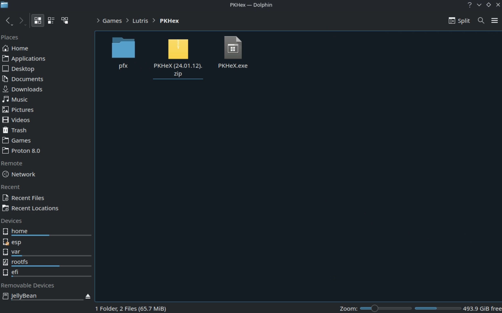
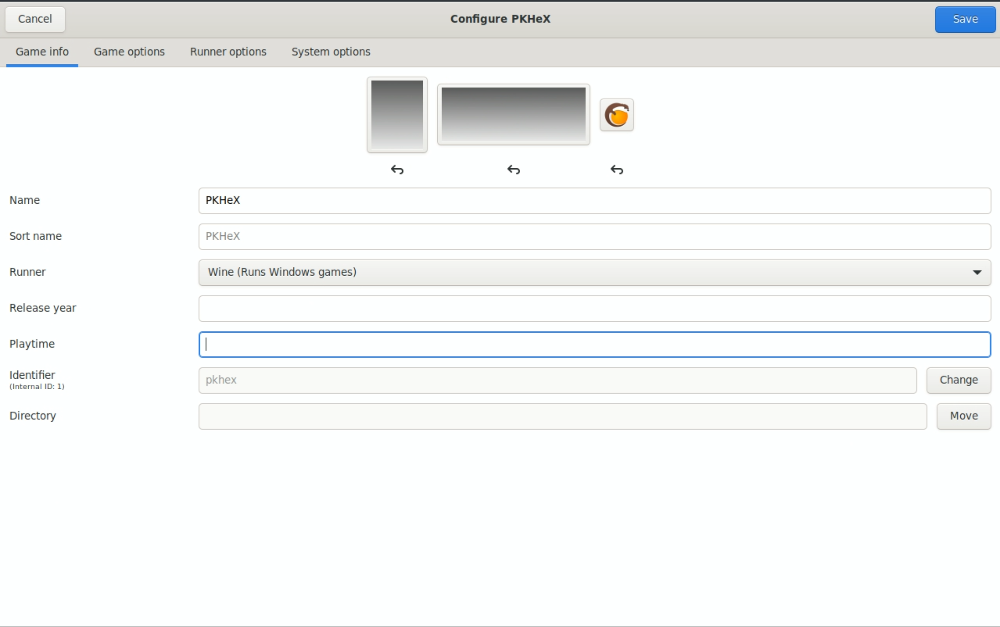
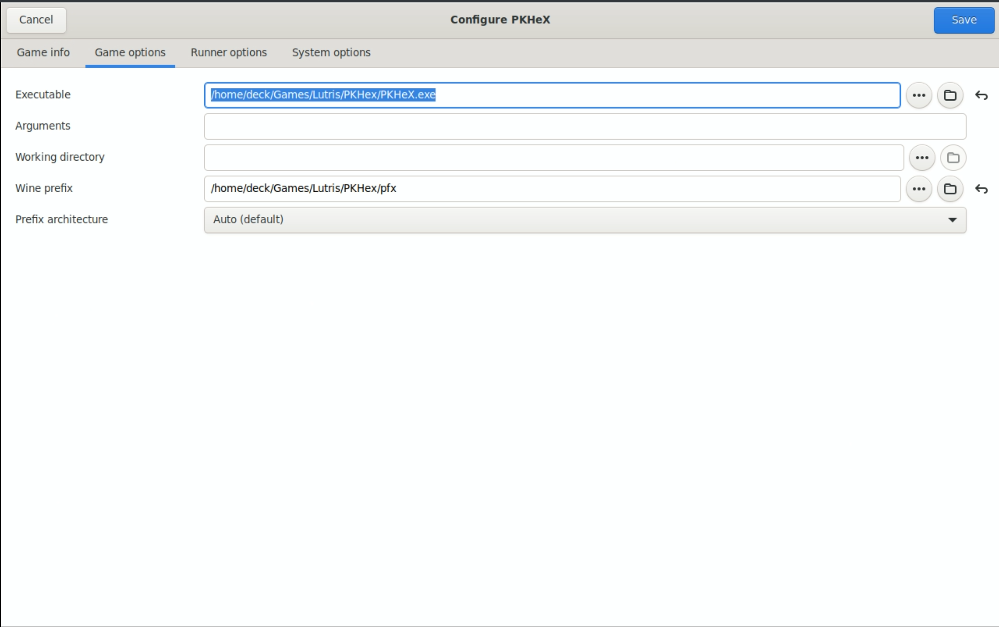
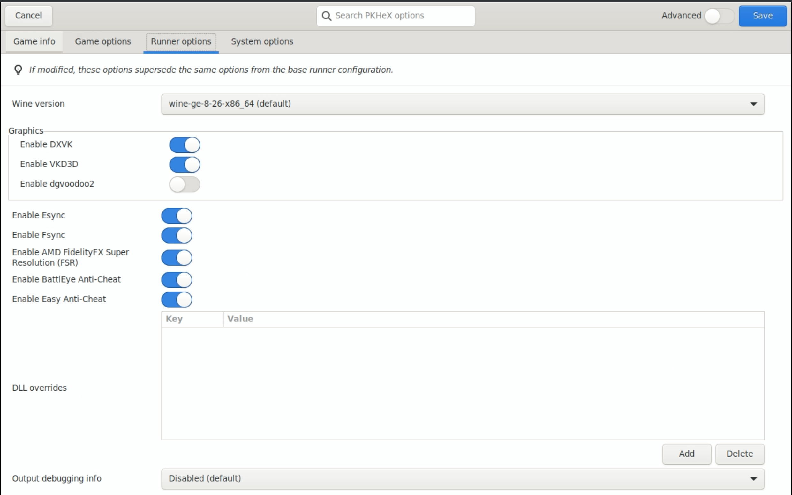
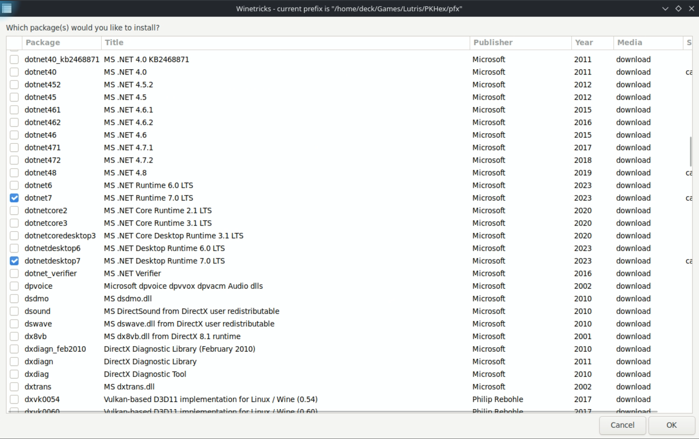
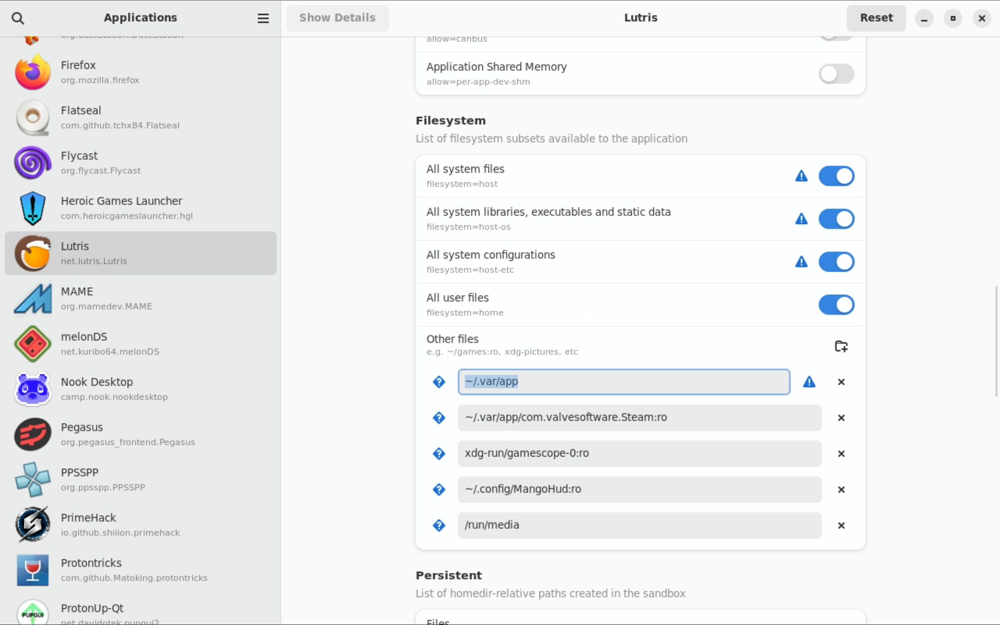
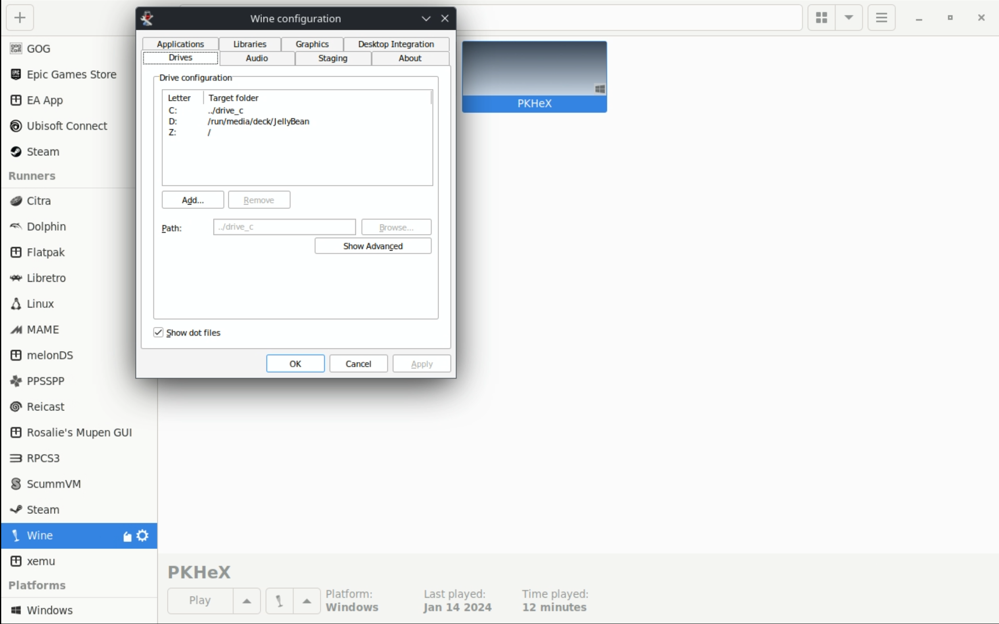

# Tools and Guides, learn the tricks of the emulation trade!

***

## Tools and Guides Table of Contents

[TOC]

***

## Tools

***

### How to Set Up SyncThing
[Back to the Top](#tools-and-guides-table-of-contents)

[SyncThing](https://syncthing.net/) is a free self hosted "cloud" solution. There are limitations, the biggest here with the steam deck and the way EmuDeck moves/renames folders and the use of symlinks which is a “virtual file or folder” that can point to another. This is VERY nice, but due to the nature of differing filesystems, there is a reason SyncThing does not support this, and this tutorial avoids symlinks. Emudeck does make a few changes where syncing is not as straightforward as it could be, simply because the devs changed the default folder via the emulator. PCSX2 savestates and memcard folders are not only named differently from default but also moved from their default directory.
 
On the PC/Mac end, you will want to setup SynctThing to the corresponding location which will differ for each user. Just use your head, and would be wise to copy the same `Ignore Patterns`

Ryujinx and Yuzu, I find it easiest to share the entire `NAND` (Yuzu) / `User` (Ryujinx) so that the user ID is the same on your OTHER device, and if the save is locked to an ID, you still have access to it. This does mean, before setting up Syncthing, BACKUP BACKUP BACKUP! Choose your Syncthing `File Versioning` as desired. Some systems/games may save often (IE Nintendo Switch) causing more overhead or even problems with a file versioning choice. 

**Steam Deck Syncthing paths and Ignore Patterns:**

MAME SaveData:
    
    path="/home/deck/.mame"
    Ignore Patterns
    // DO NOT IGNORE
    !/nvram
    !/sta
    // IGNORE
    *
    .DS_Store

Flycast SaveData:
    
    path="/run/media/mmcblk0p1/Emulation/saves/flycast/saves"

DuckStation MemCards:
    
    path="/run/media/mmcblk0p1/Emulation/saves/duckstation/saves"

RetroArch SaveData: 
    
    path="/home/deck/.var/app/org.libretro.RetroArch/config/retroarch"
    Ignore Patterns
    // DO NOT IGNORE
    !/states
    !/saves
    // IGNORE
    *
    .DS_Store

Ryujinx SaveData:

    path="/home/deck/.config/Ryujinx/bis/"

RPCS3 SaveData:
    
    path="/run/media/mmcblk0p1/Emulation/saves/rpcs3/saves"

Dolphin SaveData:

    path="/home/deck/.var/app/org.DolphinEmu.dolphin-emu/data/dolphin-emu
    Ignore Patterns
    // DO NOT IGNORE
    !/GC
    !/Wii
    !/GBA
    !/states
    !/StateSaves
    // IGNORE
    *
    .DS_Store

PrimeHack SaveData:
    
    path="/home/deck/.var/app/io.github.shiiion.primehack/data/dolphin-emu"
    Ignore Patterns
    // DO NOT IGNORE
    !/GC
    !/Wii
    !/GBA
    !/states
    !/StateSaves
    // IGNORE
    *
    .DS_Store

PPSSPP SaveData

    path="/home/deck/.var/app/org.ppsspp.PPSSPP/config/ppsspp/PSP"
    Ignore Patterns
    // DO NOT IGNORE
    !/PPSSPP_STATE
    !/SAVEDATA
    // IGNORE
    *
    .DS_Store

Citra SaveData:

    path="/home/deck/.var/app/org.citra_emu.citra/data/citra-emu"
    Ignore Patterns:
    // DO NOT IGNORE
    !/cheats
    !/nand
    !/sdmc
    !/sysdata
    // IGNORE
    *
    .DS_Store

PCSX2 SaveStates:

    path="/run/media/mmcblk0p1/Emulation/saves/pcsx2/states"

PCSX2 MemCards:

    path="/run/media/mmcblk0p1/Emulation/saves/pcsx2/saves"

Yuzu NAND:

    path="/run/media/mmcblk0p1/Emulation/storage/yuzu/nand/"

**Permissions:**

Syncthing will need access to any folder in `~/.var`
Install then open *FlatSeal* (A Permissions Editor with nice GUI, can be downloaded/installed via Discover in desktop mode)

Open Flatseal and click on Synching GTK>Filesystem>Other Files

    ~/.var/app/io.github.shiion.primehack/data/dolphin-emu
    ~/.var/app/org.citra_emu.citra/data/citra-emu
    ~/.var/app/org.DolphinEmu.dolphin-emu/data/dolphin-emu
    ~/.var/app/org.libretro.RetroArch/config/retroarch
    ~/.var/app/org.ppsspp.PPSSPP/config/ppsspp/PSP

Flatseal example via Steam Deck:

**Start Syncthing Automatically:**

Quit the Syncthing Daemon

Open Konsole and type 

    nano ~/.config/systemd/user/syncthing.service

Input this text:
    
    [Unit]
    Description=Syncthing

    [Service]
    Type=simple
    ExecStart=flatpak run --command=syncthing me.kozec.syncthingtk
    Restart=on-failure
    RestartSec=1
    SuccessExitStatus=3 4

    [Install]
    WantedBy=default.target

Save by typing the key command: Control O and pressing enter to confirm.

Continue in Konsole and type:

    systemctl --user enable syncthing

    systemctl --user start syncthing

If you wish to disable Syncthing starting @ launch:
   
    systemctl --user stop syncthing

    systemctl --user disable syncthing

If you use Decky, change the syncthing GUI port so it does not conflict to port 8384

**or** run this command via Konsole:

    systemctl --user stop syncthing

    sed -i 's/<address>127\.0\.0\.1:8080<\/address>/<address>127.0.0.1:8384<\/address>/' ~/.var/app/me.kozec.syncthingtk/config/syncthing/config.xml

    systemctl --user start syncthing

Anyway, now with this, you have a roadmap to sync anything else that you desire! As to other non-console saves, remember some are not compatible between systems: lookup linux Tomb Raider vs Windows Tomb Raider. Now smack the devs heads for that one.
Now if I can figure out a way to share prefixes between non-steam games so that I can sync C:Users/user/Appdata etc etc..... then all my non-steam games do not need individual Syncthing setup outside of a very convoluted Ignore Files list.

***

## Guides

***

### How to Set Up PKHeX
[Back to the Top](#tools-and-guides-table-of-contents)

This section will cover how to download and set up PKHeX. For the GitHub repo, see [https://github.com/kwsch/PKHeX](https://github.com/kwsch/PKHeX).

!!! quote 

    PKHeX is a "Pokémon core series save editor, programmed in C#."

#### Set up Folders

1. In Desktop Mode, open Konsole
2. Enter:
    * `mkdir -p $HOME/Games/Lutris/PKHeX/pfx`
    * This command will create a couple of **empty** folders to make managing and installing PKHeX easier
3. Open the PKHeX download page: [https://projectpokemon.org/home/files/file/1-pkhex/](https://projectpokemon.org/home/files/file/1-pkhex/), click `See changelog`, click `23.10.11`, click the `Download` button to the right of `With version 23.10.11:`, download PKHeX to `$HOME/Games/Lutris/PKHeX`
    * Newer versions of PKHEX require dotnet 8 which is too new for these installation instructions
    * If you are on a Steam Deck, this path may be `/home/deck/Games/Lutris/PKHeX`
3. Right click `PKHeX (23.10.11).zip`, click `Extract`, `Extract Archive Here`

#### Set up Lutris

1. In Desktop Mode, open Discover and download Lutris
2. Open Lutris
3. Click the `Wine` button on the left, click the little page icon to the right, download `wine-ge-8-26`
4. Click the `+` button in the top left of the Lutris application
5. Click `Add locally installed game`
6. On the `Game Info` tab:
    * Name: PKHeX
    * Sort Name: Leave Blank
    * Runner: Wine (Runs Windows games)
    * Release Year: Leave Blank
    * 
7. On the `Game Options` tab:
    * Executable: Click the `Browse` button and navigate to the `PKHeX.exe` file in `$HOME/Games/Lutris/PKHeX`
        * If you are on a Steam Deck, this path may be `/home/deck/Games/Lutris/PKHeX`
    * Arguments: Leave Blank
    * Working Directory: Leave Blank
    * Wine Prefix: Click the `Browse` button and select the `$HOME/Games/Lutris/PKHeX/pfx` folder
        * If you are on a Steam Deck, this path may be `/home/deck/Games/Lutris/PKHeX/pfx`
    * 
8. On the `Runner options` tab:
    * Wine version: `wine-ge-8.26-x86_64`
    * Leave everything else at defaults
    * 
9. Click the `Save` button in the top right
10. Single click the `PKHeX` tile in Lutris, click the `Wine` icon at the bottom of the Lutris application, click `Winetricks`
11. Click `Select the default wineprefix`
12. Click `Install a Windows DLL or component`
13. Locate `dotnet7` in the list and check the box to the left of `dotnet7 MS.NET Runtime 7.0 LTS`
15. Locate `dotnetdesktop7` in the list and check the box to the left of `dotnetdesktop7`
16. Click `OK`, wait a few moments for it to install
    * 
17. Close out of winetricks
18. To open PKHeX, open Lutris, select the PKHeX tile, and click `Play`

If PKHeX initially opens in a tiny window, click the `Stop` button in Lutris to force close it. Re-open PKHeX and the window should return to normal.

If you would like to add PKHeX to Game Mode, you may right click the PKHeX tile in Lutris and click `Create steam shortcut`.

#### How to Access Saves

Emulator configurations and saves when installed on Linux are typically stored in hidden folders (such as RetroArch). To access these saves requires a little bit of extra work. 

**Here's How**

##### Flatseal

1. In Desktop Mode, open Discover and download Flatseal
2. Open Flatseal and click Lutris on the left hand side of the screen
3. Scroll down to Filesystem
4. Under `Other files`, click the "Add folder" (Folder with a plus icon) button and enter `/run/media`
5. Under `Other files`, click the "Add folder" (Folder with a plus icon) button and enter `~/.var/app`
6. Close out of Flatseal and proceed to the next section

##### Lutris

1. Open Lutris
2. Single click the `PKHeX` tile in Lutris, click the `Wine` icon at the bottom of the Lutris application, click `Wine configuration`
3. Click the `Drives` tab, check `Show dot files`, click `Apply`, `OK`
4. Open PKHeX and navigate to your saves
    * See the [Save Management](../../save-management/steamos/save-management.md) page for specific save locations

***

### How to Set Up mymc
[Back to the Top](#tools-and-guides-table-of-contents)

This section will cover how to download and set up mymc. For the website, see [http://www.csclub.uwaterloo.ca:11068/mymc/](http://www.csclub.uwaterloo.ca:11068/mymc/).

!!! quote 

    mymc is a public domain utility for working with PlayStation 2 memory card images (.ps2) as used by the PlayStation 2 emulator PCSX2. It allows save files in the MAX Drive (.max), EMS (.psu), SharkPort (.sps), X-Port (.xps) and Code Breaker (.cbs) formats to be imported directly into these images. It can also export save files in either the MAX Drive and EMS formats.

#### Set up Folders

1. In Desktop Mode, open Konsole
2. Enter:
    * `mkdir -p $HOME/Games/Lutris/mymc/pfx`
    * This command will create a couple of **empty** folders to make managing and installing mymc easier
3. Download the latest version of mymc from the bottom of the page at [http://www.csclub.uwaterloo.ca:11068/mymc/](http://www.csclub.uwaterloo.ca:11068/mymc/) to `$HOME/Games/Lutris/mymc`
3. Right click `mymc-alpha-#.#.zip`, click `Extract`, `Extract Archive Here`
    * The `#.#` refer to the version numbers which may vary depending on when you downloaded mymc

#### Set up Lutris

1. In Desktop Mode, open Discover and download Lutris
2. Open Lutris
3. Click the `Wine` button on the left, click the little page icon to the right, download `Lutris-7-2.2`
4. Click the `+` button in the top left of the Lutris application
5. Click `Add locally installed game`
6. On the `Game Info` tab:
    * Name: mymc
    * Sort Name: Leave Blank
    * Runner: Wine (Runs Windows games)
    * Release Year: Leave Blank
7. On the `Game Options` tab:
    * Executable: Click the `Browse` button and navigate to the `mymc-gui.exe` file in `$HOME/Games/Lutris/mymc`
        * If you are on a Steam Deck, this path may be `/home/deck/Games/Lutris/mymc`
    * Arguments: Leave Blank
    * Working Directory: Leave Blank
    * Wine Prefix: Click the `Browse` button and select the `$HOME/Games/Lutris/mymc/pfx` folder
        * If you are on a Steam Deck, this path may be `/home/deck/Games/Lutris/mymc/pfx`
8. On the `Runner options` tab:
    * Wine version: `Lutris-7-2.2-x86_64`
    * Leave everything else at defaults
9. Click the `Save` button in the top right
10. To open mymc, open Lutris, select the mymc tile, and click `Play`

If you would like to add mymc to Game Mode, you may right click the mymc tile in Lutris and click `Create steam shortcut`.

#### How to Access Saves

If your saves are on an external drive or SD Card, you will need to apply a few settings for Lutris to see these removable storage devices properly. 

**Here's How**

##### Flatseal

1. In Desktop Mode, open Discover and download Flatseal
2. Open Flatseal and click Lutris on the left hand side of the screen
3. Scroll down to Filesystem
4.  Under `Other files`, click the "Add folder" (Folder with a plus icon) button and enter `~/run/media`
5. Close out of Flatseal and re-open mymc through Lutris
6. Your removable storage devices will now be accessible through Lutris

***

### How to Set Up XboxEepromEditor
[Back to the Top](#tools-and-guides-table-of-contents)

This section will cover how to download and set up XboxEepromEditor. For the GitHub, see [https://github.com/Ernegien/XboxEepromEditor](https://github.com/Ernegien/XboxEepromEditor).

!!! quote 

    XboxEepromEditor "allows for generating and/or editing the contents of an Original Xbox EEPROM".

#### Set up Folders

1. In Desktop Mode, open Konsole
2. Enter:
    * `mkdir -p $HOME/Games/Lutris/XboxEepromEditor/pfx`
    * This command will create a couple of **empty** folders to make managing and installing XboxEepromEditor easier
3. Download the latest version of XboxEepromEditor, [https://github.com/Ernegien/XboxEepromEditor/releases](https://github.com/Ernegien/XboxEepromEditor/releases) to `$HOME/Games/Lutris/XboxEepromEditor`
    * Download the `XboxEepromEditor.#.#.#.#.zip` file
        * The `#.#.#.#` refer to the version numbers. These may vary depending on when you download the latest release
3. Right click `XboxEepromEditor.#.#.#.#.zip`, click `Extract`, `Extract Archive Here`
    * The `#.#.#.#` refer to the version numbers which may vary depending on when you downloaded XboxEepromEditor

#### Set up Lutris

1. In Desktop Mode, open Discover and download Lutris
2. Open Lutris
3. Click the `Wine` button on the left, click the little page icon to the right, download `Lutris-7-2.2`
4. Click the `+` button in the top left of the Lutris application
5. Click `Add locally installed game`
6. On the `Game Info` tab:
    * Name: XboxEepromEditor
    * Sort Name: Leave Blank
    * Runner: Wine (Runs Windows games)
    * Release Year: Leave Blank
7. On the `Game Options` tab:
    * Executable: Click the `Browse` button and navigate to the `XboxEepromEditor.exe` file in `$HOME/Games/Lutris/XboxEepromEditor`
        * If you are on a Steam Deck, this path may be `/home/deck/Games/Lutris/XboxEepromEditor`
    * Arguments: Leave Blank
    * Working Directory: Leave Blank
    * Wine Prefix: Click the `Browse` button and select the `$HOME/Games/Lutris/XboxEepromEditor/pfx` folder
        * If you are on a Steam Deck, this path may be `/home/deck/Games/Lutris/XboxEepromEditor/pfx`
8. On the `Runner options` tab:
    * Wine version: `Lutris-7-2.2-x86_64`
    * Leave everything else at defaults
9. Click the `Save` button in the top right
10. To open XboxEepromEditor, open Lutris, select the XboxEepromEditor tile, and click `Play`

If you would like to add XboxEepromEditor to Game Mode, you may right click the XboxEepromEditor tile in Lutris and click `Create steam shortcut`.

#### How to Access Saves

If your saves are on an external drive or SD Card, you will need to apply a few settings for Lutris to see these removable storage devices properly. 

**Here's How**

##### Flatseal

1. In Desktop Mode, open Discover and download Flatseal
2. Open Flatseal and click Lutris on the left hand side of the screen
3. Scroll down to Filesystem
4.  Under `Other files`, click the "Add folder" (Folder with a plus icon) button and enter `~/run/media`
5. Under `Other files`, click the "Add folder" (Folder with a plus icon) button and enter `~/.var/app`
6. Close out of Flatseal and re-open XboxEepromEditor through Lutris
7. Your removable storage devices will now be accessible through Lutris

***

### How to Set Up Aemulus Package Manager
[Back to the Top](#tools-and-guides-table-of-contents)

This section will cover how to download and set up Aemulus Package Manager. For the GitHub, see [https://github.com/TekkaGB/AemulusModManager/releases](https://github.com/TekkaGB/AemulusModManager/releases)

!!! quote 

    Aemulus Package Manager is a program that downloads, organizes, merges, and builds mod loadouts for many of the Persona games.

This section uses modified instructions originally sourced from [https://github.com/TekkaGB/AemulusModManager/issues/97](https://github.com/TekkaGB/AemulusModManager/issues/97)

This section is specifically for Aemulus Package Manager. For detailed instructions on how to mod Persona 3 FES, see [How to Mod Persona 3 FES](../../emulators/steamos/pcsx2.md#how-to-mod-persona-3-fes).

#### Set up Folders

1. In Desktop Mode, open Konsole
2. Enter:
    * `mkdir -p $HOME/Games/Lutris/AemulusPackageManager/pfx`
    * This command will create a couple of **empty** folders to make managing and installing Aemulus Package Manager easier
3. Download the latest version of Aemulus Package Manager, [https://github.com/TekkaGB/AemulusModManager/releases](https://github.com/TekkaGB/AemulusModManager/releases) to `$HOME/Games/Lutris/AemulusPackageManager`
    * Download the `AemulusPackageManagerv#.#.#.7z` file
        * The `#.#.#` refer to the version numbers. These may vary depending on when you download the latest release
3. Right click `AemulusPackageManagerv#.#.#.7z`, click `Extract`, `Extract Archive Here`
    * The `#.#.#` refer to the version numbers which may vary depending on when you downloaded Aemulus Package Manager

#### Set up Lutris

1. In Desktop Mode, open Discover and download Lutris
2. Open Lutris
3. Click the `Wine` button on the left, click the little page icon to the right, download `wine-ge-8-26`
4. Click the `+` button in the top left of the Lutris application
5. Click `Add locally installed game`
6. On the `Game Info` tab:
    * Name: Aemulus Package Manager
    * Sort Name: Leave Blank
    * Runner: Wine (Runs Windows games)
    * Release Year: Leave Blank
7. On the `Game Options` tab:
    * Executable: Click the `Browse` button and navigate to the `AemulusPackageManager.exe.exe` file in `$HOME/Games/Lutris/AemulusPackageManager`
        * If you are on a Steam Deck, this path may be `/home/deck/Games/Lutris/AemulusPackageManager`
    * Arguments: Leave Blank
    * Working Directory: Leave Blank
    * Wine Prefix: Click the `Browse` button and select the `$HOME/Games/Lutris/AemulusPackageManager/pfx` folder
        * If you are on a Steam Deck, this path may be `/home/deck/Games/Lutris/AemulusPackageManager/pfx`
8. On the `Runner options` tab:
    * Wine version: `wine-ge-8.26-x86_64`
    * Leave everything else at defaults
9. Click the `Save` button in the top right
10. Single click the `Aemulus Package Manager` tile in Lutris, click the `Wine` icon at the bottom of the Lutris application, click `Winetricks`
11. Click `Select the default wineprefix`
12. Click `Install a Windows DLL or component`
13. Locate `dotnetdesktop7` in the list and check the box to the left of `dotnetdesktop7`
14. If you are modding Persona 4, locate `dotnetcoredesktop3` in the list and check the box to the left of `dotnetcoredesktop3`
15. If you are modding Persona 5, locate `vcrun2010` in the list and check the box to the left of `vcrun2010`
16. Click `OK`, wait a few moments for it to install
    * Do note that this step may take several minutes
17. Close out of winetricks
18. To open Aemulus Package Manager, open Lutris, select the Aemulus Package Manager tile, and click `Play`

If you would like to add Aemulus Package Manager to Game Mode, you may right click the Aemulus Package Manager tile in Lutris and click `Create steam shortcut`.

!!! info

    When selecting paths, you may see a black box. To fix this, you may either close out and re-open the application or highlight the text to make it readable. The browse button may also be hidden at first glance, but if you hover your mouse over it, you can click it and select your preferred paths. If you prefer, you may also edit the config file, AemulusPackageManager.exe.config in $HOME/Games/Lutris/AemulusPackageManager.

***

### How to Use ROM Hacks
[Back to the Top](#tools-and-guides-table-of-contents)

**ROM Hack Sources**

_This list is not exhaustive_

* GameBanana: [https://gamebanana.com/](https://gamebanana.com/)
* GBAtemp: [https://gbatemp.net/](https://gbatemp.net/)
* Metroid Construction: [https://metroidconstruction.com/hacks.php](https://metroidconstruction.com/hacks.php)
* PokeCommunity: [https://www.pokecommunity.com/](https://www.pokecommunity.com/)
* ROMHacking: [https://www.romhacking.net/](https://www.romhacking.net/)
* SegaXtreme: [https://segaxtreme.net/resources/categories/translations.9/](https://segaxtreme.net/resources/categories/translations.9/)
* SMW Central: [https://www.smwcentral.net/?p=main](https://www.smwcentral.net/?p=main)

**IMPORTANT** 

  * Everything can be done on the Steam Deck itself
  * If you plan on using Steam ROM Manager to add this ROM Hack to Steam, it may not have art yet on [https://www.steamgriddb.com/](https://www.steamgriddb.com/). If it does not have art, create a page here: [https://www.steamgriddb.com/](https://www.steamgriddb.com/) and locate some custom art for the ROM Hack so others can use it in the future as well. 
  * Not all ROM Hacks can be applied using the following method. For ROM Hacks that do not use the below method and do not have a Linux equivalent program to apply patches, you can either use Wine/Proton (through Lutris or Steam), or you can use a Windows computer to apply these patches and transfer over the patched ROM Hack. 

**Tutorial**

1. Locate a ROM Hack you would like to use and its associated game ROM
    * Example: 
        * File 1: A clean ROM of Pokemon Emerald for the Nintendo Gameboy Advance
        * File 2: A ROM Hack that turns Pokemon Emerald into a roguelike: [https://www.pokecommunity.com/showthread.php?t=479406](https://www.pokecommunity.com/showthread.php?t=479406)
    * Your ROM Hack patch file may end with one of the following file extensions: `IPS`, `UPS`, `APS`, `BPS`, `RUP`, `PPF`, `MOD`, `XDELTA`, `VCDIFF`
2.  (Optional) Some ROM Hacks expect a specific hash, use [https://www.romhacking.net/hash/](https://www.romhacking.net/hash/), to check the hash of your ROM
    * You can also check hashes in the Dolphin file manager on the Steam Deck by doing the following: 
          * Right click the ROM
          * Click Properties
          * Click the Checksums tab
          * Click `Calculate` to the right of the checksum algorithm (typically MD5 or SHA-256)
3. Depending on your ROM Hack patch file, open: 
	* [https://www.romhacking.net/patch/](https://www.romhacking.net/patch/)
		* Supported ROM Hack file types: `IPS`, `UPS`, `APS`, `BPS`, `RUP`, `PPF`, `MOD`, `XDELTA` (XDelta2 specifically), `VCDIFF`
	* [https://kotcrab.github.io/xdelta-wasm/](https://kotcrab.github.io/xdelta-wasm/)
		* `XDELTA` (XDelta3 specifically)
4. For the top field, `ROM File` or `Source file`, browse to your clean ROM
5. For the bottom field, `Patch File`, browse to your patch
6. Click `Apply Patch` 
7. Save this newly patched ROM, rename it to match the ROM Hack, and place it in the respective system folder within `Emulation/roms`
8. Treat the patched ROM file as its own distinct game from the original ROM file, you may use either Steam ROM Manager or EmulationStation-DE to play your newly patched ROM

***

## How to Contribute to This Page
[Back to the Top](#tools-and-guides-table-of-contents)

You will need to **create** a GitHub account first. To sign up for GitHub, see [https://github.com/signup](https://github.com/signup).

1. Open [https://github.com/EmuDeck/emudeck.github.io/blob/main/docs/community-creations/steamos/tools-and-guides.md](https://github.com/EmuDeck/emudeck.github.io/blob/main/docs/community-creations/steamos/tools-and-guides.md)
2. Click the `Pencil` icon in the top right
3. Create a new section header below the most recently added section under the respective category using three `###` and the name of the section after the three `###`
	* For example, `### My Great Guide to Unlocking the Secrets of the Steam Deck!`
    * Your section will automatically be added to the Table of Contents
4. Write your section under your newly created header
5. Once you are finished making your changes, click the `Commit changes...` button in the top right
    * 
6. You will be prompted to create a Pull Request. Add a little bit of detail about what you added and why
    * 
    * You will not see the option to `Commit directly to the main branch` so do not worry about inadvertently making any changes
7. Submit your Pull Request
8. Once your Pull Request is reviewed, it will be merged and any of your changes will automatically be deployed to this page

***
