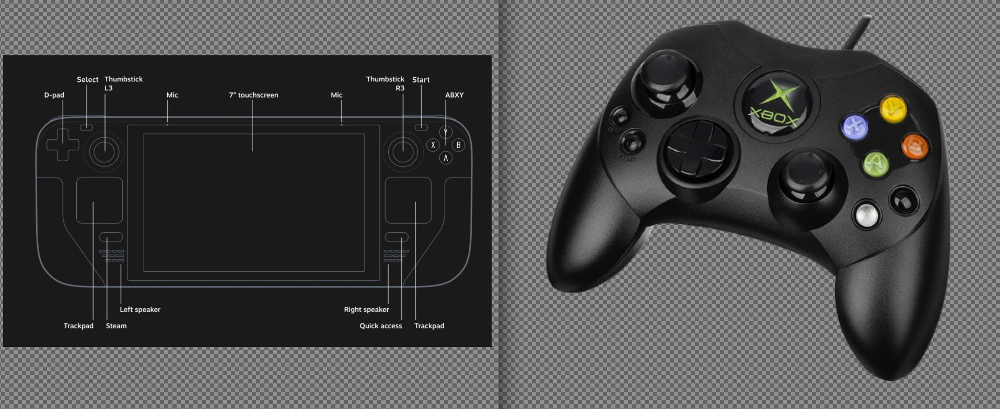

# Controls 101, match your Steam Deck buttons to the original controllers. 

***

## Controls 101 Table of Contents

1. [Configuration](#controls-101-configuration)
      - [Steam Deck Button Layout](#steam-deck-button-layout)

2. [Controls 101](#controls-101)
    - [Microsoft Controllers](#microsoft-controllers)
        - [OG Xbox](#og-xbox)
    - [Nintendo Controllers](#nintendo-controllers)
        - [SNES](#snes)
        - [Nintendo 64](#nintendo-64)
        - [Gamecube](#gamecube)
        - [Wii](#wii)
    - [Personal Computers](#personal-computers)
        - [Commodore 64](#commodore-64)

3. [Controls Tips and Tricks](#controls-tips-and-tricks)
      - [How to Configure Controls](#how-to-configure-controls)

## Controls 101 Configuration
[Back to the Top](#controls-101-table-of-contents)

***

###  Steam Deck Button Layout
[Back to the Top](#controls-101-table-of-contents)

**Front:**

**Back and Top:** 

***

## Controls 101
[Back to the Top](#controls-101-table-of-contents)

***

### Microsoft Controllers
[Back to the Top](#controls-101-table-of-contents)

***

#### OG Xbox
[Back to the Top](#controls-101-table-of-contents)

**OG Xbox Controller**

#####  Chart

| Steam Deck       | OG Xbox            |
|------------------|--------------------|
| DPAD Up          | DPAD Up            |
| DPAD Down        | DPAD Down          |
| DPAD Left        | DPAD Left          |
| DPAD Right       | DPAD Right         |
| `A`              | `A `               |
| `B`              | `B`                |
| `X`              | `X`                |
| `Y`              | `Y`                |
| `L1`             | `White Button`     |
| `R1`             | `Black Button`     |

***

###  Nintendo Controllers
[Back to the Top](#controls-101-table-of-contents)

***

####  SNES
[Back to the Top](#controls-101-table-of-contents)

**SNES Controller:**

#####  Chart

| Steam Deck       | SNES               |
|------------------|--------------------|
| DPAD Up          | DPAD Up            |
| DPAD Down        | DPAD Down          |
| DPAD Left        | DPAD Left          |
| DPAD Right       | DPAD Right         |
| `A`              | `B`                |
| `B`              | `A`                |
| `X`              | `Y`                |
| `Y`              | `X`                |
| `L1`             | `L`                |
| `R1`             | `R`                |

***

####  Nintendo 64
[Back to the Top](#controls-101-table-of-contents)

**Back:** 

#####  Chart

| Steam Deck       | Nintendo 64        |
|------------------|--------------------|
| DPAD Up          | DPAD Up            |
| DPAD Down        | DPAD Down          |
| DPAD Left        | DPAD Left          |
| DPAD Right       | DPAD Right         |
| `A`              | `B`                |
| `B`              | `A`                |
| `L`              | `L`                |
| `R`              | `R`                |
| `L1`             | `Z`                |
| `R1`             | `C Buttons Mode`   |
| `L2`             | `L`                |
| `R2`             | `R`                |
| `R1` + `Y`       | `Up C Button`      |
| `R1` + `A`       | `Down C Button`    |
| `R1` + `X`       | `Left C Button`    |
| `R1` + `B`       | `Right C Button`   |
| Right Stick `Up`  | `Up C Button`     |
| Right Stick `Down`| `Down C Button`   |
| Right Stick `Left`| `Left C Button`   |
| Right Stick `Right` | `Right C Button`|

***

####  Gamecube
[Back to the Top](#controls-101-table-of-contents)

#####  Chart

| Steam Deck       | Gamecube           |
|------------------|--------------------|
| DPAD Up          | DPAD Up            |
| DPAD Down        | DPAD Down          |
| DPAD Left        | DPAD Left          |
| DPAD Right       | DPAD Right         |
| `A`              | `A`                |
| `X`              | `B`                |
| `B`              | `X`                |
| `Y`              | `Y`                |
| `R1`             | `Z`                |
| `L2`             | `L`                |
| `R2`             | `R`                |
| `Left Stick`     | `Control Stick`    |
| `Right Stick`    | `C Stick`          |

***

####  Wii
[Back to the Top](#controls-101-table-of-contents)

**Nunchuk:** 

#####  Chart

| Steam Deck       | Wii                |
|------------------|--------------------|
| DPAD Up          | DPAD Up            |
| DPAD Down        | DPAD Down          |
| DPAD Left        | DPAD Left          |
| DPAD Right       | DPAD Right         |
| `A`              | `A`                |
| `B`              | `B`                |
| `X`              | `1`                |
| `Y`              | `2`                |
| `Select`         | `-`                |
| `Start`          | `+`                |
| `R1`             | Nunchuk `C`        |
| `R2`             | Nunchuk `Z`        |

***

###  Personal Computers
[Back to the Top](#controls-101-table-of-contents)

***

####  Commodore 64
[Back to the Top](#controls-101-table-of-contents)

***

### Controls Tips and Tricks
[Back to the Top](#controls-101-table-of-contents)

***

#### How to Configure Controls
[Back to the Top](#controls-101-table-of-contents)

If you find that EmuDeck's configurations do not line up with your expectations, you may easily change the controls in Desktop Mode.

1. In Desktop Mode, hold the `Start` button for 3 seconds to change to Gamepad configurations
2. In the Applications Launcher (Steam icon in the bottom left of your taskbar), select an emulator
3. In the emulator, locate the input configurations menu and configure the controls to your liking

If you are trying to change controls for a RetroArch core, see: [RetroArch: How to Change Controller Layouts on a Per Game Basis](../../emulators/steamos/retroarch.md#how-to-change-controller-layouts-on-a-per-game-basis) or [RetroArch: How to Change Controller Layouts for a System](../../emulators/steamos/retroarch.md#how-to-change-controller-layouts-for-a-system). 

With RetroArch, you may configure controls in either Desktop Mode or Game Mode. If you are configuring controls in Desktop Mode, do not forget to hold the `Start` button for seconds to change to Gamepad configurations.

**General Tips**

* Do note that some emulators may allow you to save these controls as separate profiles so you do not overwrite EmuDeck's defaults
* The various emulator pages have sections on where to find the respective emulator's configuration files and folders. These folders usually contain the config files for controller layouts, which you may either backup or share with others
* If you accidentally change an input setting and would like to reset to EmuDeck's defaults, you may do so on the `Manage Emulators` page in the EmuDeck application

***