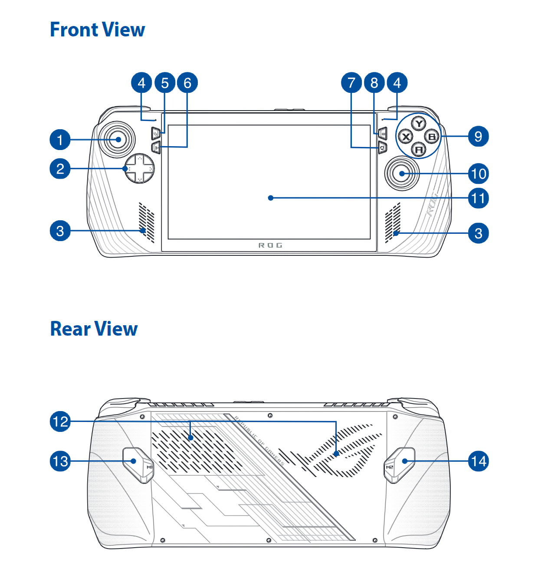
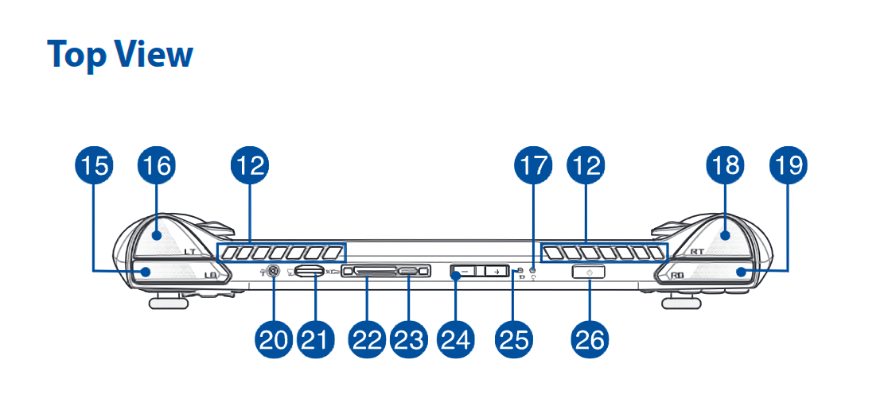

# Controls 101

***

## Controls 101 Table of Contents

[TOC]

***

## Devices
[Back to the Top](#controls-101-table-of-contents)

***

### ROG Ally
[Back to the Top](#controls-101-table-of-contents)

1. Left stick
2. Directional buttons
3. Audio speakers
4. Array microphones
5. View button
6. Command Center button
7. Armoury Crate button
8. Menu button
9. A/B/X/Y buttons
10. Right stick
11. Touch screen
12. Air vents
13. Macro 1 button
14. Macro 2 button
15. Left bumper
16. Left trigger
17. Power indicator
18. Right trigger
19. Right bumper
20. Headphone/Headset/Microphone jack
21. microSD card slot (supports up to UHS-II)
22. ROG XG Mobile interface
23. USB 3.2 Gen 2 Type-C®/DisplayPort 1.4/
Power (DC) input combo port
24. Volume buttons
25. Two-color battery charge indicator
26. Power button/Fingerprint sensor

***