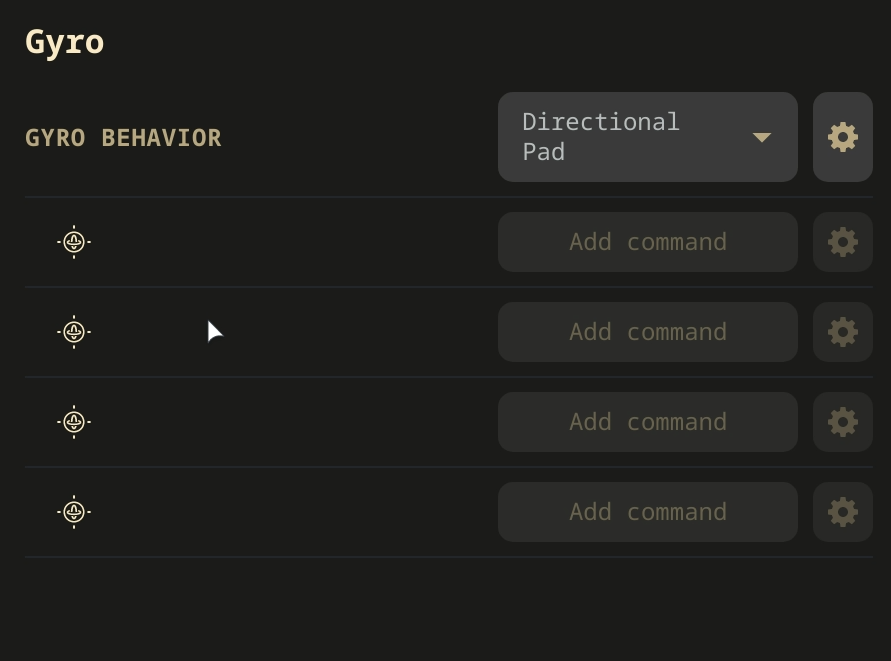

# EmuDeck Application 101: One Stop Shop for Emulation

A breakdown of the EmuDeck application and how to use its full suite of features.

***

### EmuDeck Application 101 Table of Contents

- [Getting Started with the EmuDeck Application](#getting-started-with-the-emudeck-application)
    - [USB Transfer Wizard](#usb-transfer-wizard)
    - [Quick Settings](#quick-settings)
    - [Manage Emulators](#manage-emulators)
    - [EmuDeck Store](#emudeck-store)
    - [Steam ROM Manager](#steam-rom-manager)
    - [Quick Reset](#quick-reset)
    - [Custom Reset](#custom-reset)
    - [Power Tools](#power-tools)
    - [DeckyControls](#decky-controls)
    - [SteamDeckGyroDSU](#steamdeckgyrodsu)
    - [EmuDeck Compressor](#emudeck-compressor)
    - [BIOS Checker](#bios-checker)
    - [Cloud Backup](#cloud-backup)
    - [Cloud Services Manager](#cloud-services-manager)
    - [RetroAchievements](#retroachievements)
    - [Migrate Installation](#migrate-installation)
    - [Fetch Log File](#fetch-log-file)
    - [Changelog](#changelog)
    - [Uninstall](#uninstall)
    - [Become a Patron](#become-a-patron)

***

## Getting Started with the EmuDeck Application
[Back to the Top](#emudeck-application-101-table-of-contents)

***

### USB Transfer Wizard
[Back to the Top](#emudeck-application-101-table-of-contents)

Use EmuDeck's USB Transfer Wizard to transfer files between your Steam Deck and another PC, using a USB stick.

***

### Quick Settings
[Back to the Top](#emudeck-application-101-table-of-contents)

Manage:

* Legacy Homebrew Games installation
* Bezels
* Sega Aspect Ratio
* NES & SNES Aspect Ratio
* 3D Aspect Ratio
* Gamecube Aspect Ratio
* CRT Shaders 2D
* CRT Shaders 3D
* LCD Shaders
* AutoSave

***

### Manage Emulators
[Back to the Top](#emudeck-application-101-table-of-contents)

Features:

* Update to latest EmuDeck configurations and optimizations for the various emulators and tools
* Reset emulators to EmuDeck's defaults
* Update emulators and tools to latest version
* Install advanced emulators like Xenia and Cemu (Native)
* Uninstall emulators and tools

***

### EmuDeck Store
[Back to the Top](#emudeck-application-101-table-of-contents)

Visit the [EmuDeck Store](../steamos/emudeck-store.md) page for more information.

***

### Steam ROM Manager
[Back to the Top](#emudeck-application-101-table-of-contents)

Use Steam ROM Manager to add ROMs, tools, and emulators to your Steam library as non-Steam shortcuts. Launching Steam ROM Manager through EmuDeck will exit out of Steam and revert your Steam Deck to "Lizard Mode". In "Lizard Mode", use L2 to right click, R2 to left click, and the trackpad to move your cursor.

Visit [Steam ROM Manager](../../tools/steamos/steam-rom-manager.md) for more information.

***

### Quick Reset
[Back to the Top](#emudeck-application-101-table-of-contents)

Quickly update or reset your entire installation to the latest EmuDeck version.

***

### Custom Reset
[Back to the Top](#emudeck-application-101-table-of-contents)

Update or reset your entire installation to the latest EmuDeck version in custom mode.

***

### Power Tools
[Back to the Top](#emudeck-application-101-table-of-contents)

Power Tools is a Decky Loader plugin that allows you to tweak power settings in Game Mode.

**How to Install Power Tools**

1. Open `EmuDeck` on your desktop
2. Select `Power Tools`
3. Enter your password, and click `Install Power Tools`
    * If you have not set a password, this page will prompt you to create one
4. Restart your Steam Deck
5. Decky Loader and Power Tools are now installed

**Recommended Settings**

* Power Tools: Turn SMT off
    * Open the `QAM` ("..." button), select the `Socket` icon, select `POWERTOOLS`, turn off `SMT`
        * Visual Reference: 
    * (Optional) Use the `Persistent` toggle to set these settings on a per-game basis
        * Visual Reference: 
* Steam Deck Performance Menu: Set Manual GPU Clock Control to 1200 frequency
    * Open the `QAM` ("..." button), select the `Battery` icon, enable `Advance View`, scroll down, enable `Manual GPU Clock Control`, and set it to `1200`
        * Visual Reference: 
    * Toggle per game profiles
        * Visual Reference: 
* **IMPORTANT:** Some games will not perform well regardless and will require the respective emulator team to improve compatibility
    * In some cases, these games may have workarounds through modifying settings or applying patches or mods. Search on Google for your respective game, and see if these workarounds exist
    * Visit the emulator's compatibility list to see if the game performs well on the respective emulator

***

### DeckyControls
[Back to the Top](#emudeck-application-101-table-of-contents)

DeckyControls is an EmuDeck plugin that allows you to view EmuDeck's hotkeys in Game Mode.

After installing `DeckyControls`, restart your Steam Deck (Returning to Game Mode is not equivalent to a restart).

**How to Use DeckyControls**

1. In Game Mode, press the `...` (QAM), press the `Socket` Icon
2. Select `EmuDeck Hotkeys`
    * 
3. Select a system
    * 
4. A page with the hotkeys for that system will pop up on your screen
    * Using Citra as an example:
        * 

***

### SteamDeckGyroDSU
[Back to the Top](#emudeck-application-101-table-of-contents)

SteamDeckGyroDSU is a tool that allows emulators to use Steam Deck's gyro.

SteamDeckGyroDSU's website: [https://github.com/kmicki/SteamDeckGyroDSU](https://github.com/kmicki/SteamDeckGyroDSU)

**Which emulators can use SteamDeckGyroDSU?**

* [Dolphin (Gamecube and Wii)](https://dolphin-emu.org/)
* [Citra (3DS)](https://citra-emu.org/)
* [Cemu (Wii U)](https://cemu.info/)
* [Yuzu (Switch)](https://yuzu-emu.org/)
* [Ryujinx (Switch)](https://ryujinx.org/)

##### How to Install SteamDeckGyroDSU

1. Open `EmuDeck` on your desktop
2. Select `SteamDeckGyroDSU`
3. Enter your password, and click `Install GyroDSU`
    * If you have not set a password, this page will prompt you to create one
4. Restart your Steam Deck
5. SteamDeckGyroDSU is now installed

##### How to Use SteamDeckGyroDSU

1. In Game Mode, while in a game, press the `STEAM` button
2. Open Controller Settings 
3. Edit layout
4. Select `Gyro`
5. Select `Gyro Behavior`
6. Select `Directional Pad`
    * You do not need to set anything for the four buttons below `Gyro Behavior`

***

### EmuDeck Compressor
[Back to the Top](#emudeck-application-101-table-of-contents)

Features:
* Compresses PlayStation X, Sega CD, Sega Saturn, PC Engine CD, PCFX, Amiga CD, Neo Geo CD, and Mega CD games to CHD
* Compresses Gamecube and Wii games to RVZ
* Compresses PSP games to CSO

***

### BIOS Checker
[Back to the Top](#emudeck-application-101-table-of-contents)

Features:

* Validates that you have the correct BIOS

***

### Cloud Backup
[Back to the Top](#emudeck-application-101-table-of-contents)

Visit the [Cloud Saves](../cloud-saves.md) page for more information.

***

### Cloud Services
[Back to the Top](#emudeck-application-101-table-of-contents)

Visit the [Cloud Services](../steamos/cloud-services.md) page for more information

***

### RetroAchievements
[Back to the Top](#emudeck-application-101-table-of-contents)

Retroachievements adds "achievements to your favourite retro games." Visit the Retroachievements website for more information, https://retroachievements.org/.

**Which emulators include Retroachievements?**

* [DuckStation (PlayStation 1)](https://www.duckstation.org/)
* [PCSX2 (PlayStation 2)](https://pcsx2.net/)
* [RetroArch (Multi-System Emulator)](https://www.retroarch.com/)
    - [List of RetroArch Cores Used by Emudeck](../../emulators/steamos/retroarch.md#list-of-retroarch-cores-used-by-emudeck)

***

### Migrate Installation
[Back to the Top](#emudeck-application-101-table-of-contents)

This feature migrates your EmuDeck install to your SD Card or vice versa.

The "Migrate Installation" utility does not delete your original installation. After you are finished migrating your EmuDeck installation, verify that it migrated successfully by checking the saves, BIOS, and ROMs. After you have verified your migration, you may delete the original installation.

***

### Fetch Log File
[Back to the Top](#emudeck-application-101-table-of-contents)

This features uploads your EmuDeck log to sprunge, which you may share with the EmuDeck team to debug any issues with your EmuDeck install.

***

### Changelog
[Back to the Top](#emudeck-application-101-table-of-contents)

Check what's new with EmuDeck.

***

### Uninstall
[Back to the Top](#emudeck-application-101-table-of-contents)

Remove EmuDeck from your system entirely. 

This feature **should not** be used to troubleshoot EmuDeck. Troubleshoot specific emulators or tools by visiting the respective GitHub Wiki pages, resetting the specific tool or emulator on the "Manage Emulators" page, or asking for support on EmuDeck's Discord or Reddit. 

***

### Become a Patron
[Back to the Top](#emudeck-application-101-table-of-contents)

Become a patron for early access to new features and a sneak peek of the Windows build.

EmuDeck Patreon link: [https://www.patreon.com/dragoonDorise](https://www.patreon.com/dragoonDorise)

***

 
