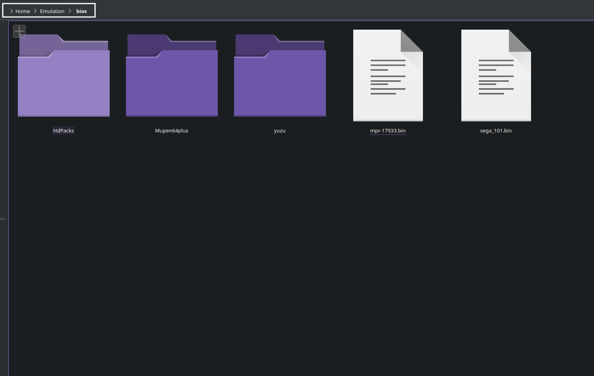
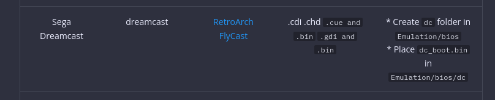
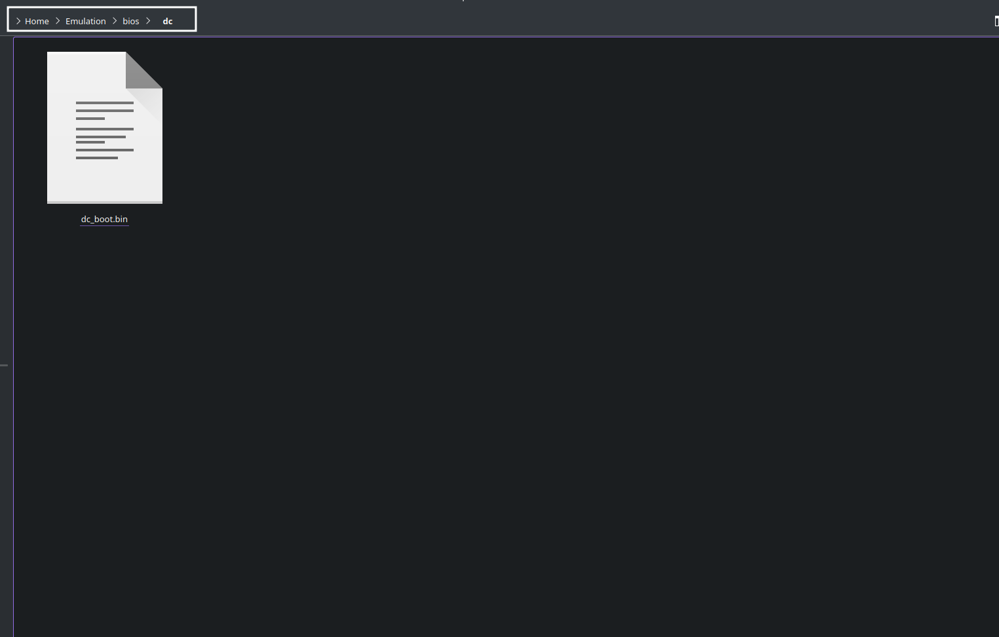
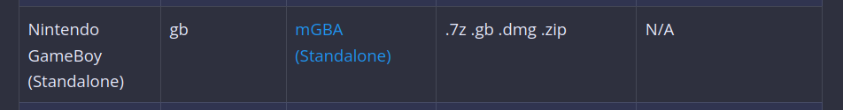

---
search:
  boost: 150 
---

# The Cheat Sheet is Your Tool to Success.

***

## What this page covers

* Emulator or RetroArch core names
* Expected ROM folder locations
* Expected ROM file types
* Expected BIOS (if required)
* Expected BIOS location
    * Typically, BIOS files are placed directly into the `Emulation/bios` folder. **Do not** make or use any additional folders unless otherwise specified on the charts below

***

## Cheat Sheet Table of Contents

1. [How to Use the Cheat Sheets](#how-to-use-the-cheat-sheets)
    - [How to Use the Tables](#how-to-use-the-tables)
    - [Where do I place the BIOS files?](#where-do-i-place-the-bios-files)
    - [For systems with multiple emulators, how do I select which emulator to use?](#for-systems-with-multiple-emulators-how-do-i-select-which-emulator-to-use)
    - [A Breakdown of Libretro Wiki Pages](#a-breakdown-of-libretro-wiki-pages)
    - [What is the difference between a RetroArch core and a standalone emulator?](#what-is-the-difference-between-a-retroarch-core-and-a-standalone-emulator)
2. [Cheat Sheets](#cheat-sheets)
    - [Arcade and MAME Related Emulation Cheat Sheet](#arcade-and-mame-related-emulation-cheat-sheet)
    - [Atari Cheat Sheet](#atari-cheat-sheet)
    - [Game Engine Recreations Cheat Sheet](#game-engine-recreations-cheat-sheet)
    - [Microsoft Cheat Sheet](#microsoft-cheat-sheet)
    - [Miscellaneous Consoles and Handhelds Cheat Sheet](#miscellaneous-consoles-and-handhelds-cheat-sheet)
        * Includes: 3DO, TurboGrafx, and Wonderswan
    - [Nintendo Cheat Sheet](#nintendo-cheat-sheet)
    - [Personal Computers Cheat Sheet](#personal-computers-cheat-sheet)
    - [Sega Cheat Sheet](#sega-cheat-sheet)
    - [Sony Cheat Sheet](#sony-cheat-sheet)

***

## How to Use the Cheat Sheets
[Back to the Top](#cheat-sheet-table-of-contents)

### How to Use the Cheat Sheets Table of Contents

- [How to Use the Tables](#how-to-use-the-tables)
- [Where do I place the BIOS files?](#where-do-i-place-the-bios-files)
- [For systems with multiple emulators, how do I select which emulator to use?](#for-systems-with-multiple-emulators-how-do-i-select-which-emulator-to-use)
- [A Breakdown of Libretro Wiki Pages](#a-breakdown-of-libretro-wiki-pages)
- [What is the difference between a RetroArch core and a standalone emulator?](#what-is-the-difference-between-a-retroarch-core-and-a-standalone-emulator)

***

### How to Use The Tables
[Back to the Top](#how-to-use-the-cheat-sheets-table-of-contents)

* BIOS files are placed directly into the `Emulation/bios` folder. **Do not** make or use any additional folders unless otherwise specified on the charts below
* If the BIOS box contains: `N/A`, BIOS files are not required to play the respective system
* The chart can be scrolled horizontally
* In many cases, BIOS names are case sensitive. Match the casing to the `BIOS` column in the chart
* In some cases, BIOS must be named a specific way. Match the file name to the `BIOS` column in the chart
* To distinguish from RetroArch cores, standalone emulators are indicated in bold and are written with: `(Standalone)`
* If you are on a computer, press `CTRL` + `F` or `CMD` + `F` together to search the chart
    * 

***

### Where do I place the BIOS files?

BIOS files are placed directly into the `Emulation/bios` folder. **Do not** make or use any additional folders unless otherwise specified on the charts below.

Read through the following sections for a quick run-down of when to and when not to place BIOS directly into `Emulation/bios`.

- [Where do I find the Emulation/bios folder?](#where-do-i-find-the-emulationbios-folder)
- [When to place BIOS Files directly into Emulation/bios](#when-to-place-bios-files-directly-into-emulationbios)
- [When to create a subfolder](#when-to-create-a-subfolder)
- [What does N/A mean?](#what-does-na-mean)

#### Where do I find the Emulation/bios folder?

**On a Steam Deck**

To navigate to the SD Card or a removable storage device, you can click `rootfs` on the left side in Dolphin (file explorer) and follow one of the below paths.

* Internal SSD
    * `/home/deck/Emulation/bios`
* SD Card
    * `/run/media/SDCARDNAME/Emulation/bios`
        * Your `SDCARDNAME` may be `mmcblk0p1`
* Removable Storage Device
    * `/run/media/deck/REMOVABLESTORAGEDEVICENAME/Emulation/bios`

**On Linux**

* Internal SSD
    * `/home/$USER/Emulation/bios`
* SD Card
    * `/run/media/SDCARDNAME/Emulation/bios`
* Removable Storage Device
    * `/run/media/deck/REMOVABLESTORAGEDEVICENAME/Emulation/bios`

**On Windows**

* Internal SSD
    * `C:\Emulation\bios`
* Removable Storage Device or SD Card
    * `DRIVELETTER:\Emulation\bios`

#### When to place BIOS Files directly into Emulation/bios

For example, the photo below instructs you to **place** `sega_101.bin` (if you are playing JP games) or `mpr-17933.bin` (if you are playing US/EU games) **directly** into the `Emulation/bios` folder. **Do not** make a subfolder.

In `Emulation/bios`:

#### When to create a subfolder

For example, the photo below instructs you to **create** a `dc` folder in `Emulation/bios` and to place `dc_boot.bin` directly into `Emulation/bios/dc`. 

In `Emulation/bios/dc`:

***

#### What does N/A mean?

N/A is short for not applicable. When it is written in the BIOS column, BIOS are not required to play the respective system.

For example, `N/A` is in the BIOS column in the photo below. When you see the words `N/A`, BIOS are not required. 

For some of these systems, including BIOS files may be used to launch into the respective system's boot screen when playing games. A few examples include Game Boy Advance and Gamecube. 

***

### For systems with multiple emulators, how do I select which emulator to use?
[Back to the Top](#how-to-use-the-cheat-sheets-table-of-contents)

For systems with both standalone and RetroArch core options, or multiple standalone options:

#### Steam ROM Manager

These systems will have multiple parsers, each corresponding to a different emulator or RetroArch core.

For example: PSX can be played through DuckStation (Standalone), SwanStation, or Beetle PSX. If you prefer to use DuckStation (Standalone) for PSX, enable the `Sony PlayStation - DuckStation` parser and make sure the `SwanStation` and `Beetle PSX` parsers are disabled.

#### EmulationStation-DE

These systems will have a set default.

 However, you can change which emulator or RetroArch core is used:

1. In `EmulationStation-DE`, press the `Start` button
2. Scroll down and select `Other Settings`
3. Select `Alternative Emulators`
4. Scroll down to the system you would like to configure, press `B`, and select your preferred emulator

***

### A Breakdown of Libretro Wiki Pages
[Back to the Top](#how-to-use-the-cheat-sheets-table-of-contents)

When reading a Libretro wiki article, the `System` directory refers to `Emulation/bios`. Treat the `Emulation/bios` folder as the `System` directory and either place your files directly in `Emulation/bios` or create a folder according to the instructions on the various Libretro wiki pages.

***

### What is the difference between a RetroArch core and a standalone emulator?
[Back to the Top](#how-to-use-the-cheat-sheets-table-of-contents)

It mostly comes down to preference.

**RetroArch:** RetroArch comes with a suite of shaders, bezels, cohesive hotkeys across the cores. A lot of small general emulator enhancements with an emphasis on a cohesive experience (for better or for worse).

**Standalone emulators:** Standalone emulators tend to be more up to date, more bleeding edge with the latest improvements to whatever that emulator emulates. Standalone emulators tend to come with a lot of additional features for the specific console it emulates. For example, melonDS features native microphone support. In the case of systems with both RetroArch cores and standalone emulators available, the standalone emulator usually also provides better overall performance than the RetroArch core.

***

## Cheat Sheets
[Back to the Top](#cheat-sheet-table-of-contents)

***

### Arcade and MAME Related Emulation Cheat Sheet
[Back to the Top](#cheat-sheet-table-of-contents)

***

| Console/System | ROM Folder Name | Emulator (Click for Link) | File Types | BIOS Files |
|:---:|:---:|:---:|:---:|:---:|
| Final Burn Neo | fbneo | [RetroArch FinalBurn Neo](https://docs.libretro.com/library/fbneo/) | .zip  .7z |  BIOS will be searched through 3 folders:     `Emulation/roms/arcade/`     `Emulation/bios/mame/`     `Emulation/bios/`     EmulationStation-DE will ONLY work with the BIOS in `Emulation/roms/arcade/` folder |
| MAME 2003 Plus | mame2003 | [RetroArch MAME 2003 Plus](https://docs.libretro.com/library/mame2003_plus/) | .zip | N/A |
| MAME 2010 | mame2010 | [RetroArch MAME 2010](https://docs.libretro.com/library/mame_2010/) | .zip | N/A |
| MAME Current | arcade | [RetroArch MAME Current](https://docs.libretro.com/development/cores/core-specific/mame/) | .zip | N/A |
| **MAME (Standalone)** | arcade | **[MAME (Standalone)](https://www.mamedev.org/)** | .zip   .chd |  BIOS will be searched through 3 folders:     `Emulation/roms/arcade/`     `Emulation/bios/mame/`     `Emulation/bios/`     EmulationStation-DE will ONLY work with the BIOS in `Emulation/roms/arcade/` folder |
| Neo Geo Pocket & Color | ngp | [RetroArch Beetle NeoPop](https://docs.libretro.com/library/beetle_neopop/) | .7z  .ngp  .ngc .zip | N/A |
| Philips CD-i | cdimono1 | [RetroArch SAME CDi](https://docs.libretro.com/library/same_cdi/) | .iso .chd |  Create `same_cdi/bios` folders in `Emulation/bios`    Place `cdibios.zip` in `Emulation/bios/same_cdi/bios`    May substitute `cdibios.zip` with `cdimono.zip` or `cdimono2.zip` |

***

### Atari Cheat Sheet
[Back to the Top](#cheat-sheet-table-of-contents)

| Console/System | ROM Folder Name |               RetroArch Core (Click for Libretro Article)               |        File Types        |   BIOS Files   |
|:--------------:|:-----------:|:-----------------------------------------------------------------------:|:------------------------:|:--------------:|
| Atari 2600     | atari2600   | [RetroArch Stella](https://docs.libretro.com/library/stella/)           | .7z .a26   .bin   .zip   | N/A            |
| Atari Lynx     | lynx        | [RetroArch Beetle Lynx](https://docs.libretro.com/library/beetle_lynx/) | .7z   .lnx   .bin   .zip | `lynxboot.img` |

***

### Game Engine Recreations Cheat Sheet
[Back to the Top](#cheat-sheet-table-of-contents)

| Console/System | ROM Folder Name | Emulator (Click for link) | File Types | BIOS Files | Additional Notes |
|:---:|:---:|:---:|:---:|:---:|---|
| DooM | doom | [RetroArch PrBoom](https://docs.libretro.com/library/prboom/) | .7z .wad .iwad .pwad .zip | `prboom.wad` | |
| EasyRPG | easyrpg | [RetroArch EasyRPG](https://docs.libretro.com/library/easyrpg/) | .ldb .easyrpg | N/A |  |
| Pico-8 | pico8 | [RetroArch Pico-8](https://github.com/Jakz/retro8) | .7z .zip .p8 .png | N/A | EmulationStation-DE does not currently support RetroArch Pico-8 |
| **ScummVM (Standalone)** | scummvm | **[ScummVM (Standalone)](https://www.scummvm.org/)** | Varies | N/A |  [How to Configure ScummVM to Work With Steam ROM Manager](../emulators/steamos/scummvm.md#how-to-configure-scummvm-to-work-with-steam-rom-manager)      [How to Configure ScummVM to Work With EmulationStation-DE](../emulators/steamos/scummvm.md#how-to-configure-scummvm-to-work-with-emulationstation-de) |

***

### Microsoft Cheat Sheet
[Back to the Top](#cheat-sheet-table-of-contents)

|         Console/System         |    ROM Folder Name    |  Emulator (Click for Link) |       File Types      |                                  BIOS Files                                 |
|:------------------------------:|:-----------------:|:--------------------------:|:---------------------:|:---------------------------------------------------------------------------:|
| **Microsoft Xbox (Standalone)**                 | xbox              | **[Xemu (Standalone)](https://xemu.app/)**  |  .iso (xiso formatted)    [How to convert ROMs to xiso format](../emulators/steamos/xemu.md#how-to-convert-roms-to-xiso-format) |  MCPX Boot ROM: `mcpx_1.0.bin`    Flash ROM Image (COMPLEX 4627 BIOS):  `Complex_4627v1.03.bin` |
| **Microsoft Xbox 360 (Standalone) **           | `xbox360/roms`      | **[Xenia (Standalone)](https://xenia.jp/)** | .iso                  | N/A                                                                         |
| **Microsoft Xbox 360 Live Arcade (Standalone)** | `xbox360/roms/xbla` | **[Xenia (Standalone)](https://xenia.jp/)** | No file extension     | N/A                                                                         |

***

### Miscellaneous Consoles and Handhelds Cheat Sheet
[Back to the Top](#cheat-sheet-table-of-contents)

***

| Console/System | ROM Folder Name | RetroArch Core (Click for Libretro Article) | File Types | BIOS Files |
|:---:|:---:|:---:|:---:|:---:|
| 3DO | 3do | [RetroArch Opera](https://docs.libretro.com/library/opera/) | .iso .chd `.cue and bin` | `panafz1.bin` |
| NEC TurboGrafx-16 / PC Engine | `tg16` or `pcengine` | [RetroArch Beetle PCE](https://docs.libretro.com/library/beetle_pce_fast/) | .pce  `.cue and .bin`  .ccd  .iso   .img  .bin  .chd | `syscard1.pce` `syscard2.pce` `syscard3.pce` `gexpress.pce` |
| NEC TurboGrafx-16 CD / PC Engine CD | `tg-cd` or `pcenginecd` | [RetroArch Beetle PCE](https://docs.libretro.com/library/beetle_pce_fast/) | .pce  `.cue and .bin`  .ccd  .iso   .img  .bin  .chd | `syscard1.pce` `syscard2.pce` `syscard3.pce` `gexpress.pce` |
| Wonderswan & Color | wonderswan | [RetroArch Beetle Cygne](https://docs.libretro.com/library/beetle_cygne/) | .7z  .pc2  .ws  .wsc  .zip | N/A |

***

### Nintendo Cheat Sheet
[Back to the Top](#cheat-sheet-table-of-contents)

| System                                | ROM Folder Name    | Emulator (Click for Link)                                                                                                 | File Format                                                                                           | BIOS Files                                                                                                                                                                                  |
|---------------------------------------|----------------|---------------------------------------------------------------------------------------------------------------------------|-------------------------------------------------------------------------------------------------------|---------------------------------------------------------------------------------------------------------------------------------------------------------------------------------------------|
| **Nintendo 3DS (Standalone)**                         | `3ds` or `n3ds`    | **[Citra (Standalone)](https://citra-emu.org/)**                                                                                       | .3ds .3dsx .app .axf .cci .cxi   .elf    .cia is incompatible with EmulationStation-DE and Steam ROM Manager    .cia can only be used if installed and played through Citra's GUI | Place `aes_keys.txt` (for encrypted ROMs) in: `Emulation/bios/citra/keys`                                                                                                                    |
| **Nintendo 64 (Standalone)**              | n64     | **[Rosalie's Mupen GUI (Standalone)](https://github.com/Rosalie241/RMG)**                                                                  | .7z   `.bin` .n64   .ndd   .u1   .v64   .z64   .zip                                          |  N/A                                                       |
| **Nintendo 64DD (Standalone)**              | `n64` or `n64dd`     | **[Rosalie's Mupen GUI (Standalone)](https://github.com/Rosalie241/RMG)**                                                                  | .7z   `.bin` .n64   .ndd   .u1   .v64   .z64   .zip                                          | Nintendo 64DD BIOS:    `64DD_IPL_US.n64`   `64DD_IPL_JP.n64`   `64DD_IPL_DEV.n64`                                                                                              |
| Nintendo 64                           | n64            | [RetroArch Mupen64plus-Next](https://docs.libretro.com/library/mupen64plus/)                                              | .7z   `.bin`  .n64   .ndd   .u1   .v64   .z64   .zip                                         | N/A                                                                                                                                                                                         |
| **Nintendo DS (Standalone)**              | nds            | **[melonDS (Standalone)](https://melonds.kuribo64.net/)**                                                                     | .nds .app                                                                                             | Nintendo DS BIOS (Optional):    `bios7.bin`    `bios9.bin`    `firmware.bin`   Nintendo DSI BIOS (Optional):    `dsi_bios9.bin`    `dsi_bios7.bin`    `dsi_firmware.bin`    `dsi_nand.bin` |
| Nintendo DS                           | nds            | [RetroArch melonDS](https://docs.libretro.com/library/melonds/)                                                           | .7z   .nds   .zip                                                                                     | Nintendo DS BIOS:    `bios7.bin`     `bios9.bin`     `firmware.bin`                                                                                                                                                  |
| **Nintendo Game Boy (Standalone)**         | gb             | **[mGBA (Standalone)](https://mgba.io/)**                                                                                     | .7z   .gb   .dmg   .zip                                                                               | N/A                                                                                                                                                                                         |
| Nintendo Game Boy                      | gb             | [RetroArch SameBoy](https://docs.libretro.com/library/sameboy/)                                                           | .7z   .gb   .dmg   .zip                                                                               | N/A                                                                                                                                                                                         |
| Nintendo Game Boy                      | gb             | [RetroArch Gambatte](https://docs.libretro.com/library/gambatte/)                                                         | .7z   .gb   .dmg   .zip                                                                               | N/A                                                                                                                                                                                         |
| **Nintendo Game Boy Advance (Standalone)** | gba            | **[mGBA (Standalone)](https://mgba.io/)**                                                                                     | .7z   .gba   .zip                                                                                     | N/A                                                                                                                                                                                         |
| Nintendo Game Boy Advance              | gba            | [RetroArch mGBA](https://docs.libretro.com/library/mgba/)                                                                 | .7z   .gba   .zip                                                                                     | N/A                                                                                                                                                                                         |
| **Nintendo Game Boy Color (Standalone)**   | gbc            | **[mGBA (Standalone)](https://mgba.io/)**                                                                                     | .7z   .gb   .gbc   .dmg   .zip                                                                        | N/A                                                                                                                                                                                         |
| Nintendo Game Boy Color                | gbc            | [RetroArch SameBoy](https://docs.libretro.com/library/sameboy/)                                                           | .7z   .gb   .gbc   .dmg   .zip                                                                        | N/A                                                                                                                                                                                         |
| Nintendo Game Boy Color                | gbc            | [RetroArch Gambatte](https://docs.libretro.com/library/gambatte/)                                                         | .7z   .gb   .gbc   .dmg   .zip                                                                        | N/A                                                                                                                                                                                         |
| **Nintendo GameCube (Standalone)**                    | `gc` or `gamecube` | **[Dolphin (Standalone)](https://dolphin-emu.org/)**                                                                            | .ciso   .dol   .elf   .gcm   .gcz   .iso   .nkit   .iso   .rvz   .wad   .wia   .wbfs .m3u                  | N/A                                                                                                                                                                                         |
| Nintendo NES / Famicom                         | `nes` or `famicom` | [RetroArch Mesen](https://docs.libretro.com/library/mesen/)                                                               | .7z   .nes   .fds   .unf   .unif   .zip                                                               | FDS (Famicom Disk System) games require a BIOS:  `disksys.rom` in `Emulation/bios`                                                                                                          |
| Nintendo NES / Famicom                         | `nes` or `famicom` | [RetroArch Nestopia](https://docs.libretro.com/library/nestopia_ue/)                                                      | .7z   .nes   .fds   .unf   .unif   .zip                                                               | FDS (Famicom Disk System) games require a BIOS:  `disksys.rom` in `Emulation/bios`                                                                                                          |
| Super Nintendo                        | `snes` or `snesna`   | [RetroArch Snes9x](https://docs.libretro.com/library/snes9x/)                                                             | .7z   .bs   .fig  .sfc   .smc   .swx   .zip                                                           | N/A                                                                                                                                                                                         |
| Super Nintendo Widescreen             | `sneshd`         | [RetroArch bsnes hd beta](https://github.com/DerKoun/bsnes-hd)                                                            | .7z   .bs   .fig   .sfc   .smc   .swx   .zip                                                          | N/A                                                                                                                                                                                         |
| **Nintendo PrimeHack (Standalone)**                   | primehacks     | **[PrimeHack (Metroid Prime) (Standalone)](https://forums.dolphin-emu.org/Thread-fork-primehack-fps-controls-and-more-for-metroid-prime)** | .ciso   .dol   .elf   .gcm   .gcz   .iso   .json   .nkit.iso   .rvz   .wad   .wia   .wbfs             | N/A                                                                                                                                                                                         |
| **Nintendo Switch (Standalone)**                      | switch         | **[Ryujinx (Standalone)](https://ryujinx.org/)**                                                                                           | .kp   .nca   .nro   .nso   .nsp   .xci   .nsz                                                         |  Place `prod.keys` in:  `Emulation/bios/ryujinx/keys`     Install firmware through Ryujinx GUI                                                                                   |
| **Nintendo Switch (Standalone)**                       | switch         | **[Yuzu (Standalone)](https://yuzu-emu.org/)**                                                                                             | .kp   .nca   .nro   .nso   .nsp   .xci                                                                |  Place `prod.keys` in: `Emulation/bios/yuzu/keys`     Place `Firmware` files in: `Emulation/bios/yuzu/firmware`                                                                                |
| **Nintendo Wii (Standalone)**                          | wii            | **[Dolphin (Standalone)](https://dolphin-emu.org/)**                                                                            | .ciso   .dol   .elf   .gcm   .gcz   .iso   .json   .nkit .iso   .rvz   .wad   .wia   .wbfs .m3u             | N/A                                                                                                                                                                                         |
| **Nintendo Wii U (Standalone) (Proton)**                        | `wiiu/roms`    | **[Cemu (Standalone) (Proton)](https://cemu.info/)**                                                                                                | .rpx   .wud   .wux   .elf  .wad  .wua                                                         |  Place `keys_txt` (for encrypted ROMs) in: `Emulation/roms/wiiu`    For more information, read the [Setting up Cemu (Proton) Questionnaire](../emulators/steamos/cemu-proton.md#setting-up-cemu-questionnaire)                                                                                                                             |
| **Nintendo Wii U (Standalone) (Native)**                        | `wiiu/roms`    | **[Cemu (Standalone) (Native)](https://cemu.info/)**                                                                                                | .rpx   .wud   .wux   .elf  .wad  .wua                                                         |  Place `keys_txt` (for encrypted ROMs) in: `/home/deck/.local/share/Cemu/`    For more information, read the [Setting up Cemu (Native) Questionnaire](../emulators/steamos/cemu-native.md#setting-up-cemu-questionnaire)                                                                                                                             |

***

### Personal Computers Cheat Sheet
[Back to the Top](#cheat-sheet-table-of-contents)

|      System      | ROM Folder Name |                                        Emulator                                        |                                                                  File Format                                                                 |                                    BIOS Files                                    |
|:----------------:|:-----------:|:--------------------------------------------------------------------------------------:|:--------------------------------------------------------------------------------------------------------------------------------------------:|:--------------------------------------------------------------------------------:|
| Amiga            | amiga       | [RetroArch PUAE](https://docs.libretro.com/library/puae/)                              | .adf .adz .dms .fdi .ipf .hdf .hdz .lha .slave .info `.cue and .bin` .ccd .chd .nrg .mds .iso .uae .m3u .zip .7z                             | [Read the Libretro Wiki](https://docs.libretro.com/library/puae/)                |
| Amiga 600        | amiga600    | [RetroArch PUAE](https://docs.libretro.com/library/puae/)                              | .adf .adz .dms .fdi .ipf .hdf .hdz .lha .slave .info `.cue and .bin` .ccd .chd .nrg .mds .iso .uae .m3u .zip .7z                             | [Read the Libretro Wiki](https://docs.libretro.com/library/puae/)                |
| Amiga 1200       | amiga1200   | [RetroArch PUAE](https://docs.libretro.com/library/puae/)                              | .adf .adz .dms .fdi .ipf .hdf .hdz .lha .slave .info `.cue and .bin` .ccd .chd .nrg .mds .iso .uae .m3u .zip .7z                             | [Read the Libretro Wiki](https://docs.libretro.com/library/puae/)                |
| Amiga CD32       | amigacd32   | [RetroArch PUAE](https://docs.libretro.com/library/puae/)                              | .adf .adz .dms .fdi .ipf .hdf .hdz .lha .slave .info `.cue and .bin` .ccd .chd .nrg .mds .iso .uae .m3u .zip .7z                             | [Read the Libretro Wiki](https://docs.libretro.com/library/puae/)                |
| Amstrad CPC      | amstradcpc  | [RetroArch Caprice32](https://docs.libretro.com/library/caprice32/)                    | .7z .cdt .dsk .sna .tap                                                                                                                      | N/A                                                                              |
| Commodore 16     | c16         | [RetroArch Vice](https://docs.libretro.com/library/vice/)                              | .d64 .d71 .d80 .d81 .d82 .g64 .g41 .x64 .t64 .tap .prg .p00 .crt `.cue and .bin` .d6z .d7z .d8z .g6z .g4z .x6z .cmd .m3u .vsf .nib .nbz .zip | [Read the Libretro Wiki](https://docs.libretro.com/library/vice/)                |
| Commodore 64     | c64         | [RetroArch Vice](https://docs.libretro.com/library/vice/)                              | .d64 .d71 .d80 .d81 .d82 .g64 .g41 .x64 .t64 .tap .prg .p00 .crt `.cue and .bin` .d6z .d7z .d8z .g6z .g4z .x6z .cmd .m3u .vsf .nib .nbz .zip | [Read the Libretro Wiki](https://docs.libretro.com/library/vice/)                |
| Commodore VIC-20 | vic20       | [RetroArch Vice](https://docs.libretro.com/library/vice/)                              | .d64 .d71 .d80 .d81 .d82 .g64 .g41 .x64 .t64 .tap .prg .p00 .crt `.cue and .bin` .d6z .d7z .d8z .g6z .g4z .x6z .cmd .m3u .vsf .nib .nbz .zip | [Read the Libretro Wiki](https://docs.libretro.com/library/vice/)                |
| DOS              | dos         | [RetroArch DOSBox Pure](https://docs.libretro.com/library/dosbox_pure/)                | .zip .7z                                                                                                                                     | N/A                                                                              |
| NEC PC-98        | pc98        | [RetroArch Neko Project II Kai](https://docs.libretro.com/libraryneko_project_ii_kai/) | .d98 .zip .98d .fdi .fdd .2hd .tfd .d88 .88d .hdm .xdi .dup .cmd .hdi .thd .nhd .hdd .hdn                                                    | [Read the Libretro Wiki](https://docs.libretro.com/library/neko_project_ii_kai/) |
| Sharp X68000     | x68000      | [RetroArch PX68k](https://docs.libretro.com/library/px68k/)                            | .dim .zip .img .d8 .88d .hdm .dup .2hd .xdf .hdf .cmd .m3u                                                                                   | [Read the Libretro Wiki](https://docs.libretro.com/library/px68k/)               |
| ZX Spectrum      | zxspectrum  | [RetroArch Fuse](https://docs.libretro.com/library/fuse/)                              | .7z .tzx .tap .z80 .rzx .scl .trd .tzx .tap .z80 .zx .scl .trd .zip                                                                          | [Read the Libretro Wiki](https://docs.libretro.com/library/fuse/)                |

***

### Sega Cheat Sheet
[Back to the Top](#cheat-sheet-table-of-contents)

|           System          |  ROM Folder Name |                                                 Emulator (Click for Link)                                                 |                    File Format                   |                                     BIOS Files                                     |
|:-------------------------:|:------------:|:-------------------------------------------------------------------------------------------------------------------------:|:------------------------------------------------:|:----------------------------------------------------------------------------------:|
|          Sega 32X         |    sega32x   |                            [RetroArch PicoDrive](https://docs.libretro.com/library/picodrive/)                            |             .7z   .32x   .bin   .zip             |                                         N/A                                        |
|          Sega CD / Mega-CD          |    `segacd` or `megacd`    |                      [RetroArch Genesis Plus GX](https://docs.libretro.com/library/genesis_plus_gx/)                      | .7z   .32x   `.cue and .bin`  .chd   .iso   .zip .m3u |                  `bios_CD_E.bin`      `bios_CD_U.bin`     `bios_CD_J.bin`                |
|       Sega Dreamcast      |   dreamcast  |                              [RetroArch FlyCast](https://docs.libretro.com/library/flycast/)                              |        .cdi   .chd  `.cue and .bin` `.gdi and .bin`        |  Create `dc` folder in `Emulation/bios`     Place `dc_boot.bin` in `Emulation/bios/dc` |
|       Sega Game Gear      |   gamegear   |                      [RetroArch Genesis Plus GX](https://docs.libretro.com/library/genesis_plus_gx/)                      |                 .7z   .gg   .zip                 |                                         N/A                                        |
| Sega Genesis / Mega Drive |    `genesis` or `megadrive`   |                      [RetroArch Genesis Plus GX](https://docs.libretro.com/library/genesis_plus_gx/)                      |       .7z   .gen   .md   .smd   .zip  .bin       |                                         N/A                                        |
|  Sega Genesis Widescreen  |  genesiswide | [RetroArch Genesis Plus GX](https://www.libretro.com/index.php/genesis-plus-gx-wide-now-available-for-libretroRetroArch/) |        .7z   .gen   .md   .smd   .zip .bin       |                                         N/A                                        |
|     Sega Master System    | mastersystem |                      [RetroArch Genesis Plus GX](https://docs.libretro.com/library/genesis_plus_gx/)                      |             .7z   .gen   .sms   .zip             |                                         N/A                                        |
|        Sega Saturn        |    saturn    |                        [RetroArch Beetle Saturn](https://docs.libretro.com/library/beetle_saturn/)                        |     .7z   `.cue and .bin`  .iso   .chd   .zip    |                           `sega_101.bin` (JP)      `mpr-17933.bin` (US/EU)                         |
|        Sega Saturn        |    saturn    |                               [RetroArch Kronos](https://docs.libretro.com/library/kronos/)                               |     .7z   `.cue and .bin`  .iso   .chd   .zip    |                               Create `kronos` folder in `Emulation/bios`    Place `saturn_bios.bin` in `Emulation/bios/kronos`                              |
|        Sega Saturn        |    saturn    |                              [RetroArch Yabause](https://docs.libretro.com/library/yabause/)                              |     .7z   `.cue and .bin` .iso   .chd   .zip     |                                  `saturn_bios.bin`                                 |

***

### Sony Cheat Sheet
[Back to the Top](#cheat-sheet-table-of-contents)

|                   System                   | ROM Folder Name |                             Emulator (Click for Link)                             |                                                  File Format                                                 |                                                                                                                                BIOS Files                                                                                                                               |
|:------------------------------------------:|:---------------:|:---------------------------------------------------------------------------------:|:------------------------------------------------------------------------------------------------------------:|:-----------------------------------------------------------------------------------------------------------------------------------------------------------------------------------------------------------------------------------------------------------------------:|
|      **Sony Playstation (Standalone)**     |       psx       |            **[DuckStation (Standalone)](https://www.duckstation.org/)**           |                           `.cue and .bin`  .chd   .ecm   .iso   .m3u   .mds   .pbp                           |                                                                                    Example Set:      `scph5500.bin` (JP)      `scph5501.bin` (US)     `scph5502.bin` (EU)                                                                                   |
|              Sony Playstation              |       psx       |        [RetroArch Beetle HW](https://docs.libretro.com/library/beetle_psx/)       |                           `.cue and .bin`  .chd   .ecm   .iso   .m3u   .mds   .pbp                           |                                                                                    Example Set:      `scph5500.bin` (JP)      `scph5501.bin` (US)     `scph5502.bin` (EU)                                                                                   |
|              Sony Playstation              |       psx       | [RetroArch Swanstation](https://www.libretro.com/index.php/category/swanstation/) |                           `.cue and .bin`  .chd   .ecm   .iso   .m3u   .mds   .pbp                           |                                                                                    Example Set:      `scph5500.bin` (JP)      `scph5501.bin` (US)     `scph5502.bin` (EU)                                                                                   |
|     **Sony Playstation 2 (Standalone)**    |       ps2       |                    **[PCSX2 (Standalone)](https://pcsx2.net/)**                   |                         `.bin`  .chd   .cso   .dump  .gz   .img   .iso   .mdf   .nrg                         | Example Set (EU Set):     `SCPH-70004_BIOS_V12_EUR_200.BIN`     `SCPH-70004_BIOS_V12_EUR_200.EROM`      `SCPH-70004_BIOS_V12_EUR_200.ROM1`     `SCPH-70004_BIOS_V12_EUR_200.ROM2`      Example Set (US Set):   `SCPH-70012_BIOS_V12_USA_200.BIN` |
|     **Sony Playstation 3 (Standalone)**    |       ps3       |                    **[RPCS3 (Standalone)](https://rpcs3.net/)**                   |  Game Folder: `/PS3_GAME/USRDIR/eboot.bin` in `Emulation/roms/ps3`     An installed pkg file through RPCS3 |                                                               Firmware installation required through RPCS3 directly     Read the [Quickstart Guide](https://rpcs3.net/quickstart) for more information                                                             |
| **Sony Playstation Portable (Standalone)** |       psp       |                 **[PPSSPP (Standalone)](https://www.ppsspp.org/)**                |                                        .elf  .cso   .iso  .pbp   .prx                                        |                                                                                                                                   N/A                                                                                                                                   |
|          Sony Playstation Portable         |       psp       |           [RetroArch PPSSPP](https://docs.libretro.com/library/ppsspp/)           |                                     .7z  .elf  .cso   .iso   .pbp   .prx                                     |                   The RetroArch core requires `ppsspp.zip` in:  `Emulation/bios`      `ppsspp.zip` is provided through RetroArch's downloader. Open `RetroArch`, click `Online Updater` > `Core System Files Downloader` to download `ppsspp.zip`                  |
|   **Sony Playstation Vita (Standalone)**   |      psvita     |                   **[Vita3K (Standalone)](https://vita3k.org/)**                  |           Game Folder in `Emulation/roms/psvita/ux0`    A valid installed ROM file through Vita3K          |                                                           Firmware installation required through Vita3K directly     Read the [Quickstart Guide](https://vita3k.org/quickstart.html) for more information                                                          |

*** 
