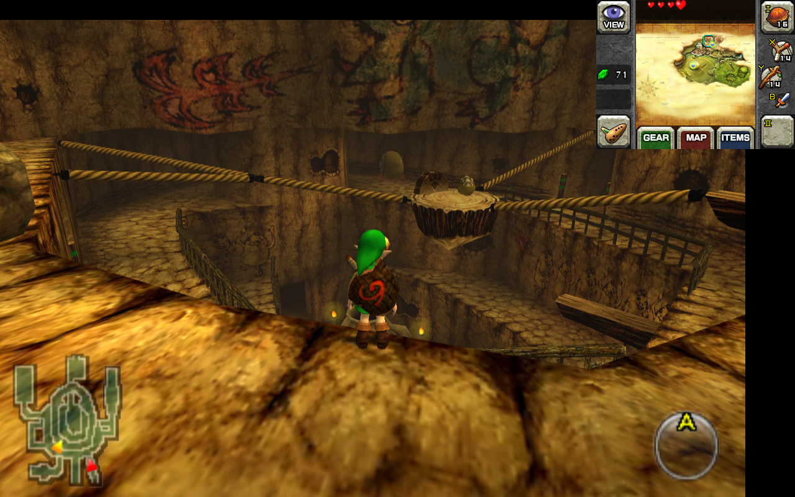

# Citra is a Nintendo 3DS Emulator.

GitHub: [https://github.com/PabloMK7/citra](https://github.com/PabloMK7/citra)

***

## Citra Table of Contents

1. [Getting Started with Citra](#getting-started-with-citra)
    - [Configuration](#citra-configuration)
    - [Citra Folder Locations](#citra-folder-locations)
    - [How to Update Citra](#how-to-update-citra)
    - [How to Launch Citra in Desktop Mode](#how-to-launch-citra-in-desktop-mode)
    - [File Formats](#citra-file-formats)
    - [How to Manage DLC and Updates](#how-to-manage-dlc-and-updates)
    - [Hotkeys](#citra-hotkeys)
2. [Common Issues](#citra-common-issues)
    - [Why did my game suddenly stop working?](#why-did-my-game-suddenly-stop-working)
3. [Citra Tips and Tricks](#citra-tips-and-tricks)
    - [How to Configure Gyro](#how-to-configure-gyro)
    - [How to Configure Gyro With External Controllers](#how-to-configure-gyro-with-external-controllers)
    - [How to Optimize Performance (Power Tools)](#how-to-optimize-performance-power-tools)
    - [How to Install Custom Textures](#how-to-install-custom-textures)
    - [How to Use Cheats](#how-to-use-cheats)
    - [How to Set Up PKHeX](../../community-creations/steamos/tools-and-guides.md#how-to-set-up-pkhex)
    - [How to Install the Universal Pokemon Randomizer](../../community-creations/steamos/tools-and-guides.md#how-to-install-the-universal-pokemon-randomizer)
    - [How to Configure Language Settings](#how-to-configure-language-settings)
4. [Custom Screen Layouts](#custom-screen-layouts)
    - [How to Create Custom Screen Layouts](#how-to-create-custom-screen-layouts)
    - [How to Configure Bottom Screen as PiP](#how-to-configure-bottom-screen-as-pip)
    - [How to Configure Bottom Screen With PiP and Opacity](#how-to-configure-bottom-screen-with-pip-and-opacity)
    - [How to Configure Bottom Screen as PiP in the Top Right Corner](#how-to-configure-bottom-screen-as-pip-in-the-top-right-corner)


***

## Getting Started with Citra
[Back to the Top](#citra-table-of-contents)

Citra is a fairly straight-forward emulator to set up. Place your ROMs in `Emulation/roms/n3ds` or `Emulation/roms/3ds`. No additional setup is required if you are using decrypted ROMs. Read the [Configuration](#citra-configuration) section to learn more about Citra and its folder locations. The [Configuration](#citra-configuration) section covers where to place your `aes_keys.txt` if you are using encrypted ROMs. 

To launch your ROMs in game mode, use Steam ROM Manager and use one of the following parsers to play your Citra ROMs:

* `EmulationStation-DE`
* `Nintendo 3DS - Citra` 
* `Emulators`


***

### Citra Configuration
[Back to the Top](#citra-table-of-contents)

* Type of Emulator: AppImage
* Config Location: 
    * `/home/deck/.config/citra-emu`
    * `/home/deck/.local/share/citra-emu`
* ROM Location: `Emulation/roms/3ds` or `Emulation/roms/n3ds`
* `aes_keys.txt` location: `/home/deck/.local/share/citra-emu/sysdata` 
    * _Only necessary if the 3DS ROM is encrypted_
    * If the `sysdata` folder does not exist, create the folder
* Saves Location:
    * Symlink: `Emulation/saves/citra/saves`
    * Target: `/Emulation/storage/citra/sdmc`
* Save States Location:
    * Symlink: `Emulation/saves/citra/states/`
    * Target: `/home/deck/.local/share/citra-emu/states`

**Note:** `~/.config` and `~/.local` are hidden folders by default. In Dolphin (file manager), click the hamburger menu in the top right, click `Show Hidden Files` to see these folders.

#### Works With
* Steam ROM Manager
* ES-DE

***

### Citra Folder Locations
[Back to the Top](#citra-table-of-contents)

These file locations apply regardless of where you chose to install EmuDeck (to your internal SSD, to your SD Card, or elsewhere). Some emulator configuration files will be located on the internal SSD as listed below. 

`$HOME` refers to your home folder. If you are on a Steam Deck, this folder will be named `/home/deck` (you will likely not see `deck` in the file path when navigating using the file manager). 

Paths beginning with `Emulation/..` correspond to your EmuDeck install location. If you installed on an SD Card, your path may be `/run/media/mmcblk0p1/Emulation/roms/..`. If you installed on your internal SSD, your path may be `/home/deck/Emulation/roms/..`

**Note:** Folders with a `.` (`.var`, `.local`, `.config`, etc.) at the beginning are hidden by default. In Dolphin (file manager), click the hamburger menu in the top right, click `Show Hidden Files` to see these folders.

`/home/deck/.config/citra-emu`

```
citra-emu/
├── custom
├── qt-config.ini
└── qt-config.ini.bak
```

`/home/deck/.local/share/citra-emu`

```
citra-emu/
├── cheats
├── load
│   └── textures
├── log
│   ├── citra_log.txt
│   └── citra_log.txt.old.txt
├── shaders
│   └── vulkan
├── states
├── sysdata
│   └── mcu.dat
└── textures
```

`Emulation/storage/citra`

```
citra/
├── cheats -> /home/deck/.local/share/citra-emu/cheats
├── nand
│   └── data
│       └── 00000000000000000000000000000000
│           ├── extdata
│           │   └── 00048000
│           └── sysdata
│               ├── 00010017
│               ├── 00010026
│               └── 00010035
├── screenshots
├── sdmc
│   └── Nintendo 3DS
│       └── 00000000000000000000000000000000
│           └── 00000000000000000000000000000000
│               └── title
└── textures -> /home/deck/.local/share/citra-emu/load/textures
```


***

### How to Update Citra
[Back to the Top](#citra-table-of-contents)

**How to Update Citra**

* Through the `Update your Emulators & Tools` section on the `Manage Emulators` page in the `EmuDeck` application
* Manual file replacement of `citra-qt.AppImage` 
    * Refer to [How to Swap Out AppImages and Binaries](../../../file-management/steamos/file-management.md#how-to-swap-out-appimages-and-binaries) for instructions
* Through `binupdate.sh` in `Emulation/tools/binupdate`, double click to launch


***

### How to Launch Citra in Desktop Mode

**How to Launch Citra in Desktop Mode**

* Launch `Citra` from the Applications Launcher (Steam Deck icon in the bottom left of the taskbar)
* Launch the script from `Emulation/tools/launchers`, `citra.sh`
* Launch the emulator from `Steam` after adding it via the `Emulators` parser in `Steam ROM Manager`


***

### Citra File Formats
[Back to the Top](#citra-table-of-contents)

* .3ds 
* .3dsx 
* .app 
* .axf 
* .cci 
* .cxi 
* .elf

**IMPORTANT:** 

* `.cia` can only be used if you install it through Citra. **Do not** place your `.cia` ROMs in either the `Emulation/roms/3ds` or the `Emulation/roms/n3ds` folders. The .cia file format **is not** compatible with Steam ROM Manager and EmulationStation-DE.

***

### How to Manage DLC and Updates
[Back to the Top](#citra-table-of-contents)

Read: [https://citra-emu.org/wiki/dumping-updates-and-dlcs/](https://citra-emu.org/wiki/dumping-updates-and-dlcs/) to learn how to properly dump your DLC and update files from your 3DS.

DLC and update files typically are .CIAs, an installable file format through Citra. After installing your DLC or updates, you may discard these files. 

**How to Install DLC and Updates**

1. In Desktop Mode, open Citra
2. Click `File` in the top left 
3. Click `Install CIA...`
4. Navigate to your DLC or update files

***

### Citra Hotkeys
[Back to the Top](#citra-table-of-contents)

Citra comes with a Steam Input profile for Hotkeys. When playing Citra ROM shortcuts through Steam, the `EmuDeck - Controller Hotkeys` profile will automatically be applied so you may use the below hotkeys. For more info, see [Emulator Button Combinations Profile](../../controls-and-hotkeys/steamos/hotkeys.md#emulator-button-combinations-profile).

When using a frontend (ES-DE, Pegasus, or the emulator itself), the `EmuDeck - Frontend Controller Hotkeys` will automatically be applied. Hold `Start` for a few seconds to switch to the action set required to use the below hotkeys. For more info, see [Emulator Frontends Button Combinations Profile](../../controls-and-hotkeys/steamos/hotkeys.md#emulator-frontends-button-combinations-profile).

{{ read_csv('citra-hotkeys.csv') }}


**Note** 

* For a tutorial on how to select Steam Input Profiles, refer to: [How to Select a Steam Input Profile](../../controls-and-hotkeys/steamos/hotkeys.md#how-to-select-a-steam-input-profile).
* If you would like to use touch menus, apply the `EmuDeck - Steam Deck Radial Menus` profile instead.  
* [Steam Deck Button Layout](../../controls-and-hotkeys/steamos/hotkeys.md#steam-deck-button-layout)

***

## Citra Common Issues
[Back to the Top](#citra-table-of-contents)

***

### Why did my game suddenly stop working? 
[Back to the Top](#citra-table-of-contents)

If your game ever crashes or you exit the game by pressing the `STEAM` button and clicking `Exit Game` instead of using the hotkey (`Quit` on the left trackpad), you may end up corrupting the shader cache. 

To clear the shader cache:

1. In Desktop Mode, open the `/home/deck/.local/share/citra-emu` folder
    * `~/.local` is a hidden folder by default. In Dolphin (file manager), click the hamburger menu in the top right, click `Show Hidden Files` to see these folders
2. Delete the `shaders` folder
3. Try your game again

**Note:** Use the `Select` + `Start` hotkey to exit your game instead of using the `STEAM` button. 

***

## Citra Tips and Tricks
[Back to the Top](#citra-table-of-contents)

***

### How to Configure Gyro
[Back to the Top](#citra-table-of-contents)

Gyro for Citra requires SteamDeckGyroDSU. SteamDeckGyroDSU can be installed via EmuDeck, or it can be installed manually.

Visit [SteamDeckGyroDSU](../../emudeck-application/steamos/emudeck-application-101.md#steamdeckgyrodsu) to learn how to install and utilize SteamDeckGyroDSU. 

***

### How to Configure Gyro With External Controllers
[Back to the Top](#citra-table-of-contents)

#### Desktop Mode

1. Switch to Desktop Mode
2. Exit out of Steam
    * You may exit out of Steam a couple of different ways:
        * Right click the `Steam` icon in your taskbar and click `Exit Steam`
        * Open Steam, click the `Steam` button in the top left, click `Exit`
        * Open a terminal (Konsole) and enter `killall -9 steam`
        * Do note that clicking the the `X` button in the top right of the Steam window **will not** exit out of Steam
    * Your controls will switch to `Lizard Mode`. Use `L2` to right click, `R2` to left click, and the `Right Trackpad` to move the mouse
    * You may also connect an external keyboard and mouse
2. Click the bluetooth icon in the bottom right of your taskbar and connect your controller
    * 
3. Open Citra
4. Click `Emulation` at the top, click `Configure`
5. Click `Controls` on the left
6. Click `New` to the right of `Profile` and give it a unique name
7. Click `Motion / Touch..` in the bottom left
8. To the right of `Motion Provider`, select `SDL` in the drop-down menu
9. Click `Configure` and follow the instructions
10. Click `OK`
11. Click `OK` again and exit out of Citra
12. Switch to `Game Mode`

#### Game Mode

1. In Game Mode, connect your controller
2. Select your Nintendo 3DS game 
3. On the `Play` screen, select the `Controller` icon to the right of the screen 
    * 
4. Select your controller tab at the top
    * 
5. Click the `Gear` icon to the right, and click `Disable Steam Input`
    * 
    * You may need to restart first for this setting to properly apply
6. Your controller's gyro will now work for this selected game, repeat as needed for your other games

#### Post-Configuration

To restore the default Steam Deck controls:

1. Open Citra
2. Click `Emulation` at the top, click `Configure`
3. Click `Controls` on the left
4. To the right of `Profile`, select `SD-Default` in the drop-down menu
5. Click `OK` and exit out of Citra

(Optional) To restore Steam Input:

1. Select your Nintendo 3DS game 
2. On the `Play` screen, select the `Controller` icon to the right of the screen 
    * 
3. Select your controller tab at the top
    * 
4. Click the `Gear` icon to the right, and click `Enable Steam Input`
    * You may need to restart first for this setting to properly apply
5. The controls will be reverted to Steam Input and the Steam Deck controls will be restored

***

### How to Optimize Performance (Power Tools)
[Back to the Top](#citra-table-of-contents)

Visit [Power Tools](../../emudeck-application/steamos/emudeck-application-101.md#power-tools) to learn how to optimize performance using Power Tools. 

***

### How to Install Custom Textures
[Back to the Top](#citra-table-of-contents)

Here's how to install custom textures for Citra:

#### Citra Configuration

1. In Desktop Mode, open Citra
2. Click `Emulation` in the top left. Click `Configuration`, `Graphics`, and check both `Use Custom Textures` and `Async Custom Texture Loading`
    * 

**Note:** `Preload Custom Textures` is no longer recommended. Leave `Preload Custom Textures` off

#### How to Install Custom Textures

**Note:** Your texture pack may already come properly named and packaged with the correct `TitleID` and texture files. You may place the included texture pack folder directly into `/home/deck/.local/share/citra-emu/textures/`. You do not need the following section if this is the case.

1. In Desktop Mode, open [https://3ds.jdbye.com/?details=USA&split=0&display=0](https://3ds.jdbye.com/?details=USA&split=0&display=0) in a browser
2. Note down the `Title ID` for the game
    * For example, The Legend of Zelda: Majora's Mask 3D's (US) Title ID is: `0004000000125500` 
3. Open `/home/deck/.local/share/citra-emu/textures/`
    * `~/.local` is a hidden folder by default. In Dolphin (file manager), click the hamburger menu in the top right, click `Show Hidden Files` to see these folders
4. In the `textures` folder from Step 3, create a folder matching the `TitleID` from Step 2
5. Put your texture files directly into the `TitleID` folder you created in Step 4
6. Your texture pack should now be installed

!!! tip
    
    Consider enabling `Preload Custom Textures`. This may help performance in some cases. 


***

### How to Use Cheats
[Back to the Top](#citra-table-of-contents)


**Cheat Sources**

_This list is not exhaustive_

* [https://github.com/iSharingan/CTRPF-AR-CHEAT-CODES/tree/master/Cheats](https://github.com/iSharingan/CTRPF-AR-CHEAT-CODES/tree/master/Cheats)

#### How to Use Cheats

1. In Desktop Mode, open Citra
2. Right click a game of your choice, click `Properties`
    * 
3. Click the `Cheats` tab
    * 
4. Click `Add Cheat`
5. Name the cheat and add the code to the box under `Code:`
    * 
6. Click Save in the top right
7. Check the box to the left of the cheat to enable it
    *  

***

### How to Configure Language Settings
[Back to the Top](#citra-table-of-contents)

#### UI

1. In Desktop Mode, open Citra
2. At the top, click `Emulation`, click `Configure`
3. On the left hand-side of the screen, click `General`
4. Click the `UI` tab
5. Under `General`, select your preferred language in the drop-down menu

#### In-Game

1. In Desktop Mode, open Citra
2. At the top, click `Emulation`, click `Configure`
3. On the left hand-side of the screen, click `System`
4. Click the `System` tab
5. Under `System Settings`, select your preferred language in the drop-down menu

***

## Custom Screen Layouts
[Back to the Top](#citra-table-of-contents)

***

### How to Create Custom Screen Layouts
[Back to the Top](#citra-table-of-contents)

Use [https://jesuscc1993.github.io/miscellaneous/citra-layout-generator/](https://jesuscc1993.github.io/miscellaneous/citra-layout-generator/) to create custom layouts.

After you have created your custom layout, use the following steps to use it. 

1. Open the folder: `/home/deck/.config/citra-emu/`
    * `~/.config` is a hidden folder by default. In Dolphin (file manager), click the hamburger menu in the top right, click `Show Hidden Files` to see these folders
2. Right click `qt-config.ini`, and click `Open with Kate` or a text editor of your choice
3. Locate the `[Layout]` section
4. Replace the content of the `[Layout]` section with your newly created layout

***

### How to Configure Bottom Screen as PiP
[Back to the Top](#citra-table-of-contents)

Credit: `NexLevel`

Citra allows you to configure the bottom screen as a sort of PiP (Picture in Picture) overlay on the top screen, by editing the qt-config file. 

**Here's How**

1. Open the folder: `/home/deck/.config/citra-emu/`
    * `~/.config` is a hidden folder by default. In Dolphin (file manager), click the hamburger menu in the top right, click `Show Hidden Files` to see these folders
2. Right click `qt-config.ini`, and click `Open with Kate` or a text editor of your choice
3. Locate the `[Layout]` section
4. Replace the content of the `[Layout]` section with the below text:


        [Layout]
        anaglyph_shader_name=dubois (builtin)
        anaglyph_shader_name\default=true
        custom_bottom_bottom=800
        custom_bottom_bottom\default=false
        custom_bottom_left=520
        custom_bottom_left\default=false
        custom_bottom_right=760
        custom_bottom_right\default=false
        custom_bottom_top=620
        custom_bottom_top\default=false
        custom_layout=true
        custom_layout\default=false
        custom_second_layer_opacity=33
        custom_second_layer_opacity\default=false
        custom_top_bottom=784
        custom_top_bottom\default=false
        custom_top_left=0
        custom_top_left\default=true
        custom_top_right=1280
        custom_top_right\default=false
        custom_top_top=16
        custom_top_top\default=false
        factor_3d=0
        factor_3d\default=true
        filter_mode=true
        filter_mode\default=true
        large_screen_proportion=@Variant(\0\0\0\x87@\x80\0\0)
        large_screen_proportion\default=false
        layout_option=1
        layout_option\default=false
        mono_render_option=0
        mono_render_option\default=true
        pp_shader_name=none (builtin)
        pp_shader_name\default=true
        render_3d=0
        render_3d\default=true
        swap_screen=false
        swap_screen\default=true
        upright_screen=false
        upright_screen\default=true
                

5. (Optional) To move the PiP screen up, try setting `custom_top_top=0` and `custom_top_bottom=768`
6. Save and exit out of the text file, Citra will now be using the bottom screen as PiP

**Note:** To revert back to defaults, the default `[Layout]` section is: 

```
[Layout]
anaglyph_shader_name=dubois (builtin)
anaglyph_shader_name\default=true
custom_bottom_bottom=480
custom_bottom_bottom\default=true
custom_bottom_left=40
custom_bottom_left\default=true
custom_bottom_right=360
custom_bottom_right\default=true
custom_bottom_top=240
custom_bottom_top\default=true
custom_layout=false
custom_layout\default=true
custom_second_layer_opacity=100
custom_second_layer_opacity\default=true
custom_top_bottom=240
custom_top_bottom\default=true
custom_top_left=0
custom_top_left\default=true
custom_top_right=400
custom_top_right\default=true
custom_top_top=0
custom_top_top\default=true
factor_3d=0
factor_3d\default=true
filter_mode=true
filter_mode\default=true
large_screen_proportion=@Variant(\0\0\0\x87@\x80\0\0)
large_screen_proportion\default=true
layout_option=2
layout_option\default=false
mono_render_option=0
mono_render_option\default=true
pp_shader_name=none (builtin)
pp_shader_name\default=true
render_3d=0
render_3d\default=true
swap_screen=false
swap_screen\default=true
upright_screen=false
upright_screen\default=true
```


***

### How to Configure Bottom Screen With PiP and Opacity
[Back to the Top](#citra-table-of-contents)

Credit: `NexLevel`

A recent update of Citra allows the ability to set the opacity on the bottom screen. In combination with setting the bottom screen as a PiP overlay, you can create a Citra layout that looks like the following: 

**Example 1:** 

**Example 2:** 
 
**Here's How**

1. Open the folder: `/home/deck/.config/citra-emu/`
    * `~/.config` is a hidden folder by default. In Dolphin (file manager), click the hamburger menu in the top right, click `Show Hidden Files` to see these folders
2. Right click `qt-config.ini`, and click `Open with Kate` or a text editor of your choice
3. Locate the `[Layout]` section
4. Replace the content of the `[Layout]` section with the below text:

         
        [Layout]
        anaglyph_shader_name=dubois (builtin)
        anaglyph_shader_name\default=true
        custom_bottom_bottom=800
        custom_bottom_bottom\default=false
        custom_bottom_left=520
        custom_bottom_left\default=false
        custom_bottom_right=760
        custom_bottom_right\default=false
        custom_bottom_top=620
        custom_bottom_top\default=false
        custom_layout=true
        custom_layout\default=false
        custom_second_layer_opacity=33
        custom_second_layer_opacity\default=false
        custom_top_bottom=784
        custom_top_bottom\default=false
        custom_top_left=0
        custom_top_left\default=true
        custom_top_right=1280
        custom_top_right\default=false
        custom_top_top=16
        custom_top_top\default=false
        factor_3d=0
        factor_3d\default=true
        filter_mode=true
        filter_mode\default=true
        large_screen_proportion=@Variant(\0\0\0\x87@\x80\0\0)
        large_screen_proportion\default=false
        layout_option=1
        layout_option\default=false
        mono_render_option=0
        mono_render_option\default=true
        pp_shader_name=none (builtin)
        pp_shader_name\default=true
        render_3d=0
        render_3d\default=true
        swap_screen=false
        swap_screen\default=true
        upright_screen=false
        upright_screen\default=true
         

5. To adjust the PiP opacity, the opacity can be any integer between 1-100
6. Save and exit out of the text file, Citra will now be using the bottom screen as PiP with custom opacity

**Note:** To revert back to defaults, the default `[Layout]` section is: 

```
[Layout]
anaglyph_shader_name=dubois (builtin)
anaglyph_shader_name\default=true
custom_bottom_bottom=480
custom_bottom_bottom\default=true
custom_bottom_left=40
custom_bottom_left\default=true
custom_bottom_right=360
custom_bottom_right\default=true
custom_bottom_top=240
custom_bottom_top\default=true
custom_layout=false
custom_layout\default=true
custom_second_layer_opacity=100
custom_second_layer_opacity\default=true
custom_top_bottom=240
custom_top_bottom\default=true
custom_top_left=0
custom_top_left\default=true
custom_top_right=400
custom_top_right\default=true
custom_top_top=0
custom_top_top\default=true
factor_3d=0
factor_3d\default=true
filter_mode=true
filter_mode\default=true
large_screen_proportion=@Variant(\0\0\0\x87@\x80\0\0)
large_screen_proportion\default=true
layout_option=2
layout_option\default=false
mono_render_option=0
mono_render_option\default=true
pp_shader_name=none (builtin)
pp_shader_name\default=true
render_3d=0
render_3d\default=true
swap_screen=false
swap_screen\default=true
upright_screen=false
upright_screen\default=true
```

***

### How to Configure Bottom Screen as PiP in the Top Right Corner
[Back to the Top](#citra-table-of-contents)

Picture: 



Credit: `busywait`

1. Open the folder: `/home/deck/.config/citra-emu/`
    * `~/.config` is a hidden folder by default. In Dolphin (file manager), click the hamburger menu in the top right, click `Show Hidden Files` to see these folders
2. Right click `qt-config.ini`, and click `Open with Kate` or a text editor of your choice
3. Locate the `[Layout]` section
4. Replace the content of the `[Layout]` section with the below text:

         
        [Layout]
        anaglyph_shader_name=dubois (builtin)
        anaglyph_shader_name\default=true
        custom_bottom_bottom=240
        custom_bottom_bottom\default=false
        custom_bottom_left=960
        custom_bottom_left\default=false
        custom_bottom_right=1280
        custom_bottom_right\default=false
        custom_bottom_top=0
        custom_bottom_top\default=false
        custom_layout=true
        custom_layout\default=false
        custom_second_layer_opacity=80
        custom_second_layer_opacity\default=false
        custom_top_bottom=800
        custom_top_bottom\default=false
        custom_top_left=0
        custom_top_left\default=true
        custom_top_right=1200
        custom_top_right\default=false
        custom_top_top=80
        custom_top_top\default=false
        factor_3d=0
        factor_3d\default=true
        filter_mode=true
        filter_mode\default=true
        large_screen_proportion=4
        large_screen_proportion\default=true
        layout_option=1
        layout_option\default=false
        mono_render_option=0
        mono_render_option\default=true
        pp_shader_name=none (builtin)
        pp_shader_name\default=true
        render_3d=0
        render_3d\default=true
        swap_screen=false
        swap_screen\default=true
        upright_screen=false
        upright_screen\default=true
         
5. Save and close out of the text file
6. Citra will now apply your custom layout

**Note:** To revert back to defaults, the default `[Layout]` section is: 

```
[Layout]
anaglyph_shader_name=dubois (builtin)
anaglyph_shader_name\default=true
custom_bottom_bottom=480
custom_bottom_bottom\default=true
custom_bottom_left=40
custom_bottom_left\default=true
custom_bottom_right=360
custom_bottom_right\default=true
custom_bottom_top=240
custom_bottom_top\default=true
custom_layout=false
custom_layout\default=true
custom_second_layer_opacity=100
custom_second_layer_opacity\default=true
custom_top_bottom=240
custom_top_bottom\default=true
custom_top_left=0
custom_top_left\default=true
custom_top_right=400
custom_top_right\default=true
custom_top_top=0
custom_top_top\default=true
factor_3d=0
factor_3d\default=true
filter_mode=true
filter_mode\default=true
large_screen_proportion=@Variant(\0\0\0\x87@\x80\0\0)
large_screen_proportion\default=true
layout_option=2
layout_option\default=false
mono_render_option=0
mono_render_option\default=true
pp_shader_name=none (builtin)
pp_shader_name\default=true
render_3d=0
render_3d\default=true
swap_screen=false
swap_screen\default=true
upright_screen=false
upright_screen\default=true
```

***
