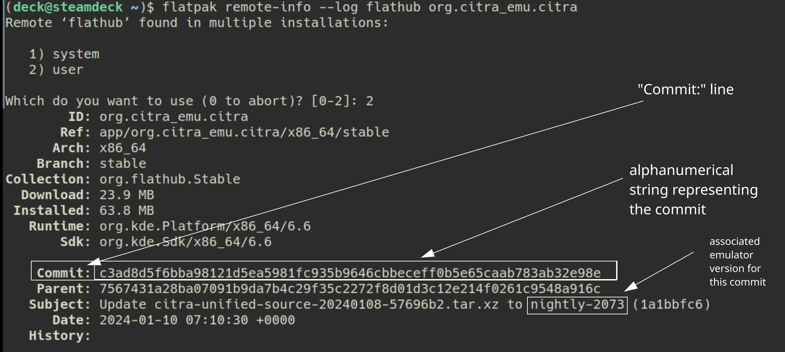

# Dolphin is a GameCube and Wii emulator.

Website: [https://dolphin-emu.org/](https://dolphin-emu.org/)

GitHub: [https://github.com/dolphin-emu/dolphin](https://dolphin-emu.org/)

Compatibility List: [https://dolphin-emu.org/compat/](https://dolphin-emu.org/compat/)

***

## Dolphin Table of Contents

1. [Getting Started with Dolphin](#getting-started-with-dolphin)
    - [Configuration](#dolphin-configuration)
    - [Dolphin Folder Locations](#dolphin-folder-locations)
    - [How to Update Dolphin](#how-to-update-dolphin)
    - [How to Launch Dolphin in Desktop Mode](#how-to-launch-dolphin-in-desktop-mode)
    - [File Formats](#dolphin-file-formats)
    - [Hotkeys](#dolphin-hotkeys)
    - [Controls 101](../../controls-and-hotkeys/steamos/controls-101.md)
        - [Gamecube](../../controls-and-hotkeys/steamos/controls-101.md#gamecube)
        - [Wii](../../controls-and-hotkeys/steamos/controls-101.md#wii)
    - [How to Set Up GameCube BIOS (Optional)](#how-to-set-up-gamecube-bios)
    - [How to Set Up the Wii Menu (Optional)](#how-to-set-up-the-wii-menu)

2. [Dolphin Tips and Tricks](#dolphin-tips-and-tricks)
    - [How to Verify ROMs](#how-to-verify-roms)
    - [How to Configure Gyro](#how-to-configure-gyro)
    - [How to Configure Gyro With External Controllers](#how-to-configure-gyro-with-external-controllers)
    - [How to Optimize Performance (Power Tools)](#how-to-optimize-performance-power-tools)
    - [How to Optimize Storage (Compression Tool)](#how-to-optimize-storage-compression-tool)
    - [How to Manage Multiple Discs](#how-to-manage-multiple-discs)
    - [How to Configure Multiplayer](#how-to-configure-multiplayer)
    - [How to Configure Multiplayer Controls](#how-to-configure-multiplayer-controls)
    - [How to Roll Back Dolphin to an Older Version](#how-to-roll-back-dolphin-to-an-older-version)
    - [How to Configure Language Settings](#how-to-configure-language-settings)
    - [How to Use ROM Hacks](../../community-creations/steamos/tools-and-guides.md#how-to-use-rom-hacks)

3. [Dolphin Cheats, Modding, and Texture Packs](#dolphin-cheats-modding-and-texture-packs)
    - [How to Use Cheats](#how-to-use-cheats)
    - [How to Install Custom Textures](#how-to-install-custom-textures)
    - [How to Use Riivolution Patches](#how-to-use-riivolution-patches)
    - [How to Install UniversalDynamicInput](#how-to-install-universaldynamicinput)

4. [How to Navigate Dolphin Settings](#how-to-navigate-dolphin-settings)
    - [How to Create Dolphin Controller Profiles](#how-to-create-dolphin-controller-profiles)
    - [How to Share Your Dolphin Controller Profile](#how-to-share-your-dolphin-controller-profile)
    - [How to Set Dolphin Controller Profiles On a Per-Game Basis](#how-to-set-dolphin-controller-profiles-on-a-per-game-basis)
    - [How to Set Game Settings On a Per-Game Basis](#how-to-set-game-settings-on-a-per-game-basis)

5. [Dolphin Unique Controller Configurations](#dolphin-unique-controller-configurations)
    - [How to Configure Wii Games To Use A GameCube Controller](#how-to-configure-wii-games-to-use-a-gamecube-controller)
    - [How to Configure Wii Games to Use the Trackpad as a Pointer](#how-to-configure-wii-games-to-use-the-trackpad-as-a-pointer)
    - [How to Configure Wii Games to Use the Classic Controller](#how-to-configure-wii-games-to-use-the-classic-controller)
    - [How to Configure Wii Games to Use the Sideways Wiimote Configuration](#how-to-configure-wii-games-to-use-the-sideways-wiimote-configuration)
    - [How to Remove the Unsupported Extension Controller](#how-to-remove-the-unsupported-extension-controller)
    - [How to Configure Real Wiimotes](#how-to-configure-real-wiimotes)
    - [How to Use a Mayflash DolphinBar in Game Mode](#how-to-use-a-mayflash-dolphinbar-in-game-mode)
    - [Community Dolphin Controller Profiles](../../community-creations/steamos/community-creations.md#community-dolphin-controller-profiles)
        - [Gyro Steam Deck on Dolphin](../../community-creations/steamos/community-creations.md#gyro-steam-deck-on-dolphin)
        - [Wiimote Motion Controls With No Attachment](../../community-creations/steamos/community-creations.md#gyro-steam-deck-on-dolphin)
        - [Wiimote Motion Controls With Nunchuck](../../community-creations/steamos/community-creations.md#wiimote-motion-controls-with-nunchuck)
        - [New Super Mario Bros Wii](../../community-creations/steamos/community-creations.md#new-super-mario-bros-wii)
        - [Sideways Wiimote With No Attachment](../../community-creations/steamos/community-creations.md#sideways-wiimote-with-no-attachment)
        - [Super Mario Galaxy 1 and 2](../../community-creations/steamos/community-creations.md#super-mario-galaxy-1-and-2)

6. [Custom Game Settings](#custom-game-settings)
    - [Pokemon Colosseum: Black Floors](#pokemon-colosseum-black-floors)
    - [Pokemon XD: Gale of Darkness: Aspect Ratio Keeps Changing](#pokemon-xd-gale-of-darkness-aspect-ratio-keeps-changing)

***

## Getting Started with Dolphin
[Back to the Top](#dolphin-table-of-contents)

Dolphin is a fairly straight-forward emulator to set up. Place your Wii ROMs in `Emulation/roms/wii` and your `GameCube` ROMs in either `Emulation/roms/gc` or `Emulation/roms/gamecube`. No additional setup is required. Read the [Configuration](#dolphin-configuration) section to learn more about Dolphin and its folder locations. 

To launch your ROMs in game mode, use Steam ROM Manager and use one of the following parsers to play your GameCube or Wii ROMs:

* `EmulationStation-DE`
* `Nintendo GameCube - Dolphin` or `Nintendo Wii - Dolphin`
* `Emulators`

***

### Dolphin Configuration
[Back to the Top](#dolphin-table-of-contents)

* Type of Emulator: Flatpak
* Config Location: `/home/deck/.var/app/org.DolphinEmu.dolphin-emu`
* GameCube Profiles: `/home/deck/.var/app/org.DolphinEmu.dolphin-emu/config/dolphin-emu/Profiles/GCPad`
* Wii Profiles: `/home/deck/.var/app/org.DolphinEmu.dolphin-emu/config/dolphin-emu/Profiles/Wiimote`
* ROM Location (GameCube): `Emulation/roms/gc` or `Emulation/roms/gamecube`
    * No BIOS are required to play GameCube ROMs
* ROM Location (Wii): `Emulation/roms/wii`
    * No BIOS are required to play Wii ROMs
* Saves (Wii):
    * Symlink: `Emulation/saves/dolphin/Wii`
    * Target: `/home/deck/.var/app/org.DolphinEmu.dolphin-emu/data/dolphin-emu/Wii`
* Saves (GameCube):
    * Symlink: `Emulation/saves/dolphin/GC`
    * Target: `/home/deck/.var/app/org.DolphinEmu.dolphin-emu/data/dolphin-emu/GC`
* Save States (Wii):
    * Symlink: `Emulation/saves/dolphin/StateSaves`
    * Target: `/home/deck/.var/app/org.DolphinEmu.dolphin-emu/data/dolphin-emu/StateSaves`
* Save States (GameCube):
    * Symlink: `Emulation/saves/dolphin/StateSaves`
    * Target: `/home/deck/.var/app/org.DolphinEmu.dolphin-emu/data/dolphin-emu/StateSaves`
* GameCube BIOS (Optional): See [How to Set Up GameCube BIOS (Optional)](#how-to-set-up-gamecube-bios)
* Wii Menu (Optional): See [How to Set Up the Wii Menu (Optional)](#how-to-set-up-the-wii-menu)

**Note:** `~/.var` is an invisible folder by default. In Dolphin (file manager), click the hamburger menu in the top right, click `Show Hidden Files` to see these folders.

#### Works With
* Steam ROM Manager
* EmulationStation-DE

***

### Dolphin Folder Locations
[Back to the Top](#dolphin-table-of-contents)

These file locations apply regardless of where you chose to install EmuDeck (to your internal SSD, to your SD Card, or elsewhere). Some emulator configuration files will be located on the internal SSD as listed below. 

`$HOME` refers to your home folder. If you are on a Steam Deck, this folder will be named `/home/deck` (you will likely not see `deck` in the file path when navigating using the file manager). 

Paths beginning with `Emulation/..` correspond to your EmuDeck install location. If you installed on an SD Card, your path may be `/run/media/mmcblk0p1/Emulation/roms/..`. If you installed on your internal SSD, your path may be `/home/deck/Emulation/roms/..` 

**Note:** Folders with a `.` (`.var`, `.local`, `.config`, etc.) at the beginning are hidden by default. In Dolphin (file manager), click the hamburger menu in the top right, click `Show Hidden Files` to see these folders.

`$HOME/.var/app/org.DolphinEmu.dolphin-emu`

```
org.DolphinEmu.dolphin-emu/
├── cache
├── config
    ├── dolphin-emu
    │   ├── Debugger.ini
    │   ├── Dolphin.ini
    │   ├── DSUClient.ini
    │   ├── FreeLookController.ini
    │   ├── FreeLook.ini
    │   ├── GameSettings
    │   ├── GBA.ini
    │   ├── GCKeyNew.ini
    │   ├── GCPadNew.ini
    │   ├── GFX.ini
    │   ├── GraphicMods
    │   ├── Hotkeys.ini
    │   ├── Logger.ini
    │   ├── Profiles
    │   │   ├── GCPad
    │   │   │   ├── GC_base.ini
    │   │   │   └── GC_reverse_camera.ini
    │   │   └── Wiimote
    │   │       ├── Wii_base_nunchuck.ini
    │   │       ├── Wii_base_nunchuck_with_touchpad.ini
    │   │       ├── Wii_classic_controller.ini
    │   │       ├── Wii_no_attachment.ini
    │   │       ├── Wii_no_attachment_with_touchpad.ini
    │   │       └── Wii_NoController.ini
    │   ├── Qt.ini
    │   └── WiimoteNew.ini
    ├── kdeglobals
    └── user-dirs.dirs
└── data
    └── dolphin-emu
        ├── Dump
        │   ├── Audio
        │   ├── DSP
        │   ├── Frames
        │   ├── Objects
        │   ├── SSL
        │   └── Textures
        ├── GameSettings
        ├── GC
        │   ├── EUR
        │   ├── JAP
        │   └── USA
        ├── Load
        │   ├── DynamicInputTextures
        │   ├── GraphicMods
        │   ├── Riivolution
        │   ├── Textures
        │   └── WiiSDSync
        ├── Logs
        │   └── Mail
        ├── Maps
        ├── ResourcePacks
        ├── ScreenShots
        ├── Shaders
        │   └── Anaglyph
        ├── StateSaves
        ├── Styles
        ├── Themes
        └── Wii
            ├── import
            ├── meta
            ├── shared1
            ├── shared2
            ├── sys
            ├── ticket
            ├── title
            ├── tmp
            └── wfs
```

***

### How to Update Dolphin
[Back to the Top](#dolphin-table-of-contents)

**How to Update Dolphin**

* Through the `Update your Emulators & Tools` section on the `Manage Emulators` page in the `EmuDeck` application
* Run `Update Emulators & Tools` in `EmuDeck`

***

### How to Launch Dolphin in Desktop Mode
[Back to the Top](#dolphin-table-of-contents)

**How to Launch Dolphin in Desktop Mode**

* Launch `Dolphin Emulator` (Blue Dolphin Icon) from the Applications Launcher (Steam Deck icon in the bottom left of the taskbar)
    * Icon:  
* Launch the script from `Emulation/tools/launchers`, `dolphin-emu.sh`
* Launch the emulator from `Steam` after adding it via the `Emulators` parser in `Steam ROM Manager`


***

### Dolphin File Formats
[Back to the Top](#dolphin-table-of-contents)

* .ciso 
* .dol 
* .elf 
* .gcm 
* .gcz 
* .iso 
* .nkit 
* .iso 
* .rvz 
* .wad 
* .wia 
* .wbfs

***

### Dolphin Hotkeys
[Back to the Top](#dolphin-table-of-contents)

**Important Note:** Dolphin does not have a way of opening the menu if you are launching the game directly. It is recommended that you change any settings in the Dolphin UI itself before launching a game. 


{{ read_csv('dolphin-hotkeys.csv') }}


**List of Wii Profiles Included with EmuDeck**

* Wiimote with Nunchuk
* Wiimote with Nunchuk and Touchpad Support
* Wiimote with No Attachment
* Wiimote with No Attachment and Touchpad Support
* Wii Classic Controller

**Note:** 

* [Steam Deck Button Layout](../../controls-and-hotkeys/steamos/hotkeys.md#steam-deck-button-layout)

***

### How to Set Up GameCube BIOS
[Back to the Top](#dolphin-table-of-contents)

GameCube BIOS **are not** required to play GameCube games. Adding GameCube BIOS allows you to see the GameCube launch screen when you play GameCube games.

Depending on which region your games are in, select the appropriate BIOS and place in the matching folder below:

**Casing matters**

* Japan BIOS Location: `/home/deck/.var/app/org.DolphinEmu.dolphin-emu/data/dolphin-emu/GC/JAP/IPL.bin`
* US BIOS Location: `/home/deck/.var/app/org.DolphinEmu.dolphin-emu/data/dolphin-emu/GC/USA/IPL.bin`
* EU BIOS Location: `/home/deck/.var/app/org.DolphinEmu.dolphin-emu/data/dolphin-emu/GC/EUR/IPL.bin`

After placing your BIOS in the correct place:

1. Open the Dolphin emulator
2. Open the `Configuration` settings
3. Click the `GameCube` tab 
4. Uncheck `Skip Main Menu`

***

### How to Set Up the Wii Menu
[Back to the Top](#dolphin-table-of-contents)

#### How to Set Up the Wii Menu

The Wii Menu **is not** required to play Wii Games.

**To Download**

1. Open the Dolphin emulator
2. Click `Tools` at the top
3. Click `Perform System Update`, select a region of your choice

**To Use**

1. Open the Dolphin emulator
2. Click `Tools`, click `Load Wii System Menu...`

#### How to Add the Wii Menu to Steam

1. Download attached `.sh` file to a folder of your choice
    * [dolphin-wii-menu.sh](../../configuration-files/dolphin-wii-menu.sh)
2. Right click `dolphin-wii-menu.sh`, click `Properties`, click `Permissions`, check `Is Executable`
3. Right click `dolphin-wii-menu.sh`, click `Add to Steam`

If you are using EmulationStation-DE, you may place `dolphin-wii-menu.sh` in `Emulation/roms/desktop` instead.

For further reading, see [https://wiki.dolphin-emu.org/index.php?title=Wii_Menu](https://wiki.dolphin-emu.org/index.php?title=Wii_Menu).

***

## Dolphin Tips and Tricks
[Back to the Top](#dolphin-table-of-contents)

***

### How to Verify ROMs
[Back to the Top](#dolphin-table-of-contents)

If you have a ROM that is not launching, you can verify your ROM directly in Dolphin. Verifying your ROM confirms whether you have a good dump or a bad dump. If you have a bad dump, your issue may be that your ROM either transferred incorrectly or that you have a bad dump. 

If your ROM transferred incorrectly, see [How to Transfer Files to a Steam Deck](../../file-management/steamos/file-management.md#how-to-transfer-files-to-a-steam-deck) for a few methods. 

If you have a bad dump, re-dump your GameCube or Wii ROM, following Dolphin's guide. For the dumping guide, see [https://dolphin-emu.org/docs/guides/ripping-games/](https://dolphin-emu.org/docs/guides/ripping-games/). 

If you have a good dump, your issue lies elsewhere. Make sure Dolphin is up to date. If neither of these resolve your issue, make sure to either check Google or retrieve a log so you can share it with the Dolphin team. 

#### How to Verify ROMs

1. In Desktop Mode, open the Dolphin emulator
2. Right click a game
3. Click `Properties`
4. Click the `Verify` tab at the top
5. Click `Verify Integrity` at the bottom
6. In the text box in the middle of the screen, you will see a message stating if your ROM is a good or a bad dump

***

### How to Configure Gyro
[Back to the Top](#dolphin-table-of-contents)

Gyro for Dolphin requires SteamDeckGyroDSU. SteamDeckGyroDSU can be installed via EmuDeck, or it can be installed manually. 

Visit [SteamDeckGyroDSU](../../emudeck-application/steamos/emudeck-application-101.md#steamdeckgyrodsu) to learn how to install and utilize SteamDeckGyroDSU.  

**IMPORTANT** 

Gyro for Dolphin is not mapped out of the box. You will need to open the Dolphin emulator and configure gyro controls after installing SteamDeckGyroDSU. 

After installing SteamDeckGyroDSU, you may either choose to create your own profile in Dolphin or you may choose to download a community created profile from the [Community Creations](../../community-creations/steamos/community-creations.md) page.

Select **one** of the two options below. 

#### Option 1: Downloading a Community Creations profile

Visit the [Community Creations](../../community-creations/steamos/community-creations.md) page. You may want to start with the [How to Download Dolphin Profiles](../../community-creations/steamos/community-creations.md#how-to-download-dolphin-profiles) section. 

#### Option 2: Creating your own profile

If you are choosing to create your own profile:

1. Install and configure [SteamDeckGyroDSU](../../emudeck-application/steamos/emudeck-application-101.md#steamdeckgyrodsu)
2. Add the Dolphin emulator to Steam
    * You may add the Dolphin emulator to Steam by using the `Emulators` parser in Steam ROM Manager 
3. In Game Mode, enable gyro for the Dolphin emulator
    * For instructions, see [SteamDeckGyroDSU](../../emudeck-application/steamos/emudeck-application-101.md#steamdeckgyrodsu) 
4. In Game Mode, open the Dolphin emulator
5. Open the `Controllers` menu
6. Select `Configure` to the right of `Wii Remote 1`
    * Make sure `Wii Remote 1` is set to `Emulated Wii Remote`
7. Make sure `evdev/microsoft X-box 360 pad 0` is set in the top left
8. Select the `Motion Input` tab
9. Hover over any of the buttons under the `Accelerometer` or `Gyroscope` sections and press `STEAM` + `L2`
10. Make sure `DSUClient/0/steamdeckgyro` is selected in the drop-down menu at the top
11. Scroll down to the bottom of the list until you see `Accel` and `Gyro` direction inputs
12. Select the matching input to the button you clicked in Step 7
13. Press `Clear` in the bottom right
14. Press `Select` in the top right
    *  
15. Press `OK` in the bottom right
16. Repeat for each button under the `Accelerometer` and `Gyroscope` sections
17. (Optional) To use the Steam Deck gyro as a pointer (moving the Steam Deck itself), check `Enable` under the Pointer section on the left on the `Motion Input` tab
    * Consider clicking `Recenter` and tinkering with the settings here to calibrate the pointer
18. After you are finished, give your profile a name in the top right and save it as a new profile
19. Refer to the [Dolphin Hotkeys](#dolphin-hotkeys) to learn how to switch profiles mid-game

**Note:** If you are having issues with the gyro pointer/cursor not appearing or behaving erratically, you may also want to consider disabling `Auto-hide` under the `Point` section on the `Motion simulation tab`.

For more information, read Dolphin's wiki page on gyro: [https://wiki.dolphin-emu.org/index.php?title=Motion_evdev](https://wiki.dolphin-emu.org/index.php?title=Motion_evdev).


***

### How to Configure Gyro With External Controllers
[Back to the Top](#dolphin-table-of-contents)

#### Desktop Mode

1. Switch to Desktop Mode
2. Exit out of Steam
    * You may exit out of Steam a couple of different ways:
        * Right click the `Steam` icon in your taskbar and click `Exit Steam`
        * Open Steam, click the `Steam` button in the top left, click `Exit`
        * Open a terminal (Konsole) and enter `killall -9 steam`
        * Do note that clicking the the `X` button in the top right of the Steam window **will not** exit out of Steam
    * Your controls will switch to `Lizard Mode`. Use `L2` to right click, `R2` to left click, and the `Right Trackpad` to move the mouse
    * You may also connect an external keyboard and mouse
3. Click the bluetooth icon in the bottom right of your taskbar and connect your controller
    * 
4. Open Dolphin
5. Open the `Controllers` menu
6. Select `Configure` to the right of `Wii Remote 1`
    * Make sure `Wii Remote 1` is set to `Emulated Wii Remote`
7. On the `Profile` drop-down, select `Wii_base_nunchuck_with_touchpad` if you are using a Nunchuk or `Wii_no_attachment_with_touchpad` if you are not using a Nunchuk
8. Under `Device`, select `evdev/0/yourexternalcontrollername`
    * Some external controllers may show up as `Wireless Controller`
    * For example: `evdev/0/Nintendo Switch Controller` or `evdev/0/Wireless Controller`
    * This section will use `evdev` but you may also use and tinker with `SDL` instead. External controller gyro will work with either the `evdev` or `SDL` driver options. Do note that if you use `SDL` for your input driver, you will need to fully remap your controls. To select `SDL` or `evdev` in the Dolphin controller menu, select your preferred input driver in the `Device` drop-down menu
        * For example, if you would like to use SDL for the PlayStation 5 DualSense controller, select `SDL/0/PS5 Controller` in the drop-down menu
9. Select the `Motion Input` tab
10. Hover over any of the buttons under the `Accelerometer` or `Gyroscope` sections and press `L2`
11. Select `evdev/0/yourexternalcontrollername` in the drop-down menu at the top
    * For example: `evdev/0/Nintendo Switch Controller`
    * For some controllers, it may be under `evdev/0/Wireless Controller Motion Sensors`
12. Scroll down to the bottom of the list until you see `Accel` and `Gyro` direction inputs
13. Select the matching input to the button you clicked in Step 10
    * 
14. Press `Clear` in the bottom right
15. Press `Select` in the top right
16. Press `OK` in the bottom right
17. Repeat for each button under the `Accelerometer` and `Gyroscope` sections
18. (Optional) To use the controller gyro as a pointer (moving the controller itself), check `Enable` under the Pointer section on the left on the `Motion Input` tab
    * Make sure to click `Recenter` and tinker with the settings here to calibrate the pointer
    * You may also want to consider disabling `Auto-hide` under the `Point` section on the `Motion simulation tab`
19. After you are finished, give your profile a name in the top right and save it as a new profile
20. To select this profile, open the controller menu, select the profile name in the drop-down menu and click `Load`

**Note:** Different games have different preferences for Nunchuk and Motionplus support. Under the `General and Options` tab, you may uncheck `Attach MotionPlus` or select the appropriate extension in the drop-down menu. Be sure to create and save a new profile for each circumstance to quickly load the different profiles as needed. 

#### Game Mode

1. In Game Mode, connect your controller
2. Select your Wii game 
3. On the `Play` screen, select the `Controller` icon to the right of the screen 
    * 
4. Select your controller tab at the top
    * 
5. Click the `Gear` icon to the right, and click `Disable Steam Input`
    * 
    * You may need to restart first for this setting to properly apply
6. Your controller's gyro will now work for this selected game, repeat as needed for your other games

#### Post-Configuration

To restore the default Steam Deck controls:

1. Open Dolphin
2. Open the `Controllers` menu
3. Select `Configure` to the right of `Wii Remote 1`
    * Make sure `Wii Remote 1` is set to `Emulated Wii Remote`
4. Select `evdev/0/Microsoft X-Box 360 Pad 0` under `Devices`
5. Select `Wii_base_nunchuck` under `Profile` and click `Load`
6. Click `Close` and exit out of Dolphin

(Optional) To restore Steam Input:

1. Select your Wii game 
2. On the `Play` screen, select the `Controller` icon to the right of the screen 
    * 
3. Select your controller tab at the top
    * 
4. Click the `Gear` icon to the right, and click `Enable Steam Input`
    * You may need to restart first for this setting to properly apply
5. The controls will be reverted to Steam Input and the Steam Deck controls will be restored

***

### How to Optimize Performance (Power Tools)
[Back to the Top](#dolphin-table-of-contents)

Visit [Power Tools](../../emudeck-application/steamos/emudeck-application-101.md#power-tools) to learn how to optimize performance using Power Tools.

***

### How to Optimize Storage (Compression Tool)
[Back to the Top](#dolphin-table-of-contents)

To optimize storage, you can use the `EmuDeck Compressor` within EmuDeck.  

The `EmuDeck Compressor` will compress your GameCube and Wii ROMs from ISO to RVZ.

After running the `EmuDeck Compression Tool`, re-run Steam ROM Manager to update your ROM shortcuts to the newly compressed ROM. 

**Visual Reference:** 

***

### How to Manage Multiple Discs
[Back to the Top](#dolphin-table-of-contents)

M3U files can be used to manage multiple discs for Dolphin. With the `Change Discs Automatically` option toggled (turned on by default with EmuDeck), Dolphin will automatically switch discs in combination with an M3U file. 

[Learn how to create an M3U File](../../file-management/steamos/file-management.md#how-to-create-an-m3u-file) 


***

### How to Configure Multiplayer
[Back to the Top](#dolphin-table-of-contents)

EmuDeck configures multiplayer out of the box. You do not need to configure the controls. However, to properly set up multiplayer, you will need to enable the additional ports.

**Tutorial**


1. Open the Dolphin emulator
2. Open the `Controller` settings
3. For each controller you are using, including Player 1: 
    * GameCube: To the right of each Port # under `GameCube Controllers`, enable `Standard Controller`
        * 
    * Wii: To the right of each Port # under `Wii Remotes`, enable `Emulated  Wii Remote`
        * 
4. (Optional) You may need to re-arrange the controller order in Game Mode for your controllers to function as expected. See [How to Re-Arrange the Controller Order](../../controls-and-hotkeys/steamos/external-controllers.md#how-to-re-arrange-the-controller-order) to learn how

**Keep in Mind**

* The Steam Deck profile is automatically set to Port 1
    * For example, if you are using a Steam Deck and two external controllers, you will need to have a total of three ports enabled. However, the first port is enabled by default so you will need to enable two additional ports
* If you are using an external controller as Port 1, you do not need to re-configure any settings in Dolphin. However, you may need to re-arrange the controller order in Game Mode. See [How to Re-Arrange the Controller Order](../../controls-and-hotkeys/steamos/external-controllers.md#how-to-re-arrange-the-controller-order) to learn how 
* If you are facing difficulty with matching controllers to their expected ports in Game Mode, you may need to re-arrange the controller order. See [How to Re-Arrange the Controller Order](../../controls-and-hotkeys/steamos/external-controllers.md#how-to-re-arrange-the-controller-order) to learn how
* If you are playing Wii games with GameCube controller support, and would like to use the GameCube controllers, you may need to disable the Wii profiles. See [How to Configure Wii Games To Use A GameCube Controller](#multiplayer) to learn how


***

### How to Configure Multiplayer Controls
[Back to the Top](#dolphin-table-of-contents)

**IMPORTANT:** Multiplayer controllers are fully configured by EmuDeck. If you simply would like to set up multiplayer, see [How to Configure Multiplayer](#how-to-configure-multiplayer). You **do not** need this section if you are satisfied with the default control layout. This section covers how to reconfigure the controls for Players 2-4 if you would rather use a custom configuration. 

#### How to Create Multiplayer Profiles

1. In Game Mode, connect your controller(s)
2. In Game Mode, open the Dolphin emulator
    * You may need to add the Dolphin emulator to Steam first using the `Emulators` parser in Steam ROM Manager
3. Click `Options` at the top, click `Controller Settings`
4. Select a system:
    1. For GameCube: Click `Configure` to the right of `Port 1/2/3/4 Standard Controller`
    2. For Wii: Click `Configure` to the right of `Wii Remote 1/2/3/4 Emulated Wii Remote`
5. On this screen, configure your controllers however you like
6. Saving settings:
    * If you would like to save these settings globally, make sure the profile dropdown is blank, and press the `Save` button in the top right
        * Do note that when you update EmuDeck, any global changes **will be reset** to EmuDeck defaults
    * If you would like to save these settings for a specific game, in the top right under `Profile`, enter the profile name you would like to use, and click `Save` to the right

#### How to Use Your Newly Created Controller Profile

If you chose to save your settings globally and you have enabled your multiplayer ports as described in [How to Configure Multiplayer](#how-to-configure-multiplayer), multiplayer should now work with your custom controls.

If you would rather save these settings for a specific game:

**Here's How**

#### How to Apply Multiplayer Profiles On A Per Game Basis

1. In Desktop Mode, Open the Dolphin emulator
2. Right click the game you would like to use this controller profile for, and click `Properties`
3. On the `Game Config` tab, press the `Editor` sub-tab
4. Under `User Config`, enter a controller profile using the following template:
    * For `SelectedProfileName`, only type the name of the profile, not the file path to the profile
    * Replace the `2` at the end of `WiiMoteProfile2` with the number you would like to apply the profile to. If all the profiles are using the same controller layout, you may simply copy and paste, and only replace the `2` with a `3` and so on. 

        **Wii:**

            [Controls] 
            WiimoteProfile1 = SelectedProfileName
            WiimoteProfile2 = SelectedProfileName
            WiimoteProfile3 = SelectedProfileName
            WiimoteProfile4 = SelectedProfileName

        **GameCube:**

            [Controls] 
            PadProfile1 = SelectedProfileName
            PadProfile2 = SelectedProfileName
            PadProfile3 = SelectedProfileName
            PadProfile4 = SelectedProfileName

5. Exit out, and your game should now be using the selected profile(s)

For additional information, see [Dolphin's "GameINI (Controller Settings)" Wiki Page](https://wiki.dolphin-emu.org/index.php?title=GameINI_(Controller_Settings)).

*** 

### How to Roll Back Dolphin to an Older Version
[Back to the Top](#dolphin-table-of-contents)

If you do not have access to a mouse and keyboard for the below section, use `L2` to right click and `R2` to left click. Alternatively, remote into your Steam Deck using one of the methods found in the FAQ, [How do I remotely control my Steam Deck?](../../frequently-asked-questions/steamos/index.md#how-do-i-remotely-control-my-steam-deck).

1. In Desktop Mode, open `Konsole`
2. To see a list of prior versions of the emulator, type:
    * `flatpak remote-info --log flathub org.DolphinEmu.dolphin-emu`
3. If Konsole prompts you to select `system` or `user`, enter `2` to select `user` 
4. Konsole will list a list of previous versions for the flatpak. The important line for each version is the `Commit: ` line. The `Commit: ` line will have a long accompanying alphanumeric string (the “commit” code). Copy the string for the version you want to downgrade to.
    * Using Citra as an example:
        *  
5. To downgrade to the version you want:
    * `flatpak update --commit=put_commit_code_here org.DolphinEmu.dolphin-emu`
    * Replace `put_commit_code_here` with the actual code you located in Step 2. 
        * Using Citra as an example:
            * 

If the above steps did not work and you are getting an error message along the lines of `Flatpak not installed`, your Flatpak is likely installed at the system level instead. Select one of the below solutions:

Solution 1: Open the EmuDeck application, click the `Manage Emulators` page, select the emulator in question, and click `Reinstall / Update`.

Solution 2: Add `sudo` in front of the commands written in Step 2 and Step 5. In Step 2, write `sudo flatpak remote-info --log flathub org.DolphinEmu.dolphin-emu` and in Step 5, write `sudo flatpak update --commit=put_commit_code_here org.DolphinEmu.dolphin-emu`. 

***

### How to Configure Language Settings
[Back to the Top](#dolphin-table-of-contents)

#### UI

1. In Desktop Mode, open Dolphin
2. At the top, click `Options`, click `Configuration`
3. Click the `Interface` tab
4. Under `User Interface`, select your preferred language in the drop-down menu

#### In-Game

##### Gamecube

1. In Desktop Mode, open Dolphin
2. Right click the game you would like to set the language for
3. Click `Properties`
4. Click the `Game Config` tab
5. Click the `Editor` tab
6. In the box, type the following:

        [Core]
        GameCubeLanguage = 0

7. Replace the `0` with the language you would like to use:
    * 0 = English/Japanese
    * 1 = German
    * 2 = French
    * 3 = Spanish
    * 4 = Italian
    * 5 = Dutch

##### Wii

1. In Desktop Mode, open Dolphin
2. Right click the game you would like to set the language for
3. Click `Properties`
4. Click the `Game Config` tab
5. Click the `Editor` tab
6. In the box, type the following:

        [Wii]
        Language = 1

7. Replace the `0` with the language you would like to use:
    * 0 = Japanese
    * 1 = English
    * 2 = German
    * 3 = French
    * 4 = Spanish
    * 5 = Italian
    * 6 = Dutch
    * 7 = Simplified Chinese
    * 8 = Traditional Chinese
    * 9 = Korean

***

## Dolphin Cheats, Modding, and Texture Packs
[Back to the Top](#dolphin-table-of-contents)

***

### How to Use Cheats
[Back to the Top](#dolphin-table-of-contents)

1. Open the Dolphin emulator
2. Right click a game
3. Click `Properties`
4. Click `Gecko Codes`
5. Click `Download Codes` in the bottom right
6. Select cheat(s)

You may also add cheats to either the `AR Codes` or `Gecko Codes` tab. 

***

### How To Install Custom Textures
[Back to the Top](#dolphin-table-of-contents)

Here's how to install custom textures for Dolphin: 

1. In Desktop Mode, open the Dolphin emulator, right click the game you would like to install custom textures for, click `Properties`, click the `Info` tab, note down the `GameID`
2. In the Dolphin emulator, click `Graphics` in the top right (or `Options` > `Graphic Settings`), click `Advanced`, make sure `Load Custom Textures` and `Prefetch Custom Textures` are checked
    * 
3. Open the `/home/deck/.var/app/org.DolphinEmu.dolphin-emu/data/dolphin-emu/Load/Textures` folder
    * `~/.var` is an invisible folder by default. In Dolphin (file manager), click the hamburger menu in the top right, click `Show Hidden Files` to see these folders
    * If the `Load` and `Textures` folder do not exist, create them
4. In the `Textures` folder from Step 2, create a folder matching the first 3 characters of the `GameID` from Step 1
    * Example: `Pokémon XD: Gale of Darkness`
       * Original Game ID: `GXXP01` (PAL Region)
       * Folder Name: `GXX`  
5. Put your texture files directly into this folder
6. Your texture pack should now be installed 
    * If the game crashes with custom textures, it is likely too demanding for the Steam Deck. You can turn off `Prefetch Custom Textures` as a workaround, but performance will still take a hit 

For a visual, watch the following GIF:


***

### How to Use Riivolution Patches
[Back to the Top](#dolphin-table-of-contents)

**Note:** You will need the base game of the respective Riivolution patch to apply the patch. For example, the Riivolution patch `Newer Super Mario Bros. Wii` requires a copy of the `New Super Mario Bros. Wii` ROM in `Emulation/roms/wii`. 

#### Riivolution Patch - Content

If your Riivolution patch includes additional content, follow the below steps. If not, skip to the next section. 

1. Place your Riivolution content folder in  `/home/deck/.var/app/org.DolphinEmu.dolphin-emu/data/dolphin-emu/Load`
    * `~/.var` is an invisible folder by default. In Dolphin (file manager), click the hamburger menu in the top right, click `Show Hidden Files` to see these folders

**This may not apply to all Riivolution patches, read any attached instructions or the associated website for further help.**

#### Riivolution Patch - XML File

1. Place your Riivolution patch file in  `/home/deck/.var/app/org.DolphinEmu.dolphin-emu/data/dolphin-emu/Load/Riivolution/`
    * `~/.var` is a hidden folder by default. In Dolphin (file manager), click the hamburger menu in the top right, click `Show Hidden Files` to see these folders
    * A Riivolution patch file is generally a `.xml` file
2. Open the Dolphin Emulator 
3. Right click the base game and select `Start with Riivolution patches...`
    * 
4. Click `Open Riivolution XML...` and select a Riivolution patch
5. Click `Save as Preset...`
    * 
6. Name the preset with a `.json` file extension
    * The file name of the JSON file is up to you. However, it is recommended you match the JSON file as closely as possible to the Riivolution patch name so Steam ROM Manager and EmulationStation-DE can scrape the appropriate game art or game info
    * 
7. Save your preset file with a `.json` file extension to `Emulation/roms/wii`
    * 
    * If the bottom left box to append `.json` does not exist, you can instead type the full name and add `.json` manually at the end of the full name. For example, `Newer Super Mario Bros. Wii`, type `Newer Super Mario Bros. Wii.json` into the box
8. Your Riivolution patch will now be playable as a stand-alone game
    * Parse it through Steam ROM Manager or play it through EmulationStation-DE

***

**Keep in Mind**

* Some Riivolution patches may require additional steps. Read any attached instructions or the associated website for further help. 
* If a Riivolution patch includes extra content, the `root` directory generally means: `/home/deck/.var/app/org.DolphinEmu.dolphin-emu/data/dolphin-emu/Load/`. Place any additional content from the patch here. This does not apply to all Riivolution patches, read any attached instructions or the associated website for further help. 
* Linux is case sensitive. If a patch includes extra content and Dolphin is not identifying it, you may want to read the included XML files and folders to look for any casing mismatches. This does not apply to all Riivolution patches, read any attached instructions or the associated website for further help. 


***

### How to Install UniversalDynamicInput
[Back to the Top](#dolphin-table-of-contents)

```
UniversalDynamicInput is a custom button package for Dolphin emulator.
It uses dynamic input textures to create custom buttons in real time.
Unlike traditional button packs, you can change the control settings at any time,
the in-game buttons are automatically updated to match the controller and setting you're using.
Another advantage is that there are no problems with other texture packs.
```

Source: [https://github.com/Venomalia/UniversalDynamicInput](https://github.com/Venomalia/UniversalDynamicInput)

To Install:

**Note:** If you are using any per-game controller profiles, these will conflict with UniversalDynamicInput. Disable the per-game controller profile. Once you have installed UniversalDynamicInput and launched the respective game at least **once**, you may re-enable the per-game profile.

1. Download the latest `DynamicInputTextures.7z` on this page: [https://github.com/Venomalia/UniversalDynamicInput/releases](https://github.com/Venomalia/UniversalDynamicInput/releases) to a folder of your choice
2. Right click `DynamicInputTextures.7z`, click `Extract`, `Extract archive here, detect subfolder`
3. Move the newly extracted `DynamicInputTextures` folder to `/home/deck/.var/app/org.DolphinEmu.dolphin-emu/data/dolphin-emu/Load`
    * `~/.var` is a hidden folder by default. In Dolphin (file manager), click the hamburger menu in the top right, click `Show Hidden Files` to see these folders
3. UniversalDynamicInput is now installed


## How to Navigate Dolphin Settings
[Back to the Top](#dolphin-table-of-contents)


***

### How to Create Dolphin Controller Profiles
[Back to the Top](#dolphin-table-of-contents)

#### Tutorial

1. Switch to Desktop Mode. Hold `Start` for 3 seconds to switch to Gamepad configurations
2. Open the Dolphin emulator, click `Options` at the top, click `Controller Settings`.
3. Select a system:
    1. For GameCube: Click `Configure` to the right of `Port 1 Standard Controller`
    2. For Wii: Click `Configure` to the right of `Wii Remote 1 Emulated Wii Remote`
    3. 
4. On this screen, configure your controllers however you like. 
5. After you have finished configuring your controls, in the top right under `Profile`, enter the profile name you would like to use. 
6. Click `Save` to the right.
    1. 
    2. `EXAMPLE` is the name of the profile being used as an example
7. Close out of the `Controller Settings` menu

#### How to Use Your Newly Created Controller Profile

This section went over how to create a Dolphin controller profile. With this newly  created profile, you may either set it for a specific game, see [How to Set Dolphin Controller Profiles On a Per-Game Basis](#how-to-set-dolphin-controller-profiles-on-a-per-game-basis) or use hotkeys to select your newly created profile on the fly. 

To learn more about how to use the pre-configured hotkeys, read below.

##### Hotkeys

While in game, you can use the following hotkeys to cycle through profiles: 

* Wii: `Select` + tilt the `Left Joystick` `Left` or `Right`
* GameCube: `Select` + tilt the `Left Joystick` `Up` or `Down`

**Warning:** Creating too many controller configurations may make it difficult to cycle through and pick the one you would like to use. 

***

### How to Share Your Dolphin Controller Profile
[Back to the Top](#dolphin-table-of-contents)

[How to Share Your Dolphin Controller Profile](../../community-creations/steamos/community-creations.md#how-to-share-dolphin-profiles)


***

### How to Set Dolphin Controller Profiles On a Per-Game Basis
[Back to the Top](#dolphin-table-of-contents)

#### How to Select or Create a Profile

Skip to [How to Apply Profiles on a Per Game Basis](#how-to-apply-profiles-on-a-per-game-basis) if you already have a profile in mind. 

Select a controller profile (use one of the following methods): 

* Create a controller profile in the Dolphin GUI
    * Tutorial: [How to Create Dolphin Controller Profiles](#how-to-create-dolphin-controller-profiles)
* Use one of EmuDeck's included layouts
    * Wii
        * `Wii_NoController`
        * `Wii_base_nunchuck`
        * `Wii_base_nunchuck_with_touchpad`
        * `Wii_classic_controller`
        * `Wii_no_attachment`
        * `Wii_no_attachment_with_touchpad`
    * GameCube
        * `GC_base`
        * `GC_reverse_camera`
* Download a controller profile with an `.ini` extension type
    * [View community layouts](../../community-creations/steamos/community-creations.md#community-dolphin-profiles)
    *  Place your controller profile in either the GameCube or the Wii Profile folder
        * GameCube Profiles: `/home/deck/.var/app/org.DolphinEmu.dolphin-emu/config/dolphin-emu/Profiles/GCPad`
        * Wii Profiles: `/home/deck/.var/app/org.DolphinEmu.dolphin-emu/config/dolphin-emu/Profiles/Wiimote`

#### How to Apply Profiles on a Per Game Basis

1. Open the Dolphin emulator
2. Right click the game you would like to use this controller profile for, and click `Properties`
3. On the `Game Config` tab, press the `Editor` sub-tab
4. Under `User Config`, enter a controller profile using the following template:
    * For `SelectedProfileName`, only type the name of the profile, not the file path to the profile

        **Wii:**

            [Controls] 
            WiimoteProfile1 = SelectedProfileName

        **GameCube:**

            [Controls] 
            PadProfile1 = SelectedProfileName

        **Example (using `EXAMPLE` profile):** 

5. Exit out, and your game should now be using the selected profile

If you are using one of EmuDeck's included profiles, here are a few examples:

#### Examples of Per Game Wii Profiles

If you would like a game to use the Wii Classic Controller:

```
[Controls] 
WiimoteProfile1 = Wii_classic_controller
```

If you would like a game to use a Wiimote with no attachment:

```
[Controls] 
WiimoteProfile1 = Wii_no_attachment
```

If you would like to use a Wiimote with a Nunchuck while using the right trackpad as a pointer:

```
[Controls] 
WiimoteProfile1 = Wii_base_nunchuck_with_touchpad
```

#### Examples of Per Game GameCube Profiles

```
[Controls] 
PadProfile1 = GC_base
```

For additional information, see [Dolphin's "GameINI (Controller Settings)" Wiki Page](https://wiki.dolphin-emu.org/index.php?title=GameINI_(Controller_Settings)).

***

### How to Set Game Settings On a Per-Game Basis
[Back to the Top](#dolphin-table-of-contents)

1. In Desktop Mode, Open the Dolphin emulator
2. Right click a game
3. Click `Properties`
4. Click the `Editor` tab
5. Under `User Config`, add your configurations, use: [https://wiki.dolphin-emu.org/index.php?title=GameINI](https://wiki.dolphin-emu.org/index.php?title=GameINI) for a full list
    1. You also need to include the headers. For example, any settings under the `[Core]` section need to include `[Core]` preceding the respective setting(s)

Example, to use OpenGL for only Super Paper Mario:


***

#### Example Use Cases for Custom Game Settings

* Setting Aspect Ratio on a per game basis
* Setting OpenGL on a per game basis
* Setting Widescreen Hacks on a per game basis

***

## Dolphin Unique Controller Configurations
[Back to the Top](#dolphin-table-of-contents)

***

### How to Configure Wii Games To Use A GameCube Controller
[Back to the Top](#dolphin-table-of-contents)

- [How to Configure Wii Games To Use A GameCube Controller: Single Player](#how-to-configure-wii-games-to-use-a-gamecube-controller-single-player)
- [How to Configure Wii Games To Use A GameCube Controller: Multiplayer](#how-to-configure-wii-games-to-use-a-gamecube-controller-multiplayer)

#### How to Configure Wii Games To Use A GameCube Controller: Single Player 

1. Right click a Wii game
2. Click `Properties`
3. Click the `Game Config` tab
4. Click the `Editor` tab
5. Under `User Config`, enter the following

        [Controls]
        PadType0 = 6
        PadProfile1 = GC_base
        WiimoteSource0 = 0

6. Click OK and your Wii game should now be using a GameCube controller profile

#### How to Configure Wii Games To Use A GameCube Controller: Multiplayer

1. Right click a Wii game
2. Click `Properties`
3. Click the `Game Config` tab
4. Click the `Editor` tab
5. Under `User Config`, enter the following

        [Controls]
        PadType0 = 6
        PadType1 = 6
        PadType2 = 6
        PadType3 = 6
        PadProfile1 = GC_base
        WiimoteSource0 = 0
        WiimoteSource1 = 0
        WiimoteSource2 = 0
        WiimoteSource3 = 0

6. Click OK and your Wii game should now be using a GameCube controller profile

For additional information, see [Dolphin's "GameINI (Controller Settings)" Wiki Page](https://wiki.dolphin-emu.org/index.php?title=GameINI_(Controller_Settings)).

***

### How to Configure Wii Games to Use the Trackpad as a Pointer

#### How to Configure Steam Input

**Note:** You do not need to do this section if you are using EmulationStation-DE. You may skip to [How to Apply the Dolphin Trackpad Profile on the Fly](#how-to-apply-the-dolphin-trackpad-profile-on-the-fly).

1. In Game Mode, open a Wii game
2. Press the `STEAM` button
3. Open `Controller settings`
4. Change the `Current Layout` to `Gamepad with Mouse Trackpad`

#### How to Apply the Trackpad as a Pointer Profile on the Fly

1. While in game, press `Select` and tilt the `Left Joystick` right until you see `Wii_base_nunchuck_with_touchpad` or `Wii_no_attachment_with_touchpad`
    * The attachment refers to the Nunchuk. Depending on the game, select the appropriate profile      

**Note:** You will need to do this each time you open the game. However, you may apply this profile specifically to this game so it automatically loads the profile when the game is launched. Read the next section [How to Apply the Wii Profile on a Per Game Basis](#how-to-apply-the-wii-profile-on-a-per-game-basis) to learn how. 

#### How to Apply the Trackpad as a Pointer Profile on a Per Game Basis

1. In Desktop Mode, open Dolphin
2. Right click the game
3. Click `Properties`
4. Under the `Game Config` tab, click the `Editor` tab
5. In the box under the `User Config` section:
    * If you would like to use the `Wiimote with Nunchuk and Touchpad Support` profile, copy the below template:

            [Controls] 
            WiimoteProfile1 = Wii_base_nunchuck_with_touchpad

    * If you would like to use the `Wiimote with No Attachment and Touchpad Support` profile, copy the below template:

            [Controls] 
            WiimoteProfile1 = Wii_no_attachment_with_touchpad

**Photos**

`Wiimote with Nunchuk and Touchpad Support` profile


`Wiimote with No Attachment and Touchpad Support` profile


***

### How to Configure Wii Games to Use the Classic Controller
[Back to the Top](#dolphin-table-of-contents)

#### How to Apply the Classic Profile on the Fly

1. While in game, press `Select` and tilt the `Left Joystick` right until you see `wii_classic_controller`   

**Note:** You will need to do this each time you open the game. However, you may apply this profile specifically to this game so it automatically loads the profile when the game is launched. Read the next section [How to Apply the Classic Profile on a Per Game Basis](#how-to-apply-the-classic-profile-on-a-per-game-basis) to learn how. 

#### How to Apply the Classic Profile on a Per Game Basis

1. In Desktop Mode, open Dolphin
2. Right click the game
3. Click `Properties`
4. Under the `Game Config` tab, click the `Editor` tab
5. In the box under the `User Config` section:

        [Controls] 
        WiimoteProfile1 = Wii_classic_controller

***

### How to Configure Wii Games to Use the Sideways Wiimote Configuration

#### How to Apply the Sideways Wiimote Configuration on the Fly

1. While in game, press `Select` + `R3`. This hotkey will enable the "Sideways Wiimote" configuration. 

You may also need to detach the nunchuk. While in game, press `Select` + `Left Stick Down` to attach/detach the nunchuk. 

**Note:** You will need to do this each time you open the game. However, you may apply this profile specifically to this game so it automatically loads the profile when the game is launched. Read the next section [How to Apply the Sideways Wiimote Configuration on a Per Game Basis](#how-to-apply-the-sideways-wiimote-configuration-on-a-per-game-basis) to learn how. 

#### How to Apply the Sideways Wiimote Configuration on a Per Game Basis

1. Download the configuration from the "Community Creations" page, [Sideways Wiimote With No Attachment](../../community-creations/steamos/community-creations.md#sideways-wiimote-with-no-attachment)
    * See [How to Download Dolphin Profiles](../../community-creations/steamos/community-creations.md#how-to-download-dolphin-profiles) for instructions on where to place the downloaded file
2. In Desktop Mode, open Dolphin
3. Right click the game
4. Click `Properties`
5. Under the `Game Config` tab, click the `Editor` tab
6. In the box under the `User Config` section:

        [Controls] 
        WiimoteProfile1 = sideways_wiimote_with_no_attachment.ini


***

### How to Remove the Unsupported Extension Controller
[Back to the Top](#dolphin-table-of-contents)

If you open a Wii game and get an error message with something similar to: " Please remove the unsupported extension controller" or "The external extension controller connected to the Wii remote is not compatible with this title.", generally this error is referring to the Nunchuk. 


Here's how to **resolve the error** and remove the Nunchuk:

#### How to Remove the Unsupported Extension Controller on the Fly

1. While in game, press `Select` and tilt the `Left Joystick` right until you see `Wii_no_attachment`   

**Note:** You will need to do this each time you open the game. However, you may apply this profile specifically to this game so it automatically loads the profile when the game is launched. Read the next section [How to Remove the Unsupported Extension Controller on a Per Game Basis](#how-to-remove-the-unsupported-extension-controller-on-a-per-game-basis) to learn how. 

#### How to Remove the Unsupported Extension Controller on a Per Game Basis

1. In Desktop Mode, open Dolphin
2. Right click the game
3. Click `Properties`
4. Under the `Game Config` tab, click the `Editor` tab
5. In the box under the `User Config` section:

        [Controls] 
        WiimoteProfile1 = Wii_no_attachment

***

### How to Configure Real Wiimotes
[Back to the Top](#dolphin-table-of-contents)

**How to Configure Real Wiimotes**

1. In Desktop Mode, open Dolphin 
1. Open the controller settings
3. Under `Wii Remotes`, select `Real Wii Remote` under the drop-down list next to `Wii Remote 1` and check `Continuous Scanning` at the bottom of the screen
    1. 
4. Return to Game Mode
5. Open a Wii game, and press `1` and `2` on the Wiimote at the same time

**IMPORTANT** 

* Do not pair the Wiimote to the Steam Deck

**For Further Reading:** [https://dolphin-emu.org/docs/guides/configuring-controllers/](https://dolphin-emu.org/docs/guides/configuring-controllers/)

***

### How to Use a Mayflash DolphinBar in Game Mode
[Back to the Top](#dolphin-table-of-contents)

**Preface:** To use the Mayflash DolphinBar, you need to blacklist it from Steam to properly allow it to work with Dolphin in Game Mode.

**Note:** This section is specifically for the Mayflash Dolphinbar. For Real Wiimotes, read: [How to Configure Real Wiimotes](#how-to-configure-real-wiimotes).

#### How to Use a Mayflash DolphinBar in Game Mode

1. Back up `/home/deck/.local/share/Steam/config/config.vdf`
2. Exit out of Steam
    * If Steam is not closed, any edits you make to `config.vdf` will be reverted
3. Right click `config.vdf`, click `Open with Kate` or a text editor of your choice
4. Add the following to the end of the file, on a new line before the final `}` and save
    
         "controller_blacklist"        "57e/0306,57e/0306,57e/0306,57e/0306"
 
   
    * 

5. Make sure `Wii Emulator Mode` is toggled on the Mayflash DolphinBar by clicking the `MODE` button (LED 4)

***

## Custom Game Settings
[Back to the Top](#dolphin-table-of-contents)

Before proceeding with this section, see [How to Set Game Settings On a Per-Game Basis](#how-to-set-game-settings-on-a-per-game-basis) for instructions on how to apply the below settings.

***

### Pokemon Colosseum: Black Floors
[Back to the Top](#dolphin-table-of-contents)

1. In Desktop Mode, open the Dolphin emulator
2. Right click Pokémon Colosseum, click `Properties`
3. Click `Editor`
4. Copy and paste the below lines into the INI editor

        [Video_Settings]
        wideScreenHack = False

If you would still like to play Pokémon Colosseum in 16:19, you may want to use of the AR codes from Dolphin's wiki. See [https://wiki.dolphin-emu.org/index.php?title=Pok%C3%A9mon_Colosseum](https://wiki.dolphin-emu.org/index.php?title=Pok%C3%A9mon_Colosseum) for a list of AR codes. 

**Source:** [https://wiki.dolphin-emu.org/index.php?title=Pok%C3%A9mon_Colosseum](https://wiki.dolphin-emu.org/index.php?title=Pok%C3%A9mon_Colosseum)

***

### Pokemon XD: Gale of Darkness: Aspect Ratio Keeps Changing
[Back to the Top](#dolphin-table-of-contents)

1. In Desktop Mode, open the Dolphin emulator
2. Right click Pokémon XD: Gale of Darkness, click `Properties`
3. Click `Editor`
4. Copy and paste the below lines into the INI editor

        [Video_Settings]
        wideScreenHack = False
        AspectRatio = 2

**Source:** [https://wiki.dolphin-emu.org/index.php?title=Pok%C3%A9mon_XD:_Gale_of_Darkness](https://wiki.dolphin-emu.org/index.php?title=Pok%C3%A9mon_XD:_Gale_of_Darkness)       

***