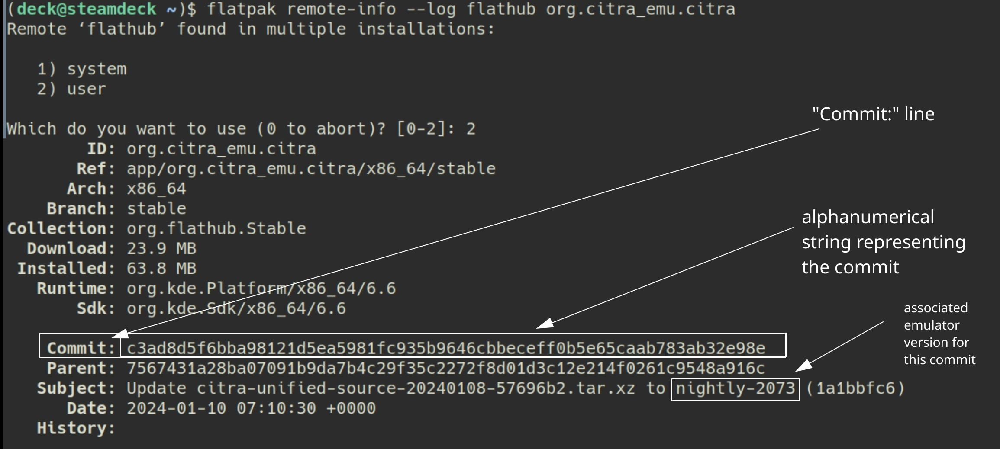
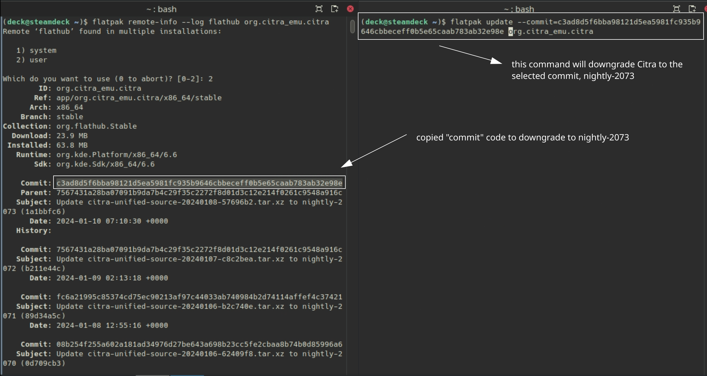

# DuckStation is a Sony Playstation 1 emulator. 

Website: [https://www.duckstation.org/](https://www.duckstation.org/)

GitHub: [https://github.com/stenzek/duckstation](https://www.duckstation.org/)

Compatibility List: [https://docs.google.com/spreadsheets/d/1H66MxViRjjE5f8hOl5RQmF5woS1murio2dsLn14kEqo/edit#gid=0](https://docs.google.com/spreadsheets/d/1H66MxViRjjE5f8hOl5RQmF5woS1murio2dsLn14kEqo/edit#gid=0)

***

## DuckStation Table of Contents

1. [Getting Started with DuckStation](#getting-started-with-duckstation)
    - [Configuration](#duckstation-configuration)
    - [DuckStation Folder Locations](#duckstation-folder-locations)
    - [How to Update DuckStation](#how-to-update-duckstation)
    - [How to Launch DuckStation in Desktop Mode](#how-to-launch-duckstation-in-desktop-mode)
    - [File Formats](#duckstation-file-formats)
    - [DuckStation and RetroArch PlayStation 1 Cores BIOS Information](#duckstation-and-retroarch-playstation-1-cores-bios-information)
    - [DuckStation and RetroArch PlayStation 1 Cores EmulationStation-DE Information](#duckstation-and-retroarch-playstation-1-cores-emulationstation-de-information)
    - [Hotkeys](#duckstation-hotkeys)

2. [DuckStation Tips and Tricks](#duckstation-tips-and-tricks)
    - [How to Optimize Storage (Compression Tool)](#how-to-optimize-storage-compression-tool)
    - [How to Manage Multiple Discs](#how-to-manage-multiple-discs)
    - [How to Use Cheats](#how-to-use-cheats)
    - [How to Configure Multiplayer](#how-to-configure-multiplayer)
    - [How to Roll Back DuckStation to an Older Version](#how-to-roll-back-duckstation-to-an-older-version)
    - [How to Create CUE files](../../file-management/steamos/file-management.md#how-to-create-cue-files)
    - [How to Configure Language Settings](#how-to-configure-language-settings)

***


## Getting Started with DuckStation
[Back to the Top](#duckstation-table-of-contents)

DuckStation is a fairly straight-forward emulator to set up. Place your ROMs in `Emulation/roms/psx`. Place your BIOS directly in `Emulation/bios`. Read the [Configuration](#duckstation-configuration) section to learn more about DuckStation and its folder locations. 

To launch your ROMs in game mode, use Steam ROM Manager and use one of the following parsers to play your PlayStation 1 ROMs:

* `EmulationStation-DE`
* `Sony PlayStation - DuckStation` 
* `Emulators`


***

### DuckStation Configuration
[Back to the Top](#duckstation-table-of-contents)

* Type of Emulator: Flatpak
* Config Location: `/home/deck/.var/app/org.duckstation.DuckStation`
* ROM Location: `Emulation/roms/psx`
* BIOS Location: `Emulation/bios` 
    * Files go directly in this folder. Do not make or use a `PSX`, `PS1`, or any sort of folder here. DuckStation will not be able to find your bios files if they are in a folder. 
    * Required BIOS (Example set, one per region - US, Europe, Japan): `scph5500.bin`, `scph5501.bin`, `scph5502.bin`
* Saves: `Emulation/saves/duckstation/saves`
* Save States: `Emulation/saves/duckstation/states`

!!! info 

    `~/.var` is an invisible folder by default. In Dolphin (file manager), click the hamburger menu in the top right, click `Show Hidden Files` to see these folders.
    Refer to [https://en.wikipedia.org/wiki/PlayStation_models#Comparison_of_models](https://en.wikipedia.org/wiki/PlayStation_models#Comparison_of_models), for a full list of PSX bios. System Models and PSX BIOS have matching names.

#### Works With
* Steam ROM Manager
* EmulationStation-DE

***

### DuckStation Folder Locations
[Back to the Top](#duckstation-table-of-contents)

These file locations apply regardless of where you chose to install EmuDeck (to your internal SSD, to your SD Card, or elsewhere). Some emulator configuration files will be located on the internal SSD as listed below. 

`$HOME` refers to your home folder. If you are on a Steam Deck, this folder will be named `/home/deck` (you will likely not see `deck` in the file path when navigating using the file manager). 

Paths beginning with `Emulation/..` correspond to your EmuDeck install location. If you installed on an SD Card, your path may be `/run/media/mmcblk0p1/Emulation/roms/..`. If you installed on your internal SSD, your path may be `/home/deck/Emulation/roms/..` 

**Note:** Folders with a `.` (`.var`, `.local`, `.config`, etc.) at the beginning are hidden by default. In Dolphin (file manager), click the hamburger menu in the top right, click `Show Hidden Files` to see these folders.

`$HOME/.var/app/org.duckstation.DuckStation`

```
org.duckstation.DuckStation/
├── cache
├── config
│   ├── duckstation
│   │   ├── cache
│   │   ├── cheats
│   │   ├── covers
│   │   ├── dump
│   │   ├── gamesettings
│   │   ├── inputprofiles
│   │   ├── playtime.dat
│   │   ├── screenshots
│   │   ├── settings.ini
│   │   ├── settings.ini.bak
│   │   ├── shaders
│   │   └── textures
│   ├── kdeglobals
│   ├── pulse
│   │   └── cookie
│   ├── QtProject.conf
│   └── user-dirs.dirs
└── data
    └── duckstation
        ├── settings.ini
        └── settings.ini.bak
```

***

### How to Update DuckStation
[Back to the Top](#duckstation-table-of-contents)

**How to Update DuckStation**

* Through the `Update your Emulators & Tools` section on the `Manage Emulators` page in the `EmuDeck` application
* Run `Update Emulators & Tools` in `EmuDeck`
* Launch the emulator from `Steam` after adding it via the `Emulators` parser in `Steam ROM Manager`


### How to Launch DuckStation in Desktop Mode
[Back to the Top](#duckstation-table-of-contents)

**How to Launch DuckStation in Desktop Mode**

* Launch `DuckStation` from the Applications Launcher (Steam Deck icon in the bottom left of the taskbar)
* Launch the script from `Emulation/tools/launchers`, `duckstation.sh`
* Launch the emulator from `Steam` after adding it to Steam via the `Emulators` parser in `Steam ROM Manager`

***

### DuckStation File Formats
[Back to the Top](#duckstation-table-of-contents)

* .cue and .bin
* .chd 
* .ecm 
* .iso 
* .m3u 
* .mds 
* .pbp

### DuckStation and RetroArch PlayStation 1 Cores BIOS Information
[Back to the Top](#duckstation-table-of-contents)

* ROM files for RetroArch's PlayStation 1 cores are shared with DuckStation in `Emulation/roms/psx`. 
* BIOS files for RetroArch's PlayStation 1 cores are shared with DuckStation in `Emulation/bios` (no subfolders).
* As long as you name your BIOS files in this format: `scph####.bin`(####'s are a placeholder), RetroArch's PlayStation 1 cores will work alongside DuckStation. 
* Be sure to rename your BIOS files and note the lowercase `scph`, lowercase `bin` in the example above.

***

### DuckStation and RetroArch PlayStation 1 Cores EmulationStation-DE Information
[Back to the Top](#duckstation-table-of-contents)

By default, EmulationStation-DE uses Retroarch's Beetle HW PSX core. Both Retroarch's Beetle HW PSX core and DuckStation will work if you have set everything up properly. 

To switch between the two in EmulationStation-DE, you can use the `Alternative Emulators` feature. See [EmulationStation-DE: How to Select a Different Emulator for a System](../../tools/steamos/emulationstation-de.md#how-to-select-a-different-emulator-for-a-system) for instructions.
    
***

### DuckStation Hotkeys
[Back to the Top](#duckstation-table-of-contents)

DuckStation comes with a Steam Input profile for Hotkeys. Activate the Steam Input profile by clicking the `Game Controller` icon in `Game Mode`, change the template to `Emudeck - DuckStation`. The hotkeys below can only be used if you have the Steam Input profile active.

**Long Press** to activate hotkeys on the left trackpad radial menu. 

| Hotkey                    | DuckStation               |
|---------------------------|---------------------------|
| Save State                | Left Trackpad Touch Menu  |
| Load State                | Left Trackpad Touch Menu  |
| Next Save Slot            | Left Trackpad Touch Menu  |
| Previous Save Slot        | Left Trackpad Touch Menu  |
| Pause/Play                | Left Trackpad Touch Menu  |
| Quick Menu                | Left Trackpad Touch Menu  |
| Swap Disc                 | Left Trackpad Touch Menu  |
| Fast Forward (Toggle)     | Left Trackpad Touch Menu  |
| Fast Forward (Hold)       | `Select` + `R2`        |
| Rewind                    | `Select` + `L2`        |
| Pause                     | `Select` + `A`         |
| Toggle Full Screen        | `Select` + `R3`        |
| Quick Menu                | `Start` + `L3`         |
| Load State                | `Select` + `L1`        |
| Save State                | `Select` + `R1`        |
| Next Save Slot            | `Start` + `R1`         |
| Previous Save Slot        | `Start` + `L1`         |
| Increase Resolution Scale | `Start` + `DPad Up`    |
| Decrease Resolution Scale | `Start` + `DPad Down`  |
| Toggle Widescreen         | `Start` + `DPad Right` |
| Toggle PGXP               | `Start` + `DPad Left`  |
| Toggle Software Rendering | `Start` + `L3`         |
| Exit                      | `Select` + `Start`     |

**Note:** 

* [How to Select a Steam Input Profile](../../controls-and-hotkeys/steamos/hotkeys.md#how-to-select-a-steam-input-profile)
* [Steam Deck Button Layout](../../controls-and-hotkeys/steamos/hotkeys.md#steam-deck-button-layout)


***

## DuckStation Tips and Tricks
[Back to the Top](#duckstation-table-of-contents)

***

### How to Optimize Storage (Compression Tool)
[Back to the Top](#duckstation-table-of-contents)

To optimize storage, you can use the `EmuDeck Compressor` within EmuDeck.  

The `EmuDeck Compressor` will compress your Playstation 1 ROMs from ISO or BIN/CUE to CHD. If your ROM is a BIN/CUE, the Compression Tool will only compress it if you have both the BIN and the CUE files for a ROM. If the ROM is in a zip file or is missing a paired BIN or CUE file, the Compression Tool will not detect the ROM. 

After running the `EmuDeck Compression Tool`, re-run Steam ROM Manager to update your ROM shortcuts to the newly compressed ROM. 

**Visual Reference:** 


***

### How to Manage Multiple Discs
[Back to the Top](#duckstation-table-of-contents)

M3U files can be used to manage multiple discs for DuckStation. When the time comes to switch discs, use the Left Trackpad Touch Menu Hotkey. A full list of hotkeys and a tutorial on how to use Steam Input profiles can be found here: #hotkeys. 

[Learn how to create an M3U File](../../file-management/steamos/file-management.md#how-to-create-an-m3u-file) 

***

### How to Use Cheats
[Back to the Top](#duckstation-table-of-contents)

1. While in game, either: press `Start` and `R2` or use the left Trackpad and select the `Quick Menu` icon
    * Steam Input profiles for PlayStation 1 ROMs and EmulationStation-DE are enabled by default. However, if you do not see the Trackpad menu, see [How to Select a Steam Input Profile](../../controls-and-hotkeys/steamos/hotkeys.md#how-to-select-a-steam-input-profile)
2. Click `Cheat List`
3. Select which cheats you would like to use

***

### How to Configure Multiplayer
[Back to the Top](#duckstation-table-of-contents)

Multiplayer for DuckStation is configured out of the box, no additional configuration is needed. 

You may need to re-arrange the controller order in Game Mode for your controllers to function as expected. See [How to Re-Arrange the Controller Order](../../controls-and-hotkeys/steamos/external-controllers.md#how-to-re-arrange-the-controller-order) for more information.


***

### How to Roll Back DuckStation to an Older Version
[Back to the Top](#duckstation-table-of-contents)

If you do not have access to a keyboard for the below section, use `L2` to right click and `R2` to left click. Alternatively, remote into your Steam Deck using one of the methods found in the FAQ, [How do I remotely control my Steam Deck?](../../frequently-asked-questions/steamos/index.md#how-do-i-remotely-control-my-steam-deck).

1. In Desktop Mode, open `Konsole`
2. To see a list of prior versions of the emulator, type:
    * `flatpak remote-info --log flathub org.duckstation.DuckStation`
3. If Konsole prompts you to select `system` or `user`, enter `2` to select `user` 
4. Konsole will list a list of previous versions for the flatpak. The important line for each version is the `Commit: ` line. The `Commit: ` line will have a long accompanying alphanumeric string (the “commit” code). Copy the string for the version you want to downgrade to.
    * Using Citra as an example:
        *  
5. To downgrade to the version you want:
    * `flatpak update --commit=put_commit code_here org.duckstation.DuckStation`
    * Replace `put_commit code_here` with the actual code you located in Step 2. 
        * Using Citra as an example:
            * 

If the above steps did not work and you are getting an error message along the lines of `Flatpak not installed`, your Flatpak is likely installed at the system level instead. Select one of the below solutions:

Solution 1: Open the EmuDeck application, click the `Manage Emulators` page, select the emulator in question, and click `Reinstall / Update`.

Solution 2: Add `sudo` in front of the commands written in Step 2 and Step 5. In Step 2, write `sudo flatpak remote-info --log flathub org.duckstation.DuckStation` and in Step 5, write `sudo flatpak update --commit=put_commit_code_here org.duckstation.DuckStation`. 

***

### How to Configure Language Settings
[Back to the Top](#duckstation-table-of-contents)

#### UI

1. In Desktop Mode, open DuckStation
2. At the top, click `Settings`
3. Click `Language`
4. Select your preferred language in the drop-down menu

#### In-Game

Some games may not have language options. For a full list of which games have language options, click one of the below links.

* PAL: [https://psxdatacenter.com/pal_list.html](https://psxdatacenter.com/pal_list.html)
* United States: [https://psxdatacenter.com/ntsc-u_list.html](https://psxdatacenter.com/ntsc-u_list.html)
* Japan: [https://psxdatacenter.com/ntsc-j_list.html](https://psxdatacenter.com/ntsc-j_list.html)

1. Launch a game that supports your preferred language
2. Depending on the game:
    * Select your preferred language on the initial launch of the game
    * In the main menu of the game, open the Options menu and select your preferred language

***