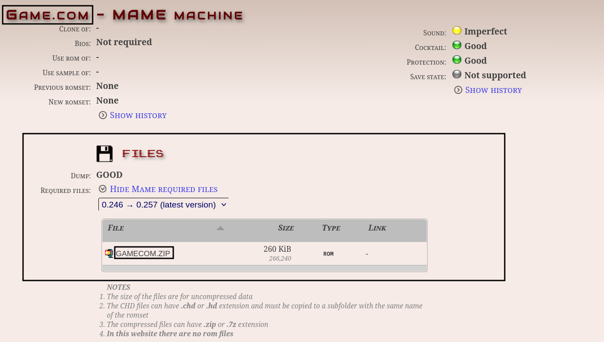

# MAME is a multi-purpose emulation framework. Play arcade games and more. 

Website: [https://www.mamedev.org/](https://www.mamedev.org/)

Github: [https://github.com/mamedev/mame](https://github.com/mamedev/mame)

MAME Wiki: [https://docs.mamedev.org/whatis.html](https://docs.mamedev.org/whatis.html)

MAME FAQ: [https://docs.mamedev.org/usingmame/commonissues.html](https://docs.mamedev.org/usingmame/commonissues.html)

Arcade Database (Lookup required files for MAME ROMs, or what a MAME short name refers to): [http://adb.arcadeitalia.net/default.php](http://adb.arcadeitalia.net/default.php)

***

## MAME Table of Contents

1. [Getting Started with MAME](#getting-started-with-mame)
      - [Configuration](#mame-configuration)
      - [MAME Folder Locations](#mame-folder-locations)
      - [How to Update MAME](#how-to-update-mame)
      - [How to Launch MAME in Desktop Mode](#how-to-launch-mame-in-desktop-mode)
      - [File Formats](#mame-file-formats)
      - [Hotkeys](#mame-hotkeys)

2. [MAME Tips and Tricks](#mame-tips-and-tricks)
      - [Maintaining ROM Versions](#maintaining-rom-versions)
      - [How to Configure Multiplayer](#how-to-configure-multiplayer)
      - [How to Determine if a ROM Requires BIOS](#how-to-determine-if-a-rom-requires-bios)
      - [How to Determine if a ROM Requires a CHD File](#how-to-determine-if-a-rom-requires-a-chd-file)
      - [How to Configure Controls on a Per Game Basis](#how-to-configure-controls-on-a-per-game-basis)
      - [How to Add Custom Bezels](#how-to-add-custom-bezels)
      - [How to Enable Shaders/Scanlines in MAME (Standalone)](https://github.com/dragoonDorise/EmuDeck/wiki/MAME#how-to-enable-shadersscanlines-in-mame-standalone)
      - [How to Configure MAME to Work With EmulationStation-DE](#how-to-configure-mame-to-work-with-emulationstation-de)
      - [How to Roll Back MAME to an Older Version](#how-to-roll-back-mame-to-an-older-version)

***

## Getting Started with MAME
[Back to the Top](#mame-table-of-contents)

***

### MAME Configuration
[Back to the Top](#mame-table-of-contents)

* Type of Emulator: Flatpak
* Config Location: `/home/deck/.mame`
    * Contains the following folders and files: 
        * `mame.ini`
        * `cfg`
        * Plugin folders will appear here after enabling them in MAME
* Storage: `Emulation/storage/mame`
    * Contains the following folders: 
        * `artwork`
        * `ctrlr`
        * `ini`
        * `samples`
* ROM Location: `Emulation/roms/arcade`
* BIOS Location: `Emulation/roms/arcade`
* Saves: `Emulation/saves/MAME/saves`
* Save States: `Emulation/saves/MAME/states`


**Note:** 

* `~/.mame` is an invisible folder by default. In Dolphin (file manager), click the hamburger menu in the top right, click `Show Hidden Files` to see these folders.
* `MAME [Standalone]` shares its `Emulation/roms/arcade` folder with `Arcade - RetroArch MAME Current`. Turning both of these parsers on in Steam ROM Manager will cause duplicates in your App List. 

#### Works With
* Steam ROM Manager
* EmulationStation-DE

***

### MAME Folder Locations
[Back to the Top](#mame-table-of-contents)

These file locations apply regardless of where you chose to install EmuDeck (to your internal SSD, to your SD Card, or elsewhere). Some emulator configuration files will be located on the internal SSD as listed below. 

`$HOME` refers to your home folder. If you are on a Steam Deck, this folder will be named `/home/deck` (you will likely not see `deck` in the file path when navigating using the file manager). 

Paths beginning with `Emulation/..` correspond to your EmuDeck install location. If you installed on an SD Card, your path may be `/run/media/mmcblk0p1/Emulation/roms/..`. If you installed on your internal SSD, your path may be `/home/deck/Emulation/roms/..`

**Note:** Folders with a `.` (`.mame`, `.var`, `.local`, `.config`, etc.) at the beginning are hidden by default. In Dolphin (file manager), click the hamburger menu in the top right, click `Show Hidden Files` to see these folders.

`$HOME/.mame`

```
.mame
├── cfg
│   ├── default.cfg
│   └── ___empty.cfg
└── mame.ini
```

`Emulation/storage/mame`

```
mame
├── artwork
├── ctrlr
├── ini
│   ├── mame.ini
│   ├── plugin.ini
│   └── ui.ini
└── samples
```

***

### How to Update MAME
[Back to the Top](#mame-table-of-contents)

**How to Update MAME**

* Update through `Discover` (Shopping bag icon)
* Through the `Update your Emulators & Tools` section on the `Manage Emulators` page in the `EmuDeck` application

***

### How to Launch MAME in Desktop Mode
[Back to the Top](#mame-table-of-contents)

**How to Launch MAME in Desktop Mode**

* Launch `MAME` from the Applications Launcher (Steam Deck icon in the bottom left of the taskbar)
* Launch the script from `Emulation/tools/launchers`, `mame.sh`
* Launch the emulator from `Steam` after adding it via the `Emulators` parser in `Steam ROM Manager`


***

### MAME File Formats
[Back to the Top](#mame-table-of-contents)

#### ROMs

* .zip 
* .chd

#### BIOS Files

BIOS will be searched through 3 folders:

* `Emulation/roms/arcade/`
* `Emulation/bios/mame/*`
* `Emulation/bios/`

**Note:** EmulationStation-DE will ONLY work with the BIOS in the arcade folder

***

### MAME Hotkeys
[Back to the Top](#mame-table-of-contents)


| Hotkey           | MAME               |
|------------------|--------------------|
| Coin for player  | `Select`           |
| Start for player | `Start`            |
| Fast Forward     | `Select` + `R2`    |
| Load State       | `Select` + `L1`    |
| Save State       | `Select` + `R1`    |
| Exit Emulator    | `Select` + `Start` |
| Exit Emulator    | `STEAM` + `DPad Left` |
| Quick Menu*       | `STEAM` + `DPad Down` |

**Note:** 

* If you make any changes in the Quick Menu while in game, make sure to use one of the `Exit Emulator` hotkeys to close out of the game to ensure any changes you made are saved. If you use `STEAM` + the `Exit game` button, your changes **will not** be saved.
* [Steam Deck Button Layout](../../controls-and-hotkeys/steamos/hotkeys.md#steam-deck-button-layout)

***

## MAME Tips and Tricks
[Back to the Top](#mame-table-of-contents)

***

### Maintaining ROM Versions
[Back to the Top](#mame-table-of-contents)

Ideally use ROMs that are the same version as MAME's version. MAME often releases improved versions of ROMs to fix issues. Issues are less of a concern with the most popular classics because most of those haven't changed in years. But to avoid having to track multiple different versions of your ROMs, most people just keep their ROM sets updated as  the emulator updates. 

To understand how MAME works, look up the difference between merged and split ROM sets, and learn what a sample and a chd are and how they're used in conjunction with ROMs to deliver a playable game. 

Reference image: 

**Note:** Refer to [https://docs.mamedev.org/usingmame/aboutromsets.html](https://docs.mamedev.org/usingmame/aboutromsets.html), for additional information. 

***

### How to Configure Multiplayer

Multiplayer for MAME is configured out of the box, no additional configuration is needed. 

You may need to re-arrange the controller order in Game Mode for your controllers to function as expected. See [How to Re-Arrange the Controller Order](../../controls-and-hotkeys/steamos/external-controllers.md#how-to-re-arrange-the-controller-order) for more information.

***


### How to Determine if a ROM Requires BIOS

Some ROMs for MAME may require BIOS to run. For this section, these ROMs will be split into either `System` or `Software` ROMs. To delineate between the two simply, `System` ROMs are typically arcade ROMs and `Software` ROMs are usually computers or video game consoles. 

#### How to Determine if a System ROM Requires BIOS

1. In a folder of your choice, right click anywhere in the folder, and click `Open Terminal here`
2. Enter:
    * `flatpak run org.mamedev.MAME -listxml > mame.xml`
3. This command will create a `mame.xml` file in the folder you chose in Step 1
4. Right click `mame.xml`, click `Open with Kate` or a text editor of your choice
5. Search the file (either using `Ctrl` + `F` or by clicking `Edit` --> `Find`) and type in `isbios`
6. You will see a line that generally looks like the following:
    * `<machine name="MACHINENAME" sourcefile="PATH/FILENAME" isbios="yes">`
    * For example
        * `<machine name="neogeo" sourcefile="neogeo/neogeo.cpp" isbios="yes">`
7. Let's break this line down, using `neogeo` as an example:
    * `<machine name="neogeo" sourcefile="neogeo/neogeo.cpp" isbios="yes">`
        * `isbios="yes"` means BIOS are required for the Neo-Geo MV-6F
        * The `machine_name=` gives you the name of the BIOS file. BIOS files for `System` ROMs always have a `.zip` file extension. For `neogeo`, the bios will be `neogeo.zip`
        * The list of files below the `manufacturer` typically comprise the files in a merged `neogeo.zip` file. Using a merged `neogeo.zip` may take up extra space but guarantees you have the BIOS necessary to play any Neo-Geo MV-6F ROM
8. Place your BIOS in `Emulation/bios` or `Emulation/roms/arcade` (the latter is required if you are playing through EmulationStation-DE)

Recreating this file whenever MAME updates will get you the latest list of which System ROMs require BIOS. 

#### How to Determine if a Software ROM Requires BIOS

1. Open [http://adb.arcadeitalia.net/default.php](http://adb.arcadeitalia.net/default.php)
2. Search for the name of the console or computer in the search box, respecting punctuation and hyphenation when possible
3. On the respective console or computer's page, scroll down to `Required Files`, and click `SHOW MAME REQUIRED FILES`
    * 
4. Place the file(s) in the list in `Emulation/bios` or the matching ROM folder (the latter is required if you are playing through EmulationStation-DE)
    * For example, if you are playing `Game.com` through EmulationStation-DE, place `gamecom.zip` in `Emulation/roms/gamecom`

##### How to View Compatibility for Software ROMs

1. Open [http://adb.arcadeitalia.net/default.php](http://adb.arcadeitalia.net/default.php)
2. Click `SOFTWARE` on the left side
3. Search for your console or computer in the `SYSTEM` box and click `Search`
    * For example, Game.com: [http://adb.arcadeitalia.net/?search=mess&machine_name=gamecom%3B](http://adb.arcadeitalia.net/?search=mess&machine_name=gamecom%3B)
4. You will see a full list of the ROMs for that respective console or computer. The circle color in the top right of each box is the game's compatibility
    * Green: Supported
    * Yellow: Imperfect
        * Some pages may explain the specific issues affecting the game
    * Red: Not Supported

***

### How to Determine if a ROM Requires a CHD File
[Back to the Top](#mame-table-of-contents)

Game ROMs for MAME are primarily `.zip` files. Some of these games require additional files to run. These additional files are primarily `.chd` files. 

To determine if your ROM requires a `.chd` file:

1. In Desktop Mode, open Konsole
2. Enter:
    * `flatpak run org.mamedev.MAME -listroms ROMSHORTNAME`
        * Typically, the short name of the ROM is the file name. For example, the file name for `Street Fighter III 3rd Strike` is `sfiii3.zip` and the short name is `sfiii3` 
        * You can also use [http://adb.arcadeitalia.net/](http://adb.arcadeitalia.net/) to locate a MAME ROM's short name      
3. You will get an output similar to below:
            ```
            ROMs required for driver "sfiii3".
            Name                                   Size Checksum
            sfiii3_euro.29f400.u2                524288 CRC(30bbf293) SHA1(f094c2eeaf4f6709060197aca371a4532346bf78)
            cap-33s-2                                   SHA1(5a090956fc6d68e496ac42854199059898f2fe16)
            ```
4. The line without a file size or a CRC is the `.chd` file required. The line with a file size and a CRC is the file located within the zip file
    * For example, `sfiii3_euro.29f400.u2` is the file located in `sfiii3.zip` and `cap-33s-2` is the `.chd` file required to run `sfiii3.zip`
5. Create a subfolder matching the shortname in `Emulation/roms/arcade` and place the `.chd` file in the subfolder
    * For example, with `sfiii3`, create a `sfiii3` folder in `Emulation/roms/arcade` and place `cap-33s-2.chd` in `Emulation/roms/arcade/sfiii3`
    * Place `sfiii3.zip` directly in `Emulation/roms/arcade`

***

### How to Configure Controls on a Per Game Basis
[Back to the Top](#mame-table-of-contents)

1. While in game, press `STEAM` and `DPad Down`
2. Select `Input Settings`
3. Select `Input Settings (this system)`
4. Configure controls
5. To ensure your controls are saved, press `STEAM` and `DPad Left` to exit out of the game
    * If you press `STEAM` and use the `Exit game` button, your controls will not be saved
6. Your controls will be saved as a file to `home/deck/.mame/cfg/GAMESHORTNAME.cfg`
    * You may also share this configuration file with others 

***

### How to Add Custom Bezels
[Back to the Top](#mame-table-of-contents)

1. Open `Emulation/storage/mame`
2. Copy bezel files, in .zip format, into this folder, named the same as the ROM. 
3. Done.

**Note:** Use the Bezel Project to locate bezels for your MAME ROMS: [https://github.com/thebezelproject/BezelProject-Windows](https://github.com/thebezelproject/BezelProject-Windows)

***

### How to Enable Shaders/Scanlines in MAME (Standalone)
[Back to the Top](#mame-table-of-contents)

1. In Desktop Mode, open `/home/deck/.mame/mame.ini`
2. Under the `OSD VIDEO OPTIONS` section, set `video` to `bgfx`
3. Under the `BGFX POST-PROCESSING OPTIONS` section, set `bgfx_screen_chains` to the shader of your choice, for example: `crt-geom-deluxe`
4. Save your changes to the file

**Note:** Other shader values can be found here: [https://docs.mamedev.org/advanced/bgfx.html](https://docs.mamedev.org/advanced/bgfx.html)

***

### How to Configure MAME to Work With EmulationStation-DE
[Back to the Top](#mame-table-of-contents)

EmuDeck installs both MAME (Standalone, installed as a flatpak), and RetroArch's MAME core. 

In order to use MAME (Standalone), make sure your ROMs are in `Emulation/roms/arcade`. 

In order to use MAME (Standalone) for EmulationStation-DE, make sure you are selecting `MAME [Standalone]` in the `Alternative Emulators` menu.

**Tutorial**

1. In EmulationStation-DE, press the `Start` button
2. Scroll down and select `Other Settings`
3. Select `Alternative Emulators`
4. Scroll down to `Arcade` and select `MAME [Standalone]`

*** 

### How to Roll Back MAME to an Older Version
[Back to the Top](#mame-table-of-contents)

1. In Desktop Mode, open `Konsole`
2. To see a list of prior versions of the emulator, type:
    * `flatpak remote-info --log flathub org.mamedev.MAME`
    * Each version will have a long accompanying alphanumeric string (the “commit” code). Copy the string for the version you want to downgrade to.
3. To downgrade to the version you want:
    * `flatpak update --commit=put_commit_code_here org.mamedev.MAME`
    * Replace `put_commit_code_here` with the actual code you located in Step 2. 
    * If this line does not work, you may need to type:
        * `sudo flatpak update --commit=put_commit_code_here org.mamedev.MAME`

***