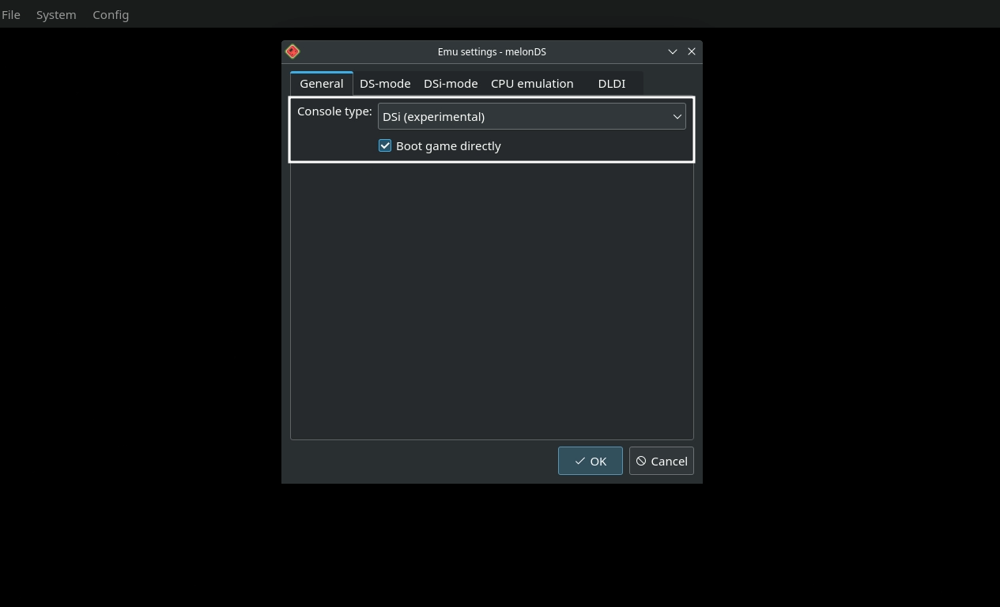

# melonDS is a Nintendo DS emulator.

Website: [https://melonds.kuribo64.net/](https://github.com/mgba-emu/mgba)

melonDS' FAQ: [https://melonds.kuribo64.net/faq.php](https://melonds.kuribo64.net/faq.php)

Github: [https://github.com/melonDS-emu/melonDS](https://github.com/melonDS-emu/melonDS)

Compatibility List: [https://melonds.kuribo64.net/board/forum.php?id=3](https://melonds.kuribo64.net/board/forum.php?id=3)

**This page is for melonDS, a standalone NDS emulator. This page is not for the melonDS RetroArch core. For more information on RetroArch and the melonDS RetroArch core, visit the [RetroArch Page](../steamos/retroarch.md).**


***

## melonDS Table of Contents

1. [Getting Started with melonDS](#getting-started-with-melonds)
    - [Configuration](#melonds-configuration)
    - [How to Update melonDS](#how-to-update-melonds)
    - [How to Launch melonDS in Desktop Mode](#how-to-launch-melonds-in-desktop-mode)
    - [File Formats](#melonds-file-formats)
    - [Hotkeys](#melonds-hotkeys)

2. [melonDS Tips and Tricks](#melonds-tips-and-tricks)
    - [How to Use Cheats](#how-to-use-cheats)
    - [How to Set up DSIWare](#how-to-set-up-dsiware)
    - [How to Play Nintendo DS Games in Book Mode](#how-to-play-nintendo-ds-games-in-book-mode)
    - [How to Customize the Screen Layout](#how-to-customize-the-screen-layout)

***

## Getting Started with melonDS
[Back to the Top](#melonds-table-of-contents)

melonDS is a fairly straight-forward emulator to set up. Place your ROMs in `Emulation/roms/nds`. No additional setup is required. Read the [Configuration](#melonds-configuration) section to learn more about melonDS and its folder locations. BIOS are optional for both the Nintendo DS and Nintendo DSI. 

To launch your ROMs in game mode, use Steam ROM Manager and use one of the following parsers to play your NDS ROMs:

* `EmulationStation-DE`
* `Nintendo DS - melonDS` 
* `Emulators`

***

### melonDS Configuration
[Back to the Top](#melonds-table-of-contents)

* Type of Emulator: Flatpak
* Config Location: `/home/deck/.var/app/net.kuribo64.melonDS`
* ROM Location: `Emulation/roms/nds`
* BIOS Location: `Emulation/bios`
    * Optional BIOS (Nintendo DS): `bios7.bin`, `bios9.bin`, `firmware.bin`
    * Optional BIOS (Nintendo DSI): `dsi_bios9.bin`, `dsi_bios7.bin`, `dsi_firmware.bin`, `dsi_nand.bin`
* Saves: `Emulation/saves/melonds/saves`
* Save States: `Emulation/saves/melonds/states`
* Cheats Location: `Emulation/storage/melonds/cheats`

**Note:** `~/.var` is an invisible folder by default. In Dolphin (file manager), click the hamburger menu in the top right, click `Show hidden files` to see these folders.  

#### Folder Visualization

`$HOME/.var/app/net.kuribo64.melonDS`

```
net.kuribo64.melonDS
├── cache
├── config
│   ├── kdeglobals
│   ├── melonDS
│   │   ├── melonDS.ini
│   │   ├── melonDS.ini.bak
│   │   ├── timewarp.mln
│   │   └── wfcsettings.bin
│   ├── pulse
│   │   └── cookie
│   ├── QtProject.conf
│   └── user-dirs.dirs
└── data
    ├── user-places.xbel
    ├── user-places.xbel.bak
    └── user-places.xbel.tbcache
```


#### Works With
* Steam ROM Manager
* EmulationStation-DE


***

### How to Update melonDS
[Back to the Top](#melonds-table-of-contents)

**How to Update melonDS**

* Update through `Discover` (Shopping bag icon)
* Through the `Update your Emulators & Tools` section on the `Manage Emulators` page in the `EmuDeck` application

***

### How to Launch melonDS in Desktop Mode
[Back to the Top](#melonds-table-of-contents)

**How to Launch melonDS in Desktop Mode**

* Launch `melonDS` from the Applications Launcher (Steam Deck icon in the bottom left of the taskbar)
* Launch the script from `Emulation/tools/launchers`, `melonds.sh`
* Launch the emulator from `Steam` after adding it via the `Emulators` parser in `Steam ROM Manager`


***

### melonDS File Formats
[Back to the Top](#melonds-table-of-contents)

* .nds
* .app

***

### melonDS Hotkeys
[Back to the Top](#melonds-table-of-contents)

melonDS comes with a Steam Input profile for Hotkeys. Activate the Steam Input profile by clicking the `Game Controller` icon in `Game Mode`, change the template to `Emudeck - melonDS`. The hotkeys below can only be used if you have the Steam Input profile active.

**Long Press** to activate hotkeys on the left trackpad radial menu. 

| Hotkey         | melonDS                   |
|----------------|---------------------------|
| Full Screen      | Left Trackpad Radial Menu or Tilt `Right Joystick` `Left` |
| Save State Menu  | Left Trackpad Radial Menu        |
| Load State Menu  | Left Trackpad Radial Menu        |
| Pause            | Left Trackpad Radial Menu        |
| Cheats           | Left Trackpad Radial Menu        |
| Microphone       | Left Trackpad Radial Menu or `R3`|
| Close/Open Lid   | Left Trackpad Radial Menu or `L3`|
| Swap Screens     | Left Trackpad Radial Menu or `R2`|
| Reset            | Left Trackpad Radial Menu        |
| Toggle FPS Limit | Tilt `Right Joystick` `Right`    |


**Note:** 

* [How to Select a Steam Input Profile](../../controls-and-hotkeys/steamos/hotkeys.md#how-to-select-a-steam-input-profile)
* [Steam Deck Button Layout](../../controls-and-hotkeys/steamos/hotkeys.md#steam-deck-button-layout)

***

## melonDS Tips and Tricks
[Back to the Top](#melonds-table-of-contents)

***

### How to Use Cheats
[Back to the Top](#melonds-table-of-contents)

**Note:** melonDS does not currently support importing cheats from a database file.

#### How to Enable Cheats in melonDS

1. Open melonDS
2. Click `System` at the top
3. Check `Enable cheats`
    * 

#### How to Download the Cheats Database

1. Open [https://db.universal-team.net/ds/ndsi-cheat-databases](https://db.universal-team.net/ds/ndsi-cheat-databases), right click `cheats.xml`, and click `Save As`
2. Place it in `Emulation/storage/melonds/cheats`
    * This folder placement is optional, you may place it wherever you want
3. To view, right click `cheats.xml`, open with a text editor of your choice

#### How to Use the Cheats Database

**Note:** It's recommended you do this in Desktop mode so you can easily copy from the cheats database into MelonDS. After adding cheats, you can use MelonDS in Game Mode. 

1. Open the `cheats.xml` you downloaded from the `How to Download the Cheats Database` section
2. `CTRL` + `F` the game you are adding cheats to
3. Copy the blocks of alphanumerical strings between the two `<codes> <codes>` for your respective cheat
    * Example: 
4. Open MelonDS
5. Open a ROM
6. Click `System` at the top
7. Click `Setup cheat codes`
8. Create a `New Category`, you may name it whatever you would like
9. Click `New AR Code`
10. Match the name of the AR Code to the cheat you located in Step 3
   * The name is flexible, you may name it whatever you would like
11. Paste the code you copied from Step 3, it will appear as red text
13. Format the cheat so there are two blocks of code per line
    * Original: 
    * Corrected: 
14. Some cheats are automatically activated, others will require a button combo. Look at the `cheats.xml` file to see if a button combo is required to activate your cheat

***

### How to Set Up DSIWare
[Back to the Top](#melonds-table-of-contents)

**Preface:** Generally, DSIWare games are named `00000000` with no file extension. This section assumes you have these types of DSIWare ROMs. 

1. Place your DSI BIOS in `Emulation/bios`
    * Read the [Configuration](#melonds-configuration) section for additional detail
2. Place your DSIWare ROMs in `Emulation/roms/nds`
3. Right click the ROM in the folder, click `Rename`, rename it from `00000000` to `GAMENAME.app`
    * Replace `GAMENAME` with the name of the DSIWare game
    * For example:
        * Original file name: `00000000`
        * Updated file name: `X-Scape.app`
4. In Desktop Mode, open melonDS
5. At the top, select `Config`, `Emu Settings`
6. On the `General` tab, change the `Console type` to `DSi (experimental)`, close out of this menu
    * 
7. At the top, select `System`, `Manage DSi titles`
8. On the `DSi Title Manager` screen, select `Import title`
9. Select your `GAMENAME.app` as the `Executable`
10. Under `Metadata`, select `Download from NUS`, close out of this menu
11. Select `File`, `Boot Firmware`
12. Select your newly-installed DSiWare game and start playing

#### Steam ROM Manager and EmulationStation-DE

Both EmuDeck's Steam ROM Manager parser for melonDS (Standalone) and EmulationStation-DE support the `.app` file extension. As long as your DSIWare ROMs are in `Emulation/roms/nds`, you may use either option to play your DSIWare ROMs in Game Mode. 

Do note that your ROM may not have art on SteamGridDB or metadata on EmulationStation-DE's scraping websites. Follow the links below if you would like to add art or metadata to one of these websites. 

* Steam ROM Manager
    * [SteamGridDB](https://www.steamgriddb.com/)
        * You may request a game page here: [https://www.steamgriddb.com/request-game](https://www.steamgriddb.com/request-game)
            * You will need to login to view this page
* EmulationStation-DE
    * [TheGamesDB](https://thegamesdb.net/) 
    * [ScreenScraper](https://www.screenscraper.fr/)

***

### How to Play Nintendo DS Games in Book Mode
[Back to the Top](#melonds-table-of-contents)

A handful of Nintendo DS games require portrait orientation. For these games, you will need to rotate the Steam Deck screen in order to play them. Fortunately, it's a simple process.

**Here's How**

1. In Game Mode, select the `EmuDeck - MelonDS` profile if you are playing a game directly from Game Mode or the `EmuDeck - EmulationStation-DE` profile if you are playing through EmulationStation-DE
    * [How to Select a Steam Input Profile](../../controls-and-hotkeys/steamos/hotkeys.md#how-to-select-a-steam-input-profile)
2. Open the game, use the Steam Input profile and select the `Fullscreen` hotkey
3. At the top, press `Config`, `Screen Rotation`, `270`
    * 
    * 

***

Original: 

Rotated: 

*** 

### How to Customize the Screen Layout

By default, EmuDeck configures melonDS' screens to use a hybrid layout, meaning there is a large top screen on the left side of the screen and a mini top and bottom screen of the Nintendo DS on the right. If you would rather a different layout, it is fairly easy to customize.

**Here's How**

1. In Game Mode, select the `EmuDeck - MelonDS` profile if you are playing a game directly from Game Mode or the `EmuDeck - EmulationStation-DE` profile if you are playing through EmulationStation-DE
    * [How to Select a Steam Input Profile](../../controls-and-hotkeys/steamos/hotkeys.md#how-to-select-a-steam-input-profile)
2. Open the game, use the Steam Input profile and select the `Fullscreen` hotkey
3. At the top, press `Config`, and use `Screen size`, `Screen rotation`, `Screen layout`, `Screen sizing`, and `Aspect Ratio` to customize your layout 
    * 

The `Screen layout` is where you can find the `Hybrid layout` option. Here, you can swap to `Natural`, `Vertical`, `Horizontal`, and `Hybrid`. 

**How to Reset to EmuDeck Defaults**

If you configured the settings and you decide you would like to reset to EmuDeck's defaults, you can do so by following the below:

1. Open the EmuDeck application in Desktop Mode
2. Click the `Manage Emulators` page
3. Click `melonDS` and click `Reset Configurations`

**How to Back Up your Screen Layout Configuration**

1. In Desktop Mode, open `/home/deck/.var/app/net.kuribo64.melonDS/config/melonDS`
    * `~/.var` is an invisible folder by default. In Dolphin (file manager), click the hamburger menu in the top right, click `Show hidden files` to see these folders
2. Open `melonDS.ini` in Kate or a text editor of your choice
3. Copy the following section to another file:

            WindowWidth=1280
            WindowHeight=771
            WindowMax=0
            ScreenRotation=0
            ScreenGap=0
            ScreenLayout=3
            ScreenSwap=0
            ScreenSizing=3
            IntegerScaling=0
            ScreenAspectTop=4
            ScreenAspectBot=4           

4. Back up this file to a secure location. If/when your melonDS configs are reset on an EmuDeck update, you may paste this section into the `melonDS.ini` to restore your custom layout

***