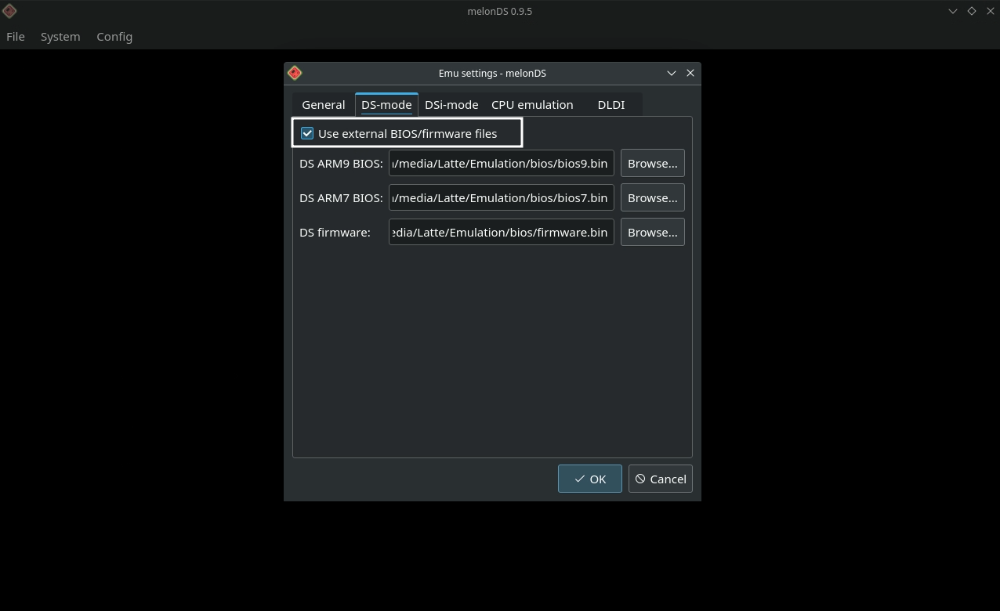

# melonDS is a Nintendo DS emulator.

Website: [https://melonds.kuribo64.net/](https://melonds.kuribo64.net/)

melonDS' FAQ: [https://melonds.kuribo64.net/faq.php](https://melonds.kuribo64.net/faq.php)

GitHub: [https://github.com/melonDS-emu/melonDS](https://github.com/melonDS-emu/melonDS)

Compatibility List: [https://melonds.kuribo64.net/board/forum.php?id=3](https://melonds.kuribo64.net/board/forum.php?id=3)

**This page is for melonDS, a standalone NDS emulator. This page is not for the melonDS RetroArch core. For more information on RetroArch and the melonDS RetroArch core, visit the [RetroArch Page](../steamos/retroarch.md).**


***

## melonDS Table of Contents

1. [Getting Started with melonDS](#getting-started-with-melonds)
    - [Configuration](#melonds-configuration)
    - [melonDS Folder Locations](#melonds-folder-locations)
    - [How to Download melonDS (Standalone)](#how-to-download-melonds-standalone)
    - [How to Update melonDS](#how-to-update-melonds)
    - [How to Launch melonDS in Desktop Mode](#how-to-launch-melonds-in-desktop-mode)
    - [File Formats](#melonds-file-formats)
    - [Hotkeys](#melonds-hotkeys)

2. [melonDS Tips and Tricks](#melonds-tips-and-tricks)
    - [How to Configure Multiplayer](#how-to-configure-multiplayer)
    - [How to Configure Settings](#how-to-configure-settings)
    - [How to Use Cheats](#how-to-use-cheats)
    - [How to Set up DSIWare](#how-to-set-up-dsiware)
    - [How to Play Nintendo DS Games in Book Mode](#how-to-play-nintendo-ds-games-in-book-mode)
    - [How to Customize the Screen Layout](#how-to-customize-the-screen-layout)
    - [How to Roll Back melonDS to an Older Version](#how-to-roll-back-melonds-to-an-older-version)
    - [How to Configure Language Settings](#how-to-configure-language-settings)
    - [How to Set Up PKHeX](../../community-creations/steamos/tools-and-guides.md#how-to-set-up-pkhex)
    - [How to Install the Universal Pokemon Randomizer](../../community-creations/steamos/tools-and-guides.md#how-to-install-the-universal-pokemon-randomizer)
    - [How to Use ROM Hacks](../../community-creations/steamos/tools-and-guides.md#how-to-use-rom-hacks)
    
***

## Getting Started with melonDS
[Back to the Top](#melonds-table-of-contents)

melonDS is a fairly straight-forward emulator to set up. Place your ROMs in `Emulation/roms/nds`. No additional setup is required. Read the [Configuration](#melonds-configuration) section to learn more about melonDS and its folder locations. BIOS are optional for both the Nintendo DS and Nintendo DSI. 

To launch your ROMs in game mode, use Steam ROM Manager and use one of the following parsers to play your NDS ROMs:

* `ES-DE`
* `Nintendo DS - melonDS` 
* `Emulators`

***

### melonDS Configuration
[Back to the Top](#melonds-table-of-contents)

* Type of Emulator: Flatpak
* Config Location: `/home/deck/.var/app/net.kuribo64.melonDS`
* ROM Location: `Emulation/roms/nds`
* BIOS Location: `Emulation/bios`
    * Optional BIOS (Nintendo DS): `bios7.bin`, `bios9.bin`, `firmware.bin`
    * Optional BIOS (Nintendo DSI): `dsi_bios9.bin`, `dsi_bios7.bin`, `dsi_firmware.bin`, `dsi_nand.bin`
* Saves: `Emulation/saves/melonds/saves`
* Save States: `Emulation/saves/melonds/states`
* Cheats Location: `Emulation/storage/melonds/cheats`

**Note:** `~/.var` is an invisible folder by default. In Dolphin (file manager), click the hamburger menu in the top right, click `Show hidden files` to see these folders.  

#### Works With
* Steam ROM Manager
* ES-DE

***

### melonDS Folder Locations
[Back to the Top](#melonds-table-of-contents)

These file locations apply regardless of where you chose to install EmuDeck (to your internal SSD, to your SD Card, or elsewhere). Some emulator configuration files will be located on the internal SSD as listed below. 

`$HOME` refers to your home folder. If you are on a Steam Deck, this folder will be named `/home/deck` (you will likely not see `deck` in the file path when navigating using the file manager). 

Paths beginning with `Emulation/..` correspond to your EmuDeck install location. If you installed on an SD Card, your path may be `/run/media/mmcblk0p1/Emulation/roms/..`. If you installed on your internal SSD, your path may be `/home/deck/Emulation/roms/..`

**Note:** Folders with a `.` (`.var`, `.local`, `.config`, etc.) at the beginning are hidden by default. In Dolphin (file manager), click the hamburger menu in the top right, click `Show Hidden Files` to see these folders.

`$HOME/.var/app/net.kuribo64.melonDS`

```
net.kuribo64.melonDS
├── cache
├── config
│   ├── kdeglobals
│   ├── melonDS
│   │   ├── melonDS.ini
│   │   ├── melonDS.ini.bak
│   │   ├── timewarp.mln
│   │   └── wfcsettings.bin
│   ├── pulse
│   │   └── cookie
│   ├── QtProject.conf
│   └── user-dirs.dirs
└── data
    ├── user-places.xbel
    ├── user-places.xbel.bak
    └── user-places.xbel.tbcache
```

***

### How to Download melonDS (Standalone)
[Back to the Top](#melonds-table-of-contents)

1. In Desktop Mode, open the EmuDeck application
2. Click the `Manage Emulators` button
3. Click `melonDS`
4. Click `Install`
5. melonDS (Standalone) will be installed
    * To open melonDS in Desktop Mode, see [How to Launch melonDS in Desktop Mode](#how-to-launch-melonds-in-desktop-mode)

To use **melonDS (Standalone)** to launch your ROMs in Game Mode:

* Use Steam ROM Manager and select the `Nintendo DS - melonDS` parser
    * The RetroArch parser is named: `Nintendo DS - Retroarch - melonDS`
    * The melonDS (Standalone) parser is named: `Nintendo DS - melonDS`
* Use Steam ROM Manager and select the `ES-DE` parser
    * To switch to melonDS (Standalone) in ES-DE, see [ES-DE: How to Select a Different Emulator for a System](../../tools/steamos/es-de.md#how-to-select-a-different-emulator-for-a-system)

**No** additional setup is required with Steam ROM Manager and ES-DE. If you do not have the latest Steam ROM Manager configurations, either run a `Custom Reset` or click the `Reset configuration` button on the Steam ROM Manager page within the EmuDeck application.

***

### How to Update melonDS
[Back to the Top](#melonds-table-of-contents)

**How to Update melonDS**

* Update through `Discover` (Shopping bag icon)
* Through the `Update your Emulators & Tools` section on the `Manage Emulators` page in the `EmuDeck` application

***

### How to Launch melonDS in Desktop Mode
[Back to the Top](#melonds-table-of-contents)

**How to Launch melonDS in Desktop Mode**

* Launch `melonDS` from the Applications Launcher (Steam Deck icon in the bottom left of the taskbar)
* Launch the script from `Emulation/tools/launchers`, `melonds.sh`
* Launch the emulator from `Steam` after adding it via the `Emulators` parser in `Steam ROM Manager`


***

### melonDS File Formats
[Back to the Top](#melonds-table-of-contents)

* .nds
* .app

***

### melonDS Hotkeys
[Back to the Top](#melonds-table-of-contents)

melonDS comes with a Steam Input profile for Hotkeys. When playing melonDS ROM shortcuts through Steam, the `EmuDeck - Controller Hotkeys` profile will automatically be applied so you may use the below hotkeys. For more info, see [Emulator Button Combinations Profile](../../controls-and-hotkeys/steamos/hotkeys.md#emulator-button-combinations-profile).

When using a frontend (ES-DE, Pegasus, or the emulator itself), the `EmuDeck - Frontend Controller Hotkeys` will automatically be applied. Hold `Start` for a few seconds to switch to the action set required to use the below hotkeys. For more info, see [Emulator Frontends Button Combinations Profile](../../controls-and-hotkeys/steamos/hotkeys.md#emulator-frontends-button-combinations-profile).

{{ read_csv('melonds-hotkeys.csv') }}


**Note** 

* For a tutorial on how to select Steam Input Profiles, refer to: [How to Select a Steam Input Profile](../../controls-and-hotkeys/steamos/hotkeys.md#how-to-select-a-steam-input-profile).
* If you would like to use touch menus, apply the `EmuDeck - Steam Deck Radial Menus` profile instead.  
* [Steam Deck Button Layout](../../controls-and-hotkeys/steamos/hotkeys.md#steam-deck-button-layout)

***

## melonDS Tips and Tricks
[Back to the Top](#melonds-table-of-contents)

***

### How to Configure Multiplayer
[Back to the Top](#melonds-table-of-contents)

This section is strictly referring to local multiplayer. melonDS multiplayer on the Steam Deck can only be done in Desktop Mode.

1. In Desktop Mode, open melonDS
2. Click `System`, click `Multiplayer`, `Launch new instance`
3. On each window of melonDS, click `Config`, `Input and hotkeys`
4. In the drop-down menu to the right of `Joystick`, select your controller
    * Steam Deck/Player 1: `Microsoft X-Box 360 pad 0`
    * Player 2: `Microsoft X-Box 360 pad 1`
    * Player 3: `Microsoft X-Box 360 pad 2`
    * Player 4: `Microsoft X-Box 360 pad 3`
5. Open the game in each melonDS window and you will be able to play multiplayer

You can determine which melonDS window corresponds to what player by looking at the menu bar at the top. Each new melonDS window will have a corresponding `(#)`.

***

### How to Configure Settings
[Back to the Top](#melonds-table-of-contents)

#### Game Mode

If you are playing in Game Mode, make sure you have the correct "Steam Input" profile applied. For more information, see the [Hotkeys](#melonds-hotkeys) section. 

While in game, press `Select` + `R3` to exit full screen. While melonDS is windowed, you will have access to the settings at the top of the screen. Adjust these options to your liking. After you have made your changes, press `Select` + `R3` again to switch melonDS back to full screen. 

After you have made your changes and you are ready to exit your game, **do not** use the `STEAM` butto to exit out of the game. If you use the `STEAM` button, any changes you have made will be reverted. 

Press `Select` + `R3` again to exit full screen. In the top right, click `File`, click `Quit`. You will only need to do this when you are changing settings. Otherwise, you may simply use the `STEAM` button as usual. 

#### Desktop Mode

In Desktop Mode, open melonDS. Adjust any options to your liking. In the top right, click `File`, click `Quit`.

**Do not** click the `X` button in the top right to exit out of melonDS. If you use the `X` button, any changes will be reverted.

***

### How to Use Cheats
[Back to the Top](#melonds-table-of-contents)

**Note:** melonDS does not currently support importing cheats from a database file.

#### How to Enable Cheats in melonDS

1. Open melonDS
2. Click `System` at the top
3. Check `Enable cheats`
    * 

#### How to Download the Cheats Database

1. Open [https://db.universal-team.net/ds/ndsi-cheat-databases](https://db.universal-team.net/ds/ndsi-cheat-databases), right click `cheats.xml`, and click `Save As`
2. Place it in `Emulation/storage/melonds/cheats`
    * This folder placement is optional, you may place it wherever you want
3. To view, right click `cheats.xml`, open with a text editor of your choice

#### How to Use the Cheats Database

**Note:** It's recommended you do this in Desktop mode so you can easily copy from the cheats database into MelonDS. After adding cheats, you can use MelonDS in Game Mode. 

1. Open the `cheats.xml` you downloaded from the `How to Download the Cheats Database` section
2. `CTRL` + `F` the game you are adding cheats to
3. Copy the blocks of alphanumerical strings between the two `<codes> <codes>` for your respective cheat
    * Example: 
4. Open MelonDS
5. Open a ROM
6. Click `System` at the top
7. Click `Setup cheat codes`
8. Create a `New Category`, you may name it whatever you would like
9. Click `New AR Code`
10. Match the name of the AR Code to the cheat you located in Step 3
   * The name is flexible, you may name it whatever you would like
11. Paste the code you copied from Step 3, it will appear as red text
13. Format the cheat so there are two blocks of code per line
    * Original: 
    * Corrected: 
14. Some cheats are automatically activated, others will require a button combo. Look at the `cheats.xml` file to see if a button combo is required to activate your cheat

***

### How to Set Up DSIWare
[Back to the Top](#melonds-table-of-contents)

The Nintendo DSI requires DSI specific BIOS. Place **all** of the files from the list below **directly** in `Emulation/bios`.

* `dsi_bios9.bin`
* `dsi_bios7.bin`
* `dsi_firmware.bin`
* `dsi_nand.bin`

**Note:** 

* The BIOS must be named exactly as above. BIOS with any deviations from the above **will not** work. Make sure you have the proper casing, characters, and spelling. 
* BIOS must be placed in `Emulation/bios`. If you create a sub-folder, the BIOS will not be picked up and Nintendo DSI games **will not** work. 

***

**Preface:** Generally, DSIWare games are named `00000000` with no file extension. This section assumes you have these types of DSIWare ROMs. 

1. Place your DSI BIOS in `Emulation/bios`
2. Place your DSIWare ROMs in `Emulation/roms/nds`
3. Right click the DSIWare ROM in `Emulation/roms/nds`, click `Rename`, rename it from `00000000` to `GAMENAME.app`
    * Replace `GAMENAME` with the name of the DSIWare game
    * For example:
        * Original file name: `00000000`
        * Updated file name: `X-Scape.app`
4. In Desktop Mode, open melonDS
5. At the top, select `Config`, `Emu Settings`
6. On the `General` tab, change the `Console type` to `DSi (experimental)`
    * 
7. On the `DS-mode` tab, check `Use external BIOS/firmware files`, close out of this menu
    * 
8. At the top, select `System`, `Manage DSi titles`
9. On the `DSi Title Manager` screen, select `Import title`
10. Select your `GAMENAME.app` as the `Executable`
11. Under `Metadata`, select `Download from NUS`, close out of this menu
12. Select `File`, `Boot Firmware`
13. Select your newly-installed DSiWare game and start playing

***

#### Steam ROM Manager and ES-DE

Both EmuDeck's Steam ROM Manager parser for melonDS (Standalone) and ES-DE support the `.app` file extension. As long as your DSIWare ROMs are in `Emulation/roms/nds`, you may use either option to play your DSIWare ROMs in Game Mode. 

Do note that your ROM may not have art on SteamGridDB or metadata on ES-DE's scraping websites. Follow the links below if you would like to add art or metadata to one of these websites. 

* Steam ROM Manager
    * [SteamGridDB](https://www.steamgriddb.com/)
        * You may request a game page here: [https://www.steamgriddb.com/request-game](https://www.steamgriddb.com/request-game)
            * You will need to login to view this page
* ES-DE
    * [TheGamesDB](https://thegamesdb.net/) 
    * [ScreenScraper](https://www.screenscraper.fr/)

***

### How to Play Nintendo DS Games in Book Mode
[Back to the Top](#melonds-table-of-contents)

A handful of Nintendo DS games require portrait orientation. For these games, you will need to rotate the Steam Deck screen in order to play them. Fortunately, it's a simple process.

**Here's How**

1. In Game Mode, select the `EmuDeck - Controller Hotkeys` profile if you are playing a game directly from Game Mode or the `EmuDeck - Frontend Controller Hotkeys` profile if you are playing through ES-DE or Pegasus
    * [How to Select a Steam Input Profile](../../controls-and-hotkeys/steamos/hotkeys.md#how-to-select-a-steam-input-profile)
2. Open the game, use the Steam Input profile and select the `Fullscreen` hotkey
3. At the top, press `Config`, `Screen Rotation`, `270`
    * 
    * 

***

Original: 

Rotated: 

*** 

### How to Customize the Screen Layout

By default, EmuDeck configures melonDS' screens to use a hybrid layout, meaning there is a large top screen on the left side of the screen and a mini top and bottom screen of the Nintendo DS on the right. If you would rather a different layout, it is fairly easy to customize.

**Here's How**

1. In Game Mode, select the `EmuDeck - Controller Hotkeys` profile if you are playing a game directly from Game Mode or the `EmuDeck - Frontend Controller Hotkeys` profile if you are playing through ES-DE or Pegasus
    * [How to Select a Steam Input Profile](../../controls-and-hotkeys/steamos/hotkeys.md#how-to-select-a-steam-input-profile)
2. Open the game, use the Steam Input profile and select the `Fullscreen` hotkey
3. At the top, press `Config`, and use `Screen size`, `Screen rotation`, `Screen layout`, `Screen sizing`, and `Aspect Ratio` to customize your layout 
    * 

The `Screen layout` is where you can find the `Hybrid layout` option. Here, you can swap to `Natural`, `Vertical`, `Horizontal`, and `Hybrid`. 

**How to Reset to EmuDeck Defaults**

If you configured the settings and you decide you would like to reset to EmuDeck's defaults, you can do so by following the below:

1. Open the EmuDeck application in Desktop Mode
2. Click the `Manage Emulators` page
3. Click `melonDS` and click `Reset Configurations`

**How to Back Up your Screen Layout Configuration**

1. In Desktop Mode, open `/home/deck/.var/app/net.kuribo64.melonDS/config/melonDS`
    * `~/.var` is an invisible folder by default. In Dolphin (file manager), click the hamburger menu in the top right, click `Show hidden files` to see these folders
2. Open `melonDS.ini` in Kate or a text editor of your choice
3. Copy the following section to another file:

            WindowWidth=1280
            WindowHeight=771
            WindowMax=0
            ScreenRotation=0
            ScreenGap=0
            ScreenLayout=3
            ScreenSwap=0
            ScreenSizing=3
            IntegerScaling=0
            ScreenAspectTop=4
            ScreenAspectBot=4           

4. Back up this file to a secure location. If/when your melonDS configs are reset on an EmuDeck update, you may paste this section into the `melonDS.ini` to restore your custom layout

***

### How to Roll Back melonDS to an Older Version
[Back to the Top](#melonds-table-of-contents)

If you do not have access to a mouse and keyboard for the below section, use `L2` to right click and `R2` to left click. Alternatively, remote into your Steam Deck using one of the methods found in the FAQ, [How do I remotely control my Steam Deck?](../../frequently-asked-questions/steamos/index.md#how-do-i-remotely-control-my-steam-deck).

1. In Desktop Mode, open `Konsole`
2. To see a list of prior versions of the emulator, type:
    * `flatpak remote-info --log flathub net.kuribo64.melonDS`
3. If Konsole prompts you to select `system` or `user`, enter `2` to select `user` 
4. Konsole will list a list of previous versions for the flatpak. The important line for each version is the `Commit: ` line. The `Commit: ` line will have a long accompanying alphanumeric string (the “commit” code). Copy the string for the version you want to downgrade to.
    * Using Citra as an example:
        *  
5. To downgrade to the version you want:
    * `flatpak update --commit=put_commit_code_here net.kuribo64.melonDS`
    * Replace `put_commit_code_here` with the actual code you located in Step 2. 
        * Using Citra as an example:
            * 

If the above steps did not work and you are getting an error message along the lines of `Flatpak not installed`, your Flatpak is likely installed at the system level instead. Select one of the below solutions:

Solution 1: Open the EmuDeck application, click the `Manage Emulators` page, select the emulator in question, and click `Reinstall / Update`.

Solution 2: Add `sudo` in front of the commands written in Step 2 and Step 5. In Step 2, write `sudo flatpak remote-info --log flathub net.kuribo64.melonDS` and in Step 5, write `sudo flatpak update --commit=put_commit_code_here net.kuribo64.melonDS`. 

***

### How to Configure Language Settings
[Back to the Top](#melonds-table-of-contents)

#### In-Game

Some games may not have language options. For a full list of which games have language options, download the DS Database from GamesTDB, [https://www.gametdb.com/DS/Downloads](https://www.gametdb.com/DS/Downloads) and open it in a text editor of your choice. 

Before proceeding with the below section, you will need to place Nintendo DS BIOS in the `Emulation/bios` folder.

1. In Desktop Mode, open melonDS
2. At the top, click `Config`
3. Click `Emu settings`
4. Click `DS-Mode`, check `Use external BIOS/firmware files`
5. Close out of the `Emu settings` window
6. Click `File`, click `Boot firmware`
7. Click the DS icon at the bottom of the screen
8. Click the gear icon
9. Click the globe icon
10. Select your preferred language


***