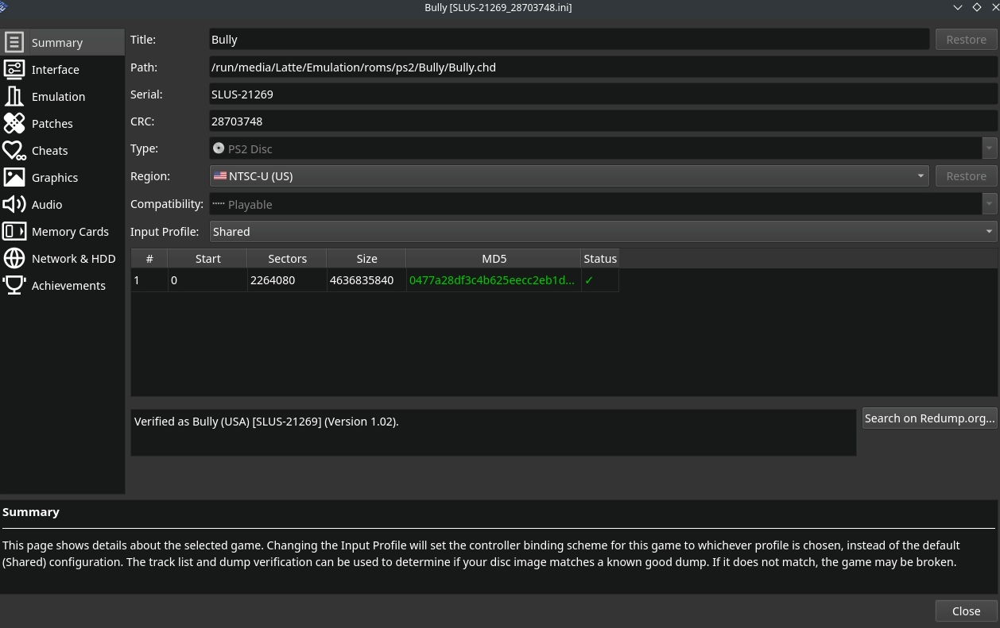
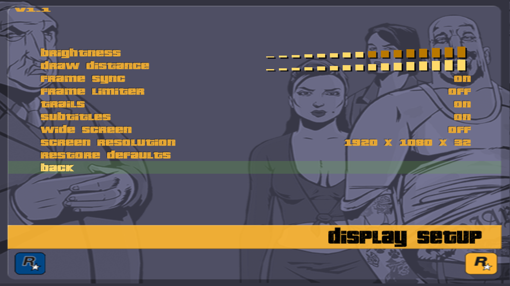
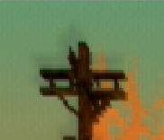

# PCSX2-QT is a Sony Playstation 2 emulator. 

Website: [https://pcsx2.net/](https://pcsx2.net/)

PCSX2-QT Releases: [https://pcsx2.net/downloads/#nightly-anchor](https://pcsx2.net/downloads/#nightly-anchor)

GitHub: [https://github.com/PCSX2](https://pcsx2.net/downloads/#nightly-anchor)

Compatibility List: [https://forums.pcsx2.net/Forum-Public-compatibility-list](https://pcsx2.net/downloads/#nightly-anchor)

PCSX2 Wiki: [https://wiki.pcsx2.net/Main_Page](https://wiki.pcsx2.net/Main_Page)

***

## PCSX2-QT Table of Contents

1. [Getting Started with PCSX2](#getting-started-with-pcsx2)
    - [Configuration](#pcsx2-configuration)
    - [PCSX2 Folder Locations](#pcsx2-folder-locations)
    - [How to Update PCSX2](#how-to-update-pcsx2)
    - [How to Launch PCSX2 in Desktop Mode](#how-to-launch-pcsx2-in-desktop-mode)
    - [File Formats](#pcsx2-file-formats)
    - [Hotkeys](#pcsx2-hotkeys)
2. [Common Issues](#common-issues)
    - [Controller isn't working?](#controller-isnt-working)
    - [Black screen immediately or just after the game boots?](#black-screen-immediately-or-just-after-the-game-boots)
    - [After starting a game it goes back to Steam or EmulationStation-DE?](#after-starting-a-game-it-goes-back-to-steam-or-emulationstation-de)
    - [Why do some of my multi-disc games not show up in Steam ROM Manager?](#why-do-some-of-my-multi-disc-games-not-show-up-in-steam-rom-manager)
3. [PCSX2 Tips and Tricks](#pcsx2-tips-and-tricks)
    - [How to Verify ROMs](#how-to-verify-roms)
    - [How to Optimize Performance (Power Tools)](#how-to-optimize-performance-power-tools)
    - [How to Optimize Storage (Compression Tool)](#how-to-optimize-storage-compression-tool)
    - [How to Configure Multiplayer](#how-to-configure-multiplayer)
    - [How to Manage Multiple Discs](#how-to-manage-multiple-discs)
    - [How to Switch to Folder Memory Cards](#how-to-switch-to-folder-memory-cards)
    - [How to Use Cheats](#how-to-use-cheats)
    - [How to Use Widescreen or No Interlace Cheats](#how-to-use-widescreen-or-no-interlace-cheats)
    - [How to Set Game Settings On a Per-Game Basis](#how-to-set-game-settings-on-a-per-game-basis)
    - [How to Install Custom Textures](#how-to-install-custom-textures)
    - [How to Mod Persona 3 FES](#how-to-mod-persona-3-fes)
    - [How to Roll Back PCSX2 to an Older Version](#how-to-roll-back-pcsx2-to-an-older-version)
    - [How to Configure Language Settings](#how-to-configure-language-settings)
    - [How to Configure Pressure Sensitive Buttons](#how-to-configure-pressure-sensitive-buttons)
    - [How to Configure Online Multiplayer](#how-to-configure-online-multiplayer)
    - [How to Set Up mymc](../../community-creations/steamos/tools-and-guides.md#how-to-set-up-mymc)
4. [Custom Game Settings](#custom-game-settings)
    - [Grand Theft Auto III "Ghosting"](#grand-theft-auto-iii-ghosting)
    - [Grand Theft Auto: San Andreas "Ghosting"](#grand-theft-auto-san-andreas-ghosting)


***

### Getting Started with PCSX2
[Back to the Top](#pcsx2-qt-table-of-contents) 

PCSX2 is a fairly straight-forward emulator to set up. Place your ROMs in `Emulation/roms/ps2`. Place your BIOS directly in `Emulation/bios`. Read the [Configuration](#pcsx2-configuration) section to learn more about PCSX2 and its folder locations. 

To launch your ROMs in game mode, use Steam ROM Manager and use one of the following parsers to play your PS2 ROMs:

* `EmulationStation-DE`
* `Sony PlayStation 2 - PCSX2` 
* `Emulators`


***

### PCSX2 Configuration
[Back to the Top](#pcsx2-qt-table-of-contents) 

* Type of Emulator: AppImage
* Executable Location: `/home/deck/Applications/pcsx2-Qt.AppImage`
* Config Location: `/home/deck/.config/PCSX2`
    * Contains the following folders: 
        * `cheats`
        * `gamesettings`
        * `inis`
        * `inputprofiles`
        * `logs`
        * **Note:** If the `cheats_ni` and `cheats_ws` folder are here, do not use these folders. PCSX2 will not recognize any files placed in these folders
* Storage Location: `Emulation/storage/PCSX2`
    * Contains the following folders: 
        * `cache`
        * `covers`
        * `snaps`
        * `textures`
* ROM Location: `Emulation/roms/ps2/`
* BIOS Location: `Emulation/bios/`  
    * **IMPORTANT:** Files go directly in this folder. Do not make or use a `PS2`, `PCSX2`, or any sort of folder here. PCSX2 will not be able to find your bios files if they are in a folder. 
    * Required BIOS  - SEE: [https://pcsx2.net/docs/usage/setup/#how-to-dump-your-ps2-bios](https://pcsx2.net/docs/usage/setup/#how-to-dump-your-ps2-bios)
* Saves: `Emulation/saves/pcsx2/saves`
* Save States `Emulation/saves/pcsx2/states`

**Note:** `~/.config` is an invisible folder by default. In Dolphin (file manager), click the hamburger menu in the top right, click `Show Hidden Files` to see these folders.  

**Important Info:** Prior to version 0.17.6 of EmuDeck, we used the Flatpak version of PCSX2. This was installed from the discover store. We have since moved away from this release for performance reasons, and usability reasons (menus not opening).

#### Works With
* Steam ROM Manager
* EmulationStation-DE

***

### PCSX2 Folder Locations
[Back to the Top](#pcsx2-qt-table-of-contents) 

These file locations apply regardless of where you chose to install EmuDeck (to your internal SSD, to your SD Card, or elsewhere). Some emulator configuration files will be located on the internal SSD as listed below. 

`$HOME` refers to your home folder. If you are on a Steam Deck, this folder will be named `/home/deck` (you will likely not see `deck` in the file path when navigating using the file manager). 

Paths beginning with `Emulation/..` correspond to your EmuDeck install location. If you installed on an SD Card, your path may be `/run/media/mmcblk0p1/Emulation/roms/..`. If you installed on your internal SSD, your path may be `/home/deck/Emulation/roms/..`

**Note:** Folders with a `.` (`.var`, `.local`, `.config`, etc.) at the beginning are hidden by default. In Dolphin (file manager), click the hamburger menu in the top right, click `Show Hidden Files` to see these folders.

`$HOME/.config/PCSX2`

```
PCSX2
├── cheats
├── gamesettings
├── inis
│   └── PCSX2.ini
├── inputprofiles
├── logs
├── memcards
├── patches
├── sstates
└── videos
```

`Emulation/storage/pcsx2`

```
pcsx2/
├── cache
├── covers
├── snaps
└── textures
```

***

### How to Update PCSX2
[Back to the Top](#pcsx2-qt-table-of-contents) 

**How to Update PCSX2**

* Through the `Update your Emulators & Tools` section on the `Manage Emulators` page in the `EmuDeck` application
* Manual file replacement of `pcsx2-Qt.AppImage` 
    * Refer to [How to Swap Out AppImages and Binaries](../../file-management/steamos/file-management.md#how-to-swap-out-appimages-and-binaries) for instructions

***

### How to Launch PCSX2 in Desktop Mode
[Back to the Top](#pcsx2-qt-table-of-contents) 

**How to Launch PCSX2 in Desktop Mode**

* Launch `PCSX2-QT AppImage` from the Applications Launcher (Steam Deck icon in the bottom left of the taskbar)
* Launch the script from `Emulation/tools/launchers`, `pcsx2-Qt.sh`
* Launch the AppImage in `/home/deck/Applications/pcsx2-Qt.AppImage`
* Launch the emulator from `Steam` after adding it via the `Emulators` parser in `Steam ROM Manager`


***

### PCSX2 File Formats
[Back to the Top](#pcsx2-qt-table-of-contents) 

* .iso 
* .bin 
* .chd

***

### PCSX2 Hotkeys
[Back to the Top](#pcsx2-qt-table-of-contents) 

{{ read_csv('pcsx2-hotkeys.csv') }}


**Note:** 

* [Steam Deck Button Layout](../../controls-and-hotkeys/steamos/hotkeys.md#steam-deck-button-layout)
***

## Common Issues
[Back to the Top](#pcsx2-qt-table-of-contents) 

***

### Controller isn't working?
[Back to the Top](#pcsx2-qt-table-of-contents) 

Try turning off multitap. Certain games may not handle it.

1. Open PCSX2-QT
2. Open the `Controllers` settings menu
3. Disable Multitap


***

### Black screen immediately or just after the game boots?
[Back to the Top](#pcsx2-qt-table-of-contents) 

This indicates a bad dump. Please validate and redump your game files.

[How to validate your ROMs](../../frequently-asked-questions/steamos/index.md#how-to-verify-a-rom-is-valid)

***

### After starting a game it goes back to Steam or EmulationStation-DE?
[Back to the Top](#pcsx2-qt-table-of-contents) 

This usually means you haven't placed your bios in the right place.

Where to place your BIOS: [Configuration](#pcsx2-configuration)

***

### Why do some of my multi-disc games not show up in Steam ROM Manager?
[Back to the Top](#pcsx2-qt-table-of-contents) 

Primarily with the Playstation 2 parser, turning on `Remove (...) and [...] brackets` will trim the ROM name and cause Steam ROM Manager to deem multiple discs of the same game as the same file. When you generate an app list, only one of your discs will show up. 

To fix this, do one of the following solutions:
* Remove the () in the file name
    * Open the respective folder with the ROMs, and rename each disc to remove the ()
    * Example: 
        * Original File Name: `Xenosaga: Episode 2 (Disc 1)` and `Xenosaga: Episode 2 (Disc 2)`
        * Updated File Name: `Xenosaga: Episode 2 Disc 1` and `Xenosaga: Episode 2 Disc 2`
* Turn off `Remove (...) and [...] brackets` in the respective parser
    * Visual Reference (Using Playstation 2 as an example):  
    * **Note:** With this setting off, Steam ROM Manager will include any content in the parantheses of the file name when parsing ROMs. This means that if you include region names or any other information in parantheses, your ROM will include this information in a generated app list

***


## PCSX2 Tips and Tricks
[Back to the Top](#pcsx2-qt-table-of-contents) 

***

### How to Verify ROMs
[Back to the Top](#pcsx2-qt-table-of-contents) 

If you have a ROM that is not launching, you can verify your ROM directly in PCSX2. Verifying your ROM confirms whether you have a good dump or a bad dump. If you have a bad dump, your issue may be that your ROM either transferred incorrectly or that you have a bad dump. 

If your ROM transferred incorrectly, see [How to Transfer Files to a Steam Deck](../../file-management/steamos/file-management.md#how-to-transfer-files-to-a-steam-deck) for a few methods. 

If you have a bad dump, you will need to re-dump your PlayStation 2 ROM, following PCSX2's guide. For the dumping guide, see [https://pcsx2.net/docs/usage/setup/#dumping-ps2-discs-via-imgburn](https://pcsx2.net/docs/usage/setup/#dumping-ps2-discs-via-imgburn). 

If you have a good dump, your issue lies elsewhere. Make sure you have PlayStation 2 BIOS directly in the `Emulation/bios` folder and make sure PCSX2 is up to date. If neither of these resolve your issue, make sure to either check Google or retrieve a PCSX2 log so you can share it with the PCSX2 team. 

#### How to Verify ROMs

**Note:** Make sure PCSX2 is up to date first. Verifying ROMs directly in PCSX2 is a fairly new feature. 

1. Open PCSX2
2. If you are in Big Picture mode:
    * Press the square icon in the top right
    * Click `View` at the top 
    * Click `Game List`
3. Right click a game
4. Click `Properties`
5. On the `Summary` tab, click `Verify` on the right of the screen and wait a few moments
6. After a few moments, you will see either a green checkmark or an x in addition to a message indicating if your ROM was verified
    * 

***

### How to Optimize Performance (Power Tools)
[Back to the Top](#pcsx2-qt-table-of-contents) 

Visit [Power Tools](../../emudeck-application/steamos/emudeck-application-101.md#power-tools) to learn how to optimize performance using Power Tools. 

***


### How to Optimize Storage (Compression Tool)
[Back to the Top](#pcsx2-qt-table-of-contents) 

To optimize storage, you can use the `EmuDeck Compressor` within EmuDeck.  

The `EmuDeck Compressor` will compress your Playstation 2 ROMs from ISO or BIN/CUE to CHD. If your ROM is a BIN/CUE, the Compression Tool will only compress it if you have both the BIN and the CUE files for a ROM. If the ROM is in a zip file or is missing a paired BIN or CUE file, the Compression Tool will not detect the ROM. 

After running the `EmuDeck Compression Tool`, re-run Steam ROM Manager to update your ROM shortcuts to the newly compressed ROM. 

**Visual Reference:** 

***

### How to Configure Multiplayer
[Back to the Top](#pcsx2-qt-table-of-contents) 

Multiplayer for PCSX2 is configured out of the box, no additional configuration is needed. 

You may need to re-arrange the controller order in Game Mode for your controllers to function as expected. See [How to Re-Arrange the Controller Order](../../controls-and-hotkeys/steamos/external-controllers.md#how-to-re-arrange-the-controller-order) for more information.


***

### How to Manage Multiple Discs
[Back to the Top](#pcsx2-qt-table-of-contents) 

PCSX2 does not support M3U files. 

You can manage multiple discs two ways:

#### Method 1: Hotkeys

1. While in game, when you are ready to switch discs, press `Start` + `L3` at the same time
2. Select `Change Disc` and select your next disc

#### Method 2: Separate Game Entries

1. When you are ready to switch discs, save and exit out of your game
2. Open the next disc entry, either as a separate shortcut through Steam ROM Manager or a separate entry through EmulationStation-DE

***

### How to Switch to Folder Memory Cards
[Back to the Top](#pcsx2-qt-table-of-contents) 

By default PCSX2 stores each memory card as a single file. This doesn't have any compatibility problems, but means that once you hit the 8MB limit you'll have to start manually swapping cards. You can get around this by converting to folders for your memory cards:

1. Open PCSX2
2. Settings menu > Memory cards
3. Eject the memory cards you wish to convert, by clicking the appropriate eject icons near the top of the window
4. Right click each card to convert, and select "Convert"
5. Ensure the conversion type dropdown is set to "Folder" and click OK
    1. This process will create a new folder that is a copy of the original memory card file. The file will be left intact as a backup.
6. Right click the newly converted memory card folder, and select Use for slot 1/Use for slot 2 as appropriate
7. At the bottom of the window, ensure "Automatically manage saves based on running game" is checked

PCSX2 will now give each game it's own separate memory card automatically.

***

### How to Use Cheats
[Back to the Top](#pcsx2-qt-table-of-contents) 

**Important**

Individual Widescreen and "No Interlace" cheats are no longer supported. These are now officially bundled with PCSX2 and can be enabled in the per-game settings menu. For a tutorial on how to use these in PCSX2, read [How to use Widescreen or No Interlace Cheats](#how-to-use-widescreen-or-no-interlace-cheats). 

For more detail, read [https://forums.pcsx2.net/Thread-Sticky-Important-Patching-Notes-1-7-4546-Pnach-2-0](https://forums.pcsx2.net/Thread-Sticky-Important-Patching-Notes-1-7-4546-Pnach-2-0)

**Note:** This change means that the `cheats_ni` and `cheats_ws` are no longer used by PCSX2. Do not use these folders. PCSX2 will not recognize any files placed in these folders.

**Cheat Resources**

_This list is not comprehensive_

* [https://forums.pcsx2.net/Thread-Post-your-PCSX2-cheats-patches-here](https://forums.pcsx2.net/Thread-Post-your-PCSX2-cheats-patches-here)
* [https://gamehacking.org/system/ps2](https://gamehacking.org/system/ps2)
* [https://forums.pcsx2.net/Thread-Fixing-unplayable-games](https://forums.pcsx2.net/Thread-Fixing-unplayable-games)

You can find more information about PCSX2 cheats here: [https://wiki.pcsx2.net/Game_cheats](https://wiki.pcsx2.net/Game_cheats). 

**Tutorial**

#### Information on Cheats

Cheat files have a `.pnach` file extension. Sometimes websites will provide the raw content of a cheats file. You can copy and paste these contents into a text file, and save the file as `CRC-descriptivename.pnach`.  

The website will usually provide the crc as an 8 character long alphanumerical string. Replace the `CRC` with the alphanumerical string and replace the descriptive name with the function of the cheat.

For example, a `Controllable Party Members` cheat for Persona 3 FES could be named: `94A82AAA-Controllable Party Members.pnach`

#### Preparing the Cheat File

This section goes over identifying and creating headers for your cheats. Creating headers is not necessary to do but allows for easier cheat management in PCSX2. Headers allow you to toggle cheats on a per-cheat basis and allow you to identify your various cheats directly in PCSX2's GUI. 

If you would simply like to add the cheat to PCSX2 without adding headers, skip to [How to Use the Cheat File](#how-to-use-the-cheat-file).

1. Download the cheat file
2. Open it in a text editor of your choice
3. Check to see if the cheat file has headers at the top of each cheat bundled in the file. 
    * The header is typically the name of the cheat in `[]` with an optional description or author
        * For example: 
            
                [Controllable Party Members]
                author=TGE
                description=This cheat allows you to control your party members in Persona 3 FES

4. If the cheat file does not have headers, you can manually add them
    * The header is not required but allows you to toggle cheats on a per cheat basis in PCSX2
    * **Note:** If a cheat file has multiple sections **for the same cheat**, you can choose to add one header at the top of the file. This header will treat the cheat file as one cheat in PCSX2
    * You can now split cheats out into multiple files
        * Use the format: `CRC-descriptivename.pnach`
    * To add headers, use the following format, note that the author and description fields are optional:

            [NAMEOFCHEAT]
            author=NAMEOFAUTHOR
            description=DESCRIPTIONOFCHEAT


For an example of a full cheat file with a header: [https://gist.githubusercontent.com/rawdatafeel/4ac815f27ace770a84fe1ad7937355c7/raw/ddcacfaf9a0ebf930d27f95c86507cd89e2db704/94A82AAA-Controllable%2520Party%2520Members.pnach](https://gist.githubusercontent.com/rawdatafeel/4ac815f27ace770a84fe1ad7937355c7/raw/ddcacfaf9a0ebf930d27f95c86507cd89e2db704/94A82AAA-Controllable%2520Party%2520Members.pnach)


#### How to Use the Cheat File

1. Place your cheat file, with a `.pnach` file extension in `/home/deck/.config/PCSX2/cheats`
    * `~/.config` is an invisible folder by default. In Dolphin (file manager), click the hamburger menu in the top right, click `Show Hidden Files` to see these folders
2. Open PCSX2-QT
3. Click the fullscreen button in the top right
4. Right click a game, click `Properties`

#### If you are using the Big Picture GUI:

1. Click the frowny face
2. Toggle the `Enable Cheats` button
3. Toggle the cheats you would like to use
    * 
4. Repeat as needed


#### If you are using the Desktop GUI:

1. Click `Cheats` on the left
2. Check `Enable Cheats` at the top
3. Toggle the cheats you would like to use
    * 
4. Repeat as needed

***

### How to Use Widescreen or No Interlace Cheats
[Back to the Top](#pcsx2-qt-table-of-contents) 

**Important**

Individual Widescreen and "No Interlace" cheats are no longer supported. These are now officially bundled with PCSX2 and can be enabled in the per-game settings menu. This section will go over how to apply the included cheats. 

For more detail, read [https://forums.pcsx2.net/Thread-Sticky-Important-Patching-Notes-1-7-4546-Pnach-2-0](https://forums.pcsx2.net/Thread-Sticky-Important-Patching-Notes-1-7-4546-Pnach-2-0)

**Tutorial**

1. In Desktop Mode, open PCSX2
2. Click the fullscreen button in the top right
3. Click `View` at the top, click `Game List`
4. Right click a game, click `Properties`
5. Click `Patches` on the left, and check the `Enabled` box for the respective cheats you would like to enable
    * 

***

### How to Set Game Settings On a Per-Game Basis
[Back to the Top](#pcsx2-qt-table-of-contents) 

1. In either Desktop or Game Mode, open PCSX2
2. (Optional) Exit out of PCSX2's big picture mode by clicking the square box in the top right
    * 
3. Right click a game
    * In Game Mode, hold `Steam` and click `L2` to right click 
4. Click `Properties`
    * 
5. Select your settings, any settings changed in this menu will only be applied for this specific game

***

### How to Install Custom Textures
[Back to the Top](#pcsx2-qt-table-of-contents) 

**Texture Pack Sources**

_This list is not exhaustive_

* [https://gbatemp.net/threads/list-of-hd-texture-packs-by-panda_venom.620163/](https://gbatemp.net/threads/list-of-hd-texture-packs-by-panda_venom.620163/)

***

**How to Use Custom Textures Packs**

1. Download a texture pack
2. Place it here:`Emulation/storage/pcsx2/textures/GAMEID/replacements`
    * The `GAMEID` will be unique to your game 
    * Typically a texture pack download will come in this format: `GAMEID/replacements`
    * If the texture pack does not come in the standard format, you can locate the `GAMEID` by doing the following:
        * Open PCSX2
        * Right click the game
        * Click `Properties`
        * The `GAMEID` will be in the `Serial` box
   * 
3. Open PCSX2
4. Right click the game
5. Click `Game Properties`
6. Click `Graphic Settings`
    * 
7. Scroll down to `Texture Replacements` and toggle `Load Textures`
    * Optionally, toggle `Asynchronous Texture Loading`
    * 
8. Your game will now be using the custom texture pack
  
*** 

### How to Mod Persona 3 FES
[Back to the Top](#pcsx2-qt-table-of-contents) 

**Prerequisites**

* Persona 3 FES ISO

#### Aemulus Mod Manager

1. Download Aemulus Mod Manager: [https://github.com/TekkaGB/AemulusModManager/releases](https://github.com/TekkaGB/AemulusModManager/releases)
    * For instructions on how to run Aemulus Mod Manager through Wine, see [How to Set Up Aemulus Package Manager](../../community-creations/steamos/tools-and-guides.md#how-to-set-up-aemulus-package-manager)
        * Aemelus Package Manager through Wine is a little finicky so you may prefer to set it up on a Windows PC instead and transfer over a completed mod loadout
2. Build a mod loadout: [https://persona-3-fes-modding-guide.readthedocs.io/en/latest/installingmods.html](https://persona-3-fes-modding-guide.readthedocs.io/en/latest/installingmods.html)
    * This guide will not go into detail on how to do this
3. Your mod loadout will look similar to the below image: 
    * 
4. Proceed to the next section

#### On the Steam Deck

1. In `Emulation/roms/ps2`, create a `P3FES` folder
    * This is a recommendation, you may either use a different folder name or place the files directly into `Emulation/roms/ps2`
2. Place your Persona 3 FES ISO in the `P3FES` folder
3. Right click your Persona 3 FES ISO and click `Open with Ark`
    * 
4. Extract these files to `Emulation/roms/ps2/P3FES`
5. Delete all of the extracted files except `SLUS_216.21`
6. Rename `SLUS_216.21` to `Shin Megami Tensei - Persona 3 FES - Modded.ELF`
    * The important part here is the file extension. You may rename the file to whatever you would like, but for the sake of differentiating the ELF and the base game in Steam ROM Manager, this section adds a ` - Modded` to the end of the file name

#### Setting up the Mod Folders on the Steam Deck

1. Move your mod folders to the extracted Persona 3 FES Extracted ISO Folder, `Emulation/roms/ps2/P3FES`
    * 

#### Setting up PCSX2

1. In Desktop Mode, Open PCSX2
2. Right click `SLUS_216.21` in the game list, click `Properties`
3. Enable `Cheats` and `Host Filesystem`
    * 
4. On the `Disc Path` field, select your Persona 3 FES ISO
    * 

#### Setting up Cheats

1. Download the attached cheat file
    * **Download:** [94A82AAA.HostFS.pnach](../../configuration-files/94A82AAA.HostFS.pnach){:94A82AAA.HostFS.pnach"}
2. Place the cheat file in `/home/deck/.config/PCSX2/cheats/`
    * `~/.config` is an invisible folder by default. In Dolphin (file manager), click the hamburger menu in the top right, click `Show Hidden Files` to see these folders
3. Right click `Shin Megami Tensei - Persona 3 FES - Modded` in the game list, click `Properties`
4. Click the `Cheats` tab and enable `Cheats`
5. Enable the following cheat: `hostFS Patch`
    * If you are in the Big Picture GUI, the cheats icon is a frowny face 

#### Setting up Steam ROM Manager

If you would like to launch Persona 3 FES directly in Game Mode, follow the below steps. You may also choose to open PCSX2 in Game Mode and open the `Shin Megami Tensei - Persona 3 FES - Modded.ELF` from the PCSX2 GUI instead. 

1. In Desktop Mode, open Steam ROM Manager
2. Select the PCSX2 parser on the left and add `|.ELF` to the end of the `User's glob` box. Click `Save` in the bottom left
    * You may need to change themes to `Deck` or `Classic` first in the `Settings` tab
    * 
3. Turn on the PCSX2 parser and parse your games
4. You will see a large amount of seemingly junk entries from your mod folder, this is expected behavior. You can identify what each entry is by hovering over the text in the top left
    * 
5. Click the `Exclude` button at the bottom
6. Select all of the entries generated from your mod folder as well as the Persona 3 FES entry and click `Save` in the top right
    * **Do not** exclude `Shin Megami Tensei - Persona 3 FES - Modded.ELF`
7. If `Shin Megami Tensei - Persona 3 FES - Modded.ELF` does not match properly, read Steps 8-10. If it matches properly, skip to Step 11 
8. On the `Shin Megami Tensei - Persona 3 FES - Modded.ELF` entry, click the magnifying glass in the bottom left 
9. Search for `Persona 3 FES` in the search box, select it, and click `Save and close`
    * 
10. Click `Save to Steam`
11. You can now launch a modded version of Persona 3 FES directly in `Game Mode`

#### Popular Mods

* [Direct Commands](https://gamebanana.com/mods/426860)
    * Successor to the `Party Controls` cheat 

*** 

### How to Roll Back PCSX2 to an Older Version
[Back to the Top](#pcsx2-qt-table-of-contents) 

#### Preface

Your ROMs launch using a script created by EmuDeck, `pcsx2-Qt.sh` in `Emulation/tools/launchers`.

The script launches the corresponding emulator in `/home/deck/Applications` and **specifically looks** for two traits:

* The most recently downloaded version of the emulator in `/home/deck/Applications`, based on the file/release date.
* The emulator name at the beginning of the file. Anything after the emulator name is ignored. 
    * For example, if the latest version of the emulator is `1351` and you would like to downgrade to `1349`. When you download version `1349`, you could rename it to `EMULATORNAME-1349.AppImage`, and EmuDeck's script will ignore the `-1349` in the file name, allowing you to record which versions of the emulator you are using through the file name. 

#### How to Roll Back PCSX2

1. Download the version of the emulator you would like to use from PCSX2's website: [https://pcsx2.net/downloads/#nightly-anchor](https://pcsx2.net/downloads/#nightly-anchor) or GitHub: [https://github.com/PCSX2/pcsx2/releases](https://github.com/PCSX2/pcsx2/releases)
2. Move the downloaded emulator from Step 1 to `/home/deck/Applications`
3. (Optional) Rename or delete the original emulator file
4. Right click the newly downloaded emulator, click `Properties`, click `Permissions`, check `Is executable`
5. Your games will now launch using the version of the emulator you downloaded

***

### How to Configure Language Settings
[Back to the Top](#pcsx2-qt-table-of-contents) 

#### UI

1. In Desktop Mode, open PCSX2
2. At the top, click `Settings`, click `Interface`
3. Click the `Interface` tab
4. To the right of `Language`, select your preferred language in the drop-down menu

#### In-Game

1. In Desktop Mode, open PCSX2
2. At the top, click `Settings`, click `BIOS`
3. Uncheck `Fast Boot` under `Options and Patches`
4. Close out of the `BIOS` settings
5. At the top, click `System`
6. Click `Start BIOS`
7. Select `System Configuration`
8. Scroll down to `Language`
9. Select your preferred language

***

### How to Configure Pressure Sensitive Buttons
[Back to the Top](#pcsx2-qt-table-of-contents) 

The `S` button on the keyboard is bound out of the box as a pressure modifier. To apply it to your PCSX2 games, you will need to use Steam Input.

#### Steam Input

1. In Game Mode, select your ROM shortcut, the PCSX2 shortcut, or EmulationStation-DE
2. Click the Controller icon
3. Map your preferred button(s) to the `S` keyboard key
    * One method is to use any of the back bumpers. 
4. While in game, press the button you mapped to the `S` keyboard key

#### PCSX2

The default pressure modifier is set at 30%. If you would like to adjust this setting, you may do so directly in PCSX2's settings.

1. In Desktop Mode, open PCSX2
    * [How to Launch PCSX2 in Desktop Mode](#how-to-launch-pcsx2-in-desktop-mode)
2. If you are in Big Picture mode, press the square icon in the top right to exit out of Big Picture mode
3. At the top, click `Settings`, `Controllers`
4. On the left-hand side of the screen, click `Controller Port 1`
5. At tthe top, to the right of `Dualshock 2`, click `Settings`
6. Scroll down to `Modifier Pressure` and adjust the pressure setting to your liking
    * If you are in Desktop Mode, press `X` on the Steam Deck to open the keyboard
7. When you are finished, click `Close` and your set `Modifier Pressure` will be automatically applied the next time you open your game

!!! example 

    As an example, in Silent Hill 2, when clicking the right trigger (R2) and either L5 or R5 (the buttons bound to the keyboard key, S, in this example) together while using the A button, the attacks will be light. Release L5 or R5, but hold R2 and click A to attack as normal.

***

### How to Configure Online Multiplayer
[Back to the Top](#pcsx2-qt-table-of-contents) 

PCSX2 Servers:

* [https://docs.google.com/spreadsheets/d/1k4kJcJLkANysILr5jpmB08Px-08CIFGYvNsiwoHuCWw/edit#gid=0](https://docs.google.com/spreadsheets/d/1k4kJcJLkANysILr5jpmB08Px-08CIFGYvNsiwoHuCWw/edit#gid=0)
* [https://ps2online.com/](https://ps2online.com/)

1. In Desktop Mode, open Konsole or a terminal of your choice, enter the following commands one at a time:
    * `sudo groupadd netdev`
    * `sudo usermod -a -G netdev deck`
2. In `/home/deck/Applications`, right click anywhere, click `Open Terminal Here`
3. Type the following and press enter: 
    * `./pcsx2-Qt.AppImage --appimage-extract`
4. A `squashfs-root` folder in `/home/deck/Applications` will be created, rename this folder to `pcsx2-online` or a name of your choice
5. In `/home/deck/Applications/pcsx2-online/usr/bin`, double click `pcsx2-qt` to open it
    * Use this file whenever you want to play online mulitplayer. Your shortcuts through Steam ROM Manager, ES-DE, or Pegasus will be using a separate version of PCSX2 **not configured** for online multiplayer
    * You may add this version of `pcsx2-qt` to Steam by right clicking it and clicking `Add to Steam`, you may want to give it a distinctive name in Steam so you do not mix it up with your other shortcuts
6. Click `Settings`, `Network & HDD`, check the `Enabled` box under `Ethernet`
    * Ethernet Device Type
        * Select `PCAP Bridged`, `PCAP Switched`, or `Socket`, depending on what game you are playing 
    * Ethernet Device
        * `Any` if using `PCAP Bridged` or `PCAP Switched`
        * `Auto` if using `Socket`
    * Intercept DHCP
        * Leave unchecked
            * If you would like to manually tweak settings, check `Intercept DHCP` and adjust settings as needed
    * DNS1 Address and DNS2 Address
        * Match the addresses to the spreadsheet, [https://docs.google.com/spreadsheets/d/1k4kJcJLkANysILr5jpmB08Px-08CIFGYvNsiwoHuCWw/edit#gid=1383772811](https://docs.google.com/spreadsheets/d/1k4kJcJLkANysILr5jpmB08Px-08CIFGYvNsiwoHuCWw/edit#gid=1383772811)
        * For example, if using the `Cristian` server, type `45.7.228.197` into `DNS1 Address` and `0.0.0.0` into `DNS2 Address`
    * Hard Disk Drive
        * Check the `Enabled` box
        * Click `Create Image` in the bottom right corner
    * HDD File
        * `/home/deck/.config/PCSX2/inis/DEV9hdd.raw`
7. While in game, open the `Networking` settings and use the below spreadsheet or website for the DNS settings 
    * [https://docs.google.com/spreadsheets/d/1k4kJcJLkANysILr5jpmB08Px-08CIFGYvNsiwoHuCWw/edit#gid=1383772811](https://docs.google.com/spreadsheets/d/1k4kJcJLkANysILr5jpmB08Px-08CIFGYvNsiwoHuCWw/edit#gid=1383772811)
    * [https://ps2online.com/](https://ps2online.com/)
8. Online multiplayer will now be configured for your game(s)

!!! warning

    If you get a DNAS error when connecting, you will need to apply a DNAS bypass patch to your game. You can find a DNAS Bypass PNACH in the "Emulator (PCSX2)" column on the ps2online.com spreadsheet: [https://docs.google.com/spreadsheets/d/1k4kJcJLkANysILr5jpmB08Px-08CIFGYvNsiwoHuCWw/edit#gid=1383772811](https://docs.google.com/spreadsheets/d/1k4kJcJLkANysILr5jpmB08Px-08CIFGYvNsiwoHuCWw/edit#gid=1383772811)

***

## Custom Game Settings
[Back to the Top](#pcsx2-qt-table-of-contents) 

***

### Grand Theft Auto III "Ghosting"
[Back to the Top](#pcsx2-qt-table-of-contents) 

While in game, open the settings menu and disable trails.



***

### Grand Theft Auto: San Andreas "Ghosting"
[Back to the Top](#pcsx2-qt-table-of-contents) 



The below quote is copied from the PCSX2 Discord.

!!! quote

    Grand Theft Auto: San Andreas - No, the "Ghosting" isn't a bug
    The screen is supposed to have a colored double image, it was an intentional design choice and still exists on native resolution. Upscaling makes it easier to notice but it is still correct.

    But I don't like it. Make it go away.
    Lucky for you, the community has made a patch and ported it to all (known) versions of the game. The patch is included in the latest PCSX2 nightly version.

#### How to Apply the Patch

1. In Desktop Mode, open PCSX2
2. Right click Grand Theft Auto: San Andreas, click `Properties`
3. Click the `Patches` tab
4. Enable the patch for removing the radiosity effect


***