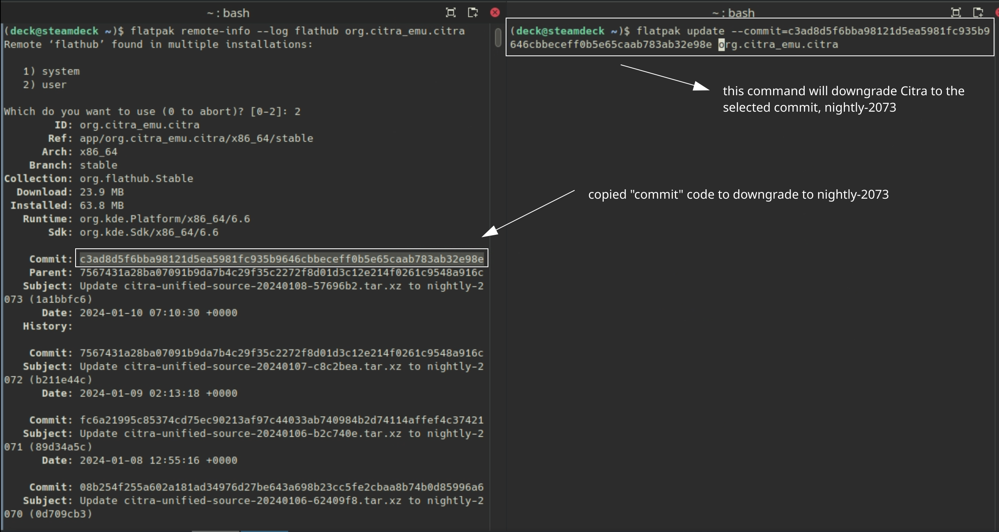

# PrimeHack is a fork of Dolphin (Gamecube and Wii Emulator), intended to modernize the Metroid Prime Trilogy.

***

Website: [https://forums.dolphin-emu.org/Thread-fork-primehack-fps-controls-and-more-for-metroid-prime](https://forums.dolphin-emu.org/Thread-fork-primehack-fps-controls-and-more-for-metroid-prime)

GitHub: [https://github.com/shiiion/metroid-prime-source-mod/releases/](https://github.com/shiiion/metroid-prime-source-mod/releases/)

PrimeHack Wiki: [https://github.com/shiiion/dolphin/wiki](https://github.com/shiiion/dolphin/wiki)

PrimeHack FAQ: [https://github.com/shiiion/dolphin/wiki/Frequently-Asked-Questions](https://github.com/shiiion/dolphin/wiki/Frequently-Asked-Questions)

***

## PrimeHack Table of Contents

1. [Getting Started with PrimeHack](#getting-started-with-primehack)
    - [Configuration](#primehack-configuration)
    - [PrimeHack Folder Locations](#primehack-folder-locations)
    - [How to Update PrimeHack](#how-to-update-primehack)
    - [How to Launch PrimeHack in Desktop Mode](#how-to-launch-primehack-in-desktop-mode)
    - [File Formats](#primehack-file-formats)
    - [Controls](#primehack-controls)
    - [Hotkeys](#primehack-hotkeys)

2. [PrimeHack Tips and Tricks](#primehack-tips-and-tricks)
    - [How to Optimize Performance (Power Tools)](#how-to-optimize-performance-power-tools)
    - [How to Optimize Storage (Compression Tool)](#how-to-optimize-storage-compression-tool)
    - [How to Install Custom Textures](#how-to-install-custom-textures)
    - [How to Configure PrimeHack to work with ES-DE](#how-to-configure-primehack-to-work-with-es-de)
    - [How to Roll Back PrimeHack to an Older Version](#how-to-roll-back-primehack-to-an-older-version)
    - [How to Configure Language Settings](#how-to-configure-language-settings)

***

## Getting Started with PrimeHack
[Back to the Top](#primehack-table-of-contents)

PrimeHack is a fairly straight-forward emulator to set up. Place your Metroid Prime Trilogy ROM in `Emulation/roms/primehack`. No additional setup is required. Read the [Configuration](#primehack-configuration) section to learn more about PrimeHack and its folder locations. **Note:** Controller configurations are not set up for the Metroid Prime games on the Gamecube. 

To launch your ROMs in game mode, use Steam ROM Manager and use one of the following parsers to play the Metroid Prime Trilogy:

* `ES-DE`
* `PrimeHack` 
* `Emulators`


***

### PrimeHack Configuration
[Back to the Top](#primehack-table-of-contents)

* Type of Emulator: Flatpak
* Config Location: `/home/deck/.var/app/io.github.shiiion.primehack`
* ROM Location: `Emulation/roms/primehacks`
* Saves:
  * Symlink: `Emulation/saves/primehack/Wii`
  * Target: `/home/deck/.var/app/io.github.shiiion.primehack/data/dolphin-emu/Wii`
* Save States:
  * Symlink: `Emulation/saves/primehack/Savestates`
  * Target: `/home/deck/.var/app/io.github.shiiion.primehack/data/dolphin-emu/StateSaves/`
* PrimeHack does not require any additional BIOS files to run

**Note:** 

* `~/.var` is an invisible folder by default. In Dolphin (file manager), click the hamburger menu in the top right, click `Show Hidden Files` to see these folders
* Only `Metroid Prime Trilogy` (Wii)'s controls are configured. The Gamecube versions do not have controls configured at this time

#### Works With
* Steam ROM Manager
* ES-DE

***

### PrimeHack Folder Locations
[Back to the Top](#primehack-table-of-contents)

These file locations apply regardless of where you chose to install EmuDeck (to your internal SSD, to your SD Card, or elsewhere). Some emulator configuration files will be located on the internal SSD as listed below. 

`$HOME` refers to your home folder. If you are on a Steam Deck, this folder will be named `/home/deck` (you will likely not see `deck` in the file path when navigating using the file manager). 

Paths beginning with `Emulation/..` correspond to your EmuDeck install location. If you installed on an SD Card, your path may be `/run/media/mmcblk0p1/Emulation/roms/..`. If you installed on your internal SSD, your path may be `/home/deck/Emulation/roms/..`

**Note:** Folders with a `.` (`.var`, `.local`, `.config`, etc.) at the beginning are hidden by default. In Dolphin (file manager), click the hamburger menu in the top right, click `Show Hidden Files` to see these folders.

`$HOME/.var/app/io.github.shiiion.primehack`

```
io.github.shiiion.primehack/
├── cache
│   ├── dolphin-emu
│   │   └── GameCovers
│   ├── fontconfig
│   ├── mesa_shader_cache
│   └── tmp
├── config
│   └── dolphin-emu
│       ├── GraphicMods
│       └── Profiles
│           └── Wiimote
└── data
    └── dolphin-emu
        ├── Dump
        │   ├── Audio
        │   ├── DSP
        │   ├── Frames
        │   ├── Objects
        │   ├── SSL
        │   └── Textures
        ├── GameSettings
        ├── GC
        │   ├── EUR
        │   ├── JAP
        │   └── USA
        ├── Load
        │   ├── GraphicMods
        │   ├── Riivolution
        │   ├── Textures
        │   │   └── R3M
        │   │       ├── 0EXTRA - Steam Deck Button Prompts
        │   │       │   ├── Common
        │   │       │   ├── MP1
        │   │       │   ├── MP2
        │   │       │   └── MP3
        │   │       └── 0EXTRA - Wiimote Warning Replacement
        │   └── WiiSDSync
        ├── Logs
        │   └── Mail
        ├── Maps
        ├── ResourcePacks
        ├── ScreenShots
        ├── Shaders
        │   └── Anaglyph
        ├── StateSaves
        ├── Styles
        ├── Themes
        └── Wii
            ├── import
            ├── meta
            ├── shared1
            ├── shared2
            │   └── sys
            ├── sys
            ├── ticket
            ├── title
            ├── tmp
            └── wfs
```

***

### How to Update PrimeHack
[Back to the Top](#primehack-table-of-contents)

**How to Update PrimeHack**

* Update through `Discover` (Shopping bag icon)
* Through the `Update your Emulators & Tools` section on the `Manage Emulators` page in the `EmuDeck` application


***

### How to Launch PrimeHack in Desktop Mode
[Back to the Top](#primehack-table-of-contents)

**How to Launch PrimeHack in Desktop Mode**

* Launch `Dolphin Emulator` (Metroid Prime Icon) from the Applications Launcher (Steam Deck icon in the bottom left of the taskbar)
  * Icon: 
* Launch the script from `Emulation/tools/launchers`, `primehack.sh`
* Launch the emulator from `Steam` after adding it via the `Emulators` parser in `Steam ROM Manager`


***

### PrimeHack File Formats
[Back to the Top](#primehack-table-of-contents)

* .ciso 
* .dol 
* .elf 
* .gcm 
* .gcz 
* .iso 
* .nkit 
* .iso 
* .rvz 
* .wad 
* .wia 
* .wbfs

***

### PrimeHack Controls
[Back to the Top](#primehack-table-of-contents)


{{ read_csv('primehack-controls.csv') }}


* When in the morph ball state, the `A` button becomes the `Spring Ball` button
* EmuDeck includes a texture pack that matches Metroid Prime's button prompts to the buttons in the above chart. 
* The Steam Input profile for PrimeHack is: `Gamepad with Joystick Trackpad`. Community Layouts conflict with EmuDeck's pre-configured controls. 
* Only `Metroid Prime Trilogy` (Wii)'s controls are configured. The Gamecube versions do not have controls configured at this time.

***

### PrimeHack Hotkeys
[Back to the Top](#primehack-table-of-contents)

**Important Note:** PrimeHack does not have a way of opening the menu if you are launching the game directly. It is recommended that you change any settings in the PrimeHack UI itself before launching a game. 

{{ read_csv('primehack-hotkeys.csv') }}


**Note:** 

* [Steam Deck Button Layout](../../controls-and-hotkeys/steamos/hotkeys.md#steam-deck-button-layout)

## PrimeHack Tips and Tricks
[Back to the Top](#primehack-table-of-contents)

***

### How to Optimize Performance (Power Tools)
[Back to the Top](#primehack-table-of-contents)

Visit [Power Tools](../../emudeck-application/steamos/emudeck-application-101.md#power-tools) to learn how to optimize performance using Power Tools. 

***

### How to Optimize Storage (Compression Tool)
[Back to the Top](#primehack-table-of-contents)

To optimize storage, you can use the `EmuDeck Compression Tool` in the `Tools & Stuff` menu within EmuDeck.  

The `EmuDeck Compression Tool` will compress your Metroid Prime Trilogy ROM from ISO to RVZ.

After running the `EmuDeck Compression Tool`, re-run Steam ROM Manager to update your ROM shortcuts to the newly compressed ROM. 

**Visual Reference:** 


***

### How to Install Custom Textures
[Back to the Top](#primehack-table-of-contents)

Here's how to install custom textures for PrimeHack: 

1. Open the PrimeHack emulator, click `Graphics` in the top right (or `Options` > `Graphic Settings`), click `Advanced`, make sure `Load Custom Textures` and `Prefetch Custom Textures` are checked. 
    * 
2. Open `/home/deck/.var/app/io.github.shiiion.primehack/data/dolphin-emu/Load/Textures`
    * `~/.var` is an invisible folder by default. In Dolphin (file manager), click the hamburger menu in the top right, click `Show Hidden Files` to see these folders. 
    * If the `Load` and `Textures` folder do not exist, create them.
    * Visual Reference: 
3. In the `Textures` folder from Step 2, create a folder named `R3M`. 
4. Put your texture files directly into this folder.
5. Your texture pack should now be installed. 
    * If the game crashes with custom textures, it is likely too demanding for the Steam Deck. You can turn off `Prefetch Custom Textures` as a workaround, but performance will still take a hit. 


***

### How to Configure PrimeHack to work with ES-DE
[Back to the Top](#primehack-table-of-contents)

You need to move your `Metroid Prime Trilogy` ROM to `Emulation/roms/wii` and choose an alternative emulator for the ROM in ES-DE.

For further instructions, refer to: [How to Select a Different Emulator on a Per Game Basis](../../tools/steamos/es-de.md#how-to-select-a-different-emulator-on-a-per-game-basis). 

***

### How to Roll Back PrimeHack to an Older Version
[Back to the Top](#primehack-table-of-contents)

If you do not have access to a mouse and keyboard for the below section, use `L2` to right click and `R2` to left click. Alternatively, remote into your Steam Deck using one of the methods found in the FAQ, [How do I remotely control my Steam Deck?](../../frequently-asked-questions/steamos/index.md#how-do-i-remotely-control-my-steam-deck).

1. In Desktop Mode, open `Konsole`
2. To see a list of prior versions of the emulator, type:
    * `flatpak remote-info --log flathub io.github.shiiion.primehack`
3. If Konsole prompts you to select `system` or `user`, enter `2` to select `user` 
4. Konsole will list a list of previous versions for the flatpak. The important line for each version is the `Commit: ` line. The `Commit: ` line will have a long accompanying alphanumeric string (the “commit” code). Copy the string for the version you want to downgrade to.
    * Using Citra as an example:
        * 
5. To downgrade to the version you want:
    * `flatpak update --commit=put_commit_code_here io.github.shiiion.primehack`
    * Replace `put_commit_code_here` with the actual code you located in Step 2. 
        * Using Citra as an example:
            * 

If the above steps did not work and you are getting an error message along the lines of `Flatpak not installed`, your Flatpak is likely installed at the system level instead. Select one of the below solutions:

Solution 1: Open the EmuDeck application, click the `Manage Emulators` page, select the emulator in question, and click `Reinstall / Update`.

Solution 2: Add `sudo` in front of the commands written in Step 2 and Step 5. In Step 2, write `sudo flatpak remote-info --log flathub io.github.shiiion.primehack` and in Step 5, write `sudo flatpak update --commit=put_commit_code_here io.github.shiiion.primehack`. 


***

### How to Configure Language Settings
[Back to the Top](#primehack-table-of-contents)

#### UI

1. In Desktop Mode, open PrimeHack
2. At the top, click `Options`, click `Configuration`
3. Click the `Interface` tab
4. Under `User Interface`, select your preferred language in the drop-down menu

#### In-Game

1. In Desktop Mode, open PrimeHack
2. Right click "Metroid Prime: Trilogy"
3. Click `Properties`
4. Click the `Game Config` tab
5. Click the `Editor` tab
6. In the box, type the following:

        [Wii]
        Language = 1

7. Replace the `0` with the language you would like to use:
    * 0 = Japanese
    * 1 = English
    * 2 = German
    * 3 = French
    * 4 = Spanish
    * 5 = Italian
    * 6 = Dutch
    * 7 = Simplified Chinese
    * 8 = Traditional Chinese
    * 9 = Korean

***