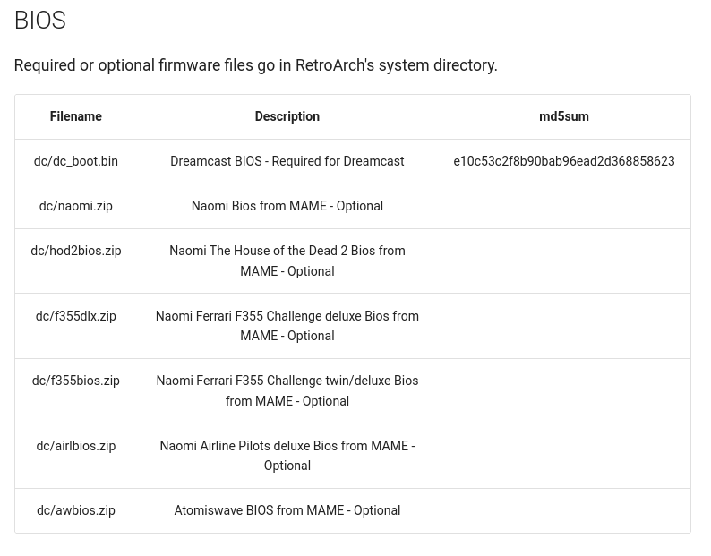
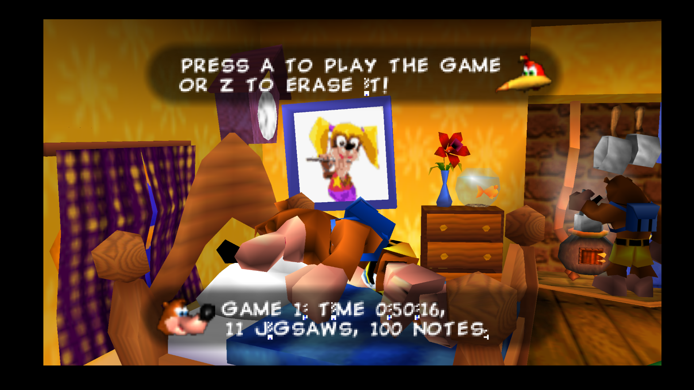

# RetroArch is an open source and cross platform frontend/framework for emulators.

Website: [https://www.retroarch.com/](https://www.retroarch.com/)

GitHub: [https://github.com/libretro/RetroArch](https://github.com/libretro/RetroArch)

RetroArch Wiki: [https://docs.libretro.com/](https://docs.libretro.com/)

RetroArch FAQ: [https://www.retroarch.com/?page=faq](https://docs.libretro.com/)

***

## RetroArch Table of Contents

1. [Getting Started with RetroArch](#getting-started-with-retroarch)
    - [Configuration](#retroarch-configuration)
    - [RetroArch Folder Locations](#retroarch-folder-locations)
    - [How to Update RetroArch And Its Cores](#how-to-update-retroarch-and-its-cores)
    - [How to Launch RetroArch in Desktop Mode](#how-to-launch-retroarch-in-desktop-mode)
    - [A Breakdown of Overrides](#a-breakdown-of-overrides)
    - [Hotkeys](#retroarch-hotkeys)
    - [List of RetroArch Cores Used by Emudeck](#list-of-retroarch-cores-used-by-emudeck)

2. [Common Issues](#common-issues)
    - [Banjo-Kazooie: Scrambled Text](#banjo-kazooie-scrambled-text)


3. [RetroArch Tips and Tricks](#retroarch-tips-and-tricks)
    - [How to Optimize Storage (Compression Tool)](#how-to-optimize-storage-compression-tool)   
    - [How to Manage Multiple Discs](#how-to-manage-multiple-discs)
    - [How to Configure Multiplayer](#how-to-configure-multiplayer)
    - [How to Change RetroArch Global Settings](#how-to-change-retroarch-global-settings)
    - [How to Change RetroArch Hotkeys](#how-to-change-retroarch-hotkeys)
    - [How to Change Shaders](#how-to-change-shaders)
        - [How to Download/Update Shaders](#how-to-downloadupdate-shaders)
        - [How to Apply New Shaders if Shaders Are Already Applied](#how-to-apply-new-shaders-if-shaders-are-already-applied)
        - [How to Apply Shaders if Shaders Are Not Already Applied](#how-to-apply-shaders-if-shaders-are-not-already-applied)
        - [Override Precedence](#override-precedence)
    - [How to Change Controller Layouts on a Per Game Basis](#how-to-change-controller-layouts-on-a-per-game-basis)
    - [How to Change Controller Layouts for a System](#how-to-change-controller-layouts-for-a-system)
    - [How to Set Game Settings On a Per-Game Basis](#how-to-set-game-settings-on-a-per-game-basis)
    - [How to Change Settings On a Per-Core Basis](#how-to-change-settings-on-a-per-core-basis)
    - [How to Roll Back RetroArch to an Older Version](#how-to-roll-back-retroarch-to-an-older-version)
    - [How to Configure Language Settings](#how-to-configure-language-settings)
    - [How to Create CUE files](../../file-management/steamos/file-management.md#how-to-create-cue-files)
    - [How to Set Up PKHeX](../../community-creations/steamos/tools-and-guides.md#how-to-set-up-pkhex)
    - [How to Install the Universal Pokemon Randomizer](../../community-creations/steamos/tools-and-guides.md#how-to-install-the-universal-pokemon-randomizer)
    - [How to Use ROM Hacks](../../community-creations/steamos/tools-and-guides.md#how-to-use-rom-hacks)


4. [RetroArch Cores](#retroarch-cores)
    * [Flycast](#flycast)
        * [How to Install Custom Textures For Flycast](#how-to-install-custom-textures-for-flycast)
    * [Fuse](#fuse)
        * [How to Configure Controls For Fuse](#how-to-configure-controls-for-fuse)
    * [MelonDS](#melonds)
        * [How to Use the Trackpad for the Touch Screen](#how-to-use-the-trackpad-for-the-touch-screen)
    * [Mupen64Plus-Next](#mupen64Plus-next)
        * [How to Install Custom Textures for Mupen64Plus-Next](#how-to-install-custom-textures-for-mupen64plus-next)
        * [How to Switch to the ParaLLEl-RDP Plugin](#how-to-switch-to-the-parallel-rdp-plugin)
    * [Neko Project II Kai](#neko-project-ii-kai)
        * [Configuring controls](#configuring-controls)
    * [PPSSPP RetroArch Core](#ppsspp-retroarch-core)
        * [How to Download Asset Files (Required)](#how-to-download-asset-files-required)
    * [PX68k](#px68k)
        * [Section 1](#section-1)
***

## Getting Started with RetroArch
[Back to the Top](#retroarch-table-of-contents)

***

### RetroArch Configuration
[Back to the Top](#retroarch-table-of-contents)

* Type of Emulator: Flatpak
* Config Location: `/home/deck/.var/app/org.libretro.RetroArch/config/retroarch`
* Storage Location: `Emulation/storage/retroarch`
* ROMs: Refer to the [Cheat Sheet](../../cheat-sheet.md)
* BIOS: Refer to the [Cheat Sheet](../../cheat-sheet.md)
* Saves:
    * Symlink: `Emulation/saves/retroarch/saves`
    * Target Location: `/home/deck/.var/app/org.libretro.RetroArch/config/retroarch/saves/`
* Save States:
    * Symlink: `Emulation/saves/retroarch/states`
    * Target Location: `/home/deck/.var/app/org.libretro.RetroArch/config/retroarch/states/`
* Systems Location: `Emulation/bios`
    * Libretro wikis or guides may mention either placing your files into a `System` folder or creating a folder in the `System` directory. Though `Emulation/bios` is not named `System`, treat it as the `System` folder for RetroArch
        * For example, the Libretro wiki page for Dreamcast expects you to create a `dc` folder in RetroArch's system directory. Instead, create a `dc` folder in `Emulation/bios` and place any required files in `Emulation/bios/dc`
            * 

**Note:** `~/.var` is an invisible folder by default. In Dolphin (file manager), click the hamburger menu in the top right, click `Show Hidden Files` to see these folders.

#### Works With
* Steam Rom Manager
* EmulationStation-DE

***

### RetroArch Folder Locations
[Back to the Top](#retroarch-table-of-contents)

These file locations apply regardless of where you chose to install EmuDeck (to your internal SSD, to your SD Card, or elsewhere). Some emulator configuration files will be located on the internal SSD as listed below. 

`$HOME` refers to your home folder. If you are on a Steam Deck, this folder will be named `/home/deck` (you will likely not see `deck` in the file path when navigating using the file manager). 

Paths beginning with `Emulation/..` correspond to your EmuDeck install location. If you installed on an SD Card, your path may be `/run/media/mmcblk0p1/Emulation/roms/..`. If you installed on your internal SSD, your path may be `/home/deck/Emulation/roms/..`

**Note:** Folders with a `.` (`.var`, `.local`, `.config`, etc.) at the beginning are hidden by default. In Dolphin (file manager), click the hamburger menu in the top right, click `Show Hidden Files` to see these folders.

`$HOME/.var/app/org.libretro.RetroArch/config/retroarch`

```
org.libretro.RetroArch
├── cache
├── config
│   ├── pulse
│   └── retroarch
│       ├── assets
│       ├── autoconfig
│       ├── cheats
│       ├── config
│       │   ├── Beetle Cygne
│       │   ├── Beetle Lynx
│       │   ├── Beetle NeoPop
│       │   ├── Beetle PCE
│       │   ├── Beetle PCE Fast
│       │   ├── Beetle PSX
│       │   ├── Beetle PSX HW
│       │   ├── Beetle Saturn
│       │   ├── Beetle SuperGrafx
│       │   ├── Beetle WonderSwan
│       │   ├── blueMSX
│       │   ├── bsnes-hd beta
│       │   ├── dolphin_emu
│       │   ├── DOSBox-pure
│       │   ├── DOSBox Pure
│       │   ├── FinalBurn Neo
│       │   ├── Flycast
│       │   ├── Gambatte
│       │   ├── Gearsystem
│       │   ├── Genesis Plus GX
│       │   ├── Handy
│       │   ├── Hatari
│       │   ├── Kronos
│       │   ├── MAME
│       │   ├── MAME 2003-Plus
│       │   ├── melonDS
│       │   ├── Mesen
│       │   ├── mGBA
│       │   ├── Mupen64Plus-Next
│       │   ├── NeoCD
│       │   ├── Nestopia
│       │   ├── ParaLLEl N64
│       │   ├── PicoDrive
│       │   ├── PPSSPP
│       │   ├── PUAE
│       │   ├── remaps
│       │   │   └── Gambatte
│       │   ├── SameBoy
│       │   ├── Snes9x
│       │   ├── Stella
│       │   ├── SwanStation
│       │   ├── VICE x64
│       │   ├── VICE x64sc
│       │   ├── VICE xscpu64
│       │   ├── VICE xvic
│       │   ├── YabaSanshiro
│       │   └── Yabause
│       ├── cores
│       ├── database
│       │   └── rdb
│       ├── downloads
│       │   └── core_backups
│       │       ├── 81_libretro
│       │       ├── a5200_libretro
│       │       ├── atari800_libretro
│       │       ├── bluemsx_libretro
│       │       ├── bsnes_hd_beta_libretro
│       │       ├── bsnes_libretro
│       │       ├── cap32_libretro
│       │       ├── citra2018_libretro
│       │       ├── citra_libretro
│       │       ├── desmume_libretro
│       │       ├── dosbox_core_libretro
│       │       ├── dosbox_svn_libretro
│       │       ├── easyrpg_libretro
│       │       ├── fbalpha2012_cps1_libretro
│       │       ├── fbalpha2012_cps2_libretro
│       │       ├── fbalpha2012_cps3_libretro
│       │       ├── fbalpha2012_neogeo_libretro
│       │       ├── fbneo_libretro
│       │       ├── fceumm_libretro
│       │       ├── flycast_libretro
│       │       ├── fmsx_libretro
│       │       ├── gambatte_libretro
│       │       ├── genesis_plus_gx_libretro
│       │       ├── genesis_plus_gx_wide_libretro
│       │       ├── gpsp_libretro
│       │       ├── handy_libretro
│       │       ├── hatari_libretro
│       │       ├── kronos_libretro
│       │       ├── lutro_libretro
│       │       ├── mame2000_libretro
│       │       ├── mame2003_plus_libretro
│       │       ├── mame2010_libretro
│       │       ├── mame_libretro
│       │       ├── mednafen_lynx_libretro
│       │       ├── mednafen_ngp_libretro
│       │       ├── mednafen_pce_fast_libretro
│       │       ├── mednafen_pce_libretro
│       │       ├── mednafen_pcfx_libretro
│       │       ├── mednafen_psx_hw_libretro
│       │       ├── mednafen_psx_libretro
│       │       ├── mednafen_saturn_libretro
│       │       ├── mednafen_supergrafx_libretro
│       │       ├── mednafen_vb_libretro
│       │       ├── mednafen_wswan_libretro
│       │       ├── melonds_libretro
│       │       ├── mesen_libretro
│       │       ├── mgba_libretro
│       │       ├── mu_libretro
│       │       ├── mupen64plus_next_libretro
│       │       ├── neocd_libretro
│       │       ├── nestopia_libretro
│       │       ├── np2kai_libretro
│       │       ├── nxengine_libretro
│       │       ├── o2em_libretro
│       │       ├── parallel_n64_libretro
│       │       ├── pcsx2_libretro
│       │       ├── pcsx_rearmed_libretro
│       │       ├── picodrive_libretro
│       │       ├── ppsspp_libretro
│       │       ├── prboom_libretro
│       │       ├── prosystem_libretro
│       │       ├── puae_libretro
│       │       ├── px68k_libretro
│       │       ├── quasi88_libretro
│       │       ├── quicknes_libretro
│       │       ├── race_libretro
│       │       ├── same_cdi_libretro
│       │       ├── scummvm_libretro
│       │       ├── snes9x2010_libretro
│       │       ├── snes9x_libretro
│       │       ├── stella2014_libretro
│       │       ├── stella_libretro
│       │       ├── swanstation_libretro
│       │       ├── tic80_libretro
│       │       ├── tyrquake_libretro
│       │       ├── vbam_libretro
│       │       ├── vba_next_libretro
│       │       ├── vecx_libretro
│       │       ├── vice_x128_libretro
│       │       ├── vice_x64_libretro
│       │       ├── vice_x64sc_libretro
│       │       ├── vice_xscpu64_libretro
│       │       ├── vice_xvic_libretro
│       │       ├── vitaquake2_libretro
│       │       ├── vitaquake2-rogue_libretro
│       │       ├── vitaquake2-xatrix_libretro
│       │       ├── vitaquake2-zaero_libretro
│       │       ├── vitaquake3_libretro
│       │       ├── wasm4_libretro
│       │       └── yabause_libretro
│       ├── filters
│       │   ├── audio
│       │   └── video
│       ├── layouts
│       ├── logs
│       ├── overlay
│       ├── overlays
│       │   └── pegasus
│       ├── playlists
│       │   └── logs
│       │       ├── Beetle Lynx
│       │       ├── Beetle PCE
│       │       ├── Beetle PSX
│       │       ├── Beetle Saturn
│       │       ├── Beetle SuperGrafx
│       │       ├── blueMSX
│       │       ├── Gambatte
│       │       ├── Handy
│       │       ├── MAME (Git)
│       │       ├── melonDS
│       │       ├── mGBA
│       │       ├── Mupen64Plus-Next
│       │       ├── ParaLLEl N64
│       │       └── Snes9x
│       ├── records
│       ├── records_config
│       ├── saves
│       │   └── mame
│       │       ├── cfg
│       │       └── nvram
│       ├── screenshots
│       ├── shaders
│       │   └── shaders_slang
│       │       ├── anamorphic
│       │       ├── anti-aliasing
│       │       ├── auto-box
│       │       ├── bezel
│       │       ├── blurs
│       │       ├── border
│       │       ├── cel
│       │       ├── crt
│       │       ├── cubic
│       │       ├── ddt
│       │       ├── deblur
│       │       ├── denoisers
│       │       ├── dithering
│       │       ├── eagle
│       │       ├── film
│       │       ├── fsr
│       │       ├── gpu
│       │       ├── handheld
│       │       ├── hdr
│       │       ├── hqx
│       │       ├── include
│       │       ├── interpolation
│       │       ├── linear
│       │       ├── misc
│       │       ├── motionblur
│       │       ├── motion-interpolation
│       │       ├── nedi
│       │       ├── nes_raw_palette
│       │       ├── nnedi3
│       │       ├── ntsc
│       │       ├── omniscale
│       │       ├── pal
│       │       ├── presets
│       │       ├── procedural
│       │       ├── quad
│       │       ├── reshade
│       │       ├── sabr
│       │       ├── scalefx
│       │       ├── scalehq
│       │       ├── scalenx
│       │       ├── scanlines
│       │       ├── sharpen
│       │       ├── spec
│       │       ├── stereoscopic-3d
│       │       ├── test
│       │       ├── vhs
│       │       ├── warp
│       │       ├── windowed
│       │       ├── xbr
│       │       ├── xbrz
│       │       ├── xsal
│       │       └── xsoft
│       ├── states
│       ├── system
│       └── thumbnails
└── data
```

***

### How to Update RetroArch And Its Cores
[Back to the Top](#retroarch-table-of-contents)

#### How to Update RetroArch

* Update through `Discover` (Shopping bag icon)
* Through the `Update your Emulators & Tools` section on the `Manage Emulators` page in the `EmuDeck` application

#### How to Update RetroArch Cores

1. Open `RetroArch`
2. Open the `Main Menu`
3. Scroll down and select `Online Updater`
4. Select `Update Installed Cores`

**Visual Reference:** 

<figure class="video_container">
  <video controls="true" allowfullscreen="true">
    <source src="/videos/how-to-update-retroarch-cores.mp4" type="video/mp4">
  </video>
</figure>

***

### How to Launch RetroArch in Desktop Mode
[Back to the Top](#retroarch-table-of-contents)

**How to Launch RetroArch in Desktop Mode**

* Launch `RetroArch` from the Applications Launcher (Steam Deck icon in the bottom left of the taskbar)
* Launch the script from `Emulation/tools/launchers`, `retroarch.sh`
* Launch the emulator from `Steam` after adding it via the `Emulators` parser in `Steam Rom Manager`


***

### A Breakdown of Overrides
[Back to the Top](#retroarch-table-of-contents)

1. Global = Everything.
2. Core = Anything run by a specific core.
3. Content Directory = Any ROM in a specific directory. 
    * These are used for the EmuDeck applied shaders.
4. Game = that specific ROM.

As you get lower in this list it takes precedence, so if you do nothing but set a core shader preset, it will  not override the content directory preset already applied.

For more information: [https://docs.libretro.com/guides/overrides/](https://docs.libretro.com/guides/overrides/)

***

### RetroArch Hotkeys
[Back to the Top](#retroarch-table-of-contents)

{{ read_csv('retroarch-hotkeys.csv') }}


**Note:** 

* Screenshots are saved in: `/home/deck/.var/app/org.libretro.RetroArch/config/retroarch/screenshots`
* The `Blow Mic` hotkey only blows white noise. It cannot be used to speak into the Steam Deck microphone. The white noise may not be strong enough to progress in some games. 
* [Steam Deck Button Layout](../../controls-and-hotkeys/steamos/hotkeys.md#steam-deck-button-layout)

***

### List of RetroArch Cores Used by EmuDeck
[Back to the Top](#retroarch-table-of-contents)

{{ read_csv('list-of-retroarch-cores.csv') }}

***

## Common Issues
[Back to the Top](#retroarch-table-of-contents)

***

### Banjo-Kazooie: Scrambled Text
[Back to the Top](#retroarch-table-of-contents)



If you are experiencing scrambled text in Banjo-Kazooie, here's how to fix it.

1. While in game, press `L3` + `R3` or `Select` + `R3` to open the `Quick Menu`
2. In the `Quick Menu`, Select `Core Options`
3. Select `GLideN64`
4. Set `Cache Textures` to `Off`
5. Back out and click `Manage Core Options`
6. Click `Save Game Options`
7. This option will now be saved for only this game

Alternatively, you may also use the Parallel plugin. For instructions, see [How to Switch to the ParaLLEl-RDP Plugin](#how-to-switch-to-the-parallel-rdp-plugin).

***

## RetroArch Tips and Tricks
[Back to the Top](#retroarch-table-of-contents)

***

### How to Optimize Storage (Compression Tool)
[Back to the Top](#retroarch-table-of-contents)

To optimize storage, you can use the `EmuDeck Compressor` within EmuDeck.  

The `EmuDeck Compressor` will compress your Dreamcast, Playstation 1, Sega/MegaCD, 3DO, Saturn, TurboGraphix/PCEngineCD, PC-FX, Amiga CD32, and NeoGeoCD ROMs to CHD. If your ROM is a BIN/CUE, the Compression Tool will only compress it if you have both the BIN and the CUE files for a ROM. If the ROM is in a zip file or is missing a paired BIN or CUE file, the Compression Tool will not detect the ROM. 

After running the `EmuDeck Compression Tool`, re-run Steam ROM Manager to update your ROM shortcuts to the newly compressed ROM. 

**Visual Reference:** 

***

### How to Manage Multiple Discs
[Back to the Top](#retroarch-table-of-contents)

M3U files can be used to manage multiple discs for RetroArch. [Learn how to create an M3U File](../../file-management/steamos/file-management.md#how-to-create-an-m3u-file).

When the time comes to switch discs:

1. Press L3 and R3 together
2. Select manage discs

***

### How to Configure Multiplayer
[Back to the Top](#retroarch-table-of-contents)

Multiplayer for RetroArch is configured out of the box, no additional configuration is needed. 

You may need to re-arrange the controller order in Game Mode for your controllers to function as expected. See [How to Re-Arrange the Controller Order](../../controls-and-hotkeys/steamos/external-controllers.md#how-to-re-arrange-the-controller-order) for more information.

***

### How to Change RetroArch Global Settings
[Back to the Top](#retroarch-table-of-contents)

This section is specifically for **global** settings. Global settings cover options like drivers, video output, etc. For core specific settings, see [How to Change Settings On a Per-Core Basis](#how-to-change-settings-on-a-per-core-basis).

Using the `Save Configuration on Exit` feature is **not recommended**. This feature makes it easy to mistakenly change configurations.

1. Open RetroArch **without** any content loaded
2. Select the `Settings` tab
3. Configure your preferred settings
4. After you are finished, back out and click the `Main Menu` tab 
5. Click `Configuration File`
6. Click `Save Current Configuration`

***

### How to Change RetroArch Hotkeys
[Back to the Top](#retroarch-table-of-contents)

1. Open RetroArch **without** any content loaded
2. Select the `Settings` tab
3. Click `Input`
4. Click `Hotkeys`
5. Configure your preferred hotkeys
6. After you are finished, back out and click the `Main Menu` tab 
7. Click `Configuration File`
8. Click `Save Current Configuration`

***

### How to Change Shaders
[Back to the Top](#retroarch-table-of-contents)

#### How to Download/Update Shaders

1. Open RetroArch
    * You may also do this in game by pressing L3 and R3
2. Open the `Main Menu`
3. Select `Online Updater`
4. Select `Update Slang Shaders` 

#### How to Apply New Shaders if Shaders Are Already Applied

1. Open a game in Game Mode that has a shader applied automatically
2. Open the Quick Menu with L3 and R3
3. Select `Shaders`
    * 
3. In Shaders, select the `Remove` button
    * 
4. Select `Remove Content Directory Preset`
    * 
5. Close RetroArch and reload content. No shaders will be applied
    * Yes, it may be hard to see, but no more LCD squares
    * 
6. If you want to select a different shader, open the `Shaders` menu again, and select your preferred settings/shaders. When you are satisfied, select the `Save` button, and click `Save Content Directory Preset`
    * 

#### How to Apply Shaders if Shaders Are Not Already Applied

1. Open a game in Game Mode
2. Open the Quick Menu with L3 and R3
3. Select `Shaders`
    * 
4. Select `Load`
5. Select a shader
6. Back out to the `Shaders` menu
7. Click `Save`, click `Save Content Directory Preset`
9. Back out to the `Quick Menu`, click `Overrides`, and click `Save Content Directory Overrides`

#### Override Precedence

The order they are listed in is the order they take precedence, from most general to most specific.

1. Global = Everything.
2. Core = Anything run by a specific core.
    * Keep in mind that some cores run multiple systems. For example, the Gambatte RetroArch core plays both Game Boy and Game Boy color games. If you use the Core override, it will apply to both systems.
3. Content Directory = Any ROM in a specific directory.
    * The folders can be found in your `Emulation` folder, on the storage device you selected for EmuDeck.
    * These are used for the EmuDeck applied shaders.
4. Game = that specific ROM.

As you get lower in this list it takes precedence, so if you do nothing but set a core shader preset, it will  not override the content directory preset already applied.


***

### How to Change Controller Layouts on a Per Game Basis
[Back to the Top](#retroarch-table-of-contents)

```
How to remap the controls for a single game:

1. Start content with the core for which you want to remap controls
2. Open the Quick Menu with L3 + R3
3. Select Controls
4. Configure controls
5. Select Manage Remap Files
6. Select Save Game Remap File
```

Copied From: [https://docs.libretro.com/guides/input-and-controls/#remapping-controls-for-individual-cores-or-content](https://docs.libretro.com/guides/input-and-controls/#remapping-controls-for-individual-cores-or-content)

*** 

### How to Change Controller Layouts for a System
[Back to the Top](#retroarch-table-of-contents)

```
How to remap the controls for a single system/core:

1. Start content with the core for which you want to remap controls
2. Open the Quick Menu with L3 + R3
3. Select Controls
4. Configure controls
5. Select Manage Remap Files
6. Select Save Content Directory Remap File
```

Copied From: [https://docs.libretro.com/guides/input-and-controls/#remapping-controls-for-individual-cores-or-content](https://docs.libretro.com/guides/input-and-controls/#remapping-controls-for-individual-cores-or-content)


***

### How to Set Game Settings On a Per-Game Basis
[Back to the Top](#retroarch-table-of-contents)

```
How to Set Game Settings On a Per-Game Basis:

1. Start content with the core for which you want to change settings
2. Open the Quick Menu with L3 + R3
3. Configure settings
4. Select Overrides
5. Select Save Game Overrides
```

***

### How to Change Settings On a Per-Core Basis
[Back to the Top](#retroarch-table-of-contents)

```
How to Change Settings On a Per-Core Basis

1. Start content with the core for which you want to change settings
2. Open the Quick Menu with L3 + R3
3. Configure settings
4. Select Overrides
5. Select Save Content Directory Overrides
```

***

### How to Roll Back RetroArch to an Older Version
[Back to the Top](#retroarch-table-of-contents)

If you do not have access to a mouse and keyboard for the below section, use `L2` to right click and `R2` to left click. Alternatively, remote into your Steam Deck using one of the methods found in the FAQ, [How do I remotely control my Steam Deck?](../../frequently-asked-questions/steamos/index.md#how-do-i-remotely-control-my-steam-deck).

1. In Desktop Mode, open `Konsole`
2. To see a list of prior versions of the emulator, type:
    * `flatpak remote-info --log flathub org.libretro.RetroArch`
3. If Konsole prompts you to select `system` or `user`, enter `2` to select `user` 
4. Konsole will list a list of previous versions for the flatpak. The important line for each version is the `Commit: ` line. The `Commit: ` line will have a long accompanying alphanumeric string (the “commit” code). Copy the string for the version you want to downgrade to.
    * Using Citra as an example:
        * 
5. To downgrade to the version you want:
    * `flatpak update --commit=put_commit_code_here org.libretro.RetroArch`
    * Replace `put_commit_code_here` with the actual code you located in Step 2. 
        * Using Citra as an example:
            * 

If the above steps did not work and you are getting an error message along the lines of `Flatpak not installed`, your Flatpak is likely installed at the system level instead. Select one of the below solutions:

Solution 1: Open the EmuDeck application, click the `Manage Emulators` page, select the emulator in question, and click `Reinstall / Update`.

Solution 2: Add `sudo` in front of the commands written in Step 2 and Step 5. In Step 2, write `sudo flatpak remote-info --log flathub com.github.Rosalie241.RMG` and in Step 5, write `sudo flatpak update --commit=put_commit_code_here com.github.Rosalie241.RMG`. 

***

### How to Configure Language Settings
[Back to the Top](#retroarch-table-of-contents)

#### UI

1. In Desktop Mode, open RetroArch
2. Click the `Main Menu` tab
3. Click `Online Updater`
4. Click `Update Assets`
5. Back out of the `Online Updater`
6. Click the `Settings` tab
7. Click `User`
8. Click `Language`
9. Select your preferred language in the drop-down menu
10. Back out of the `Settings` tab
11. Click the `Main Menu` tab
12. Click `Configuration File`
13. Click `Save Current Configuration`

#### In-Game

Varies depending on the core and ROM.


***

## RetroArch Cores
[Back to the Top](#retroarch-table-of-contents)

***

### Flycast
[Back to the Top](#retroarch-table-of-contents)

**Flycast is a Dreamcast Core for RetroArch.**

Wiki Link: [https://docs.libretro.com/library/flycast/](https://docs.libretro.com/library/flycast/)

***

#### How to Install Custom Textures For Flycast
[Back to the Top](#retroarch-table-of-contents)

1. In `Emulation/bios`, create a `dc` folder
2. In `Emulation/bios/dc`, create 3 folders: `texdump`, `textures`, and `skins` folder
    * `texdump` - Dumped Textures Folder
    * `textures` - Texture Pack Folder
3. Place texture packs in `Emulation/bios/dc/textures`
4. Open a game, press `L3` and `R3`, open the settings menu and enable `Load Custom Textures`

Texture Pack Resources: [https://old.reddit.com/r/Flycast_texture_packs/](https://old.reddit.com/r/Flycast_texture_packs/)

***

### Fuse
[Back to the Top](#retroarch-table-of-contents)

**Fuse is a ZX Spectrum Core for RetroArch.**

Wiki Link: [https://docs.libretro.com/library/fuse/](https://docs.libretro.com/library/fuse/)

***

#### How to Configure Controls for Fuse
[Back to the Top](#retroarch-table-of-contents)

You will want to set a joystick in the quick menu/controls/port one. 

RetroArch sets it controller by default, but thats useless for a computer.

I always suggest setting it to "Kempston" and saving a core remap.

Kempston works for a lot of games so is a good base, but it may need changing on a game by game basis, which is easy enough. 

If you load a game and kempston doesnt work, just head back to quick menu/controls/port one, and try one of the other joysticks.

When you find one that works save that as a game remap. 

Bear in mind though the speccy was a computer, and some games will be keyboard only, you may be able to work around that via steam input. 

***

### MelonDS
[Back to the Top](#retroarch-table-of-contents)

**MelonDS is a Nintendo DS Core for RetroArch.**

Wiki Link: [https://docs.libretro.com/library/melonds/](https://docs.libretro.com/library/melonds/). For the standalone emulator, visit the [melonDS](../../emulators/steamos/melonds.md) page.

***

#### How to Use the Trackpad for the Touch Screen
[Back to the Top](#retroarch-table-of-contents)

**Description:** This allows you to use one of the trackpads as a touch screen for a Nintendo DS game. 

**RetroArch**

1. Press both `L3` and `R3` while playing a DS game
2. `Quick Menu` > `Core Options` > `Screen` > `Touch Mode` > change from `Touch` to `Mouse`
3. `Quick Menu` > `Manage Core Options` > `Save Content Directory Options`

**Steam Input**

1. Change one of your trackpads to a mouse and either use the `B` button or `Left Click` as the click option

***

### Mupen64Plus-Next
[Back to the Top](#retroarch-table-of-contents)

**Mupen64Plus-Next is a Nintendo 64 Core for RetroArch.**

Wiki Link: [https://docs.libretro.com/library/mupen64plus/](https://docs.libretro.com/library/mupen64plus/)

***

#### How to Install Custom Textures for Mupen64Plus-Next
[Back to the Top](#retroarch-table-of-contents)

##### Preface

HTS & HTC are cache formats. PNG is the 'source' of the texture packs before it's converted to a cache file.

Before installing a texture pack, you will need to determine if it is HTC, HTS, or PNG. This can usually be confirmed by checking the file extension or reading the attached documentation. Follow the respective section below for installing texture packs.

##### HTC

1. Open the `/home/deck/.var/app/org.libretro.RetroArch/config/retroarch/system/Mupen64plus/cache` folder
    * {{ hiddenfolders }}
2. Place your texture pack file directly into this folder

##### HTS

1. Open the `/home/deck/.var/app/org.libretro.RetroArch/config/retroarch/system/Mupen64plus/cache` folder
    * {{ hiddenfolders }}
2. Place your texture pack file directly into this folder

##### PNG

1. Open the `/home/deck/.var/app/org.libretro.RetroArch/config/retroarch/system/Mupen64plus/hires_texture` folder
    * {{ hiddenfolders }}
2. Place your texture pack folder directly into this folder

##### RetroArch

1. Open a game, open the `Quick Menu` > `Options` > `GlideN64` > `Use High-Res textures`
    * Enable:
        * `Cache Textures`
        * `Use High-Res Full Alpha Channel`
        * `Use Hi-Res Storage`
2. Back out and select `Overrides`
3. Select `Save Game Overrides`

***

#### How to Switch to the ParaLLEl-RDP Plugin
[Back to the Top](#retroarch-table-of-contents)

??? info "What is the ParaLLEl-RDP Plugin?"

    The "ParaLLEl-RDP" is "an LLE video plugin.. made to run on the GPU through the use of the Vulkan API's compute shaders." It can be demanding to run on the system at times. It is recommended to use this plugin on a per-game basis. For more details, see [https://emulation.gametechwiki.com/index.php/Recommended_N64_plugins#ParaLLEl-RDP](https://emulation.gametechwiki.com/index.php/Recommended_N64_plugins#ParaLLEl-RDP).

1. While in game, press `L3` + `R3` or `Select` + `R3` to open the `Quick Menu`
2. In the `Quick Menu`, Select `Core Options`
3. Select `RDP Plugin`
4. Set the `RDP Plugin` to `ParaLLEl-RDP`
5. Back out and click `Manage Core Options`
6. Click `Save Game Options`
    * If you would like to save this for all games, click `Save Content Directory Options` but this is **not** recommended since the plugin can be demanding
7. This option will now be saved for only this game


***

### Neko Project II Kai
[Back to the Top](#retroarch-table-of-contents)

**Neko Project II Kai is a NEC PC-98 Core for RetroArch.**

Wiki Link: [https://docs.libretro.com/library/neko_project_ii_kai/](https://docs.libretro.com/library/neko_project_ii_kai/)

***

#### Configuring controls
[Back to the Top](#retroarch-table-of-contents)

Neko Project II Kai, soon:tm:

***

### PPSSPP RetroArch Core
[Back to the Top](#retroarch-table-of-contents)

PPSSPP is a Playstation Portable Core for RetroArch. For the standalone emulator, visit the [PPSSPP](../../emulators/steamos/ppsspp.md) page.

***

#### How to Download Asset Files (Required)
[Back to the Top](#retroarch-table-of-contents)

The PPSSPP RetroArch core requires assets files to be fully functional.

To download these asset files:

1. Open `RetroArch`
2. Click `Online Updater`
3. Click `Core System Files Downloader` to download `ppsspp.zip`     
4. `ppsppp.zip` will be downloaded to `Emulation/bios`, no additional steps are required

***

### PX68k
[Back to the Top](#retroarch-table-of-contents)

**PX68k is a Sharp - X68000 Core for RetroArch.**

***

#### Section 1
[Back to the Top](#retroarch-table-of-contents)

***