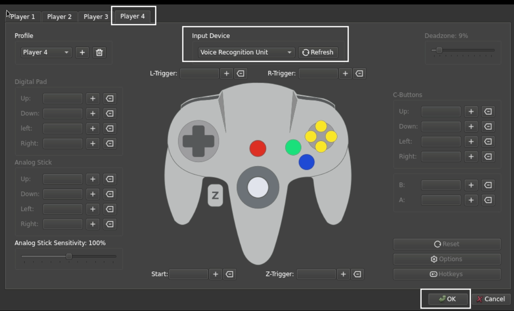

# Rosalie's Mupen GUI (RMG) is a Nintendo 64 Emulator.

Github: [https://github.com/Rosalie241/RMG](https://github.com/Rosalie241/RMG)

**This page is for Rosalie's Mupen GUI, a standalone N64 emulator. This page is not for the Mupen64Plus-Next RetroArch core. For more information on RetroArch and the Mupen64Plus-Next RetroArch core, visit the [RetroArch Page](../steamos/retroarch.md).**

***

## RMG Table of Contents

1. [Getting Started with RMG](#getting-started-with-rmg)
    - [Configuration](#rmg-configuration)
    - [RMG Folder Locations](#rmg-folder-locations)
    - [How to Update RMG](#how-to-update-rmg)
    - [How to Launch RMG in Desktop Mode](#how-to-launch-rmg-in-desktop-mode)
    - [File Formats](#rmg-file-formats)
    - [Hotkeys](#rmg-hotkeys)

2. [RMG Tips and Tricks](#rmg-tips-and-tricks)
    - [How to Configure Multiplayer](#how-to-configure-multiplayer)
    - [How to Install Custom Textures](#how-to-install-custom-textures)
    - [How to Configure VRU](#how-to-configure-vru)
    - [How to Configure N64DD](#how-to-configure-n64dd)
    - [How to Use Cheats](#how-to-use-cheats)
    - [How to Roll Back RMG to an Older Version](#how-to-roll-back-rmg-to-an-older-version)
 
***

## Getting Started with RMG
[Back to the Top](#rmg-table-of-contents)

RMG is a fairly straight-forward emulator to set up. If you are strictly playing Nintendo 64 ROMs, place your ROMs in `Emulation/roms/n64`. No additional setup is required. Read the [Configuration](#rmg-configuration) section to learn more about RMG and its folder locations. 

To launch your ROMs in game mode, use Steam ROM Manager and use one of the following parsers to play your N64 ROMs:

* `EmulationStation-DE`
* `Nintendo 64 - RMG` 
* `Emulators`

***

### RMG Configuration
[Back to the Top](#rmg-table-of-contents)

* Type of Emulator: Flatpak
* Config Location: `/home/deck/.var/app/com.github.Rosalie241.RMG`
* Nintendo 64 ROM Location: `Emulation/roms/n64`
    * No BIOS are required to play Nintendo 64 games 
* Nintendo 64DD ROM Location: `Emulation/roms/n64dd`
* Nintendo 64DD BIOS Location: `Emulation/bios`
    * Nintendo 64DD BIOS: 
        * `64DD_IPL_US.n64`
        * `64DD_IPL_JP.n64`
        * `64DD_IPL_DEV.n64`
        * **Note:** These BIOS are only required if you are playing Nintendo 64DD games. These BIOS are not required for base Nintendo 64 games
* Saves: `Emulation/saves/RMG/saves`
* Save States: `Emulation/saves/RMG/states`
* Storage Location: `Emulation/storage/RMG`
    * Contains the following folders: 
        * `Emulation/storage/RMG/cache`
        * `Emulation/storage/RMG/HiResTextures`
        * `Emulation/storage/RMG/screenshots`

**Note:** `~/.var` is an invisible folder by default. In Dolphin (file manager), click the hamburger menu in the top right, click `Show Hidden Files` to see these folders.

#### Works With
* Steam ROM Manager
* EmulationStation-DE

***

### RMG Folder Locations
[Back to the Top](#rmg-table-of-contents)

These file locations apply regardless of where you chose to install EmuDeck (to your internal SSD, to your SD Card, or elsewhere). Some emulator configuration files will be located on the internal SSD as listed below. 

`$HOME` refers to your home folder. If you are on a Steam Deck, this folder will be named `/home/deck` (you will likely not see `deck` in the file path when navigating using the file manager). 

Paths beginning with `Emulation/..` correspond to your EmuDeck install location. If you installed on an SD Card, your path may be `/run/media/mmcblk0p1/Emulation/roms/..`. If you installed on your internal SSD, your path may be `/home/deck/Emulation/roms/..`

**Note:** Folders with a `.` (`.var`, `.local`, `.config`, etc.) at the beginning are hidden by default. In Dolphin (file manager), click the hamburger menu in the top right, click `Show Hidden Files` to see these folders.

`$HOME/.var/app/com.github.Rosalie241.RMG`

```
com.github.Rosalie241.RMG
├── cache
├── config
│   ├── kdeglobals
│   ├── pulse
│   │   └── cookie
│   ├── QtProject.conf
│   ├── RMG
│   │   ├── GLideN64.ini
│   │   ├── GLideN64.ini.bak
│   │   ├── mupen64plus.cfg
│   │   └── mupen64plus.cfg.bak
│   └── user-dirs.dirs
└── data
    └── RMG
        ├── Cheats-User
        └── Save
            ├── Game
            └── State
```

`Emulation/storage/RMG`

```
RMG
├── cache
├── HiResTextures
└── screenshots
```

***

### How to Update RMG
[Back to the Top](#rmg-table-of-contents)

**How to Update RMG**

* Update through `Discover` (Shopping bag icon)
* Through the `Update your Emulators & Tools` section on the `Manage Emulators` page in the `EmuDeck` application


***

### How to Launch RMG in Desktop Mode
[Back to the Top](#rmg-table-of-contents)

**How to Launch RMG in Desktop Mode**

* Launch `Rosalie's Mupen GUI` from the Applications Launcher (Steam Deck icon in the bottom left of the taskbar)
* Launch the script from `Emulation/tools/launchers`, `rosaliesmupengui.sh`
* Launch the emulator from `Steam` after adding it via the `Emulators` parser in `Steam ROM Manager`


***

### RMG File Formats
[Back to the Top](#rmg-table-of-contents)

* .bin
* .n64
* .ndd
* .u1
* .v64
* .z64
* .zip

***

### RMG Hotkeys
[Back to the Top](#rmg-table-of-contents)

RMG comes with a Steam Input profile for Hotkeys. Activate the Steam Input profile by clicking the `Game Controller` icon in `Game Mode`, change the template to `Emudeck - RMG`. The hotkeys below can only be used if you have the Steam Input profile active.

**Long Press** to activate hotkeys on the left trackpad radial menu. 

| Hotkey         | EmulationStation-DE       |
|----------------|---------------------------|
| Quick Menu     | Left Trackpad Radial Menu |
| Save State     | Left Trackpad Radial Menu |
| Save State Menu| Left Trackpad Radial Menu |
| Load State     | Left Trackpad Radial Menu |
| Pause          | Left Trackpad Radial Menu |
| Cheats         | Left Trackpad Radial Menu |
| Controller Menu| Left Trackpad Radial Menu |
| Graphics Menu  | Left Trackpad Radial Menu |
| Screenshot     | Left Trackpad Radial Menu |
| Stop Emulation | Left Trackpad Radial Menu |
| Reset          | Left Trackpad Radial Menu |

**Note:** 

* [How to Select a Steam Input Profile](../../controls-and-hotkeys/steamos/hotkeys.md#how-to-select-a-steam-input-profile)
* [Steam Deck Button Layout](../../controls-and-hotkeys/steamos/hotkeys.md#steam-deck-button-layout)

***

## RMG Tips and Tricks
[Back to the Top](#rmg-table-of-contents)

***

### How to Configure Multiplayer
[Back to the Top](#rmg-table-of-contents)

EmuDeck configures multiplayer out of the box. You do not need to configure the controls. To set up multiplayer, you simply need to enable the additional ports.

**Tutorial**

1. Open Rosalie's Mupen GUI
2. Open the `Input` settings
3. For each controller you are using for Player 2, 3, and 4, click the respective tab
    * You do not need to adjust any settings for Player 1
4. Under `Input Device`
    * Player 2: `Steam Virtual Gamepad 1`      
    * Player 3: `Steam Virtual Gamepad 2`      
    * Player 4: `Steam Virtual Gamepad 3`
5. Under `Profile`
    * Player 2: `steamdeck2`      
    * Player 3: `steamdeck3`      
    * Player 4: `steamdeck4`  
6. After you are finished enabling any additional players, click `OK` and you may open your game either directly as a shortcut in Steam or through EmulationStation-DE    
7. (Optional) You may need to re-arrange the controller order in Game Mode for your controllers to function as expected. See [How to Re-Arrange the Controller Order](../../controls-and-hotkeys/steamos/external-controllers.md#how-to-re-arrange-the-controller-order) to learn how


***

### How to Install Custom Textures
[Back to the Top](#rmg-table-of-contents)

#### Preface

HTS & HTC are cache formats. PNG is the 'source' of the texture packs before it's converted to a cache file.

Before installing a texture pack, you will need to determine if it is HTC, HTS, or PNG. This can usually be confirmed by checking the file extension or reading the attached documentation. Follow the respective section below for installing texture packs.

#### Keep in Mind

* This section specifically requires the GLideN64 plugin. GLideN64 is the default graphics plugin if you are using EmuDeck settings 
* Texture packs are placed in the various subfolders within `Emulation/storage/RMG`
    * This folder contains the following sub-folders:
        * `cache`
            * `cache` is for HTC and HTS texture packs 
        * `HiResTextures`   
            * `HiResTextures` is for PNG texture packs

#### How to Install Custom Textures

##### HTC

1. Open the `Emulation/storage/RMG/cache` folder
2. Place your texture pack file directly into this folder
3. Open RMG
4. Click `Settings` at the top, select `Graphics`
5. Click the `Texture enhancement` tab
6. Make sure `Use file storage instead of memory cache` is unchecked
    * 
    * This setting is unchecked by default

##### HTS

1. Open the `Emulation/storage/RMG/cache` folder
2. Place your texture pack file directly into this folder
3. Open RMG
4. Click `Settings` at the top, select `Graphics`
5. Click the `Texture enhancement` tab
6. Check `Use file storage instead of memory cache`
    * 
    * **Note:** To save this setting on a per game basis, you can open the graphics settings while in-game and it will save to the per-game profile

##### PNG

This section goes over enabling `file storage instead of memory cache` in RMG's settings. This is optional, but recommended. 

1. Open the `Emulation/storage/RMG/HiResTextures` folder
2. Place your texture pack folder directly into this folder
3. Open RMG
4. Click `Settings` at the top, select `Graphics`
5. Click the `Texture enhancement` tab
6. Check `Use file storage instead of memory cache`
    * 
    * **Note:** To save this setting on a per game basis, you can open the graphics settings while in-game and it will save to the per-game profile


***

### How to Configure VRU
[Back to the Top](#rmg-table-of-contents)

The VRU (Voice Recognition Unit) was a peripheral for the Nintendo 64 that allowed you to use a microphone in "Hey You, Pikachu!" and "Densha de Go! 64". 

Since the Steam Deck comes with an internal built in microphone, you can use the Steam Deck's microphone to utilize VRU in Rosalie's Mupen GUI.

**Note:** Make sure Rosalie's Mupen GUI is up to date. VRU support was added in v0.4.2, on July 7th, 2023. 

#### How to Set up VRU

1. Open RMG
2. Open the `Input` settings under the `Settings` tab at the top
3. Click on `Player 4`
4. Change the `Input Device` to `Voice Recognition Unit`
    *  
5. Click `OK` in the bottom right
6. VRU is now enabled

***

### How to Configure N64DD
[Back to the Top](#rmg-table-of-contents)

The Nintendo 64DD was a floppy disk drive peripheral for the Nintendo 64.

See [https://en.wikipedia.org/wiki/64DD#Games](https://en.wikipedia.org/wiki/64DD#Games) for a full list of Nintendo 64DD games. 

Nintendo 64DD requires region specific BIOS. Place the respective BIOS from the list below directly in `Emulation/bios` matching the region of your Nintendo 64DD game.

* `64DD_IPL_US.n64`
* `64DD_IPL_JP.n64`
* `64DD_IPL_DEV.n64`

**Note:** 

* The BIOS must be named exactly as above. BIOS with any deviations from the above **will not** work. Make sure you have the proper casing, characters, and spelling. 
* BIOS must be placed in `Emulation/bios`. If you create a sub-folder, the BIOS will not be picked up and Nintendo 64DD games **will not** work. 

***

For the following games, place the Nintendo 64DD ROM in `Emulation/roms/n64` or `Emulation/roms/n64dd`, **no** additional set-up is required. These games are plug and play. 

To play your games directly through Rosalie's Mupen GUI, your ROMs must be placed in `Emulation/roms/n64`. To use Steam ROM Manager or EmulationStation-DE, your ROMs may be either in `Emulation/roms/n64` or `Emulation/roms/n64dd`. 

Either parse your Nintendo 64DD games through the `Nintendo 64 - RMG` parser in Steam ROM Manager or play them directly through EmulationStation-DE.

* Mario Artist: Paint Studio
* Doshin the Giant
* Mario Artist: Talent Studio
* SimCity 64
* Japan Pro Golf Tour 64
* Doshin the Giant: Tinkling Toddler Liberation Front! Assemble!
* Mario Artist: Communication Kit
* Mario Artist: Polygon Studio

**Note:** Mario Artist will boot but the mouse peripheral is not supported at this time.

***

**For the F-Zero X Expansion Kit, follow the below steps**

1. Place your base Nintendo 64 `F-Zero X` ROM in `Emulation/roms/n64` and the `F-Zero X Expansion Kit` N64DD ROM in `Emulation/roms/n64dd`
    * The regions for the base ROM and the expansion kit need to match. If you are using the Japanese `F-Zero X Expansion Kit` ROM, you need a Japanese `F-Zero X` ROM
2. Right click `F-Zero X`, click `Edit Game Settings`
3. Click the `Core` tab under the `Game` tab
4. Check `Override Core Settings`
5. Change the `CPU Emulator` to `Cached Interpreter`, close out of the settings menu
6. Right click the base `F-Zero X` ROM, click `Play Game With Disk` and select the `F-Zero X Expansion Kit` N64DD ROM in `Emulation/roms/n64dd`

***

**Optional: How to Add F-Zero X Expansion Kit directly to Steam**

1. Place your base Nintendo 64 `F-Zero X` ROM in `Emulation/roms/n64` and the `F-Zero X Expansion Kit` N64DD ROM in `Emulation/roms/n64dd`
2. Parse your base `F-Zero X` ROM through the `Nintendo 64 - RMG` parser in Steam ROM Manager
3. In Desktop Mode, open Steam, select the `F-Zero X` ROM, click the `Gear` icon, click `Properties`
    * 
4. Scroll to the end of the `Launch Options` box and add `--disk "/path/to/F-Zero X Expansion Kit"` (write the path with the quotes)
    * 


***

### How to Use Cheats
[Back to the Top](#rmg-table-of-contents)

#### Mid-Game

1. While in game, use the left Trackpad and select the `Cheats` icon
    * Steam Input profiles for Nintendo 64 ROMs and EmulationStation-DE are enabled by default. However, if you do not see the Trackpad menu, see [How to Select a Steam Input Profile](../../controls-and-hotkeys/steamos/hotkeys.md#how-to-select-a-steam-input-profile)
2. Select which cheats you would like to use

#### Emulator

1. Open Rosalie's Mupen GUI
2. Right click a game
3. Click `Edit cheats`
    * If you would like to add new cheats, it is recommended you do so in Desktop Mode

***

### How to Roll Back RMG to an Older Version
[Back to the Top](#rmg-table-of-contents)

1. In Desktop Mode, open `Konsole`
2. To see a list of prior versions of the emulator, type:
    * `flatpak remote-info --log flathub com.github.Rosalie241.RMG`
    * Each version will have a long accompanying alphanumeric string (the “commit” code). Copy the string for the version you want to downgrade to.
3. To downgrade to the version you want:
    * `flatpak update --commit=put_commit_code_here com.github.Rosalie241.RMG`
    * Replace `put_commit_code_here` with the actual code you located in Step 2. 
    * If this line does not work, you may need to type:
        * `sudo flatpak update --commit=put_commit_code_here com.github.Rosalie241.RMG`

***