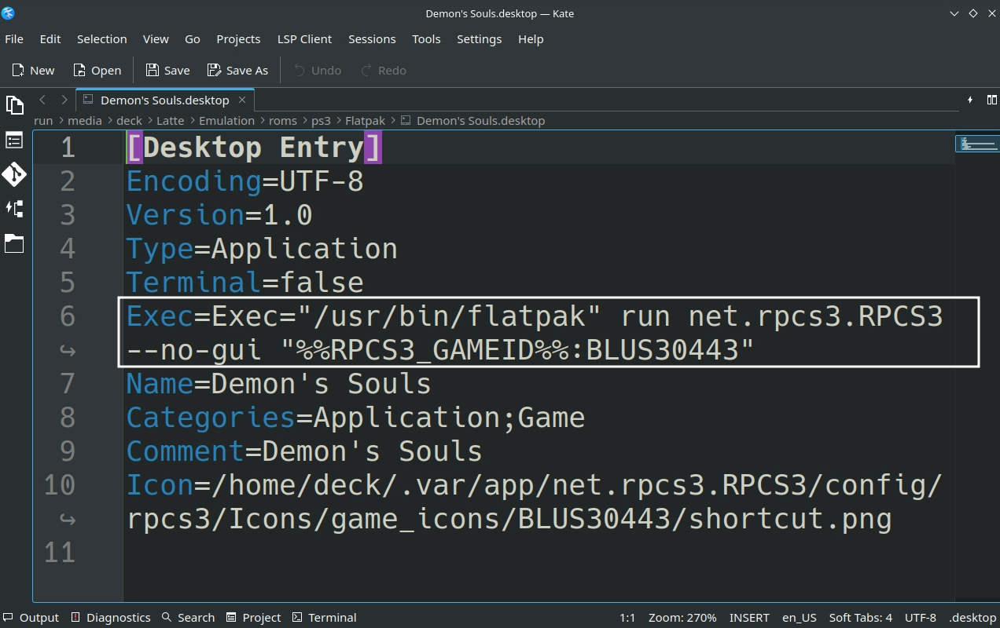

# RPCS3 is a Sony Playstation 3 Emulator.

Website: [https://rpcs3.net/](https://rpcs3.net/)

Quickstart Guide: [https://rpcs3.net/quickstart](https://rpcs3.net/quickstart)

Github: [https://github.com/RPCS3/rpcs3](https://github.com/RPCS3/rpcs3)

Compatibility List: [https://rpcs3.net/compatibility](https://rpcs3.net/compatibility)

RPCS3 Wiki: [https://wiki.rpcs3.net/index.php?title=Main_Page](https://rpcs3.net/compatibility)

***

## RPCS3 Table of Contents

1. [Getting Started with RPCS3](#getting-started-with-rpcs3)
    - [Configuration](#rpcs3-configuration)
    - [How to Update RPCS3](#how-to-update-rpcs3)
    - [How to Launch RPCS3 in Desktop Mode](#how-to-launch-rpcs3-in-desktop-mode)
    - [File Formats](#rpcs3-file-formats)
    - [Hotkeys](#rpcs3-hotkeys)
    - [How to Manage Updates](#how-to-manage-updates)

2. [RPCS3 Tips and Tricks](#rpcs3-tips-and-tricks)
    - [How to Configure RPCS3 to Work With EmulationStation-DE](#how-to-configure-rpcs3-to-work-with-emulationstation-de)
    - [Special Game Configurations](#special-game-configurations)

***

## Getting Started with RPCS3
[Back to the Top](#rpcs3-table-of-contents)

In order to play a game on RPCS3, you need to install the firmware through the RPCS3 UI. In desktop mode, open RPCS3, either in the application menu or through its shortcut in `Emulation/tools/launchers/rpcs3.sh`. In RPCS3, click File, click Install Firmware. Firmware is provided legally by Sony.

Follow RPCS3's Quickstart Guide for a step by step process on setting up RPCS3: [https://rpcs3.net/quickstart](https://rpcs3.net/quickstart)

Read the [Configuration](#rpcs3-configuration) section to learn more about RPCS3 and its folder locations. 

To launch your ROMs in game mode, use Steam ROM Manager and use one of the following parsers to play your Playstation 3 ROMs:

* `EmulationStation-DE`
    * To play PS3 games in EmulationStation-DE, read: [How to Configure RPCS3 to Work With EmulationStation-DE](#how-to-configure-rpcs3-to-work-with-emulationstation-de)
* `Sony PlayStation 3 - RPCS3 (Extracted ISO/PSN)` or `Sony PlayStation 3 - RPCS3 (Installed PKG)`
    * Read the [File Formats](#rpcs3-file-formats) section to learn more about these various file formats
* `Emulators`

***

### RPCS3 Configuration
[Back to the Top](#rpcs3-table-of-contents)

* Type of Emulator: Flatpak
* Config Location: `/home/deck/.var/app/net.rpcs3.RPCS3`
* Storage Location: `Emulation/storage/rpcs3`
  * Contains: `dev_hdd0` 
      * Contains the following folders: 
          * `disc`
          * `game`
          * `home`
          * `photo`
          * `savedata`
* ROM Location: `Emulation/roms/ps3`
* Firmware: Install the firmware through RPCS3's GUI. Read the [Quickstart Guide](https://rpcs3.net/quickstart) for a tutorial
* Saves: 
    * Symlink: `Emulation/saves/rpcs3/saves`
    * Target: `Emulation/storage/rpcs3/dev_hdd0/home/00000001/savedata`


**Note:** `~/.var` is an invisible folder by default. In Dolphin (file manager), click the hamburger menu in the top right, click `Show Hidden Files` to see these folders.
* Your game will not show in the RPCS3 UI until you add it manually through the `Add Game` option under `File` in the top left. 

#### Folder Visualization

`$HOME/.var/app/net.rpcs3.RPCS3`

```
net.rpcs3.RPCS3
├── cache
│   ├── fontconfig
│   ├── mesa_shader_cache
│   │   ├── 17
│   │   ├── 9b
│   │   ├── d6
│   │   └── ea
│   ├── rpcs3
│   │   ├── savestates
│   │   ├── shaderlog
│   │   └── spu_progs
│   └── tmp
├── config
│   ├── kdeglobals
│   ├── pulse
│   │   └── cookie
│   ├── QtProject.conf
│   ├── rpcs3
│   │   ├── captures
│   │   ├── config.yml
│   │   ├── dev_bdvd
│   │   ├── dev_flash
│   │   ├── dev_flash2
│   │   ├── dev_flash3
│   │   ├── dev_hdd1
│   │   │   └── caches
│   │   ├── dev_usb000
│   │   ├── games.yml
│   │   ├── GuiConfigs
│   │   │   └── CurrentSettings.ini
│   │   ├── Icons
│   │   ├── patches
│   │   ├── sounds
│   │   └── uuid
│   └── user-dirs.dirs
└── data
```

`Emulation/storage/rpcs3`

```
rpcs3/
└── dev_hdd0
    ├── disc
    ├── game
    ├── home
    ├── photo
    └── savedata
```

#### Works With
* Steam ROM Manager
* EmulationStation-DE
    * [How to Configure RPCS3 to Work With EmulationStation-DE](#how-to-configure-rpcs3-to-work-with-emulationstation-de)

***

### How to Update RPCS3
[Back to the Top](#rpcs3-table-of-contents)

**How to Update RPCS3**

* Update through `Discover` (Shopping bag icon)
* Through the `Update your Emulators & Tools` section on the `Manage Emulators` page in the `EmuDeck` application

***

### How to Launch RPCS3 in Desktop Mode
[Back to the Top](#rpcs3-table-of-contents)

**How to Launch RPCS3 in Desktop Mode**

* Launch `RPCS3` from the Applications Launcher (Steam Deck icon in the bottom left of the taskbar)
* Launch the script from `Emulation/tools/launchers`, `rpcs3.sh`
* Launch the emulator from `Steam` after adding it via the `Emulators` parser in `Steam ROM Manager`


***

### RPCS3 File Formats
[Back to the Top](#rpcs3-table-of-contents)

* Folder Format: `/PS3_GAME/USRDIR/eboot.bin`
    * Place the folder in `Emulation/roms/ps3`
    * **Visual Reference:** 
    * For more information on the `Folder Format`, read [RPCS3's Quickstart Guide](https://rpcs3.net/quickstart)
        * **Note:** Read the `Dumping Step-by-step` section specifically
* Install `.pkg` files directly through the RPCS3 UI
    * **Note:** You can drag and drop `.pkg` files to the RPCS3 UI
    * `.pkg` files are installed to: `Emulation/storage/rpcs3/dev_hdd0/game/`
* Install `.rap` files directly through the RPCS3 UI
    * **Note:** You can drag and drop `.rap` files to the RPCS3 UI
    * `.rap` files are installed to: `Emulation/storage/rpcs3/dev_hdd0/game/`

**Note:** `.iso` **is not** supported. You **cannot** extract PS3 ISOs into a folder (without decrypting it) and expect a working ROM. Read the `Dumping Step-by-step` section specifically of the [RPCS3 Quickstart Guide](https://rpcs3.net/quickstart) to learn how to extract `.iso` files into a decrypted folder. A ROM ending with the file extension `.iso` is **not supported.**

**Steam ROM Manager Parsers**

* Folder Format: Use the `Sony PlayStation 3 - RPCS3 (Extracted ISO/PSN)` parser
* PKG Format: Use the `Sony PlayStation 3 - RPCS3(Flatpak) (Installed PKG)` parser

***

### RPCS3 Hotkeys
[Back to the Top](#rpcs3-table-of-contents)

N/A

***

### How to Manage Updates
[Back to the Top](#rpcs3-table-of-contents)

Read [https://wiki.rpcs3.net/index.php?title=Help:Installing_Game_Updates](https://wiki.rpcs3.net/index.php?title=Help:Installing_Game_Updates) for a tutorial on how to download and manage PS3 updates. 

The Linux version of the software mentioned in the above article can be found here: [https://github.com/RainbowCookie32/rusty-psn/releases/](https://github.com/RainbowCookie32/rusty-psn/releases/).

***

## RPCS3 Tips and Tricks
[Back to the Top](#rpcs3-table-of-contents)

***

### How to Configure RPCS3 to Work With EmulationStation-DE
[Back to the Top](#rpcs3-table-of-contents)

1. In `Desktop Mode`, open RPCS3
2. Skip this step if you have already added your games to RPCS3:
    * Either: 
        * In the top left click, `File`, click `Add Games`, locate your game
        * In the top left click, `File`, click `Install Packages/Raps/Edats`, and install your PKG
        * For more information, read the [File Formats](#rpcs3-file-formats) section
3. Right click your game, click `Create Shortcut`, click `Create Desktop Shortcut`
4. On your desktop, you should see an icon for your game. Move this icon to `Emulation/roms/ps3`
5. Right click the shortcut, click `Open with Kate` or a text editor of your choice
6. Edit the **beginning** of the `Exec=` line using the following template:
    * Original Line: ``Exec="/app/bin/rpcs3" --no-gui`
    * Updated Line: `Exec="/usr/bin/flatpak" run net.rpcs3.RPCS3 --no-gui`
        * Replace `"/app/bin/rpcs3" --no-gui` with `"/usr/bin/flatpak" run net.rpcs3.RPCS3 --no-gui`
    * **Do not** edit anything on the line after `--no-gui`
7. Example, using Demon Souls: 
    * **Original Line:** `Exec="/app/bin/rpcs3" --no-gui "%%RPCS3_GAMEID%%:BLUS30443"`
        * 
    * **Updated Line:** `Exec="/usr/bin/flatpak" run net.rpcs3.RPCS3 --no-gui "%%RPCS3_GAMEID%%:BLUS30443"`
        * 
8. Your game should now show up in and launch directly from EmulationStation-DE 

If you get an `Invalid file or folder` error message, you will need to change the `Alternative Emulator` in EmulationStation-DE for PlayStation 3 to `RPCS3 Shortcut [Standalone]`. 

You may also do this on a per-game basis if you are using a mix of folders and PKGs. On a game, press the `select ` button, scroll down and select `EDIT THIS GAME'S METADATA`, scroll down and select `ALTERNATIVE EMULATOR`, select PS3 and select the corresponding format.

Refer to [https://gitlab.com/es-de/emulationstation-de/-/blob/master/USERGUIDE.md#sony-playstation-3](https://gitlab.com/es-de/emulationstation-de/-/blob/master/USERGUIDE.md#sony-playstation-3), for additional information. 


***

### Special Game Configurations
[Back to the Top](#rpcs3-table-of-contents)

Some games will take additional setup, requiring mods or an extensive alteration of settings. The EmuDeck Community Creations page collects these configurations in one centralized location. 

You can submit or view special game configurations here: [Special Game Configurations](../../community-creations/steamos/community-creations.md#rpcs3-playstation-3)

***