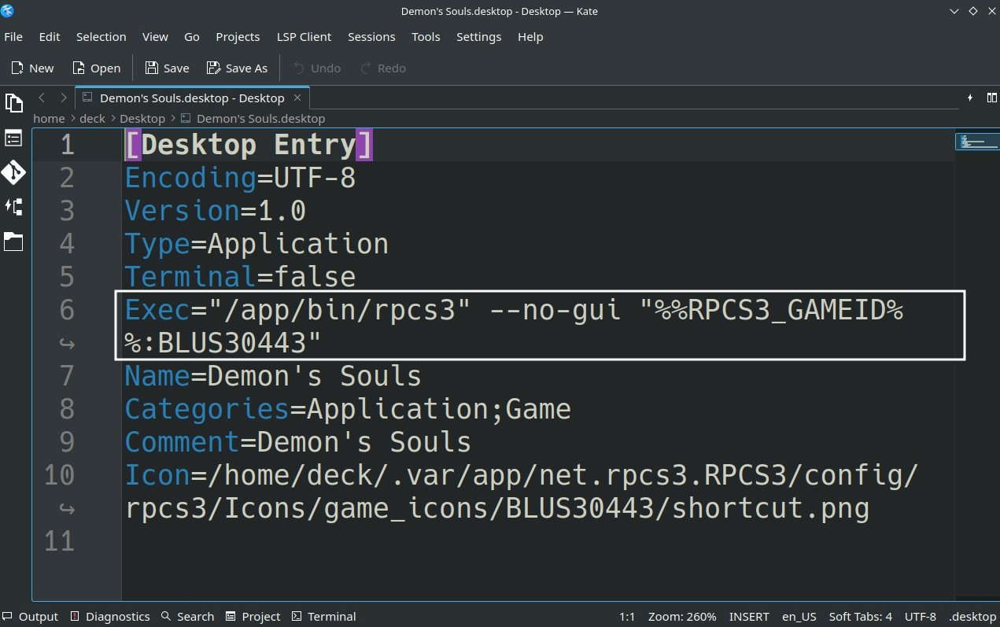

# RPCS3 is a Sony Playstation 3 Emulator.

Website: [https://rpcs3.net/](https://rpcs3.net/)

Quickstart Guide: [https://rpcs3.net/quickstart](https://rpcs3.net/quickstart)

GitHub: [https://github.com/RPCS3/rpcs3](https://github.com/RPCS3/rpcs3)

Compatibility List: [https://rpcs3.net/compatibility](https://rpcs3.net/compatibility)

RPCS3 Wiki: [https://wiki.rpcs3.net/index.php?title=Main_Page](https://rpcs3.net/compatibility)

***

## RPCS3 Table of Contents

1. [Getting Started with RPCS3](#getting-started-with-rpcs3)
    - [Configuration](#rpcs3-configuration)
    - [RPCS3 Folder Locations](#rpcs3-folder-locations)
    - [How to Update RPCS3](#how-to-update-rpcs3)
    - [How to Launch RPCS3 in Desktop Mode](#how-to-launch-rpcs3-in-desktop-mode)
    - [File Formats](#rpcs3-file-formats)
    - [Hotkeys](#rpcs3-hotkeys)
    - [How to Manage Updates](#how-to-manage-updates)

2. [RPCS3 Tips and Tricks](#rpcs3-tips-and-tricks)
    - [How to Configure RPCS3 to Work With ES-DE and Pegasus](#how-to-configure-rpcs3-to-work-with-es-de-and-pegasus)
    - [How to Configure Multiplayer](#how-to-configure-multiplayer)
    - [Special Game Configurations](#special-game-configurations)
    - [How to Set Up the Motion Sensor with External Controllers](#how-to-set-up-the-motion-sensor-with-external-controllers)
    - [How to Roll Back RPCS3 to an Older Version](#how-to-roll-back-rpcs3-to-an-older-version)
    - [How to Configure Language Settings](#how-to-configure-language-settings)

***

## Getting Started with RPCS3
[Back to the Top](#rpcs3-table-of-contents)

In order to play a game on RPCS3, you need to install the firmware through the RPCS3 UI. In desktop mode, open RPCS3, either in the application menu or through its shortcut in `Emulation/tools/launchers/rpcs3.sh`. In RPCS3, click File, click Install Firmware. Firmware is provided legally by Sony.

Follow RPCS3's Quickstart Guide for a step by step process on setting up RPCS3: [https://rpcs3.net/quickstart](https://rpcs3.net/quickstart)

Read the [Configuration](#rpcs3-configuration) section to learn more about RPCS3 and its folder locations. 

To launch your ROMs in game mode, use Steam ROM Manager and use one of the following parsers to play your Playstation 3 ROMs:

* `ES-DE`
    * To play PS3 games in ES-DE, see [How to Configure RPCS3 to Work With ES-DE and Pegasus](#how-to-configure-rpcs3-to-work-with-es-de-and-pegasus)
* `Sony PlayStation 3 - RPCS3 (Extracted ISO/PSN)` or `Sony PlayStation 3 - RPCS3 (Installed PKG)`
    * Read the [File Formats](#rpcs3-file-formats) section to learn more about these various file formats
* `Emulators`

***

### RPCS3 Configuration
[Back to the Top](#rpcs3-table-of-contents)

* Type of Emulator: AppImage
* Config Location: `/home/deck/Applications/rpcs3.AppImage`
* Storage Location: `Emulation/storage/rpcs3/dev_hdd0`
* ROM Location: `Emulation/roms/ps3`
* Firmware: Install the firmware through RPCS3's GUI. Read the [Quickstart Guide](https://rpcs3.net/quickstart) for a tutorial
* Saves: 
    * Symlink: `Emulation/saves/rpcs3/saves`
    * Target: `Emulation/storage/rpcs3/dev_hdd0/home/00000001/savedata`


* Your game will not show in the RPCS3 UI until you add it manually through the `Add Game` option under `File` in the top left. 

#### Works With
* Steam ROM Manager
* ES-DE

***

### RPCS3 Folder Locations
[Back to the Top](#rpcs3-table-of-contents)

These file locations apply regardless of where you chose to install EmuDeck (to your internal SSD, to your SD Card, or elsewhere). Some emulator configuration files will be located on the internal SSD as listed below.

???+ info "Home Directory"
    `~` refers to your Home directory

???+ info "Hidden Folders"
    Directories with a `.` in front of their name, like `~/.steam`, are hidden by default. In Dolphin(file manager), click the hamburger menu in the top right and toggle on `Show Hidden Files`.

`~/.config/rpcs3`

```
rpcs3/
├── captures
├── config
├── custom.configs
├── dev_bdvd
├── dev_flash
├── dev_hdd1
├── dev_usb000
├── GuiConfigs
├── Icons
├── input_configs
├── patches
├── sounds
├── config.yml
├── config.yml.bak
├── evdev_positive_axis.yml
├── games.yml
├── players_history.yml
├── recording.yml
├── uuid
├── vfs.yml
└── vfs.yml.bak
```

???+ info "Emulation Directory"
    `~/Emulation` refers to either your `home` directory or SD Card/removable media depending on your installation location.

`~/Emulation/storage/rpcs3`

```
rpcs3/
└── dev_hdd0
    ├── disc
    ├── game
    ├── home
    ├── photo
    └── savedata
```

***

### How to Update RPCS3
[Back to the Top](#rpcs3-table-of-contents)

* Through the `Update your Emulators` section on the `Manage Emulators` page in the `EmuDeck` application
* Manual file replacement of `rpcs3.AppImage` 
    * Refer to [How to Swap Out AppImages and Binaries](../../file-management/steamos/file-management.md#how-to-swap-out-appimages-and-binaries) for instructions


***

### How to Launch RPCS3 in Desktop Mode
[Back to the Top](#rpcs3-table-of-contents)

* Launch `RPCS3 AppImage` from the Applications Launcher (Steam Deck icon in the bottom left of the taskbar)
* Launch the script from `Emulation/tools/launchers`, `rpcs3.sh`
* Launch the emulator from `Steam` after adding it via the `Emulators` parser in `Steam ROM Manager`


***

### RPCS3 File Formats
[Back to the Top](#rpcs3-table-of-contents)

* Folder Format: `/PS3_GAME/USRDIR/eboot.bin`
    * Place the folder in `Emulation/roms/ps3`
    * **Visual Reference:** 
    
    
    
    * For more information on the `Folder Format`, read [RPCS3's Quickstart Guide](https://rpcs3.net/quickstart)
        * **Note:** Read the `Dumping Step-by-step` section specifically

* Install `.pkg` files directly through the RPCS3 UI
    * **Note:** You can drag and drop `.pkg` files to the RPCS3 UI
    * `.pkg` files are installed to: `Emulation/storage/rpcs3/dev_hdd0/game/`
* Install `.rap` files directly through the RPCS3 UI
    * **Note:** You can drag and drop `.rap` files to the RPCS3 UI
    * `.rap` files are installed to: `Emulation/storage/rpcs3/dev_hdd0/game/`

**Note:** A file ending with the file extension, `.iso` cannot be played through RPCS3. In order to use a file ending with the file extension, `.iso`, you must first decrypt the `.iso` file (using a matching IRD file). After decrypting the `.iso` file, you may then use a file archiver like 7-Zip or WinRAR to extract the file into a working game folder. 

Do keep in mind that this method is not recommended by RPCS3. Make sure to read [RPCS3's Quickstart Guide](https://rpcs3.net/quickstart) to learn how to properly dump your games in order to have a working and usable ROM.

**Steam ROM Manager Parsers**

* Folder Format: Use the `Sony PlayStation 3 - RPCS3 (Extracted ISO/PSN)` parser
* PKG Format: Use the `Sony PlayStation 3 - RPCS3(Flatpak) (Installed PKG)` parser

***

### RPCS3 Hotkeys
[Back to the Top](#rpcs3-table-of-contents)

N/A

***

### How to Manage Updates
[Back to the Top](#rpcs3-table-of-contents)

Read [https://wiki.rpcs3.net/index.php?title=Help:Installing_Game_Updates](https://wiki.rpcs3.net/index.php?title=Help:Installing_Game_Updates) for a tutorial on how to download and manage PS3 updates. 

The Linux version of the software mentioned in the above article can be found here: [https://github.com/RainbowCookie32/rusty-psn/releases/](https://github.com/RainbowCookie32/rusty-psn/releases/).

***

### RPCS3 Tips and Tricks
[Back to the Top](#rpcs3-table-of-contents)

***

### How to Configure RPCS3 to Work With ES-DE and Pegasus
[Back to the Top](#rpcs3-table-of-contents)

## AppImage

1. In `Desktop Mode`, open RPCS3
2. Skip this step if you have already added your games to RPCS3:
    * Either: 
        * In the top left click, `File`, click `Add Games`, locate your game
        * In the top left click, `File`, click `Install Packages/Raps/Edats`, and install your PKG
        * For more information, read the [File Formats](#rpcs3-file-formats) section
3. Right click your game, click `Create Shortcut`, click `Create Desktop Shortcut`
4. On your desktop, you should see an icon for your game. Move this icon to `Emulation/roms/ps3`
    * If your desktop shortcut contains special icons any special symbols (Ex: the copyright symbol, `©`), rename the desktop file to remove these symbols. 
        * For example, rename `God Of War® Collection.desktop` to `God Of War Collection.desktop`, removing the `©` after `War`
5. (Optional) If the desktop file is opening RPCS3 instead of the game: 
    * In Desktop Mode, right click the desktop file
    * Click `Properties`
    * On the `General` tab, click `Change` to the right of the `Open With` line
    * Under `Application Preference Order`, click `RPCS3`
    * Click `Remove` on the right
    * Click `Apply` in the bottom left and click `OK`
    * The desktop file will not work in Desktop Mode, but will launch the game directly either through a terminal or through ES-DE 
6. Your game should now show up in and launch directly from ES-DE and Pegasus

If you get an `Invalid file or folder` error message, you will need to change the `Alternative Emulator` in ES-DE for PlayStation 3 to `RPCS3 Shortcut [Standalone]`. 

You may also do this on a per-game basis if you are using a mix of folders and PKGs. On a game, press the `select ` button, scroll down and select `EDIT THIS GAME'S METADATA`, scroll down and select `ALTERNATIVE EMULATOR`, select PS3 and select the corresponding format.

Refer to [https://gitlab.com/es-de/emulationstation-de/-/blob/master/USERGUIDE.md#sony-playstation-3](https://gitlab.com/es-de/emulationstation-de/-/blob/master/USERGUIDE.md#sony-playstation-3), for additional information.

## Flatpak

**These are legacy instructions for the Flatpak installation from Discover.**

1. In `Desktop Mode`, open RPCS3
2. Skip this step if you have already added your games to RPCS3:
    * Either: 
        * In the top left click, `File`, click `Add Games`, locate your game
        * In the top left click, `File`, click `Install Packages/Raps/Edats`, and install your PKG
        * For more information, read the [File Formats](#rpcs3-file-formats) section
3. Right click your game, click `Create Shortcut`, click `Create Desktop Shortcut`
4. On your desktop, you should see an icon for your game. Move this icon to `Emulation/roms/ps3`
5. Right click the shortcut, click `Open with Kate` or a text editor of your choice
6. Edit the **beginning** of the `Exec=` line using the following template:
    * Original Line: ``Exec="/app/bin/rpcs3" --no-gui`
    * Updated Line: `Exec="/usr/bin/flatpak" run net.rpcs3.RPCS3 --no-gui`
        * Replace `"/app/bin/rpcs3" --no-gui` with `"/usr/bin/flatpak" run net.rpcs3.RPCS3 --no-gui`
    * **Do not** edit anything on the line after `--no-gui`
7. Example, using Demon Souls: 
    * **Original Line:** `Exec="/app/bin/rpcs3" --no-gui "%%RPCS3_GAMEID%%:BLUS30443"`
        * 
    * **Updated Line:** `Exec="/usr/bin/flatpak" run net.rpcs3.RPCS3 --no-gui "%RPCS3_GAMEID%:BLUS30443"`
8. Save and close out of the desktop file  
9. (Optional) If the desktop file is opening RPCS3 instead of the game: 
    * In Desktop Mode, right click the desktop file
    * Click `Properties`
    * On the `General` tab, click `Change` to the right of the `Open With` line
    * Under `Application Preference Order`, click `RPCS3`
    * Click `Remove` on the right
    * Click `Apply` in the bottom left and click `OK`
    * The desktop file will not work in Desktop Mode, but will launch the game directly either through a terminal or through ES-DE and Pegasus
10. Your game should now show up in and launch directly from ES-DE and Pegasus

If you get an `Invalid file or folder` error message, you will need to change the `Alternative Emulator` in ES-DE for PlayStation 3 to `RPCS3 Shortcut [Standalone]`. 

You may also do this on a per-game basis if you are using a mix of folders and PKGs. On a game, press the `select` button, scroll down and select `EDIT THIS GAME'S METADATA`, scroll down and select `ALTERNATIVE EMULATOR`, select PS3 and select the corresponding format.

Refer to [https://gitlab.com/es-de/emulationstation-de/-/blob/master/USERGUIDE.md#sony-playstation-3](https://gitlab.com/es-de/emulationstation-de/-/blob/master/USERGUIDE.md#sony-playstation-3), for additional information. 


***

### How to Configure Multiplayer
[Back to the Top](#rpcs3-table-of-contents)

RPCS3 comes with a nifty auto-map feature that makes setting up multiplayer a breeze. To set up multiplayer, you simply need to enable the additional ports.

**Note:** If you are in Desktop Mode, make sure that Steam is open. 

1. Open RPCS3
2. Open the `Pads` menu in the `Settings`
3. For each controller you are using for Player 2, 3, 4, etc, click the respective tab
    * You do not need to adjust any settings for Player 1
4. Under `Handlers`, select `SDL` for each player you are enabling
5. Under `Devices`
    * Player 2: `Steam Virtual Gamepad 2`      
    * Player 3: `Steam Virtual Gamepad 3`      
    * Player 4: `Steam Virtual Gamepad 4`
    * Player 5: `Steam Virtual Gamepad 5`
    * Player 6: `Steam Virtual Gamepad 6`
    * Player 7: `Steam Virtual Gamepad 7`
6. Using `Player 2` as an example:
    * On the `Player 2` configuration screen, after you have selected the appropriate `Device` and `Handler`, click `Refresh` to the right of `Handler`
7. After you are finished enabling any additional players, click `Save` and you may open your game either directly as a shortcut in Steam or through ES-DE and Pegasus
8. (Optional) You may need to re-arrange the controller order in Game Mode for your controllers to function as expected. See [How to Re-Arrange the Controller Order](../../controls-and-hotkeys/steamos/external-controllers.md#how-to-re-arrange-the-controller-order) to learn how

***

### Special Game Configurations
[Back to the Top](#rpcs3-table-of-contents)

#### RPCS3 Wiki

Some games may require additional setup, needing mods or alteration of settings. The [RPCS3 Compatability List](https://rpcs3.net/compatibility) can be used to check for these. Simply search for the name of the game and click the hyperlinked name to view the wiki page for that game and see if there are any recommended or required settings changes.

#### EmuDeck Community Creations

Use the EmuDeck [Community Game Configurations](../../community-creations/steamos/community-game-configurations.md#rpcs3) page to submit or view special game configurations.

***

### How to Set up the Motion Sensor with External Controllers
[Back to the Top](#rpcs3-table-of-contents)

The PlayStation 3 controller, or the DualShock 3 notably had "Sixaxis". Sixaxis refers to the motion sensor used in a handful of games. One of the more popular games that utilized Sixaxis was Folklore. For a full list of games, see [https://www.giantbomb.com/sixaxis-support/3015-5310/games/](https://www.giantbomb.com/sixaxis-support/3015-5310/games/).

RPCS3 has implemented support to allow emulating the Sixaxis through evdev, which exposes the gyro in a large variety of modern controllers (including the Nintendo Switch Pro Controller, 8BitDo Ultimate Controller, and the DualSense). 

At this time, the Steam Deck gyro **cannot** be used. But if you own one of these controllers, you may emulate the Sixaxis through RPCS3.

**Here's How**

#### Desktop Mode

1. Switch to Desktop Mode
2. Exit out of Steam
    * You may exit out of Steam a couple of different ways:
        * Right click the `Steam` icon in your taskbar and click `Exit Steam`
        * Open Steam, click the `Steam` button in the top left, click `Exit`
        * Open a terminal (Konsole) and enter `killall -9 steam`
        * Do note that clicking the the `X` button in the top right of the Steam window **will not** exit out of Steam
    * Your controls will switch to `Lizard Mode`. Use `L2` to right click, `R2` to left click, and the `Right Trackpad` to move the mouse
    * You may also connect an external keyboard and mouse
2. Click the bluetooth icon in the bottom right of your taskbar and connect your controller
3. Click the Steam icon in the bottom left of the taskbar and open `RPCS3` 
4. Click `Pads` at the top
5. Under the `Player 1` tab, click the Dropdown box below `Devices` and select your controller
    * To switch back to the default controller layout, make sure `Steam` is open and select `Steam Virtual Gamepad 1`
6. Click `Save`, and exit out of RPCS3

#### Game Mode

1. In Game Mode, connect your controller
2. Select your PlayStation 3 game 
3. On the `Play` screen, select the `Controller` icon to the right of the screen 
4. Select your controller tab at the top
5. Click `Reorder Controllers` and move your external controller to the top
6. Click the `Gear` icon to the right, and click `Disable Steam Input`
    * You may need to restart first for this setting to properly apply
7. Your controller's gyro will now work for this selected game, repeat as needed for your other games

For a video, see below:

<figure class="video_container">
  <video controls="true" allowfullscreen="true">
    <source src="/videos/how-to-disable-steam-input.mp4" type="video/mp4">
  </video>
</figure>

#### Post-Configuration

To restore the default Steam Deck controls:

1. Open RPCS3
2. Click `Pads` at the top
3. Under the `Player 1` tab, click the Dropdown box below `Devices` and select `Steam Virtual Gamepad 1`
4. Select `SDL` under `Handlers`
5. Click `Save`, and exit out of RPCS3

(Optional) To restore Steam Input:

1. Select your PlayStation 3 game 
2. On the `Play` screen, select the `Controller` icon to the right of the screen 
    * 
3. Select your controller tab at the top
    * 
4. Click the `Gear` icon to the right, and click `Enable Steam Input`
    * You may need to restart first for this setting to properly apply
5. The controls will be reverted to Steam Input and the Steam Deck controls will be restored

***

### How to Roll Back RPCS3 to an Older Version
[Back to the Top](#rpcs3-table-of-contents)

Your ROMs launch using a script created by EmuDeck, `rpcs3.sh` in `~/Emulation/tools/launchers`.

!!! info "Emulation Directory"
    `~/Emulation` refers to either your `home` directory or SD Card/removable media depending on your installation location.

The script launches the corresponding emulator in `/home/deck/Applications` and **specifically looks** for two traits:

* The most recently downloaded version of the emulator in `/home/deck/Applications`, based on the file/release date.
* The emulator name at the beginning of the file. Anything after the emulator name is ignored. 
    * For example, if the latest version of the emulator is `1351` and you would like to downgrade to `1349`. When you download version `1349`, you could rename it to `EMULATORNAME-1349.AppImage`, and EmuDeck's script will ignore the `-1349` in the file name, allowing you to record which versions of the emulator you are using through the file name. 

#### How to Roll Back RPCS3

1. Download the version of the emulator you would like to use from RPCS3's Builds page: [https://rpcs3.net/compatibility?b](https://rpcs3.net/compatibility?b)
2. Move the downloaded emulator from Step 1 to `/home/deck/Applications`
3. **(Optional)** Rename or delete the original emulator file
4. Right click the newly downloaded emulator, click `Properties`, click `Permissions`, check `Is executable`
5. Your games will now launch using the version of the emulator you downloaded

***

### How to Configure Language Settings
[Back to the Top](#rpcs3-table-of-contents)

#### In-Game

1. In Desktop Mode, open RPCS3
2. At the top, click `Configuration`, click `System`
3. Below `Console Language`, select your preferred language in the drop-down menu


***
