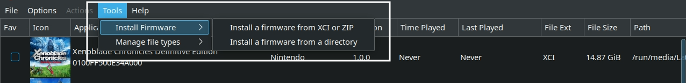

# Ryujinx is a Nintendo Switch Emulator.

Website: [https://ryujinx.org/](https://ryujinx.org/)

GitHub: [https://github.com/Ryujinx/Ryujinx](https://github.com/Ryujinx/Ryujinx)

GitHub Releases: [https://github.com/Ryujinx/release-channel-master/releases](https://github.com/Ryujinx/release-channel-master/releases)

Compatibility List: [https://github.com/Ryujinx/Ryujinx-Games-List/issues](https://github.com/Ryujinx/Ryujinx-Games-List/issues)

Quickstart guide: [https://github.com/Ryujinx/Ryujinx/wiki/Ryujinx-Setup-&-Configuration-Guide](https://github.com/Ryujinx/Ryujinx/wiki/Ryujinx-Setup-&-Configuration-Guide)

***

## Ryujinx Table of Contents

1. [Getting Started with Ryujinx](#getting-started-with-ryujinx)
    - [Configuration](#ryujinx-configuration)
    - [Ryujinx Folder Locations](#ryujinx-folder-locations)
    - [How to Update Ryujinx](#how-to-update-ryujinx)
    - [How to Launch Ryujinx in Desktop Mode](#how-to-launch-ryujinx-in-desktop-mode)
    - [File Formats](#ryujinx-file-formats)
    - [How To Manage DLC and Updates](#how-to-manage-dlc-and-updates)
    - [Hotkeys](#ryujinx-hotkeys)

2. [Ryujinx Tips and Tricks](#ryujinx-tips-and-tricks)
    - [How to Configure Gyro](#how-to-configure-gyro)
    - [How to Configure Gyro With External Controllers](#how-to-configure-gyro-with-external-controllers)
    - [How to Optimize Performance (Power Tools)](#how-to-optimize-performance-power-tools)
    - [How to Configure Multiplayer](#how-to-configure-multiplayer)
    - [How to Install Mods](#how-to-install-mods)
    - [Special Characters](#special-characters)
    - [How to Roll Back Ryujinx to an Older Version](#how-to-roll-back-ryujinx-to-an-older-version)
    - [How to Select Between Yuzu and Ryujinx in Game Mode](#how-to-select-between-yuzu-and-ryujinx-in-game-mode)
    - [How to Configure Language Settings](#how-to-configure-language-settings)

***

## Getting Started with Ryujinx
[Back to the Top](#ryujinx-table-of-contents)

In order to play Nintendo Switch games on Ryujinx, you need a `prod.keys` file to decrypt your ROMs. You will need to continue to keep your `prod.keys` up to date as new Nintendo Switch firmware releases. 

Firmware **is required** to play Nintendo Switch games through Ryujinx. To install firmware, open Ryujinx, click `Tools`, click `Install Firmware` and select the appropriate option depending on how your firmware is packaged. 

Read Ryujinx's Quick Start guide to learn how to dump Nintendo Switch keys, firmware, and ROMs: [https://github.com/Ryujinx/Ryujinx/wiki/Ryujinx-Setup-%26-Configuration-Guide](https://github.com/Ryujinx/Ryujinx/wiki/Ryujinx-Setup-%26-Configuration-Guide).

Place your ROMs in `Emulation/roms/switch`. Place your `prod.keys` file in `Emulation/bios/ryujinx/keys`. Install your firmware through Ryujinx's GUI. Install your DLC and Updates through Ryujinx's GUI, see [How To Manage DLC and Updates](#how-to-manage-dlc-and-updates) to learn how.  

Read the [Configuration](#ryujinx-configuration) section to learn more about Ryujinx and its folder locations. 

To launch your ROMs in game mode, use Steam ROM Manager and use one of the following parsers to play your Nintendo Switch ROMs:

* `ES-DE`
* `Nintendo Switch Ryujinx` 
* `Emulators`

***

### Ryujinx Configuration:
[Back to the Top](#ryujinx-table-of-contents)

* Type of Emulator: Binary Package
* Executable Location: `/home/deck/Applications/publish/Ryujinx`
* Config Location: `/home/deck/.config/Ryujinx/` 
* Storage Location: `Emulation/storage/Ryujinx`
* DLC and Updates: `Emulation/storage/Ryujinx/patchesAndDlc`
    * It's recommended that you place your DLC and Updates directly in this folder. However, you can create any folder for Ryujinx DLC and Updates as long as it is not `Emulation/roms/switch`
    * For more detail, read: [How To Manage DLC and Updates](#how-to-manage-dlc-and-updates)
* ROMs: `Emulation/roms/switch/`
* Keys (**required**): `Emulation/bios/ryujinx/keys/`
* Firmware (**required**): Install through Ryujinx GUI
    * 
    * Firmware is installed to `$HOME/.config/Ryujinx/bis/system/Contents/registered`
* Saves:
    * Symlink: `Emulation/saves/ryujinx/saves`
    * Target: `/home/deck/.config/Ryujinx/bis/user/save`
* saveMeta:
    * Symlink: `Emulation/saves/Ryujinx/saveMeta`
    * Target: `/home/deck/.config/Ryujinx/bis/user/saveMeta`

**Note:** `~/.config` is an invisible folder by default. In Dolphin (file manager), click the hamburger menu in the top right, click `Show Hidden Files` to see these folders.

#### Works With
* Steam ROM Manager
* ES-DE

***

### Ryujinx Folder Locations
[Back to the Top](#ryujinx-table-of-contents)

These file locations apply regardless of where you chose to install EmuDeck (to your internal SSD, to your SD Card, or elsewhere). Some emulator configuration files will be located on the internal SSD as listed below. 

`$HOME` refers to your home folder. If you are on a Steam Deck, this folder will be named `/home/deck` (you will likely not see `deck` in the file path when navigating using the file manager). 

Paths beginning with `Emulation/..` correspond to your EmuDeck install location. If you installed on an SD Card, your path may be `/run/media/mmcblk0p1/Emulation/roms/..`. If you installed on your internal SSD, your path may be `/home/deck/Emulation/roms/..`

**Note:** Folders with a `.` (`.var`, `.local`, `.config`, etc.) at the beginning are hidden by default. In Dolphin (file manager), click the hamburger menu in the top right, click `Show Hidden Files` to see these folders.

`$HOME/.config/Ryujinx`

```
Ryujinx/
├── bis
│   ├── system
│   │   ├── Contents
│   │   └── save
│   └── user
│       ├── Contents
│       ├── save
│       ├── saveMeta
│       └── temp
├── Config.json
├── Config.json.bak
├── games -> Emulation/storage/ryujinx/games/
├── mods
│   ├── contents
│   ├── exefs_patches
│   └── nro_patches
├── profiles
│   └── controller
│       ├── Deck.json
│       └── Deck.json.bak
├── sdcard
│   ├── atmosphere
│   │   ├── contents
│   │   ├── exefs_patches
│   │   └── nro_patches
│   ├── Nintendo
│   │   ├── Contents
│   │   └── save
│   └── ocw-config.json
└── system
    ├── prod.keys
    └── Profiles.json
```

`Emulation/bios/Ryujinx`

```
ryujinx/
└── keys -> /home/deck/.config/Ryujinx/system
```

***

### How to Update Ryujinx
[Back to the Top](#ryujinx-table-of-contents)

**How to Update Ryujinx**

* Through the `Update your Emulators & Tools` section on the `Manage Emulators` page in the `EmuDeck` application
* Manual file replacement of `Ryujinx`
    * Refer to [How to Swap Out AppImages and Binaries](../../file-management/steamos/file-management.md#how-to-swap-out-appimages-and-binaries) for instructions
* Through the application's automatic updater
    * When you open Ryujinx, you may be prompted for an update, accept the prompt to update the application

***

### How to Launch Ryujinx in Desktop Mode
[Back to the Top](#ryujinx-table-of-contents)

**How to Launch Ryujinx in Desktop Mode**

* Launch `Ryujinx Binary` from the `Applications Launcher` (Steam Deck icon in the bottom left of the taskbar)
* Launch the script from `Emulation/tools/launchers`, `ryujinx.sh`
* Launch the binary in `/home/deck/Applications/publish/Ryujinx`
* Launch the emulator from `Steam` after adding it via the `Emulators` parser in `Steam ROM Manager` 

***

### Ryujinx File Formats
[Back to the Top](#ryujinx-table-of-contents)

* .kp 
* .nca 
* .nro 
* .nso 
* .nsp 
* .xci


***

### How to Manage DLC and Updates
[Back to the Top](#ryujinx-table-of-contents)

**IMPORTANT:** Do not keep your DLC and Update Files in the `Emulation/roms/switch` folder. Steam ROM Manager will try to parse them and the Steam shortcuts created will not work.

1. Place updates and DLC files in `Emulation/storage/ryujinx/patchesAndDlc`
    * It's recommended that you place your DLC and Updates directly in this folder. However, you can create any folder for Ryujinx DLC and Updates as long as it is not `Emulation/roms/switch`
2. Open Ryujinx, right click the ROM, and click `Manage Title Updates` or `Manage DLC`
    * 
3. Select `Add`, and navigate to `Emulation/storage/ryujinx/patchesAndDlc`, and select your Update or DLC
    * You can select more than one at a time if you are adding a batch of DLCs
    * Optionally, you can right click the `patchesAndDlc` folder and click `Add to Bookmarks`
4. After selecting the Update or DLC, select it in the Ryujinx menu, and click save
    * Updates: 
    * DLC: 
5. Updates will be reflected under the ROM name in the game list, DLC will automatically be applied in-game
    * 

***

### Ryujinx Hotkeys
[Back to the Top](#ryujinx-table-of-contents)

{{ read_csv('ryujinx-hotkeys.csv') }}

***

## Ryujinx Tips and Tricks
[Back to the Top](#ryujinx-table-of-contents)

***

### How to Configure Gyro
[Back to the Top](#ryujinx-table-of-contents)

Gyro for Ryujinx requires SteamDeckGyroDSU. SteamDeckGyroDSU can be installed via EmuDeck, or it can be installed manually.

Visit [SteamDeckGyroDSU](../../emudeck-application/steamos/emudeck-application-101.md#steamdeckgyrodsu) to learn how to install and utilize SteamDeckGyroDSU. 


***

### How to Configure Gyro With External Controllers
[Back to the Top](#ryujinx-table-of-contents)

#### Desktop Mode

1. Switch to Desktop Mode
2. Exit out of Steam
    * You may exit out of Steam a couple of different ways:
        * Right click the `Steam` icon in your taskbar and click `Exit Steam`
        * Open Steam, click the `Steam` button in the top left, click `Exit`
        * Open a terminal (Konsole) and enter `killall -9 steam`
        * Do note that clicking the the `X` button in the top right of the Steam window **will not** exit out of Steam
    * Your controls will switch to `Lizard Mode`. Use `L2` to right click, `R2` to left click, and the `Right Trackpad` to move the mouse
    * You may also connect an external keyboard and mouse
2. Click the bluetooth icon in the bottom right of your taskbar and connect your controller
    * 
3. Open Ryujinx
4. Click `Options` at the top, click `Settings`
5. Click the `Input` tab on the top
6. Click `Configure` under `Player 1`
7. Under `Input Device`, select your external controller
8. Select your `Controller Type`
    * Select either `Joycon Pair` or `Pro Controller` depending on the game you are playing
9. Click `Load` to the right of `Controller Type`
10. Under `Motion`, check `Enable Motion Controls` and uncheck `Use CemuHook compatible motion`
11. Exit out of Ryujinx
12. Switch to `Game Mode`

#### Game Mode

1. In Game Mode, connect your controller
2. Select your Nintendo Switch game 
3. On the `Play` screen, select the `Controller` icon to the right of the screen 
    * 
4. Select your controller tab at the top
    * 
5. Click the `Gear` icon to the right, and click `Disable Steam Input`
    * 
    * You may need to restart first for this setting to properly apply
6. Your controller's gyro will now work for this selected game, repeat as needed for your other games

If your controller gyro does not work after the above steps, reset Ryujinx's configuration in the EmuDeck application on the Manage Emulators page and try again. 

#### Post-Configuration

To restore the default Steam Deck controls:

1. Open Ryujinx
2. Click `Options` at the top, click `Settings`
3. Click the `Input` tab on the top
4. Click `Configure` under `Player 1`
5. Select `Steam Virtaul Gamepad` under `Input Device`
6. Click `Load` on the right side of the screen
7. Click `Save` and exit out of Ryujinx

(Optional) To restore Steam Input:

1. Select your Nintendo Switch game 
2. On the `Play` screen, select the `Controller` icon to the right of the screen 
    * 
3. Select your controller tab at the top
    * 
4. Click the `Gear` icon to the right, and click `Enable Steam Input`
    * You may need to restart first for this setting to properly apply
5. The controls will be reverted to Steam Input and the Steam Deck controls will be restored

***

### How to Optimize Performance (Power Tools)
[Back to the Top](#ryujinx-table-of-contents)

Visit [Power Tools](../../emudeck-application/steamos/emudeck-application-101.md#power-tools) to learn how to optimize performance using Power Tools. 

***

### How to Configure Multiplayer
[Back to the Top](#ryujinx-table-of-contents)

Ryujinx comes with a nifty auto-map feature that makes setting up multiplayer a breeze. To set up multiplayer, you simply need to enable the additional ports.

1. In **Game Mode**, open Ryujinx
    * You may add Ryujinx to Steam by using the `Emulators` parser in Steam ROM Manager
2. Open the `Input` settings in the `Settings` menu
3. For each controller you are using for Player 2, 3, 4, etc, click the respective `Configure` button
    * You do not need to adjust any settings for Player 1
4. Under `Input Device`
    * Player 2: `Steam Virtual Gamepad 1`      
    * Player 3: `Steam Virtual Gamepad 2`      
    * Player 4: `Steam Virtual Gamepad 3`
    * Player 5: `Steam Virtual Gamepad 4`
    * Player 6: `Steam Virtual Gamepad 5`
    * Player 7: `Steam Virtual Gamepad 6`
    * Player 8: `Steam Virtual Gamepad 7`
5. Using `Player 2` as an example:
    * On the `Player 2` configuration screen, after you have selected the appropriate `Input Device`, select your preferred `Controller Type` and click `Load` to the right of `Profile`
6. After you are finished enabling any additional players, click `Save` and you may open your game either directly as a shortcut in Steam or through ES-DE    
7. (Optional) You may need to re-arrange the controller order in Game Mode for your controllers to function as expected. See [How to Re-Arrange the Controller Order](../../controls-and-hotkeys/steamos/external-controllers.md#how-to-re-arrange-the-controller-order) to learn how

***

### How to Install Mods
[Back to the Top](#ryujinx-table-of-contents)

**Mod Resources**

_This list is not comprehensive_

* Ryujinx's Discord
     * [https://ryujinx.org/](https://ryujinx.org/)
* GameBanana Mods: [https://gamebanana.com/](https://gamebanana.com/)
     * Search by game name
* Nexus Mods: [https://www.nexusmods.com/](https://www.nexusmods.com/)
     * Search by game name
* GBAtemp: [https://gbatemp.net/forums/nintendo-switch.283/?prefix_id=56](https://gbatemp.net/forums/nintendo-switch.283/?prefix_id=56)
     * Use [https://gbatemp.net/search/?type=post](https://gbatemp.net/search/?type=post) to search
        * Sort by `ROM Hack` in the prefixes list and `Nintendo Switch` in the `Search in forums` list
     * To narrow search results, use the `Search titles only` toggle
* SweetFX: [http://sfx.thelazy.net/games/](http://sfx.thelazy.net/games/)
     * Search by game name
* theboy181
     * 1: Github Collection: [https://github.com/theboy181/switch-ptchtxt-mods](https://github.com/theboy181/switch-ptchtxt-mods)
     * 2: Github Collection: [https://github.com/theboy181/switch-cheat-mods](https://github.com/theboy181/switch-cheat-mods)
     * 3: theboy181's Discord: [https://linktr.ee/theboy181](https://linktr.ee/theboy181)

***

**Preface**

Read Ryujinx's instructions on how to install mods here: [How to Install Ryujinx Mods](https://github.com/Ryujinx/Ryujinx/wiki/Ryujinx-Setup-&-Configuration-Guide/87dc34d49facc69bb1b4fde45e1f10b520171671#managing-mods)

The folder structure of a mod is important. It should generally look like the following:

```
mod_directory
  - exefs
  - romfs
  - romfs_ext
```

***

**Tutorial**

1. In Desktop Mode, open Ryujinx
2. Right click a game you intend on modding
3. Click `Open Mod Data Location`
    1. 
4. Place your mod folder in the opened folder
    1. You may need to extract the mod first
    2. 
5. Your mod is now installed


***

### Special Characters 
[Back to the Top](#ryujinx-table-of-contents)

Files with special characters in the ROM name will not launch from steam. Rename your ROMs and remove the special character.

Known **Cases**:

* `é` in `Pokémon`
* `'` in `The Legend of Zelda: Link's Awakening`

If you used Steam ROM Manager previously, re-run Steam ROM Manager after renaming your ROMs.

***

### How to Roll Back Ryujinx to an Older Version
[Back to the Top](#ryujinx-table-of-contents)

#### Preface

Your ROMs launch using a script created by EmuDeck, `ryujinx.sh` in `Emulation/tools/launchers`.

The script launches the corresponding emulator in `/home/deck/Applications/publish` and **specifically looks** for two traits:

* The most recently downloaded version of the emulator in `/home/deck/Applications/publish`, based on the file/release date.
* The emulator name at the beginning of the file. Anything after the emulator name is ignored. 
    * For example, if the latest version of the emulator is `1351` and you would like to downgrade to `1349`. When you download version `1349`, you could rename it to `EMULATORNAME-1349.AppImage`, and EmuDeck's script will ignore the `-1349` in the file name, allowing you to record which versions of the emulator you are using through the file name. 

#### How to Roll Back Ryujinx

1. Download the version of the emulator you would like to use from Ryujinx's GitHub: [https://github.com/Ryujinx/release-channel-master/releases](https://github.com/Ryujinx/release-channel-master/releases)
2. Move the downloaded emulator from Step 1 to `/home/deck/Applications/publish`
3. (Optional) Rename or delete the original emulator file
4. One at a time, right click `Ryujinx` and `Ryujinx.sh`, click `Properties`, click `Permissions`, check `Is executable`
5. Your games will now launch using the version of the emulator you downloaded

***

### How to Select Between Yuzu and Ryujinx in Game Mode
[Back to the Top](#ryujinx-table-of-contents)

If you are using Steam ROM Manager and would like to run some games through Yuzu and others through Ryujinx, you may use Steam ROM Manager's exception manager to selectively run your games in your preferred emulator. 

For further instructions, see [Steam ROM Manager: How to Hide ROMs on a Per Parser Basis](../../tools/steamos/steam-rom-manager.md#how-to-hide-roms-on-a-per-parser-basis).

If you are using ES-DE, you may use ES-DE's alternative emulators feature to select on a per-game basis which to run through Yuzu and which to run through Ryujinx.

For further instructions, see [ES-DE: How to Select a Different Emulator on a Per-Game Basis](../../tools/steamos/es-de.md#how-to-select-a-different-emulator-on-a-per-game-basis).

***

### How to Configure Language Settings
[Back to the Top](#ryujinx-table-of-contents)

#### UI

Changing Ryujinx's interface language is **only possible** on the Avalonia GUI. At this time, EmuDeck does not download the Avalonia GUI. If you would like to download Avalonia, you may do so from Ryujinx's GitHub, [https://github.com/Ryujinx/release-channel-master/releases](https://github.com/Ryujinx/release-channel-master/releases). Extract and overwrite the files in `/home/deck/Applications/publish` to default to the new GUI.

#### In-Game

1. In Desktop Mode, open Ryujinx
2. At the top, click `Options`, click `Settings`
3. Click the `System` tab
4. To the right of `System Language`, select your preferred language in the drop-down menu

***
