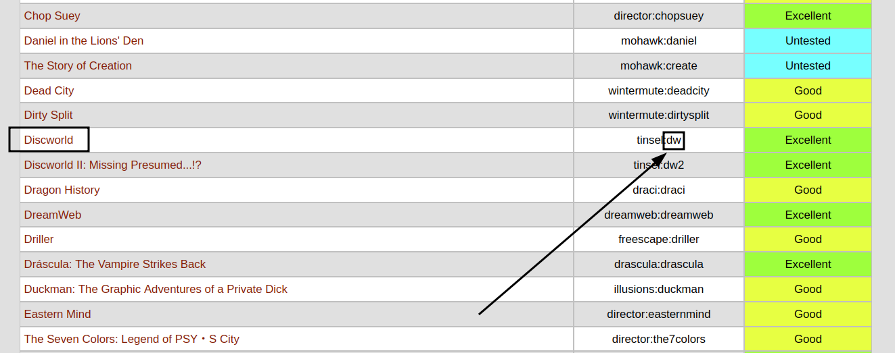
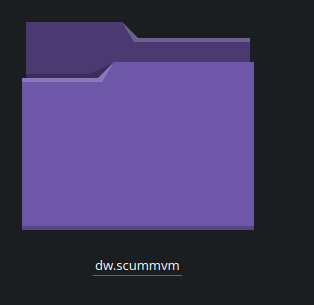
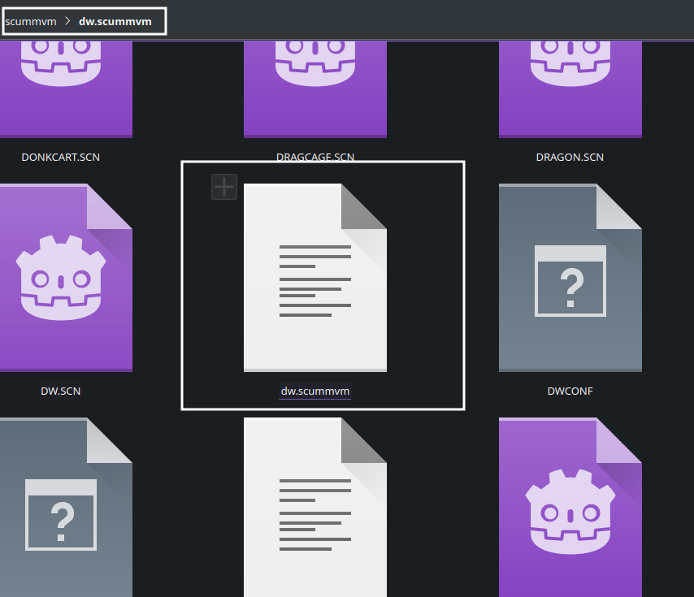
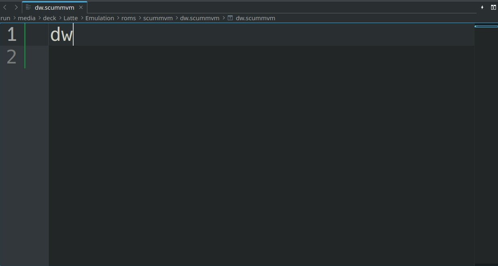

# ScummVM is an application that allows you to play classic point-and-click adventure games and RPGs.

Website: [https://www.scummvm.org/](https://www.scummvm.org/)

Github: [https://github.com/scummvm/scummvm](https://github.com/scummvm/scummvm)

Compatibility List: [https://www.scummvm.org/compatibility/](https://www.scummvm.org/compatibility/)

ScummVM's Wiki: [https://docs.scummvm.org/en/v2.6.0](https://docs.scummvm.org/en/v2.6.0)

***

## ScummVM Table of Contents

1. [Getting Started with ScummVM](#getting-started-with-scummvm)
    - [Configuration](#configuration)
    - [ScummVM Folder Locations](#scummvm-folder-locations)
    - [How to Update ScummVM](#how-to-update-scummvm)
    - [How to Launch ScummVM in Desktop Mode](#how-to-launch-scummvm-in-desktop-mode)
    - [File Formats](#file-formats)

2. [ScummVM Tips and Tricks](#scummvm-tips-and-tricks)
    - [How to Configure ScummVM to Work With Steam ROM Manager](#how-to-configure-scummvm-to-work-with-steam-rom-manager)
    - [How to Configure ScummVM to Work With EmulationStation-DE](#how-to-configure-scummvm-to-work-with-emulationstation-de)

***

## Getting Started with ScummVM
[Back to the Top](#scummvm-table-of-contents)

ScummVM is a fairly straight-forward emulator to set up. Place your ROMs in `Emulation/roms/scummvm`. Read the [Configuration](#configuration) section to learn more about ScummVM and its folder locations. 

To launch your ROMs in game mode, use Steam ROM Manager and use one of the following parsers to play your ScummVM ROMs:

* `EmulationStation-DE`
    * To play ScummVM games in EmulationStation-DE, read: [How to Configure ScummVM to Work With EmulationStation-DE](#how-to-configure-scummvm-to-work-with-emulationstation-de) 
* `ScummVM Flatpak` 
    * To use this parser, read: [How to Configure ScummVM to Work With Steam ROM Manager](#how-to-configure-scummvm-to-work-with-steam-rom-manager)
* `Emulators`

***

### Configuration
[Back to the Top](#scummvm-table-of-contents)

* Type of Emulator: Flatpak
* Config Location: `/home/deck/.var/app/org.scummvm.ScummVM`
* ROM Location: `Emulation/roms/scummvm`
* ScummVM does not need any additional BIOS files or firmware to run
* Saves: `Emulation/saves/scummvm/saves`

**Note:** `~/.var` is an invisible folder by default. In Dolphin (file manager), click the hamburger menu in the top right, click `Show Hidden Files` to see these folders.

#### Works With
* Steam ROM Manager: [How to Configure ScummVM to Work With Steam ROM Manager](#how-to-configure-scummvm-to-work-with-steam-rom-manager)
* EmulationStation-DE: [How to Configure ScummVM to Work With EmulationStation-DE](#how-to-configure-scummvm-to-work-with-emulationstation-de)


***

### ScummVM Folder Locations
[Back to the Top](#scummvm-table-of-contents)

`$HOME/.var/app/org.scummvm.ScummVM`

```
org.scummvm.ScummVM/
├── cache
│   ├── fontconfig
│   ├── scummvm
│   │   ├── icons
│   │   └── logs
│   │       └── scummvm.log
│   └── tmp
├── config
│   ├── pulse
│   │   └── cookie
│   ├── scummvm
│   │   ├── scummvm.ini
│   │   └── scummvm.ini.bak
│   └── user-dirs.dirs
└── data
    └── scummvm
```

***

### File Formats
[Back to the Top](#scummvm-table-of-contents)

**It varies.**

Refer to [https://docs.scummvm.org/en/latest/use_scummvm/game_files.html and https://wiki.scummvm.org/index.php?title=Category:Supported_Games](https://docs.scummvm.org/en/latest/use_scummvm/game_files.html and https://wiki.scummvm.org/index.php?title=Category:Supported_Games) for additional detail. 

***

### How to Update ScummVM
[Back to the Top](#scummvm-table-of-contents)

**How to Update ScummVM**

* Update through `Discover` (Shopping bag icon)
* Through the `Update your Emulators & Tools` section on the `Manage Emulators` page in the `EmuDeck` application


***

### How to Launch ScummVM in Desktop Mode
[Back to the Top](#scummvm-table-of-contents)

**How to Launch ScummVM in Desktop Mode**

* Launch `ScummVM` from the Applications Launcher (Steam Deck icon in the bottom left of the taskbar)
* Launch the script from `Emulation/tools/launchers`, `scummvm.sh`
* Launch the emulator from `Steam` after adding it via the `Emulators` parser in `Steam ROM Manager`


***

## ScummVM Tips and Tricks
[Back to the Top](#scummvm-table-of-contents)

***

### How to Configure ScummVM to Work With Steam ROM Manager
[Back to the Top](#scummvm-table-of-contents)

**Tutorial:**

1. In `Emulation/roms/scummvm`, rename your game folder to `GAMENAME.scummvm` 
    * Use [https://www.steamgriddb.com/](https://www.steamgriddb.com/) to find the game page so Steam ROM Manager can properly scrape art for your game
    * Example:
        * Maniac Mansion: [https://www.steamgriddb.com/game/14212](https://www.steamgriddb.com/game/14212)
            * Name the game folder `Maniac Mansion (1987).scummvm`
2. Repeat for each ScummVM game
3. Your game should now be compatible with Steam ROM Manager

Example: 

**Note:** This method is not compatible with EmulationStation-DE. Read [How to Configure ScummVM With EmulationStation-DE](#how-to-configure-scummvm-to-work-with-emulationstation-de), for more information on how to configure ScummVM ROMs to work with both Steam ROM Manager and EmulationStation-DE. 

***
 
### How to Configure ScummVM to Work With EmulationStation-DE
[Back to the Top](#scummvm-table-of-contents)

For EmulationStation-DE, once you place a compatible ScummVM game in `Emulation/roms/scummvm`, you will need to both create a `.scummvm` file matching the game's short name and rename the game folder to match that `.scummvm` file. 

**Here's How**

1. Open [https://www.scummvm.org/compatibility](https://www.scummvm.org/compatibility), and note down the game's `Short Name` in the `ScummVM ID` column. 
    * You will see two words, `word1:word2`, in the `ScummVM ID` column, the shortname is `word2` 
    * For example: Discworld's `ScummVM ID` is `tinsel:dw`, therefore the shortname is `dw`
        *  
2. In `Emulation/roms/scummvm`, rename your game folder to `shortname.scummvm`
    * Replace `shortname` with the shortname you located in Step 1
    * The folder needs to contain no spaces and all lowercase characters including the file extension `.scummvm`
    * For Example: `dw.scummvm`
        * 
3. In the game folder, right click and create a new text file
4. Name it `shortname.scummvm`, matching the folder name exactly
    * When you create a text file, Linux may attach a `.txt` file extension, replace `.txt` with `.scummvm` if this is the case
    * Replace `shortname` with the shortname you located in Step 1
    * The file needs to match the folder name exactly, no spaces, all lowercase characters including the file extension `.scummvm`
    * For example: `dw.scummvm`, matching the folder example in Step 2
        * 
5. Right click the file you created in Step 4 and open it in Kate or a text editor of your choice
6. Write the `shortname` from Step 1 on a single line. Save and exit the text file
    * For example:
        * 
6. Repeat as needed for each ScummVM game
7. Your game should now show up in and launch directly from EmulationStation-DE
    * To scrape your games, use ScreenScraper instead of TheGamesDB for best results

A few examples using folder visualizations:

`The Dig`

```
dig.scummvm
├── DIG.LA0
├── DIG.LA1
├── DIGMUSIC.BUN
├── dig.scummvm
├── DIGVOICE.BUN
└── VIDEO
```

`Beneath a Steel Sky`

```
sky.scummvm
├── MT32_CONTROL.ROM
├── MT32_PCM.ROM
├── SKY.CPT
├── sky.dnr
├── sky.dsk
└── sky.scummvm
```

`The Neverhood`

```
neverhood.scummvm
├── a.blb
├── c.blb
├── hd.blb
├── i.blb
├── m.blb
├── neverhood.dat
├── neverhood.scummvm
├── s.blb
└── t.blb
```

**Note:** 

* This method is compatible with Steam ROM Manager, but your ROMs may not be parsed  correctly. You may need to create exceptions to properly match your ROMs to their respective SteamGridDB entry. Refer to [How to Fix a Mismatched Entry](../../tools/steamos/steam-rom-manager.md#how-to-fix-a-mismatched-entry) for instructions.
* Refer to [https://gitlab.com/es-de/emulationstation-de/-/blob/master/USERGUIDE.md#scummvm](https://gitlab.com/es-de/emulationstation-de/-/blob/master/USERGUIDE.md#scummvm), for additional detail. 


***