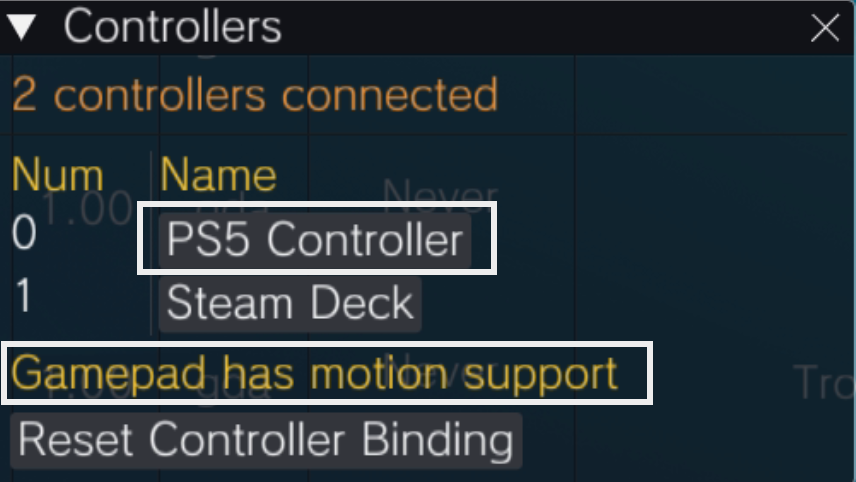
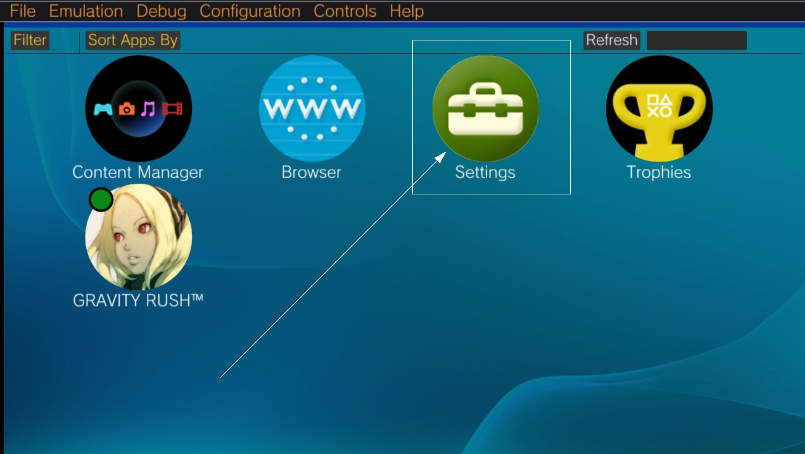

# Vita3K is a Playstation Vita emulator.

Website: [https://vita3k.org/](https://vita3k.org/)

GitHub: [https://github.com/Vita3K/Vita3K](https://github.com/Vita3K/Vita3K)

Compatibility List: [https://vita3k.org/compatibility.html?lang=en](https://vita3k.org/compatibility.html?lang=en)

Quickstart Guide: [https://vita3k.org/quickstart.html](https://vita3k.org/quickstart.html)

***

## Vita3K Table of Contents

1. [Getting Started with Vita3K](#getting-started-with-vita3k)
    - [Configuration](#vita3k-configuration)
    - [Vita3K Folder Locations](#vita3k-folder-locations)
    - [How to Update Vita3K](#how-to-update-vita3k)
    - [How to Launch Vita3K in Desktop Mode](#how-to-launch-vita3k-in-deskop-mode)
    - [File Formats](#vita3k-file-formats)

2. [Vita3K Tips and Tricks](#vita3k-tips-and-tricks)
    - [How to Configure Vita3K to Work With ES-DE and Pegasus](#how-to-configure-vita3k-to-work-with-es-de-and-pegasus)
    - [How to Configure Gyro With External Controllers](#how-to-configure-gyro-with-external-controllers)
    - [How to Install Custom Textures](#how-to-install-custom-textures)
    - [How to Install English Patches](#how-to-install-english-patches)
    - [How to Configure Language Settings](#how-to-configure-language-settings)


***

## Getting Started with Vita3K
[Back to the Top](#vita3k-table-of-contents)

In order to play a game on Vita3K, you will need to install firmware through the Vita3K UI. In desktop mode, open Vita3K, either in the application menu or through its shortcut in `Emulation/tools/launchers/vita3k.sh`. In Vita3K, click  `File`, click `Install Firmware`. Firmware is provided legally by Sony. 

Make sure to check out Vita3K's quickstart guide: [https://vita3k.org/quickstart.html](https://vita3k.org/quickstart.html).

Read the [Configuration](#vita3k-configuration) section to learn more about Vita3K and its folder locations. 

To launch your ROMs in Game Mode, first install your ROMs through Vita3K if you are using the `.zip` or `.pkg` file formats. For more information, see the [File Formats](#vita3k-file-formats) section. Afterwards, you may use Steam ROM Manager and use one of the following parsers to play your PlayStation Vita ROMs:

* `ES-DE`
* `Sony PlayStation Vita Installed PKG` 
* `Emulators`

***

### Vita3K Configuration
[Back to the Top](#vita3k-table-of-contents)

* Type of Emulator: Binary Package
* Config Location: `/home/deck/Applications/Vita3K`
* Executable Location: `/home/deck/Applications/Vita3K/Vita3K`
* Storage Location: `Emulation/storage/Vita3K/ux0`
* ROM Location: `Emulation/roms/psvita/InstalledGames`
    * `InstalledGames` is a symlink to `Emulation/storage/Vita3K/uxo/app`
* Firmware: Install firmware through Vita3K's GUI. Read the [Quickstart Guide](https://vita3k.org/quickstart.html) for a tutorial
* Saves: `Emulation/storage/Vita3K/ux0/user/00/savedata`
    * Save folders correspond to a game's Title ID. To locate your game's Title ID, open Vita3K, right click a game, and click `Information`

#### Works With
* Steam ROM Manager
* ES-DE
    * Refer to [How to Configure Vita3K to Work With ES-DE and Pegasus](#how-to-configure-vita3k-to-work-with-es-de-and-pegasus) for instructions

***

### Vita3K Folder Locations
[Back to the Top](#vita3k-table-of-contents)

These file locations apply regardless of where you chose to install EmuDeck (to your internal SSD, to your SD Card, or elsewhere). Some emulator configuration files will be located on the internal SSD as listed below. 

`$HOME` refers to your home folder. If you are on a Steam Deck, this folder will be named `/home/deck` (you will likely not see `deck` in the file path when navigating using the file manager). 

Paths beginning with `Emulation/..` correspond to your EmuDeck install location. If you installed on an SD Card, your path may be `/run/media/mmcblk0p1/Emulation/roms/..`. If you installed on your internal SSD, your path may be `/home/deck/Emulation/roms/..`

**Note:** Folders with a `.` (`.var`, `.local`, `.config`, etc.) at the beginning are hidden by default. In Dolphin (file manager), click the hamburger menu in the top right, click `Show Hidden Files` to see these folders.

`$HOME/.config/Vita3K`

```
Vita3K/
├── config.yml
└── config.yml.bak
```

`$HOME/.local/share/Vita3K`

```
Vita3K/
├── lang
│   └── user
│       └── PLACE USER LANG HERE.txt
├── textures
│   └── import
│
└── Vita3K
```

`$HOME/.cache/Vita3K`

```
Vita3K
├── shaderlog
├── shaders
└── texturelog
```

`Emulation/storage/Vita3K`

```
Vita3K/
├── gro0
├── grw0
├── host0
├── imc0
├── os0
│   ├── kd
│   ├── sm
│   ├── ue
│   └── us
├── pd0
├── sa0
│   └── data
├── sd0
├── tm0
├── ud0
├── uma0
│   └── data
├── ur0
├── ux0
│   ├── app
│   ├── data
│   ├── license
│   ├── temp
│   ├── theme
│   └── user
│       └──00
│           └──savedata
├── vd0
├── vs0
│   ├── app
│   ├── data
│   ├── sys
│   ├── tool
│   └── vsh
└── xmc0
```


***

### How to Update Vita3K
[Back to the Top](#vita3k-table-of-contents)

**How to Update Vita3K**

* Through the `Update your Emulators & Tools` section on the `Manage Emulators` page in the `EmuDeck` application
* Manual file replacement of `Vita3K` 
    * Refer to [How to Swap Out AppImages and Binaries](../../file-management/steamos/file-management.md#how-to-swap-out-appimages-and-binaries) for instructions

***

### How to Launch Vita3K in Desktop Mode

**How to Launch Vita3K in Desktop Mode**

* Launch `Vita3K Binary` from the Applications Launcher (Steam Deck icon in the bottom left of the taskbar)
* Launch the script from `Emulation/tools/launchers`, `vita3k.sh`
* Launch the binary in `/home/deck/Applications/Vita3K/Vita3K`
* Launch the emulator from `Steam` after adding it via the `Emulators` parser in `Steam ROM Manager`


***

### Vita3K File Formats
[Back to the Top](#vita3k-table-of-contents)

* `.pkg` and `work.bin`
    * Install through Vita3K's GUI
* `.zip`
    * Install through Vita3K's GUI
* Manually decrypted games in the form of a folder
    * Place these folders in `Emulation/roms/psvita/InstalledGames`
* `.vpk`
    * Install through Vita3K's GUI

**Note:** Vitamin dumps (VPK) are not officially supported and may not work as expected. 

To learn how to dump your games, see [https://vita3k.org/quickstart.html](https://vita3k.org/quickstart.html).

***


## Vita3K Tips and Tricks
[Back to the Top](#vita3k-table-of-contents)

***

### How to Configure Vita3K to Work With ES-DE and Pegasus
[Back to the Top](#vita3k-table-of-contents)

**Note:** This section requires you to install your PlayStation Vita games first through Vita3K. At this time, ES-DE and Pegasus only support launching installed PSVita games. 

1. In Desktop Mode, open Vita3K
2. Right click a game of your choice, and click `Copy app info` --> `Title ID`
    * You may also click `Information` to see the `Title ID`
    *  Example 1:
        * 
    * Example 2:
        * 
2. In `Emulation/roms/psvita`, right click, `Create New - Text File`
3. Name it `GAMENAME.psvita`
    * The name of the file is primarily for identifying it in ES-DE and Pegasus and scraping
4. Open the text file in Kate or a text editor of your choice and paste the `Title ID` from Step 1 on a single line
    * Using `Tales of Heart R` as an example: 
        * 
5. Save the text file and exit out
6. Repeat for each PlayStation Vita ROM
7. Your game should now show up in and launch directly from ES-DE and Pegasus

For additional detail, read ES-DE's section on Vita3K: [https://gitlab.com/es-de/emulationstation-de/-/blob/master/USERGUIDE.md#sony-playstation-vita](https://gitlab.com/es-de/emulationstation-de/-/blob/master/USERGUIDE.md#sony-playstation-vita)

***

### How to Configure Gyro With External Controllers
[Back to the Top](#vita3k-table-of-contents)

**Supported Games**

_This list is not comprehensive_

* Assassin's Creed: Liberation
* Borderlands 2 
* Chronovolt
* Criminal Girls 2: Party Favors
* Gravity Rush
* Killzone Mercenary 
* Little Deviants
* Plants vs. Zombies
* Resident Evil: Revelations 2
* Sonic & All-Stars Racing: Transformed
* Super Stardust Delta
* Uncharted Golden Abyss
* VitaQuake

#### Desktop Mode

1. Switch to Desktop Mode
2. Exit out of Steam
    * You may exit out of Steam a couple of different ways:
        * Right click the `Steam` icon in your taskbar and click `Exit Steam`
        * Open Steam, click the `Steam` button in the top left, click `Exit`
        * Open a terminal (Konsole) and enter `killall -9 steam`
        * Do note that clicking the the `X` button in the top right of the Steam window **will not** exit out of Steam
    * Your controls will switch to `Lizard Mode`. Use `L2` to right click, `R2` to left click, and the `Right Trackpad` to move the mouse
    * You may also connect an external keyboard and mouse
2. Click the bluetooth icon in the bottom right of your taskbar and connect your controller
    * 
3. Open Vita3K  
4. Click `Controls` at the top, click `Controllers`
5. Make sure your external controller is listed here and that you see `Gamepad has motion support` at the bottom of this screen
    * 
6. Close out of the controller screen and Vita3K
7. Switch to `Game Mode`

#### Game Mode

1. In Game Mode, connect your controller
2. Select your PlayStation Vita game 
3. On the `Play` screen, select the `Controller` icon to the right of the screen 
    * 
4. Select your controller tab at the top
    * 
5. Click the `Gear` icon to the right, and click `Disable Steam Input`
    * 
    * You may need to restart first for this setting to properly apply
6. Your controller's gyro will now work for this selected game, repeat as needed for your other games

#### Post-Configuration

To restore the default Steam Deck controls:

Once you disconnect your controller, your Steam Deck controls should work again. If you would like your controller to remain connected, you may need to re-enable Steam Input for your controller so you can use the `Re-order Controllers` feature.

**How to Re-Enable Steam Input**

1. Select your PlayStation Vita game 
2. On the `Play` screen, select the `Controller` icon to the right of the screen 
    * 
3. Select your controller tab at the top
    * 
4. Click the `Gear` icon to the right, and click `Enable Steam Input`
    * You may need to restart first for this setting to properly apply
5. The controls will be reverted to Steam Input and the Steam Deck controls will be restored

***

### How to Install Custom Textures
[Back to the Top](#vita3k-table-of-contents)

**Texture Pack Sources**

_This list is not exhaustive_

* [https://old.reddit.com/r/tales/comments/17ogjtr/tales_of_innocence_r_hd_fan_project_english/](https://old.reddit.com/r/tales/comments/17ogjtr/tales_of_innocence_r_hd_fan_project_english/)
    * For updates to this texture pack, you will need to join their Discord. For the link, see the top of the GitHub page: [https://github.com/lifebottle/Tales-of-Innocence-R](https://github.com/lifebottle/Tales-of-Innocence-R)

***


**How to Install Custom Textures**

1. In Desktop Mode, open `/home/deck/.local/share/Vita3K/`
    * `~/.local` is an invisible folder by default, click the `Hamburger` menu in the top right of the file explorer, click `Show Hidden Files`
2. Create a `textures` folder here, casing matters
3. In the `textures` folder, create an `import` folder, casing matters
4. Place your downloaded texture pack folder (containing the texture files) directly in the newly created `import` folder
    * The texture pack folder should match the game's Title ID
        * To locate your game's Title ID, open Vita3K, right click a game, and click `Information`
5. In Desktop Mode, open Vita3K:
    1. At the top, click `Configuration`, `Settings`, `GPU`
    2. Check `Import Textures` under `Texture Replacement`
    3. Click `Save` and close out of the settings menu
        * You may also do this on a per game basis:
            1. Right click the game
            2. Click `Custom Config`, `Create`, `GPU,`
            3. Check `Import Textures` under `Texture Replacement`
            4. Click `Save` and close out of the settings menu  
6. Your texture pack will now be applied

***

### How to Install English Patches
[Back to the Top](#vita3k-table-of-contents)

**English Patch Sources**

_This list is not exhaustive_

* [https://github.com/lifebottle/Tales-of-Innocence-R](https://github.com/lifebottle/Tales-of-Innocence-R)
* [https://gbatemp.net/threads/release-trails-in-the-sky-fc-evolution-english-patch.472727/](https://gbatemp.net/threads/release-trails-in-the-sky-fc-evolution-english-patch.472727/)

***

This section will use the Tales of Innocence R English Patch as an example. Instructions may differ depending on what patch you are using, but generally you will be able to apply the below instructions to any English patch. 

1. In Desktop Mode, open Vita3K and install your game
    * Skip this step if you have already installed your game
2. Download the English patch and extract it to a folder of your choice
    * For Tales of Innocence R English Patch, download the "
toir_patch-DecryptedWithComputer" version from [https://github.com/lifebottle/Tales-of-Innocence-R/releases](https://github.com/lifebottle/Tales-of-Innocence-R/releases)
3. On the Steam Deck, open [https://www.romhacking.net/hash/](https://www.romhacking.net/hash/) on a web browser of your choice
4. If your English patch extracted folder includes a `eboot.xdelta` file:
    1. `ROM Hack:` Click `Browse` and navigate to `Emulation/storage/Vita3K/uxo/app/GAMETITLEID` and select the `eboot.bin` file
        * To locate your game's Title ID, open Vita3K, right click a game, and click `Information`
    2. `Patch File`: Navigate to your extracted English patch folder from Step 2 and select the `eboot.xdelta` file
    3. Click `Apply Patch`, `romhacking.net` will save your patched `eboot.bin` to your `GAMETITLEID` folder
        * If the website saves your file elsewhere, move it to your `GAMETITLEID` folder
    4. Either delete or rename the original `eboot.bin` file and rename the newly patched `eboot (patched).bin` file to `eboot.bin`
4. If your English patch extracted folder includes a `toidata_release.xdelta` file:
    1. `ROM Hack:` Click `Browse` and navigate to `Emulation/storage/Vita3K/uxo/app/GAMETITLEID` and select the `toidata_release.l7c` file
        * To locate your game's Title ID, open Vita3K, right click a game, and click `Information`
    2. `Patch File`: Navigate to your extracted English patch folder from Step 2 and select the `toidata_release.xdelta` file
    3. Click `Apply Patch`, `romhacking.net` will save your patched `toidata_release.l7c` to your `GAMETITLEID` folder
        * If the website saves your file elsewhere, move it to your `GAMETITLEID` folder
    4. Either delete or rename the original `toidata_release.l7c` file and rename the newly patched `toidata_release (patched).l7c` file to `toidata_release.l7c`
5. If your English patch extracted folder includes a `data.psarc.xdelta` file:
    1. `ROM Hack:` Click `Browse` and navigate to `Emulation/storage/Vita3K/uxo/app/GAMETITLEID/gamedata` and select the `data.psarc` file
        * To locate your game's Title ID, open Vita3K, right click a game, and click `Information`
    2. `Patch File`: Navigate to your extracted English patch folder from Step 2 and select the `data.psarc.xdelta` file
    3. Click `Apply Patch`, `romhacking.net` will save your patched `data.psarc` to your `GAMETITLEID` folder
        * If the website saves your file elsewhere, move it to your `GAMETITLEID` folder
    4. Either delete or rename the original `data.psarc` file and rename the newly patched `data (patched).psarc` file to `data.psarc`
6. Your English patch will now be applied

***

### How to Configure Language Settings
[Back to the Top](#vita3k-table-of-contents)

#### UI

1. In Desktop Mode, open Vita3K
2. At the top, click `Configuration`
3. Click `Settings`
4. Click the `GUI` tab
5. To the left of `GUI Language`, select your preferred language in the drop-down menu

#### In-Game

1. In Desktop Mode, open Vita3K
2. Open the `Settings` application, click `Start`
    * The `Settings` application will be in your game list. By default, it will look like a toolbag with a green background
    * 
3. Click `Language`
4. Click `System Language`
5. Select your preferred language in the drop-down menu

***