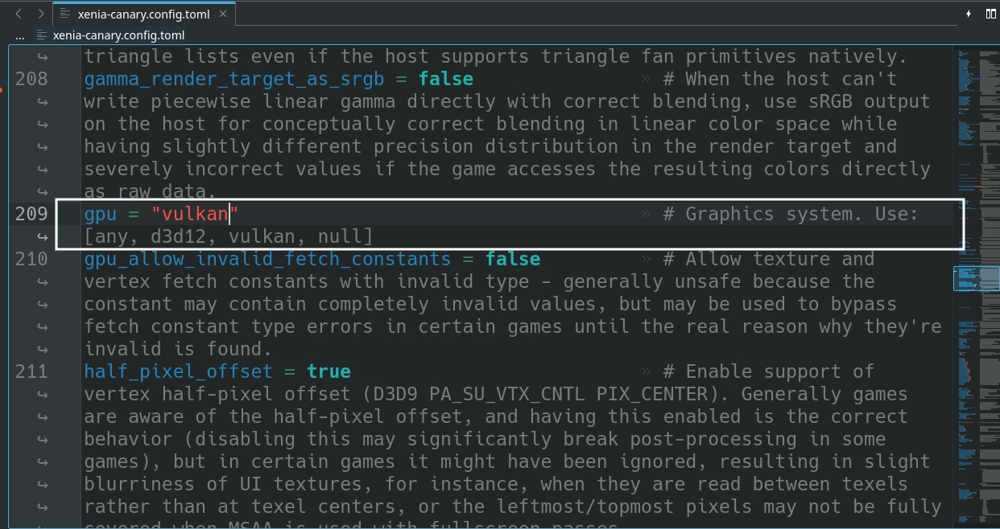
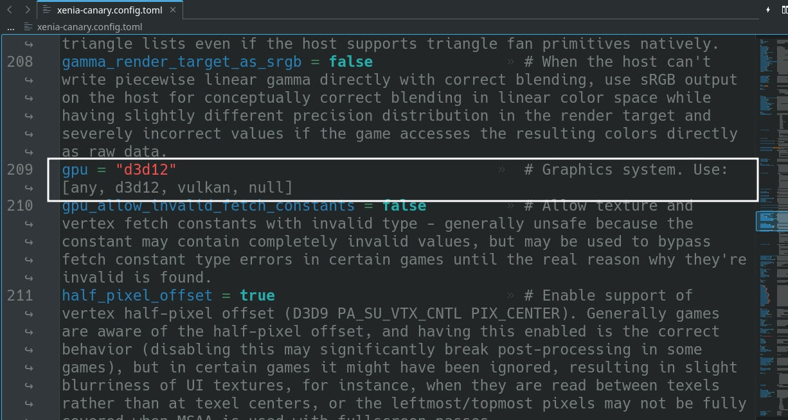
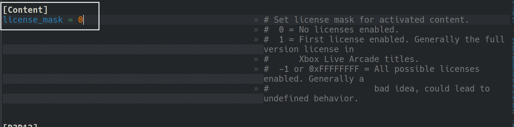
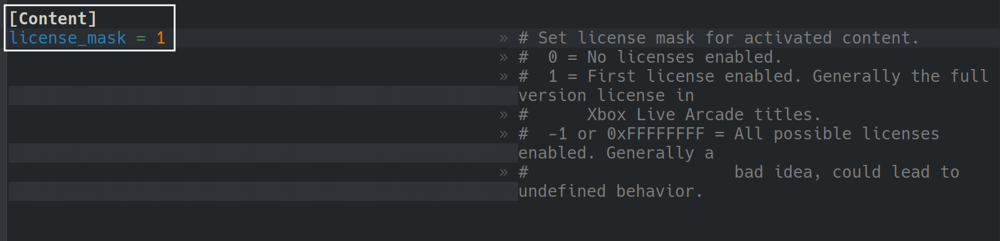

# Xenia is an Xbox 360 Emulator.

Website: [https://xenia.jp/](https://xenia.jp/)

GitHub: [https://github.com/xenia-project/xenia](https://github.com/xenia-project/xenia)

Compatibility List: [https://github.com/xenia-project/game-compatibility/issues](https://github.com/xenia-project/game-compatibility/issues)

Xenia's FAQ: [https://github.com/xenia-project/xenia/wiki/faq](https://github.com/xenia-project/xenia/wiki/faq)

Xenia's Quickstart Guide: [https://github.com/xenia-project/xenia/wiki/Quickstart](https://github.com/xenia-project/xenia/wiki/Quickstart)

**IMPORTANT:** Xenia does not currently run well on Linux/SteamOS. Most games will not boot or will not be playable. This emulator is currently in an experimental state for Linux/SteamOS.

It's HIGHLY recommended to see if a game you wish to emulate has a native PC version on Steam, Lutris, etc. or has a PS3 version than can be run with RPCS3 instead.

***

## Xenia Table of Contents

1. [Getting Started with Xenia](#getting-started-with-xenia)
    - [Configuration](#xenia-configuration)
    - [Xenia Folder Locations](#xenia-folder-locations)
    - [How to Download Xenia](#how-to-download-xenia)
    - [How to Update Xenia](#how-to-update-xenia)
    - [How to Launch Xenia in Desktop Mode](#how-to-launch-xenia-in-desktop-mode)
    - [File Formats](#xenia-file-formats)
    - [Hotkeys](#xenia-hotkeys)
    - [EmuDeck Compatibility List](#emudeck-compatibility-list)

2. [Common Issues](#xenia-common-issues)
    - [The Dangers of Proton](#the-dangers-of-proton)
    - [How to Fix !Status or GPU Command Error Messages](#how-to-fix-status-or-gpu-command-error-messages)

3. [Xenia Tips and Tricks](#xenia-tips-and-tricks)
    - [Troubleshooting Tips](#troubleshooting-tips)
    - [How to Configure Multiplayer](#how-to-configure-multiplayer)
    - [How to Swap Out Xenia Builds](#how-to-swap-out-xenia-builds)
    - [How to Swap Between Vulkan and DX12](#how-to-swap-between-vulkan-and-dx12)
    - [How to Manage Multiple Discs](#how-to-manage-multiple-discs)
    - [How to Set Up Xbox Live Arcade Games](#how-to-set-up-xbox-live-arcade-games)
    - [How to Delete Xenia's Prefix](#how-to-delete-xenias-prefix)
    - [How to Configure Language Settings](#how-to-configure-language-settings)
    - [How to Apply Patches](#how-to-apply-patches)
    - [How to Set Game Settings On a Per-Game Basis](#how-to-set-game-settings-on-a-per-game-basis)
    - [How to Access Xenia Settings in Game Mode](#how-to-access-xenia-settings-in-game-mode)
    - [How to Extract ISOs to the XEX Format](#how-to-extract-isos-to-the-xex-format)
    - [How to Convert Xbox Live Arcade ROMs to XEX](#how-to-convert-xbox-live-arcade-roms-to-xex)
    - [How to Compress ROMs to ZAR](#how-to-compress-roms-to-zar)
    - [How to Optimize Sonic Unleashed](#how-to-optimize-sonic-unleashed)


***

## Getting Started with Xenia
[Back to the Top](#xenia-table-of-contents)

**IMPORTANT:**  Currently, Xbox Live Arcade games have the highest compatibility on Linux/SteamOS. Most Xbox 360 games do not run well on Xenia, on Linux/SteamOS at this time. Xenia does not currently run well on Linux/SteamOS. Most games will not boot or will not be playable. This emulator is currently in an experimental state for Linux/SteamOS.

Xenia is a fairly straight-forward emulator to set up. Place your Xbox 360 ROMs in `Emulation/roms/xbox360/roms` or Xbox Live Arcade ROMs in `Emulation/roms/xbox360/roms/xbla`. No additional setup is required. Read the [Configuration](#xenia-configuration) section to learn more about Xenia and its folder locations.

To launch your ROMs in game mode, use Steam ROM Manager and use one of the following parsers to play your Xbox 360 ROMs:

* `ES-DE`
* `Microsoft Xbox 360 - Xenia`
* `Microsoft Xbox 360 - Xenia - XBLA`
* `Emulators`

***

### Xenia Configuration
[Back to the Top](#xenia-table-of-contents)


* Type of Emulator: Windows Executable through Proton
* Executable Location (Xenia Script): `Emulation/tools/launchers/xenia.sh`
    * Use `xenia.sh` to launch Xenia in Desktop Mode
* Executable Location (Windows EXE): `Emulation/roms/xbox360/xenia_canary.exe`
    * Do not launch Xenia in Desktop Mode with `xenia_canary.exe`
* Config Location: `Emulation/roms/xbox360`
* Xbox 360 ROM Location: `Emulation/roms/xbox360/roms`
    * Note the second `roms` folder in the path
* Xbox Live Arcade ROM Location: `Emulation/roms/xbox360/roms/xbla`
    * Note the second `roms` folder in the path
* BIOS: No BIOS are required to play Xenia
* Saves: `Emulation/roms/xbox360/content`

#### Works With
* Steam ROM Manager
* ES-DE

***

### Xenia Folder Locations
[Back to the Top](#xenia-table-of-contents)

These file locations apply regardless of where you chose to install EmuDeck (to your internal SSD, to your SD Card, or elsewhere). Some emulator configuration files will be located on the internal SSD as listed below. 

`$HOME` refers to your home folder. If you are on a Steam Deck, this folder will be named `/home/deck` (you will likely not see `deck` in the file path when navigating using the file manager). 

Paths beginning with `Emulation/..` correspond to your EmuDeck install location. If you installed on an SD Card, your path may be `/run/media/mmcblk0p1/Emulation/roms/..`. If you installed on your internal SSD, your path may be `/home/deck/Emulation/roms/..`

`Emulation/roms/xbox360`

```
xbox360/
├── cache
│   └── modules
│       ├── 591F88BF31D190A8FC6D34699CD04D6D
│       │   └── executable_addr_flags.bin
│       └── 92894AFA8482EBA139E20552587117
│           └── executable_addr_flags.bin
├── LICENSE
├── patches
│   ├── 415607D3 - Gun.patch.toml
│   ├── 415607DD - Tony Hawk's Project 8.patch.toml
│   ├── 415607F2 - Kung Fu Panda.patch.toml
│   ├── 415607F5 - Bee Movie Game.patch.toml
│   ├── 41560817 - Modern Warfare 2 (TU6).patch.toml
│   ├── 415608AF - GoldenEye 007 Reloaded.patch.toml
│   ├── 415608C5 - Family Guy Back to the Multiverse.patch.toml
│   ├── 41560904 - Transformers-Rise of The Dark Spark.patch.toml
│   ├── 425307D1 - The Elder Scrolls IV Oblivion (GOTY).patch.toml
│   ├── 425307DB - Wet.patch.toml
│   ├── 425307E6 - The Elder Scrolls V Skyrim.patch.toml
│   ├── 434307D4 - Resident Evil 5.patch.toml
│   ├── 43430817 - Asura's Wrath.patch.toml
│   ├── 43430824 - DmC Devil May Cry.patch.toml
│   ├── 43430830 - Lost Planet 3.patch.toml
│   ├── 43430841 - Resident Evil.patch.toml
│   ├── 43430842 - Resident Evil 0.patch.toml
│   ├── 434D0822 - Leisure Suit Larry Box Office Bust.patch.toml
│   ├── 445007EA - Onechanbara Bikini Samurai Squad.patch.toml
│   ├── 454107D9 - Need for Speed Most Wanted (2005).patch.toml
│   ├── 454107F9 - Battlefield Bad Company.patch.toml
│   ├── 45410809 - The Simpsons Game.patch.toml
│   ├── 4541080F - The Orange Box (default.xex).patch.toml
│   ├── 4541080F - The Orange Box (engine_360.dll).patch.toml
│   ├── 4541080F - The Orange Box (shaderapidx9_360.dll).patch.toml
│   ├── 4541080F - The Orange Box (tf-bin-Client_360.dll).patch.toml
│   ├── 45410850 - Mirror's Edge.patch.toml
│   ├── 4541087F - Skate 2.patch.toml
│   ├── 454108D8 - Army of Two The 40th Day.patch.toml
│   ├── 454108E6 - Skate 3.patch.toml
│   ├── 454108EF - Bulletstorm.patch.toml
│   ├── 45410914 - Rock Band 3.patch.toml
│   ├── 45410914 - Rock Band 3 TU5.patch.toml
│   ├── 45410915 - Fight Night Champion (TU0).patch.toml
│   ├── 45410915 - Fight Night Champion (TU1).patch.toml
│   ├── 45410915 - Fight Night Champion (TU2).patch.toml
│   ├── 45410916 - Alice Madness Returns.patch.toml
│   ├── 4541092A - Shadows of the Damned.patch.toml
│   ├── 4541096D - SSX.patch.toml
│   ├── 465307D6 - Armored Core 4 (USA).patch.toml
│   ├── 475007D2 - Hail to the Chimp.patch.toml
│   ├── 475807D1 - Lucha Libre AAA Heroes del Ring.patch.toml
│   ├── 494F07D1 - El Shaddai.patch.toml
│   ├── 4B4E0823 - Silent Hill Downpour.patch.toml
│   ├── 4B4E0823 - Silent Hill Downpour (TU1).patch.toml
│   ├── 4B5607E8 - Dead or Alive 5 Ultimate.patch.toml
│   ├── 4C4107D7 - LEGO Star Wars The Complete Saga.patch.toml
│   ├── 4C4107F3 - LEGO Star Wars III The Clone Wars.patch.toml
│   ├── 4D5307D1 - Project Gotham Racing 3 (v10.0 or higher).patch.toml
│   ├── 4D5307D1 - Project Gotham Racing 3 (v9.0 or lower).patch.toml
│   ├── 4D5307D2 - Kameo Elements of Power.patch.toml
│   ├── 4D5307D2 - Kameo Elements of Power (TU2).patch.toml
│   ├── 4D5307D3 - Perfect Dark Zero.patch.toml
│   ├── 4D5307D3 - Perfect Dark Zero (Platinum Hits).patch.toml
│   ├── 4D5307D3 - Perfect Dark Zero (TU3).patch.toml
│   ├── 4D5307D5 - Gears of War.patch.toml
│   ├── 4D5307D5 - Gears of War (TU5).patch.toml
│   ├── 4D5307DF - Blue Dragon.patch.toml
│   ├── 4D5307DF - ブルードラゴン.patch.toml
│   ├── 4D5307E6 - Halo 3.patch.toml
│   ├── 4D5307ED - Banjo-Kazooie Nuts & Bolts.patch.toml
│   ├── 4D5307ED - Banjo-Kazooie Nuts & Bolts (TU3).patch.toml
│   ├── 4D5307F1 - Fable II (1).patch.toml
│   ├── 4D5307F1 - Fable II (2).patch.toml
│   ├── 4D5307F1 - Fable II (GOTY_Platinum Edition).patch.toml
│   ├── 4D5307F1 - Fable II (GOTY_Platinum Edition, TU1).patch.toml
│   ├── 4D5307F2 - Viva Piñata.patch.toml
│   ├── 4D5307F9 - Project Gotham Racing 4.patch.toml
│   ├── 4D5307FA - Lost Odyssey (NTSC-J).patch.toml
│   ├── 4D5307FA - Lost Odyssey.patch.toml
│   ├── 4D53082D - Gears of War 2.patch.toml
│   ├── 4D53082D - Gears of War 2 (TU6).patch.toml
│   ├── 4D53085B - Halo Reach.patch.toml
│   ├── 4D53085F - Viva Piñata Trouble in Paradise.patch.toml
│   ├── 4D53085F - Viva Piñata Trouble in Paradise (TU1).patch.toml
│   ├── 4D530877 - Halo 3 ODST.patch.toml
│   ├── 4D5308AB - Gears of War 3.patch.toml
│   ├── 4D5308AB - Gears of War 3 (TU6 Disc; TU1 XBL).patch.toml
│   ├── 4D53090E - Kinect Star Wars.patch.toml
│   ├── 4D5309B1 - Halo Combat Evolved Anniversary.patch.toml
│   ├── 4D5309C9 - Forza Horizon (E3 Demo).patch.toml
│   ├── 4D5309C9 - Forza Horizon.patch.toml
│   ├── 4D530A26 - Gears of War Judgment.patch.toml
│   ├── 4D530A26 - Gears of War Judgment (TU4).patch.toml
│   ├── 4D530A87 - Fable Anniversary.patch.toml
│   ├── 4D5387E0 - Kameo Elements of Power (kiosk demo).patch.toml
│   ├── 4D5387E9 - Kameo Elements of Power (demo).patch.toml
│   ├── 4D53880C - Halo 3 Alpha.patch.toml
│   ├── 4D53883A - Halo 3 Epsilon (Aug 20th).patch.toml
│   ├── 4D5388BF - Crackdown 2 Demo.patch.toml
│   ├── 4D5707D7 - Blacksite.patch.toml
│   ├── 4D5707DB - Unreal Tournament 3.patch.toml
│   ├── 4D5707DF - TNA Impact (TU1).patch.toml
│   ├── 4E4D07D3 - Ridge Racer 6.patch.toml
│   ├── 4E4D07F0 - Splatterhouse.patch.toml
│   ├── 4E4D080B - Magnacarta2.patch.toml
│   ├── 534307E2 - Bionicle Heroes.patch.toml
│   ├── 5343080B - Batman Arkham Asylum GOTY.patch.toml
│   ├── 534507D6 - Sonic the Hedgehog (2006).patch.toml
│   ├── 53450812 - Sonic Unleashed.patch.toml
│   ├── 53450812 - Sonic Unleashed (TU2).patch.toml
│   ├── 5345085A - Dreamcast Collection.patch.toml
│   ├── 535107E4 - Final Fantasy XIII.patch.toml
│   ├── 535107E8 - Nier.patch.toml
│   ├── 535107FA - Deus Ex Human Revolution Director's Cut.patch.toml
│   ├── 53510806 - Final Fantasy XIII-2.patch.toml
│   ├── 53518810 - Final Fantasy XIII-2 Demo.patch.toml
│   ├── 544307D5 - Ninja Gaiden II (Japan, TU3).patch.toml
│   ├── 544307D5 - Ninja Gaiden II (World).patch.toml
│   ├── 544307D5 - Ninja Gaiden II (World, TU2).patch.toml
│   ├── 545107D1 - Saints Row.patch.toml
│   ├── 545107D1 - Saints Row (TU1).patch.toml
│   ├── 545107F1 - Ratatouille.patch.toml
│   ├── 545107FC - Saints Row 2.patch.toml
│   ├── 545107FC - Saints Row 2 (TU1).patch.toml
│   ├── 545107FE - DAH Path of the Furon.patch.toml
│   ├── 5451083B - 50 Cent Blood on the Sand.patch.toml
│   ├── 54510850 - SpongeBob - Truth or Square.patch.toml
│   ├── 54510866 - WWE All Stars.patch.toml
│   ├── 545407D4 - Amped 3.patch.toml
│   ├── 545407DF - Table Tennis.patch.toml
│   ├── 545407EE - The Darkness.patch.toml
│   ├── 545407F2 - Grand Theft Auto IV.patch.toml
│   ├── 545407F8 - Midnight Club Los Angeles (Complete Edition).patch.toml
│   ├── 545407F8 - Midnight Club Los Angeles.patch.toml
│   ├── 5454082B - Red Dead Redemption (GOTY, Disc 1).patch.toml
│   ├── 5454082B - Red Dead Redemption (GOTY, Disc 2).patch.toml
│   ├── 5454082B - Red Dead Redemption (Original, NTSC).patch.toml
│   ├── 5454082B - Red Dead Redemption (Original, NTSC, TU9).patch.toml
│   ├── 5454082B - Red Dead Redemption-Undead Nightmare (Platinum Hits).patch.toml
│   ├── 5454085D - Bioshock Infinite.patch.toml
│   ├── 545408A7 - Grand Theft Auto V (TU26).patch.toml
│   ├── 545408A7 - Grand Theft Auto V (TU27).patch.toml
│   ├── 555307DC - Far Cry Instincts Predator.patch.toml
│   ├── 555307E5 - Naruto Rise of a Ninja.patch.toml
│   ├── 5553088C - Far Cry 3.patch.toml
│   ├── 565507D4 - The Bourne Conspiracy.patch.toml
│   ├── 565707D0 - Lollipop Chainsaw.patch.toml
│   ├── 565707D0 - Lollipop Chainsaw (Premium Edition).patch.toml
│   ├── 57520802 - Batman Arkham City GOTY.patch.toml
│   ├── 57520802 - Batman Arkham City (TU6).patch.toml
│   ├── 584107D5 - Small Arms.patch.toml
│   ├── 58410889 - Peggle.patch.toml
│   ├── 584108A9 - Bean (GoldenEye 007).patch.toml
│   ├── 584108D3 - Boogie Bunnies.patch.toml
│   ├── 584108DB - A Kingdom for Keflings.patch.toml
│   ├── 584108F6 - Shadow Complex.patch.toml
│   ├── 58410908 - Gel Set & Match.patch.toml
│   ├── 5841090B - Doritos Dash of Destruction.patch.toml
│   ├── 58410954 - Banjo-Kazooie.patch.toml
│   ├── 58410955 - Banjo-Tooie.patch.toml
│   ├── 58410968 - Outrun Online Arcade.patch.toml
│   ├── 5841096A - Hydro Thunder Hurricane.patch.toml
│   ├── 584109FF - Plants vs. Zombies.patch.toml
│   ├── 58410A34 - Crazy Taxi.patch.toml
│   ├── 58410A39 - Space Channel 5 Part 2.patch.toml
│   ├── 58410A70 - Harm's Way.patch.toml
│   ├── 58410B00 - Dead Rising 2 Case West.patch.toml
│   ├── 584111E8 - State of Decay (TU5).patch.toml
│   ├── 584111F7 - Minecraft (XBLA, TU0).patch.toml
│   ├── 584111F7 - Minecraft (XBLA, TU1).patch.toml
│   ├── 584111F7 - Minecraft (XBLA, TU2).patch.toml
│   ├── 584111F7 - Minecraft (XBLA, TU3).patch.toml
│   ├── 584111F7 - Minecraft (XBLA, TU4).patch.toml
│   ├── 5841124F - Doritos Crash Course 2.patch.toml
│   └── 58411436 - Peggle 2.patch.toml
├── portable.txt
├── recent.toml
├── roms
│   └── xbla
├── xenia-canary.config.toml
├── xenia_canary.exe
├── xenia.config.toml
└── xenia.log
```

***

### How to Download Xenia
[Back to the Top](#xenia-table-of-contents)

Xenia cannot be installed on your initial installation of EmuDeck. It can only be installed through the `Manage Emulators` page. It is recommended to not follow online guides if you intend on using EmuDeck's set-up. Any deviations from EmuDeck configurations to Steam ROM Manager, or Xenia's general set-up **will not** be supported.

**Here's How to Download Xenia**

1. In Desktop Mode, open the EmuDeck application
2. Click the `Manage Emulators` button
3. Click `Xenia`
4. Click `Install`
    * 
5. Xenia will be installed to `Emulation/roms/xbox360`
    * Place your Xbox 360 ROMs in `Emulation/roms/xbox360/roms` and Xbox Live Arcade ROMs in `Emulation/roms/xbox360/roms/xbla`

**No** additional setup is required with Steam ROM Manager and ES-DE. If you do not have the latest Steam ROM Manager configurations, either run a `Custom Reset` or click the `Reset configuration` button on the Steam ROM Manager page within the EmuDeck application.

***

### How to Update Xenia
[Back to the Top](#xenia-table-of-contents)

**How to Update Xenia**

* Through the `Update your Emulators & Tools` section on the `Manage Emulators` page in the `EmuDeck` application
* Manual file replacement of `xenia_canary.exe`
    * Refer to [How to Swap Out Xenia Builds](#how-to-swap-out-xenia-builds) for instructions

***

### How to Launch Xenia in Desktop Mode
[Back to the Top](#xenia-table-of-contents)

**How to Launch Xenia in Desktop Mode**

* Launch `xenia (Proton)` from the `Applications Launcher` (Steam Deck icon in the bottom left of the taskbar)
* Launch the script from `Emulation/tools/launchers`, `xenia.sh`
* Launch the emulator from `Steam` after adding it via the `Emulators` parser in `Steam ROM Manager`

***

### Xenia File Formats
[Back to the Top](#xenia-table-of-contents)

* .iso
* .xex
* No file extension
    * For Xbox Live Arcade Games

***

### Xenia Hotkeys
[Back to the Top](#xenia-table-of-contents)

N/A

***

### EmuDeck Compatibility List
[Back to the Top](#xenia-table-of-contents)

Currently, Xbox Live Arcade games have the highest compatibility on Linux/SteamOS. Most Xbox 360 games do not run well on Xenia, on Linux/SteamOS at this time.

Check the EmuDeck community compatibility list to see what Xbox 360 games run well on the Steam Deck (on SteamOS): [https://docs.google.com/spreadsheets/d/1fRqvAh_wW8Ho_8i966CCSBgPJ2R_SuDFIvvKsQCv05w/edit#gid=1989583881](https://docs.google.com/spreadsheets/d/1fRqvAh_wW8Ho_8i966CCSBgPJ2R_SuDFIvvKsQCv05w/edit#gid=1989583881).

To submit games to the EmuDeck community compatibility list: [https://docs.google.com/forms/d/e/1FAIpQLScavGFOuGpEVpyHdRVcPjdrCEquG9ItBaloa8Q0XaiNlu_Afg/viewform](https://docs.google.com/forms/d/e/1FAIpQLScavGFOuGpEVpyHdRVcPjdrCEquG9ItBaloa8Q0XaiNlu_Afg/viewform).


***

## Xenia Common Issues
[Back to the Top](#xenia-table-of-contents)

***

### The Dangers of Proton
[Back to the Top](#xenia-table-of-contents)

**IMPORTANT:**

**DO NOT set Proton Compatibity on Xenia or Xenia games added to Steam.** Do NOT set `STEAM_COMPAT_MOUNTS` in parameters.

**Turning on Proton is not necessary because EmuDeck created a custom script to launch Xenia through Proton. Turning on Proton through Steam breaks EmuDeck's custom script.**

Do not open the `Compatibility` screen in `Game Mode`. Do not touch any of the settings on the `Compatibility` screen in `Game Mode`.


***

### How to Fix !Status or GPU Command Error Messages
[Back to the Top](#xenia-table-of-contents)

If you get an error message with either `!Status` or `GPU Commands`, you can try one of the below solutions:

* Update Xenia to the latest version. This issue was fixed on December 5th, 2023. For more information, see [https://github.com/xenia-canary/xenia-canary/issues/158](https://github.com/xenia-canary/xenia-canary/issues/158)
* Try DX12. Recent updates have massively improved compatibility with DX12. Currently, EmuDeck sets Vulkan as the default. See [How to Swap Between Vulkan and DX12](#how-to-swap-between-vulkan-and-dx12) to learn how to swap between the two 

However, do keep in mind that the above solutions are **not** guaranteed to fix your issue. Xenia on Linux, through Proton, is still in a highly experimental state. Many games do not work. Xbox Live Arcade Games currently have the highest compatibility. 

***

## Xenia Tips and Tricks
[Back to the Top](#xenia-table-of-contents)

***

### Troubleshooting Tips
[Back to the Top](#xenia-table-of-contents)

* As a first step, Reset Xenia on the Manage Emulators page in the EmuDeck application
* If you get a Wine related error, make sure your ROMs are in `Emulation/roms/xbox360/roms` or `Emulation/roms/xbox360/roms/xbla`, **not** `Emulation/roms/xbox360`
* If you are getting a `!Status or GPU Command Error Messages`, read [How to Fix !Status or GPU Command Error Messages](#how-to-fix-status-or-gpu-command-error-messages)
* If you are still on an older version of Xenia, try updating to the latest version and use DX12 instead of Vulkan, see [How to Swap Between Vulkan and DX12](#how-to-swap-between-vulkan-and-dx12)
* If Xenia was working perfectly fine and suddenly stopped working, see [How to Delete Xenia's Prefix](#how-to-delete-xenias-prefix)
* If you are noticing game specific issues, search for your game on Xenia's game compatibility database, [https://github.com/xenia-project/game-compatibility/issues](https://github.com/xenia-project/game-compatibility/issues) and see if users have suggested any solutions
    * If you need to make any edits to the configuration file, open `xenia-canary.config.toml` in `Emulation/roms/xbox360`
* If you are playing Xbox Live Arcade Games, make sure to read [How to Set Up Xbox Live Arcade Games](#how-to-set-up-xbox-live-arcade-games)

***

### How to Configure Multiplayer
[Back to the Top](#xenia-table-of-contents)

Multiplayer for Xenia is configured out of the box, no additional configuration is needed. 

You may need to re-arrange the controller order in Game Mode for your controllers to function as expected. See [How to Re-Arrange the Controller Order](../../controls-and-hotkeys/steamos/external-controllers.md#how-to-re-arrange-the-controller-order) for more information.

***

### How to Swap Out Xenia Builds
[Back to the Top](#xenia-table-of-contents)

Xenia, through Proton/Wine, is currently in an experimental state. Updates may break or affect the emulator in unexpected ways. If an update does break certain games launching from Xenia, it is easy to swap out the build for an older one so you can continue playing.

This section will go over how to swap out the latest build of Xenia Canary for `e9d1e51_canary_experimental` as an example. However, you can take what is written here and apply it to any build of Xenia Canary as well.

**Tutorial**

1. In Desktop Mode, download `xenia_canary.zip` from: [https://github.com/xenia-canary/xenia-canary/releases/tag/e9d1e51](https://github.com/xenia-canary/xenia-canary/releases/tag/e9d1e51)
2. Extract the zip file to a folder of your choice
3. Copy or move `xenia_canary.exe` in the newly extracted folder to `Emulation/roms/xbox360` and overwrite the pre-existing `xenia_canary.exe`
4. To test, you can open Xenia by launching `xenia.sh` from `Emulation/tools/launchers` or `xenia (Proton)` from the applications launcher in the bottom left
5. Xenia will now be using your swapped out build. However, you can update to the latest build at any time through EmuDeck

**Visual Tutorial**

<figure class="video_container">
  <video controls="true" allowfullscreen="true">
    <source src="/videos/how-to-swap-out-xenia-builds.mp4" type="video/mp4">
  </video>
</figure>

***

### How to Swap Between Vulkan and DX12
[Back to the Top](#xenia-table-of-contents)

Recent (as of August 2023) updates of Proton Experimental increased compatibility for DX12. These updates allow more games to boot through Xenia using DX12. At the moment, EmuDeck sets Xenia to Vulkan by default, but swapping between the two is fairly easy.

**Here's How**

1. Open `Emulation/roms/xbox360`
2. Right click `xenia-canary.config.toml` and click `Open with Kate` or a text editor of your choice
3. Locate the `gpu = ""` line
    * By default through EmuDeck, this line should write `gpu = "vulkan"`
4. To swap between Vulkan and DX12, select one of the two below and write it on the `gpu=""` line:
    * Vulkan:
        * `gpu = "vulkan"`
    * DX12:
        * `gpu ="d3d12"`
    * `"vulkan"` and `"d3d12"` must be in quotes

**Photos**

Vulkan:



DX12:



**Video**

<figure class="video_container">
  <video controls="true" allowfullscreen="true">
    <source src="/videos/how-to-swap-between-vulkan-and-dx12.mp4" type="video/mp4">
  </video>
</figure>

***

### How to Manage Multiple Discs
[Back to the Top](#xenia-table-of-contents)

Xenia does not support M3U files. 

Xbox 360 Multi-disc games are not all the same. Some Xbox 360 multi-disc games may contain the disc content on Disc 1 and optional content on Disc 2, allowing you to complete the entire game using only Disc 1. Some Xbox 360 multi-disc games are split in parts, requiring you to use all included discs to complete the game. Some may contain the entire game on Disc 1 and allow you to install additional content from the other discs, similar to DLC. 

#### Xbox 360 Games With Optional Content on Separate Discs

You can treat each disc as separate "games", and only need Disc 1 to complete the full base game. 

**List of Games**

* Red Dead Redemption
    * The entire base game is on Disc 1 and the Undead Nightmare DLC and multiplayer are on Disc 2

#### Xbox 360 Games With Split Parts on Each Disc

Xenia Canary will prompt you to select the next disc after you complete one disc. If you are using Steam ROM Manager, you may elect to only parse Disc 1 and hide any additional discs, see [How to Manage ROMs with Multiple Discs](../../tools/steamos/steam-rom-manager.md#how-to-manage-roms-with-multiple-discs) to learn how.

**List of Games**

* Lost Odyssey
    * Each disc contains a portion of the full content     

#### Xbox 360 Games With Installable Content on Additional Discs

To download the content on the additional discs and use it on the base disc , you will need to install them and treat them as "DLC". Xenia does not have a way of directly supporting this yet. There may be other ways to accomplish installing the additional content, but this wiki will not cover those methods. 

**List of Games**

* Call of Duty: Advanced Warfare

***

### How to Set Up Xbox Live Arcade Games
[Back to the Top](#xenia-table-of-contents)

#### File Format

Xbox Live Arcade ROMs typically come in nested folders with an alphanumerically named file. 

For example, Banjo Kazooie:

```
Banjo Kazooie
└── 58410954
    └── 000D0000
        └── DA78E477AA5E31A7D01AE8F84109FD4BF89E49E8
```

The `DA78E477AA5E31A7D01AE8F84109FD4BF89E49E8` file is the game file used to launch Banjo Kazooie. 

To make this format easier to use with both Steam ROM Manager and ES-DE, rename the game file to match the game name. Using Banjo Kazooie as an example, rename `DA78E477AA5E31A7D01AE8F84109FD4BF89E49E8` to `Banjo Kazooie`. 

Move the newly renamed `Banjo Kazooie` file to `Emulation/roms/xbox360/roms/xbla`. **Note the second roms folder.** 

Use the `Microsoft Xbox 360 - Xenia - XBLA` parser in Steam ROM Manager or ES-DE to play your game. You **do not** need any of the additional folders included with the original ROM. You may delete these folders.  

#### Xenia Configuration

In order to play Xbox Live Arcade Games, you also need the full license. Xenia makes activating this license fairly easy.

**Here's How**

1. Open `Emulation/roms/xbox360`
2. Right click `xenia-canary.config.toml` and click `Open with Kate` or a text editor of your choice
3. Locate the `license_mask = ` line
    * By default, this line should write `license_mask = 0`
4. To activate Xbox Live Arcade ROMs, change the `0` to a `1`:
    * `license_mask = 1`

**Photos**

Unactivated License:



Activated License:




***

### How to Delete Xenia's Prefix
[Back to the Top](#xenia-table-of-contents)

Since Xenia is packaged as a Windows application and has no Linux version widely available, EmuDeck downloads and runs Xenia through Proton using a script. All of Xenia's important files (saves and configurations) are localized to Xenia's folder in `Emulation/roms/xbox360`. 

However, running Xenia through Proton will still create a prefix (a sort of Windows virtual C:Drive). If you notice Xenia suddenly stops working (after it was previously working), you may try deleting the prefix. Deleting the prefix will not delete any of your saves or configurations since these are localized to the `Emulation/roms/xbox360` folder.

**IMPORTANT:** If you changed Xenia's Proton version in `Emulation/tools/launchers/xenia.sh`, and notice Xenia suddenly stops working, it's recommended to delete the prefix. Deleting the prefix will "flush" Xenia and give it a clean slate (while retaining saves and configurations) with your newly selected Proton version. 

#### How to Delete Xenia's Prefix

1. In Desktop Mode, open Xenia
    * [How to Launch Xenia in Desktop Mode](#how-to-launch-xenia-in-desktop-mode)
    * It does not matter if Xenia actually opens on this step. If opening Xenia does not do anything, proceed to Step 2
2. Open the `Emulation/tools` folder
3. Right click `proton-launch.log` and click `Open with Kate` or a text editor of your choice
4. Locate the `PFX: ` line
    * For example: `PFX: /home/deck/.local/share/Steam/steamapps/compatdata/3322499838`
5. Navigate to the path on the `PFX: ` line in Dolphin
6. Delete the numerical folder at the end of the path
    * For example, with `PFX: /home/deck/.local/share/Steam/steamapps/compatdata/3322499838`, delete the folder named `3322499838` in `/home/deck/.local/share/Steam/steamapps/compatdata`
7. Re-open Xenia in Desktop Mode to re-generate the prefix
8. Close out of Xenia and you may continue playing in Game Mode

***

### How to Configure Language Settings
[Back to the Top](#xenia-table-of-contents)

#### In-Game

1. In Desktop Mode, open the `Emulation/roms/xbox360` folder
2. Right click `xenia-canary.config.toml` and click `Open with Kate` or a text editor of your choice
3. Scroll down to the `XConfig` section, locate `user_language = 1`
4. Replace `1` with your preferred language:
    * 1=en  
    * 2=ja  
    * 3=de  
    * 4=fr  
    * 5=es  
    * 6=it  
    * 7=ko  
    * 8=zh
    * 9=pt 
    * 11=pl 
    * 12=ru 
    * 13=sv 
    * 14=tr 
    * 15=nb 
    * 16=nl 
    * 17=zh
5. Save and exit out of the text file

***

### How to Apply Patches
[Back to the Top](#xenia-table-of-contents)

When you install Xenia through EmuDeck, a collection of game patches are also automatically downloaded to your `Emulation/roms/xbox360/patches` folder. These patches provide ways to fix various issues in games. 

**To apply patches:**

1. In Desktop Mode, open the `Emulation/roms/xbox360/patches` folder
2. Right click a text file matching your game name or game ID and click `Open with Kate` or a text editor of your choice
3. Each text file will typically have multiple patches identified with the `[[patch]]` header and the name of the patch below the header. Select a patch to enable and locate the `is_enabled` field
4. On the `is_enabled` field, change `false` to `true`
5. Save the text file and exit out
6. The patch you selected will now be applied for your game

Do note that if your game ID does not match the ID in the patch, the patch may not apply. Game IDs typically vary depending on the region or version of your game. For example, the patches folder contains multiple patch files for "Project Gotham Racing" depending on which version of the game you have. Ensure that your game version matches the patch file you are using and the patch will successfully apply to your game. 

***

### How to Set Game Settings On a Per-Game Basis
[Back to the Top](#xenia-table-of-contents)

For a full list of Xenia configurations, see [https://github.com/xenia-canary/xenia-canary/wiki/Options](https://github.com/xenia-canary/xenia-canary/wiki/Options).

Depending on which front-end you are using, the below sections will cover how to apply the Xenia configurations as flags for your games. To convert these configurations into flags, remove any spaces and add two dashes to the beginning of the config name. 

A few examples:

**Xenia Config**

`license_mask = #`

`user_language = #`

`gpu = string`

`mount_cache = bool`

**Xenia Flag**

In order to enable license mask:

* `--license_mask=1` 

To set Polish as the language:

* `--user_language=11`

To set the GPU as vulkan:

* `--gpu="vulkan"`

To enable mount_cache:

* `--mount_cache=true`

#### ES-DE

1. In Desktop Mode, open the `Emulation/roms/xbox360/roms` folder or `Emulation/roms/xbox360/roms/xbla` folder
2. Right click anywhere in the folder, click `Create New --> Text File`
3. Match the name of the text file to the game and set the file extension to `.esprefix`
    * For example: 
        * ROM Name: `Peggle`
        * New text file name: `Peggle.esprefix`
4. Open the newly created text file in Kate or a text editor of your choice
5. On a single line, write: 
    * `--configname=configvalue`
        * For example:
            * `--license_mask=1`
            * `--user_language=11`
            * `--gpu="vulkan"`
            * `--mount_cache=true`
6. The config you set will now be applied to this specific game in ES-DE

#### Pegasus

1. In Desktop Mode, open the `Emulation/roms/xbox360/roms` folder
2. Right click `metadata.txt`, click `Open with Kate` or a text editor of your choice
3. At the bottom of the text file, add a new section using the following format:

        game: GAMENAME
        file: FILENAME
        launch: /PATH/TO/xenia.sh "Z:{file.path}" --CONFIGNAME=CONFIGVALUE

4. Replace GAMENAME with the name of the game
    * For example:
        * `Banjo-Kazooie - Nuts & Bolts`
5. Replace FILENAME with the file name
    * For example:
        * `Banjo-Kazooie - Nuts & Bolts.iso`
    * If your ROM is in `Emulation/roms/xbox360/roms/xbla`, write `xbla/FILENAME`
        * For example:
            * `xbla/Peggle`
6. Edit `/PATH/TO` with the path to `xenia.sh`, the path for `xenia.sh` will be at the top of the `metadata.txt` file, you may copy it here
7. Edit `--CONFIGNAME=CONFIGVALUE` with your preferred configuration
    * For example:
        * `--license_mask=1`
        * `--user_language=11`
        * `--gpu="vulkan"`
        * `--mount_cache=true`
8. Save and exit out of the file
9. The config you set will now be applied to this specific game in Pegasus

#### Steam Shortcuts through Steam ROM Manager

1. Add your ROMs to Steam through Steam ROM Manager
2. On the game page in Steam, click the `Gear` icon, click `Properties`
3. In the `Launch Options` box, type `--CONFIGNAME=CONFIGVALUE`
    * For example:
        * `--license_mask=1`
        * `--user_language=11`
        * `--gpu="vulkan"`
        * `--mount_cache=true`
4. The config you set will now be applied to this specific game in Steam

***

### How to Access Xenia Settings in Game Mode
[Back to the Top](#xenia-table-of-contents)

If you added Xenia as a shortcut to Steam through the "Emulators" parser in Steam ROM Manager, you may notice that it launches into a black screen if you try to open it in Game Mode. This is a quirk of how Proton interacts with Game Mode. However, there is a workaround. 

#### How to Access Xenia Settings in Game Mode

1. On the Xenia shortcut in Game Mode, press the `Controller` icon
2. Toggle `Enable Back Grip Buttons` if they are not already enabled
3. Select one of the four back buttons and bind it using sub-commands to one of the below keyboard shortcuts depending on which setting you would like to open in Xenia. For instructions on sub-commands, see [How to Bind Sub-Commands](#how-to-bind-sub-commands)
    * `Alt` + `F` = File   
        * The "File" menu is used to launch games
    * `Alt` + `G` = CPU
    * `Alt` + `H` = GPU

#### How to Bind Sub-Commands

1. Click on one of the four back buttons, bind it to `Alt`
2. Click the `Gear` icon to the right of the button, click `Add sub command`
3. Bind it to the corresponding letter in the list above, [How to Access Xenia Settings in Game Mode](#how-to-access-xenia-settings-in-game-mode-1) depending on which setting you would like to open in Xenia


***

### How to Extract ISOs to the XEX Format
[Back to the Top](#xenia-table-of-contents)

If you have an Xbox 360 ISO and you would like to extract it to XEX, either for compression or for modding purposes, you can do so using `extract-xiso`, a tool bundled with EmuDeck.

1. In Desktop Mode, open the `Emulation/tools/chdconv` folder
2. If you are not comfortable with a terminal, copy `extract-xiso` to `Emulation/roms/xbox360/roms`
    * If you are comfortable with a terminal, right click anywhere in `Emulation/tools/chdconv`, click `Open Terminal Here`, type `./extract-xiso "/PATH/TO/ROM"`
3. In `Emulation/roms/xbox360/roms`, right click anywhere, click `Open Terminal Here`
4. Type `./extract-xiso "NAMEOFROM"` 
    * The quotes are required for the ROM name. Alternatively, you can type the first few letters of the ROM name, press `Tab` on a keyboard, and the terminal will automatically escape the rest of the name
5. Wait for it to finish extracting
6. A folder matching your ROM name will be created containing a `default.xex` file which can be used to launch the ROM


***

### How to Convert Xbox Live Arcade ROMs to XEX
[Back to the Top](#xenia-table-of-contents)

If you have an Xbox 360 ISO and you would like to extract it to XEX, either for compression or for modding purposes, you can do so using the Xenia GUI.

1. In Desktop Mode, open Xenia
2. In the top left, click `File`, `Install Content`, and navigate to your Xbox Live Arcade ROM
3. The game will be installed to the `Emulation/roms/xbox360/content` folder to a folder matching the Game ID of the game
4. The folder will contain a `default.xex` file which can be used to launch the ROM

***

### How to Compress ROMs to ZAR
[Back to the Top](#xenia-table-of-contents)

ZAR is a newer file format created by the Cemu developers allowing for optimized file storage. In a recent update, Xenia added support for ZAR allowing users to compress Xbox 360 ROMs.

As an example, `Banjo-Kazooie - Nuts & Bolts` in the ISO file format was 7.3 GB. When compressed, `Banjo-Kazooie - Nuts & Bolts` was 4.8 GB in the ZAR file format. 

If you are using ISOs, first extract your ISOs to XEX. For instructions, see [How to Extract ISOs to the XEX Format](#how-to-extract-isos-to-the-xex-format). For Xbox Live Arcade ROMs, see [How to Convert Xbox Live Arcade ROMs to XEX](#how-to-convert-xbox-live-arcade-roms-to-xex).

1. In Desktop Mode, open Xenia
2. In the top left, click `Zar Package`, `Create`, and navigate to folder containing your `default.xex` file
3. Select the destination for your ZAR file
4. Wait, there may not be any response from the application for several minutes depending on how large your original file is 
5. Once it is complete, a ZAR file will be located in the directory you selected in Step 3

***

### How to Optimize Sonic Unleashed
[Back to the Top](#xenia-table-of-contents)

This section is a heavily modified version of the section from [THE DEFINITIVE STEAM DECK SONIC DOC](https://docs.google.com/document/d/1FsjXbyYQTIK9f9P_NYHoLGnv8_ZqHjgLPf9Qm0VMcVo/edit#heading=h.cropilw5ikhb). 

This section will assume you have installed and configured Xenia through EmuDeck. For instructions on how to install Xenia through EmuDeck, see [How to Download Xenia](#how-to-download-xenia).

1. Extract Sonic Unleashed using the instructions in [How to Extract ISOs to the XEX Format](#how-to-extract-isos-to-the-xex-format)
2. Install Xenia through EmuDeck
    * For instructions, see [How to Download Xenia](#how-to-download-xenia)
    * EmuDeck will automatically download the patches folder and create a `portable.text` file. You do not need to add Xenia as a non-Steam game. If you would like to add Xenia to Steam, you may do so using the `Emulators` parser in Steam ROM Manager
3. In `Emulation/roms/xbox360`, right click `xenia-canary.config.toml`, click `Open with Kate` or a text editor of your choice
4. Change `max_queued_frames` to `16`, change `vsync` from `True` to `False`
    * The Google Doc also suggests you use `Vulkan`, however `D3D12` been massively improved in the year since the Google Doc was written. It is recommended you use `D3D12` first and only try `Vulkan` if `D3D12` does not work as expected
    * It may not be necessary to change `Vsync` or `max_queued_frames`, these are directly copied from the Google Doc. It is recommended you test these and see if these are required
4. The remainder of the Google Doc covers how to mod Sonic Unleashed using the Unleashed Mod Manager. At this point, it is recommended you first test the game to test the performance. If you would like to use the Unleashed Mod Manager, proceed to the [Unleashed Mod Manager](#unleashed-mod-manager) section

#### Unleashed Mod Manager

##### Lutris

1. In Desktop Mode, open Konsole
2. Enter:
    * `mkdir -p $HOME/Games/Lutris/UnleashedModManager/pfx`
    * This command will create a couple of **empty** folders to make managing and installing the patcher easier
3. Download UnleashedModManager, [https://github.com/hyperbx/Unleashed-Mod-Manager/releases/tag/1.12](https://github.com/hyperbx/Unleashed-Mod-Manager/releases/tag/1.12) to `/home/deck/Games/Lutris/UnleashedModManager`
    * Download `latest.zip`
4. Right click `latest.zip`, click `Extract`, `Extract Archive Here`
    * If the `.zip` creates a subfolder, move the contents out directly into `/home/deck/Games/Lutris/UnleashedModManager`
5. In Desktop Mode, open Discover and download Lutris
6.  Click the `Wine` button on the left, click the little page icon to the right, download `wine-ge-8-26`
7. Click the `+` button in the top left of the Lutris application
8. Click `Add locally installed game`
    * On the `Game Info` tab:
        * Name: Unleashed Mod Manager
        * Sort Name: Leave Blank
        * Runner: Wine (Runs Windows games)
        * Release Year: Leave Blank
    * On the `Game Options` tab:
        * Executable: Click the `Browse` button and navigate to the `Unleashed Mod Manager.exe` file in `/home/deck/Games/Lutris/UnleashedModManager`
        * Arguments: Leave Blank
        * Working Directory: Leave Blank
        * Wine Prefix: Click the `Browse` button and select the `/home/deck/Games/Lutris/UnleashedModManager/pfx`
    * On the `Runner options` tab:
        * Wine version: `wine-ge-8.26-x86_64`
        * Leave everything else at defaults
9. Click the `Save` button in the top right
10. To open the patcher, open Lutris, select the UnleashedModManager tile, and click `Play`

##### Applying the AMD Grass Explosion Fix 

1. In `Emulation/roms/xbox360`, create a `mods` folder
2. Download the AMD Grass Explosion Fix, [https://gamebanana.com/mods/download/393182#FileInfo_840774](https://gamebanana.com/mods/download/393182#FileInfo_840774) to the `Emulation/roms/xbox360/mods` folder
3. Right click `amd_grass_fix.7z`, click `Extract archive here`
4. Open `Unleashed Mod Manager.exe` through Lutris
    * Mods Directory: `Emulation/roms/xbox360/mods`
    * Game Executable: The `default.xex` file in the folder wherever you extracted your Sonic Unleashed ISO
    * Emulator Executable: `Emulation/roms/xbox360/xenia_canary.exe`
5. Click `Continue`, click `Refresh Mods List` and the `AMD Grass Explosion Fix` will appear
6. Check the mod and it will now be applied to Sonic Unleashed

***
