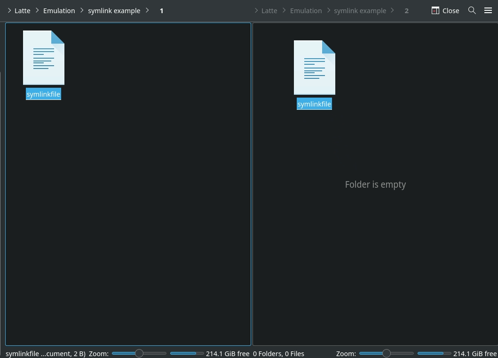
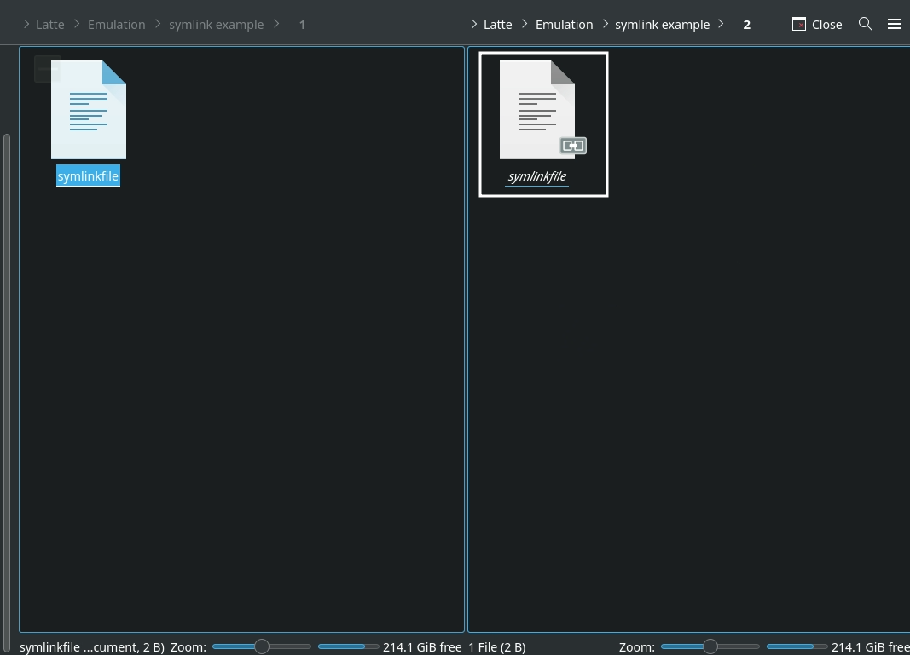

---
search:
  boost: 400 
---

# File Management, learn how to manage your files like a wizard.

***

## File Management Table of Contents


1. [Managing ROM Files](#managing-rom-files)
    - [How to Manage ROMs with Multiple Discs](#how-to-manage-roms-with-multiple-discs)
    - [How to Verify ROMs](#how-to-verify-roms)

2. [Managing Emulators and Tools](#managing-emulators-and-tools)
    - [How to Swap out AppImages and Binaries](#how-to-swap-out-appimages-and-binaries)
    - [How to Reset an Emulator's Configurations to EmuDeck's Defaults](#how-to-reset-an-emulators-configurations-to-emudecks-defaults)
    - [Emulator Save and Save State Locations](#emulator-save-and-save-state-locations)

3. [Managing Files](#managing-files)
    - [How to Use Symlinks](#how-to-use-symlinks)
    - [How to Transfer Files to a Steam Deck](#how-to-transfer-files-to-a-steam-deck)

4. [Managing EmuDeck](#managing-emudeck)
    - [EmuDeck File Locations](#emudeck-file-locations)

***

## Managing ROM Files
[Back to the Top](#file-management-table-of-contents)

***

### How to Manage ROMs with Multiple Discs
[Back to the Top](#file-management-table-of-contents)

***

#### Preface

[Skip the Preface](#how-to-create-an-m3u-file)

An M3U File is a "playlist" for ROMs with multiple discs. Like a music playlist, the first ROM is the "first track", the second is the "second track" and so on. 

Emulators will typically treat the M3U file itself as the ROM and auto-play the playlist (each disc) as you progress through the game. This section will cover how to create those M3U files so you can handle those multi-disc games like an emulator aficionado. 

##### Quick Tips

* Compress your ROMs
    * Open the EmuDeck application on your desktop and run the `Compression Tool` to `.chd`. Compression will make managing your ROM folder and creating your M3Us infinitely easier
    * Re-run Steam ROM Manager after compressing your ROMs (this can be done after you have finished creating an M3U file)
* After you have created an M3U file, use the various emulator quick-menus to seamlessly move onto the next disc 
    * For a full list of hotkeys, see the [Hotkeys](../../controls-and-hotkeys/steamos/hotkeys.md) page

##### Emulators without M3U Support

* PCSX2 does not support M3U files
    * [How to Manage Multiple Discs in PCSX2](../../emulators/steamos/pcsx2.md#how-to-manage-multiple-discs)
* Xenia does not support M3U files
    * [How to Manage Multiple Discs in Xenia](../../emulators/steamos/xenia.md#how-to-manage-multiple-discs)

***

#### How to Create an M3U File

- [Quick and Dirty Guide](#quick-and-dirty-guide)
- [In-Depth Guide](#in-depth-guide)
- [Video](#video-how-to-create-an-m3u-file)

##### Quick and Dirty Guide
[Back to the Top](#how-to-create-an-m3u-file)

1. In your ROM folder, right click, click `Create New Text File`
2. Name it `GAMENAME.m3u`
    * Replace GAMENAME with the game name
3. Right click the text file, click `Open with Kate` or a text editor of your choice
4. Place the full file name of each ROM disc including the file extension on a separate line
    * If your ROM file extensions are `.cue` and `.bin`, only write the `.cue` files in the M3U file
        * For Dreamcast, only write the `.gdi` files
5. Save and close out of the text file
6. From now on, you can treat the newly created M3U file as the game file

For how to use the M3U with Steam ROM Manager, see [Steam ROM Manager: How to Manage ROMs with Multiple Discs](../../tools/steamos/steam-rom-manager.md#how-to-manage-roms-with-multiple-discs)

For how to use the M3U with EmulationStation-DE, see [EmulationStation-DE: How to Manage ROMs with Multiple Discs](../../tools/steamos/emulationstation-de.md#how-to-manage-multiple-discs)

##### In-Depth Guide
[Back to the Top](#how-to-create-an-m3u-file)

**Here's How:**

1. In your ROM folder, right click, click `Create New Text File`
2. Name it `GAMENAME.m3u`
    * The file name of the M3U file is up to you. However, it is recommended you match the M3U file as closely as possible to the game name so Steam ROM Manager and EmulationStation-DE can scrape the appropriate game art or game info
    * For example, with the game: `The Legend of Dragoon`, you may name the M3U file, `The Legend of Dragoon.m3u` so Steam ROM Manager or EmulationStation-DE can locate the appropriate art. However, if you name it `LoD.m3u` as an example, neither tool will know to match `LoD` to `Legend of Dragoon`
3. Right click the text file, click `Open with Kate` or a text editor of your choice
4. Place the full file name of each ROM disc including the file extension on a separate line
    * **IMPORTANT:** If you are using both `.bin` and `.cue` files, only write the `.cue` files in the M3U file. If you are using both `.gdi` and `.bin` files, only write the `.gdi` files in the M3U file 
        * It is recommended you use the EmuDeck compression tool for easier file management 
    * Example (Using D2 for the Dreamcast):
        * Folder: 
        * M3U File: 
5. Save and close out of the text file
6. From now on, you can treat the newly created M3U file as the game file, and play the respective ROM discs by running the newly created M3U file through one of EmuDeck's included front-ends: Steam shortcuts created by Steam ROM Manager, EmulationStation-DE, or by running the emulator directly
    * Steam ROM Manager:
        * Steam ROM Manager will still parse all of your discs in addition to the M3U file. To solve this, you can hide each disc entry, and only allow Steam ROM Manager to parse the M3U file
            * To learn more, see: [Steam ROM Manager: How to Manage ROMs with Multiple Discs](../../tools/steamos/steam-rom-manager.md#how-to-manage-roms-with-multiple-discs)
    * EmulationStation-DE:
        * EmulationStation-DE will display all of your discs in addition to the M3U file. To solve this issue, EmulationStation-DE allows you to treat directories as files. 
            * To learn more, see: [EmulationStation-DE: How to Manage ROMs with Multiple Discs](../../tools/steamos/emulationstation-de.md#how-to-manage-multiple-discs)
    * Alternatively, you can move all of your Multi-Disk games to a new folder
        * For example: `psx-multidisk`, and keep the .m3u files in the `psx` folder, changing the contents to point to the disks in their new location. This will prevent those disks from being read, as the parsers will not look in the new folders created
            * **Note:** Not all emulators support absolute pathing

##### Video: How to Create an M3U File
[Back to the Top](#how-to-create-an-m3u-file)

<figure class="video_container">
  <video controls="true" allowfullscreen="true">
    <source src="/videos/how-to-create-an-m3u-file.mp4" type="video/mp4">
  </video>
</figure>

***

### How to Verify ROMs
[Back to the Top](#file-management-table-of-contents)

#### How to Verify a ROM Successfully Transferred 

Sometimes, data loss or corruption can occur when you transfer ROMs to your Steam Deck. You can verify that the ROM successfully transferred by checking its MD5 Checksum. An MD5 Checksum is a 32-character hexadecimal number that is computed on a file. If the MD5 checksum on both the file on the Steam Deck and the original PC is an exact match, the file transferred successfully. If they do not match, the file is potentially corrupt. You will need to correct or adjust how you transfer files. 

**Here's How**

**On the Steam Deck**

1. Right click the ROM
2. Click Properties
    1. 
3. Click the Checksums tab
4. Click `Calculate` to the right of `MD5`
    1. Wait, it may take a few moments
    2. 

**On the non-Steam Deck PC**

* **Windows:** 
    * Download: [https://github.com/gurnec/HashCheck/releases](https://github.com/gurnec/HashCheck/releases)
    * Instructions: [https://steemit.com/utopian-io/@wangwenjing/how-to-use-hashcheck-in-windows](https://steemit.com/utopian-io/@wangwenjing/how-to-use-hashcheck-in-windows)
* **Mac:** [https://ss64.com/osx/md5.html](https://ss64.com/osx/md5.html)
* **Linux (Command-line):** [https://man7.org/linux/man-pages/man1/md5sum.1.html](https://man7.org/linux/man-pages/man1/md5sum.1.html)

#### How to Verify a ROM is Valid

For one reason or another, your ROM may be corrupt and may not work properly. One way to confirm that you have a valid ROM is by comparing it to the ROM page on [redump.org](http://redump.org). Redump is an internet community "dedicated to collecting precise and accurate information about every video game ever released". You can validate your ROM by comparing its MD5 Checksum, a 32-character hexadecimal number that is computed on a file, to the MD5 Checksum on [redump.org](http://redump.org). 

**Here's How**

#### How to Find your MD5 Checksum

**Note:** `Vampire Night`, for the Playstation 2 is being used as an example in the below guide. 

1. Right click the ROM
2. Click Properties
      * 
3. Click the Checksums tab
4. Click `Calculate` to the right of `MD5`
      * Wait, it may take a few moments
      * 
      * Note down the MD5 Checksum for the next section

#### How to Compare your MD5 Checksum to Redump

1. Open redump.org, and search for your ROM 
     * For example, Vampire Night's page: [http://redump.org/disc/13152/](http://redump.org/disc/13152/)
2. Note down the MD5 Checksum on the redump.org page and compare it to your ROM
     * Using Vampire Night as an example:
         * MD5 Checksum on the ROM: 
         * Redump's MD5 Checksum: 
3. The Vampire Night ISO MD5 Checksum matches to the MD5 Checksum on the redump page, meaning the ROM is valid

***

## Managing Emulators and Tools
[Back to the Top](#file-management-table-of-contents)

***

### How to Swap out AppImages and Binaries
[Back to the Top](#file-management-table-of-contents)

#### Preface

Sometimes, when an emulator updates, there can be regressions for certain games or bugs that break the emulator temporarily. You can downgrade to a previous version by replacing the emulator in `/home/deck/Applications`. 

Additionally for Yuzu, you can also use this feature to download the `Early Access` version of Yuzu. 

For some emulators, your ROMs launch using a script created by EmuDeck, which look for the corresponding emulator, depending on how it is installed or downloaded. In the case of PCSX2 and Yuzu, the script looks for two things: 

* The most recently downloaded version in `/home/deck/Applications`, based on the file date.
* The emulator name at the beginning of the file. Anything after the emulator name is ignored. `pcsx2-Qt` in the case of PCSX2 and `Yuzu` in the case of Yuzu. For example, if the latest version of `Yuzu` is `1351` and you would like to downgrade to `1349`. When you download `yuzu 1349`, you could rename it to `Yuzu-1349.AppImage`, and EmuDeck's script will ignore the `-1349` in the file name, allowing you to record which versions of Yuzu you are using through the file name. 

#### List of Supported Emulators and Tools

* Cemu (AppImage)
    * Executable Location: `/home/deck/Applications/Cemu.AppImage`
    * Download Link: [https://github.com/cemu-project/Cemu/releases](https://github.com/cemu-project/Cemu/releases)
* Cemu (Swap out its EXE)
    * Executable Location: `Emulation/roms/wiiu/cemu.exe`
    * Download Link: [https://github.com/cemu-project/Cemu](https://github.com/cemu-project/Cemu)
* EmulationStation-DE
    * Executable Location: `Emulation/tools/EmulationStation-DE-x64_SteamDeck.AppImage`
    * Download Link: [https://gitlab.com/es-de/emulationstation-de/-/packages/](https://gitlab.com/es-de/emulationstation-de/-/packages/)
* mGBA
    * Executable Location: `/home/deck/Applications/mGBA.AppImage`
    * Download Link: [https://github.com/mgba-emu/mgba/releases](https://github.com/mgba-emu/mgba/releases)
* PCSX2-QT
    * Executable Location: `/home/deck/Applications/pcsx2-Qt.AppImage`
    * Download Link: [https://pcsx2.net/downloads/#nightly-anchor](https://pcsx2.net/downloads/#nightly-anchor)
* Ryujinx
   * Executable Location: `/home/deck/Applications/publish/Ryujinx`
   * Download Link: [https://github.com/Ryujinx/release-channel-master/releases](https://github.com/Ryujinx/release-channel-master/releases)
* Steam ROM Manager
    * Executable Location: `Emulation/tools/srm/Steam-ROM-Manager.AppImage`
    * Download Link: [https://github.com/SteamGridDB/steam-rom-manager/releases](https://github.com/SteamGridDB/steam-rom-manager/releases)
* Vita3K
    * Executable Location: `/home/deck/Applications/Vita3K/Vita3K`
* Xenia (Swap out its EXE)
    * Executable Location: `Emulation/roms/xbox360/xenia_canary.exe`
    * Download Link: [https://github.com/xenia-canary/xenia-canary/releases](https://github.com/xenia-canary/xenia-canary/releases)
* Yuzu
    * Executable Location: `/home/deck/Applications/yuzu.AppImage`
    * Download Link: [https://github.com/yuzu-emu/yuzu-mainline/releases](https://github.com/yuzu-emu/yuzu-mainline/releases)

#### How to Swap Out Emulators

1. Download the version of the emulator you would like to use, from the list above to your `/home/deck/Downloads` folder
2. Open the respective emulator folder location, using the list above: [List of Supported Emulators and Tools](#list-of-supported-emulators-and-tools)
3. Move the downloaded emulator from Step 1 to the folder in Step 2
4. Rename or delete the original emulator file
    * Rename it so it can be distinguished from your downloaded file
        * A Few Examples: 
            * Rename `Yuzu.AppImage` to `Yauzu.AppImage`
            * Rename `Yuzu.AppImage` to add a `.bak` to the end of the file extension, `Yuzu.AppImage.bak` 
            * Rename `Yuzu.AppImage` to add the version number. For example, if the latest version is 1351, rename it to `Yuzu-1351.AppImage`
5. Right click the newly downloaded emulator, click `Properties`, click `Permissions`, check `Is executable`
6. Your games will now launch using the version of the emulator you downloaded

Watch the following GIF for a visual (Yuzu is being used as an example in this GIF):


***

### How to Reset an Emulator's Configurations to EmuDeck's Defaults
[Back to the Top](#file-management-table-of-contents)

Sometimes after installing EmuDeck, you may notice an emulator's configurations were not set properly or you tweaked something on accident and you do not remember the default settings. 

You may reset an emulator's configurations in the `Manage Emulators` page. 

**Tutorial**

1. Open EmuDeck on your desktop.
2. Click the `Manage Emulators` button.
3. Select which emulator configurations you would like to reset in the drop-down menu.
4. Click `Reset configuration`, wait a moment.
    1. Using PCSX2 as an example: 
5. Your selected emulator has been reset.

***

### Emulator Save and Save State Locations
[Back to the Top](#file-management-table-of-contents)

See [Save Management: Emulator Save and Save State Locations](../../save-management/steamos/index.md#emulator-save-and-save-state-locations).

***

## Managing Files
[Back to the Top](#file-management-table-of-contents)


***

### How to Use Symlinks
[Back to the Top](#file-management-table-of-contents)

#### Preface

Symbolic links, or symlinks for short, are a powerful way to link files or directories. Symlinks are a kind of file that points to another file, similar to a shortcut on Windows. However, symlinks are much more versatile. 

A few features of symlinks include: renaming the symlink, crossing partitions (between an SD card and an internal SSD for example), and creating multiple symlinks to the same file. 

It is recommended you symlink your folders inside of the folders created by EmuDeck. For example, if you would like to symlink a PlayStation 2 ROM folder, symlink this folder inside of the `Emulation/roms/ps2` folder instead of overwriting the `ps2` folder. 

#### Use Cases

Let's go over a few use cases specifically pertaining EmuDeck: 

* If you wanted to install EmuDeck on multiple storage devices, you could instead install EmuDeck to the internal SSD and symlink ROM folders from the various storage devices to the ROM folders within the `Emulation` folder on the internal SSD. 
* If you had a large texture pack folder or a large folder of any sort, you could place this folder on your removable storage device and symlink it to its expected location on the internal SSD.
* If you wanted to symlink your NAS to your `Emulation` folder. 

#### How to create a Symlink

You can create a symlink a couple of ways. One method is to create a symlink through Dolphin (file manager). Keep in mind that within Dolphin (file manager), you can open tabs and view multiple folders at the same time.

When you have your original folder or file and the destination ready, drag the original folder or file to the destination and click `Link here`. A symlink is indicated with a small link icon and the file name in italics.

##### Photos

1. 
2. 
3. 

##### GIF


***

### How to Transfer Files to a Steam Deck
[Back to the Top](#file-management-table-of-contents)

#### Preface

By default, Steam Deck formats your SD card in ext4 format, which is not readable on Windows without additional tinkering. Use one of the following methods to transfer files to your Steam Deck.

#### List of File Transfer Methods

- [Method 1: SSH](#method-1-ssh)
    - [Tutorial 1: Text](#tutorial-1-text)
    - [Tutorial 2: Video](#tutorial-2-video)
- [Method 2: DeckMTP](#method-2-deckmtp)
- [Method 3: Removable Storage Device ](#method-3-removable-storage-device)
- [Method 4: AnyDesk](#method-4-anydesk)
- [Method 5: SMB Shares](#method-5-smb-shares)

***

##### Method 1: SSH
[Back to the Top](#list-of-file-transfer-methods)

Select **one** of the two tutorials below:

* [Tutorial 1: Text](#tutorial-1-text)
* [Tutorial 2: Video](#tutorial-2-video)

Although the below guide may look lengthy, SSH is a quick and easy process to set up. Once you have it set up, you can transfer files with ease in both Desktop Mode and Game Mode, no additional storage device needed. 

***

##### Tutorial 1: Text
[Back to the Top](#list-of-file-transfer-methods)

###### Part 1 of 2: On the Steam Deck

1. Open `Konsole`
2. In Konsole, type  `passwd` and follow the prompts to set a password for the account
    1. Your password will be invisible. Press enter when you've finished, you will be prompted to type it once again as confirmation
3. In Konsole, type `sudo systemctl enable --now sshd` to both start and permanently enable the service
4. In Konsole, type `ip addr | grep inet | grep wlan0`, jot down the `###.###.##.##` number in front of `inet`

***

###### Part 2 of 2: On the Non-Steam Deck PC

Install Filezilla or WinSCP on your computer. No additional program is needed on the Steam Deck. 

WinSCP is only available on Windows: [https://winscp.net/eng/download.php](https://winscp.net/eng/download.php)

Filezilla is available on Linux, Mac, and Windows:

* Windows: [https://filezilla-project.org/download.php?platform=win64](https://filezilla-project.org/download.php?platform=win64)
* Mac: [https://filezilla-project.org/download.php?platform=osx](https://filezilla-project.org/download.php?platform=osx)

Select **one** of the two and follow the respective guide below. 

* [Option 1: How to Use Filezilla](#option-1-how-to-use-filezilla)
* [Option 2: How to Use WinSCP](#option-2-how-to-use-winscp)

***

###### Option 1: How to Use Filezilla 

1. Install FileZilla: [https://filezilla-project.org/](https://filezilla-project.org/) on your non-Steam Deck PC
    * No additional program is needed on the Steam Deck
2. Click the icon in the top left
    * 
3. Click `New Site`, give it a memorable name
4. Use the following template: 
    * Protocol: `SFTP - SSH File Transfer Protocol`
    * Host: `steamdeck` or the `###.###.##.##` number you received in `Step 4` in the `On the Steam Deck` section
    * Port: Either blank or `22`
    * Logon Type: Normal
    * User: `deck`
    * Password: The password you set in `Step 2` in the `On the Steam Deck` section
    * 
5. Click `Connect`
6. (Optional) To browse to your SD Card, click the `..` at the top two times, select the `run` folder, `media`, `mmcblk0p1`
7. Drag files between the two windows or use the context menu (`Right Click`) to transfer files

***

###### Option 2: How to Use WinSCP  

1. Install WINSCP: [https://winscp.net/eng/index.php](https://winscp.net/eng/index.php) on your non-Steam Deck PC
    * No additional program is needed on the Steam Deck
2. Open WinSCP and you should be prompted with WinSCP's address book
    * 
    * You can also re-open this interface by clicking `New Session` in the top left
3. On the right side of the screen, use the following template: 
    * File Protocol: `SFTP`
    * Host Name: `steamdeck` or the `###.###.##.##` number you received in `Step 4` in the `On the Steam Deck` section
    * Port number: `22` or blank
    * User name: `deck` 
    * Password: The password you set in `Step 2` in the `On the Steam Deck` section
    * 
4. Click `Save` under the `User name` box and give the site name a memorable name
    * 
5. Click `Login`
6. (Optional) To browse to your SD Card, click the `..` at the top two times, select the `run` folder, `media`, `mmcblk0p1`
7. Drag files between the two windows or use the context menu (`Right Click`) to transfer files

***

###### Post File Transfer

After you are finished setting up SSH and you have transferred your files, you may want to consider disabling SSH.

With a weak sudo password, leaving SSH enabled **may** be a security risk if you take your Steam Deck outside of your home and connect it to public Wi-Fi. With a strong sudo password, this risk is less apparent. Regardless, this section will cover how to disable SSH. 

Select **one** of the two and follow the respective section below. 

* [Option 1: Terminal Command](#option-1-terminal-command)
* [Option 2: Decky Loader Plugin](#option-2-decky-loader-plugin)

###### Option 1: Terminal Command

1. In Desktop Mode, enter the below command in Konsole to disable SSH 
    * `sudo systemctl disable --now sshd`
2. To re-enable SSH, enter the below command in Konsole
    * `sudo systemctl enable --now sshd`

###### Option 2: Decky Loader Plugin

Skip Steps 1-4 if you have already installed Decky Loader

1. Open `EmuDeck` on your desktop
2. Select `Power Tools` 
3. Enter your password, and click `Install PowerTools`
    * If you have not set a password, this page will prompt you to create one
4. Restart your Steam Deck
5. In Game Mode, press the `...` button, press the Socket icon
6. Click the store icon in the top right, install `System Toolbox`
7. After installing `System Toolbox`: In Game Mode, press the QAM (`...`) button, press the socket icon (Decky Loader's icon), select `System Toolbox` and disable `Remote Terminal Access`
    * 
8. When you would like to transfer files again, re-enable `Remote Terminal Access`

***

#### Tutorial 2: Video
[Back to the Top](#list-of-file-transfer-methods)

Watch: [https://www.youtube.com/watch?v=F790rBfyAQM](https://www.youtube.com/watch?v=F790rBfyAQM)

***

#### Method 2: DeckMTP
[Back to the Top](#list-of-file-transfer-methods)

**Preface**

Watch: [https://www.youtube.com/watch?v=4GcbEWl12Uc](https://www.youtube.com/watch?v=4GcbEWl12Uc)

For further reading: [https://github.com/dafta/DeckMTP](https://github.com/dafta/DeckMTP)

DeckMTP is a Decky Loader plugin that allows the Steam Deck to be detected as a MTP drive (similar to a USB drive), once directly plugged into a PC via USB. (MacOS users may need the Android File Transfer App to be able to transfer files to MTP devices.)


***

##### How to Install DeckMTP

1. Boot to desktop mode and open `Konsole`
2. In Konsole, type  `passwd` and follow the prompts to set a password for the account
    * Your password will be invisible. Press enter when you've finished, you will be prompted to type it once again as confirmation
3. Install Decky Loader by choosing one of the two following ways:
    * Install through the EmuDeck application
    * Install from the DeckyLoader Github: [https://github.com/SteamDeckHomebrew/decky-loader](https://github.com/SteamDeckHomebrew/decky-loader)
       * Press the big `Download` button at the top
4. Restart the Steam Deck
5. In Game Mode, press the QAM (`...`) button
6. Press the `Socket` icon at the bottom of the list
    * 
7. In the top right, press the `Store` icon
    * 
8. Install DeckMTP
    * 

***

##### How to Set up DeckMTP

DeckMTP requires enabling DRD. 

For a Youtube Video, watch: [https://www.youtube.com/watch?v=4GcbEWl12Uc](https://www.youtube.com/watch?v=4GcbEWl12Uc)

1. To enable DRD, shut down your Steam Deck
2. Enter the BIOS by holding Volume Up and Power until you hear a beep
3. Select Setup Utility
4. Select Advanced
5. Select USB Configuration
6. Select USB Dual-Role Device
7. Select DRD instead of the existing XHCI
8. Plugging your Steam Deck into a PC via USB should now make it show up as a drive


***

#### Method 3: Removable Storage Device
[Back to the Top](#list-of-file-transfer-methods)

Use a flash drive or a removable storage device that can be read on both Windows and Linux. You may need either a USB C adapter or a USB C Hub. 

***

#### Method 4: AnyDesk
[Back to the Top](#list-of-file-transfer-methods)

##### On the Steam Deck

1. Install Anydesk from Discover (Shopping Bag icon) in desktop mode
2. Install Flatseal from Discover (Shopping Bag icon) in desktop mode
3. Open Flatseal
4. On the left, select AnyDesk
5. Under `Filesystem`, toggle `All system files, filesystem=host`
    * 

##### On the Non-Steam Deck PC

1. Install AnyDesk on your other PC from the website: [https://anydesk.com/](https://anydesk.com/) 
2. Connect to your Steam Deck
3. Use AnyDesk's file transfer feature to transfer files between your Steam Deck and non Steam Deck PC

##### How to use AnyDesk to Transfer Files

1. Connect to your Steam Deck
2. Click the box with a right arrow at the top
    * 
3. Your non-Steam Deck PC will be on the left side of the screen, your Steam Deck will be on the right side of the screen, right click files on either side to `Upload` or `Download` to the respective devices

##### Tips

* Your SD Card path is `/run/media/...`. To navigate to your SD Card, click the `..` dots at the top until you are in the `/` directory. You will see the `run` folder, you can navigate to the remaining folders from here

***

#### Method 5: SMB Shares
[Back to the Top](#list-of-file-transfer-methods)

Pick a tutorial: 

* Watch: [https://www.youtube.com/watch?v=x4_Sexd1UAw](https://www.youtube.com/watch?v=x4_Sexd1UAw)
* Read (Verbose): [https://www.reddit.com/r/SteamDeck/comments/wdyqya/the_semiultimate_guide_to_smb_shares_on_steam_deck/](https://www.reddit.com/r/SteamDeck/comments/wdyqya/the_semiultimate_guide_to_smb_shares_on_steam_deck/)
* Read (Succinct): [https://www.reddit.com/r/SteamDeck/comments/tfjq1m/how_to_connect_to_smb_shares/iosxjcm/](https://www.reddit.com/r/SteamDeck/comments/tfjq1m/how_to_connect_to_smb_shares/iosxjcm/)

***

## Managing EmuDeck
[Back to the Top](#file-management-table-of-contents)


***

### EmuDeck File Locations
[Back to the Top](#file-management-table-of-contents)

#### Preface

These file locations apply regardless of where you chose to install EmuDeck (to your internal SSD, to your SD Card, or elsewhere). Some emulator configuration files will be located on the internal SSD as listed below. 

`$HOME` refers to your home folder. If you are on a Steam Deck, this folder will be named `/home/deck` (you will likely not see `deck` in the file path when navigating using the file manager). 

Paths beginning with `Emulation/..` correspond to your EmuDeck install location. If you installed on an SD Card, your path may be `/run/media/mmcblk0p1/Emulation/roms/..`. If you installed on your internal SSD, your path may be `/home/deck/Emulation/roms/..`

Do note that folders with a `.` (`.var`, `.local`, `.config`, etc.) at the beginning are hidden by default. In Dolphin (file manager), click the hamburger menu in the top right, click `Show Hidden Files` to see these folders.

#### EmuDeck


`$HOME/.config/EmuDeck/`

```
EmuDeck/
├── backend
│   ├── chimeraOS
│   │   └── configs
│   │       └── emulationstation
│   │           └── custom_systems
│   ├── configs
│   │   ├── app.xemu.xemu
│   │   │   └── data
│   │   │       └── xemu
│   │   │           └── xemu
│   │   ├── cemu
│   │   │   ├── config
│   │   │   │   └── cemu
│   │   │   │       └── controllerProfiles
│   │   │   └── data
│   │   │       └── cemu
│   │   │           └── mlc01
│   │   ├── com.github.Rosalie241.RMG
│   │   │   └── config
│   │   │       └── RMG
│   │   ├── emulationstation
│   │   │   ├── custom_systems
│   │   │   └── gamelists
│   │   │       ├── atarilynx
│   │   │       ├── dos
│   │   │       ├── gamegear
│   │   │       ├── gb
│   │   │       ├── gbc
│   │   │       ├── gc
│   │   │       ├── n3ds
│   │   │       ├── nds
│   │   │       ├── nes
│   │   │       ├── ps2
│   │   │       ├── psp
│   │   │       ├── psx
│   │   │       ├── saturn
│   │   │       ├── scummvm
│   │   │       └── wii
│   │   ├── info.cemu.Cemu
│   │   │   └── data
│   │   │       └── cemu
│   │   │           ├── controllerProfiles
│   │   │           └── mlc01
│   │   ├── io.github.shiiion.primehack
│   │   │   ├── config
│   │   │   │   └── dolphin-emu
│   │   │   │       └── Profiles
│   │   │   │           └── Wiimote
│   │   │   └── data
│   │   │       └── dolphin-emu
│   │   │           ├── GameSettings
│   │   │           └── Load
│   │   │               └── Textures
│   │   │                   └── R3M
│   │   │                       ├── 0EXTRA - Steam Deck Button Prompts
│   │   │                       │   ├── Common
│   │   │                       │   ├── MP1
│   │   │                       │   ├── MP2
│   │   │                       │   └── MP3
│   │   │                       └── 0EXTRA - Wiimote Warning Replacement
│   │   ├── mame
│   │   │   └── cfg
│   │   ├── mgba
│   │   ├── net.kuribo64.melonDS
│   │   │   └── config
│   │   │       └── melonDS
│   │   ├── net.pcsx2.PCSX2
│   │   │   └── config
│   │   │       └── PCSX2
│   │   │           ├── cheats_ws
│   │   │           └── inis
│   │   ├── net.rpcs3.RPCS3
│   │   │   └── config
│   │   │       └── rpcs3
│   │   │           ├── GuiConfigs
│   │   │           └── input_configs
│   │   │               └── global
│   │   ├── org.citra_emu.citra
│   │   │   └── config
│   │   │       └── citra-emu
│   │   ├── org.DolphinEmu.dolphin-emu
│   │   │   └── config
│   │   │       └── dolphin-emu
│   │   │           ├── GameSettings
│   │   │           └── Profiles
│   │   │               ├── GCPad
│   │   │               └── Wiimote
│   │   ├── org.duckstation.DuckStation
│   │   │   └── config
│   │   │       └── duckstation
│   │   ├── org.libretro.RetroArch
│   │   │   └── config
│   │   │       └── retroarch
│   │   │           ├── autoconfig
│   │   │           ├── config
│   │   │           │   ├── Beetle Cygne
│   │   │           │   ├── Beetle Lynx
│   │   │           │   ├── Beetle NeoPop
│   │   │           │   ├── Beetle PCE
│   │   │           │   ├── Beetle PCE Fast
│   │   │           │   ├── Beetle PSX
│   │   │           │   ├── Beetle PSX HW
│   │   │           │   ├── Beetle WonderSwan
│   │   │           │   ├── bsnes-hd beta
│   │   │           │   ├── FinalBurn Neo
│   │   │           │   ├── Flycast
│   │   │           │   ├── Gambatte
│   │   │           │   ├── Gearsystem
│   │   │           │   ├── Genesis Plus GX
│   │   │           │   ├── Handy
│   │   │           │   ├── MAME
│   │   │           │   ├── MAME 2003-Plus
│   │   │           │   ├── Mesen
│   │   │           │   ├── mGBA
│   │   │           │   ├── Mupen64Plus-Next
│   │   │           │   ├── Nestopia
│   │   │           │   ├── PicoDrive
│   │   │           │   ├── PUAE
│   │   │           │   ├── remaps
│   │   │           │   │   └── Gambatte
│   │   │           │   ├── SameBoy
│   │   │           │   ├── Snes9x
│   │   │           │   ├── Stella
│   │   │           │   ├── YabaSanshiro
│   │   │           │   └── Yabause
│   │   │           └── overlays
│   │   │               └── pegasus
│   │   ├── org.ppsspp.PPSSPP
│   │   │   └── config
│   │   │       └── ppsspp
│   │   │           └── PSP
│   │   │               └── SYSTEM
│   │   ├── org.ryujinx.Ryujinx
│   │   │   └── config
│   │   │       └── Ryujinx
│   │   ├── org.scummvm.ScummVM
│   │   │   └── config
│   │   │       └── scummvm
│   │   ├── org.yuzu_emu.yuzu
│   │   │   ├── config
│   │   │   │   └── yuzu
│   │   │   │       └── input
│   │   │   └── data
│   │   │       └── yuzu
│   │   │           ├── keys
│   │   │           └── nand
│   │   │               └── system
│   │   │                   └── Contents
│   │   │                       └── registered
│   │   ├── pcsx2qt
│   │   ├── rclone
│   │   ├── Ryujinx
│   │   │   └── profiles
│   │   │       └── controller
│   │   ├── steam-deck-romate
│   │   ├── steam-input
│   │   │   └── Icons
│   │   ├── steam-rom-manager
│   │   │   └── userData
│   │   │       └── img
│   │   │           ├── default
│   │   │           ├── emus
│   │   │           │   └── rmg
│   │   │           ├── playwhatever
│   │   │           ├── systems
│   │   │           │   ├── grid
│   │   │           │   └── poster
│   │   │           └── updater
│   │   ├── Vita3K
│   │   └── xenia
│   ├── functions
│   │   ├── EmuScripts
│   │   ├── RemotePlayClientScripts
│   │   └── ToolScripts
│   ├── icons
│   ├── roms
│   │   ├── 3do
│   │   ├── 3ds
│   │   ├── ags
│   │   ├── amiga
│   │   ├── amiga1200
│   │   ├── amiga600
│   │   ├── amigacd32
│   │   ├── amstradcpc
│   │   ├── android
│   │   ├── apple2
│   │   ├── apple2gs
│   │   ├── arcade
│   │   ├── arcadia
│   │   ├── arduboy
│   │   ├── astrocde
│   │   ├── atari2600
│   │   ├── atari5200
│   │   ├── atari7800
│   │   ├── atari800
│   │   ├── atarijaguar
│   │   ├── atarijaguarcd
│   │   ├── atarilynx
│   │   ├── atarist
│   │   ├── atarixe
│   │   ├── atomiswave
│   │   ├── bbcmicro
│   │   ├── c16
│   │   ├── c64
│   │   ├── cavestory
│   │   ├── cdimono1
│   │   ├── cdtv
│   │   ├── chailove
│   │   ├── channelf
│   │   ├── cloud
│   │   ├── coco
│   │   ├── colecovision
│   │   ├── cps
│   │   ├── cps1
│   │   ├── cps2
│   │   ├── cps3
│   │   ├── crvision
│   │   ├── daphne
│   │   ├── desktop
│   │   ├── doom
│   │   ├── dos
│   │   ├── dragon32
│   │   ├── dreamcast
│   │   ├── easyrpg
│   │   ├── epic
│   │   ├── famicom
│   │   ├── fba
│   │   ├── fbneo
│   │   ├── fds
│   │   ├── flash
│   │   ├── fmtowns
│   │   ├── gameandwatch
│   │   ├── gamecom
│   │   ├── gamecube
│   │   ├── gamegear
│   │   ├── gb
│   │   ├── gba
│   │   ├── gbc
│   │   ├── gc -> gamecube
│   │   ├── genesis
│   │   ├── gx4000
│   │   ├── intellivision
│   │   ├── j2me
│   │   ├── kodi
│   │   ├── lcdgames
│   │   ├── lutris
│   │   ├── lutro
│   │   ├── macintosh
│   │   ├── mame
│   │   ├── mame-advmame
│   │   ├── mame-mame4all
│   │   ├── mastersystem
│   │   ├── megacd
│   │   ├── megacdjp
│   │   ├── megadrive
│   │   ├── megadrivejp
│   │   ├── megaduck
│   │   ├── mess
│   │   ├── model2
│   │   ├── model3
│   │   ├── moonlight
│   │   ├── moto
│   │   ├── msx
│   │   ├── msx1
│   │   ├── msx2
│   │   ├── msxturbor
│   │   ├── mugen
│   │   ├── multivision
│   │   ├── n3ds -> 3ds
│   │   ├── n64
│   │   ├── n64dd
│   │   ├── naomi
│   │   ├── naomigd
│   │   ├── nds
│   │   ├── neogeo
│   │   ├── neogeocd
│   │   ├── neogeocdjp
│   │   ├── nes
│   │   ├── ngp
│   │   ├── ngpc
│   │   ├── odyssey2
│   │   ├── openbor
│   │   ├── oric
│   │   ├── palm
│   │   ├── pc
│   │   ├── pc88
│   │   ├── pc98
│   │   ├── pcengine
│   │   ├── pcenginecd
│   │   ├── pcfx
│   │   ├── pico8
│   │   ├── pokemini
│   │   ├── ports
│   │   ├── primehacks
│   │   ├── ps2
│   │   ├── ps3
│   │   ├── ps4
│   │   ├── psp
│   │   ├── psvita
│   │   ├── psx
│   │   ├── pv1000
│   │   ├── quake
│   │   ├── remoteplay
│   │   ├── samcoupe
│   │   ├── satellaview
│   │   ├── saturn
│   │   ├── saturnjp
│   │   ├── scummvm
│   │   ├── sega32x
│   │   ├── sega32xjp
│   │   ├── sega32xna
│   │   ├── segacd
│   │   ├── sfc
│   │   ├── sg-1000
│   │   ├── sgb
│   │   ├── snes
│   │   ├── sneshd
│   │   ├── snesna
│   │   ├── solarus
│   │   ├── spectravideo
│   │   ├── steam
│   │   ├── stratagus
│   │   ├── sufami
│   │   ├── supergrafx
│   │   ├── supervision
│   │   ├── switch
│   │   ├── symbian
│   │   ├── tanodragon
│   │   ├── tg16
│   │   ├── tg-cd
│   │   ├── ti99
│   │   ├── tic80
│   │   ├── to8
│   │   ├── trs-80
│   │   ├── uzebox
│   │   ├── vectrex
│   │   ├── vic20
│   │   ├── videopac
│   │   ├── virtualboy
│   │   ├── vsmile
│   │   ├── wasm4
│   │   ├── wii
│   │   ├── wiiu
│   │   │   └── roms
│   │   ├── wonderswan
│   │   ├── wonderswancolor
│   │   ├── x1
│   │   ├── x68000
│   │   ├── xbox
│   │   ├── xbox360
│   │   │   └── roms
│   │   ├── zmachine
│   │   ├── zx81
│   │   └── zxspectrum
│   ├── store
│   │   ├── gamegear
│   │   ├── gb
│   │   ├── gba
│   │   ├── gbc
│   │   ├── genesis
│   │   ├── mastersystem
│   │   ├── nes
│   │   └── snes
│   └── tools
│       ├── binaries
│       ├── binupdate
│       ├── chdconv
│       ├── cloud
│       ├── flatpakupdate
│       ├── launchers
│       ├── remoteplayclients
│       ├── remoteplaywhatever
│       └── updater
├── blob_storage
│   └── 08119cde-284f-4f9b-842a-3570c31a4fd1
├── Cache
│   └── Cache_Data
│       └── index-dir
├── Code Cache
│   ├── js
│   │   └── index-dir
│   └── wasm
│       └── index-dir
├── Crashpad
├── Dictionaries
├── GPUCache
├── Local Storage
│   └── leveldb
├── logs
└── Session Storage
```


`$HOME/.steam/steam/controller_base/templates/`

```
templates
├── cemu_controller_config.vdf
├── citra_controller_config.vdf
├── duckstation_controller_config.vdf
├── emudeck_cloud_controller_config.vdf
├── emulationstation-de_controller_config.vdf
├── melonds_controller_config.vdf
├── mGBA_controller_config.vdf
├── ppsspp_controller_config.vdf
└── rmg_controller_config.vdf
```


`$HOME/homebrew`

```
homebrew
├── plugins
│   └── PowerTools
│       ├── bin
│       │   ├── backend
│       │   └── libryzenadj.so
│       ├── dist
│       │   └── index.js
│       ├── LICENSE
│       ├── main.py
│       ├── package.json
│       ├── plugin.json
│       ├── README.md
│       └── translations
│           ├── build.py
│           ├── es-ES.mo
│           ├── es-ES.po
│           ├── fr-CA.mo
│           ├── fr-CA.po
│           ├── fr-FR.mo
│           ├── it-IT.mo
│           ├── it-IT.po
│           ├── pt.pot
│           ├── ru-RU.mo
│           ├── ru-RU.po
│           ├── test.mo
│           ├── test.po
│           ├── uk-UA.mo
│           ├── uk-UA.po
│           ├── zh-CN.mo
│           ├── zh-CN.po
│           ├── zh-HK.mo
│           └── zh-HK.po
├── services
│   └── PluginLoader
└── settings
    └── loader.json
```


#### Emulators

##### Cemu Native

`$HOME/.config/Cemu/` 

```
Cemu/
├── controllerProfiles
│   ├── controller0.xml
│   ├── controller1.xml
│   ├── controller2.xml
│   ├── controller3.xml
│   ├── Deck-Gamepad-Gyro.xml
│   ├── Deck-P1.xml
│   ├── Deck-P2.xml
│   ├── Deck-P3.xml
│   └── Deck-P4.xml
└── settings.xml
```

`$HOME/.local/share/Cemu/`

```
Cemu/
├── graphicPacks
└── memorySearcher
```

`$HOME/.cache/Cemu`

```
Cemu/
└── shaderCache
    ├── driver
    ├── precompiled
    └── transferable
```

`Emulation/roms/wiiu/mlc01`

```
wiiu/mlc01/
├── sys
│   ├── sys
│   ├── title
│   └── usr
└── usr
    ├── boss
    ├── save
    └── title
```

* Saves Location:
    * Symlink:  `Emulation/saves/Cemu/saves/`
    * Target: `Emulation/roms/wiiu/mlc01/usr/save`

##### Cemu Proton

`Emulation/roms/wiiu/`

```
wiiu
├── Cemu.exe
├── controllerProfiles
│   ├── controller0.xml
│   ├── controller0.xml.bak
│   ├── deck2.xml
│   ├── deck2.xml.bak
│   ├── deck3.xml
│   ├── deck3.xml.bak
│   ├── deck4.xml
│   ├── deck4.xml.bak
│   ├── Deck-Gamepad-Gyro.xml
│   ├── Deck-Gamepad-Gyro.xml.bak
│   ├── Deck.xml
│   └── Deck.xml.bak
├── gameProfiles
│   ├── default
│   └── example.ini
├── graphicPacks
│   └── downloadedGraphicPacks
├── keys.txt
├── log.txt
├── memorySearcher
├── mlc01
│   ├── readme.txt
│   ├── readme.txt.bak
│   ├── sys
│   └── usr
├── resources
│   ├── ca
│   ├── de
│   ├── es
│   ├── fr
│   ├── hu
│   ├── it
│   ├── ja
│   ├── ko
│   ├── libusb-1.0.dll
│   ├── nb
│   ├── nl
│   ├── pl
│   ├── pt
│   ├── ru
│   ├── sharedFonts
│   ├── sv
│   ├── tr
│   ├── uk
│   ├── WinGamingInput.dll
│   └── zh
├── roms
├── settings.xml
├── shaderCache
│   ├── driver
│   ├── info.txt
│   ├── precompiled
│   └── transferable
└── title_list_cache.xml
```

`Emulation/roms/wiiu/mlc01`

```
wiiu/mlc01/
├── sys
│   ├── sys
│   ├── title
│   └── usr
└── usr
    ├── boss
    ├── save
    └── title
```

* Saves Location:
    * Symlink:  `Emulation/saves/Cemu/saves/`
    * Target: `Emulation/roms/wiiu/mlc01/usr/save`

##### Citra

`$HOME/.var/app/org.citra_emu.citra`

```
org.citra_emu.citra/
├── cache
├── config
    ├── citra-emu
    │   ├── custom
    │   ├── qt-config.ini
    │   ├── qt-config.ini.bak
    │   └── telemetry_id
    ├── kdeglobals
    ├── pulse
    │   └── cookie
    ├── QtProject.conf
    └── user-dirs.dirs
└── data
    └── citra-emu
        ├── cheats
        ├── load
        ├── log
        ├── nand
        ├── screenshots
        ├── sdmc
        ├── shaders
        ├── states
        └── sysdata 
```

* Saves Location:
    * Symlink: `Emulation/saves/citra/saves`
    * Target: `/home/deck/.var/app/org.citra_emu.citra/data/citra-emu/sdmc`
* Save States Location:
    * Symlink: `Emulation/saves/citra/states/`
    * Target: `/home/deck/.var/app/org.citra_emu.citra/data/citra-emu/states`

##### Dolphin


`$HOME/.var/app/org.DolphinEmu.dolphin-emu`

```
org.DolphinEmu.dolphin-emu/
├── cache
├── config
    ├── dolphin-emu
    │   ├── Debugger.ini
    │   ├── Dolphin.ini
    │   ├── DSUClient.ini
    │   ├── FreeLookController.ini
    │   ├── FreeLook.ini
    │   ├── GameSettings
    │   ├── GBA.ini
    │   ├── GCKeyNew.ini
    │   ├── GCPadNew.ini
    │   ├── GFX.ini
    │   ├── GraphicMods
    │   ├── Hotkeys.ini
    │   ├── Logger.ini
    │   ├── Profiles
    │   │   ├── GCPad
    │   │   │   ├── GC_base.ini
    │   │   │   └── GC_reverse_camera.ini
    │   │   └── Wiimote
    │   │       ├── Wii_base_nunchuck.ini
    │   │       ├── Wii_base_nunchuck_with_touchpad.ini
    │   │       ├── Wii_classic_controller.ini
    │   │       ├── Wii_no_attachment.ini
    │   │       ├── Wii_no_attachment_with_touchpad.ini
    │   │       └── Wii_NoController.ini
    │   ├── Qt.ini
    │   └── WiimoteNew.ini
    ├── kdeglobals
    └── user-dirs.dirs
└── data
    └── dolphin-emu
        ├── Dump
        │   ├── Audio
        │   ├── DSP
        │   ├── Frames
        │   ├── Objects
        │   ├── SSL
        │   └── Textures
        ├── GameSettings
        ├── GC
        │   ├── EUR
        │   ├── JAP
        │   └── USA
        ├── Load
        │   ├── DynamicInputTextures
        │   ├── GraphicMods
        │   ├── Riivolution
        │   ├── Textures
        │   └── WiiSDSync
        ├── Logs
        │   └── Mail
        ├── Maps
        ├── ResourcePacks
        ├── ScreenShots
        ├── Shaders
        │   └── Anaglyph
        ├── StateSaves
        ├── Styles
        ├── Themes
        └── Wii
            ├── import
            ├── meta
            ├── shared1
            ├── shared2
            ├── sys
            ├── ticket
            ├── title
            ├── tmp
            └── wfs
```

* Saves (Wii):
    * Symlink: `Emulation/saves/dolphin/Wii`
    * Target: `/home/deck/.var/app/org.DolphinEmu.dolphin-emu/data/dolphin-emu/Wii`
* Saves (GameCube):
    * Symlink: `Emulation/saves/dolphin/GC`
    * Target: `/home/deck/.var/app/org.DolphinEmu.dolphin-emu/data/dolphin-emu/GC`
* Save States (Wii):
    * Symlink: `Emulation/saves/dolphin/StateSaves`
    * Target: `/home/deck/.var/app/org.DolphinEmu.dolphin-emu/data/dolphin-emu/StateSaves`
* Save States (GameCube):
    * Symlink: `Emulation/saves/dolphin/StateSaves`
    * Target: `/home/deck/.var/app/org.DolphinEmu.dolphin-emu/data/dolphin-emu/StateSaves`

##### DuckStation

`$HOME/.var/app/org.duckstation.DuckStation`

```
org.duckstation.DuckStation/
├── cache
├── config
│   ├── duckstation
│   │   ├── cache
│   │   ├── cheats
│   │   ├── covers
│   │   ├── dump
│   │   ├── gamesettings
│   │   ├── inputprofiles
│   │   ├── playtime.dat
│   │   ├── screenshots
│   │   ├── settings.ini
│   │   ├── settings.ini.bak
│   │   ├── shaders
│   │   └── textures
│   ├── kdeglobals
│   ├── pulse
│   │   └── cookie
│   ├── QtProject.conf
│   └── user-dirs.dirs
└── data
    └── duckstation
        ├── settings.ini
        └── settings.ini.bak
```

* Saves: `Emulation/saves/duckstation/saves`
* Save States: `Emulation/saves/duckstation/states`

##### MAME

`$HOME/.mame`

```
.mame
├── cfg
│   ├── default.cfg
│   └── ___empty.cfg
└── mame.ini
```

`Emulation/storage/mame`

```
mame
├── artwork
├── ctrlr
├── ini
│   ├── mame.ini
│   ├── plugin.ini
│   └── ui.ini
└── samples
```

* Saves: `Emulation/saves/MAME/saves`
* Save States: `Emulation/saves/MAME/states`


##### melonDS

`$HOME/.var/app/net.kuribo64.melonDS`

```
net.kuribo64.melonDS
├── cache
├── config
│   ├── kdeglobals
│   ├── melonDS
│   │   ├── melonDS.ini
│   │   ├── melonDS.ini.bak
│   │   ├── timewarp.mln
│   │   └── wfcsettings.bin
│   ├── pulse
│   │   └── cookie
│   ├── QtProject.conf
│   └── user-dirs.dirs
└── data
    ├── user-places.xbel
    ├── user-places.xbel.bak
    └── user-places.xbel.tbcache
```

* Saves: `Emulation/saves/melonds/saves`
* Save States: `Emulation/saves/melonds/states`

##### mGBA

`$HOME/.config/mgba`

```
mgba/
├── config.ini
├── config.ini.bak
├── library.sqlite3
├── nointro.sqlite3
├── qt.ini
├── qt.ini.bak
└── updater.log
```

`Emulation/storage/mgba`

```
mgba
├── cheats
├── patches
└── screenshots
```

* Saves: `Emulation/saves/mgba/saves`
* Save States `Emulation/saves/mgba/states`

##### PCSX2 

`$HOME/.config/PCSX2`

```
PCSX2
├── cheats
├── gamesettings
├── inis
│   └── PCSX2.ini
├── inputprofiles
├── logs
├── memcards
├── patches
├── sstates
└── videos
```

`Emulation/storage/pcsx2`

```
pcsx2/
├── cache
├── covers
├── snaps
└── textures
```


* Saves: `Emulation/saves/pcsx2/saves`
* Save States `Emulation/saves/pcsx2/states`

##### PPSSPP

`$HOME/.var/app/org.ppsspp.PPSSPP`

```
org.ppsspp.PPSSPP
├── cache
├── config
│   ├── ppsspp
│   │   └── PSP
│   │       ├── CHEATS
│   │       ├── GAME
│   │       ├── PPSSPP_STATE
│   │       ├── SAVEDATA
│   │       ├── SYSTEM
│   │       │   ├── controls.ini
│   │       │   └── ppsspp.ini
│   │       └── TEXTURES
│   ├── pulse
│   │   └── cookie
│   └── user-dirs.dirs
└── data
```

* Saves: 
    * Symlink: `Emulation/saves/ppsspp/saves`
    * Target: `/home/deck/.var/app/org.ppsspp.PPSSPP/config/ppsspp/PSP/SAVEDATA`
* Save States:
    * Symlink: `Emulation/saves/ppsspp/states/`
    * Target: `/home/deck/.var/app/org.ppsspp.PPSSPP/config/ppsspp/PSP/PPSSPP_STATE`


##### PrimeHack

`$HOME/.var/app/io.github.shiiion.primehack`

```
io.github.shiiion.primehack/
├── cache
│   ├── dolphin-emu
│   │   └── GameCovers
│   ├── fontconfig
│   ├── mesa_shader_cache
│   └── tmp
├── config
│   └── dolphin-emu
│       ├── GraphicMods
│       └── Profiles
│           └── Wiimote
└── data
    └── dolphin-emu
        ├── Dump
        │   ├── Audio
        │   ├── DSP
        │   ├── Frames
        │   ├── Objects
        │   ├── SSL
        │   └── Textures
        ├── GameSettings
        ├── GC
        │   ├── EUR
        │   ├── JAP
        │   └── USA
        ├── Load
        │   ├── GraphicMods
        │   ├── Riivolution
        │   ├── Textures
        │   │   └── R3M
        │   │       ├── 0EXTRA - Steam Deck Button Prompts
        │   │       │   ├── Common
        │   │       │   ├── MP1
        │   │       │   ├── MP2
        │   │       │   └── MP3
        │   │       └── 0EXTRA - Wiimote Warning Replacement
        │   └── WiiSDSync
        ├── Logs
        │   └── Mail
        ├── Maps
        ├── ResourcePacks
        ├── ScreenShots
        ├── Shaders
        │   └── Anaglyph
        ├── StateSaves
        ├── Styles
        ├── Themes
        └── Wii
            ├── import
            ├── meta
            ├── shared1
            ├── shared2
            │   └── sys
            ├── sys
            ├── ticket
            ├── title
            ├── tmp
            └── wfs
```

* Saves:
    * Symlink: `Emulation/saves/primehack/Wii`
    * Target: `/home/deck/.var/app/io.github.shiiion.primehack/data/dolphin-emu/Wii`
* Save States:
    * Symlink: `Emulation/saves/primehack/Savestates`
    * Target: `/home/deck/.var/app/io.github.shiiion.primehack/data/dolphin-emu/StateSaves/`

##### RetroArch

`$HOME/.var/app/org.libretro.RetroArch/config/retroarch`

```
org.libretro.RetroArch
├── cache
├── config
│   ├── pulse
│   └── retroarch
│       ├── assets
│       ├── autoconfig
│       ├── cheats
│       ├── config
│       │   ├── Beetle Cygne
│       │   ├── Beetle Lynx
│       │   ├── Beetle NeoPop
│       │   ├── Beetle PCE
│       │   ├── Beetle PCE Fast
│       │   ├── Beetle PSX
│       │   ├── Beetle PSX HW
│       │   ├── Beetle Saturn
│       │   ├── Beetle SuperGrafx
│       │   ├── Beetle WonderSwan
│       │   ├── blueMSX
│       │   ├── bsnes-hd beta
│       │   ├── dolphin_emu
│       │   ├── DOSBox-pure
│       │   ├── DOSBox Pure
│       │   ├── FinalBurn Neo
│       │   ├── Flycast
│       │   ├── Gambatte
│       │   ├── Gearsystem
│       │   ├── Genesis Plus GX
│       │   ├── Handy
│       │   ├── Hatari
│       │   ├── Kronos
│       │   ├── MAME
│       │   ├── MAME 2003-Plus
│       │   ├── melonDS
│       │   ├── Mesen
│       │   ├── mGBA
│       │   ├── Mupen64Plus-Next
│       │   ├── NeoCD
│       │   ├── Nestopia
│       │   ├── ParaLLEl N64
│       │   ├── PicoDrive
│       │   ├── PPSSPP
│       │   ├── PUAE
│       │   ├── remaps
│       │   │   └── Gambatte
│       │   ├── SameBoy
│       │   ├── Snes9x
│       │   ├── Stella
│       │   ├── SwanStation
│       │   ├── VICE x64
│       │   ├── VICE x64sc
│       │   ├── VICE xscpu64
│       │   ├── VICE xvic
│       │   ├── YabaSanshiro
│       │   └── Yabause
│       ├── cores
│       ├── database
│       │   └── rdb
│       ├── downloads
│       │   └── core_backups
│       │       ├── 81_libretro
│       │       ├── a5200_libretro
│       │       ├── atari800_libretro
│       │       ├── bluemsx_libretro
│       │       ├── bsnes_hd_beta_libretro
│       │       ├── bsnes_libretro
│       │       ├── cap32_libretro
│       │       ├── citra2018_libretro
│       │       ├── citra_libretro
│       │       ├── desmume_libretro
│       │       ├── dosbox_core_libretro
│       │       ├── dosbox_svn_libretro
│       │       ├── easyrpg_libretro
│       │       ├── fbalpha2012_cps1_libretro
│       │       ├── fbalpha2012_cps2_libretro
│       │       ├── fbalpha2012_cps3_libretro
│       │       ├── fbalpha2012_neogeo_libretro
│       │       ├── fbneo_libretro
│       │       ├── fceumm_libretro
│       │       ├── flycast_libretro
│       │       ├── fmsx_libretro
│       │       ├── gambatte_libretro
│       │       ├── genesis_plus_gx_libretro
│       │       ├── genesis_plus_gx_wide_libretro
│       │       ├── gpsp_libretro
│       │       ├── handy_libretro
│       │       ├── hatari_libretro
│       │       ├── kronos_libretro
│       │       ├── lutro_libretro
│       │       ├── mame2000_libretro
│       │       ├── mame2003_plus_libretro
│       │       ├── mame2010_libretro
│       │       ├── mame_libretro
│       │       ├── mednafen_lynx_libretro
│       │       ├── mednafen_ngp_libretro
│       │       ├── mednafen_pce_fast_libretro
│       │       ├── mednafen_pce_libretro
│       │       ├── mednafen_pcfx_libretro
│       │       ├── mednafen_psx_hw_libretro
│       │       ├── mednafen_psx_libretro
│       │       ├── mednafen_saturn_libretro
│       │       ├── mednafen_supergrafx_libretro
│       │       ├── mednafen_vb_libretro
│       │       ├── mednafen_wswan_libretro
│       │       ├── melonds_libretro
│       │       ├── mesen_libretro
│       │       ├── mgba_libretro
│       │       ├── mu_libretro
│       │       ├── mupen64plus_next_libretro
│       │       ├── neocd_libretro
│       │       ├── nestopia_libretro
│       │       ├── np2kai_libretro
│       │       ├── nxengine_libretro
│       │       ├── o2em_libretro
│       │       ├── parallel_n64_libretro
│       │       ├── pcsx2_libretro
│       │       ├── pcsx_rearmed_libretro
│       │       ├── picodrive_libretro
│       │       ├── ppsspp_libretro
│       │       ├── prboom_libretro
│       │       ├── prosystem_libretro
│       │       ├── puae_libretro
│       │       ├── px68k_libretro
│       │       ├── quasi88_libretro
│       │       ├── quicknes_libretro
│       │       ├── race_libretro
│       │       ├── same_cdi_libretro
│       │       ├── scummvm_libretro
│       │       ├── snes9x2010_libretro
│       │       ├── snes9x_libretro
│       │       ├── stella2014_libretro
│       │       ├── stella_libretro
│       │       ├── swanstation_libretro
│       │       ├── tic80_libretro
│       │       ├── tyrquake_libretro
│       │       ├── vbam_libretro
│       │       ├── vba_next_libretro
│       │       ├── vecx_libretro
│       │       ├── vice_x128_libretro
│       │       ├── vice_x64_libretro
│       │       ├── vice_x64sc_libretro
│       │       ├── vice_xscpu64_libretro
│       │       ├── vice_xvic_libretro
│       │       ├── vitaquake2_libretro
│       │       ├── vitaquake2-rogue_libretro
│       │       ├── vitaquake2-xatrix_libretro
│       │       ├── vitaquake2-zaero_libretro
│       │       ├── vitaquake3_libretro
│       │       ├── wasm4_libretro
│       │       └── yabause_libretro
│       ├── filters
│       │   ├── audio
│       │   └── video
│       ├── layouts
│       ├── logs
│       ├── overlay
│       ├── overlays
│       │   └── pegasus
│       ├── playlists
│       │   └── logs
│       │       ├── Beetle Lynx
│       │       ├── Beetle PCE
│       │       ├── Beetle PSX
│       │       ├── Beetle Saturn
│       │       ├── Beetle SuperGrafx
│       │       ├── blueMSX
│       │       ├── Gambatte
│       │       ├── Handy
│       │       ├── MAME (Git)
│       │       ├── melonDS
│       │       ├── mGBA
│       │       ├── Mupen64Plus-Next
│       │       ├── ParaLLEl N64
│       │       └── Snes9x
│       ├── records
│       ├── records_config
│       ├── saves
│       │   └── mame
│       │       ├── cfg
│       │       └── nvram
│       ├── screenshots
│       ├── shaders
│       │   └── shaders_slang
│       │       ├── anamorphic
│       │       ├── anti-aliasing
│       │       ├── auto-box
│       │       ├── bezel
│       │       ├── blurs
│       │       ├── border
│       │       ├── cel
│       │       ├── crt
│       │       ├── cubic
│       │       ├── ddt
│       │       ├── deblur
│       │       ├── denoisers
│       │       ├── dithering
│       │       ├── eagle
│       │       ├── film
│       │       ├── fsr
│       │       ├── gpu
│       │       ├── handheld
│       │       ├── hdr
│       │       ├── hqx
│       │       ├── include
│       │       ├── interpolation
│       │       ├── linear
│       │       ├── misc
│       │       ├── motionblur
│       │       ├── motion-interpolation
│       │       ├── nedi
│       │       ├── nes_raw_palette
│       │       ├── nnedi3
│       │       ├── ntsc
│       │       ├── omniscale
│       │       ├── pal
│       │       ├── presets
│       │       ├── procedural
│       │       ├── quad
│       │       ├── reshade
│       │       ├── sabr
│       │       ├── scalefx
│       │       ├── scalehq
│       │       ├── scalenx
│       │       ├── scanlines
│       │       ├── sharpen
│       │       ├── spec
│       │       ├── stereoscopic-3d
│       │       ├── test
│       │       ├── vhs
│       │       ├── warp
│       │       ├── windowed
│       │       ├── xbr
│       │       ├── xbrz
│       │       ├── xsal
│       │       └── xsoft
│       ├── states
│       ├── system
│       └── thumbnails
└── data
```

* Saves:
    * Symlink: `Emulation/saves/retroarch/saves`
    * Target Location: `/home/deck/.var/app/org.libretro.RetroArch/config/retroarch/saves/`
* Save States:
    * Symlink: `Emulation/saves/retroarch/states`
    * Target Location: `/home/deck/.var/app/org.libretro.RetroArch/config/retroarch/states/`

##### Rosalie's Mupen GUI

`$HOME/.var/app/com.github.Rosalie241.RMG`

```
com.github.Rosalie241.RMG
├── cache
├── config
│   ├── kdeglobals
│   ├── pulse
│   │   └── cookie
│   ├── QtProject.conf
│   ├── RMG
│   │   ├── GLideN64.ini
│   │   ├── GLideN64.ini.bak
│   │   ├── mupen64plus.cfg
│   │   └── mupen64plus.cfg.bak
│   └── user-dirs.dirs
└── data
    └── RMG
        ├── Cheats-User
        └── Save
            ├── Game
            └── State
```

* Saves: `Emulation/saves/RMG/saves`
* Save States: `Emulation/saves/RMG/states`

##### RPCS3 

`$HOME/.var/app/net.rpcs3.RPCS3`

```
net.rpcs3.RPCS3
├── cache
│   ├── fontconfig
│   ├── mesa_shader_cache
│   │   ├── 17
│   │   ├── 9b
│   │   ├── d6
│   │   └── ea
│   ├── rpcs3
│   │   ├── savestates
│   │   ├── shaderlog
│   │   └── spu_progs
│   └── tmp
├── config
│   ├── kdeglobals
│   ├── pulse
│   │   └── cookie
│   ├── QtProject.conf
│   ├── rpcs3
│   │   ├── captures
│   │   ├── config.yml
│   │   ├── dev_bdvd
│   │   ├── dev_flash
│   │   ├── dev_flash2
│   │   ├── dev_flash3
│   │   ├── dev_hdd1
│   │   │   └── caches
│   │   ├── dev_usb000
│   │   ├── games.yml
│   │   ├── GuiConfigs
│   │   │   └── CurrentSettings.ini
│   │   ├── Icons
│   │   ├── patches
│   │   ├── sounds
│   │   └── uuid
│   └── user-dirs.dirs
└── data
```

`Emulation/storage/rpcs3`

```
rpcs3/
└── dev_hdd0
    ├── disc
    ├── game
    ├── home
    ├── photo
    └── savedata
```

* Saves: 
    * Symlink: `Emulation/saves/rpcs3/saves`
    * Target: `Emulation/storage/rpcs3/dev_hdd0/home/00000001/savedata`


##### Ryujinx

`$HOME/.config/Ryujinx`

```
Ryujinx/
├── bis
│   ├── system
│   │   ├── Contents
│   │   └── save
│   └── user
│       ├── Contents
│       ├── save
│       ├── saveMeta
│       └── temp
├── Config.json
├── Config.json.bak
├── games -> Emulation/storage/ryujinx/games/
├── mods
│   ├── contents
│   ├── exefs_patches
│   └── nro_patches
├── profiles
│   └── controller
│       ├── Deck.json
│       └── Deck.json.bak
├── sdcard
│   ├── atmosphere
│   │   ├── contents
│   │   ├── exefs_patches
│   │   └── nro_patches
│   ├── Nintendo
│   │   ├── Contents
│   │   └── save
│   └── ocw-config.json
└── system
    ├── prod.keys
    └── Profiles.json
```

`Emulation/bios/Ryujinx`

```
ryujinx/
└── keys -> /home/deck/.config/Ryujinx/system
```

* Saves:
    * Symlink: `Emulation/saves/ryujinx/saves`
    * Target: `/home/deck/.config/Ryujinx/bis/user/save`
* saveMeta:
    * Symlink: `Emulation/saves/Ryujinx/saveMeta`
    * Target: `/home/deck/.config/Ryujinx/bis/user/saveMeta`

##### ScummVM

`$HOME/.var/app/org.scummvm.ScummVM`

```
org.scummvm.ScummVM/
├── cache
│   ├── fontconfig
│   ├── scummvm
│   │   ├── icons
│   │   └── logs
│   │       └── scummvm.log
│   └── tmp
├── config
│   ├── pulse
│   │   └── cookie
│   ├── scummvm
│   │   ├── scummvm.ini
│   │   └── scummvm.ini.bak
│   └── user-dirs.dirs
└── data
    └── scummvm
```

* Saves: `Emulation/saves/scummvm/saves`


##### Vita3K

`$HOME/.config/Vita3K`

```
Vita3K/
├── config.yml
└── config.yml.bak
```

`$HOME/.local/share/Vita3K`

```
Vita3K/
├── lang
│   └── user
│       └── PLACE USER LANG HERE.txt
├── textures
│   └── import
│
└── Vita3K
```

`$HOME/.cache/Vita3K`

```
Vita3K
├── shaderlog
├── shaders
└── texturelog
```

`Emulation/storage/Vita3K`

```
Vita3K/
├── gro0
├── grw0
├── host0
├── imc0
├── os0
│   ├── kd
│   ├── sm
│   ├── ue
│   └── us
├── pd0
├── sa0
│   └── data
├── sd0
├── tm0
├── ud0
├── uma0
│   └── data
├── ur0
├── ux0
│   ├── app
│   ├── data
│   ├── license
│   ├── temp
│   ├── theme
│   └── user
│       └──00
│           └──savedata
├── vd0
├── vs0
│   ├── app
│   ├── data
│   ├── sys
│   ├── tool
│   └── vsh
└── xmc0
```

* Saves: `Emulation/storage/Vita3K/ux0/user/00/savedata`
    * Save folders correspond to a game's Title ID. To locate your game's Title ID, open Vita3K, right click a game, and click `Information`


##### Xemu

`$HOME/.var/app/app.xemu.xemu`

```
app.xemu.xemu/
├── cache
├── config
│   ├── glib-2.0
│   │   └── settings
│   ├── gtk-3.0
│   │   └── bookmarks
│   ├── ibus
│   │   └── bus
│   ├── pulse
│   │   └── cookie
│   └── user-dirs.dirs
└── data
    ├── recently-used.xbel
    └── xemu
        └── xemu
            ├── shader_cache_list
            ├── shaders
            ├── xemu.toml
            └── xemu.toml.bak
```

`Emulation/storage/xemu`

```
xemu/
├── eeprom.bin
└── xbox_hdd.qcow2
```

* Saves:
    * `Emulation/storage/xemu/xbox_hdd.qcow2`
        * To access your saves, read [Xemu How to Access Saves](../../emulators/steamos/xemu.md#how-to-access-saves)
    * `Emulation/storage/xemu/eeprom.bin`

##### Xenia

`Emulation/roms/xbox360`

```
xbox360/
├── cache
│   └── modules
│       ├── 591F88BF31D190A8FC6D34699CD04D6D
│       │   └── executable_addr_flags.bin
│       └── 92894AFA8482EBA139E20552587117
│           └── executable_addr_flags.bin
├── LICENSE
├── patches
│   ├── 415607D3 - Gun.patch.toml
│   ├── 415607DD - Tony Hawk's Project 8.patch.toml
│   ├── 415607F2 - Kung Fu Panda.patch.toml
│   ├── 415607F5 - Bee Movie Game.patch.toml
│   ├── 41560817 - Modern Warfare 2 (TU6).patch.toml
│   ├── 415608AF - GoldenEye 007 Reloaded.patch.toml
│   ├── 415608C5 - Family Guy Back to the Multiverse.patch.toml
│   ├── 41560904 - Transformers-Rise of The Dark Spark.patch.toml
│   ├── 425307D1 - The Elder Scrolls IV Oblivion (GOTY).patch.toml
│   ├── 425307DB - Wet.patch.toml
│   ├── 425307E6 - The Elder Scrolls V Skyrim.patch.toml
│   ├── 434307D4 - Resident Evil 5.patch.toml
│   ├── 43430817 - Asura's Wrath.patch.toml
│   ├── 43430824 - DmC Devil May Cry.patch.toml
│   ├── 43430830 - Lost Planet 3.patch.toml
│   ├── 43430841 - Resident Evil.patch.toml
│   ├── 43430842 - Resident Evil 0.patch.toml
│   ├── 434D0822 - Leisure Suit Larry Box Office Bust.patch.toml
│   ├── 445007EA - Onechanbara Bikini Samurai Squad.patch.toml
│   ├── 454107D9 - Need for Speed Most Wanted (2005).patch.toml
│   ├── 454107F9 - Battlefield Bad Company.patch.toml
│   ├── 45410809 - The Simpsons Game.patch.toml
│   ├── 4541080F - The Orange Box (default.xex).patch.toml
│   ├── 4541080F - The Orange Box (engine_360.dll).patch.toml
│   ├── 4541080F - The Orange Box (shaderapidx9_360.dll).patch.toml
│   ├── 4541080F - The Orange Box (tf-bin-Client_360.dll).patch.toml
│   ├── 45410850 - Mirror's Edge.patch.toml
│   ├── 4541087F - Skate 2.patch.toml
│   ├── 454108D8 - Army of Two The 40th Day.patch.toml
│   ├── 454108E6 - Skate 3.patch.toml
│   ├── 454108EF - Bulletstorm.patch.toml
│   ├── 45410914 - Rock Band 3.patch.toml
│   ├── 45410914 - Rock Band 3 TU5.patch.toml
│   ├── 45410915 - Fight Night Champion (TU0).patch.toml
│   ├── 45410915 - Fight Night Champion (TU1).patch.toml
│   ├── 45410915 - Fight Night Champion (TU2).patch.toml
│   ├── 45410916 - Alice Madness Returns.patch.toml
│   ├── 4541092A - Shadows of the Damned.patch.toml
│   ├── 4541096D - SSX.patch.toml
│   ├── 465307D6 - Armored Core 4 (USA).patch.toml
│   ├── 475007D2 - Hail to the Chimp.patch.toml
│   ├── 475807D1 - Lucha Libre AAA Heroes del Ring.patch.toml
│   ├── 494F07D1 - El Shaddai.patch.toml
│   ├── 4B4E0823 - Silent Hill Downpour.patch.toml
│   ├── 4B4E0823 - Silent Hill Downpour (TU1).patch.toml
│   ├── 4B5607E8 - Dead or Alive 5 Ultimate.patch.toml
│   ├── 4C4107D7 - LEGO Star Wars The Complete Saga.patch.toml
│   ├── 4C4107F3 - LEGO Star Wars III The Clone Wars.patch.toml
│   ├── 4D5307D1 - Project Gotham Racing 3 (v10.0 or higher).patch.toml
│   ├── 4D5307D1 - Project Gotham Racing 3 (v9.0 or lower).patch.toml
│   ├── 4D5307D2 - Kameo Elements of Power.patch.toml
│   ├── 4D5307D2 - Kameo Elements of Power (TU2).patch.toml
│   ├── 4D5307D3 - Perfect Dark Zero.patch.toml
│   ├── 4D5307D3 - Perfect Dark Zero (Platinum Hits).patch.toml
│   ├── 4D5307D3 - Perfect Dark Zero (TU3).patch.toml
│   ├── 4D5307D5 - Gears of War.patch.toml
│   ├── 4D5307D5 - Gears of War (TU5).patch.toml
│   ├── 4D5307DF - Blue Dragon.patch.toml
│   ├── 4D5307DF - ブルードラゴン.patch.toml
│   ├── 4D5307E6 - Halo 3.patch.toml
│   ├── 4D5307ED - Banjo-Kazooie Nuts & Bolts.patch.toml
│   ├── 4D5307ED - Banjo-Kazooie Nuts & Bolts (TU3).patch.toml
│   ├── 4D5307F1 - Fable II (1).patch.toml
│   ├── 4D5307F1 - Fable II (2).patch.toml
│   ├── 4D5307F1 - Fable II (GOTY_Platinum Edition).patch.toml
│   ├── 4D5307F1 - Fable II (GOTY_Platinum Edition, TU1).patch.toml
│   ├── 4D5307F2 - Viva Piñata.patch.toml
│   ├── 4D5307F9 - Project Gotham Racing 4.patch.toml
│   ├── 4D5307FA - Lost Odyssey (NTSC-J).patch.toml
│   ├── 4D5307FA - Lost Odyssey.patch.toml
│   ├── 4D53082D - Gears of War 2.patch.toml
│   ├── 4D53082D - Gears of War 2 (TU6).patch.toml
│   ├── 4D53085B - Halo Reach.patch.toml
│   ├── 4D53085F - Viva Piñata Trouble in Paradise.patch.toml
│   ├── 4D53085F - Viva Piñata Trouble in Paradise (TU1).patch.toml
│   ├── 4D530877 - Halo 3 ODST.patch.toml
│   ├── 4D5308AB - Gears of War 3.patch.toml
│   ├── 4D5308AB - Gears of War 3 (TU6 Disc; TU1 XBL).patch.toml
│   ├── 4D53090E - Kinect Star Wars.patch.toml
│   ├── 4D5309B1 - Halo Combat Evolved Anniversary.patch.toml
│   ├── 4D5309C9 - Forza Horizon (E3 Demo).patch.toml
│   ├── 4D5309C9 - Forza Horizon.patch.toml
│   ├── 4D530A26 - Gears of War Judgment.patch.toml
│   ├── 4D530A26 - Gears of War Judgment (TU4).patch.toml
│   ├── 4D530A87 - Fable Anniversary.patch.toml
│   ├── 4D5387E0 - Kameo Elements of Power (kiosk demo).patch.toml
│   ├── 4D5387E9 - Kameo Elements of Power (demo).patch.toml
│   ├── 4D53880C - Halo 3 Alpha.patch.toml
│   ├── 4D53883A - Halo 3 Epsilon (Aug 20th).patch.toml
│   ├── 4D5388BF - Crackdown 2 Demo.patch.toml
│   ├── 4D5707D7 - Blacksite.patch.toml
│   ├── 4D5707DB - Unreal Tournament 3.patch.toml
│   ├── 4D5707DF - TNA Impact (TU1).patch.toml
│   ├── 4E4D07D3 - Ridge Racer 6.patch.toml
│   ├── 4E4D07F0 - Splatterhouse.patch.toml
│   ├── 4E4D080B - Magnacarta2.patch.toml
│   ├── 534307E2 - Bionicle Heroes.patch.toml
│   ├── 5343080B - Batman Arkham Asylum GOTY.patch.toml
│   ├── 534507D6 - Sonic the Hedgehog (2006).patch.toml
│   ├── 53450812 - Sonic Unleashed.patch.toml
│   ├── 53450812 - Sonic Unleashed (TU2).patch.toml
│   ├── 5345085A - Dreamcast Collection.patch.toml
│   ├── 535107E4 - Final Fantasy XIII.patch.toml
│   ├── 535107E8 - Nier.patch.toml
│   ├── 535107FA - Deus Ex Human Revolution Director's Cut.patch.toml
│   ├── 53510806 - Final Fantasy XIII-2.patch.toml
│   ├── 53518810 - Final Fantasy XIII-2 Demo.patch.toml
│   ├── 544307D5 - Ninja Gaiden II (Japan, TU3).patch.toml
│   ├── 544307D5 - Ninja Gaiden II (World).patch.toml
│   ├── 544307D5 - Ninja Gaiden II (World, TU2).patch.toml
│   ├── 545107D1 - Saints Row.patch.toml
│   ├── 545107D1 - Saints Row (TU1).patch.toml
│   ├── 545107F1 - Ratatouille.patch.toml
│   ├── 545107FC - Saints Row 2.patch.toml
│   ├── 545107FC - Saints Row 2 (TU1).patch.toml
│   ├── 545107FE - DAH Path of the Furon.patch.toml
│   ├── 5451083B - 50 Cent Blood on the Sand.patch.toml
│   ├── 54510850 - SpongeBob - Truth or Square.patch.toml
│   ├── 54510866 - WWE All Stars.patch.toml
│   ├── 545407D4 - Amped 3.patch.toml
│   ├── 545407DF - Table Tennis.patch.toml
│   ├── 545407EE - The Darkness.patch.toml
│   ├── 545407F2 - Grand Theft Auto IV.patch.toml
│   ├── 545407F8 - Midnight Club Los Angeles (Complete Edition).patch.toml
│   ├── 545407F8 - Midnight Club Los Angeles.patch.toml
│   ├── 5454082B - Red Dead Redemption (GOTY, Disc 1).patch.toml
│   ├── 5454082B - Red Dead Redemption (GOTY, Disc 2).patch.toml
│   ├── 5454082B - Red Dead Redemption (Original, NTSC).patch.toml
│   ├── 5454082B - Red Dead Redemption (Original, NTSC, TU9).patch.toml
│   ├── 5454082B - Red Dead Redemption-Undead Nightmare (Platinum Hits).patch.toml
│   ├── 5454085D - Bioshock Infinite.patch.toml
│   ├── 545408A7 - Grand Theft Auto V (TU26).patch.toml
│   ├── 545408A7 - Grand Theft Auto V (TU27).patch.toml
│   ├── 555307DC - Far Cry Instincts Predator.patch.toml
│   ├── 555307E5 - Naruto Rise of a Ninja.patch.toml
│   ├── 5553088C - Far Cry 3.patch.toml
│   ├── 565507D4 - The Bourne Conspiracy.patch.toml
│   ├── 565707D0 - Lollipop Chainsaw.patch.toml
│   ├── 565707D0 - Lollipop Chainsaw (Premium Edition).patch.toml
│   ├── 57520802 - Batman Arkham City GOTY.patch.toml
│   ├── 57520802 - Batman Arkham City (TU6).patch.toml
│   ├── 584107D5 - Small Arms.patch.toml
│   ├── 58410889 - Peggle.patch.toml
│   ├── 584108A9 - Bean (GoldenEye 007).patch.toml
│   ├── 584108D3 - Boogie Bunnies.patch.toml
│   ├── 584108DB - A Kingdom for Keflings.patch.toml
│   ├── 584108F6 - Shadow Complex.patch.toml
│   ├── 58410908 - Gel Set & Match.patch.toml
│   ├── 5841090B - Doritos Dash of Destruction.patch.toml
│   ├── 58410954 - Banjo-Kazooie.patch.toml
│   ├── 58410955 - Banjo-Tooie.patch.toml
│   ├── 58410968 - Outrun Online Arcade.patch.toml
│   ├── 5841096A - Hydro Thunder Hurricane.patch.toml
│   ├── 584109FF - Plants vs. Zombies.patch.toml
│   ├── 58410A34 - Crazy Taxi.patch.toml
│   ├── 58410A39 - Space Channel 5 Part 2.patch.toml
│   ├── 58410A70 - Harm's Way.patch.toml
│   ├── 58410B00 - Dead Rising 2 Case West.patch.toml
│   ├── 584111E8 - State of Decay (TU5).patch.toml
│   ├── 584111F7 - Minecraft (XBLA, TU0).patch.toml
│   ├── 584111F7 - Minecraft (XBLA, TU1).patch.toml
│   ├── 584111F7 - Minecraft (XBLA, TU2).patch.toml
│   ├── 584111F7 - Minecraft (XBLA, TU3).patch.toml
│   ├── 584111F7 - Minecraft (XBLA, TU4).patch.toml
│   ├── 5841124F - Doritos Crash Course 2.patch.toml
│   └── 58411436 - Peggle 2.patch.toml
├── portable.txt
├── recent.toml
├── roms
│   └── xbla
├── xenia-canary.config.toml
├── xenia_canary.exe
├── xenia.config.toml
└── xenia.log
```

* Saves: `Emulation/roms/xbox360/content`


##### Yuzu

`$HOME/.config/yuzu`

```
yuzu/
├── custom
├── input
│   ├── emudeck.ini
│   └── emudeck.ini.bak
├── qt-config.ini
├── qt-config.ini.bak
└── telemetry_id
```

`$HOME/.local/share/yuzu`

```
yuzu
├── amiibo
├── keys
├── log
└── shader
```

`Emulation/storage/yuzu`

```
yuzu/
├── dump
├── load
├── nand
│   └── user
│       ├── Contents
│       │   ├── placehld
│       │   └── registered  
│       ├── save
│       │   ├── 0000000000000000
│       │   └── cache
│       └── temp
├── screenshots
├── sdmc
└── tas
```

`Emulation/bios/yuzu`

```
yuzu/
├── firmware -> Emulation/storage/yuzu/nand/system/Contents/registered/
└── keys -> /home/deck/.local/share/yuzu/keys/
```

* Saves:
    * Symlink: `Emulation/saves/yuzu/`
    * Target Location: `Emulation/storage/yuzu/nand/user/save/`

#### Tools

##### EmulationStation-DE

`$HOME/.emulationstation`

```
.emulationstation
├── collections
├── custom_systems
│   └── es_systems.xml
├── es_log.txt
├── es_settings.xml
├── gamelists
│   ├── atarilynx
│   │   └── gamelist.xml
│   ├── gc
│   │   └── gamelist.xml
│   ├── n3ds
│   │   └── gamelist.xml
│   ├── nds
│   │   └── gamelist.xml
│   ├── ps2
│   │   └── gamelist.xml
│   ├── psp
│   │   └── gamelist.xml
│   ├── psx
│   │   └── gamelist.xml
│   ├── saturn
│   │   └── gamelist.xml
│   ├── scummvm
│   │   └── gamelist.xml
│   └── wii
│       └── gamelist.xml
└── themes
    └── epic-noir-revisited-es-de
```

`Emulation/tools/downloaded_media`

This folder will also have your scraped media in folders corresponding to the system name.

```
downloaded_media/
└── CLEANUP
```

##### Steam ROM Manager

`$HOME/.config/steam-rom-manager/`

```
steam-rom-manager
├── blob_storage
│   └── 5257b979-4c93-4039-b1a7-282225ecfc98
├── Cache
│   └── Cache_Data
│       ├── 028ba8726b422f79_0
│       ├── 04fe5a4b67f8af7b_0
│       ├── 0976f5d716b332e9_0
│       ├── 0f348937e5e86189_0
│       ├── 1192ebcfbc5b9781_0
│       ├── 18a70390e8adea78_0
│       ├── 1925722440a825a7_0
│       ├── 1ca4eabb72dee2db_0
│       ├── 225b67431b988dfc_0
│       ├── 2833994317b5cca4_0
│       ├── 2b5f485dd82e7f3f_0
│       ├── 2ceeece2a1cf1aea_0
│       ├── 2f05b0ecfe0a1308_0
│       ├── 2fd315871bbd6f25_0
│       ├── 31914ef0d9985f40_0
│       ├── 320bf6fc3f2f9680_0
│       ├── 33a91cc15ddaa3bd_0
│       ├── 34a5f1d4cdc60565_0
│       ├── 377c6707127786b1_0
│       ├── 38f424c004064921_0
│       ├── 3bfbf333de5ff389_0
│       ├── 3d98f5534554bf00_0
│       ├── 47878111e4e8d230_0
│       ├── 48e1e68c567a2030_0
│       ├── 4c76a51995c0aaf9_0
│       ├── 51a3d64110fe92ce_0
│       ├── 5283edf90cf4ab50_0
│       ├── 58f759a9647bda1d_0
│       ├── 694140bea313acca_0
│       ├── 6b695849cca9a492_0
│       ├── 703de038b8383ac9_0
│       ├── 7194fa4b9742ab08_0
│       ├── 7adbf1d7b310899a_0
│       ├── 7ea573902f3ae92a_0
│       ├── 7f26c167b650eb41_0
│       ├── 7f29309fc2bd84cb_0
│       ├── 7ffbcc65a4d03cf3_0
│       ├── 80e5f9555d5bc5c1_0
│       ├── 8372f8a31e7cf34b_0
│       ├── 85f6cb26925af2cb_0
│       ├── 8667d7a8d2f4520f_0
│       ├── 8c29033759f4e271_0
│       ├── 8d0888bd4c9f267e_0
│       ├── 8d5c29462101ee23_0
│       ├── 8da02db6d04bc3ce_0
│       ├── 94714b57b99d9aa8_0
│       ├── 9796d935872d0cdf_0
│       ├── 9d92505a097ded22_0
│       ├── a82a3d8302433987_0
│       ├── a9277f390099704e_0
│       ├── b0a493a570acd850_0
│       ├── b15fe038f32a3b29_0
│       ├── b1fb4b8294f75fc1_0
│       ├── b265ee6c7cde6f02_0
│       ├── b660624362731c32_0
│       ├── b683b391129b2057_0
│       ├── b7d445602391d974_0
│       ├── baf5822b54d8c06c_0
│       ├── bbf5d3057aa9d6b5_0
│       ├── c0b80dc9efa01aaa_0
│       ├── c444914d3c162d5a_0
│       ├── c9eef9001ea73de6_0
│       ├── cb81c4b63b31f1b3_0
│       ├── cce000a38fee5a1c_0
│       ├── ce7927f10eca4ffc_0
│       ├── cecc68f9b885d805_0
│       ├── d896565c24c2480e_0
│       ├── dafcf8f7e9be9c86_0
│       ├── ddf8321b7676e4ed_0
│       ├── dec08325c67f7de1_0
│       ├── e382ac5998027bae_0
│       ├── e8de3c24fd3490ef_0
│       ├── f033c17e4aac4f78_0
│       ├── f614ec0891919b28_0
│       ├── f7877064843f7c5d_0
│       ├── fb82e33316207d2b_0
│       ├── ffd026023df4e119_0
│       ├── index
│       └── index-dir
│           └── the-real-index
├── Code Cache
│   ├── js
│   │   ├── index
│   │   └── index-dir
│   │       └── the-real-index
│   └── wasm
│       ├── index
│       └── index-dir
│           └── the-real-index
├── Cookies
├── Cookies-journal
├── Crashpad
│   ├── attachments
│   ├── client_id
│   ├── completed
│   ├── new
│   ├── pending
│   └── settings.dat
├── DawnCache
│   ├── data_0
│   ├── data_1
│   ├── data_2
│   ├── data_3
│   └── index
├── Dictionaries
│   └── en-US-10-1.bdic
├── GPUCache
│   ├── data_0
│   ├── data_1
│   ├── data_2
│   ├── data_3
│   └── index
├── Local Storage
│   └── leveldb
│       ├── 000003.log
│       ├── CURRENT
│       ├── LOCK
│       ├── LOG
│       └── MANIFEST-000001
├── logs
│   └── main.log
├── Network Persistent State
├── Preferences
├── Session Storage
│   ├── 000003.log
│   ├── CURRENT
│   ├── LOCK
│   ├── LOG
│   └── MANIFEST-000001
├── TransportSecurity
└── userData
    ├── configPresets.json
    ├── customVariables.json
    └── window-state.json
```

***