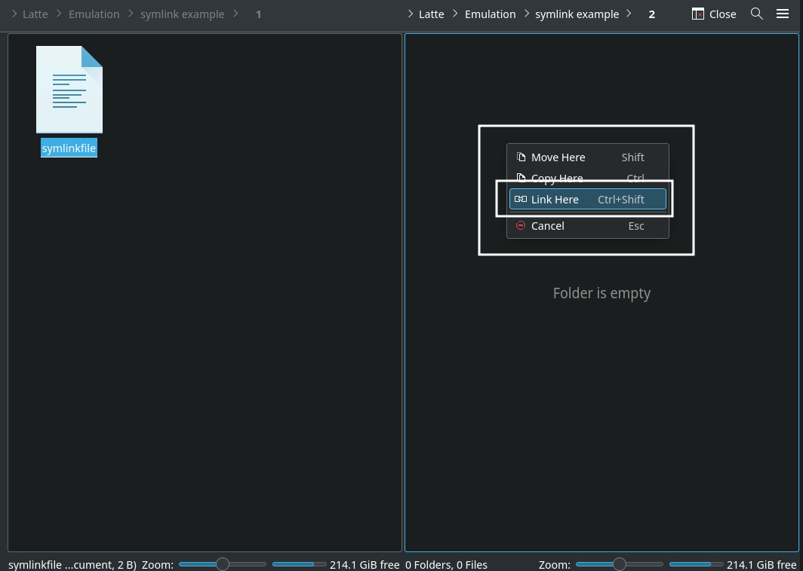

# File Management, learn how to manage your files like a wizard.

***

## File Management Table of Contents

1. [Managing ROM Files](#managing-rom-files)
    - [How to Manage ROMs with Multiple Discs](#how-to-manage-roms-with-multiple-discs)
    - [How to Verify ROMs](#how-to-verify-roms)

2. [Managing Emulators and Tools](#managing-emulators-and-tools)
    - [How to Swap out AppImages and Binaries](#how-to-swap-out-appimages-and-binaries)
    - [How to reset an emulator's configurations to EmuDeck's defaults](#how-to-reset-an-emulators-configurations-to-emudecks-defaults)
    - [Emulator Save and Save State Locations](#emulator-save-and-save-state-locations)

3. [Managing Files](#managing-files)
    - [How to Use Symlinks](#how-to-use-symlinks)
    - [How to transfer files to a Steam Deck](#how-to-transfer-files-to-a-steam-deck)

***

## Managing ROM Files
[Back to the Top](#file-management-table-of-contents)

***

### How to Manage ROMs with Multiple Discs
[Back to the Top](#file-management-table-of-contents)

***

#### Preface

To reduce the amount of files to manage, it's recommended to use EmuDeck's `Compression Tool`. Place your ROMs as you normally would in their respective folders, open the EmuDeck application on your desktop and run the `Compression Tool`. 

If you run the compression tool and you ran Steam ROM Manager previously, you will need to re-run Steam ROM Manager after compression to update your shortcuts. If you are following the guide on this page, you can wait until you are finished to re-run Steam ROM Manager. 

Compressing your ROMs makes managing multi-track games a lot simpler. You can create a playlist file (M3U) and place all of your tracks in this file. After creating the playlist file, treat the M3U file as the game (instead of the individual discs).

When the time comes to switch discs, you can use the various emulator quick-menus to seamlessly move onto the next disc. For a full list of hotkeys, see the [Hotkeys](../../controls-and-hotkeys/steamos/hotkeys.md) page.

**Important** 

* PCSX2 does not support M3U files
   * [How to Manage Multiple Discs in PCSX2](../../emulators/steamos/pcsx2.md#how-to-manage-multiple-discs)
* Xenia does not support M3U files
    * [How to Manage Multiple Discs in Xenia](../../emulators/steamos/xenia.md#how-to-manage-multiple-discs)

***

#### How to Create an M3U File

When it comes time to switch discs, various emulators have an option or a button to switch from one disc to the next. An M3U file allow you to manage ROMS with multiple discs and continue playing without any hiccup. 

Fortunately these M3U files are easy to create. 

**Here's How:**

1. In your ROM folder, right click, click `Create New Text File`
2. Name it `GAMENAME.m3u`
    * The file name of the M3U file is up to you. However, it is recommended you match the M3U file as closely as possible to the game name so Steam ROM Manager and EmulationStation-DE can scrape the appropriate game art or game info
    * For example, with the game: `The Legend of Dragoon`, you may name the M3U file, `The Legend of Dragoon.m3u` so Steam ROM Manager or EmulationStation-DE can locate the appropriate art. However, if you name it `LoD.m3u` as an example, neither tool will know to match `LoD` to `Legend of Dragoon`
3. Right click the text file, click `Open with Kate` or a text editor of your choice
4. Place the full file name of each ROM disc including the file extension on a separate line
    * **IMPORTANT:** If you are using both `.bin` and `.cue` files, only place the `.cue` files in the M3U file. It is recommended you use the EmuDeck compression tool for easier file management 
      * Example (Using D2 for the Dreamcast):
        * Folder: 
        * M3U File: 
5. Save and close out of the text file
6. From now on, you can treat the M3U as the game file, and play the respective ROM discs by running the newly created M3U file through one of EmuDeck's included front-ends: Steam shortcuts created by Steam ROM Manager, EmulationStation-DE, or by running the emulator directly
    * Steam ROM Manager:
      * Steam ROM Manager will still parse all of your discs in addition to the M3U file. To solve this, you can hide each disc entry, and only allow Steam ROM Manager to parse the M3U file
        * To learn more, see: [Steam ROM Manager: How to Manage ROMs with Multiple Discs](../../tools/steamos/steam-rom-manager.md#how-to-manage-roms-with-multiple-discs)
    * EmulationStation-DE:
      * EmulationStation-DE will display all of your discs in addition to the M3U file. To solve this issue, EmulationStation-DE allows you to treat directories as files. 
        * To learn more, see: [EmulationStation-DE: How to Manage ROMs with Multiple Discs](../../tools/steamos/emulationstation-de.md#how-to-manage-multiple-discs)
    * Alternatively, you can move all of your Multi-Disk games to a new folder
        * For example: `psx-multidisk`, and keep the .m3u files in the `psx` folder, changing the contents to point to the disks in their new location. This will prevent those disks from being read, as the parsers will not look in the new folders created
        * **Note:** Not all emulators support absolute pathing

Visual Tutorial: 

<figure class="video_container">
  <video controls="true" allowfullscreen="true">
    <source src="/videos/how-to-create-an-m3u-file.mp4" type="video/mp4">
  </video>
</figure>

***

### How to Verify ROMs
[Back to the Top](#file-management-table-of-contents)

#### How to Verify a ROM Successfully Transferred 

Sometimes, data loss or corruption can occur when you transfer ROMs to your Steam Deck. You can verify that the ROM successfully transferred by checking its MD5 Checksum. An MD5 Checksum is a 32-character hexadecimal number that is computed on a file. If the MD5 checksum on both the file on the Steam Deck and the original PC is an exact match, the file transferred successfully. If they do not match, the file is potentially corrupt. You will need to correct or adjust how you transfer files. 

**Here's How**

**On the Steam Deck**

1. Right click the ROM
2. Click Properties
    1. 
3. Click the Checksums tab
4. Click `Calculate` to the right of `MD5`
    1. Wait, it may take a few moments
    2. 

**On the non-Steam Deck PC**

* **Windows:** 
    * Download: [https://github.com/gurnec/HashCheck/releases](https://github.com/gurnec/HashCheck/releases)
    * Instructions: [https://steemit.com/utopian-io/@wangwenjing/how-to-use-hashcheck-in-windows](https://steemit.com/utopian-io/@wangwenjing/how-to-use-hashcheck-in-windows)
* **Mac:** [https://ss64.com/osx/md5.html](https://ss64.com/osx/md5.html)
* **Linux (Command-line):** [https://man7.org/linux/man-pages/man1/md5sum.1.html](https://man7.org/linux/man-pages/man1/md5sum.1.html)

#### How to Verify a ROM is Valid

For one reason or another, your ROM may be corrupt and may not work properly. One way to confirm that you have a valid ROM is by comparing it to the ROM page on [redump.org](http://redump.org). Redump is an internet community "dedicated to collecting precise and accurate information about every video game ever released". You can validate your ROM by comparing its MD5 Checksum, a 32-character hexadecimal number that is computed on a file, to the MD5 Checksum on [redump.org](http://redump.org). 

**Here's How**

#### How to Find your MD5 Checksum

**Note:** `Vampire Night`, for the Playstation 2 is being used as an example in the below guide. 

1. Right click the ROM
2. Click Properties
      * 
3. Click the Checksums tab
4. Click `Calculate` to the right of `MD5`
      * Wait, it may take a few moments
      * 
      * Note down the MD5 Checksum for the next section

#### How to Compare your MD5 Checksum to Redump

1. Open redump.org, and search for your ROM 
     * For example, Vampire Night's page: [http://redump.org/disc/13152/](http://redump.org/disc/13152/)
2. Note down the MD5 Checksum on the redump.org page and compare it to your ROM
     * Using Vampire Night as an example:
         * MD5 Checksum on the ROM: 
         * Redump's MD5 Checksum: 
3. The Vampire Night ISO MD5 Checksum matches to the MD5 Checksum on the redump page, meaning the ROM is valid

***

## Managing Emulators and Tools
[Back to the Top](#file-management-table-of-contents)

***

### How to Swap out AppImages and Binaries
[Back to the Top](#file-management-table-of-contents)

#### Preface

Sometimes, when an emulator updates, there can be regressions for certain games or bugs that break the emulator temporarily. You can downgrade to a previous version by replacing the emulator in `/home/deck/Applications`. 

Additionally for Yuzu, you can also use this feature to download the `Early Access` version of Yuzu. 

For some emulators, your ROMs launch using a script created by EmuDeck, which look for the corresponding emulator, depending on how it is installed or downloaded. In the case of PCSX2 and Yuzu, the script looks for two things: 

* The most recently downloaded version in `/home/deck/Applications`, based on the file date.
* The emulator name at the beginning of the file. Anything after the emulator name is ignored. `pcsx2-Qt` in the case of PCSX2 and `Yuzu` in the case of Yuzu. For example, if the latest version of `Yuzu` is `1351` and you would like to downgrade to `1349`. When you download `yuzu 1349`, you could rename it to `Yuzu-1349.AppImage`, and EmuDeck's script will ignore the `-1349` in the file name, allowing you to record which versions of Yuzu you are using through the file name. 

#### List of Supported Emulators and Tools

* Cemu (AppImage)
    * Executable Location: `/home/deck/Applications/Cemu.AppImage`
    * Download Link: [https://github.com/cemu-project/Cemu/releases](https://github.com/cemu-project/Cemu/releases)
* Cemu (Swap out its EXE)
    * Executable Location: `Emulation/roms/wiiu/cemu.exe`
    * Download Link: [https://github.com/cemu-project/Cemu](https://github.com/cemu-project/Cemu)
* EmulationStation-DE
    * Executable Location: `Emulation/tools/EmulationStation-DE-x64_SteamDeck.AppImage`
    * Download Link: [https://gitlab.com/es-de/emulationstation-de/-/packages/](https://gitlab.com/es-de/emulationstation-de/-/packages/)
* mGBA
    * Executable Location: `/home/deck/Applications/mGBA.AppImage`
    * Download Link: [https://github.com/mgba-emu/mgba/releases](https://github.com/mgba-emu/mgba/releases)
* PCSX2-QT
    * Executable Location: `/home/deck/Applications/pcsx2-Qt.AppImage`
    * Download Link: [https://pcsx2.net/downloads/#nightly-anchor](https://pcsx2.net/downloads/#nightly-anchor)
* Ryujinx
   * Executable Location: `/home/deck/Applications/publish/Ryujinx`
   * Download Link: [https://github.com/Ryujinx/release-channel-master/releases](https://github.com/Ryujinx/release-channel-master/releases)
* Steam ROM Manager
    * Executable Location: `Emulation/tools/srm/Steam-ROM-Manager.AppImage`
    * Download Link: [https://github.com/SteamGridDB/steam-rom-manager/releases](https://github.com/SteamGridDB/steam-rom-manager/releases)
* Vita3K
    * Executable Location: `/home/deck/Applications/Vita3K/Vita3K`
* Xenia (Swap out its EXE)
    * Executable Location: `Emulation/roms/xbox360/xenia_canary.exe`
    * Download Link: [https://github.com/xenia-canary/xenia-canary/releases](https://github.com/xenia-canary/xenia-canary/releases)
* Yuzu
    * Executable Location: `/home/deck/Applications/yuzu.AppImage`
    * Download Link: [https://github.com/yuzu-emu/yuzu-mainline/releases](https://github.com/yuzu-emu/yuzu-mainline/releases)

#### How to Swap Out Emulators

1. Download the version of the emulator you would like to use, from the list above to your `/home/deck/Downloads` folder
2. Open the respective emulator folder location, using the list above: [List of Supported Emulators and Tools](#list-of-supported-emulators-and-tools)
3. Move the downloaded emulator from Step 1 to the folder in Step 2
3. Rename or delete the original emulator file
    * Rename it so it can be distinguished from your downloaded file
        * A Few Examples: 
            * Rename `Yuzu.AppImage` to `Yauzu.AppImage`
            * Rename `Yuzu.AppImage` to add a `.bak` to the end of the file extension, `Yuzu.AppImage.bak` 
            * Rename `Yuzu.AppImage` to add the version number. For example, if the latest version is 1351, rename it to `Yuzu-1351.AppImage`
4. Right click the newly downloaded emulator, click `Properties`, click `Permissions`, check `Is executable`
5. Your games will now launch using the version of the emulator you downloaded

Watch the following GIF for a visual (Yuzu is being used as an example in this GIF):

***

### How to reset an emulator's configurations to EmuDeck's defaults
[Back to the Top](#file-management-table-of-contents)

Sometimes after installing EmuDeck, you may notice an emulator's configurations were not set properly or you tweaked something on accident and you do not remember the default settings. 

You may reset an emulator's configurations in the `Manage Emulators` page. 

**Tutorial**

1. Open EmuDeck on your desktop.
2. Click the `Manage Emulators` button.
3. Select which emulator configurations you would like to reset in the drop-down menu.
4. Click `Reset configuration`, wait a moment.
    1. Using PCSX2 as an example: 
5. Your selected emulator has been reset.

***

### Emulator Save and Save State Locations
[Back to the Top](#file-management-table-of-contents)

**Note:** Some of the save locations below may include both a `Symlink` and a `Target` location. A `Symlink` is similar to a Windows shorcut, it points to the original location of the file and allows for easier access of that file. If you are backing up save files or interacting with save files, be sure to use the `Target` location. Backing up the `Symlink` location will not preserve the original save files.

Some of the Symlinks below (including RPCS3 and Yuzu) may point to another location within the `Emulation` folder created by EmuDeck. Although backing up the symlink will not preserve these saves, these saves are still localized within your general `Emulation` folder meaning that if your EmuDeck install is on an SD Card or you backed up the entire `Emulation` folder, these saves are safe.

#### Cemu Native

* Saves Location:
    * Symlink:  `Emulation/saves/Cemu/saves/`
    * Target: `Emulation/roms/wiiu/mlc01/usr/save`

#### Cemu Proton

* Saves Location:
    * Symlink:  `Emulation/saves/Cemu/saves/`
    * Target: `Emulation/roms/wiiu/mlc01/usr/save`

#### Citra

* Saves Location:
    * Symlink: `Emulation/saves/citra/saves`
    * Target: `/home/deck/.var/app/org.citra_emu.citra/data/citra-emu/sdmc`
* Save States Location:
    * Symlink: `Emulation/saves/citra/states/`
    * Target: `/home/deck/.var/app/org.citra_emu.citra/data/citra-emu/states`

#### Dolphin

* Saves (Wii):
    * Symlink: `Emulation/saves/dolphin/Wii`
    * Target: `/home/deck/.var/app/org.DolphinEmu.dolphin-emu/data/dolphin-emu/Wii`
* Saves (GameCube):
    * Symlink: `Emulation/saves/dolphin/GC`
    * Target: `/home/deck/.var/app/org.DolphinEmu.dolphin-emu/data/dolphin-emu/GC`
* Save States (Wii):
    * Symlink: `Emulation/saves/dolphin/StateSaves`
    * Target: `/home/deck/.var/app/org.DolphinEmu.dolphin-emu/data/dolphin-emu/StateSaves`
* Save States (GameCube):
    * Symlink: `Emulation/saves/dolphin/StateSaves`
    * Target: `/home/deck/.var/app/org.DolphinEmu.dolphin-emu/data/dolphin-emu/StateSaves`

#### DuckStation

* Saves: `Emulation/saves/duckstation/saves`
* Save States: `Emulation/saves/duckstation/states`

#### MAME

* Saves: `Emulation/saves/MAME/saves`
* Save States: `Emulation/saves/MAME/states`

#### melonDS

* Saves: `Emulation/saves/melonds/saves`
* Save States: `Emulation/saves/melonds/states`

#### mGBA

* Saves: `Emulation/saves/mgba/saves`
* Save States `Emulation/saves/mgba/states`

#### PCSX2

* Saves: `Emulation/saves/pcsx2/saves`
* Save States `Emulation/saves/pcsx2/states`

#### PPSSPP

* Saves: 
    * Symlink: `Emulation/saves/ppsspp/saves`
    * Target: `/home/deck/.var/app/org.ppsspp.PPSSPP/config/ppsspp/PSP/SAVEDATA`
* Save States:
    * Symlink: `Emulation/saves/ppsspp/states/`
    * Target: `/home/deck/.var/app/org.ppsspp.PPSSPP/config/ppsspp/PSP/PPSSPP_STATE`

#### PrimeHack

* Saves:
    * Symlink: `Emulation/saves/primehack/Wii`
    * Target: `/home/deck/.var/app/io.github.shiiion.primehack/data/dolphin-emu/Wii`
* Save States:
    * Symlink: `Emulation/saves/primehack/Savestates`
    * Target: `/home/deck/.var/app/io.github.shiiion.primehack/data/dolphin-emu/StateSaves/`

#### RetroArch

* Saves:
    * Symlink: `Emulation/saves/retroarch/saves`
    * Target Location: `/home/deck/.var/app/org.libretro.RetroArch/config/retroarch/saves/`
* Save States:
    * Symlink: `Emulation/saves/retroarch/states`
    * Target Location: `/home/deck/.var/app/org.libretro.RetroArch/config/retroarch/states/`

#### Rosalie's Mupen GUI

* Saves: `Emulation/saves/RMG/saves`
* Save States: `Emulation/saves/RMG/states`

#### RPCS3

* Saves: 
    * Symlink: `Emulation/saves/rpcs3/saves`
    * Target: `Emulation/storage/rpcs3/dev_hdd0/home/00000001/savedata`

#### Ryujinx

* Saves:
    * Symlink: `Emulation/saves/ryujinx/saves`
    * Target: `/home/deck/.config/Ryujinx/bis/user/save`
* saveMeta:
    * Symlink: `Emulation/saves/Ryujinx/saveMeta`
    * Target: `/home/deck/.config/Ryujinx/bis/user/saveMeta`

#### ScummVM

* Saves: `Emulation/saves/scummvm/saves`

#### Vita3K

* Saves: `Emulation/storage/Vita3K/ux0/user/00/savedata`
    * Save folders correspond to a game's Title ID. To locate your game's Title ID, open Vita3K, right click a game, and click `Information`

#### Xemu

* Saves:
    * `Emulation/storage/xemu/xbox_hdd.qcow2`
        * To access your saves, read [Xemu How to Access Saves](../../emulators/steamos/xemu.md#how-to-access-saves)
    * `Emulation/storage/xemu/eeprom.bin`

#### Xenia

* Saves: `Emulation/roms/xbox360/content`

#### Yuzu

* Saves:
    * Symlink: `Emulation/saves/yuzu/`
    * Target Location: `Emulation/storage/yuzu/nand/user/save/`

***

## Managing Files
[Back to the Top](#file-management-table-of-contents)

***

### How to Use Symlinks
[Back to the Top](#file-management-table-of-contents)

#### Preface

Symbolic links, or symlinks for short, are a powerful way to link files or directories. Symlinks are a kind of file that points to another file, similar to a shortcut on Windows. However, symlinks are much more versatile. 

A few features of symlinks include: renaming the symlink, crossing partitions (between an SD card and an internal SSD for example), and creating multiple symlinks to the same file. 

It is recommended you symlink your folders inside of the folders created by EmuDeck. For example, if you would like to symlink a PlayStation 2 ROM folder, symlink this folder inside of the `Emulation/roms/ps2` folder instead of overwriting the `ps2` folder. 

#### Use Cases

Let's go over a few use cases specifically pertaining EmuDeck: 

* If you wanted to install EmuDeck on multiple storage devices, you could instead install EmuDeck to the internal SSD and symlink ROM folders from the various storage devices to the ROM folders within the `Emulation` folder on the internal SSD. 
* If you had a large texture pack folder or a large folder of any sort, you could place this folder on your removable storage device and symlink it to its expected location on the internal SSD.
* If you wanted to symlink your NAS to your `Emulation` folder. 

#### How to create a Symlink

You can create a symlink a couple of ways. One method is to create a symlink through Dolphin (file manager). Keep in mind that within Dolphin (file manager), you can open tabs and view multiple folders at the same time.

When you have your original folder or file and the destination ready, drag the original folder or file to the destination and click `Link here`. A symlink is indicated with a small link icon and the file name in italics.

##### Photos

1. 
2. 
3. 

##### GIF

***

### How to transfer files to a Steam Deck
[Back to the Top](#file-management-table-of-contents)

#### Preface

By default, Steam Deck formats your SD card in ext4 format, which is not readable on Windows without additional tinkering. Use one of the following methods to transfer files to your Steam Deck.

#### List of File Transfer Methods

- [Method 1: SSH](#method-1-ssh)
    - [Tutorial 1: Text](#tutorial-1-text)
    - [Tutorial 2: Video](#tutorial-2-video)
- [Method 2: DeckMTP](#method-2-deckmtp)
- [Method 3: Removable Storage Device ](#method-3-removable-storage-device)
- [Method 4: AnyDesk](#method-4-anydesk)
- [Method 5: SMB Shares](#method-5-smb-shares)

***

##### Method 1: SSH
[Back to the Top](#list-of-file-transfer-methods)

Select **one** of the two tutorials below:

* [Tutorial 1: Text](#tutorial-1-text)
* [Tutorial 2: Video](#tutorial-2-video)

Although the below guide may look lengthy, SSH is a quick and easy process to set up. Once you have it set up, you can transfer files with ease in both Desktop Mode and Game Mode, no additional storage device needed. 

***

##### Tutorial 1: Text
[Back to the Top](#list-of-file-transfer-methods)

###### Part 1 of 2: On the Steam Deck

1. Open `Konsole`
2. In Konsole, type  `passwd` and follow the prompts to set a password for the account
    1. Your password will be invisible. Press enter when you've finished, you will be prompted to type it once again as confirmation
3. In Konsole, type `sudo systemctl enable --now sshd` to both start and permanently enable the service
4. In Konsole, type `ip addr | grep inet | grep wlan0`, jot down the `###.###.##.##` number in front of `inet`

***

###### Part 2 of 2: On the Non-Steam Deck PC

Install Filezilla or WinSCP on your computer. No additional program is needed on the Steam Deck. 

WinSCP is only available on Windows: [https://winscp.net/eng/download.php](https://winscp.net/eng/download.php)

Filezilla is available on Linux, Mac, and Windows:

* Windows: [https://filezilla-project.org/download.php?platform=win64](https://filezilla-project.org/download.php?platform=win64)
* Mac: [https://filezilla-project.org/download.php?platform=osx](https://filezilla-project.org/download.php?platform=osx)

Select **one** of the two and follow the respective guide below. 

* [Option 1: How to Use Filezilla](#option-1-how-to-use-filezilla)
* [Option 2: How to Use WinSCP](#option-2-how-to-use-winscp)

***

###### Option 1: How to Use Filezilla 

1. Install FileZilla: [https://filezilla-project.org/](https://filezilla-project.org/) on your non-Steam Deck PC
    * No additional program is needed on the Steam Deck
2. Click the icon in the top left
    * 
3. Click `New Site`, give it a memorable name
4. Use the following template: 
    * Protocol: `SFTP - SSH File Transfer Protocol`
    * Host: `steamdeck` or the `###.###.##.##` number you received in `Step 4` in the `On the Steam Deck` section
    * Port: Either blank or `22`
    * Logon Type: Normal
    * User: `deck`
    * Password: The password you set in `Step 2` in the `On the Steam Deck` section
    * 
5. Click `Connect`
6. (Optional) To browse to your SD Card, click the `..` at the top two times, select the `run` folder, `media`, `mmcblk0p1`
7. Drag files between the two windows or use the context menu (`Right Click`) to transfer files

***

###### Option 2: How to Use WinSCP  

1. Install WINSCP: [https://winscp.net/eng/index.php](https://winscp.net/eng/index.php) on your non-Steam Deck PC
    * No additional program is needed on the Steam Deck
2. Open WinSCP and you should be prompted with WinSCP's address book
    * 
    * You can also re-open this interface by clicking `New Session` in the top left
3. On the right side of the screen, use the following template: 
    * File Protocol: `SFTP`
    * Host Name: `steamdeck` or the `###.###.##.##` number you received in `Step 4` in the `On the Steam Deck` section
    * Port number: `22` or blank
    * User name: `deck` 
    * Password: The password you set in `Step 2` in the `On the Steam Deck` section
    * 
4. Click `Save` under the `User name` box and give the site name a memorable name
    * 
5. Click `Login`
6. (Optional) To browse to your SD Card, click the `..` at the top two times, select the `run` folder, `media`, `mmcblk0p1`
7. Drag files between the two windows or use the context menu (`Right Click`) to transfer files

***

###### Post File Transfer

After you are finished setting up SSH and you have transferred your files, you may want to consider disabling SSH.

With a weak sudo password, leaving SSH enabled **may** be a security risk if you take your Steam Deck outside of your home and connect it to public Wi-Fi. With a strong sudo password, this risk is less apparent. Regardless, this section will cover how to disable SSH. 

Select **one** of the two and follow the respective section below. 

* [Option 1: Terminal Command](#option-1-terminal-command)
* [Option 2: Decky Loader Plugin](#option-2-decky-loader-plugin)

###### Option 1: Terminal Command

1. In Desktop Mode, enter the below command in Konsole to disable SSH 
    * `sudo systemctl disable --now sshd`
2. To re-enable SSH, enter the below command in Konsole
    * `sudo systemctl enable --now sshd`

###### Option 2: Decky Loader Plugin

Skip Steps 1-4 if you have already installed Decky Loader

1. Open `EmuDeck` on your desktop
2. Select `Power Tools` 
3. Enter your password, and click `Install PowerTools`
    * If you have not set a password, this page will prompt you to create one
4. Restart your Steam Deck
5. In Game Mode, press the `...` button, press the Socket icon
6. Click the store icon in the top right, install `System Toolbox`
7. After installing `System Toolbox`: In Game Mode, press the QAM (`...`) button, press the socket icon (Decky Loader's icon), select `System Toolbox` and disable `Remote Terminal Access`
    * 
8. When you would like to transfer files again, re-enable `Remote Terminal Access`

***

#### Tutorial 2: Video
[Back to the Top](#list-of-file-transfer-methods)

Watch: [https://www.youtube.com/watch?v=F790rBfyAQM](https://www.youtube.com/watch?v=F790rBfyAQM)

***

#### Method 2: DeckMTP
[Back to the Top](#list-of-file-transfer-methods)

**Preface**

Watch: [https://www.youtube.com/watch?v=4GcbEWl12Uc](https://www.youtube.com/watch?v=4GcbEWl12Uc)

For further reading: [https://github.com/dafta/DeckMTP](https://github.com/dafta/DeckMTP)

DeckMTP is a Decky Loader plugin that allows the Steam Deck to be detected as a MTP drive (similar to a USB drive), once directly plugged into a PC via USB. (MacOS users may need the Android File Transfer App to be able to transfer files to MTP devices.)

***

##### How to Install DeckMTP

1. Boot to desktop mode and open `Konsole`
2. In Konsole, type  `passwd` and follow the prompts to set a password for the account
    * Your password will be invisible. Press enter when you've finished, you will be prompted to type it once again as confirmation
3. Install Decky Loader by choosing one of the two following ways:
    * Install through the EmuDeck application
    * Install from the DeckyLoader Github: [https://github.com/SteamDeckHomebrew/decky-loader](https://github.com/SteamDeckHomebrew/decky-loader)
       * Press the big `Download` button at the top
4. Restart the Steam Deck
5. In Game Mode, press the QAM (`...`) button
6. Press the `Socket` icon at the bottom of the list
    * 
7. In the top right, press the `Store` icon
    * 
8. Install DeckMTP
    * 

***

##### How to Set up DeckMTP

DeckMTP requires enabling DRD. 

For a Youtube Video, watch: [https://www.youtube.com/watch?v=4GcbEWl12Uc](https://www.youtube.com/watch?v=4GcbEWl12Uc)

1. To enable DRD, shut down your Steam Deck
2. Enter the BIOS by holding Volume Up and Power until you hear a beep
3. Select Setup Utility
4. Select Advanced
5. Select USB Configuration
6. Select USB Dual-Role Device
7. Select DRD instead of the existing XHCI
8. Plugging your Steam Deck into a PC via USB should now make it show up as a drive

***

#### Method 3: Removable Storage Device
[Back to the Top](#list-of-file-transfer-methods)

Use a flash drive or a removable storage device that can be read on both Windows and Linux. You may need either a USB C adapter or a USB C Hub. 

***

#### Method 4: AnyDesk
[Back to the Top](#list-of-file-transfer-methods)

##### On the Steam Deck

1. Install Anydesk from Discover (Shopping Bag icon) in desktop mode
2. Install Flatseal from Discover (Shopping Bag icon) in desktop mode
3. Open Flatseal
4. On the left, select AnyDesk
5. Under `Filesystem`, toggle `All system files, filesystem=host`
    * 

##### On the Non-Steam Deck PC

1. Install AnyDesk on your other PC from the website: [https://anydesk.com/](https://anydesk.com/) 
2. Connect to your Steam Deck
3. Use AnyDesk's file transfer feature to transfer files between your Steam Deck and non Steam Deck PC

##### How to use AnyDesk to Transfer Files

1. Connect to your Steam Deck
2. Click the box with a right arrow at the top
    * 
3. Your non-Steam Deck PC will be on the left side of the screen, your Steam Deck will be on the right side of the screen, right click files on either side to `Upload` or `Download` to the respective devices

##### Tips

* Your SD Card path is `/run/media/...`. To navigate to your SD Card, click the `..` dots at the top until you are in the `/` directory. You will see the `run` folder, you can navigate to the remaining folders from here

***

#### Method 5: SMB Shares
[Back to the Top](#list-of-file-transfer-methods)

Pick a tutorial: 

* Watch: [https://www.youtube.com/watch?v=x4_Sexd1UAw](https://www.youtube.com/watch?v=x4_Sexd1UAw)
* Read (Verbose): [https://www.reddit.com/r/SteamDeck/comments/wdyqya/the_semiultimate_guide_to_smb_shares_on_steam_deck/](https://www.reddit.com/r/SteamDeck/comments/wdyqya/the_semiultimate_guide_to_smb_shares_on_steam_deck/)
* Read (Succinct): [https://www.reddit.com/r/SteamDeck/comments/tfjq1m/how_to_connect_to_smb_shares/iosxjcm/](https://www.reddit.com/r/SteamDeck/comments/tfjq1m/how_to_connect_to_smb_shares/iosxjcm/)

***