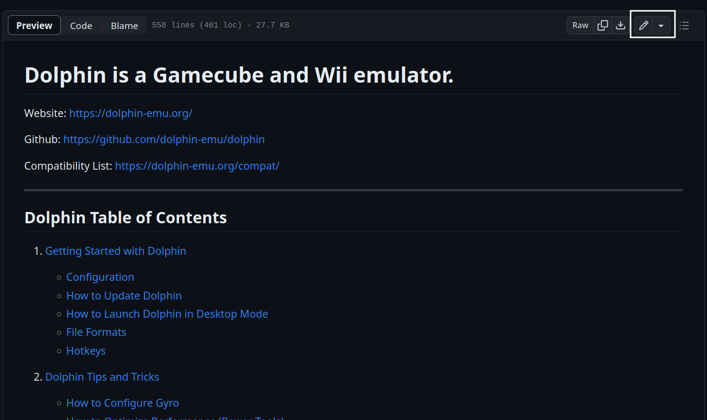

# How to Contribute to EmuDeck

[TOC]

## How to Contribute to the EmuDeck Wiki

EmuDeck Wiki GitHub Repository: [https://github.com/EmuDeck/emudeck.github.io](https://github.com/EmuDeck/emudeck.github.io)

### Option 1: A quick shout-out

Send a quick message on EmuDeck's Discord stating what needs to be edited or added.

[EmuDeck Discord Link](https://discord.gg/b9F7GpXtFP)

### Option 2: Opening an Issue

You will need to create a GitHub account to open an issue. To sign up for GitHub, see [https://github.com/signup](https://github.com/signup).

Once you have created an account, you can visit this page: [https://github.com/EmuDeck/emudeck.github.io/issues](https://github.com/EmuDeck/emudeck.github.io/issues) and submit an issue. 

### Option 3: Editing the Markdown files

You will need to create a GitHub account to open a Pull Request. To sign up for GitHub, see [https://github.com/signup](https://github.com/signup).

Markdown is a fairly straightforward markup language. If you are not familiar, you can take a quick look at the documents in the `docs` folder. 

Depending on your comfort level with GitHub, you can either use GitHub's web editor to edit any markdown files or you may also clone the repository and edit the markdown files that way. 

To edit markdown files in GitHub's web editor, open a document in the `docs` folder, and click the small pencil icon in the top right. Once you are finished, click `Commit changes..`. GitHub will prompt you to open a Pull Request, which will then be merged once it is reviewed. 

Once the PR is merged and reviewed, your changes will automatically be deployed to the website.

If you do choose to clone the repository, you only need to clone the `main` branch. 

Depending on your permission level, when you are finished making edits, either push your changes to `main` or create a Pull Request. Any changes you make to the markdown files will automatically be pushed to the `gh-pages` branch and deployed to the website once you have either pushed your changes to `main` or your Pull Request is approved and merged.  

#### How to Contribute Using GitHub's Web Editor

Select a document to edit in the `docs` folder here: [https://github.com/EmuDeck/emudeck.github.io/tree/main/docs](https://github.com/EmuDeck/emudeck.github.io/tree/main/docs)

This section will use `Dolphin on SteamOS` as an example.

1. On the page you would like to edit, click the pencil icon in the top right
    * 
2. Make any changes you would like
3. Once you are finished making your changes, click the `Commit changes...` button in the top right
    * 
4. You will be prompted to create a Pull Request. Add a little bit of detail about what you added and why
    * 
    * You will not see the option to `Commit directly to the main branch` so do not worry about inadvertently making any changes
5. Submit your Pull Request
6. Once your Pull Request is reviewed, it will be merged and any of your changes will automatically be deployed to the website

#### How to Contribute Using a Cloned Repository

##### Software

This is not a definitive list of software, but instead a tailored list for those new to contributing to GitHub repositories.

* [GitHub Desktop](https://desktop.github.com/)
* [Visual Studio Code](https://code.visualstudio.com/)

#### Cloning

Clone the EmuDeck repository, either using the command line, [GitHub Desktop](https://desktop.github.com/), or through your preferred software. 

[Clone and use a GitHub repository in Visual Studio Code](https://learn.microsoft.com/en-us/azure/developer/javascript/how-to/with-visual-studio-code/clone-github-repository?tabs=activity-bar)

#### Python

The EmuDeck wiki uses python for MkDocs, MkDocs-Material (the theme), and many of its extensions.

If you are on Windows, you can download Python from the website at [https://www.python.org/](https://www.python.org/). If you are on Linux, you can install Python from the various package managers.

#### Virtual Environments

In your newly cloned repo, you can set up a virtual environment to localize your Python install to the work you do on the EmuDeck wiki.

Follow the instructions on Python's documentation, [https://packaging.python.org/en/latest/guides/installing-using-pip-and-virtual-environments/](https://packaging.python.org/en/latest/guides/installing-using-pip-and-virtual-environments/) to learn how to create a virtual environment. The `.venv` folder is ignored when you commit to the GitHub repository.

After you have set up your virtual environment, install the various software.

Generally, the command will be `python3 -m pip install SOFTWARENAME` (Linux) or `py -m pip install SOFTWARENAME` (Windows).

```
mkdocs-material
mkdocs-glightbox
mkdocs-static-i18n
mkdocs-table-reader-plugin
mkdocs-rss-plugin
```

#### Testing your changes

In your newly cloned repo, open a command prompt and enter `mkdocs serve`.  After you enter the command, you will be provided a URL that you can use to locally host the EmuDeck Wiki on your computer. This will allow you to see your changes in real time. Every change you save will automatically be applied

#### Opening a Pull Request or Committing

Once you are satisified with your changes, you can open a Pull Request or commit directly to the EmuDeck wiki. 

Either use [GitHub Desktop](https://desktop.github.com/) or your preferred software to create a Pull Request.

If you are using Visual Studio Code, see [https://github.blog/2019-01-07-create-pull-requests-in-vscode/](https://github.blog/2019-01-07-create-pull-requests-in-vscode/) and [https://code.visualstudio.com/blogs/2018/09/10/introducing-github-pullrequests](https://code.visualstudio.com/blogs/2018/09/10/introducing-github-pullrequests) to learn how.  

### Examples of Wiki Contributions

#### New Issues With Emulators

If you notice a new update with an emulator or tool significantly impacts its functionality, you may edit the wiki to bring notice and suggest possible temporary solutions. 

To do so, add a section to the [Known Issues](./known-issues/steamos/index.md) page with a date of when the issue occurred. To edit the page, visit [https://github.com/EmuDeck/emudeck.github.io/blob/main/docs/known-issues/steamos/index.md](https://github.com/EmuDeck/emudeck.github.io/blob/main/docs/known-issues/steamos/index.md) and see [How to Contribute Using GitHub's Web Editor](#how-to-contribute-using-githubs-web-editor) to learn how.

After editing the page, you may also use GitHub's web editor to edit the `main.html` file in the `overrides` folder, [https://github.com/EmuDeck/emudeck.github.io/blob/main/overrides/main.html](https://github.com/EmuDeck/emudeck.github.io/blob/main/overrides/main.html) to include an announcement at the top of the website alerting users to the issue on the [Known Issues](./known-issues/steamos/index.md) page.

As an example for how `main.html` might be formatted, see below:

```



ANNOUNCEMENT: Audio is not working in the latest version of DuckStation, visit <a href="https://emudeck.github.io/known-issues/steamos/#duckstation-audio-not-working-september-16th-2023">https://emudeck.github.io/known-issues/steamos/#duckstation-audio-not-working-september-16th-2023</a> for a solution.

```

Only the text between `` and `` needs to be updated when a new major issue occurs. To link to a page, `<a href="linktopage">repeatsamelinkhere</a>`. Example: `<a href="https://www.google.com/">https://www.google.com/</a>`.

Once the issue is resolved, you may edit the same section on the [Known Issues](./known-issues/steamos/index.md) including when it was resolved. You do not need to remove the section.

***

## How to Contribute to EmuDeck

### Examples of Pull Requests

#### Steam Input Profiles

##### How to Export and Share Steam Input Profiles

#### Homebrew Games

##### Pull Request Example

Game Name: Apotris

* [https://github.com/EmuDeck/emudeck-homebrew/pull/1](https://github.com/EmuDeck/emudeck-homebrew/pull/1)
* [https://github.com/dragoonDorise/EmuDeck/pull/706](https://github.com/dragoonDorise/EmuDeck/pull/706)

##### Contribution Expectations

On the [EmuDeck Homebrew Repository](https://github.com/EmuDeck/emudeck-homebrew), create a Pull Request with the following items:

* ROM, typically zipped in the respective ROM folder
* A photo of the title screen in `titlescreens/homebrew`
* A generic photo of the game in `screenshots/homebrew`

On the [EmuDeck Repository](https://github.com/dragoonDorise/EmuDeck), create a Pull Request with the following items:

* A JSON file matching the homebrew game name in the respective ROM folder within the `store` folder, using the following format (replace the text in all capital letters)

        {
        "system": "SYSTEMNAME",
        "status": "true",
        "logo": "logo_SYSTEMNAME",
        "title": "GAMENAME",
        "url": "XXXX",
        "file": "https://raw.githubusercontent.com/EmuDeck/emudeck-homebrew/main/SYSTEMNAME/GAMENAME.zip",
        "description": "FILLINDESCRIPTION",
        "pictures": {
            "screenshots": [
            "https://raw.githubusercontent.com/EmuDeck/emudeck-homebrew/main/downloaded_media/SYSTEMNAME/screenshots/homebrew/GAMENAME.png?raw=true"
            ],
            "titlescreens": [
            "https://raw.githubusercontent.com/EmuDeck/emudeck-homebrew/main/downloaded_media/SYSTEMNAME/titlescreens/homebrew/GAMENAME.png?raw=true"
            ]
        },
        "tags": ["GENRENAME"]
        }

***

## How to Contribute to the EmuDeck Application

***

**Thank you for contributing!**
