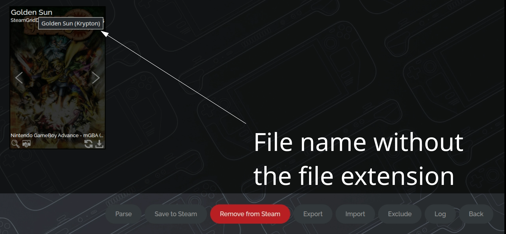
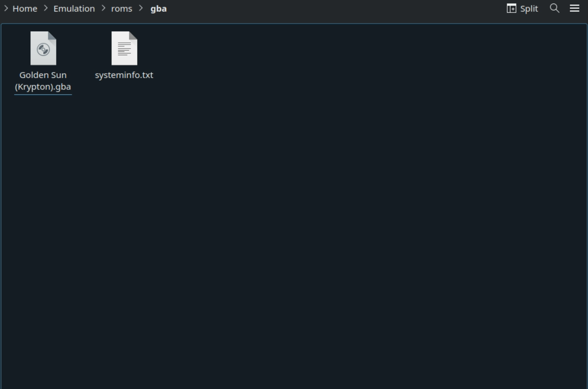

# Steam ROM Manager is a tool to add ROMs as Non-Steam Game Shortcuts. 

## Introduction

EmuDeck installs Steam ROM Manager [https://github.com/SteamGridDB/steam-rom-manager](https://github.com/SteamGridDB/steam-rom-manager), which allows you to add your ROMs directly to your library.  It can either be used as an alternative or in tandem with ES-DE (a frontend application to manage your ROMs.).

Steam ROM Manager's Website: [https://github.com/SteamGridDB/steam-rom-manager](https://github.com/SteamGridDB/steam-rom-manager)

Steam ROM Manager sources art from SteamGridDB: [https://www.steamgriddb.com/
](https://www.steamgriddb.com/)

Read the [ES-DE](../steamos/es-de.md) page to learn more about ES-DE and how it can be used in tandem with Steam ROM Manager! 

***

## Steam ROM Manager Table of Contents

1. [Getting started with Steam ROM Manager](#getting-started-with-steam-rom-manager)
    - [Configuration](#configuration)
    - [Steam ROM Manager Folder Locations](#steam-rom-manager-folder-locations)
    - [How to Update Steam ROM Manager](#how-to-update-steam-rom-manager)
    - [How to Launch Steam ROM Manager in Desktop Mode](#how-to-launch-steam-rom-manager-in-desktop-mode)
    - [How to Reset Steam ROM Manager](#how-to-reset-steam-rom-manager) 
2. [Common Issues](#common-issues)
    - [The Dangers of Proton](#the-dangers-of-proton)
    - [Special Characters](#special-characters)
    - [I hit the "Remove all added app entries" button, but the entries were not removed!](#i-hit-the-remove-all-added-app-entries-button-but-the-entries-were-not-removed)
    - [Help, I just opened Steam ROM Manager and I have no controls!](#help-i-just-opened-steam-rom-manager-and-i-have-no-controls)
    - [Why does Steam ROM Manager have no parsers?](#why-does-steam-rom-manager-have-no-parsers)
    - ["Please shutdown Steam if it is running"](#please-shutdown-steam-if-it-is-running)
    - [Large ROM Collections](#large-rom-collections)
    - [Why are my games not showing up in Steam ROM Manager?](#why-are-my-games-not-showing-up-in-steam-rom-manager)
    - [Why do some of my multi-disc games not show up in Steam ROM Manager?](#why-do-some-of-my-multi-disc-games-not-show-up-in-steam-rom-manager)
    - [Unexpected end of JSON input](#Unexpected-end-of-JSON-input)
    - [Error occurred while loading configuration presets](#error-occurred-while-loading-configuration-presets)
    - [A JavaScript error occurred in the main process](#a-javascript-error-occurred-in-the-main-process)
    - [I deleted a user account but Steam ROM Manager still shows their user ID](#i-deleted-a-user-account-but-steam-rom-manager-still-shows-their-user-id)
3. [Steam ROM Manager Tips and Tricks](#steam-rom-manager-tips-and-tricks)
    - [How to Generate and Save an App List](#how-to-generate-and-save-an-app-list)
    - [How to Fix a Mismatched Entry](#how-to-fix-a-mismatched-entry)
    - [How to Hide an Entry in Steam ROM Manager](#how-to-hide-an-entry-in-steam-rom-manager)
    - [How to Manage ROMs with Multiple Discs](#how-to-manage-roms-with-multiple-discs)
    - [How to Hide ROMs on a Per Parser Basis](#how-to-hide-roms-on-a-per-parser-basis)
    - [How to Remove All Shortcuts From Your Steam Library](#how-to-remove-all-shortcuts-from-your-steam-library)
    - [How to Customize Artwork for your ROMs](#how-to-customize-artwork-for-your-roms)
    - [How to Change Themes](#how-to-change-themes)
    - [How to Backup Your Image Choices](#how-to-backup-your-image-choices)
    - [How to Remove ROMs on a Per System Basis](#how-to-remove-roms-on-a-per-system-basis)
    - [How to See File Names in Steam ROM Manager](#how-to-see-file-names-in-steam-rom-manager)

***

## Getting started with Steam ROM Manager
[Back to the Top](#steam-rom-manager-table-of-contents)

Steam ROM Manager is a powerful tool used to add ROMs, emulators, and tools as non-Steam shortcuts to your Steam library. Fortunately, with EmuDeck, Steam ROM Manager comes fully pre-configured with a user friendly theme.

Open Steam ROM Manager through the EmuDeck application on your desktop or through the applications launcher (Steam icon in the bottom left of your taskbar). Do note that it will exit out of Steam and switch your controls into "Lizard Mode". You will retain use of the trackpad but will need to use R2 to left click and L2 to right click instead of clicking with the trackpad. 

First, place your ROMs with the expected file formats into their respective system folders in `Emulation/roms`. Read the the [Cheat Sheet](../../cheat-sheet.md) if you have not done so already, it will cover the expected file formats as well as expected BIOS for the various systems.

After you place your ROMs in their respective system folders, learn how to generate and parse an app list here: [How to Generate and Save an App List](#how-to-generate-and-save-an-app-list). 

If you open Steam ROM Manager, and you do not see any parsers, to fix the issue, read: [Why does Steam ROM Manager have no parsers?](#why-does-steam-rom-manager-have-no-parsers). 

After you have parsed and saved an app list, your ROMs will be added to the non-Steam section. You will now be ready to play your games directly from Game Mode. 

If you prefer, you may use the `ES-DE` parser to add `ES-DE` to Steam and play your ROMs directly from this all-in-one front-end. 

***

### Configuration
[Back to the Top](#steam-rom-manager-table-of-contents)

* Type of Tool: AppImage
* Executable Location: `Emulation/tools/srm/Steam-ROM-Manager.AppImage`
* Config Location: `/home/deck/.config/steam-rom-manager`
* Art Location: `/home/deck/.local/share/Steam/userdata/<steamuseridnumber>/config/grid`

Note: 

* `~/.config` and `~/.steam` are invisible folders by default. In Dolphin (file manager), click the hamburger menu in the top right, click `Show Hidden Files` to see these folders.

***

### Steam ROM Manager Folder Locations
[Back to the Top](#steam-rom-manager-table-of-contents)

These file locations apply regardless of where you chose to install EmuDeck (to your internal SSD, to your SD Card, or elsewhere). Some emulator configuration files will be located on the internal SSD as listed below. 

`$HOME` refers to your home folder. If you are on a Steam Deck, this folder will be named `/home/deck` (you will likely not see `deck` in the file path when navigating using the file manager). 

Paths beginning with `Emulation/..` correspond to your EmuDeck install location. If you installed on an SD Card, your path may be `/run/media/mmcblk0p1/Emulation/roms/..`. If you installed on your internal SSD, your path may be `/home/deck/Emulation/roms/..`

**Note:** Folders with a `.` (`.var`, `.local`, `.config`, etc.) at the beginning are hidden by default. In Dolphin (file manager), click the hamburger menu in the top right, click `Show Hidden Files` to see these folders.

`$HOME/.config/steam-rom-manager/`

```
steam-rom-manager
└── userData
    ├── userConfigurations.json
    └── userSettings.json
```

`$HOME/.local/share/Steam/userdata/1075972294/config/grid/`

Contains your Steam ROM Manager scraped art files.

***

### How to Update Steam ROM Manager
[Back to the Top](#steam-rom-manager-table-of-contents)

**How to Update Steam ROM Manager**

* Through the `Update your Emulators & Tools` section on the `Manage Emulators` page in the `EmuDeck` application
* Manual file replacement of `Steam-ROM-Manager.AppImage`
    * Refer to [How to Swap Out AppImages and Binaries](../../file-management/steamos/file-management.md#how-to-swap-out-appimages-and-binaries) for instructions.
* Through the application's automatic updater
    * When you open Steam ROM Manager, you may be prompted for an update, accept the prompt to update the application

***

### How to Launch Steam ROM Manager in Desktop Mode
[Back to the Top](#steam-rom-manager-table-of-contents)

**How to Launch Steam ROM Manager in Desktop Mode**

* Launch `Steam ROM Manager` through `EmuDeck`
* Launch `Steam ROM Manager` from the Applications Launcher (Steam Deck icon in the bottom left of the taskbar)
* Launch the AppImage in `Emulation/tools/srm/Steam-ROM-Manager.AppImage`

***

### How to Reset Steam ROM Manager
[Back to the Top](#steam-rom-manager-table-of-contents)

Sometimes after installing EmuDeck, Steam ROM Manager may not be configured correctly and you will be missing EmuDeck's pre-created parsers. Or you may have tinkered with Steam ROM Manager and want to reset it back to EmuDeck's defaults.

You can reset Steam ROM Manager's configurations in the `Emulator Guides` page. 

**Tutorial**

1. Open EmuDeck on your desktop
2. Click the `Manage Emulators` button
3. Click the `Steam ROM Manager Parsers` button
4. Click `Reset configuration`, wait a moment.
    1. Visual Reference: 
5. Steam ROM Manager has been reset.

A backup of your original Steam ROM Manager configurations is automatically created after resetting. You can find this backup in `/home/deck/.config/steam-rom-manager/userData`.

The backup file is named: `userConfigurations.json.bak`. 

***


## Common Issues
[Back to the Top](#steam-rom-manager-table-of-contents)

***

### The Dangers of Proton
[Back to the Top](#steam-rom-manager-table-of-contents)

There is outdated info on the internet that indicates you need to set Proton on games added by Steam ROM Manager to Steam. Turning on Proton is not necessary. **DO NOT set Proton Compatibity on any emulated games.** Do **NOT** set `STEAM_COMPAT_MOUNTS` in parameters.

Do not open the `Compatibility` screen in `Game Mode`. Do not touch any of the settings on the `Compatibility` screen in `Game Mode`. 

Using Cemu as an example:


***

### Special Characters
[Back to the Top](#steam-rom-manager-table-of-contents)

If your ROM is not launching and the file name includes special characters, rename the file to remove any of these characters.

Special characters may include apostrophes, pluses, or characters with acccents.

Here are a few examples:

* `é` in `Pokémon`
* `'` in `The Legend of Zelda: Link's Awakening`
* `+` and `'` in `Super Mario 3D World + Bowser’s Fury` 

If your ROM has a special character, rename the file itself and re-run Steam ROM Manager after renaming your ROMs.

***

### I hit the "Remove all added app entries" button, but the entries were not removed!
[Back to the Top](#steam-rom-manager-table-of-contents)

If you clicked the "Remove all added app entries" button and entries were not properly removed as shown in the image below.


This is due to some backend changes in a recent Steam ROM Manager update. 

The easiest way to deal with this will be to use the "Remove from Steam" button in Steam ROM Manager.

#### Option 1: Remove from Steam button

Open Steam ROM Manager, make sure all parsers are enabled. Parse, then hit `Remove from Steam` at the bottom of the screen. This should take care of it. For any stragglers you can remove them manually.

See [How to Remove ROMs on a Per System Basis](#how-to-remove-roms-on-a-per-system-basis) to learn how. 

#### Option 2: Nuclear Option

This option **removes** all non-Steam entries, regardless of how they were added to Steam.

1. In Desktop Mode, exit out of Steam
2. Navigate to `~/.steam/steam/userdata/YOURSTEAMUSERID/`:material-information-outline:{ title="~ refers to your Home folder" }
3. Delete the `config` folder
4. Delete the `760` folder
5. Reopen Steam and validate that your ROMs were properly removed

***

### Help, I just opened Steam ROM Manager and I have no controls!
[Back to the Top](#steam-rom-manager-table-of-contents)

When you open Steam ROM Manager, it will exit out of Steam. Since your controls are tied to Steam being open, your controls will revert to `Lizard Mode`. You can use `L2` to right click, `R2` to left click, and the `Right Trackpad` to move the mouse.

Alternatively, you can either use a mouse/keyboard (Bluetooth or through a USB-C Hub) or remote into your Steam Deck.

[Learn how to remotely control your Steam Deck.](../../frequently-asked-questions/steamos/index.md#how-do-i-remotely-control-my-steam-deck)

***

### Why does Steam ROM Manager have no parsers?
[Back to the Top](#steam-rom-manager-table-of-contents)

If you recently installed EmuDeck for the first time and Steam ROM Manager is empty, that means you did not select Steam ROM Manager's configurations to be set up in the installation of EmuDeck. 

For reference, de-selecting Steam ROM Manager on this screen will prevent EmuDeck from properly setting it up: 

***

**You can fix this by choosing one of the following methods:**

#### Method 1: Reset Steam ROM Manager

1. Open EmuDeck on your desktop
2. Click the `Manage Emulators` button
3. Click the `Steam ROM Manager Parsers` button
4. Click `Reset configuration`, wait a moment.
    1. Visual Reference: 
5. Steam ROM Manager has been reset.

A backup of your original Steam ROM Manager configurations is automatically created after resetting. You can find this backup in `/home/deck/.config/steam-rom-manager/userData`. The backup file is named: `userConfigurations.json.bak`. 

***

#### Method 2: Custom Reset

* Open EmuDeck on your desktop and run through a `Custom Reset`. This may be recommended over Method 1 in case you accidentally de-selected any other icons on the `Emulator Configurations` screen. Any de-selected icons on this screen **will not** be set up by EmuDeck
    * **You do not need to uninstall EmuDeck to do this method**

***

### "Please shutdown Steam if it is running"
[Back to the Top](#steam-rom-manager-table-of-contents)

If you are on the `Preview` screen in Steam ROM Manager and you get the dreaded "Please shutdown Steam if it is running" message as shown in the video above, here are a couple of tips and tricks to fix it.

#### Preface

This message is a warning to confirm that you have closed Steam. EmuDeck's shortcut for Steam ROM Manager closes out of Steam for you. You may ignore this warning if you are opening through the applications launcher in the bottom left of the taskbar or through the EmuDeck GUI. 

Running Steam ROM Manager external to EmuDeck's script will not exit out of Steam for you. You will need to verify Steam is closed, if you do not use EmuDeck's script. You do not have to worry about this if you are running Steam ROM Manager from its shortcut in the Applications Launcher or the button in the EmuDeck application. 

Issue still not resolved? Try one of the methods below.

##### Method 1: Verify you have the correct file type and ROM location

This warning will also show up when Steam ROM Manager fails to find any ROMs at all.

In some cases, `.7z` and `.zip` are **not** the correct file type. With PlayStation 3, do note that `.iso` is **not** an accepted file type. 

Visit the [Cheat Sheet](../../cheat-sheet.md) to see which file types and folders you need to use for Steam ROM Manager to properly parse your ROMs.

##### Method 2: Reset Steam ROM Manager

If you are sure you have the correct ROM file type, you may want to try resetting Steam ROM Manager. 

Resetting Steam ROM Manager may be required if you recently moved from your internal SSD to your SD Card or vice versa. It may also be required to ensure that Steam ROM Manager is looking in the correct path for your ROMs. 

Resetting Steam ROM Manager is a simple fix for a wide variety of issues. Doing so gets you back to EmuDeck defaults and gives you a clean slate. 

See [How to Reset Steam ROM Manager](#how-to-reset-steam-rom-manager) to learn how.

##### Method 3: Check the Exceptions Tab

Because this warning also appears when Steam ROM Manager fails to find any ROMs, it is possible that they were previously excluded.

To check this, simply go to the Exceptions and search for the ROM(s) you are trying to parse.

!!! tip "On-Screen Keyboard"

    Because opening Steam ROM Manager closes Steam, you will not be able to open the native on-screen keyboard with the `Steam + X` hotkey. You can download a third party keyboard from Discover or temporarily open Steam to restore the native hotkey, but you will need to manually close Steam before parsing again. 


##### Method 4: Nuclear Option

If one of Steam ROM Manager's files corrupted, you may need to try the nuclear option. 

This option **removes** all non-Steam entries, regardless of how they were added to Steam.

1. In Desktop Mode, exit out of Steam
2. Navigate to `~/.steam/steam/userdata/YOURSTEAMUSERID/`:material-information-outline:{ title="~ refers to your Home folder" }
3. Delete the `config` folder
4. Delete the `760` folder
5. Reopen Steam and validate that your ROMs were properly removed

***

### Large ROM Collections 
[Back to the Top](#steam-rom-manager-table-of-contents)

If you have a large ROM collection, generally over 1,000 ROMs, it is recommended you use ES-DE for some of your larger sets. 

Do not turn on all of the parsers in Steam ROM Manager, instead pick smaller sets that you would like to appear in your Steam library. Keep in mind that using all parsers will mean that every ROM will show up in your Steam library. Unexpected behavior or bugs may occur with larger ROM counts in Game Mode. 

To use ES-DE, it is recommended to turn on at least the `ES-DE` and the `Emulators` parser in Steam ROM Manager. These will allow you to manage ES-DE (to launch your ROMs) and emulators (to do any additional configurations) in Game Mode. In addition to these two parsers, limit the amount of parsers you toggle to prevent any bugs or unexpected behavior in Game Mode. 

***

**Known Issues With Large ROM Collections in Game Mode**

* Lagging menus and scrolling while browsing games
* Unexpected behavior with collections and games displaying in Game Mode
* Unexpected bugs

***

### Why Are My Games Not Showing Up in Steam ROM Manager?
[Back to the Top](#steam-rom-manager-table-of-contents)

Your games may not show up for a few reasons: 

* Make sure your file path is correct. Refer to the [Cheat Sheet](../../cheat-sheet.md) for which folders correlate to which system.
    * Example: Nintendo DS games are placed in `Emulation/roms/nds`
* Make sure your ROMs are in the correct file format. Refer to 
the [Cheat Sheet](../../cheat-sheet.md) for the correct file format.
    * Example: Many emulators are not compatible with `.7z` or `.zip` files. You will need to extract these files to use them. The cheat sheet will list which emulators can and cannot use `zip` files. 
* Make sure you know how to generate an App List, refer to #how-to-generate-and-save-an-app-list, for further instructions. 
* Steam ROM Manager's UI sometimes does not scale properly and the scrollbar on the right does not let you scroll down. However, you can either resize the window or scroll in the middle to see the rest of your generated app list. 


***

### Why do some of my multi-disc games not show up in Steam ROM Manager?
[Back to the Top](#steam-rom-manager-table-of-contents)

Primarily with the Playstation 2 parser, turning on `Remove (...) and [...] brackets` will trim the ROM name and cause Steam ROM Manager to deem multiple discs of the same game as the same file. When you generate an app list, only one of your discs will show up. 

To fix this, do one of the following solutions:

* Remove the () in the file name
    * Open the respective folder with the ROMs, and rename each disc to remove the ()
    * Example: 
        * Original File Name: `Xenosaga: Episode 2 (Disc 1)` and `Xenosaga: Episode 2 (Disc 2)`
        * Updated File Name: `Xenosaga: Episode 2 Disc 1` and `Xenosaga: Episode 2 Disc 2`
* Turn off `Remove (...) and [...] brackets` in the respective parser
    * Visual Reference (Using Playstation 2 as an example):  
    * **Note:** With this setting off, Steam ROM Manager will include any content in the parantheses of the file name when parsing ROMs. This means that if you include region names or any other information in parantheses, your ROM will include this information in a generated app list

***

### Unexpected end of JSON input
[Back to the Top](#steam-rom-manager-table-of-contents)

If you receive an error while trying to save the App List that is similar to this:

`syntax error: /home/deck/.steam/steam/userdata/<USERID>/config/addeditemsv2.json: unexpected end of JSON input`

You will need to delete the file by opening the path in the error message. After deleting the file, try generating your app list again. It's possible to have more than one corrupted file in this way and is related to the Steam ROM Manager process being terminated before it is done saving.

***

### Error occurred while loading configuration presets
[Back to the Top](#steam-rom-manager-table-of-contents)

If you see: `Error occurred while loading configuration presets` in the bottom right when you open Steam ROM Manager, you will need to update your presets.

**Here's How**

1. Click the `Settings` button
2. Click `Force download config presets` under `Community variable/preset settings`
    * 
3. Once you force download the new config presets, the error will no longer appear
  
***

### A JavaScript error occurred in the main process
[Back to the Top](#steam-rom-manager-table-of-contents)

If you see a pop-up with the message: `A JavaScript error occurred in the main process` when you open Steam ROM Manager, you may click `Ok` to proceed. This error does not mean there is anything wrong with your configurations. 

***

### I deleted a user account but Steam ROM Manager still shows their user ID
[Back to the Top](#steam-rom-manager-table-of-contents)

1. Switch to Desktop Mode.

!!! tip
    If you don't know the Friend Code for the account you want to keep, you can click the Steam icon in the system tray on your task bar and select Settings. Note the Friend Code.

2. Open Dolphin(file explorer) and select Home

!!! info
    Directories with a `.` in front of their name, like `~/.steam`, will be hidden by default. Press the hamburger menu button in Dolphin(file explorer) and toggle on `Show Hidden Files`.

3. Navigate to `~/.steam/steam/userdata`

4. Delete the folder(s) for account(s) that you no longer want

***

## Steam ROM Manager Tips and Tricks
[Back to the Top](#steam-rom-manager-table-of-contents)

***

### How to Generate and Save an App List
[Back to the Top](#steam-rom-manager-table-of-contents)

#### Preface

Generating and saving an App List is how you add your ROMs to your Steam library. It's generally recommended that you turn on at least the `Emulators` parser and the `ES-DE` parser. 

Here's a quick rundown: 

* The `Emulators` parser allows you to manage your emulators in game mode (game settings, controls, tweaks, etc). 
* The `ES-DE` parser adds ES-DE as a shortcut to Steam. 
    * ES-DE allows you to launch and play all of your ROMs from a single front-end. It can be either used as an alternative or combined with Steam ROM Manager. For further reading, refer to the [ES-DE](../steamos/es-de.md) page. 

#### Tutorial

1. Open `Steam ROM Manager`
    1. Read: [How to Launch Steam ROM Manager in Desktop Mode](#how-to-launch-steam-rom-manager-in-desktop-mode)
2. Choose which parsers you would like to use (Active parsers are indicated with a green toggle)
3. Click `Preview`
4. Click `Parse`
5. Wait for all the images to download, click `Save apps to Steam` (It may take a few moments, check the Event Log tab to confirm that it is finished) 

***

### How to Fix a Mismatched Entry
[Back to the Top](#steam-rom-manager-table-of-contents)

#### Preface

When you generate an app list in Steam ROM Manager, your ROMs are matched to an existing entry on [SteamGridDB](https://www.steamgriddb.com/). If your ROM does not have a SteamGridDB entry, you can request a page by following the instructions here: [https://www.steamgriddb.com/faq](https://www.steamgriddb.com/faq). Make sure to upload art to your newly created SteamGridDB page. 

Sometimes, when you generate your app list in Steam ROM Manager, your ROM does not match properly to a game title and either uses incorrect art or does not display art at all. You can solve this issue two ways: editing the file name or by creating an exception in Steam ROM Manager. Follow the steps below to properly match your ROM to its respective page on SteamGridDB. 

***

#### Step One: Correct the File Name

First, check [https://www.steamgriddb.com/](https://www.steamgriddb.com/) to see if your game has an entry. If it is missing, create one by following the instructions here: [https://www.steamgriddb.com/faq](https://www.steamgriddb.com/faq). If it exists, make sure your ROM file name matches the SteamGridDB entry as closely as possible. 

Open your ROM folder, edit the ROM file name in your ROM folder directly to match the SteamGridDB entry. 

If your ROM is still not matching correctly, proceed to `Step Two: Create An Exception in Steam ROM Manager` below. 

***

#### Step Two: Create An Exception in Steam ROM Manager

**Select one of the methods below**

***

#### Method 1: Use the "Fix Match" button

1. Generate an app list
2. Hover over the incorrectly matching ROM
3. Click the magnifying glass in the bottom left
    * 
4. Select the correct entry on the right
    * 
5. Click `Save and close` in the top right
    * 
6. The new entry will be automatically applied and Steam ROM Manager will add a new entry for this ROM to the `Exceptions` manager, which can be found on the left side of the screen
    * You can use the exceptions manager to delete or edit any of the changes you made

***

#### Method 2: Use the Exceptions Manager

If correcting the file name does not work, you can create an exception in Steam ROM Manager. On the left side of the Steam ROM Manager GUI, click the `Exceptions` button. On the right of this menu, you can add an exception. Use the following format:

**Extracted Title:** 

To find your extracted title:

* Select the game's parser (Example: if it's a Gamecube game, select the `Nintendo Gamecube - Dolphin ` Parser). Click `Test Parser` at the bottom. You will see a list of your games on this page. Look for the `Extracted Title` for the game you are correcting. Place that title in the **Extracted Title** field.

**New Display Title:** The name you want it to show

**New Search Title:** `${gameid:#####}`  

To find your gameid: 

* Search your game on SteamGridDB (https://www.steamgriddb.com/), copy the numbers at the end of the URL. For example, `The Legend of Zelda: Breath of the Wild `'s SteamGridDB page is: https://www.steamgriddb.com/game/35744. The `gameid` would be: `35744`.

**New Commandline Args:** Leave this entry blank


***

### How to Hide an Entry in Steam ROM Manager
[Back to the Top](#steam-rom-manager-table-of-contents)

Steam ROM Manager comes with a powerful exceptions manager which allows you to hide entries from your app list and prevents these entries from being added to Steam as non-Steam games. 

Common use cases may include: 

* Selectively hide entries in a large ROM set 
* Hide multi-disc games
    * For more information on multi-disc games, read [How to Manage ROMs with Multiple Discs](../../file-management/steamos/file-management.md#how-to-manage-roms-with-multiple-discs)
* Exceptions using [Method 1: Use the "Exclude Apps" button"](#method-1-use-the-exclude-apps-button) hide ROM entries on a per parser basis
    * For systems with multiple emulators, you can use this feature to select which emulator you would like to use for specific ROMs
        * For example, If you would like to only run `Mario + Rabbids Kingdom Battle` through Ryujinx: 
            * Enable the Ryujinx parser, hide all of the entries except for `Mario + Rabbids Kingdom Battle` and save your app list. This will only add `Mario + Rabbids Kingdom Battle` to Steam and only hide the entries for the Ryujinx parser


***

Select one of the following methods to hide an entry in Steam ROM Manager

***

#### Method 1: Use the "Exclude Apps" button 

1. Generate an app list
2. In the bottom right, click `Exclude Apps`
    * 
3. (Optional) If you are using this feature to exclude multi-disc games, you can identify which disc corresponds to which entry by hovering over the entry name in the top left of the respective box
    * 
4. Select the entries you would like to hide
    * Selected entries will be dimmed and any selected entries will not be added to Steam
    * If you accidentally hide an entry, click the `Exceptions` button on the top left of the Steam ROM Manager GUI and remove it from the `Exceptions` list on the right
5. After you are finished selecting the entries you would like to hide, click the `Save Exclusions` button in the top right
    * 
6. Any selected entries will be be removed from the app list and Steam ROM Manager will add a new entry for this ROM to the `Exceptions` manager, which can be found on the left side of the screen
    * You can use the exceptions manager to "un-hide" any entries by removing the matching created exception

***

#### Method 2: Use the Exceptions Manager

On the left side of the Steam ROM Manager GUI, click the `Exceptions` button. On the right of this menu, you can add an exception. Use the following format:

**Extracted Title:**

To find your extracted title:

* Select the game's parser (Example: if it's a PS2 game, select the `Sony Playstation 2 - PCSX2` Parser). Click `Test Parser` at the bottom. You will see a list of your games on this page. Look for the `Extracted Title` for the game you are correcting. Place that title in the **Extracted Title** field.

**New Display Title:** Leave this entry blank

**New Search Title:** Leave this entry blank

**New Commandline Args:** Leave this entry blank

**Exclude Title:** Make sure this is toggled on, indicated with a green color. 

***

### How to Manage ROMs with Multiple Discs
[Back to the Top](#steam-rom-manager-table-of-contents)

#### Preface

If you are using ROMs with multiple discs, it is recommended to create an M3U file and treat this newly created M3U file as the game. To learn more about M3U files, read [How to Manage ROMs with Multiple Discs](../../file-management/steamos/file-management.md#how-to-manage-roms-with-multiple-discs). 

However, your M3U file and disc files will parse as separate entries in Steam ROM Manager. Fortunately, it is easy to hide the discs and only parse the M3U file to keep your Steam library neat and tidy.

##### PCSX2 and Xenia

**Note:** PCSX2 and Xenia **do not** support M3U files. You can still use this section to hide any additional discs and only parse Disc 1. 

For PCSX2, read the [PCSX2 - How to Manage Multiple Discs](../../emulators/steamos/pcsx2.md#how-to-manage-multiple-discs) section for additional information. Do note that with **PCSX2** especially, Steam ROM Manager may parse multiple discs as the same file. Read the [Why do some of my multi-disc games not show up in Steam ROM Manager?](#why-do-some-of-my-multi-disc-games-not-show-up-in-steam-rom-manager) section to learn how to fix it. 

For Xenia, read [Xenia - How to Manage Multiple Discs](../../emulators/steamos/xenia.md#how-to-manage-multiple-discs)

***

#### How to Manage ROMs with Multiple Discs

1. Generate an app list
2. In the bottom right, click `Exclude Apps`
     * 
3. To identify which disc corresponds to which entry, hover over the entry name in the top left of the respective box
     * 
4. Select the entries you would like to hide
     * Selected entries will be dimmed and any selected entries will not be added to Steam
     * If you accidentally hide an entry, click the `Exceptions` button on the top left of the Steam ROM Manager GUI and remove it from the `Exceptions` list on the right
5. After you are finished selecting the entries you would like to hide, click the `Save Exclusions` button in the top right
     * 
6. Any selected entries will be be removed from the app list and Steam ROM Manager will add a new entry for this ROM to the `Exceptions` manager, which can be found on the left side of the screen
     * You can use the exceptions manager to "un-hide" any entries by removing the matching created exception


***

### How to Hide ROMs on a Per Parser Basis
[Back to the Top](#steam-rom-manager-table-of-contents)

For systems with multiple emulators, you can use Steam ROM Manager's exception manager to select which emulator you would like to use for specific ROMs.

For example, If you would like to only run `Mario + Rabbids Kingdom Battle` through Ryujinx, you could hide `Mario + Rabbids Kingdom Battle` from the Yuzu parser and only parse it to run through Ryujinx. 

**Here's How**

`Mario + Rabbids Kingdom Battle` will be used as an example in the below guide. The photos used will demonstrate how to hide it from the Yuzu parser and only parse it to run through Ryujinx. 

1. Generate an app list
2. To identify which entries correspond with what parsers, click the `Parser Title` dropdown at the top and select a specific parser
    * 
    * Selected parsers in this drop-down menu will be indicated by a green `|`
3. In the bottom right, click `Exclude Apps`
    * 
4. Select the entries you would like to hide
    * Selected entries will be dimmed and any selected entries will not be added to Steam
    * If you accidentally hide an entry, click the `Exceptions` button on the top left of the Steam ROM Manager GUI and remove it from the `Exceptions` list on the right
5. After you are finished selecting the entries you would like to hide, click the `Save Exclusions` button in the top right
    * 
6. Any selected entries will be be removed from the app list and Steam ROM Manager will add a new entry for this ROM to the `Exceptions` manager, which can be found on the left side of the screen
    * You can use the exceptions manager to "un-hide" any entries by removing the matching created exception


***


### How to Remove All Shortcuts From Your Steam Library
[Back to the Top](#steam-rom-manager-table-of-contents)

#### Preface

This setting removes all of your ROMs from your Steam library. It does not remove the ROM files. It is a way to clean up, debug, or reduce the amount of ROMs you have in your Steam library.

#### Tutorial

1. Open Steam ROM Manager
2. Click `Settings` on the left
3. Click the `Remove all added app entries` on the top left of the screen
4. Wait
5. All of your ROMs have now been removed from your Steam library (However, they are not deleted from your drive)

**Visual Reference:** 

***

### How to Customize Artwork for your ROMs
[Back to the Top](#steam-rom-manager-table-of-contents)

After generating an app list: #how-to-generate-and-save-an-app-list, click `Select Type` in the top right and select which type of artwork you would like to choose for your ROM

Visual Reference:  

**Types of Art**

* Grids: Grids appear as the poster art in your Steam library. When you open your library, you will see two types of grids for your game, a horizontal and vertical grid
    * Steam ROM Manager splits grids into Grids and Posters. In the context of Steam ROM Manager, Grids are horizontal and Posters are vertical
    * Example Grid: 
    * Example Poster: 
* Heroes: When you select a game, you will see a large piece of artwork on the top of the screen. This artwork is the hero art for your game
    * Example Hero: 
* Logos: When you select a game, you will see a tiny piece of artwork above the game name. This artwork is the logo art for your game
    * Example Logo: 
* Icons: When you press the `Steam` button in game, the artwork in the top left screen on the Steam overlay is the icon for your game
    * Example Icon: 

***

### How to Change Themes
[Back to the Top](#steam-rom-manager-table-of-contents)

Depending on which theme you are using, the `Settings` button may be located in a different place. For the `Deck` and `Classic` theme, the `Settings` button is located in the top left. For the `EmuDeck` theme, the settings button is located in the bottom right.

1. Select the `Settings` button
2. Under `General Settings`, click the drop-box next to `Select Theme` and select your theme
    * 

***

#### Theme Showcase

***

**Classic:** 


***

**Deck:** 


***

**EmuDeck:**


***

### How to Backup Your Image Choices
[Back to the Top](#steam-rom-manager-table-of-contents)

A recent Steam ROM Manager update features a new easy import/export feature to backup your image choices. 

Common use cases may include: 

* Backup your image choices in case you decide to reset your device 
* Transfer your image choices to another device

**Here's How**

#### Exporting

1. Generate an app list
2. Click `Export image choices`
    * 
3. Select a folder for backup
4. The folder will contain all of your image choices as well as a `selections.json` for the respective parsers you enabled
5. Backup or transfer this folder


#### Importing

1. Generate an app list
2. Click `Import image choices`
    * 
3. Select the folder you backed up in [Exporting](#exporting)
    * 
4. Steam ROM Manager will import all of your image choices from the respective parsers you enabled in [Exporting](#exporting)

***

### How to Remove ROMs on a Per System Basis
[Back to the Top](#steam-rom-manager-table-of-contents)

As an example, if you added a large set of GameCube ROMs to your Steam library and would like to remove only the GameCube ROMs, you may do so by using Steam ROM Manager's `Remove from Steam` feature. 

With this feature, you can also remove multiple sets at once. 

**Here's How**

1. Open Steam ROM Manager
2. Select the parsers corresponding to which systems you would like to remove from your Steam library
3. Click the `Preview` button
4. Click `Parse`
5. Click the `Remove from Steam` button at the bottom of the screen
    *     

***

### How to See File Names in Steam ROM Manager
[Back to the Top](#steam-rom-manager-table-of-contents)

If your ROMs are parsing incorrectly or you would simply like to match what is being parsed to the file in your ROM folder, you may need to see the ROM file name directly in Steam ROM Manager.

**Here's How**

1. Open Steam ROM Manager
2. Parse an app list
3. Hover over a ROM entry
4. Move your trackpad to the ROM name in the top left (even if it is incorrect)
5. You will see a tiny gray box with the extracted file name of your ROM (without the file extension)

In the image below, Steam ROM Manager is parsing `Golden Sun (Krypton).gba` as `Golden Sun`. The parsed name is the name in the top left of the box. The file name is the name in the small gray pop-up box (without the file extension).



The image below shows the actual Golden Sun ROM in the ROM folder and its file name. 



***
