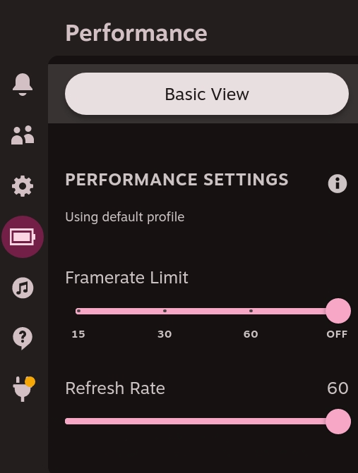
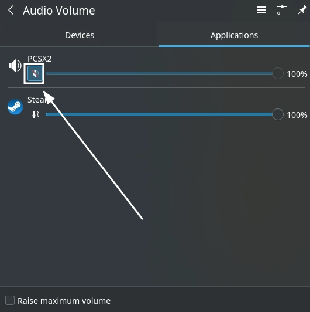

# Troubleshooting on SteamOS

[TOC]

***

## Have you tried restarting?

The classic IT solution, works more often than you think. 

Do note that switching between Desktop Mode and Game Mode **is not** a restart. Properly restart your device and see if the issue is resolved. 

***

## Is everything up to date?

***

It is recommended you keep emulators up to date. Update Flatpaks through Discover, AppImages/Binaries through the emulator's self-updater or through EmuDeck, and Windows Executables through EmuDeck.

It is recommended you monitor and **use the Discover store** to update any system libraries as well. Not updating these system libraries can cause Flatpak emulators to **stop working.**

For more information on updating and which emulators are Flatpaks, AppImages, Binaries, and Windows Executables, visit the [Updating](../../emudeck-maintenance/steamos/updating.md) page.

Notably, not updating a system library recently caused RetroArch to suddenly stop working. Read [RetroArch does not work anymore - April 30th, 2023](../../known-issues/steamos/index.md#retroarch-does-not-work-anymore---april-30th-2023) for more information. 

***

## Do you have the correct BIOS or ROM file types?

Visit the [Cheat Sheet](../../cheat-sheet.md) to learn which BIOS and ROM file types you need.

In some cases, `.7z` and `.zip` are **not** correct file formats.

***

## Performance or audio quality unexpectedly bad?

There may be a number of reasons for this, but your first debugging tool should be to ensure that the `Framerate limit` is off and that the `Refresh Rate` is set to 60. 

To find these options:

1. In Game Mode, press the QAM (`...` button)
    * You may need to open the game first to see if you created a per-game profile
2. Press the `Battery` icon
3. Select `Advanced View`
4. Scroll down and set te `Framerate Limit` to `Off` and `Refresh Rate` to 60
    * 

These are the recommended settings for emulated games. If you would like to change these settings, use the `Use per-game profile` toggle. This toggle will only apply these settings for the game currently open. 

***

## Are you playing in Desktop Mode?

Generally, it is recommended to use Game Mode to play your ROMs. However, if you are in Desktop Mode, make sure to hold the start button for 3 seconds to switch your controller configurations to gamepad configurations. 

With gamepad configurations enabled, your controls will work and you may also use combo hotkeys to exit out of a game. 

***

## Are your ROMs or BIOS valid?

Do you have a good ROM or BIOS dump? Corrupt, incomplete, or incorrect ROMs or BIOS can be a common reason why your game does not work. Transferring between two systems can be one reason for incomplete ROMs. If your ROM works on another machine, that **does not** mean it will work on the Steam Deck if the transfer was incomplete. 

Read [How to Verify ROMs](../../file-management/steamos/file-management.md#how-to-verify-roms) to learn how to verify your ROMs and BIOS.

***

## Game unexpectedly muted or missing audio?

Sometimes, games may accidentally mute themselves with no discernible reason. Fortunately, the fix is easy.

1. In Desktop Mode, open the emulator you use to launch the ROM
    * For example, if your ROM is a PlayStation 2 game, open PCSX2
2. Open your ROM
3. If the emulator launched in full screen, hold `R1` and press the `Select` button until you see the desktop or taskbar
4. Click the `Speaker` icon in your taskbar
5. Click the `Applications` tab
6. Click the `Speaker` icon below the application name to unmute the application
    * A red line through the `Speaker` icon indicates that it is muted. If there is no red line, that means there should be audio outputting from the emulator
    * 

***

## Have you tried resetting the emulator or tool through EmuDeck?

Sometimes after installing EmuDeck, you may notice an emulator's configurations were not set properly or you tweaked something on accident and you do not remember the default settings. 

You may reset an emulator's configurations in the `Manage Emulators` page. 

**Tutorial**

1. Open EmuDeck on your desktop.
2. Click the `Manage Emulators` button.
3. Select which emulator configurations you would like to reset in the drop-down menu.
4. Click `Reset configuration`, wait a moment.
    1. Using PCSX2 as an example: 
5. Your selected emulator has been reset.

***

## Have you checked out the various emulator and tool pages?

The wiki has a separate page for each emulator and tool installed by EmuDeck. You can find the emulator pages grouped under their company name on the sidebar. The tool pages can be found under the `Tools` section. Each emulator and tool page has various sections that may go into detail on your question. 

Don't forget, if a page is missing something, you may also contribute to the wiki. Learn how by visiting the [How to Contribute](../../how-to-contribute.md) page. 

***

## If you are using an external controller, have you re-arranged the controller order?

Read the [How to Re-Arrange the Controller Order](../../controls-and-hotkeys/steamos/external-controllers.md#how-to-re-arrange-the-controller-order) section on the External Controllers page to learn how. 

***

## Still stuck?

If none of the troubleshooting sections above worked for you, gather photos and a log so you can request support in EmuDeck's Discord or Reddit.

If you do not have an easy way of gathering photos, take a few photos with your phone. As long as the information can be captured, the quality of the photo does not matter!

### How to get the EmuDeck Log

#### Method 1

1. In `Desktop Mode`, open the EmuDeck application
2. Click `Fetch Log File`
3. Share the URL with the person providing you support 

#### Method 2

1. Open `$HOME/emudeck`
2. Right click `emudeck.log`, click `Share --> Pastebin...`
    * It may appear blank, you can see the full log by clicking the `raw` button on the Pastebin page
3. Share the Pastebin URL with the person providing you support
    * If you do not have a way of sharing URLs easily, share the alphanumerical string at the end of the URL with the person providing you support
        * You may need to type this manually, however the alphanumerical string is fairly short

***

### How to get the EmuDeck AppImage Log

1. Open `$HOME/emudeck`
2. Right click `EmuDeck.AppImage.log`, click `Share --> Pastebin...`
    * It may appear blank, you can see the full log by clicking the `raw` button on the Pastebin page
3. Share the Pastebin URL with the person providing you support
    * If you do not have a way of sharing URLs easily, share the alphanumerical string at the end of the URL with the person providing you support
        * You may need to type this manually, however the alphanumerical string is fairly short

***